# AI Conversation Flow

<cite>
**Referenced Files in This Document**
- [SKILL.md](file://.agents/skills/atlas-flight-booking/SKILL.md)
- [02-architecture.md](file://docs/plans/waypoint/02-architecture.md)
- [03-program-design.md](file://docs/plans/waypoint/03-program-design.md)
- [atlas-integration.md](file://docs/external/atlas-integration.md)
- [booking-workflow.md](file://.agents/skills/atlas-flight-booking/references/booking-workflow.md)
- [error-handling.md](file://.agents/skills/atlas-flight-booking/references/error-handling.md)
- [0003-advise-execute-two-gate-split.md](file://docs/adr/0003-advise-execute-two-gate-split.md)
- [0002-visa-rules-curated-approximation.md](file://docs/adr/0002-visa-rules-curated-approximation.md)
- [01-trip-disrupted.html](file://docs/plans/waypoint/mockups/01-trip-disrupted.html)
- [02-agent-recovering.html](file://docs/plans/waypoint/mockups/02-agent-recovering.html)
- [03-recovery-confirmed.html](file://docs/plans/waypoint/mockups/03-recovery-confirmed.html)
</cite>

## Table of Contents
1. [Introduction](#introduction)
2. [Project Structure](#project-structure)
3. [Core Components](#core-components)
4. [Architecture Overview](#architecture-overview)
5. [Detailed Component Analysis](#detailed-component-analysis)
6. [Dependency Analysis](#dependency-analysis)
7. [Performance Considerations](#performance-considerations)
8. [Troubleshooting Guide](#troubleshooting-guide)
9. [Conclusion](#conclusion)
10. [Appendices](#appendices)

## Introduction
This document explains the end-to-end conversation flow between the Waypoint application and AI services during trip disruption recovery. It covers how a disruption is detected, how legal alternatives are assembled, how the AI ranks options under business constraints, and how deterministic logic executes the final decision. It also documents input formatting for AI requests, response parsing, error handling patterns, separation of deterministic vs AI-driven decisions, and state management across multiple interactions within a single recovery workflow.

## Project Structure
Waypoint is organized into:
- Frontend (Next.js/React): three demo screens plus a live agent reasoning stream via SSE.
- Backend (Python FastAPI): recovery agent loop, rules engine, Atlas integration, Qwen calls, SQLite persistence.
- Atlas integration: forked skill used as an imported library with CLI-subprocess fallback; sandbox auto-approve for price/payment checkpoints.
- Rules engine: pluggable Rule interface with v1 rules for transit visa and passport validity. Data-backed by curated tables.

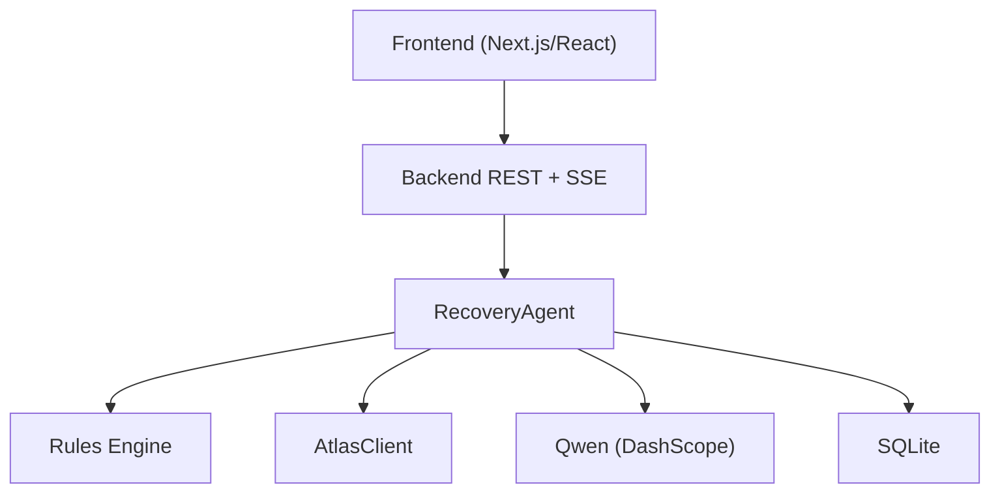

**Diagram sources**
- [02-architecture.md:13-30](file://docs/plans/waypoint/02-architecture.md#L13-L30)
- [03-program-design.md:10-31](file://docs/plans/waypoint/03-program-design.md#L10-L31)

**Section sources**
- [02-architecture.md:1-56](file://docs/plans/waypoint/02-architecture.md#L1-L56)
- [03-program-design.md:1-31](file://docs/plans/waypoint/03-program-design.md#L1-L31)

## Core Components
- RecoveryAgent: orchestrates the bounded recovery loop, enforces guards (step budget, re-read before write, outcome assertion), and manages execution wall.
- RerouteJudge: AI-powered ranking over all offers to pick the best executable option and produce a rationale.
- Rules Engine: deterministic checks (transit visa, passport validity) returning a three-state verdict per offer.
- AtlasClient: wraps search, verify, order creation, payment, and outcome assertion against the Atlas sandbox.
- Store: typed persistence for trips, segments, offers, rule_verdicts, decisions, orders.

Key responsibilities:
- Deterministic logic owns rules, fare-difference math, order/pay execution.
- AI owns only reroute judgment: rank legal options under price × time × layover and provide rationale.

**Section sources**
- [02-architecture.md:8-11](file://docs/plans/waypoint/02-architecture.md#L8-L11)
- [03-program-design.md:57-123](file://docs/plans/waypoint/03-program-design.md#L57-L123)

## Architecture Overview
The recovery flow is triggered by either an injected disruption or a real Atlas webhook. The agent reads current trip state, searches alternatives, applies rules, asks AI to rank legal options, verifies the chosen offer, executes order and payment deterministically, asserts ticketing outcome, and streams every step to the frontend.

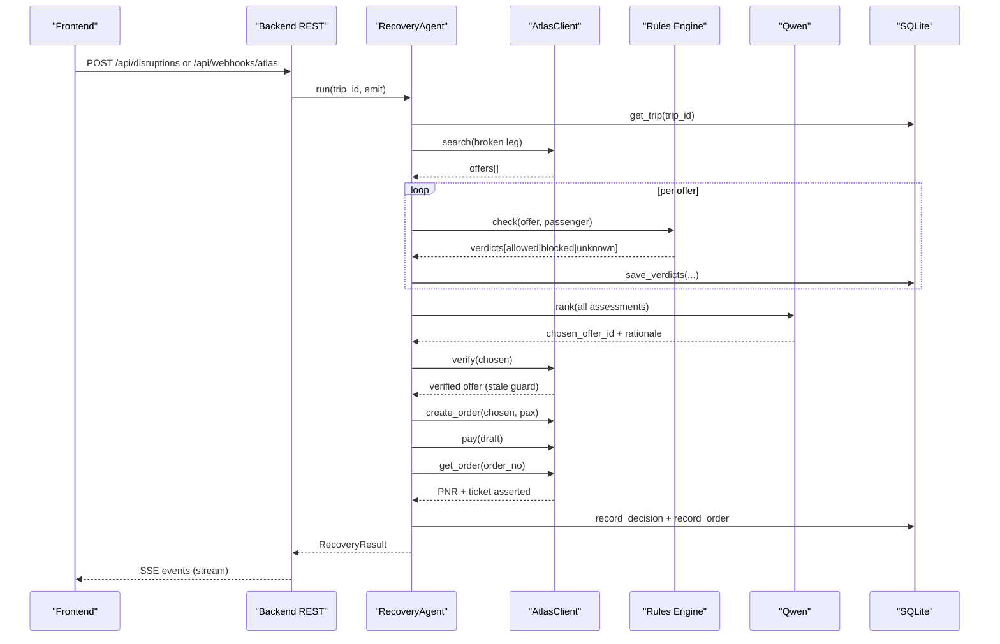

**Diagram sources**
- [02-architecture.md:34-49](file://docs/plans/waypoint/02-architecture.md#L34-L49)
- [03-program-design.md:125-149](file://docs/plans/waypoint/03-program-design.md#L125-L149)

## Detailed Component Analysis

### Trip Disruption Detection and Trigger
- Entry points:
  - Injected trigger: POST /api/disruptions marks a segment cancelled and starts recovery.
  - Real trigger: POST /api/webhooks/atlas receives an Atlas incident/webhook and starts recovery.
- State read: The agent always re-reads trip state from the database at the start of each step to avoid acting on stale cached data.

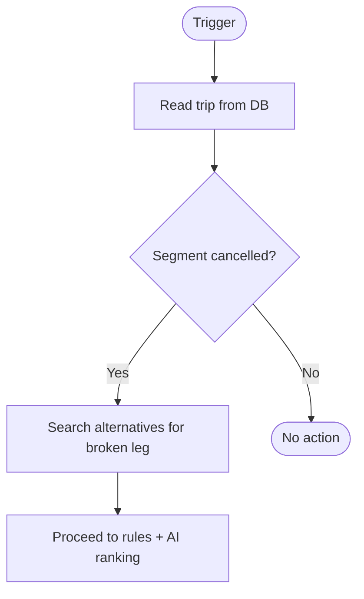

**Diagram sources**
- [02-architecture.md:13-19](file://docs/plans/waypoint/02-architecture.md#L13-L19)
- [02-architecture.md:34-41](file://docs/plans/waypoint/02-architecture.md#L34-L41)

**Section sources**
- [02-architecture.md:13-19](file://docs/plans/waypoint/02-architecture.md#L13-L19)
- [02-architecture.md:34-41](file://docs/plans/waypoint/02-architecture.md#L34-L41)

### Input Formatting for AI Requests
Before calling the AI, the backend assembles a structured context that includes:
- Passenger profile: name, passport country, expiry, document number, issuing country.
- Legal flight options: normalized offers with price, currency, total minutes, segments, price_status, bookable, and derived layovers.
- Business constraints: two-gate policy (advise open, execute fail-closed), freshness windows for visa rules, and any known blockers.

The RerouteJudge receives all OfferAssessments (offer + verdicts + executable flag) and returns a RankedDecision containing chosen_offer_id and rationale.

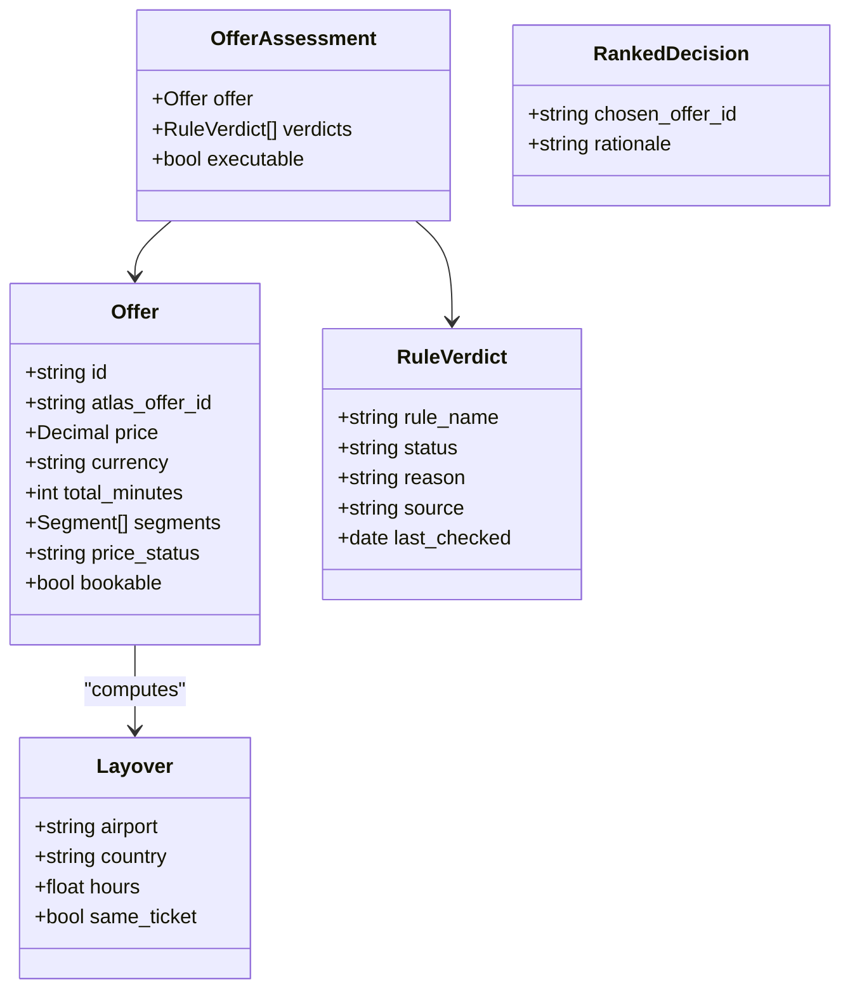

**Diagram sources**
- [03-program-design.md:71-104](file://docs/plans/waypoint/03-program-design.md#L71-L104)

**Section sources**
- [03-program-design.md:57-104](file://docs/plans/waypoint/03-program-design.md#L57-L104)

### AI-Powered Reroute Judgment
- Advise gate: The AI sees all options, including blocked/unknown ones, and narrates why it rejects risky choices.
- Execute gate: Only offers where every rule is allowed can be auto-executed. Code re-checks executability after AI picks.
- Ranking criteria: price, travel time, layover characteristics, and visa legality.

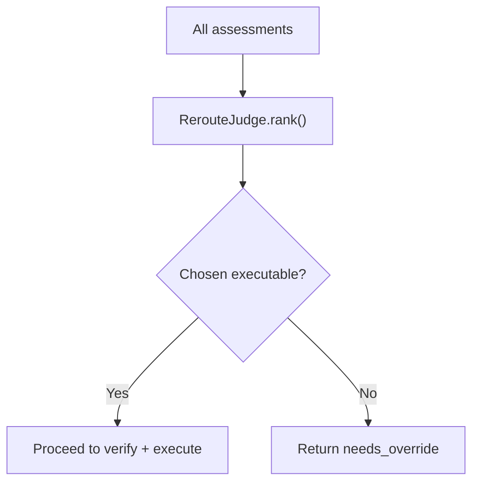

**Diagram sources**
- [03-program-design.md:97-114](file://docs/plans/waypoint/03-program-design.md#L97-L114)
- [0003-advise-execute-two-gate-split.md:1-19](file://docs/adr/0003-advise-execute-two-gate-split.md#L1-L19)

**Section sources**
- [03-program-design.md:97-114](file://docs/plans/waypoint/03-program-design.md#L97-L114)
- [0003-advise-execute-two-gate-split.md:1-19](file://docs/adr/0003-advise-execute-two-gate-split.md#L1-L19)

### Response Parsing Logic
- From AI: Extract chosen_offer_id and rationale. Validate that chosen_offer_id belongs to an executable assessment; if not, enforce needs_override.
- From Atlas: After verification, confirm price_status and bookable flags; handle price changes (unchanged/decreased/increased) per booking workflow.
- From order/pay/assert: Confirm PNR and ticket issuance before marking success.

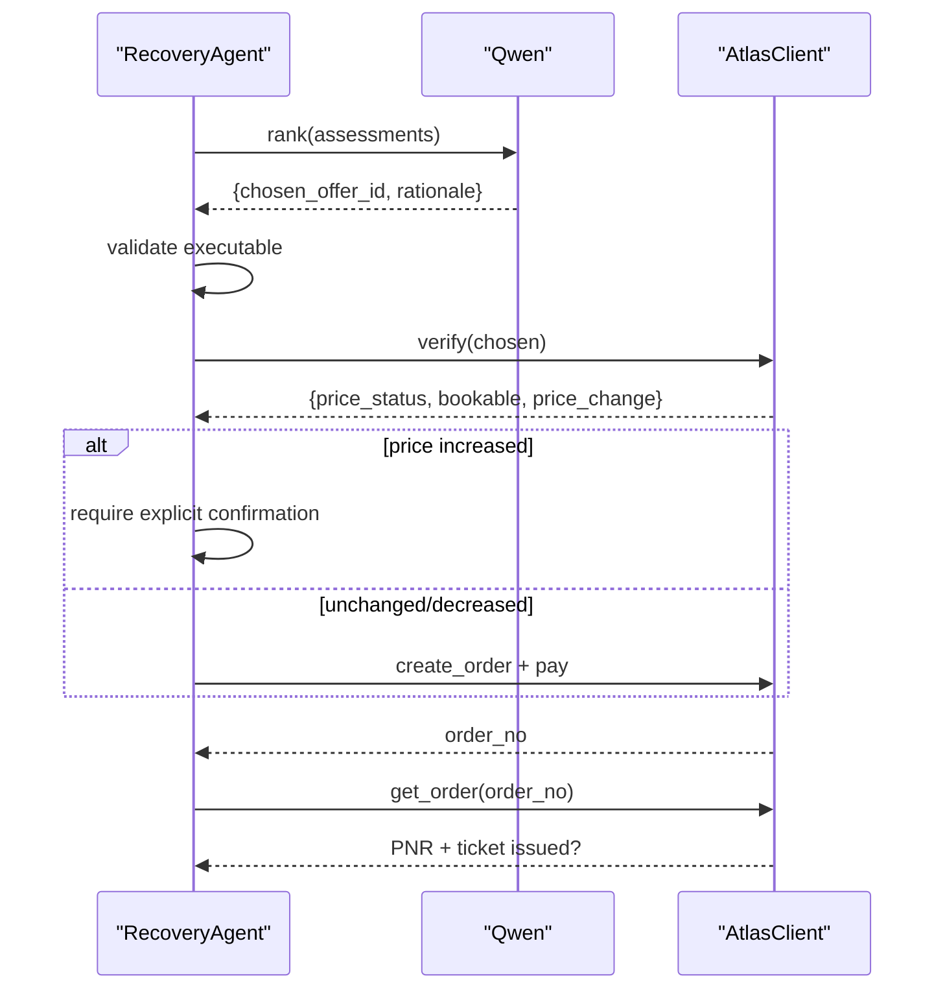

**Diagram sources**
- [03-program-design.md:125-149](file://docs/plans/waypoint/03-program-design.md#L125-L149)
- [booking-workflow.md:1-16](file://.agents/skills/atlas-flight-booking/references/booking-workflow.md#L1-L16)

**Section sources**
- [booking-workflow.md:1-16](file://.agents/skills/atlas-flight-booking/references/booking-workflow.md#L1-L16)
- [03-program-design.md:125-149](file://docs/plans/waypoint/03-program-design.md#L125-L149)

### Error Handling Patterns
- Malformed responses: Branch on stable codes, never parse messages. Normalize errors and present neutral user-facing output.
- Timeout scenarios: Treat service temporarily unavailable with at most one retry for read-only commands; do not retry side effects.
- Inconsistent AI decisions: Enforce executable check post-AI selection; if not executable, return needs_override without auto-execution.
- Staleness guard: Re-verify offers live before booking; if stale or expired, restart search or collect new inputs.

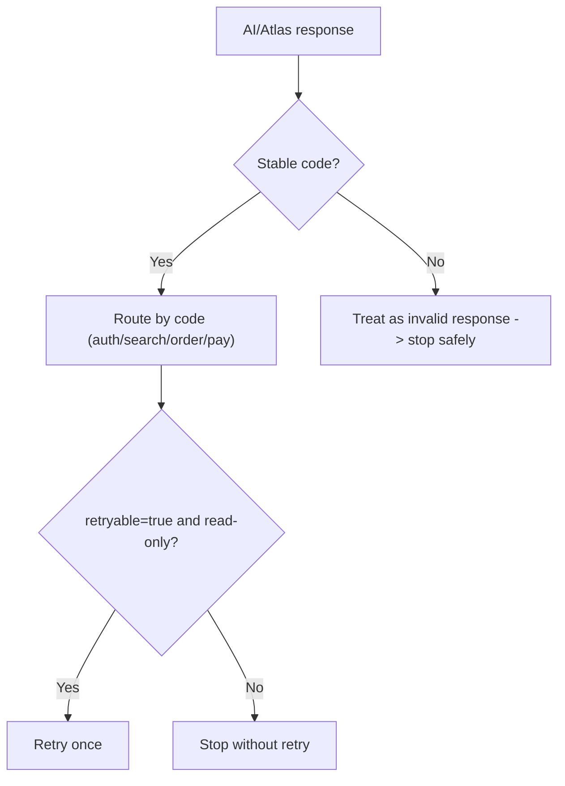

**Diagram sources**
- [error-handling.md:1-74](file://.agents/skills/atlas-flight-booking/references/error-handling.md#L1-L74)

**Section sources**
- [error-handling.md:1-74](file://.agents/skills/atlas-flight-booking/references/error-handling.md#L1-L74)

### Separation of Deterministic Logic and AI Decisions
- Deterministic: Visa/passport rules, fare-difference math, order/pay execution, outcome assertion.
- AI-driven: Option ranking and rationale generation.
- Two gates ensure safety: advise is open; execute is fail-closed.

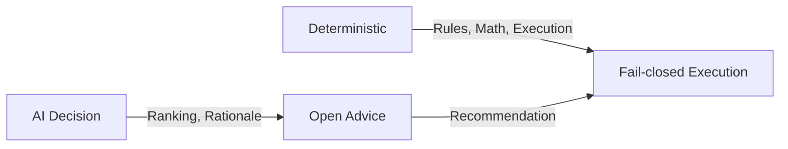

**Diagram sources**
- [02-architecture.md:8-11](file://docs/plans/waypoint/02-architecture.md#L8-L11)
- [0003-advise-execute-two-gate-split.md:1-19](file://docs/adr/0003-advise-execute-two-gate-split.md#L1-L19)

**Section sources**
- [02-architecture.md:8-11](file://docs/plans/waypoint/02-architecture.md#L8-L11)
- [0003-advise-execute-two-gate-split.md:1-19](file://docs/adr/0003-advise-execute-two-gate-split.md#L1-L19)

### Conversation State Management and Context Preservation
- Step budget: The agent loop is bounded; exceeding the budget triggers a graceful stop and request for human guidance.
- Re-read boundary: Each step re-reads trip state from the database; no reliance on cached world state.
- Persistence: Offers, rule verdicts, decisions, and orders are persisted to support auditability and resumption.
- Streaming: Every step emits events via SSE to keep the frontend synchronized with agent progress.

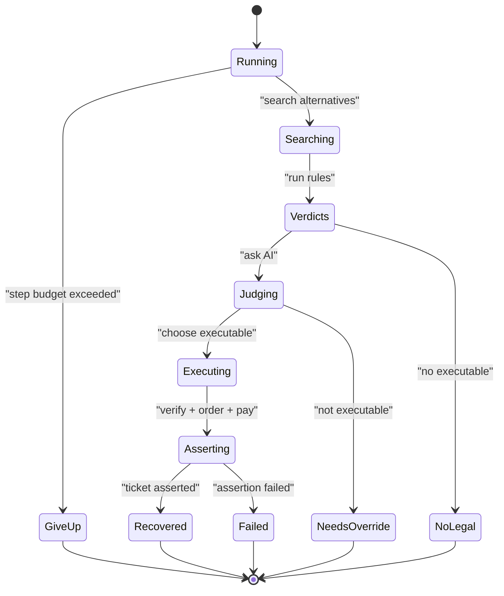

**Diagram sources**
- [03-program-design.md:106-149](file://docs/plans/waypoint/03-program-design.md#L106-L149)
- [02-architecture.md:34-49](file://docs/plans/waypoint/02-architecture.md#L34-L49)

**Section sources**
- [03-program-design.md:106-149](file://docs/plans/waypoint/03-program-design.md#L106-L149)
- [02-architecture.md:34-49](file://docs/plans/waypoint/02-architecture.md#L34-L49)

## Dependency Analysis
- Backend depends on:
  - AtlasClient for search/verify/order/pay/assert.
  - Rules Engine for deterministic eligibility.
  - Qwen for ranking and rationale.
  - SQLite for persistence and audit trail.
- Frontend depends on:
  - Backend REST endpoints for setup and queries.
  - SSE stream for live reasoning steps.

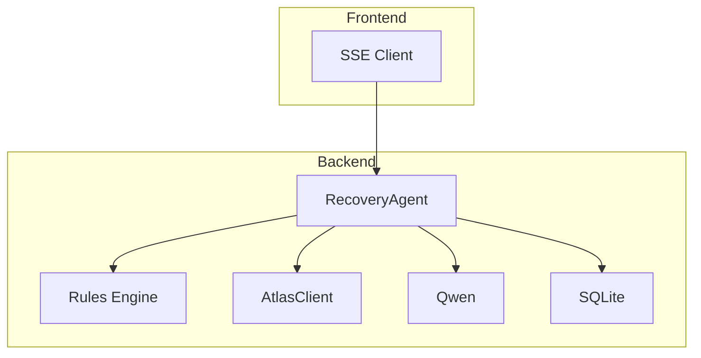

**Diagram sources**
- [02-architecture.md:13-30](file://docs/plans/waypoint/02-architecture.md#L13-L30)
- [03-program-design.md:10-31](file://docs/plans/waypoint/03-program-design.md#L10-L31)

**Section sources**
- [02-architecture.md:13-30](file://docs/plans/waypoint/02-architecture.md#L13-L30)
- [03-program-design.md:10-31](file://docs/plans/waypoint/03-program-design.md#L10-L31)

## Performance Considerations
- Minimize LLM calls: Only one ranking call per recovery attempt; deterministic steps avoid AI overhead.
- Reduce network latency: Batch rule checks per offer; cache curated data in memory.
- Guard against retries: Limit retries to one for read-only operations; avoid repeating side effects.
- Stream updates: Use SSE to offload UI rendering and keep users informed without polling.

[No sources needed since this section provides general guidance]

## Troubleshooting Guide
Common issues and resolutions:
- Authorization required or session missing: Follow auth flow; poll once after user confirms completion.
- Ticketing activation required: Present activation URL; wait for completion; re-check authorization before proceeding.
- Price increased during verification: Show old/new totals; obtain explicit confirmation before continuing.
- No legal option found: Surface reasons and stop gracefully; prompt for human override if needed.
- Service temporarily unavailable: Retry identical read-only command once; otherwise stop and report.
- Side-effect uncertainty: Query order status instead of replaying order creation or payment.

**Section sources**
- [error-handling.md:7-74](file://.agents/skills/atlas-flight-booking/references/error-handling.md#L7-L74)
- [booking-workflow.md:1-63](file://.agents/skills/atlas-flight-booking/references/booking-workflow.md#L1-L63)

## Conclusion
Waypoint’s conversation flow cleanly separates deterministic safeguards from AI-driven judgment. The system detects disruptions, assembles legal options, applies strict rules, asks AI to rank and justify choices, verifies and executes decisions deterministically, and asserts outcomes before completion. Robust error handling, step budgets, and persistent state ensure reliability and transparency throughout the recovery workflow.

[No sources needed since this section summarizes without analyzing specific files]

## Appendices

### User Interface Flow
- Screen 1: Trip disrupted — shows passenger profile, canceled leg, and downstream risk.
- Screen 2: Agent recovering — streams reasoning steps, shows options with verdicts, highlights chosen option.
- Screen 3: Recovery confirmed — compares rejected cheapest vs chosen legal, shows fare difference settlement and ticket assertion.

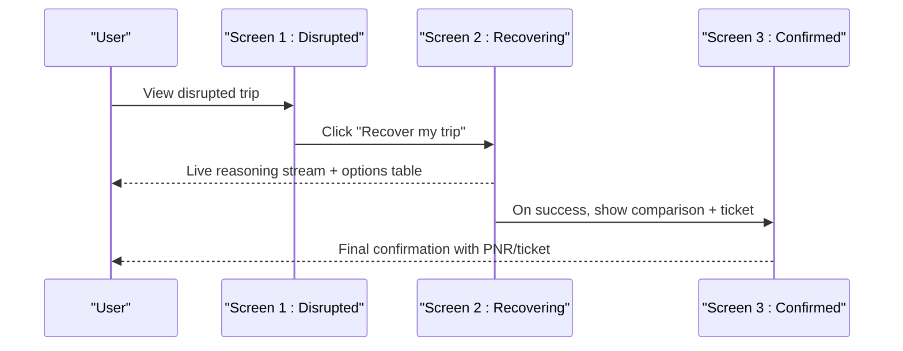

**Diagram sources**
- [01-trip-disrupted.html:27-48](file://docs/plans/waypoint/mockups/01-trip-disrupted.html#L27-L48)
- [02-agent-recovering.html:29-61](file://docs/plans/waypoint/mockups/02-agent-recovering.html#L29-L61)
- [03-recovery-confirmed.html:30-57](file://docs/plans/waypoint/mockups/03-recovery-confirmed.html#L30-L57)

**Section sources**
- [01-trip-disrupted.html:27-48](file://docs/plans/waypoint/mockups/01-trip-disrupted.html#L27-L48)
- [02-agent-recovering.html:29-61](file://docs/plans/waypoint/mockups/02-agent-recovering.html#L29-L61)
- [03-recovery-confirmed.html:30-57](file://docs/plans/waypoint/mockups/03-recovery-confirmed.html#L30-L57)