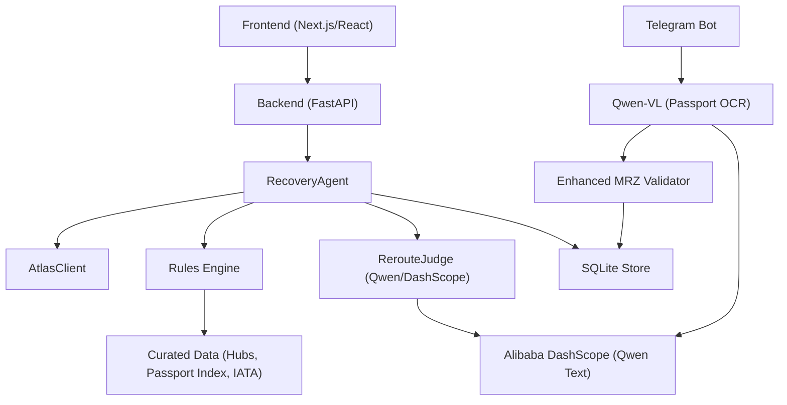

# AI Integration

<cite>
**Referenced Files in This Document**
- [02-architecture.md](file://docs/plans/waypoint/02-architecture.md)
- [03-program-design.md](file://docs/plans/waypoint/03-program-design.md)
- [04-slices.md](file://docs/plans/waypoint/04-slices.md)
- [0001-fork-atlas-skill-sandbox-auto-approve.md](file://docs/adr/0001-fork-atlas-skill-sandbox-auto-approve.md)
- [0002-visa-rules-curated-approximation.md](file://docs/adr/0002-visa-rules-curated-approximation.md)
- [0003-advise-execute-two-gate-split.md](file://docs/adr/0003-advise-execute-two-gate-split.md)
- [extract.py](file://backend/app/bot/extract.py)
- [handlers.py](file://backend/app/bot/handlers.py)
- [mrz.py](file://backend/app/bot/mrz.py)
- [test_mrz.py](file://backend/tests/test_mrz.py)
- [brain.py](file://backend/app/agent/brain.py)
- [auditor.py](file://backend/app/agent/auditor.py)
- [config.py](file://backend/app/config.py)
</cite>

## Update Summary
**Changes Made**
- Enhanced MRZ validation system with check-digit-gated filler-insertion repair system addressing vision model failures where interior filler characters ('<') are incorrectly dropped from line 2 of MRZ data
- Added comprehensive test coverage with 114 new lines covering various failure scenarios including exact incident reproduction, two-dropped-filler cases, and boundary conditions
- Implemented sophisticated normalization logic for Qwen-VL output variations with position-preserving transformations
- Enhanced error handling and fallback mechanisms for OCR failures with PII-safe logging throughout the pipeline
- Updated conversation flow to support multi-modal inputs with enhanced image processing capabilities and robust validation

## Table of Contents
1. Introduction
2. Project Structure
3. Core Components
4. Architecture Overview
5. Detailed Component Analysis
6. Dependency Analysis
7. Performance Considerations
8. Troubleshooting Guide
9. Conclusion

## Introduction
This document explains how the Waypoint system integrates AI for reroute judgment during flight disruptions using a **two-gates framework**, enhanced with **Waybot's Qwen-VL passport OCR capabilities**. The system uses Qwen via Alibaba DashScope exclusively for judgment calls in the **advise gate**, while deterministic code owns all settlement operations in the **execute gate**. Additionally, Waybot leverages Qwen-VL for passport OCR processing through DashScope's OpenAI-compatible endpoint, enabling seamless passport data extraction from photos with robust validation and PII-safe handling.

The two-gates design resolves the apparent contradiction between allowing AI to reason about all options (including risky ones) while maintaining absolute rule compliance for actual bookings. Qwen sees and narrates every alternative, but only fully legal offers proceed to autonomous booking. The passport OCR integration provides a robust fallback mechanism when manual entry is needed, ensuring traveler data accuracy through ICAO 9303 MRZ validation with comprehensive normalization for vision model outputs and sophisticated filler-insertion repair capabilities.

## Project Structure
Waypoint is organized into a frontend (Next.js/React) and a backend (Python FastAPI). The backend hosts:
- Recovery agent loop and orchestration with two-gates enforcement
- Rules engine with pluggable rules returning three-state verdicts
- Atlas integration for search, verification, ordering, and payment
- Qwen calls for reroute judgment (advise gate only)
- **Qwen-VL integration for passport OCR via DashScope's OpenAI-compatible endpoint with enhanced normalization and filler-insertion repair**
- **Comprehensive MRZ validation with check-digit-gated repair system, PII-safe logging, and extensive test coverage**
- SQLite persistence for auditability

Key architectural notes:
- **Advise gate (open)**: Qwen reasons over all offers including blocked/unknown options and generates narrative rationale
- **Execute gate (fail-closed)**: Only offers where every rule is `allowed` can be auto-booked; any blocked or unknown requires human override
- **Enhanced OCR pipeline**: Qwen-VL extracts MRZ lines from passport photos with normalization logic for vision model outputs, validated through ICAO 9303 check digits with sophisticated filler-insertion repair, with typed-entry fallback
- External integrations include Atlas sandbox and Qwen via DashScope; passport/visa/IATA data is bundled

**Section sources**
- [02-architecture.md:1-56](file://docs/plans/waypoint/02-architecture.md#L1-L56)
- [03-program-design.md:3-5](file://docs/plans/waypoint/03-program-design.md#L3-L5)

## Core Components
- **RerouteJudge**: The AI-driven component that ranks all assessed offers in the advise gate and selects the best executable option, providing narrative rationale for rejected options
- **RecoveryAgent**: Orchestrates the recovery workflow with strict two-gates enforcement, including search, rule evaluation, AI judgment, re-verification, ordering, payment, and outcome assertion
- **Rules Engine**: Pluggable rules (e.g., TransitVisaRule, PassportValidityRule) that evaluate each offer and return three-state verdicts (allowed/blocked/unknown) with reasons and provenance
- **AtlasClient**: Wraps the forked Atlas skill to search, verify, create orders, pay, and query order details
- **Enhanced Qwen-VL Passport OCR**: Extracts MRZ lines from passport photos using Qwen-VL models via DashScope's OpenAI-compatible endpoint with comprehensive normalization for vision model outputs and sophisticated filler-insertion repair
- **Robust MRZ Validator**: Deterministic validation of extracted passport data against ICAO 9303 standards with check-digit-gated filler-insertion repair, fail-closed behavior, PII-safe logging, and extensive edge case handling
- **Data loaders and store**: Load curated transit hub tables, passport matrices, IATA mappings, and persist verdicts, decisions, and orders

The separation between AI and deterministic logic is explicit and enforced:
- **Advise gate (open)**: Qwen sees all offers and narrates reasoning, including why cheaper illegal/unknown options are rejected
- **Execute gate (fail-closed)**: Code re-checks executability after LLM picks; only fully allowed offers proceed to booking
- **Enhanced OCR validation gate**: All extracted passport data must pass ICAO 9303 MRZ validation with normalization and filler-insertion repair before being accepted, with comprehensive PII-safe logging

**Section sources**
- [03-program-design.md:1-123](file://docs/plans/waypoint/03-program-design.md#L1-L123)
- [03-program-design.md:125-149](file://docs/plans/waypoint/03-program-design.md#L125-L149)
- [0003-advise-execute-two-gate-split.md:1-19](file://docs/adr/0003-advise-execute-two-gate-split.md#L1-L19)

## Architecture Overview
The end-to-end flow begins with a disruption trigger, proceeds through search and rule evaluation, invokes Qwen for judgment in the advise gate, then executes deterministic booking and settlement steps with strict guards in the execute gate. The enhanced passport OCR integration provides an additional input pathway for traveler data collection with robust normalization, filler-insertion repair, and validation.

```mermaid
sequenceDiagram
participant Client as "Frontend"
participant API as "FastAPI Routes"
participant Bot as "Telegram Bot"
participant Agent as "RecoveryAgent"
participant Atlas as "AtlasClient"
participant Judge as "RerouteJudge (Qwen)"
participant OCR as "Qwen-VL (Passport OCR)"
participant Validator as "MRZ Validator"
participant Store as "SQLite Store"
Client->>API : "POST /api/disruptions"
API->>Agent : "run(trip_id, emit)"
Agent->>Store : "get_trip(trip_id)"
Agent->>Atlas : "search(broken_leg...)"
Atlas-->>Agent : "[Offer]"
loop "for each offer"
Agent->>Agent : "check(offer, pax)"
Agent->>Store : "save_verdicts(...)"
end
Note over Agent,Judge : ADVISE GATE - Open reasoning
Agent->>Judge : "rank(assessments)"
Judge-->>Agent : "RankedDecision (chosen_offer_id, rationale)"
Note over Agent : EXECUTE GATE - Fail-closed enforcement
alt "chosen is executable"
Agent->>Atlas : "verify(chosen)"
Agent->>Atlas : "create_order(chosen, pax)"
Agent->>Atlas : "pay(draft)"
Agent->>Atlas : "get_order(order_no)"
Agent->>Store : "record_decision(...) ; record_order(...)"
Agent-->>API : "RecoveryResult (recovered)"
else "not executable or no legal option"
Agent-->>API : "RecoveryResult (needs_override/no_legal_option)"
end
Bot->>OCR : "extract_passport(image_bytes)"
OCR-->>Bot : "MRZ lines (normalized + repaired)"
Bot->>Validator : "validate(mrz_line1, mrz_line2)"
Validator-->>Bot : "MrzFields or None (PII-safe logging)"
alt "validation passes"
Bot->>Store : "add_traveler(validated_fields)"
else "validation fails"
Bot->>Bot : "fallback to typed entry"
end
API-->>Client : "SSE stream of steps + final result"
```

**Diagram sources**
- [02-architecture.md:13-55](file://docs/plans/waypoint/02-architecture.md#L13-L55)
- [03-program-design.md:125-149](file://docs/plans/waypoint/03-program-design.md#L125-L149)
- [extract.py:44-99](file://backend/app/bot/extract.py#L44-L99)
- [mrz.py:277-314](file://backend/app/bot/mrz.py#L277-L314)

**Section sources**
- [02-architecture.md:13-55](file://docs/plans/waypoint/02-architecture.md#L13-L55)
- [03-program-design.md:125-149](file://docs/plans/waypoint/03-program-design.md#L125-L149)

## Detailed Component Analysis

### RerouteJudge (AI-driven reroute judgment in Advise Gate)
Responsibilities:
- Accepts all OfferAssessment objects (including blocked/unknown) at the advise gate
- Uses Qwen via DashScope to rank legal options based on price, total travel time, and layover characteristics
- Returns a RankedDecision containing the chosen executable offer ID and a rationale that explains rejected options

Design principles:
- **Open advice**: Qwen reasons over all options and narrates why cheaper illegal/unknown ones are rejected
- **Fail-closed execution**: Code re-checks executability after the LLM picks; only fully allowed offers proceed to booking

Prompt engineering strategy:
- Input structure: Provide structured summaries of each offer (price, currency, total minutes, segments, layovers), plus passenger context (passport country, expiry). Include rule verdicts per offer with reasons
- Decision criteria: Explicitly instruct the model to prefer legal options; among legal ones, optimize for lower price, shorter total time, and reasonable layover durations
- Output format: Require a JSON-like decision with chosen_offer_id and rationale; mandate referencing specific rejected offers and their blocking reasons
- Safety constraints: Instruct the model not to recommend blocked or unknown options for execution; emphasize fail-closed behavior

Error handling:
- If Qwen returns malformed output, fall back to deterministic selection (cheapest executable) and log the incident
- If Qwen is unavailable, use deterministic fallback and continue the pipeline without AI narration

Cost optimization:
- Prompt caching: Cache repeated prompts for similar trip contexts and offer sets to reduce token usage
- Response filtering: Parse minimal fields from the model response to avoid unnecessary processing overhead
- Rate limiting: Throttle requests to DashScope to stay within quotas and avoid throttling errors

Model selection and version management:
- Use a stable model identifier for consistency; pin versions in configuration
- Maintain a registry mapping environment (sandbox vs production) to model IDs and parameters
- A/B test different models if needed, but keep production pinned until validated

**Section sources**
- [03-program-design.md:97-104](file://docs/plans/waypoint/03-program-design.md#L97-L104)
- [04-slices.md:19-21](file://docs/plans/waypoint/04-slices.md#L19-L21)
- [02-architecture.md:11-11](file://docs/plans/waypoint/02-architecture.md#L11-L11)

### Enhanced Qwen-VL Passport OCR Integration
**Updated** Enhanced with comprehensive normalization logic for vision model outputs, PII-safe logging throughout the OCR pipeline, and sophisticated filler-insertion repair capabilities.

Responsibilities:
- Extract MRZ (Machine Readable Zone) lines from passport photos using Qwen-VL models with robust normalization for vision model outputs and check-digit-gated filler-insertion repair
- Process base64-encoded image data through DashScope's OpenAI-compatible chat completions endpoint
- Return normalized MRZ line data for deterministic validation by the MRZ validator with automatic repair of common vision model failures
- Support configurable model selection via environment variables (WAYBOT_VL_MODEL, default qwen-vl-max)
- Implement comprehensive PII-safe logging that never exposes sensitive passport data

Technical implementation:
- **Transport pattern**: Mirrors brain.py's httpx/DashScope transport pattern for consistency
- **Endpoint**: Uses DashScope's OpenAI-compatible endpoint (`/compatible-mode/v1/chat/completions`)
- **Image handling**: Encodes passport photos as base64 data URLs for multimodal processing with size limits (10MB default)
- **Timeout**: 30-second timeout for OCR extraction to prevent hanging requests
- **Security**: Image bytes are never persisted or logged; only processed in memory with comprehensive PII protection

Enhanced normalization features:
- **Whitespace mapping**: Converts spaces to '<' characters while preserving position integrity
- **Case normalization**: Uppercases all characters for consistent processing
- **Padding handling**: Automatically pads short lines to 44 characters with '<' fillers
- **Trailing filler tolerance**: Handles extra trailing '<' characters gracefully
- **Position preservation**: Maintains exact field positions to preserve check digit validity
- **Filler-insertion repair**: Sophisticated algorithm that proposes '<'-insertion candidates for short line 2 strings, gated entirely by ICAO check digits to ensure safety

Error handling and fallback:
- **Graceful degradation**: OCR failures automatically fall back to typed entry mode
- **Size limits**: Enforces maximum photo size (10MB default) to prevent abuse and resource exhaustion
- **Validation gate**: All extracted data must pass ICAO 9303 MRZ validation with filler-insertion repair before acceptance
- **User feedback**: Clear error messages guide users through alternative data entry methods
- **PII-safe logging**: Comprehensive logging that never exposes sensitive passport information

Configuration:
- **DASHSCOPE_BASE_URL**: Configurable endpoint URL (defaults to workspace-specific domain)
- **WAYBOT_VL_MODEL**: Model selection (default: qwen-vl-max)
- **MAX_PHOTO_BYTES**: Size limit enforcement (default: 10MB)

**Section sources**
- [extract.py:1-100](file://backend/app/bot/extract.py#L1-L100)
- [handlers.py:187-218](file://backend/app/bot/handlers.py#L187-L218)

### Enhanced MRZ Validation Pipeline
**Updated** Comprehensive passport data validation following ICAO 9303 standards with sophisticated check-digit-gated filler-insertion repair system and PII-safe logging.

Components:
- **ICAO 9303 TD3 Parser**: Parses standard passport MRZ format (two 44-character lines) with enhanced error handling and sophisticated repair capabilities
- **Check Digit Validation**: Implements 7-3-1 cyclic weight algorithm for MRZ integrity verification with comprehensive logging and repair gating
- **Field Validation**: Validates dates, nationalities, gender codes, and document numbers with business rule enforcement
- **Fail-Closed Design**: Any validation failure triggers fallback to typed entry mode with detailed logging
- **Vision Model Normalization**: Specialized normalization for Qwen-VL output variations including whitespace handling, padding, and sophisticated filler-insertion repair

Enhanced normalization and repair logic:
- **Position-preserving transformation**: Maps whitespace to '<' without deleting characters to maintain field alignment and check digit validity
- **Multi-form candidate generation**: Attempts multiple normalized forms to handle various OCR output patterns
- **Trailing filler tolerance**: Safely handles extra trailing '<' characters in both lines
- **Space-as-filler support**: Recognizes spaces as valid fillers in addition to '<' characters
- **Name token preservation**: Maintains proper spacing between name tokens to prevent PII corruption
- **Check-digit-gated filler-insertion repair**: Sophisticated algorithm that proposes '<'-insertion candidates for short line 2 strings (42-43 chars), restricted to personal-number field window (columns 28+) and gated entirely by ICAO check digits to ensure safety

Advanced repair capabilities:
- **Single filler repair**: Handles one dropped '<' character from interior filler run
- **Two-filler repair**: Handles two dropped '<' characters with combination enumeration
- **Mixed content repair**: Handles combinations of spaces and missing '<' characters
- **Bounded enumeration**: Limits repair attempts to 150 candidates maximum for performance
- **Safety guarantees**: Repair only applies to line 2 (which has check digits); line 1 never receives fabricated content

Validation rules:
- **Structural checks**: Line lengths, field positions, and character set validation with comprehensive error reporting
- **Check digit verification**: Four separate check digits (document number, DOB, expiry, composite) with detailed mismatch logging
- **Date validation**: Real calendar date checking with century pivot logic and future birthday rejection
- **Nationality mapping**: ISO-3 to ISO-2 country code conversion with curated CSV lookup and alias code support
- **Business rules**: Future birthday rejection, expired passport detection, gender code validation, and document number cleanup

Fallback mechanisms:
- **Typed entry**: When OCR fails, users can manually enter passport details with identical validation gates
- **Same validation gates**: Typed entry undergoes identical validation as OCR results ensuring consistency
- **Consistent UX**: Both paths provide the same confirmation interface and error handling
- **PII-safe logging**: Comprehensive logging that never exposes raw passport data or sensitive information

**Section sources**
- [mrz.py:1-491](file://backend/app/bot/mrz.py#L1-L491)
- [test_mrz.py:1-547](file://backend/tests/test_mrz.py#L1-L547)

### RecoveryAgent (orchestration with two-gates enforcement)
Responsibilities:
- Re-reads trip state before acting
- Searches for alternatives via Atlas
- Runs rules on each offer and persists verdicts
- Invokes RerouteJudge in the advise gate to select the best executable option
- Enforces execute gate by re-verifying price and availability before booking
- Executes deterministic order creation, payment, and outcome assertion
- Emits every step via SSE to the frontend

Two-gates enforcement:
- **Advise gate**: All assessments are passed to Qwen for reasoning, regardless of rule status
- **Execute gate**: Code explicitly checks `executable` flag before proceeding with booking; blocked/unknown options require human override

Guards:
- Step budget: Limits the number of loop iterations to prevent runaway processes
- Stale guard: Re-verify chosen offer live before booking; handle price changes
- Outcome assertion: Confirm PNR and ticket issuance before marking success

Deterministic vs AI separation:
- Deterministic code owns rules, fare-difference math, and payment execution
- AI owns only reroute judgment and rationale generation

**Section sources**
- [03-program-design.md:106-123](file://docs/plans/waypoint/03-program-design.md#L106-L123)
- [03-program-design.md:125-149](file://docs/plans/waypoint/03-program-design.md#L125-L149)
- [02-architecture.md:34-49](file://docs/plans/waypoint/02-architecture.md#L34-L49)

### Rules Engine (deterministic legality checks)
Components:
- Rule protocol and verdicts: Each rule returns a three-state verdict (allowed/blocked/unknown) with reason and provenance
- TransitVisaRule: Evaluates transit requirements using curated hub data and tourist-entry fallback; applies freshness windows to treat stale cells as unknown
- PassportValidityRule: Checks passport validity thresholds

Fail-closed policy:
- Missing or stale data resolves to unknown, which blocks autonomous execution
- Ticket structure influences messaging but never flips verdicts

Data:
- Curated transit hubs table with airside zone flags, nationality-specific rules, max hours, source, and last_checked timestamps
- Passport index CSV for entry fallback
- IATA to country mapping for layover countries

**Section sources**
- [03-program-design.md:57-96](file://docs/plans/waypoint/03-program-design.md#L57-L96)
- [0002-visa-rules-curated-approximation.md:1-25](file://docs/adr/0002-visa-rules-curated-approximation.md#L1-L25)

### Atlas Integration (search, verify, order, pay, assert)
Capabilities:
- Search: Find alternative itineraries for broken legs
- Verify: Re-check current price and seat availability before booking
- Create order: Generate an order draft for the chosen offer
- Pay: Execute payment; sandbox mode supports auto-approval for demo autonomy
- Query order: Assert PNR and ticket issuance to confirm successful recovery

Sandbox considerations:
- Auto-approve payment in sandbox only; production retains human checkpoints
- No real charges in sandbox; safe for end-to-end demo flows

**Section sources**
- [03-program-design.md:116-123](file://docs/plans/waypoint/03-program-design.md#L116-L123)
- [0001-fork-atlas-skill-sandbox-auto-approve.md:1-21](file://docs/adr/0001-fork-atlas-skill-sandbox-auto-approve.md#L1-L21)

### Enhanced Conversation Flow (AI service ↔ application)
**Updated** Enhanced to support multi-modal inputs including passport photos with comprehensive OCR processing, sophisticated normalization, and PII-safe handling.

Input formatting:
- Summarize offers with price, currency, total minutes, segments, layovers, and rule verdicts
- Include passenger profile (passport country, expiry) for context
- Specify decision criteria: prioritize legal options; among legal, optimize price/time/layover
- **Multi-modal support**: Handle both text-based queries and image uploads for passport OCR with size limits, validation, and sophisticated normalization

Response parsing:
- Expect structured output with chosen_offer_id and rationale
- Validate presence of required fields; reject malformed responses
- **OCR response handling**: Parse JSON objects containing MRZ line data from Qwen-VL responses with comprehensive normalization and filler-insertion repair

Error handling:
- On parse failure or network error, fall back to deterministic selection and log the incident
- Emit user-visible messages explaining temporary AI unavailability and deterministic behavior
- **OCR fallback**: When passport OCR fails, seamlessly transition to typed entry mode with clear guidance
- **PII-safe logging**: Comprehensive error logging that never exposes sensitive passport information

Streaming:
- Emit each step (search results, rule verdicts, AI rationale, verification, order, payment, assertion) via SSE to the frontend for live visibility
- **Photo processing updates**: Stream OCR progress and validation status to users with appropriate privacy controls

**Section sources**
- [02-architecture.md:13-19](file://docs/plans/waypoint/02-architecture.md#L13-L19)
- [03-program-design.md:125-149](file://docs/plans/waypoint/03-program-design.md#L125-L149)

### Cost Optimization Approaches
- Prompt caching: Cache prompts for recurring trip patterns and offer structures to reduce token consumption
- Response filtering: Extract only necessary fields from model outputs to minimize downstream processing
- Rate limiting: Implement request throttling to DashScope to respect quotas and avoid throttling errors
- Model routing: Route simple cases to smaller/faster models; reserve larger models for complex scenarios
- Batch operations: Where possible, batch multiple assessments into a single call to reduce overhead
- **OCR optimization**: Limit image sizes, implement efficient base64 encoding, cache common passport formats, and process images in streaming fashion
- **Memory management**: Process images in streaming fashion to avoid loading entire files into memory
- **PII-safe logging**: Optimize logging to avoid storing sensitive data while maintaining debugging capability
- **Repair efficiency**: Leverage bounded enumeration (150 candidates max) and check-digit gating to minimize computational overhead

### Separation of AI and Deterministic Logic
- **AI (RerouteJudge)**: Ranks legal options and generates rationale in the advise gate; does not execute bookings or payments
- **AI (Qwen-VL)**: Extracts passport data from images with normalization and filler-insertion repair; makes no trust decisions about data validity
- **Deterministic logic**: Owns rules checks, fare-difference calculations, order creation, payment execution, MRZ validation with sophisticated repair, and outcome assertion in the execute gate
- **Two gates**:
  - **Advise gate (open)**: AI reasons over all options and narrates choices, including rejected illegal/unknown options
  - **Execute gate (fail-closed)**: Only fully allowed offers proceed to autonomous booking; blocked/unknown require human override
  - **Enhanced OCR validation gate**: All extracted passport data must pass deterministic MRZ validation with normalization and filler-insertion repair before acceptance

**Section sources**
- [02-architecture.md:11-11](file://docs/plans/waypoint/02-architecture.md#L11-L11)
- [0003-advise-execute-two-gate-split.md:1-19](file://docs/adr/0003-advise-execute-two-gate-split.md#L1-L19)

### Model Selection, Version Management, and Fallbacks
**Updated** Enhanced to include Qwen-VL models for vision tasks alongside text models with comprehensive normalization and repair support.

Model selection:
- **Text models**: Choose stable models suitable for structured reasoning and concise outputs (qwen-plus, qwen-turbo)
- **Vision models**: Select appropriate Qwen-VL models for OCR tasks (qwen-vl-max, qwen-vl-plus) with normalization and repair capabilities
- **Environment-specific routing**: Different models for development, staging, and production environments
- Pin versions in configuration for consistency across deployments

Version management:
- Maintain a registry mapping environments to model IDs and parameters
- Update versions cautiously and validate outcomes before production deployment
- Support environment variable overrides for testing and rollback scenarios
- Track model performance metrics to inform future model selection decisions

Fallbacks:
- When Qwen/DashScope is unavailable or returns invalid responses, revert to deterministic selection (cheapest executable) and continue the pipeline
- **Enhanced OCR fallback**: Automatically transition to typed entry mode when passport OCR fails with comprehensive error handling and sophisticated repair attempts
- Log incidents and notify operators of degraded service conditions with PII-safe logging
- Maintain consistent user experience across all fallback scenarios

**Section sources**
- [02-architecture.md:51-55](file://docs/plans/waypoint/02-architecture.md#L51-L55)
- [03-program-design.md:97-104](file://docs/plans/waypoint/03-program-design.md#L97-L104)

## Dependency Analysis
High-level dependencies:
- Frontend depends on backend REST endpoints and SSE streams
- Backend depends on:
  - AtlasClient for search, verification, ordering, payment, and order status
  - Rules Engine for deterministic legality checks
  - RerouteJudge (Qwen via DashScope) for AI-driven reroute judgment in advise gate
  - **Enhanced Qwen-VL (DashScope) for passport OCR processing with normalization and filler-insertion repair**
  - **Robust MRZ Validator for deterministic passport data validation with sophisticated repair and PII-safe logging**
  - SQLite Store for persistence of verdicts, decisions, and orders



**Diagram sources**
- [02-architecture.md:1-56](file://docs/plans/waypoint/02-architecture.md#L1-L56)
- [03-program-design.md:1-123](file://docs/plans/waypoint/03-program-design.md#L1-L123)
- [extract.py:71-99](file://backend/app/bot/extract.py#L71-L99)
- [mrz.py:277-314](file://backend/app/bot/mrz.py#L277-L314)

**Section sources**
- [02-architecture.md:1-56](file://docs/plans/waypoint/02-architecture.md#L1-L56)
- [03-program-design.md:1-123](file://docs/plans/waypoint/03-program-design.md#L1-L123)

## Performance Considerations
- Minimize LLM calls: Cache prompts and reuse responses for similar inputs
- Reduce payload size: Send concise offer summaries and structured verdicts to the model
- Stream results: Use SSE to provide incremental updates and improve perceived performance
- Limit retries: Implement exponential backoff with bounded retries for external calls
- Optimize database queries: Index frequently accessed fields (trip_id, offer_id) for faster lookups
- **Enhanced OCR optimization**: Enforce image size limits, implement efficient base64 encoding, cache common passport formats, and process images in streaming fashion
- **Memory management**: Process images in streaming fashion to avoid loading entire files into memory
- **PII-safe logging**: Optimize logging to avoid storing sensitive data while maintaining debugging capability
- **Normalization efficiency**: Leverage position-preserving transformations to minimize computational overhead
- **Repair optimization**: Use bounded enumeration (150 candidates max) and check-digit gating to minimize computational overhead while ensuring safety

## Troubleshooting Guide
Common issues and resolutions:
- **Qwen/DashScope unavailable**:
  - Symptom: AI judgment fails or times out
  - Resolution: Fall back to deterministic selection; log the incident; continue pipeline; inform users of temporary AI unavailability
- **Malformed model response**:
  - Symptom: Parsing fails due to unexpected output format
  - Resolution: Enforce strict schema validation; revert to deterministic selection; log and alert
- **Stale visa data**:
  - Symptom: Curated cell past freshness window leads to unknown verdict
  - Resolution: Treat as blocked for execution; require human override; display provenance and last_checked date
- **Price change during verification**:
  - Symptom: Verified price differs from reference price
  - Resolution: Log old/new prices; proceed with deterministic settlement; emit updated fare difference to UI
- **Payment failures**:
  - Symptom: Payment endpoint returns error
  - Resolution: Retry with backoff; surface error to user; halt autonomous flow and require manual intervention
- **Enhanced OCR failures**:
  - Symptom: Qwen-VL cannot extract MRZ lines or validation fails despite normalization and repair
  - Resolution: Fall back to typed entry mode; provide clear instructions for manual data entry; log OCR failure details with PII-safe logging
- **Large image uploads**:
  - Symptom: Photo exceeds size limits or causes memory issues
  - Resolution: Enforce size limits; provide guidance on optimal image sizes; implement compression if needed
- **Normalization and repair issues**:
  - Symptom: Vision model outputs don't match expected MRZ format despite normalization and repair
  - Resolution: Enhanced normalization handles whitespace, padding, and case variations; sophisticated filler-insertion repair addresses dropped interior '<' characters; fallback to typed entry if repair fails
- **PII exposure concerns**:
  - Symptom: Sensitive passport data appearing in logs or error messages
  - Resolution: All logging is PII-safe; sensitive data is masked or omitted; review logging configuration
- **Filler-insertion repair failures**:
  - Symptom: Short line 2 strings with dropped '<' characters fail validation despite repair attempts
  - Resolution: Check if the issue involves deleted real content (not just filler); repair only handles dropped '<' in personal-number field window; fallback to typed entry when repair cannot safely reconstruct data

**Section sources**
- [03-program-design.md:50-56](file://docs/plans/waypoint/03-program-design.md#L50-L56)
- [03-program-design.md:125-149](file://docs/plans/waypoint/03-program-design.md#L125-L149)

## Conclusion
Waypoint's AI integration centers on a clear separation between AI-driven reroute judgment and deterministic execution through a robust two-gates framework, significantly enhanced with comprehensive passport OCR capabilities via Qwen-VL. The RerouteJudge leverages Qwen via DashScope exclusively for judgment calls in the advise gate, ranking legal alternatives and producing transparent rationales, while robust rules and guards ensure safety and compliance in the execute gate.

The enhanced Waybot Qwen-VL passport OCR integration provides a seamless user experience for traveler data collection, featuring sophisticated normalization logic for vision model outputs, comprehensive PII-safe logging, and advanced filler-insertion repair capabilities that address critical vision model failures where interior filler characters are incorrectly dropped. The robust MRZ validation ensures data accuracy and security through ICAO 9303 standards with sophisticated repair mechanisms, fail-closed behavior, and graceful fallback mechanisms.

By adopting prompt caching, response filtering, rate limiting, careful model versioning, comprehensive fallback mechanisms, and enhanced normalization techniques including sophisticated filler-insertion repair, the system balances performance, cost, and reliability across both text-based reasoning and vision-based OCR tasks. The enhanced PII-safe logging ensures operational visibility without compromising data security.

The two-gate design (open advise, fail-closed execute) combined with the enhanced OCR validation gate ensures that AI enhances decision-making without compromising operational safety, resolving the fundamental tension between transparent AI reasoning and strict rule compliance. The modular architecture allows for easy extension to additional AI capabilities while maintaining the core principle that critical business logic remains deterministic and auditable.

**Section sources**
- [test_mrz.py:1-547](file://backend/tests/test_mrz.py#L1-L547)
- [mrz.py:103-140](file://backend/app/bot/mrz.py#L103-L140)
- [extract.py:1-100](file://backend/app/bot/extract.py#L1-L100)