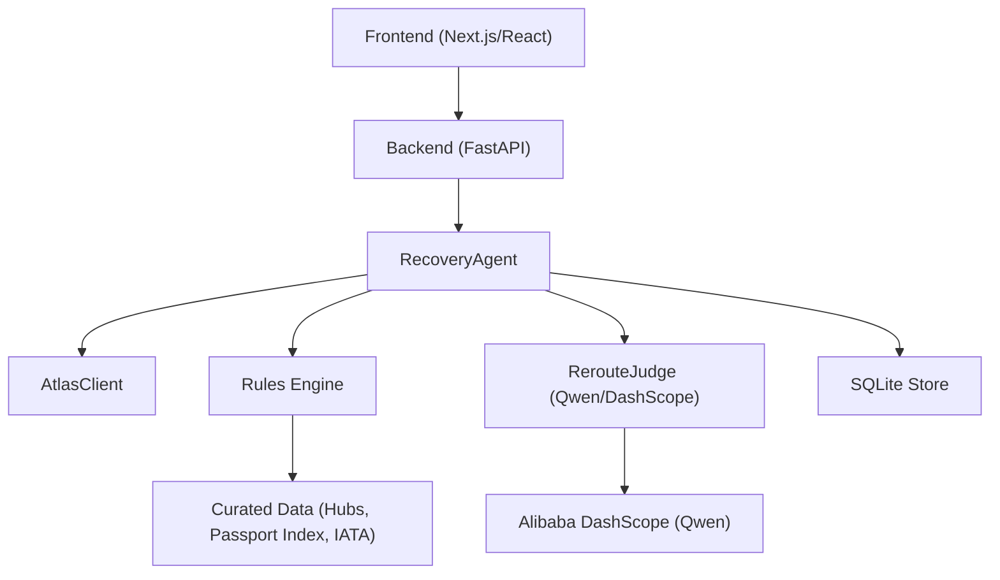

# AI Integration

<cite>
**Referenced Files in This Document**
- [02-architecture.md](file://docs/plans/waypoint/02-architecture.md)
- [03-program-design.md](file://docs/plans/waypoint/03-program-design.md)
- [04-slices.md](file://docs/plans/waypoint/04-slices.md)
- [0001-fork-atlas-skill-sandbox-auto-approve.md](file://docs/adr/0001-fork-atlas-skill-sandbox-auto-approve.md)
- [0002-visa-rules-curated-approximation.md](file://docs/adr/0002-visa-rules-curated-approximation.md)
- [0003-advise-execute-two-gate-split.md](file://docs/adr/0003-advise-execute-two-gate-split.md)
- [loop.py](file://backend/app/agent/loop.py)
- [fixture.py](file://backend/app/fixture.py)
- [models.py](file://backend/app/models.py)
</cite>

## Update Summary
**Changes Made**
- Updated to reflect the two-gates framework implementation where Qwen owns judgment calls in the advise gate while deterministic code handles execute gate for settlement operations
- Enhanced the RerouteJudge component documentation to emphasize the clear separation between AI reasoning and deterministic execution
- Updated conversation flow to reflect the current Slice 2 implementation with planned future enhancements
- Added detailed explanation of the fail-closed execute gate mechanism
- Updated model selection and fallback strategies to align with the two-gates architecture

## Table of Contents
1. Introduction
2. Project Structure
3. Core Components
4. Architecture Overview
5. Detailed Component Analysis
6. Dependency Analysis
7. Performance Considerations
8. Troubleshooting Guide
9. Conclusion

## Introduction
This document explains how the Waypoint system integrates AI for reroute judgment during flight disruptions using a **two-gates framework**. The system uses Qwen via Alibaba DashScope exclusively for judgment calls in the **advise gate**, while deterministic code owns all settlement operations in the **execute gate**. This separation ensures that AI reasoning remains transparent and explainable, while operational safety is maintained through fail-closed deterministic execution.

The two-gates design resolves the apparent contradiction between allowing AI to reason about all options (including risky ones) while maintaining absolute rule compliance for actual bookings. Qwen sees and narrates every alternative, but only fully legal offers proceed to autonomous booking.

## Project Structure
Waypoint is organized into a frontend (Next.js/React) and a backend (Python FastAPI). The backend hosts:
- Recovery agent loop and orchestration with two-gates enforcement
- Rules engine with pluggable rules returning three-state verdicts
- Atlas integration for search, verification, ordering, and payment
- Qwen calls for reroute judgment (advise gate only)
- SQLite persistence for auditability

Key architectural notes:
- **Advise gate (open)**: Qwen reasons over all offers including blocked/unknown options and generates narrative rationale
- **Execute gate (fail-closed)**: Only offers where every rule is `allowed` can be auto-booked; any blocked or unknown requires human override
- External integrations include Atlas sandbox and Qwen via DashScope; passport/visa/IATA data is bundled

**Section sources**
- [02-architecture.md:1-56](file://docs/plans/waypoint/02-architecture.md#L1-L56)
- [03-program-design.md:3-5](file://docs/plans/waypoint/03-program-design.md#L3-L5)

## Core Components
- **RerouteJudge**: The AI-driven component that ranks all assessed offers in the advise gate and selects the best executable option, providing narrative rationale for rejected options
- **RecoveryAgent**: Orchestrates the recovery workflow with strict two-gates enforcement, including search, rule evaluation, AI judgment, re-verification, ordering, payment, and outcome assertion
- **Rules Engine**: Pluggable rules (e.g., TransitVisaRule, PassportValidityRule) that evaluate each offer and return three-state verdicts (allowed/blocked/unknown) with reasons and provenance
- **AtlasClient**: Wraps the forked Atlas skill to search, verify, create orders, pay, and query order details
- **Data loaders and store**: Load curated transit hub tables, passport matrices, IATA mappings, and persist verdicts, decisions, and orders

The separation between AI and deterministic logic is explicit and enforced:
- **Advise gate (open)**: Qwen sees all offers and narrates reasoning, including why cheaper illegal/unknown options are rejected
- **Execute gate (fail-closed)**: Code re-checks executability after LLM picks; only fully allowed offers proceed to booking

**Section sources**
- [03-program-design.md:1-123](file://docs/plans/waypoint/03-program-design.md#L1-L123)
- [03-program-design.md:125-149](file://docs/plans/waypoint/03-program-design.md#L125-L149)
- [0003-advise-execute-two-gate-split.md:1-19](file://docs/adr/0003-advise-execute-two-gate-split.md#L1-L19)

## Architecture Overview
The end-to-end flow begins with a disruption trigger, proceeds through search and rule evaluation, invokes Qwen for judgment in the advise gate, then executes deterministic booking and settlement steps with strict guards in the execute gate.

```mermaid
sequenceDiagram
participant Client as "Frontend"
participant API as "FastAPI Routes"
participant Agent as "RecoveryAgent"
participant Atlas as "AtlasClient"
participant Rules as "Rules Engine"
participant Judge as "RerouteJudge (Qwen)"
participant Store as "SQLite Store"
Client->>API : "POST /api/disruptions"
API->>Agent : "run(trip_id, emit)"
Agent->>Store : "get_trip(trip_id)"
Agent->>Atlas : "search(broken_leg...)"
Atlas-->>Agent : "[Offer]"
loop "for each offer"
Agent->>Rules : "check(offer, pax)"
Rules-->>Agent : "RuleVerdict (allowed/blocked/unknown)"
Agent->>Store : "save_verdicts(...)"
end
Note over Agent,Judge : ADVISE GATE - Open reasoning
Agent->>Judge : "rank(assessments)"
Judge-->>Agent : "RankedDecision (chosen_offer_id, rationale)"
Note over Agent : EXECUTE GATE - Fail-closed enforcement
alt "chosen is executable"
Agent->>Atlas : "verify(chosen)"
Agent->>Atlas : "create_order(chosen, pax)"
Agent->>Atlas : "pay(draft)"
Agent->>Atlas : "get_order(order_no)"
Agent->>Store : "record_decision(...) ; record_order(...)"
Agent-->>API : "RecoveryResult (recovered)"
else "not executable or no legal option"
Agent-->>API : "RecoveryResult (needs_override/no_legal_option)"
end
API-->>Client : "SSE stream of steps + final result"
```

**Diagram sources**
- [02-architecture.md:13-55](file://docs/plans/waypoint/02-architecture.md#L13-L55)
- [03-program-design.md:125-149](file://docs/plans/waypoint/03-program-design.md#L125-L149)

**Section sources**
- [02-architecture.md:13-55](file://docs/plans/waypoint/02-architecture.md#L13-L55)
- [03-program-design.md:125-149](file://docs/plans/waypoint/03-program-design.md#L125-L149)

## Detailed Component Analysis

### RerouteJudge (AI-driven reroute judgment in Advise Gate)
Responsibilities:
- Accepts all OfferAssessment objects (including blocked/unknown) at the advise gate
- Uses Qwen via DashScope to rank legal options based on price, total travel time, and layover characteristics
- Returns a RankedDecision containing the chosen executable offer ID and a rationale that explains rejected options

Design principles:
- **Open advice**: Qwen reasons over all options and narrates why cheaper illegal/unknown ones are rejected
- **Fail-closed execution**: Code re-checks executability after the LLM picks; only fully allowed offers proceed to booking

Prompt engineering strategy:
- Input structure: Provide structured summaries of each offer (price, currency, total minutes, segments, layovers), plus passenger context (passport country, expiry). Include rule verdicts per offer with reasons
- Decision criteria: Explicitly instruct the model to prefer legal options; among legal ones, optimize for lower price, shorter total time, and reasonable layover durations
- Output format: Require a JSON-like decision with chosen_offer_id and rationale; mandate referencing specific rejected offers and their blocking reasons
- Safety constraints: Instruct the model not to recommend blocked or unknown options for execution; emphasize fail-closed behavior

Error handling:
- If Qwen returns malformed output, fall back to deterministic selection (cheapest executable) and log the incident
- If Qwen is unavailable, use deterministic fallback and continue the pipeline without AI narration

Cost optimization:
- Prompt caching: Cache repeated prompts for similar trip contexts and offer sets to reduce token usage
- Response filtering: Parse minimal fields from the model response to avoid unnecessary processing overhead
- Rate limiting: Throttle requests to DashScope to stay within quotas and avoid throttling errors

Model selection and version management:
- Use a stable model identifier for consistency; pin versions in configuration
- Maintain a registry mapping environment (sandbox vs production) to model IDs and parameters
- A/B test different models if needed, but keep production pinned until validated

**Section sources**
- [03-program-design.md:97-104](file://docs/plans/waypoint/03-program-design.md#L97-L104)
- [04-slices.md:19-21](file://docs/plans/waypoint/04-slices.md#L19-L21)
- [02-architecture.md:11-11](file://docs/plans/waypoint/02-architecture.md#L11-L11)

### RecoveryAgent (orchestration with two-gates enforcement)
Responsibilities:
- Re-reads trip state before acting
- Searches for alternatives via Atlas
- Runs rules on each offer and persists verdicts
- Invokes RerouteJudge in the advise gate to select the best executable option
- Enforces execute gate by re-verifying price and availability before booking
- Executes deterministic order creation, payment, and outcome assertion
- Emits every step via SSE to the frontend

Two-gates enforcement:
- **Advise gate**: All assessments are passed to Qwen for reasoning, regardless of rule status
- **Execute gate**: Code explicitly checks `executable` flag before proceeding with booking; blocked/unknown options require human override

Guards:
- Step budget: Limits the number of loop iterations to prevent runaway processes
- Stale guard: Re-verify chosen offer live before booking; handle price changes
- Outcome assertion: Confirm PNR and ticket issuance before marking success

Deterministic vs AI separation:
- Deterministic code owns rules, fare-difference math, and payment execution
- AI owns only reroute judgment and rationale generation

**Section sources**
- [03-program-design.md:106-123](file://docs/plans/waypoint/03-program-design.md#L106-L123)
- [03-program-design.md:125-149](file://docs/plans/waypoint/03-program-design.md#L125-L149)
- [02-architecture.md:34-49](file://docs/plans/waypoint/02-architecture.md#L34-L49)

### Rules Engine (deterministic legality checks)
Components:
- Rule protocol and verdicts: Each rule returns a three-state verdict (allowed/blocked/unknown) with reason and provenance
- TransitVisaRule: Evaluates transit requirements using curated hub data and tourist-entry fallback; applies freshness windows to treat stale cells as unknown
- PassportValidityRule: Checks passport validity thresholds

Fail-closed policy:
- Missing or stale data resolves to unknown, which blocks autonomous execution
- Ticket structure influences messaging but never flips verdicts

Data:
- Curated transit hubs table with airside zone flags, nationality-specific rules, max hours, source, and last_checked timestamps
- Passport index CSV for entry fallback
- IATA to country mapping for layover countries

**Section sources**
- [03-program-design.md:57-96](file://docs/plans/waypoint/03-program-design.md#L57-L96)
- [0002-visa-rules-curated-approximation.md:1-25](file://docs/adr/0002-visa-rules-curated-approximation.md#L1-L25)

### Atlas Integration (search, verify, order, pay, assert)
Capabilities:
- Search: Find alternative itineraries for broken legs
- Verify: Re-check current price and seat availability before booking
- Create order: Generate an order draft for the chosen offer
- Pay: Execute payment; sandbox mode supports auto-approval for demo autonomy
- Query order: Assert PNR and ticket issuance to confirm successful recovery

Sandbox considerations:
- Auto-approve payment in sandbox only; production retains human checkpoints
- No real charges in sandbox; safe for end-to-end demo flows

**Section sources**
- [03-program-design.md:116-123](file://docs/plans/waypoint/03-program-design.md#L116-L123)
- [0001-fork-atlas-skill-sandbox-auto-approve.md:1-21](file://docs/adr/0001-fork-atlas-skill-sandbox-auto-approve.md#L1-L21)

### Conversation Flow (AI service ↔ application)
Input formatting:
- Summarize offers with price, currency, total minutes, segments, layovers, and rule verdicts
- Include passenger profile (passport country, expiry) for context
- Specify decision criteria: prioritize legal options; among legal, optimize price/time/layover

Response parsing:
- Expect structured output with chosen_offer_id and rationale
- Validate presence of required fields; reject malformed responses

Error handling:
- On parse failure or network error, fall back to deterministic selection and log the incident
- Emit user-visible messages explaining temporary AI unavailability and deterministic behavior

Streaming:
- Emit each step (search results, rule verdicts, AI rationale, verification, order, payment, assertion) via SSE to the frontend for live visibility

**Section sources**
- [02-architecture.md:13-19](file://docs/plans/waypoint/02-architecture.md#L13-L19)
- [03-program-design.md:125-149](file://docs/plans/waypoint/03-program-design.md#L125-L149)

### Cost Optimization Approaches
- Prompt caching: Cache prompts for recurring trip patterns and offer structures to reduce token consumption
- Response filtering: Extract only necessary fields from model outputs to minimize downstream processing
- Rate limiting: Implement request throttling to DashScope to respect quotas and avoid throttling errors
- Model routing: Route simple cases to smaller/faster models; reserve larger models for complex scenarios
- Batch operations: Where possible, batch multiple assessments into a single call to reduce overhead

### Separation of AI and Deterministic Logic
- **AI (RerouteJudge)**: Ranks legal options and generates rationale in the advise gate; does not execute bookings or payments
- **Deterministic logic**: Owns rules checks, fare-difference calculations, order creation, payment execution, and outcome assertion in the execute gate
- **Two gates**:
  - **Advise gate (open)**: AI reasons over all options and narrates choices, including rejected illegal/unknown options
  - **Execute gate (fail-closed)**: Only fully allowed offers proceed to autonomous booking; blocked/unknown require human override

**Section sources**
- [02-architecture.md:11-11](file://docs/plans/waypoint/02-architecture.md#L11-L11)
- [0003-advise-execute-two-gate-split.md:1-19](file://docs/adr/0003-advise-execute-two-gate-split.md#L1-L19)

### Model Selection, Version Management, and Fallbacks
- Model selection: Choose a stable model suitable for structured reasoning and concise outputs; pin version in configuration
- Version management: Maintain a registry mapping environments to model IDs and parameters; update versions cautiously and validate outcomes
- Fallbacks: When Qwen/DashScope is unavailable or returns invalid responses, revert to deterministic selection (cheapest executable) and continue the pipeline; log incidents and notify operators

**Section sources**
- [02-architecture.md:51-55](file://docs/plans/waypoint/02-architecture.md#L51-L55)
- [03-program-design.md:97-104](file://docs/plans/waypoint/03-program-design.md#L97-L104)

## Dependency Analysis
High-level dependencies:
- Frontend depends on backend REST endpoints and SSE streams
- Backend depends on:
  - AtlasClient for search, verification, ordering, payment, and order status
  - Rules Engine for deterministic legality checks
  - RerouteJudge (Qwen via DashScope) for AI-driven reroute judgment in advise gate
  - SQLite Store for persistence of verdicts, decisions, and orders



**Diagram sources**
- [02-architecture.md:1-56](file://docs/plans/waypoint/02-architecture.md#L1-L56)
- [03-program-design.md:1-123](file://docs/plans/waypoint/03-program-design.md#L1-L123)

**Section sources**
- [02-architecture.md:1-56](file://docs/plans/waypoint/02-architecture.md#L1-L56)
- [03-program-design.md:1-123](file://docs/plans/waypoint/03-program-design.md#L1-L123)

## Performance Considerations
- Minimize LLM calls: Cache prompts and reuse responses for similar inputs
- Reduce payload size: Send concise offer summaries and structured verdicts to the model
- Stream results: Use SSE to provide incremental updates and improve perceived performance
- Limit retries: Implement exponential backoff with bounded retries for external calls
- Optimize database queries: Index frequently accessed fields (trip_id, offer_id) for faster lookups

## Troubleshooting Guide
Common issues and resolutions:
- **Qwen/DashScope unavailable**:
  - Symptom: AI judgment fails or times out
  - Resolution: Fall back to deterministic selection; log the incident; continue pipeline; inform users of temporary AI unavailability
- **Malformed model response**:
  - Symptom: Parsing fails due to unexpected output format
  - Resolution: Enforce strict schema validation; revert to deterministic selection; log and alert
- **Stale visa data**:
  - Symptom: Curated cell past freshness window leads to unknown verdict
  - Resolution: Treat as blocked for execution; require human override; display provenance and last_checked date
- **Price change during verification**:
  - Symptom: Verified price differs from reference price
  - Resolution: Log old/new prices; proceed with deterministic settlement; emit updated fare difference to UI
- **Payment failures**:
  - Symptom: Payment endpoint returns error
  - Resolution: Retry with backoff; surface error to user; halt autonomous flow and require manual intervention

**Section sources**
- [03-program-design.md:50-56](file://docs/plans/waypoint/03-program-design.md#L50-L56)
- [03-program-design.md:125-149](file://docs/plans/waypoint/03-program-design.md#L125-L149)

## Conclusion
Waypoint's AI integration centers on a clear separation between AI-driven reroute judgment and deterministic execution through a robust two-gates framework. The RerouteJudge leverages Qwen via DashScope exclusively for judgment calls in the advise gate, ranking legal alternatives and producing transparent rationales, while robust rules and guards ensure safety and compliance in the execute gate. By adopting prompt caching, response filtering, rate limiting, and careful model versioning, the system balances performance, cost, and reliability. The two-gate design (open advise, fail-closed execute) ensures that AI enhances decision-making without compromising operational safety, resolving the fundamental tension between transparent AI reasoning and strict rule compliance.