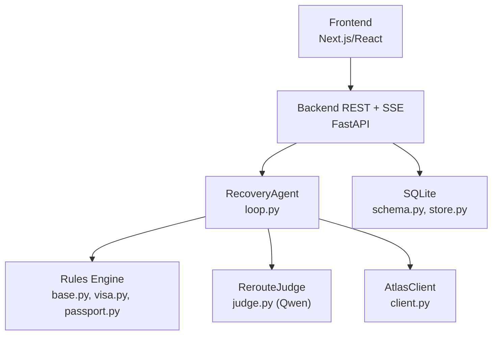
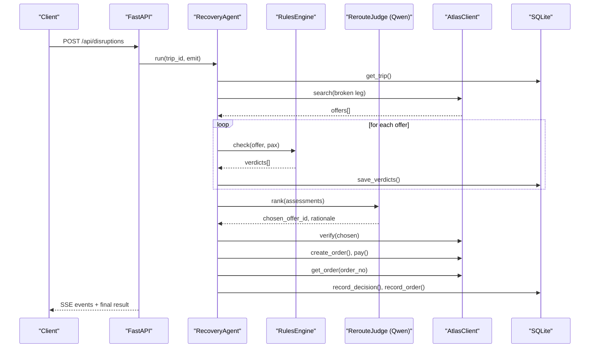
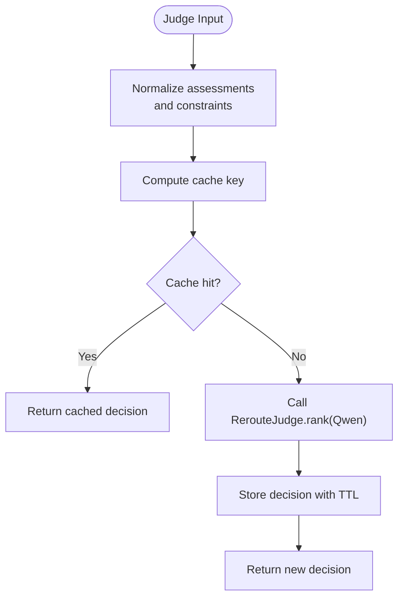
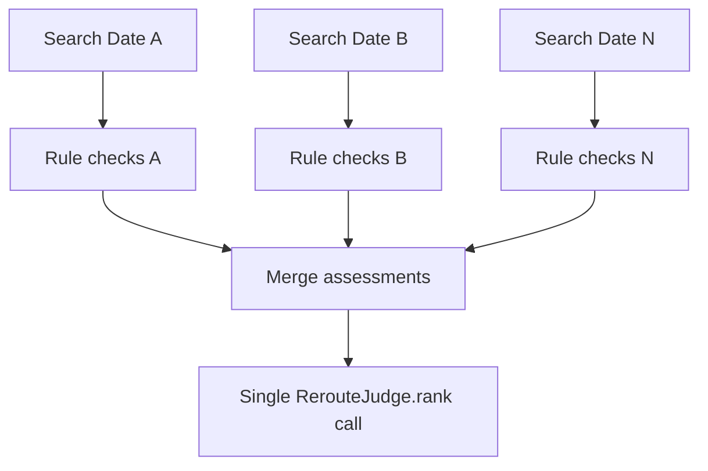
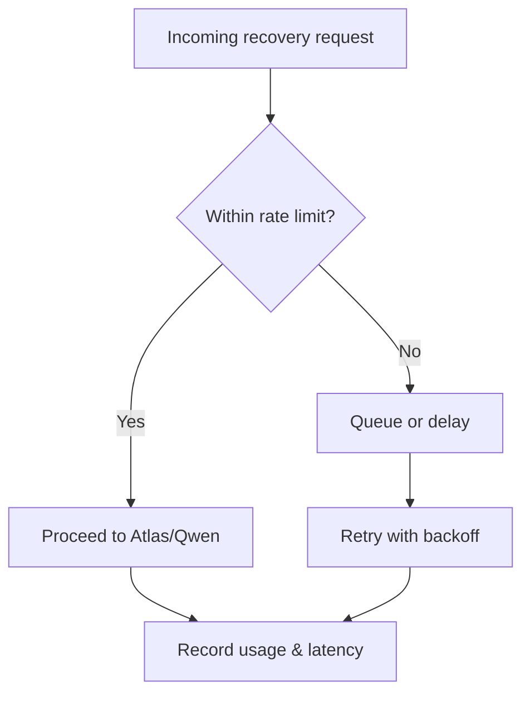
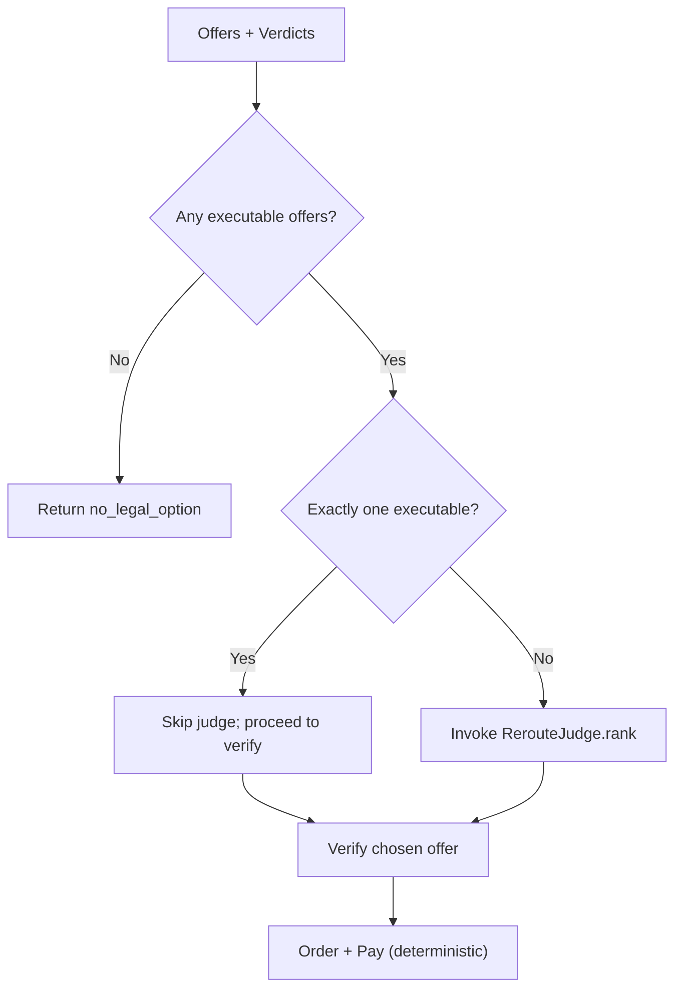
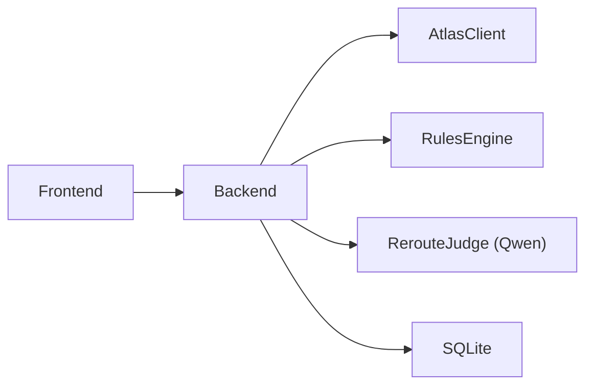

# Cost Optimization Approaches

<cite>
**Referenced Files in This Document**
- [architecture.md](file://docs/plans/waypoint/02-architecture.md)
- [program-design.md](file://docs/plans/waypoint/03-program-design.md)
- [product.md](file://docs/plans/waypoint/01-product.md)
- [openai.yaml](file://.agents/skills/atlas-flight-booking/agents/openai.yaml)
- [SKILL.md](file://.agents/skills/atlas-flight-booking/SKILL.md)
- [cli-contract.md](file://.agents/skills/atlas-flight-booking/references/cli-contract.md)
- [booking-workflow.md](file://.agents/skills/atlas-flight-booking/references/booking-workflow.md)
- [advise-execute-two-gate-split.md](file://docs/adr/0003-advise-execute-two-gate-split.md)
- [status.md](file://docs/plans/waypoint/00-status.md)
</cite>

## Table of Contents
1. [Introduction](#introduction)
2. [Project Structure](#project-structure)
3. [Core Components](#core-components)
4. [Architecture Overview](#architecture-overview)
5. [Detailed Component Analysis](#detailed-component-analysis)
6. [Dependency Analysis](#dependency-analysis)
7. [Performance Considerations](#performance-considerations)
8. [Troubleshooting Guide](#troubleshooting-guide)
9. [Conclusion](#conclusion)
10. [Appendices](#appendices)

## Introduction
This document provides cost optimization strategies for AI integration in the Waypoint system, focusing on reducing AI service costs while preserving recovery quality. It covers prompt caching, response deduplication, efficient request batching, token minimization techniques, rate limiting during high-volume disruptions, monitoring and logging, fallback mechanisms that reduce reliance on AI services, and a cost-benefit analysis across model selections and usage patterns. The guidance is grounded in Waypoint’s architecture: deterministic logic owns rules, fare math, and order execution; AI (Qwen) is used only for reroute judgment to minimize expensive LLM calls.

## Project Structure
Waypoint separates concerns into a frontend (Next.js/React), a backend (Python FastAPI), an Atlas flight booking integration, a rules engine, and SQLite persistence. The AI component is intentionally scoped to the reroute judgment step, which limits exposure to costly LLM calls.

**Diagram sources**
- [architecture.md:6-11](file://docs/plans/waypoint/02-architecture.md#L6-L11)
- [program-design.md:11-25](file://docs/plans/waypoint/03-program-design.md#L11-L25)

**Section sources**
- [architecture.md:6-11](file://docs/plans/waypoint/02-architecture.md#L6-L11)
- [program-design.md:11-25](file://docs/plans/waypoint/03-program-design.md#L11-L25)

## Core Components
- RecoveryAgent orchestrates the end-to-end recovery flow with guards (step budget, re-read/verify, outcome assertion). It reduces AI usage by confining LLM calls to the ranking step and enforcing deterministic execution afterward.
- RerouteJudge uses Qwen to rank legal options and produce a rationale. This is the primary point where AI cost can be optimized via prompt design, caching, and batching.
- RulesEngine enforces compliance deterministically, preventing AI from making rule decisions and avoiding unnecessary LLM prompts.
- AtlasClient wraps search, verify, order, and payment operations. Deterministic code handles fare-difference math and side-effecting actions, minimizing AI involvement in costly or risky steps.

Key cost levers:
- Minimize LLM calls: only one judgment call per recovery attempt when possible.
- Reduce tokens: concise prompts, structured outputs, and strict schemas.
- Cache and deduplicate: avoid repeated identical searches/judgments.
- Batch requests: group multiple date searches and assessments before invoking the judge once.
- Rate limit: protect against spikes during mass disruptions.
- Monitor: track usage, latency, and costs per trip and per step.
- Fallbacks: use deterministic logic whenever feasible to bypass AI.

**Section sources**
- [program-design.md:106-149](file://docs/plans/waypoint/03-program-design.md#L106-L149)
- [architecture.md:11-19](file://docs/plans/waypoint/02-architecture.md#L11-L19)

## Architecture Overview
The recovery flow is designed to keep AI out of deterministic paths and restrict it to a single judgment step. This architecture inherently supports cost control:
- Search alternatives deterministically via Atlas.
- Evaluate offers through rules (no AI).
- Invoke Qwen once to rank legal options and provide rationale.
- Re-verify chosen offer live before booking.
- Execute orders/payments deterministically.
- Assert outcomes before marking success.

**Diagram sources**
- [program-design.md:125-149](file://docs/plans/waypoint/03-program-design.md#L125-L149)
- [architecture.md:34-49](file://docs/plans/waypoint/02-architecture.md#L34-L49)

**Section sources**
- [program-design.md:125-149](file://docs/plans/waypoint/03-program-design.md#L125-L149)
- [architecture.md:34-49](file://docs/plans/waypoint/02-architecture.md#L34-L49)

## Detailed Component Analysis

### Prompt Caching and Response Deduplication
- Purpose: Avoid redundant LLM calls for identical or near-identical judgments under the same context window.
- Strategy:
  - Normalize inputs to the judge (offers, constraints, passenger profile) into a canonical form before hashing.
  - Cache judge responses keyed by input hash within a short TTL aligned with price freshness windows.
  - Deduplicate repeated search queries at the Atlas layer to prevent duplicate offers and subsequent redundant judge calls.
  - When prices change, invalidate cached judge results tied to affected offers.
- Integration points:
  - Before calling RerouteJudge.rank, compute a stable key from normalized assessments and cache lookup.
  - On Atlas.verify changes, evict related cache entries.

[No diagram sources needed since this diagram shows conceptual workflow, not actual code structure]

### Efficient Request Batching
- Purpose: Reduce the number of LLM calls by grouping multiple assessments into a single judgment request.
- Strategy:
  - After collecting all offers and rule verdicts, batch them into one assessment list and invoke the judge once.
  - For flexible-date searches, issue one complete search per requested date, then merge normalized results before a single judge call.
  - Avoid per-offer judge invocations; always aggregate first.
- Benefits: Fewer LLM calls, lower total tokens, reduced latency variance.

[No diagram sources needed since this diagram shows conceptual workflow, not actual code structure]

### Token Minimization Techniques
- Concise prompts:
  - Provide only necessary fields to the judge: executable offers, constraints, and required output schema.
  - Remove verbose narrative from inputs; keep rationale generation in the model’s instructions rather than repeating context.
- Structured outputs:
  - Enforce a strict JSON schema for judge responses (chosen offer ID and rationale) to reduce parsing overhead and avoid extra retries.
  - Use minimal field names and avoid embedding large payloads in prompts.
- Context reuse:
  - Keep passenger and rule context outside the prompt when possible; pass only identifiers and compact summaries.
- Guardrails:
  - Limit maximum tokens in prompts and responses; fail fast if exceeded.

[No section sources needed since this section provides general guidance]

### Rate Limiting During High-Volume Disruptions
- Purpose: Prevent excessive API calls to Atlas and Qwen during mass disruption events.
- Strategy:
  - Implement a global rate limiter per external service (Atlas, Qwen) using a token bucket or sliding window.
  - Queue or backoff requests when limits are reached; prioritize recent or higher-value trips if necessary.
  - Expose metrics for throttling and alert on sustained throttling.
- Integration points:
  - Wrap AtlasClient.search/verify/order/pay with rate limiting.
  - Wrap RerouteJudge.rank with rate limiting and circuit breaker behavior.

[No diagram sources needed since this diagram shows conceptual workflow, not actual code structure]

### Monitoring and Logging Strategies
- Track per-trip and per-step metrics:
  - Number of searches, rule checks, judge calls, verify calls, order/pay attempts.
  - Latency and error rates for each step.
  - Costs per trip (estimate based on tokens and API pricing).
- Log essential events:
  - Offer counts, rule verdicts, judge rationale, price changes, order outcomes.
  - Avoid logging sensitive data (passenger details, credentials).
- Dashboards and alerts:
  - Visualize cost trends, failure rates, and throughput.
  - Alert on spikes in LLM usage or Atlas errors.

[No section sources needed since this section provides general guidance]

### Fallback Mechanisms to Reduce AI Reliance
- Deterministic-first approach:
  - Rules engine decides allowed/blocked/unknown without AI.
  - If no legal option exists, return early without invoking the judge.
  - If only one legal option exists, skip the judge and proceed directly to verification and booking.
- Staleness guard:
  - Re-verify chosen offer live before booking; if stale, re-search and re-evaluate deterministically first.
- Human override:
  - For blocked/unknown options, require explicit human approval instead of relying on AI to justify risky choices.

**Diagram sources**
- [program-design.md:136-149](file://docs/plans/waypoint/03-program-design.md#L136-L149)
- [advise-execute-two-gate-split.md:1-12](file://docs/adr/0003-advise-execute-two-gate-split.md#L1-L12)

**Section sources**
- [program-design.md:136-149](file://docs/plans/waypoint/03-program-design.md#L136-L149)
- [advise-execute-two-gate-split.md:1-12](file://docs/adr/0003-advise-execute-two-gate-split.md#L1-L12)

### Cost-Benefit Analysis for Model Selection and Usage Patterns
- Current design:
  - Deterministic code owns rules, fare math, and execution; AI is used only for reroute judgment. This minimizes AI cost while preserving quality where judgment matters most.
- Model selection considerations:
  - Smaller/faster models may suffice for ranking legal options if constrained to structured outputs and clear criteria.
  - Larger models may improve rationale quality but increase cost; evaluate trade-offs via A/B testing on rationale usefulness vs. cost.
- Usage pattern optimizations:
  - Batch multiple assessments into one judge call.
  - Skip judge when deterministic logic suffices (single legal option or no legal options).
  - Cache and deduplicate judge responses for similar contexts.
  - Limit prompt tokens and enforce strict schemas to reduce token consumption.

[No section sources needed since this section provides general guidance]

## Dependency Analysis
Waypoint’s dependencies are intentionally narrow:
- Frontend depends on backend REST + SSE.
- Backend depends on Atlas integration, rules engine, and Qwen for judgment.
- Persistence via SQLite stores offers, verdicts, decisions, and orders for auditability.

**Diagram sources**
- [architecture.md:6-11](file://docs/plans/waypoint/02-architecture.md#L6-L11)
- [program-design.md:11-25](file://docs/plans/waypoint/03-program-design.md#L11-L25)

**Section sources**
- [architecture.md:6-11](file://docs/plans/waypoint/02-architecture.md#L6-L11)
- [program-design.md:11-25](file://docs/plans/waypoint/03-program-design.md#L11-L25)

## Performance Considerations
- Step budget: Limits agent loops to prevent infinite or excessive processing.
- Re-read/verify: Ensures data freshness before writes, reducing failed bookings and retries.
- Outcome assertion: Confirms real ticket issuance before marking success, avoiding false positives.
- Deterministic execution: Keeps AI out of side-effecting steps, improving reliability and cost efficiency.

These guards also indirectly reduce costs by minimizing wasted LLM calls and retries.

**Section sources**
- [program-design.md:106-149](file://docs/plans/waypoint/03-program-design.md#L106-L149)
- [status.md:40-43](file://docs/plans/waypoint/00-status.md#L40-L43)

## Troubleshooting Guide
Common issues and mitigations:
- Excessive LLM usage:
  - Ensure batching and caching are active; verify judge is called only once per recovery attempt.
  - Check for duplicate searches and deduplicate at Atlas layer.
- High error rates:
  - Inspect rate limiting configuration; adjust quotas and backoff strategies.
  - Validate prompt schemas and input normalization to reduce model errors.
- Stale data:
  - Confirm re-verify step runs before booking; handle price changes appropriately.
- Compliance failures:
  - Review rules engine verdicts; ensure blocked/unknown options are never auto-executed.

**Section sources**
- [program-design.md:136-149](file://docs/plans/waypoint/03-program-design.md#L136-L149)
- [status.md:40-43](file://docs/plans/waypoint/00-status.md#L40-L43)

## Conclusion
Waypoint’s architecture already minimizes AI reliance by confining LLM usage to the reroute judgment step and delegating deterministic tasks to code. To further optimize costs:
- Implement prompt caching and response deduplication.
- Batch assessments to reduce judge calls.
- Minimize tokens via concise prompts and structured outputs.
- Apply rate limiting to protect against high-volume disruptions.
- Monitor usage, costs, and performance rigorously.
- Expand fallbacks to bypass AI when deterministic logic suffices.
- Continuously evaluate model selection and usage patterns for cost-quality balance.

[No section sources needed since this section summarizes without analyzing specific files]

## Appendices

### Key Workflows and Contracts Referenced
- Atlas CLI contract governs safe, deterministic interactions with external services, ensuring IDs are preserved and side effects are controlled.
- Booking workflow emphasizes verification, explicit approvals, and outcome assertions, aligning with cost and safety goals.

**Section sources**
- [cli-contract.md:1-79](file://.agents/skills/atlas-flight-booking/references/cli-contract.md#L1-L79)
- [booking-workflow.md:1-63](file://.agents/skills/atlas-flight-booking/references/booking-workflow.md#L1-L63)

### Skill and Agent Configuration
- Default prompt and display metadata for the Atlas Flight Booking skill are defined centrally, enabling consistent user-facing behavior and reducing ad-hoc prompts.

**Section sources**
- [openai.yaml:1-5](file://.agents/skills/atlas-flight-booking/agents/openai.yaml#L1-L5)
- [SKILL.md:1-71](file://.agents/skills/atlas-flight-booking/SKILL.md#L1-L71)

### Product Goals and Success Metrics
- The product focuses on rule-aware rebooking, measuring success by boardable recoveries and time-to-recovery, which informs cost optimization priorities (quality must be maintained while reducing expenses).

**Section sources**
- [product.md:1-32](file://docs/plans/waypoint/01-product.md#L1-L32)