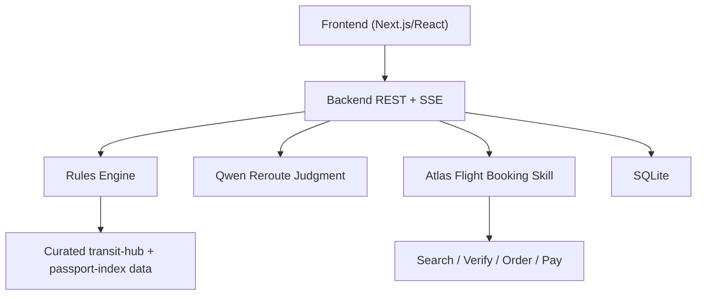
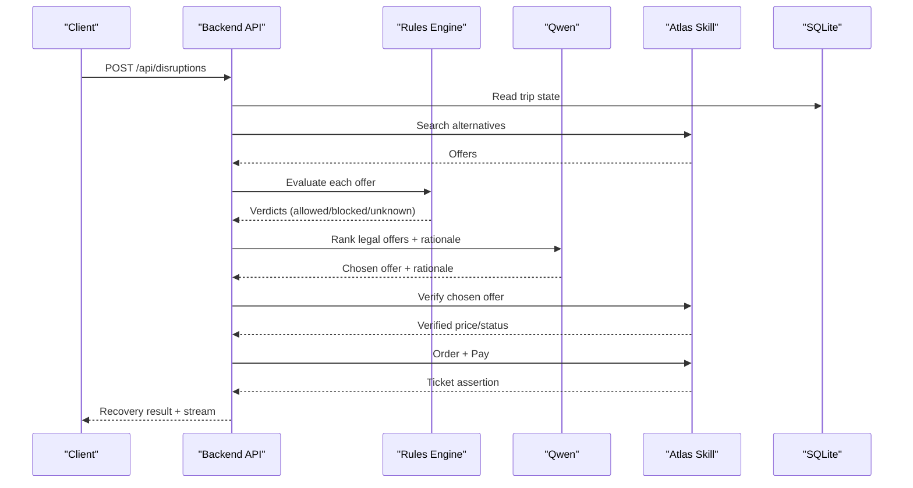
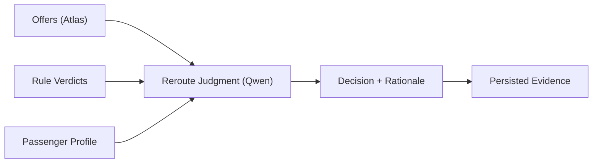

# Prompt Engineering Strategies

<cite>
**Referenced Files in This Document**
- [02-architecture.md](file://docs/plans/waypoint/02-architecture.md)
- [01-product.md](file://docs/plans/waypoint/01-product.md)
- [0002-visa-rules-curated-approximation.md](file://docs/adr/0002-visa-rules-curated-approximation.md)
- [0003-advise-execute-two-gate-split.md](file://docs/adr/0003-advise-execute-two-gate-split.md)
- [SKILL.md](file://.agents/skills/atlas-flight-booking/SKILL.md)
- [booking-workflow.md](file://.agents/skills/atlas-flight-booking/references/booking-workflow.md)
- [passenger-input.md](file://.agents/skills/atlas-flight-booking/references/passenger-input.md)
- [error-handling.md](file://.agents/skills/atlas-flight-booking/references/error-handling.md)
- [cli-contract.md](file://.agents/skills/atlas-flight-booking/references/cli-contract.md)
</cite>

## Table of Contents
1. Introduction
2. Project Structure
3. Core Components
4. Architecture Overview
5. Detailed Component Analysis
6. Dependency Analysis
7. Performance Considerations
8. Troubleshooting Guide
9. Conclusion
10. Appendices

## Introduction
This document provides comprehensive prompt engineering strategies for the Waypoint AI system’s reroute judgment prompts. It explains how to craft prompts that guide the AI to evaluate flight alternatives based on price, timing, layover duration, and visa requirements while producing transparent written rationales. The guidance is grounded in Waypoint’s architecture: deterministic rules enforce legal boardability (visa/transit and passport validity), and the AI performs the final ranking and explanation over legal options.

Key principles:
- Deterministic code owns rules checks, fare-difference math, and order/pay execution.
- The AI owns only the reroute judgment: rank legal options under price × time × layover and provide a clear rationale.
- Advice is open; execution is fail-closed. Only offers where every rule is allowed can be auto-booked.

**Section sources**
- [02-architecture.md:11-19](file://docs/plans/waypoint/02-architecture.md#L11-L19)
- [0003-advise-execute-two-gate-split.md:9-18](file://docs/adr/0003-advise-execute-two-gate-split.md#L9-L18)

## Project Structure
Waypoint combines a Python FastAPI backend with a Next.js frontend. The backend hosts the recovery agent loop, rules engine, Atlas integration, Qwen calls, and SQLite persistence. The forked atlas-flight-booking skill is used as an imported library for search, verify, order, pay, and ticketing operations.

**Diagram sources**
- [02-architecture.md:6-11](file://docs/plans/waypoint/02-architecture.md#L6-L11)
- [02-architecture.md:21-33](file://docs/plans/waypoint/02-architecture.md#L21-L33)

**Section sources**
- [02-architecture.md:6-11](file://docs/plans/waypoint/02-architecture.md#L6-L11)
- [02-architecture.md:21-33](file://docs/plans/waypoint/02-architecture.md#L21-L33)

## Core Components
- Rules Engine: Enforces hard constraints such as transit-visa eligibility and passport validity. Outputs per-offer verdicts (allowed/blocked/unknown) with reasons.
- Qwen Reroute Judgment: Ranks legal options by price, total travel time, and layover duration; produces a written rationale for the chosen option and rejections.
- Atlas Integration: Provides normalized offers, live verification, ordering, payment, and ticketing status.
- Persistence: Stores offers, rule verdicts, decisions, and orders to support auditability and transparency.

Prompt design must align with these boundaries:
- Do not ask the AI to override rules or bypass determinism.
- Ask the AI to choose among offers marked allowed by the rules engine.
- Require explicit, structured rationales that reference price, timing, layover, and visa considerations.

**Section sources**
- [02-architecture.md:11-19](file://docs/plans/waypoint/02-architecture.md#L11-L19)
- [02-architecture.md:21-33](file://docs/plans/waypoint/02-architecture.md#L21-L33)

## Architecture Overview
The end-to-end flow for disruptions:
1. Trigger disruption (webhook or injected).
2. Re-read trip state and search alternatives via Atlas.
3. Run rules on each offer; keep only all-allowed offers.
4. If no legal option exists, stop gracefully and explain why.
5. Qwen ranks legal options and selects one with a rationale.
6. Live verify chosen offer; handle stale pricing.
7. Order and pay deterministically; assert ticketing outcome.
8. Stream reasoning steps to the frontend.

**Diagram sources**
- [02-architecture.md:34-49](file://docs/plans/waypoint/02-architecture.md#L34-L49)

**Section sources**
- [02-architecture.md:34-49](file://docs/plans/waypoint/02-architecture.md#L34-L49)

## Detailed Component Analysis

### Reroute Judgment Prompt Design
Goal: Guide the AI to select the best legal alternative and explain its decision clearly.

Recommended prompt structure:
- Context: Provide passenger profile (passport country, expiry), broken segments, and available alternatives with price, currency, total minutes, and segment details.
- Constraints: Explicitly list which offers are allowed by the rules engine and which are blocked or unknown. Emphasize that the AI must not choose blocked or unknown offers for execution.
- Criteria: Instruct the AI to rank by price first, then minimize total travel time, then prefer shorter layovers when times are close.
- Output: Require a structured response including chosen offer ID, rejected cheapest offer ID, fare difference context, and a concise rationale referencing price, timing, layover, and visa considerations.

Example scenario templates (described, not verbatim):
- Multi-leg journey: Include all legs, highlight the broken leg, and ensure the AI considers connections across multiple hubs.
- Tight connection: Add a constraint to avoid offers with insufficient connection time at any hub.
- Complex visa situation: When a hub has unknown transit rules, instruct the AI to prefer fully legal options even if pricier, and explicitly note risk.

Transparency requirements:
- Always include a written rationale that references the specific criteria and constraints.
- For rejected options, state whether they were cheaper but blocked/unknown, or more expensive but preferred due to timing or layover.

Best practices:
- Keep prompts deterministic-friendly: do not ask the AI to interpret or change rules.
- Use consistent field names and units so the model compares apples to apples.
- Constrain output format to enable parsing and auditing.

**Section sources**
- [02-architecture.md:11-19](file://docs/plans/waypoint/02-architecture.md#L11-L19)
- [0003-advise-execute-two-gate-split.md:9-18](file://docs/adr/0003-advise-execute-two-gate-split.md#L9-L18)

### Visa and Passport Rules Integration
Visa rules are curated approximations with explicit freshness windows and fail-closed defaults. Passengers cannot autonomously proceed through unknown or expired cells.

Prompt guidance:
- Treat unknown transit rules as non-executable; prefer fully legal options.
- When a hub lacks airside transit coverage, fall back to entry-fallback logic and communicate uncertainty.
- Highlight provenance and last-checked dates in rationales to maintain transparency.

Data layers:
- Base layer: tourist visa matrix used only as entry fallback when airside transit zone is absent.
- Authoritative layer: curated hub × passport table with airside_ok, max_hours, source, last_checked.

**Section sources**
- [0002-visa-rules-curated-approximation.md:7-18](file://docs/adr/0002-visa-rules-curated-approximation.md#L7-L18)

### Two-Gate Split: Advise vs Execute
Advise gate is open: the AI sees all options, labeled allowed/blocked/unknown, and narrates reasoning. Execute gate is walled: only offers where every rule is allowed can be auto-booked.

Prompt implications:
- Encourage the AI to discuss risky or unknown options in its rationale without selecting them for execution.
- Ensure the final selection is always from allowed offers; code re-checks executability after the LLM picks.

**Section sources**
- [0003-advise-execute-two-gate-split.md:9-18](file://docs/adr/0003-advise-execute-two-gate-split.md#L9-L18)

### Atlas Integration and Offer Lifecycle
The Atlas skill manages search, verification, optional services, order creation, payment, and ticketing. Prompts should never bypass this workflow.

Operational notes:
- Preserve IDs exactly; branch on stable codes; present normalized fields.
- Handle authorization, top-up, and ticketing activation states as described in the skill references.
- On price increases during verification, require explicit confirmation before proceeding.

**Section sources**
- [SKILL.md:26-63](file://.agents/skills/atlas-flight-booking/SKILL.md#L26-L63)
- [booking-workflow.md:3-15](file://.agents/skills/atlas-flight-booking/references/booking-workflow.md#L3-L15)
- [error-handling.md:19-63](file://.agents/skills/atlas-flight-booking/references/error-handling.md#L19-L63)
- [cli-contract.md:30-78](file://.agents/skills/atlas-flight-booking/references/cli-contract.md#L30-L78)

### Prompt Templates for Clear Explanations
Use these template structures to generate consistent, auditable explanations:

- Option comparison template:
  - State chosen offer ID and rejected cheapest offer ID.
  - Summarize fare difference context.
  - Explain selection using price, total travel time, and layover preferences.
  - Note visa/transit considerations and any unknown risks.

- Rejection rationale template:
  - Identify why each rejected option was not chosen (e.g., blocked due to transit visa, unknown hub, excessive layover, higher price).
  - Reference specific constraints and data points.

- Edge-case template:
  - When no legal option exists, explain the blocking rule(s) and suggest next steps (e.g., manual review, alternate routing).

These templates should be enforced via prompt instructions and validated against outputs to ensure consistency.

[No sources needed since this section provides general guidance]

### Iteration, Testing, and Validation
To ensure consistent AI behavior across scenarios:
- Build a test set covering multi-leg journeys, tight connections, complex visa situations, and edge cases like unknown hubs.
- For each test, define expected outcomes and required rationale elements.
- Validate outputs against:
  - Correctness: only allowed offers selected.
  - Transparency: rationales reference price, timing, layover, and visa factors.
  - Stability: repeated runs produce consistent selections given identical inputs.
- Track failures and refine prompts iteratively.

[No sources needed since this section provides general guidance]

## Dependency Analysis
The reroute judgment depends on:
- Rules Engine outputs (verdicts per offer).
- Atlas offers (price, currency, total minutes, segments).
- Passenger profile (passport country, expiry).
- Persisted evidence (rule_verdicts, decisions) for auditability.

**Diagram sources**
- [02-architecture.md:21-33](file://docs/plans/waypoint/02-architecture.md#L21-L33)

**Section sources**
- [02-architecture.md:21-33](file://docs/plans/waypoint/02-architecture.md#L21-L33)

## Performance Considerations
- Minimize prompt size: include only necessary fields (offer ID, price, currency, total minutes, segments, rule verdicts).
- Avoid redundant calculations: let deterministic code handle fare differences and time computations; ask the AI to interpret rather than compute.
- Cache and reuse offer lists within a single recovery session to reduce external calls.
- Stream reasoning steps to the frontend to improve perceived performance and transparency.

[No sources needed since this section provides general guidance]

## Troubleshooting Guide
Common issues and resolutions:
- No legal option found: Stop gracefully and explain blocking rules; surface why alternatives failed.
- Unknown transit rules: Treat as non-executable; prefer fully legal options; document provenance and freshness.
- Price changes during verification: Present old/new totals; obtain explicit confirmation if increased; continue only after approval.
- Authorization or ticketing blockers: Follow skill references to guide users through authorization, top-up, or activation steps.

Error handling patterns:
- Branch on stable codes; never parse messages.
- Respect retryable flags for read-only commands; never retry side-effecting operations.
- Maintain audit trails in rule_verdicts and decisions.

**Section sources**
- [error-handling.md:19-63](file://.agents/skills/atlas-flight-booking/references/error-handling.md#L19-L63)
- [0002-visa-rules-curated-approximation.md:7-18](file://docs/adr/0002-visa-rules-curated-approximation.md#L7-L18)

## Conclusion
Effective reroute judgment prompts in Waypoint must respect the boundary between deterministic rules and AI-driven ranking. By constraining choices to legally allowed offers, emphasizing price, timing, and layover trade-offs, and requiring transparent rationales, you ensure both correctness and trust. Integrate visa and passport rules thoughtfully, leverage Atlas for reliable offer lifecycle management, and iterate prompts with robust testing to maintain consistent behavior across diverse flight scenarios.

[No sources needed since this section summarizes without analyzing specific files]

## Appendices

### A. Endpoints and Data Model Reference
- Endpoints:
  - POST /api/trips
  - POST /api/disruptions
  - POST /api/webhooks/atlas
  - GET /api/trips/{id}
  - GET /api/trips/{id}/recovery
  - GET /api/trips/{id}/stream
- Data tables: passengers, trips, segments, offers, rule_verdicts, decisions, orders.

**Section sources**
- [02-architecture.md:13-33](file://docs/plans/waypoint/02-architecture.md#L13-L33)

### B. Product Context and Success Metrics
- Problem statement: Cheapest reroutes often ignore passport constraints, leading to gate denials.
- Success metric: Share of disrupted trips recovered to confirmed, rule-legal, boardable options with zero gate-denial traps booked versus naive baseline.

**Section sources**
- [01-product.md:3-23](file://docs/plans/waypoint/01-product.md#L3-L23)