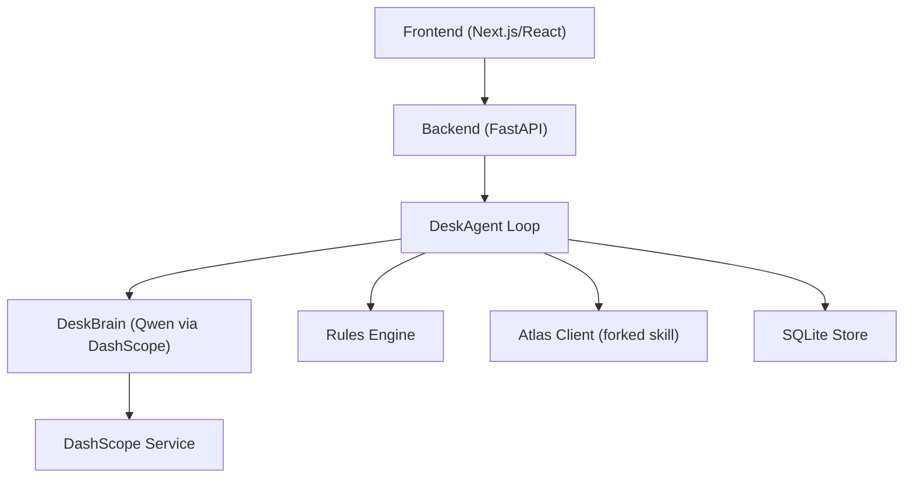
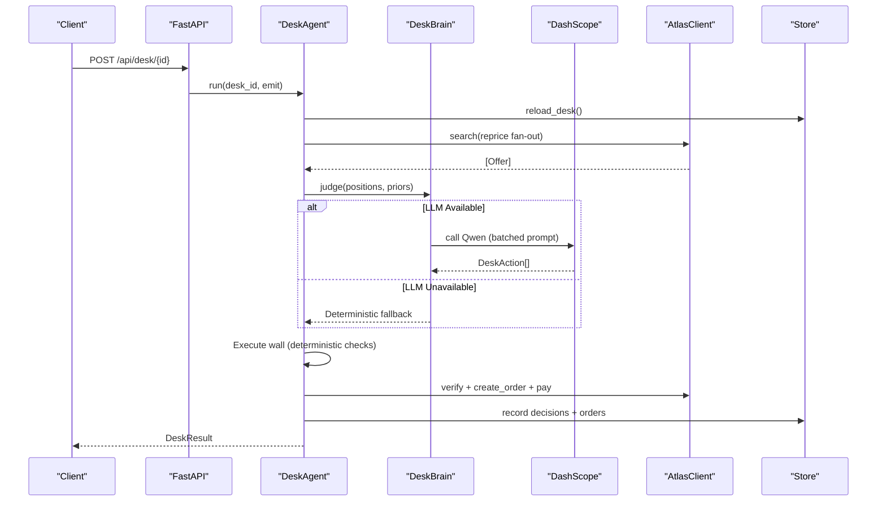
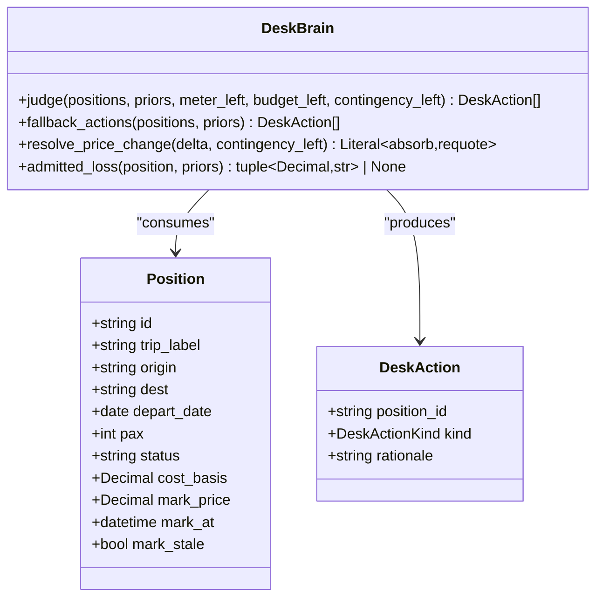
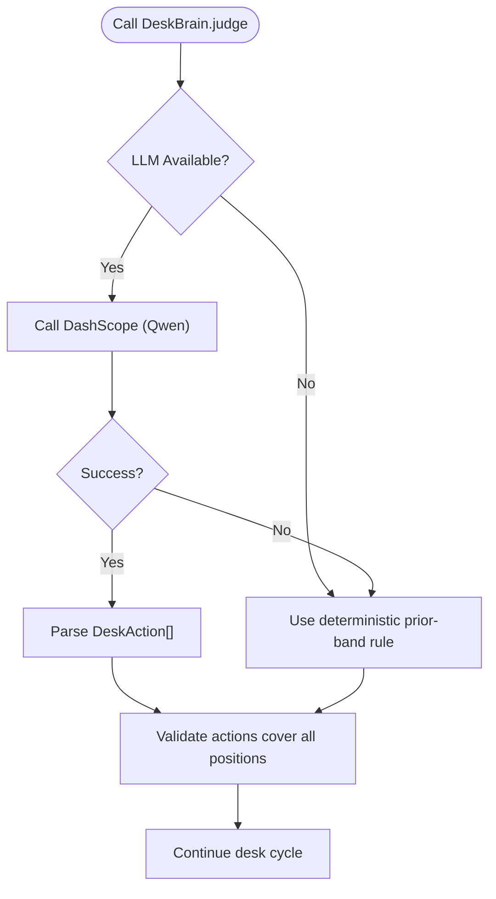
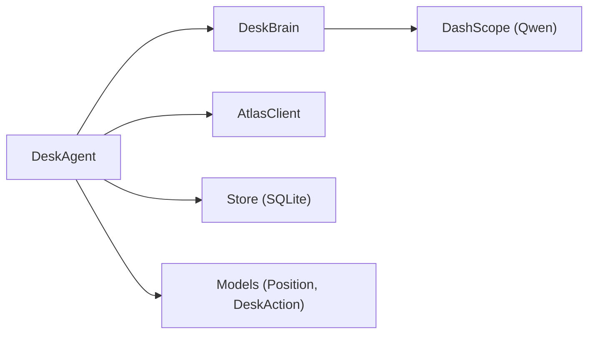

# Qwen Integration via DashScope

<cite>
**Referenced Files in This Document**
- [brain.py](file://backend/app/agent/brain.py)
- [loop.py](file://backend/app/agent/loop.py)
- [models.py](file://backend/app/models.py)
- [fixture.py](file://backend/app/fixture.py)
- [test_desk_brain.py](file://backend/tests/test_desk_brain.py)
- [02-architecture.md](file://docs/plans/waypoint/_archive-visa-pivot/02-architecture.md)
- [03-program-design.md](file://docs/plans/waypoint/_archive-visa-pivot/03-program-design.md)
</cite>

## Update Summary
**Changes Made**
- Updated RerouteJudge to DeskBrain implementation using DashScope's OpenAI-compatible endpoint
- Added robust fallback mechanisms that degrade to deterministic prior-band rules when LLM is unavailable
- Enhanced error handling to ensure system never crashes due to external service failures
- Updated configuration to use DASHSCOPE_API_KEY environment variable for authentication
- Added comprehensive test coverage for fallback scenarios and transport injection

## Table of Contents
1. Introduction
2. Project Structure
3. Core Components
4. Architecture Overview
5. Detailed Component Analysis
6. Dependency Analysis
7. Performance Considerations
8. Troubleshooting Guide
9. Conclusion

## Introduction
This document explains how Waypoint integrates Alibaba DashScope to power the DeskBrain, which performs AI-driven decision making for travel fare management during trip recovery. The system uses Qwen via DashScope's OpenAI-compatible endpoint with robust fallback mechanisms that degrade to deterministic prior-band rules when LLM is unavailable, ensuring the system never crashes due to external service failures.

The system follows a two-gate design:
- Advise gate (open): DeskBrain sees all positions and provides recommendations among executable options.
- Execute gate (walled, fail-closed): Only deterministic code executes bookings; LLM output is re-checked by code.

**Section sources**
- [brain.py:1-19](file://backend/app/agent/brain.py#L1-L19)
- [loop.py:1-15](file://backend/app/agent/loop.py#L1-L15)
- [03-program-design.md:107-115](file://docs/plans/waypoint/_archive-visa-pivot/03-program-design.md#L107-L115)

## Project Structure
Waypoint's backend (Python FastAPI) hosts the desk orchestration loop, rules engine, Atlas integration, and DeskBrain calls. The frontend (Next.js/React) displays three screens and streams live reasoning via Server-Sent Events (SSE). External integrations include:
- Atlas sandbox via a forked skill (library usage preferred; CLI subprocess as fallback).
- Qwen via DashScope using DASHSCOPE_API_KEY with OpenAI-compatible endpoint.
- Optional Atlas webhook trigger with WAYPOINT_PUBLIC_URL.

**Diagram sources**
- [brain.py:32-37](file://backend/app/agent/brain.py#L32-L37)
- [loop.py:78-105](file://backend/app/agent/loop.py#L78-L105)
- [02-architecture.md:52-55](file://docs/plans/waypoint/_archive-visa-pivot/02-architecture.md#L52-L55)

**Section sources**
- [brain.py:1-19](file://backend/app/agent/brain.py#L1-L19)
- [loop.py:1-15](file://backend/app/agent/loop.py#L1-L15)
- [02-architecture.md:52-55](file://docs/plans/waypoint/_archive-visa-pivot/02-architecture.md#L52-L55)

## Core Components
- DeskAgent: Orchestrates the end-to-end desk cycle with guards (step budget, meter limits, comparison mode). Emits steps to SSE.
- DeskBrain: Accepts all positions and returns DeskAction recommendations (book/hold/escalate), constrained by deterministic execution.
- Rules Engine: Evaluates each position against curated volatility bands producing deterministic decisions.
- AtlasClient: Wraps search, verify, order creation, payment, and outcome assertion.
- Store: Persists positions, decisions, orders, and audit trails.

Key domain types used by DeskBrain:
- Position: includes position details, cost basis, mark price, and status.
- DeskAction: kind (book/hold/escalate) and rationale.

**Section sources**
- [loop.py:78-105](file://backend/app/agent/loop.py#L78-L105)
- [brain.py:71-84](file://backend/app/agent/brain.py#L71-L84)
- [models.py:98-134](file://backend/app/models.py#L98-L134)

## Architecture Overview
The desk cycle proceeds through deterministic stages, with DeskBrain invoked only at the advise gate to recommend actions on held positions.

**Diagram sources**
- [loop.py:113-323](file://backend/app/agent/loop.py#L113-L323)
- [brain.py:90-119](file://backend/app/agent/brain.py#L90-L119)

## Detailed Component Analysis

### DeskBrain and Qwen via DashScope
- Purpose: Recommend book/hold/escalate per position with rationale, degrading to deterministic rules when LLM unavailable.
- Input: list[Position], priors (volatility bands), meter_left, budget_left, contingency_left.
- Output: list[DeskAction] with position_id, kind (book/hold/escalate), and rationale.
- Integration:
  - Configuration: DASHSCOPE_API_KEY environment variable.
  - Connection: Uses httpx to call DashScope's OpenAI-compatible endpoint.
  - Authentication: Bearer token with API key from environment.
  - Fallback: Any failure degrades to deterministic prior-band rule with identical DeskAction shape.

**Diagram sources**
- [brain.py:71-84](file://backend/app/agent/brain.py#L71-L84)
- [models.py:98-134](file://backend/app/models.py#L98-L134)

**Section sources**
- [brain.py:71-84](file://backend/app/agent/brain.py#L71-L84)
- [brain.py:90-119](file://backend/app/agent/brain.py#L90-L119)
- [models.py:98-134](file://backend/app/models.py#L98-L134)

### Request/Response Contract with DashScope
- Request payload (OpenAI-compatible format):
  - model: configured model identifier (default: qwen-plus)
  - messages: array containing user prompt with position data and context
  - temperature: 0.2 for deterministic responses
- Response payload:
  - choices[0].message.content: JSON string containing DeskAction array
  - Each action: {position_id, kind, rationale}

Note: The exact JSON schema is validated defensively; malformed responses trigger fallback to deterministic rules.

**Section sources**
- [brain.py:241-264](file://backend/app/agent/brain.py#L241-L264)
- [brain.py:266-299](file://backend/app/agent/brain.py#L266-L299)

### Robust Fallback Mechanisms
- Network failures: Wrap DashScope calls with retries and timeouts; surface user-friendly messages while preserving internal causes.
- Rate limiting: Implement exponential backoff and queueing; degrade gracefully by falling back to deterministic selection based on prior bands.
- Service unavailability: If DashScope is down or no API key configured, proceed with deterministic prior-band rules and log the incident.
- Transport injection: Tests can inject mock transports to avoid network calls entirely.
- Guardrails: The execute gate enforces fail-closed behavior regardless of LLM output; deterministic code re-checks every pick.

**Diagram sources**
- [brain.py:104-119](file://backend/app/agent/brain.py#L104-L119)
- [brain.py:125-155](file://backend/app/agent/brain.py#L125-L155)

**Section sources**
- [brain.py:104-119](file://backend/app/agent/brain.py#L104-L119)
- [brain.py:125-155](file://backend/app/agent/brain.py#L125-L155)
- [test_desk_brain.py:131-152](file://backend/tests/test_desk_brain.py#L131-L152)

### Cost Optimization Approaches
- Batch processing: Single prompt contains all positions for one LLM call per cycle, reducing overhead.
- Temperature control: Low temperature (0.2) ensures consistent, deterministic-like responses.
- Prompt optimization: Concise prompts focus on essential position data and context.
- Selective invocation: Only invoke LLM when positions exist and LLM is available; otherwise use deterministic rules.

### Model Version Management and Fallback Strategies
- Model versioning: Centralized model selection (DEFAULT_MODEL = "qwen-plus") enables safe upgrades.
- Fallback strategy: On any DashScope errors (network, rate limit, service unavailable, malformed response), fall back to deterministic prior-band rules.
- Observability: All fallbacks are logged with disclosure notes indicating deterministic fallback was used.
- Testability: Transport injection allows testing without network dependencies.

**Section sources**
- [brain.py:32-37](file://backend/app/agent/brain.py#L32-L37)
- [brain.py:104-119](file://backend/app/agent/brain.py#L104-L119)
- [test_desk_brain.py:1-6](file://backend/tests/test_desk_brain.py#L1-L6)

## Dependency Analysis

**Diagram sources**
- [loop.py:78-105](file://backend/app/agent/loop.py#L78-L105)
- [brain.py:71-84](file://backend/app/agent/brain.py#L71-L84)
- [models.py:98-134](file://backend/app/models.py#L98-L134)

**Section sources**
- [loop.py:78-105](file://backend/app/agent/loop.py#L78-L105)
- [brain.py:71-84](file://backend/app/agent/brain.py#L71-L84)
- [models.py:98-134](file://backend/app/models.py#L98-L134)

## Performance Considerations
- Minimize LLM calls: Invoke DeskBrain only after deterministic reprice fan-out has updated positions.
- Stream rationale: Use SSE to stream partial rationale to improve perceived latency.
- Caching: Cache volatility priors and route type mappings to avoid recomputation.
- Batching: Single batched call processes all positions together, reducing round-trips.
- Timeout protection: 15-second timeout prevents hanging on slow LLM responses.

## Troubleshooting Guide
- Missing DASHSCOPE_API_KEY: Ensure the environment variable is set before starting the backend; system will automatically use deterministic fallback.
- DashScope connectivity issues: Check network reachability, proxy settings, and rate limits; system degrades to deterministic rules automatically.
- Unexpected LLM output: Validate that returned actions cover all positions exactly once; malformed responses trigger fallback.
- High costs: Reduce rationale length, enable prompt caching, and avoid unnecessary LLM calls through proper error handling.
- Testing issues: Use transport injection to avoid network calls in tests; see test_desk_brain.py for examples.

**Section sources**
- [brain.py:104-119](file://backend/app/agent/brain.py#L104-L119)
- [test_desk_brain.py:21-23](file://backend/tests/test_desk_brain.py#L21-L23)
- [02-architecture.md:52-55](file://docs/plans/waypoint/_archive-visa-pivot/02-architecture.md#L52-L55)

## Conclusion
Waypoint integrates Qwen via DashScope strictly for the advise gate, enabling robust, transparent fare management decisions while keeping execution deterministic and safe. With clear configuration (DASHSCOPE_API_KEY), well-defined input/output contracts, resilient error handling with automatic fallback to deterministic prior-band rules, and cost-conscious practices, the system delivers reliable autonomous desk operations that never crash due to external service failures.