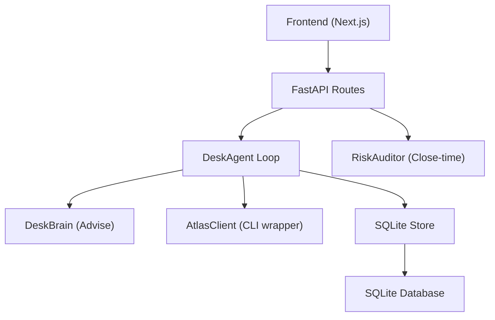
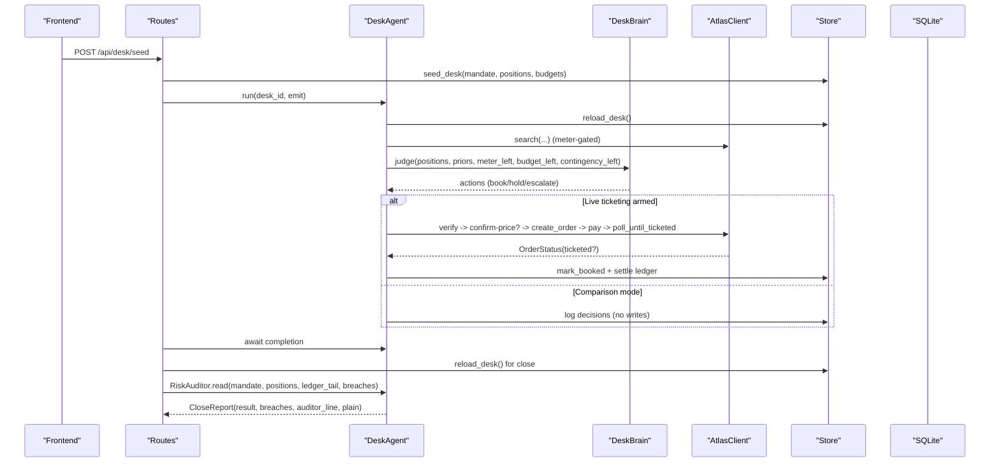
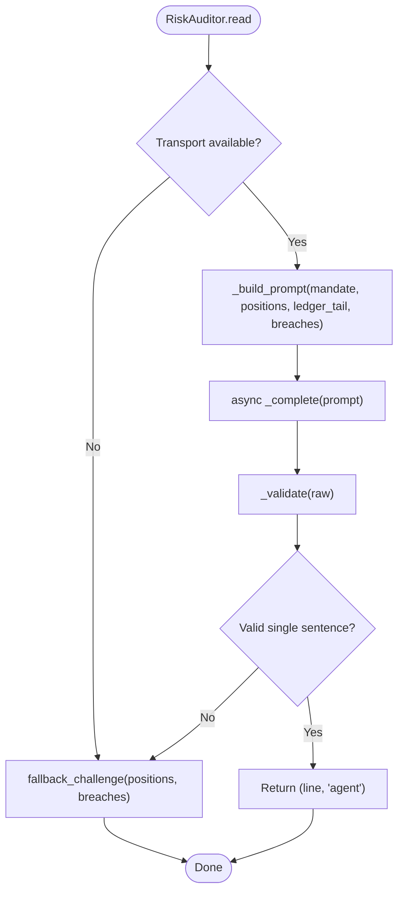
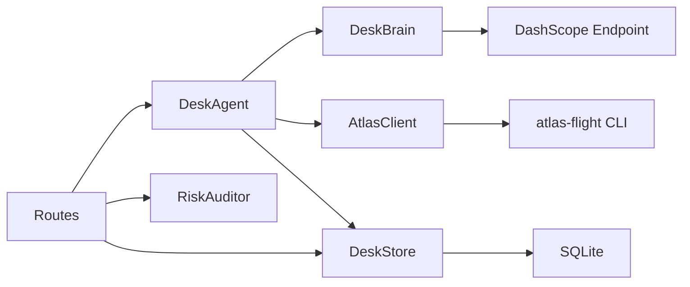

# Risk Auditor System

<cite>
**Referenced Files in This Document**
- [README.md](file://README.md)
- [main.py](file://backend/app/main.py)
- [routes.py](file://backend/app/api/routes.py)
- [models.py](file://backend/app/models.py)
- [auditor.py](file://backend/app/agent/auditor.py)
- [brain.py](file://backend/app/agent/brain.py)
- [loop.py](file://backend/app/agent/loop.py)
- [database.py](file://backend/app/db/database.py)
- [client.py](file://backend/app/atlas/client.py)
- [api.ts](file://frontend/lib/api.ts)
</cite>

## Table of Contents
1. [Introduction](#introduction)
2. [Project Structure](#project-structure)
3. [Core Components](#core-components)
4. [Architecture Overview](#architecture-overview)
5. [Detailed Component Analysis](#detailed-component-analysis)
6. [Dependency Analysis](#dependency-analysis)
7. [Performance Considerations](#performance-considerations)
8. [Troubleshooting Guide](#troubleshooting-guide)
9. [Conclusion](#conclusion)
10. [Appendices](#appendices)

## Introduction
This document explains the Risk Auditor System embedded within Waypoint, an autonomous corporate-travel treasury desk that manages a portfolio of booked travel positions and reacts to disruptions by repricing against a live sandbox, making judgments via an LLM, and executing only through deterministic, fail-closed gates. The risk auditor is a close-time second-pass component that challenges one trade using structured facts from the settled blotter, while deterministic code owns all policy and money math.

Key safety principles:
- Two-gate model: advise (LLM) vs execute (deterministic code).
- Two runtime write gates: human switch and ticketing availability probe; either blocks → comparison mode.
- Three guards: bounded search meter, fresh verify before writes, and booking only after TICKETED assertion.
- Contract discipline: branch on envelope codes, never messages; writes are not retried; read-only calls get at most one retry when allowed.

**Section sources**
- [README.md:7-13](file://README.md#L7-L13)

## Project Structure
The system is split into a FastAPI backend, a Next.js frontend, and supporting data and configuration:
- Backend: orchestration loop, brain (advise), auditor (close-time challenge), Atlas client (subprocess wrapper around CLI), SQLite store, and API routes.
- Frontend: SSE client for live streaming, desk and close views, and API helpers.
- Data: IATA mappings and recorded replay manifests.
- Docs: architecture decisions, plans, and external integration notes.



**Diagram sources**
- [main.py:36-55](file://backend/app/main.py#L36-L55)
- [routes.py:173-187](file://backend/app/api/routes.py#L173-L187)
- [loop.py:118-151](file://backend/app/agent/loop.py#L118-L151)
- [brain.py:85-103](file://backend/app/agent/brain.py#L85-L103)
- [auditor.py:153-167](file://backend/app/agent/auditor.py#L153-L167)
- [client.py:202-219](file://backend/app/atlas/client.py#L202-L219)
- [database.py:74-119](file://backend/app/db/database.py#L74-L119)

**Section sources**
- [README.md:14-41](file://README.md#L14-L41)
- [main.py:36-55](file://backend/app/main.py#L36-L55)

## Core Components
- DeskAgent: orchestrates one cycle — re-read world, meter-gated repricing, brain judgment, execute wall, write path (live only), settle ledger, terminal result.
- DeskBrain: advise gate; batched LLM call per cycle with strict validation; deterministic fallback rule if unavailable.
- RiskAuditor: close-time narration over settled blotter; single-line challenge; deterministic fallback; plain-English builder from structured facts.
- AtlasClient: subprocess wrapper around atlas-flight CLI; read/write paths with typed errors and query-only signals; auth status probe drives comparison mode.
- Store and Database: SQLite persistence for mandate, positions, ledger, budgets; safe drop-and-recreate for demo data; schema backfills.
- API Routes: seed desk, stream SSE events, snapshot state, weekly close report, escalation decision endpoint.

**Section sources**
- [loop.py:118-151](file://backend/app/agent/loop.py#L118-L151)
- [brain.py:85-143](file://backend/app/agent/brain.py#L85-L143)
- [auditor.py:153-203](file://backend/app/agent/auditor.py#L153-L203)
- [client.py:202-353](file://backend/app/atlas/client.py#L202-L353)
- [database.py:74-119](file://backend/app/db/database.py#L74-L119)
- [routes.py:285-425](file://backend/app/api/routes.py#L285-L425)

## Architecture Overview
The system enforces separation between judgment and execution, with strong guarantees around budget, authority caps, and ticketing state.



**Diagram sources**
- [routes.py:285-314](file://backend/app/api/routes.py#L285-L314)
- [loop.py:153-486](file://backend/app/agent/loop.py#L153-L486)
- [brain.py:108-143](file://backend/app/agent/brain.py#L108-L143)
- [client.py:361-507](file://backend/app/atlas/client.py#L361-L507)
- [auditor.py:173-203](file://backend/app/agent/auditor.py#L173-L203)
- [database.py:74-119](file://backend/app/db/database.py#L74-L119)

## Detailed Component Analysis

### RiskAuditor (Close-time Second Pass)
Responsibilities:
- Read settled blotter facts (positions, ledger tail, mandate).
- Produce a single-sentence challenge for exactly one trade or hold decision.
- Degrade deterministically if LLM transport fails or output is invalid.
- Provide a plain-English twin built purely from structured facts.

Design highlights:
- Transport seam allows test injection; default uses httpx against DashScope with timeout.
- Output contract enforced: non-empty, single sentence, length cap; numeric decimals preserved.
- Deterministic fallback picks worst mark-vs-cost position and quotes code-computed breach count when provided.
- Plain English builder checks for over-cap trades without waiver and flags worst delta holds.



**Diagram sources**
- [auditor.py:173-203](file://backend/app/agent/auditor.py#L173-L203)
- [auditor.py:208-245](file://backend/app/agent/auditor.py#L208-L245)
- [auditor.py:247-301](file://backend/app/agent/auditor.py#L247-L301)

**Section sources**
- [auditor.py:52-77](file://backend/app/agent/auditor.py#L52-L77)
- [auditor.py:95-150](file://backend/app/agent/auditor.py#L95-L150)
- [auditor.py:153-203](file://backend/app/agent/auditor.py#L153-L203)
- [auditor.py:208-301](file://backend/app/agent/auditor.py#L208-L301)

### DeskAgent (Orchestration Loop)
Responsibilities:
- Re-read world state before any action.
- Meter-gated repricing fan-out across held positions.
- Admit losses based on curated bands.
- Invoke brain for advice; enforce execute wall with deterministic checks.
- Run write path only when both gates allow; otherwise log decisions.
- Settle ledger entries and compute P&L; label budget exhaustion.

Key invariants:
- Search meter capped at 20 per cycle.
- Escalation wait bounded; nothing executes on a guess.
- Verify before every write; budget and authority cap re-checked immediately prior to order creation.
- Booking asserted only after TICKETED.

```mermaid
sequenceDiagram
participant AG as "DeskAgent"
participant ST as "Store"
participant AT as "AtlasClient"
participant BR as "DeskBrain"
AG->>ST : reload_desk()
AG->>AT : search(...) x N (meter-gated)
AG->>BR : judge(held, priors, meter_left, budget_left, contingency_left)
loop For each action
alt Hold
AG->>ST : log trade (comparison mode)
alt Book/Escalate
alt Over cap/budget or escalate
AG->>AG : _escalation_beat()
alt Human click A
AG->>AT : verify -> confirm-price? -> create_order -> pay -> poll_until_ticketed
AT-->>AG : TICKETED?
AG->>ST : mark_booked + settle
else No click or B
AG->>ST : log decision (no execution)
end
else Within limits
AG->>AT : verify -> confirm-price? -> create_order -> pay -> poll_until_ticketed
AT-->>AG : TICKETED?
AG->>ST : mark_booked + settle
end
end
end
AG->>ST : settle ledger (spend, contingency used)
AG-->>AG : compute P&L, label status
```

**Diagram sources**
- [loop.py:153-486](file://backend/app/agent/loop.py#L153-L486)
- [loop.py:494-569](file://backend/app/agent/loop.py#L494-L569)
- [loop.py:576-634](file://backend/app/agent/loop.py#L576-L634)
- [loop.py:648-800](file://backend/app/agent/loop.py#L648-L800)

**Section sources**
- [loop.py:153-486](file://backend/app/agent/loop.py#L153-L486)
- [loop.py:494-569](file://backend/app/agent/loop.py#L494-L569)
- [loop.py:576-634](file://backend/app/agent/loop.py#L576-L634)
- [loop.py:648-800](file://backend/app/agent/loop.py#L648-L800)

### DeskBrain (Advise Gate)
Responsibilities:
- Batched LLM call per cycle with strict JSON validation.
- Deterministic fallback rule based on curated route bands.
- Absorb/requote logic based on contingency remainder.
- Admitted-loss detection for held positions beyond band floor.

Safety:
- Never raises; degrades to fallback on any failure.
- Provenance rail tracks last source (agent vs deterministic-fallback).

**Section sources**
- [brain.py:85-143](file://backend/app/agent/brain.py#L85-L143)
- [brain.py:149-179](file://backend/app/agent/brain.py#L149-L179)
- [brain.py:186-218](file://backend/app/agent/brain.py#L186-L218)
- [brain.py:224-337](file://backend/app/agent/brain.py#L224-L337)

### AtlasClient (Write Path and Auth Probe)
Responsibilities:
- Subprocess wrapper around atlas-flight CLI with robust error handling.
- Read-only retry policy: at most one identical retry when allowed.
- Write path: verify -> confirm-price (if increased) -> create_order -> pay -> poll_until_ticketed.
- Query-only signals direct follow-up to order status; never re-create/pay.
- Auth status probe drives comparison mode; cached per cycle.

Error model:
- Typed exceptions: AtlasError, AtlasQueryOnly, AtlasUnknownOrder, AtlasNoResults.
- Branch on envelope codes; never messages.

**Section sources**
- [client.py:89-121](file://backend/app/atlas/client.py#L89-L121)
- [client.py:202-353](file://backend/app/atlas/client.py#L202-L353)
- [client.py:361-507](file://backend/app/atlas/client.py#L361-L507)
- [client.py:509-556](file://backend/app/atlas/client.py#L509-L556)

### API Routes and Frontend Integration
Responsibilities:
- Seed desk and start cycle asynchronously.
- Stream SSE events with replay buffer.
- Snapshot desk state including search meter usage.
- Weekly close: await completion, compute breaches, invoke auditor, return CloseReport.
- Escalation decision endpoint with slot hygiene and 410 Gone semantics.

Frontend:
- API helpers for seeding, streaming, snapshots, close outcomes, and escalation decisions.
- Handles HTTP statuses to map to outcome types (still running, crashed, not found, unreachable).

**Section sources**
- [routes.py:285-425](file://backend/app/api/routes.py#L285-L425)
- [api.ts:1-110](file://frontend/lib/api.ts#L1-L110)

## Dependency Analysis
Coupling and cohesion:
- Routes depend on DeskAgent, RiskAuditor, and DeskStore; they coordinate lifecycle and presentation.
- DeskAgent depends on DeskBrain, AtlasClient, and DeskStore; it centralizes control flow and invariants.
- AtlasClient encapsulates CLI interactions and error contracts; loop and routes remain transport-agnostic.
- Models define stable contracts across components and frontend.

Potential circularities:
- None detected; imports are layered (routes -> agent/store/models; agents -> models; clients -> models).

External dependencies:
- Atlas CLI via subprocess; environment-based keyring and sandbox config.
- DashScope OpenAI-compatible endpoint for LLM calls.
- SQLite for persistence.



**Diagram sources**
- [routes.py:173-187](file://backend/app/api/routes.py#L173-L187)
- [loop.py:118-151](file://backend/app/agent/loop.py#L118-L151)
- [client.py:202-219](file://backend/app/atlas/client.py#L202-L219)
- [brain.py:85-103](file://backend/app/agent/brain.py#L85-L103)
- [database.py:74-119](file://backend/app/db/database.py#L74-L119)

**Section sources**
- [routes.py:173-187](file://backend/app/api/routes.py#L173-L187)
- [loop.py:118-151](file://backend/app/agent/loop.py#L118-L151)
- [client.py:202-219](file://backend/app/atlas/client.py#L202-L219)
- [brain.py:85-103](file://backend/app/agent/brain.py#L85-L103)
- [database.py:74-119](file://backend/app/db/database.py#L74-L119)

## Performance Considerations
- Search meter limits fan-out to 20 searches per cycle; concurrency bounded by semaphore to avoid overload.
- LLM calls are batched per cycle with timeouts to prevent long hangs.
- Auditor has tight timeouts to keep close responsive; degradation ensures no blocking.
- Write path uses exponential backoff polling for ticketing; avoids excessive queries.
- SQLite operations use transactions for settlement; schema backfills are idempotent.

[No sources needed since this section provides general guidance]

## Troubleshooting Guide
Common issues and resolutions:
- Missing CLI: AtlasError("CLI_NOT_FOUND") indicates atlas-flight not on PATH; install skill and ensure environment configured.
- Bad envelope: AtlasError("BAD_ENVELOPE") suggests malformed CLI output; inspect logs and CLI version compatibility.
- Ticketing unavailable: Comparison mode active; check WAYPOINT_LIVE_BOOKING and auth status probe results.
- Escalation gone: 410 response means escalation slot expired or consumed; refresh UI or re-run cycle.
- Database schema mismatch: init_db drops and recreates tables when empty; legacy tables cleaned up automatically.

Operational tips:
- Use recorded mode for deterministic replays without credentials.
- Keep DASHSCOPE_API_KEY and base URL configured for LLM fallback behavior.
- Monitor SSE stream for step counts and error codes to diagnose stalls.

**Section sources**
- [client.py:215-249](file://backend/app/atlas/client.py#L215-L249)
- [routes.py:406-425](file://backend/app/api/routes.py#L406-L425)
- [database.py:74-119](file://backend/app/db/database.py#L74-L119)

## Conclusion
The Risk Auditor System integrates a disciplined two-gate model with a close-time auditor that challenges one trade using structured facts. Deterministic code owns all policy and money math, while the LLM provides narrative and judgment under strict constraints. The system’s design emphasizes safety, transparency, and resilience, ensuring that real money moves only when fully authorized and verified.

[No sources needed since this section summarizes without analyzing specific files]

## Appendices
- Setup and demo flow details are documented in the repository README.
- External integration notes cover Atlas CLI authentication and known issues.

**Section sources**
- [README.md:43-106](file://README.md#L43-L106)