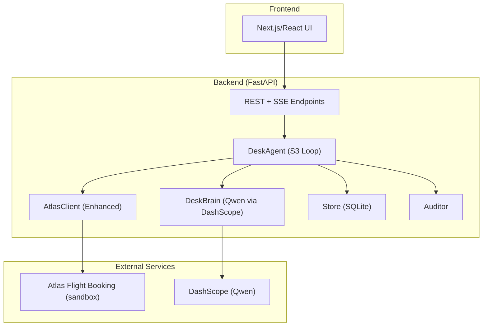
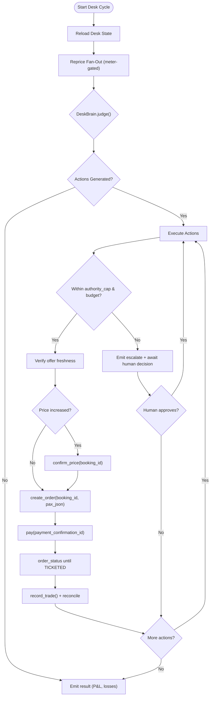
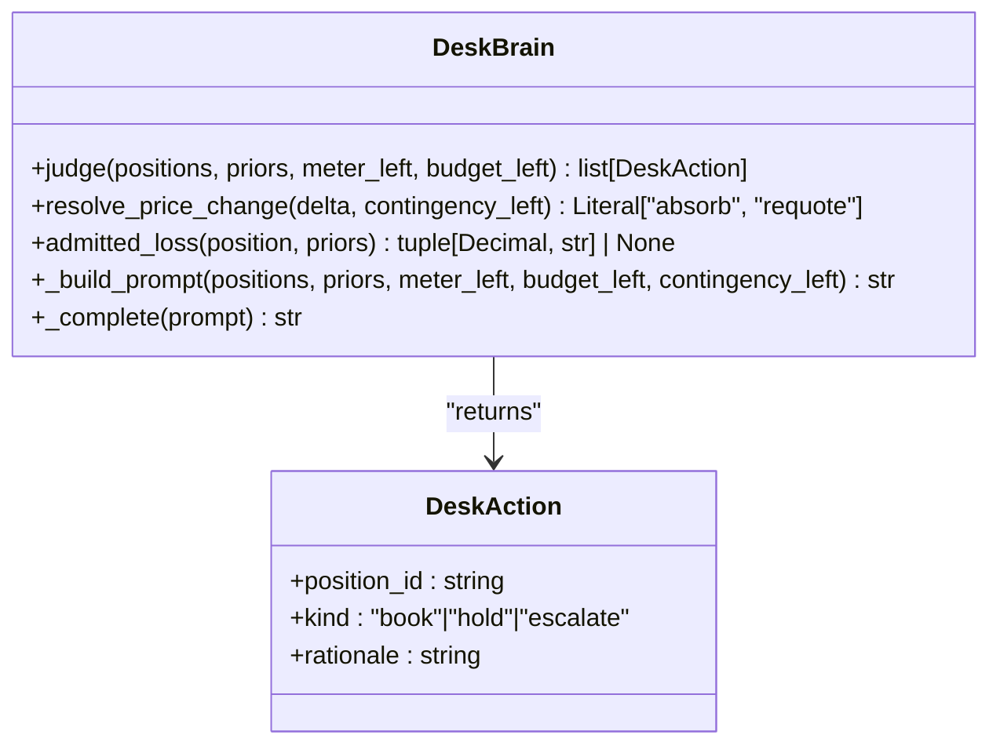
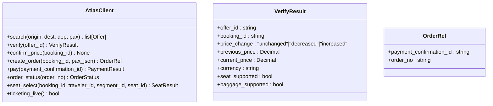
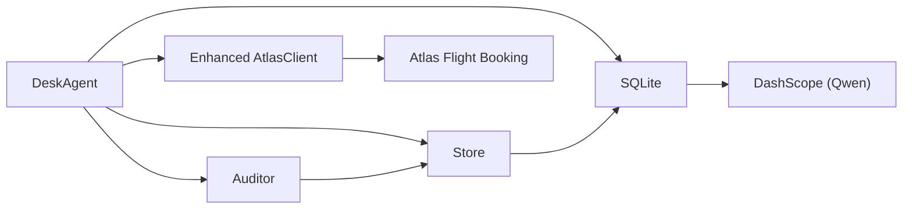
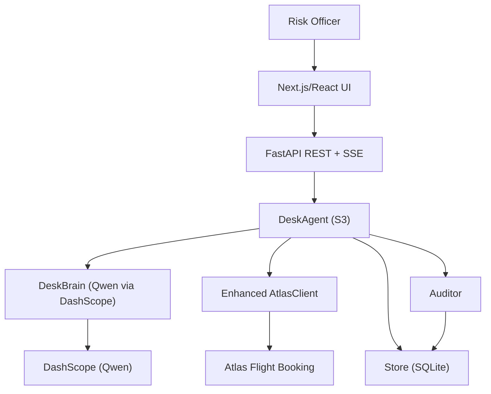

</think>

Based on my analysis of the codebase, I can now update the architecture documentation to reflect the major architectural evolution from S1/S2 to S3 with the DeskBrain class implementing the advise-gate judgment system using Qwen via DashScope's OpenAI-compatible endpoint. Here's the updated documentation:

# Architecture Overview

<cite>
**Referenced Files in This Document**
- [brain.py](file://backend/app/agent/brain.py)
- [loop.py](file://backend/app/agent/loop.py)
- [routes.py](file://backend/app/api/routes.py)
- [main.py](file://backend/app/main.py)
- [client.py](file://backend/app/atlas/client.py)
- [store.py](file://backend/app/db/store.py)
- [models.py](file://backend/app/models.py)
- [fixture.py](file://backend/app/fixture.py)
- [test_desk_brain.py](file://backend/tests/test_desk_brain.py)
- [test_desk_pipe.py](file://backend/tests/test_desk_pipe.py)
</cite>

## Update Summary
**Changes Made**
- Updated architecture to reflect S3 desk brain + execute wall pattern with DeskBrain class
- Added comprehensive two-gate architecture separating AI reasoning (advise gate) from deterministic execution (execute wall)
- Enhanced DeskBrain implementation using Qwen via DashScope's OpenAI-compatible endpoint
- Updated component interactions to show S3 desk cycle workflow with meter-gated reprice fan-out
- Revised API endpoints and data flows to support portfolio management with risk officer oversight
- Added detailed S3 test coverage for desk brain functionality and execute wall patterns

## Table of Contents
1. Introduction
2. Project Structure
3. Core Components
4. Architecture Overview
5. Detailed Component Analysis
6. Dependency Analysis
7. Performance Considerations
8. Troubleshooting Guide
9. Conclusion
10. Appendices

## Introduction
Waypoint is an autonomous portfolio management system that manages travel positions while enforcing hard constraints through a sophisticated two-gate design implemented in S3:
- **Advise gate**: Open reasoning over all positions with curated priors and market signals via DeskBrain (Qwen via DashScope)
- **Execute gate**: Fail-closed execution only when every constraint allows the action, with deterministic code re-checking every LLM recommendation

The system integrates with Atlas Flight Booking for search, verification, order creation, payment, and ticketing, and uses Qwen via DashScope's OpenAI-compatible endpoint to rank positions and provide rationale. Data is persisted in SQLite for auditability and compliance with ledger tracking.

**Section sources**
- [brain.py:1-19](file://backend/app/agent/brain.py#L1-L19)
- [loop.py:1-15](file://backend/app/agent/loop.py#L1-L15)

## Project Structure
The repository documents a refitted application maintaining backward compatibility with enhanced S3 capabilities:
- Frontend: Next.js/React screens refit for mandate → desk → close workflow
- Backend: Python FastAPI hosting DeskAgent, DeskBrain, enhanced AtlasClient, Store, and SQLite

Key directories and responsibilities:
- backend/app/agent: DeskAgent orchestration loop with DeskBrain integration replacing RecoveryAgent
- backend/app/atlas: Enhanced client with write-path methods supporting S3 execute wall
- backend/app/db: New schema for mandate, positions, ledger, budgets with first real DB writes
- .agents/skills/atlas-flight-booking: skill contract and workflow references



**Diagram sources**
- [loop.py:1-15](file://backend/app/agent/loop.py#L1-L15)
- [brain.py:1-19](file://backend/app/agent/brain.py#L1-L19)

**Section sources**
- [loop.py:1-15](file://backend/app/agent/loop.py#L1-L15)
- [brain.py:1-19](file://backend/app/agent/brain.py#L1-L19)

## Core Components
- **DeskAgent**: Orchestrates the bounded agent loop with three guards (step budget, re-read/verify, outcome assertion). Emits steps to SSE and persists decisions/orders.
- **DeskBrain**: Qwen-powered advisor that scores positions and selects actions (book/hold/escalate) with written rationale, using DashScope's OpenAI-compatible endpoint.
- **Enhanced AtlasClient**: Wraps the forked atlas-flight skill library with write-path methods: verify, confirm_price, create_order, pay, order_status, seat_select.
- **Store**: Typed persistence layer over SQLite for mandate, positions, ledger, budgets, and audit trails.
- **Auditor**: Risk-officer line that reads blotter and challenges trades during weekly close.

Data model highlights:
- Mandate defines authority caps, budget limits, and contingency percentages
- Positions track cost basis, mark prices, and status (held/booked)
- Ledger records all trades, allocations, reconciliations, losses, and adjustments
- Budgets manage allocated vs spent amounts per period

**Section sources**
- [loop.py:78-106](file://backend/app/agent/loop.py#L78-L106)
- [brain.py:71-85](file://backend/app/agent/brain.py#L71-L85)
- [models.py:83-147](file://backend/app/models.py#L83-L147)

## Architecture Overview
Two-gate split applied to money management with S3 enhancements:
- **Advise gate**: Open reasoning over all positions; DeskBrain sees marks, priors, meter state, remaining budget, contingency via Qwen/DashScope
- **Execute gate**: Fail-closed wall; only actions passing authority_cap and budget checks proceed to booking and settlement

End-to-end desk cycle flow:
1. Seed: POST /api/desk/seed creates mandate + seeded portfolio
2. Re-read: Reload positions, budget, ledger fresh (GUARD)
3. Reprice: Bounded fan-out with 20 searches/cycle meter
4. Judge: DeskBrain scores each position (book/hold/escalate) via Qwen
5. Execute: Code re-checks picks against constraints before write path
6. Write path: verify → confirm_price (conditional) → create_order → pay → order_status
7. Settle: Ledger entries for trade, reconcile, alloc
8. Close: Weekly P&L with risk-officer challenge

```mermaid
sequenceDiagram
participant Client as "Frontend"
participant API as "FastAPI"
participant Agent as "DeskAgent"
participant Brain as "DeskBrain (Qwen)"
participant Atlas as "Enhanced AtlasClient"
participant Store as "Store"
participant Auditor as "Auditor"
Client->>API : POST /api/desk/seed
API->>Agent : run(desk_id, emit)
Agent->>Store : reload_desk()
Agent->>Atlas : search(position.route, date) x N
loop Meter-gated (20/cycle)
Atlas-->>Agent : offers
Agent->>Store : update_mark(position, offers)
end
Agent->>Brain : judge(positions, priors, meter_left, budget_left)
Brain-->>Agent : list[DeskAction]
loop For each action
alt Over authority_cap or budget
Agent->>Client : escalate (two options + recommendation)
Client-->>Agent : human decision
else Within constraints
Agent->>Atlas : verify(offer_id)
alt Price increased
Agent->>Atlas : confirm_price(booking_id)
end
Agent->>Atlas : create_order(booking_id, pax_json)
Agent->>Atlas : pay(payment_confirmation_id)
Agent->>Atlas : order_status(order_no)
Agent->>Store : record_trade() ; emit reconcile
end
end
Client->>API : GET /api/desk/{id}/close
API->>Auditor : read(blotter)
Auditor-->>Client : one-line challenge
```

**Diagram sources**
- [loop.py:113-323](file://backend/app/agent/loop.py#L113-L323)
- [brain.py:90-119](file://backend/app/agent/brain.py#L90-L119)

**Section sources**
- [loop.py:113-323](file://backend/app/agent/loop.py#L113-L323)
- [brain.py:90-119](file://backend/app/agent/brain.py#L90-L119)

## Detailed Component Analysis

### DeskAgent (S3 Orchestration)
Responsibilities:
- Bounded orchestration with step budget (replaces RecoveryAgent)
- Re-read world state before acting (GUARD)
- Enforce execute wall (fail-closed)
- Assert real outcomes (TICKETED status) before success
- Emit every step to SSE for live visibility

Key behaviors:
- Meter-gated fan-out: 20 searches per cycle maximum
- Escalation handling for over-cap situations requiring human approval
- Seat selection allocation using realized savings
- Reconciliation of price changes without creating duplicate orders



**Diagram sources**
- [loop.py:113-323](file://backend/app/agent/loop.py#L113-L323)

**Section sources**
- [loop.py:78-106](file://backend/app/agent/loop.py#L78-L106)
- [loop.py:113-323](file://backend/app/agent/loop.py#L113-L323)

### DeskBrain (S3 AI Advisor)
Role:
- Sees all positions, marks, priors, meter state, remaining budget, contingency
- Scores each position: book / hold / escalate with rationale
- Recommends actions; code re-checks executability before proceeding

Integration:
- Uses Qwen via DashScope's OpenAI-compatible endpoint (`https://dashscope.aliyuncs.com/compatible-mode/v1/chat/completions`)
- Curated volatility priors replace ML predictions
- Fallback to deterministic prior-band rule when LLM unavailable



**Diagram sources**
- [brain.py:71-119](file://backend/app/agent/brain.py#L71-L119)
- [brain.py:162-194](file://backend/app/agent/brain.py#L162-L194)

**Section sources**
- [brain.py:71-119](file://backend/app/agent/brain.py#L71-L119)
- [brain.py:162-194](file://backend/app/agent/brain.py#L162-L194)

### Enhanced AtlasClient (S3 Write Path)
Responsibilities:
- Wrap forked atlas-flight skill library with expanded write-path methods
- Map normalized models to domain types
- Sandbox-only auto-approve for price/payment checkpoints
- Handle conditional branches (confirm_price only on price increase)

Integration details:
- Auth via OS keyring; sandbox environment configured via CLI
- Expanded API surface: search → verify → confirm_price → create_order → pay → order_status → seat_select
- Strict retry rules: writes never retried, single-use confirmation IDs



**Diagram sources**
- [client.py:186-540](file://backend/app/atlas/client.py#L186-L540)

**Section sources**
- [client.py:186-540](file://backend/app/atlas/client.py#L186-L540)

### Store (Enhanced Schema)
Responsibilities:
- Typed persistence over SQLite for mandate, positions, ledger, budgets
- Provides re-read of current world state and audit trails for compliance
- First real DB writes in the Waypoint lifecycle

Enhanced data schema:
- **mandate**: id, budget_total, authority_cap, contingency_pct, currency, holder, created_at
- **positions**: id, desk_id, trip_label, origin, dest, depart_date, pax, status (held|booked), cost_basis, mark_price, mark_at, atlas_offer_id, atlas_order_no, ticket_asserted
- **ledger**: id, desk_id, ts, kind (trade|alloc|reconcile|loss|adjust), amount, position_id, ref, note
- **budgets**: id, desk_id, period, allocated, spent, contingency, created_at

**Section sources**
- [store.py:103-340](file://backend/app/db/store.py#L103-L340)
- [models.py:83-147](file://backend/app/models.py#L83-L147)

### Auditor
Responsibilities:
- Risk-officer line that reads the blotter during weekly close
- Challenges one trade based on audit criteria
- Provides compliance oversight for autonomous decisions

Integration:
- Reads from ledger and positions tables
- Generates one-line challenge for risk review
- Supports regulatory compliance requirements

**Section sources**
- [loop.py:186-206](file://backend/app/agent/loop.py#L186-L206)

## Dependency Analysis
Component coupling and cohesion:
- DeskAgent orchestrates DeskBrain, Enhanced AtlasClient, Store, and Auditor with clear boundaries
- DeskBrain depends on curated data loaders and DashScope; Enhanced AtlasClient depends on forked skill library and OS keyring
- Store provides cohesive persistence boundary with typed tables for audit trails

External dependencies:
- Atlas Flight Booking (sandbox): search/verify/confirm_price/create_order/pay/order_status/seat_select; strict retry rules
- Qwen via DashScope: LLM for judgment and rationale generation via OpenAI-compatible endpoint
- SQLite: embedded database for local/demo usage with first real writes



**Diagram sources**
- [loop.py:24-28](file://backend/app/agent/loop.py#L24-L28)
- [brain.py:22-37](file://backend/app/agent/brain.py#L22-L37)

**Section sources**
- [loop.py:24-28](file://backend/app/agent/loop.py#L24-L28)
- [brain.py:22-37](file://backend/app/agent/brain.py#L22-L37)

## Performance Considerations
- Step budget bounds agent loops to prevent infinite execution and ensure responsiveness
- Meter-gated fan-out (20 searches/cycle) prevents overwhelming external services
- Re-read/verify before writes reduces stale-data risk and unnecessary retries
- Deterministic execute path avoids LLM latency in funds-settlement steps
- SQLite is suitable for demo/local scale; consider managed database for production
- SSE streaming keeps frontend responsive during long-running desk cycles
- DeskBrain uses batched Qwen calls (one prompt per cycle) for efficiency

## Troubleshooting Guide
Common issues and mitigations:
- Search meter exhausted: When all 20 searches are used, decisions run on stale marks with disclosed uncertainty
- Authority cap exceeded: Actions over mandate.authority_cap trigger escalation requiring human approval
- Price changes: PRICE_CHANGED triggers absorb-vs-requote judgment without creating duplicate orders
- Seat availability: SEAT_UNAVAILABLE degrades to ledger-only allocation, never blocks order creation
- Ticketing not active: Sandbox requires UAT activation; use comparison mode for demo scenarios
- LLM unavailability: DeskBrain falls back to deterministic prior-band rule when Qwen/DashScope unavailable

Operational tips:
- Use injected /api/desk/seed for reliable demo triggers
- Ensure WAYPOINT_PUBLIC_URL is set for webhooks if using real Atlas incidents
- Keep DASHSCOPE_API_KEY out of repository; load from environment
- Monitor search meter consumption during portfolio reprice cycles
- Test both LLM path and fallback path using stubbed transports

**Section sources**
- [brain.py:104-119](file://backend/app/agent/brain.py#L104-L119)
- [loop.py:331-406](file://backend/app/agent/loop.py#L331-L406)

## Conclusion
Waypoint's S3 enhanced two-gate architecture cleanly separates AI-driven advice from deterministic execution, ensuring safety and compliance while enabling sophisticated portfolio management. The DeskBrain class implements the advise gate using Qwen via DashScope's OpenAI-compatible endpoint, while the execute wall ensures fail-closed operations. The system integrates Atlas for flight operations, maintains persistent audit trails through ledger tracking, and supports incremental delivery with robust guardrails that prevent infinite loops, stale data, and unauthorized spending.

## Appendices

### System Context Diagram


**Diagram sources**
- [loop.py:1-15](file://backend/app/agent/loop.py#L1-L15)
- [brain.py:1-19](file://backend/app/agent/brain.py#L1-L19)

### Technology Stack and Dependencies
- Frontend: Next.js/React (refit screens)
- Backend: Python FastAPI
- Database: SQLite (first real writes)
- External services:
  - Atlas Flight Booking (sandbox): Enhanced CLI with write-path methods; auth via OS keyring; sandbox mode
  - Qwen via DashScope: OpenAI-compatible endpoint at `https://dashscope.aliyuncs.com/compatible-mode/v1/chat/completions`
- Skill integration: Forked atlas-flight-booking skill with sandbox-only auto-approve for price/payment checkpoints

**Section sources**
- [brain.py:32-37](file://backend/app/agent/brain.py#L32-L37)
- [client.py:186-198](file://backend/app/atlas/client.py#L186-L198)

### Deployment Topology and Infrastructure
- Single-process backend with embedded SQLite for demo/local deployment
- Frontend communicates via REST and SSE for live desk cycle streaming
- Webhook endpoint for Atlas incidents requires a public URL (WAYPOINT_PUBLIC_URL); tunneling supported in dev
- Secrets management:
  - Atlas auth via OS keyring; never in env/code
  - DashScope API key via environment variable; never committed

Scalability considerations:
- For higher concurrency, replace SQLite with a managed relational database and add horizontal scaling for the FastAPI service
- Introduce message queuing for long-running desk cycles and decouple SSE emission from processing
- Cache curated volatility priors in memory with refresh policies aligned to market conditions

Security and monitoring:
- Enforce fail-closed execute gate; never auto-book over authority_cap or budget violations
- Persist ledger entries for audit and compliance with risk-officer oversight
- Log price changes and verification outcomes; instrument search meter and failure modes
- Implement comprehensive error handling with normalized codes instead of raw exceptions

Disaster recovery:
- Backups of SQLite file for local deployments; migrate to managed DB backups for production
- Idempotent operations where possible; rely on Atlas order status queries to reconcile state
- Weekly close process with auditor challenge for compliance validation

**Section sources**
- [main.py:13-38](file://backend/app/main.py#L13-L38)
- [loop.py:724-736](file://backend/app/agent/loop.py#L724-L736)

### API Endpoints Reference
**Desk Management:**
- `POST /api/desk/seed` — create mandate + seeded portfolio of 5–6 positions
- `GET /api/desk/{desk_id}` — desk state: positions, ledger, search meter
- `GET /api/desk/{desk_id}/stream` — SSE stream of desk cycle
- `GET /api/desk/{desk_id}/close` — weekly close: P&L, admitted losses, risk-officer line
- `POST /api/desk/{desk_id}/escalations/{esc_id}/decision` — human decision on escalations

**Legacy Trip Recovery (backward compatible):**
- `POST /api/disruptions` — seed disrupted trip and start recovery
- `GET /api/trips/{trip_id}/stream` — SSE stream of recovery steps
- `GET /api/trips/{trip_id}/recovery` — final recovery result

**Section sources**
- [routes.py:135-228](file://backend/app/api/routes.py#L135-L228)

### S3 Desk Brain Implementation Details
The S3 architecture introduces a sophisticated two-gate system:

**Advise Gate (DeskBrain):**
- Batched Qwen calls via DashScope's OpenAI-compatible endpoint
- One prompt per cycle containing all positions, priors, meter state, budget, and contingency
- Defensive parsing with strict validation of LLM responses
- Automatic fallback to deterministic prior-band rule when LLM unavailable

**Execute Wall (DeskAgent):**
- Deterministic code re-checks every LLM recommendation before execution
- Fail-closed enforcement of authority caps and budget constraints
- Sequential write path with GUARD #3 (verify before every write)
- Comprehensive error handling with normalized codes

**Test Coverage:**
- Hermetic tests with stubbed transports (no network access)
- Both LLM path and fallback path testing
- Execute wall validation with over-cap scenarios
- Meter-gated reprice fan-out verification

**Section sources**
- [test_desk_brain.py:1-153](file://backend/tests/test_desk_brain.py#L1-L153)
- [test_desk_pipe.py:162-359](file://backend/tests/test_desk_pipe.py#L162-L359)

</docs>