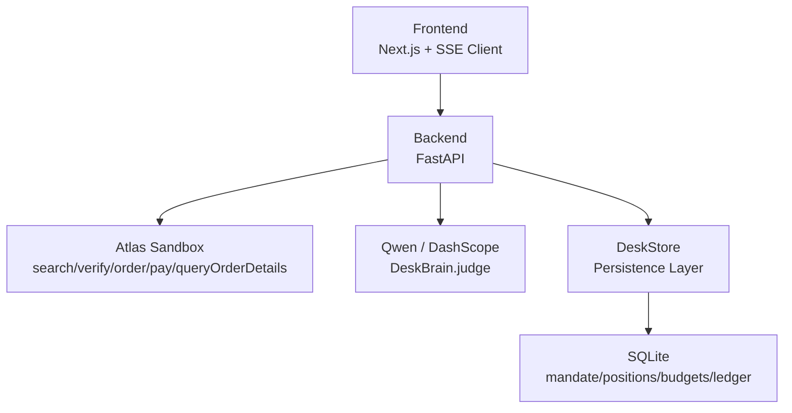
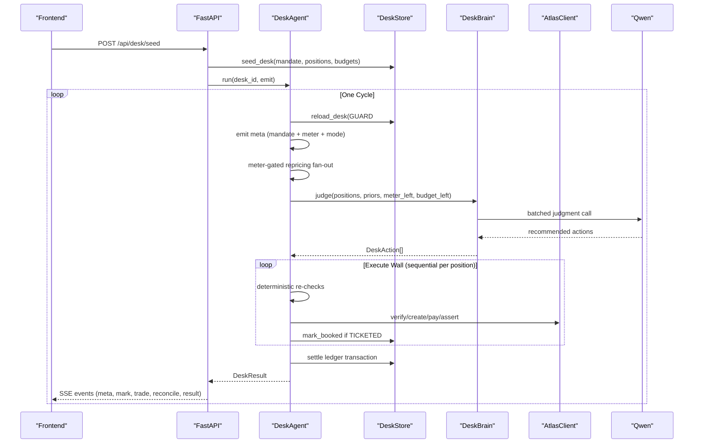
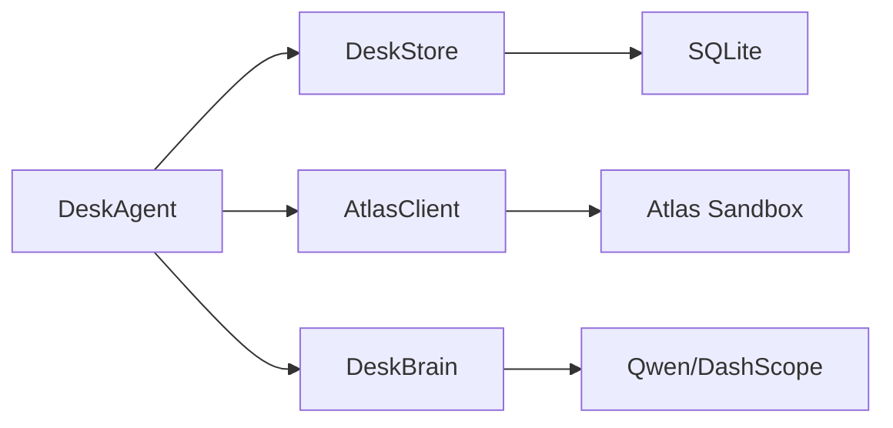

# Data Flows

<cite>
**Referenced Files in This Document**
- [loop.py](file://backend/app/agent/loop.py)
- [brain.py](file://backend/app/agent/brain.py)
- [store.py](file://backend/app/db/store.py)
- [models.py](file://backend/app/models.py)
- [routes.py](file://backend/app/api/routes.py)
- [fixture.py](file://backend/app/fixture.py)
- [02-architecture.md](file://docs/plans/waypoint/02-architecture.md)
</cite>

## Update Summary
**Changes Made**
- Updated agent loop architecture from RecoveryAgent to DeskAgent with new flow pattern
- Added DeskBrain component for AI judgment with fallback mechanisms
- Implemented meter-gated repricing fan-out with bounded concurrency
- Enhanced execute wall with deterministic re-checks and fail-closed behavior
- Added ledger-based settlement system with budget tracking
- Updated SSE event contract with new event types (meta, trade, reconcile, alloc)
- Enhanced error handling with normalized codes and graceful degradation

## Table of Contents
1. [Introduction](#introduction)
2. [Project Structure](#project-structure)
3. [Core Components](#core-components)
4. [Architecture Overview](#architecture-overview)
5. [Detailed Component Analysis](#detailed-component-analysis)
6. [Dependency Analysis](#dependency-analysis)
7. [Performance Considerations](#performance-considerations)
8. [Troubleshooting Guide](#troubleshooting-guide)
9. [Conclusion](#conclusion)

## Introduction
This document describes the end-to-end data flows for Waypoint's autonomous trip recovery system using the new DeskAgent architecture. It traces a complete cycle from desk setup through portfolio management, including setup (seeding mandate + positions), trigger (desk activation), the agent loop with step budget guards, meter-gated repricing fan-out, DeskBrain judgment, execute wall with strict sequential processing, write path, ledger settlement, and terminal result with bounded concurrency controls. It also explains data transformations at each stage, state management, how the SSE stream provides real-time visibility, and error handling flows with graceful degradation.

## Project Structure
Waypoint is organized as a two-part application in one repository:
- Frontend: Next.js/React screens plus an SSE client that renders live agent reasoning steps.
- Backend: Python FastAPI hosting the DeskAgent orchestration loop, DeskBrain judgment, Atlas integration, Qwen calls, and SQLite persistence.

The backend exposes REST endpoints for seeding desks, starting cycles, receiving escalation decisions, querying status, retrieving results, and streaming agent steps via SSE. The database stores mandates, positions, budgets, ledger entries, and audit artifacts to provide a complete decision trail.

**Diagram sources**
- [loop.py:1-15](file://backend/app/agent/loop.py#L1-L15)
- [brain.py:1-19](file://backend/app/agent/brain.py#L1-L19)
- [store.py:1-10](file://backend/app/db/store.py#L1-L10)

**Section sources**
- [loop.py:1-15](file://backend/app/agent/loop.py#L1-L15)
- [routes.py:1-13](file://backend/app/api/routes.py#L1-L13)

## Core Components
- **DeskAgent**: Orchestrates the bounded agent loop, enforces three guards (step budget, re-read before write, assert outcome), and manages the execute wall (only executable positions after deterministic checks).
- **DeskBrain**: Uses Qwen to recommend book/hold/escalate actions per position; includes deterministic fallback when LLM unavailable.
- **DeskStore**: Typed persistence layer over SQLite for all domain entities and audit artifacts with GUARD #2 re-read checkpoint.
- **AtlasClient**: Wraps the Atlas sandbox to perform search, verify, create_order, pay, and order status queries.
- **API Layer**: FastAPI routes for seeding desks, triggering cycles, handling escalations, and streaming events via SSE.

Key data models include Position, Mandate, Budget, DeskAction, DeskResult, LedgerInput, MarkUpdate, and various Atlas response types.

**Section sources**
- [loop.py:78-106](file://backend/app/agent/loop.py#L78-L106)
- [brain.py:71-120](file://backend/app/agent/brain.py#L71-L120)
- [store.py:103-171](file://backend/app/db/store.py#L103-L171)
- [models.py:83-147](file://backend/app/models.py#L83-L147)

## Architecture Overview
The recovery flow follows a deterministic pipeline with AI-assisted judgment. Deterministic code owns ledger math, authority-cap checks, budget checks, and order/pay execution. DeskBrain only recommends actions under curated volatility bands and price/time criteria, with guaranteed fallback behavior.

**Diagram sources**
- [loop.py:113-323](file://backend/app/agent/loop.py#L113-L323)
- [brain.py:90-120](file://backend/app/agent/brain.py#L90-L120)
- [store.py:173-218](file://backend/app/db/store.py#L173-L218)

## Detailed Component Analysis

### Setup: Seeding Mandate and Portfolio
- Purpose: Create a realistic baseline portfolio (mandate + positions + budgets) so the desk has something to manage.
- Data transformation: Mandate, Position, and Budget records are persisted; positions initialized to "held" status with seeded cost bases.
- Visibility: No special stream event required beyond normal setup confirmation.

**Updated** The setup now creates a complete desk with mandate parameters (budget_total, authority_cap, contingency_pct) and multiple travel positions representing different routes.

**Section sources**
- [routes.py:135-151](file://backend/app/api/routes.py#L135-L151)
- [store.py:106-171](file://backend/app/db/store.py#L106-L171)
- [fixture.py:60-146](file://backend/app/fixture.py#L60-L146)

### Trigger: Desk Activation
The desk cycle starts automatically after seeding:
- POST /api/desk/seed persists the portfolio and immediately starts the agent task.
- The agent runs asynchronously in the background, emitting SSE events as it progresses.

Data transformation:
- DeskState created with desk_id, event buffer, and task handle.
- Agent.run invoked with desk_id and emit callback.

SSE visibility:
- Initial meta event indicates cycle start with mandate card, search meter, and mode label.

**Section sources**
- [routes.py:135-151](file://backend/app/api/routes.py#L135-L151)
- [routes.py:107-122](file://backend/app/api/routes.py#L107-L122)

### Agent Loop: Step Budget Guards and New Flow Pattern
The agent loop follows the new deterministic flow pattern with enhanced guards:

1. **Re-read world state** (GUARD #2): Always reload desk state from Store before acting
2. **Emit metadata**: Mandate card + search meter + mode label + disclosures
3. **Meter-gated repricing fan-out**: Up to 20 searches with bounded concurrency
4. **DeskBrain judgment**: AI recommendation with deterministic fallback
5. **Execute wall**: Deterministic re-checks before any writes
6. **Write path**: Live mode only; comparison mode logs decisions without execution
7. **Settle ledger**: Single transaction for all entries
8. **Terminal result**: Final DeskResult with P&L and step count

Guard details:
- Re-read world: Always reload desk state from Store before acting
- Execute wall: Only positions meeting all constraints proceed to booking
- Assert outcome: Confirm real ticket/PNR before marking success

SSE visibility:
- Each step emits structured events (e.g., "meta", "mark", "trade", "reconcile", "result")

**Updated** The flow now includes meter-gated repricing with bounded concurrency (FANOUT_CONCURRENCY = 4) and DeskBrain judgment with guaranteed fallback behavior.

**Section sources**
- [loop.py:113-323](file://backend/app/agent/loop.py#L113-L323)
- [loop.py:331-406](file://backend/app/agent/loop.py#L331-L406)
- [loop.py:485-647](file://backend/app/agent/loop.py#L485-L647)

### Meter-Gated Repricing Fan-Out
- Input: All held positions from the desk blotter
- Process: Concurrent repricing with meter control (max 20 searches per cycle)
- Output: Updated marks with freshness indicators and offer references
- Persistence: Batch updates to position marks with stale flags

Data transformation:
- Atlas search responses mapped to current mark prices
- Stale marks flagged when searches fail or meter exhausted
- Offer IDs captured for later verification

SSE visibility:
- Per-position mark events with old/new prices, search references, and meter usage

**Updated** Now uses bounded concurrency (semaphore with FANOUT_CONCURRENCY = 4) and strict meter gating before dispatch.

**Section sources**
- [loop.py:331-406](file://backend/app/agent/loop.py#L331-L406)

### DeskBrain Judgment: AI-Assisted Decision Making
- Input: All positions with current marks, curated volatility priors, remaining meter/budget/contingency
- Process: Single batched Qwen call evaluating all positions together
- Output: DeskAction[] recommending book/hold/escalate per position
- Fallback: Deterministic prior-band rule when LLM unavailable

Judgment logic:
- Curated route-type classification determines volatility bands
- Mark vs cost basis movement evaluated against curated bands
- Search meter, budget, and contingency considered in rationale
- Guaranteed fallback to deterministic rules when Qwen unavailable

SSE visibility:
- Trade events with position_id, action kind, and detailed rationale

**Updated** Now includes deterministic fallback mechanism and single-batch processing for efficiency.

**Section sources**
- [brain.py:71-155](file://backend/app/agent/brain.py#L71-L155)
- [brain.py:200-299](file://backend/app/agent/brain.py#L200-L299)

### Execute Wall: Strict Sequential Processing
- Purpose: Ensure deterministic safety checks before any external writes
- Process: Sequential evaluation of each recommended action with full re-validation
- Guards: Authority cap checks, budget validation, offer freshness verification
- Fail-closed: Any check failure prevents execution

Execution flow:
- Verify offer freshness and price changes
- Check against remaining budget and authority caps
- Handle PRICE_CHANGED scenarios with contingency absorption
- Execute order creation and payment only after all checks pass
- Assert TICKETED status before marking position as booked

SSE visibility:
- Error events with normalized codes for any execution failures

**Updated** Enhanced with stricter sequential processing and comprehensive error handling.

**Section sources**
- [loop.py:227-303](file://backend/app/agent/loop.py#L227-L303)
- [loop.py:485-647](file://backend/app/agent/loop.py#L485-L647)

### Write Path: Live Mode vs Comparison Mode
- Live Mode: Full execution with order creation, payment, and ticket assertion
- Comparison Mode: Decision logging without actual execution (for testing/demo)
- Gate: Automatic detection of ticketing availability

Mode behavior:
- Comparison mode logs all decisions but skips write commands
- Live mode executes full booking workflow with Atlas integration
- Mode label included in meta event for transparency

SSE visibility:
- Mode disclosure in meta event
- Decision logging even in comparison mode

**Updated** Now includes automatic mode detection and transparent labeling.

**Section sources**
- [loop.py:136-145](file://backend/app/agent/loop.py#L136-L145)
- [loop.py:288-296](file://backend/app/agent/loop.py#L288-L296)

### Ledger Settlement: Transactional Accounting
- Purpose: Atomic settlement of all cycle activities in single transaction
- Entries: Trade, allocation, reconciliation, loss, and adjustment entries
- Budget Tracking: Waterfall spending across budget lines with contingency usage
- Audit Trail: Complete record of all financial movements

Settlement process:
- Collect all LedgerInput entries during cycle execution
- Apply spend waterfall across budget lines (bounded by allocation headroom)
- Track contingency usage for price increases
- Persist both ledger entries and updated budget totals atomically

SSE visibility:
- Reconcile events for price changes
- Alloc events for seat service allocation attempts
- Loss events for admitted losses

**Updated** Enhanced with atomic settlement and comprehensive budget tracking.

**Section sources**
- [loop.py:304-317](file://backend/app/agent/loop.py#L304-L317)
- [store.py:251-304](file://backend/app/db/store.py#L251-L304)

### Terminal Result: Cycle Completion
- Purpose: Provide final state of the desk cycle with complete metrics
- Content: Status, P&L calculation, losses admitted, step count, comparison mode flag
- Delivery: Final SSE event with DeskResult model

Result computation:
- P&L calculated deterministically from position marks vs cost bases
- Losses counted from admitted-loss detections
- Step count tracks total operations performed
- Comparison mode flag indicates whether live ticketing was active

SSE visibility:
- Result event with complete cycle summary

**Section sources**
- [loop.py:739-745](file://backend/app/agent/loop.py#L739-L745)
- [loop.py:703-709](file://backend/app/agent/loop.py#L703-L709)

### SSE Stream: Real-Time Visibility
The SSE endpoint streams structured events throughout the process:
- `meta`: Mandate card, search meter, mode label, disclosures
- `step`: Ordered reasoning steps with narration
- `mark`: Live reprice results with old/new prices
- `trade`: AI recommendations with rationale
- `loss`: Admitted losses with amounts and notes
- `alloc`: Seat service allocation attempts
- `reconcile`: Price change resolutions
- `escalate`: Human intervention requests
- `result`: Terminal cycle state
- `error`: Normalized error codes

These events drive the frontend's live screen showing agent reasoning, decisions, and outcomes with complete transparency.

**Updated** Enhanced with new event types for better observability and debugging.

**Section sources**
- [routes.py:154-180](file://backend/app/api/routes.py#L154-L180)
- [02-architecture.md:43-55](file://docs/plans/waypoint/02-architecture.md#L43-L55)

### Error Handling and Fallback Scenarios
Enhanced error handling with graceful degradation:
- **LLM Unavailable**: Falls back to deterministic prior-band rule with identical DeskAction shape
- **No Legal Option**: Returns graceful failure with explanation, no execution attempted
- **Authorization Issues**: Comparison mode activates, decisions logged but not executed
- **Price Increases**: Absorb from contingency if within limits, otherwise re-quote next cycle
- **Payment Uncertainty**: Query order status instead of retrying payment
- **Service Unavailability**: Retry read-only commands once when retryable=true
- **Budget Exceeded**: Never waived, even with human approval (authority cap can be waived)

Fallback behavior ensures safety and compliance while maintaining visibility through SSE with normalized error codes.

**Updated** Comprehensive fallback mechanisms ensure system reliability under various failure conditions.

**Section sources**
- [brain.py:101-120](file://backend/app/agent/brain.py#L101-L120)
- [brain.py:125-155](file://backend/app/agent/brain.py#L125-L155)
- [loop.py:253-287](file://backend/app/agent/loop.py#L253-L287)
- [loop.py:648-697](file://backend/app/agent/loop.py#L648-L697)

## Dependency Analysis
Waypoint's dependencies are intentionally minimal and well-scoped:
- Backend depends on SQLite for persistence, Atlas sandbox for flight inventory and ticketing, and Qwen/DashScope for judgment.
- Frontend depends on backend REST and SSE endpoints.
- DeskBrain transport is injectable for testing without network access.

**Diagram sources**
- [loop.py:24-28](file://backend/app/agent/loop.py#L24-L28)
- [brain.py:28-31](file://backend/app/agent/brain.py#L28-L31)
- [store.py:17-21](file://backend/app/db/store.py#L17-L21)

**Section sources**
- [loop.py:24-28](file://backend/app/agent/loop.py#L24-L28)
- [brain.py:28-31](file://backend/app/agent/brain.py#L28-L31)

## Performance Considerations
- **Step budget** limits agent loops to prevent excessive external calls and compute usage
- **Meter-gated** search with hard stop at 20 searches per cycle prevents runaway costs
- **Bounded concurrency** (FANOUT_CONCURRENCY = 4) prevents resource exhaustion during repricing
- **Deterministic code** owns expensive or risky steps (ledger math, budget checks, order/pay), reserving LLM for judgment only
- **Single-batch** LLM calls reduce latency and API costs
- **Atomic settlement** ensures consistency and reduces database transactions
- **SSE streaming** avoids polling overhead and provides efficient real-time updates

## Troubleshooting Guide
Common issues and resolutions:
- **LLM timeout/failure**: System falls back to deterministic prior-band rule automatically
- **Search meter exhausted**: Review position portfolio and consider reducing concurrent repricing
- **Budget exceeded**: Cannot be waived - adjust budget allocations or reduce position sizes
- **Authority cap exceeded**: Can be resolved through human escalation process
- **PRICE_CHANGED**: System automatically absorbs from contingency if within limits
- **Ticketing unavailable**: System switches to comparison mode automatically
- **Escalation timeout**: Human must respond within bounded wait period (default 300 seconds)

Use the SSE stream to pinpoint where failures occur and inspect persisted ledger entries for auditability.

**Section sources**
- [brain.py:101-120](file://backend/app/agent/brain.py#L101-L120)
- [loop.py:253-287](file://backend/app/agent/loop.py#L253-L287)
- [loop.py:648-697](file://backend/app/agent/loop.py#L648-L697)

## Conclusion
Waypoint's data flows implement a safe, auditable, and autonomous portfolio management pipeline using the new DeskAgent architecture. The system combines deterministic execution with AI-assisted judgment, enforced by strict guards, meter-gated resources, and a fail-closed execute wall. End-to-end visibility is provided via comprehensive SSE events, and the ledger captures the complete decision trail for compliance. When legal options are unavailable or LLM services fail, the system gracefully degrades with clear explanations, ensuring reliability and trustworthiness while maintaining operational continuity through deterministic fallbacks.