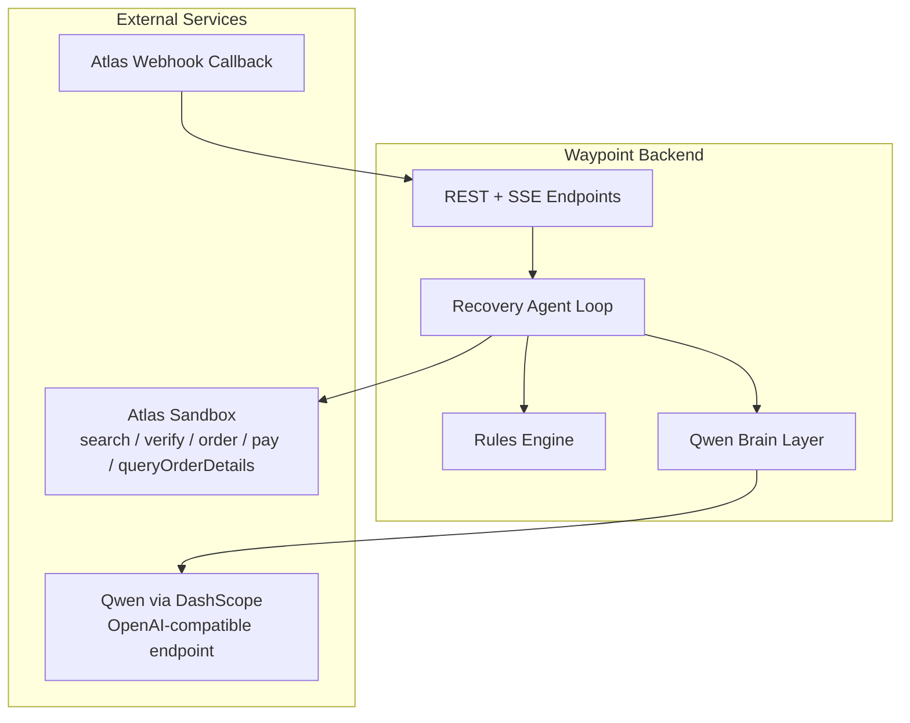
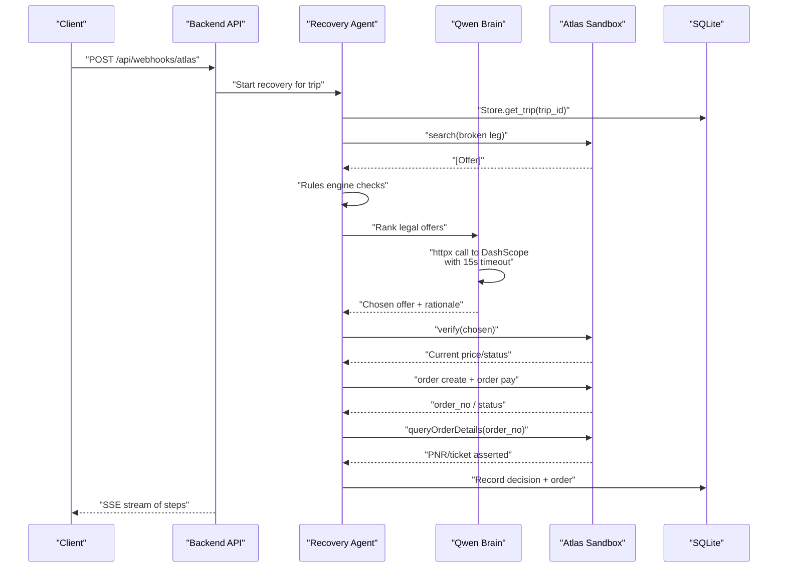
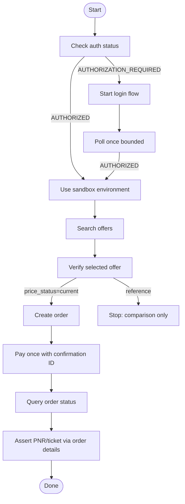
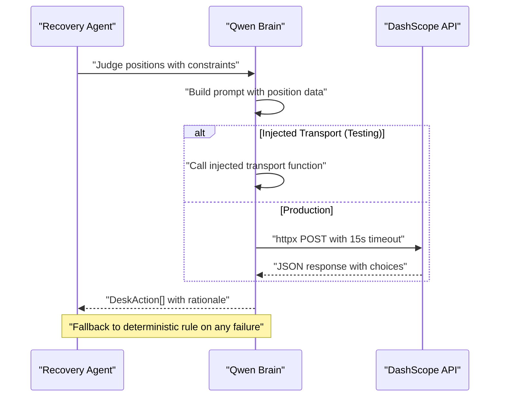
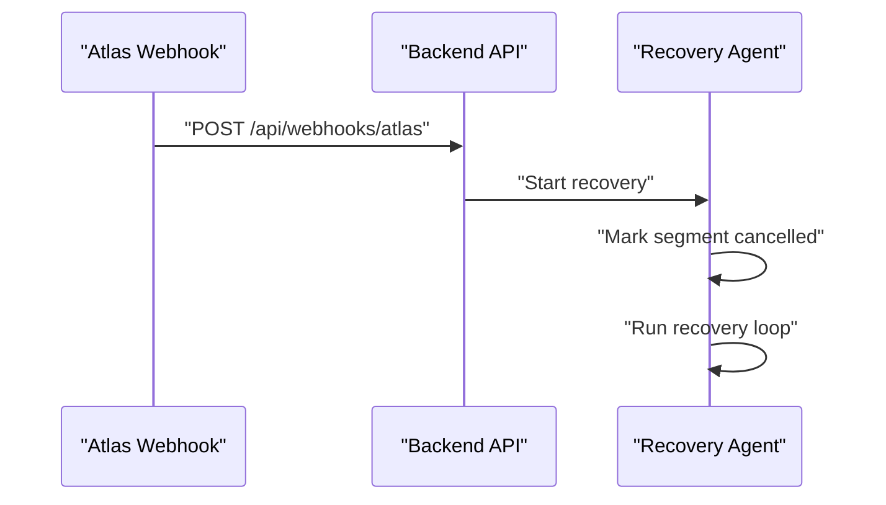
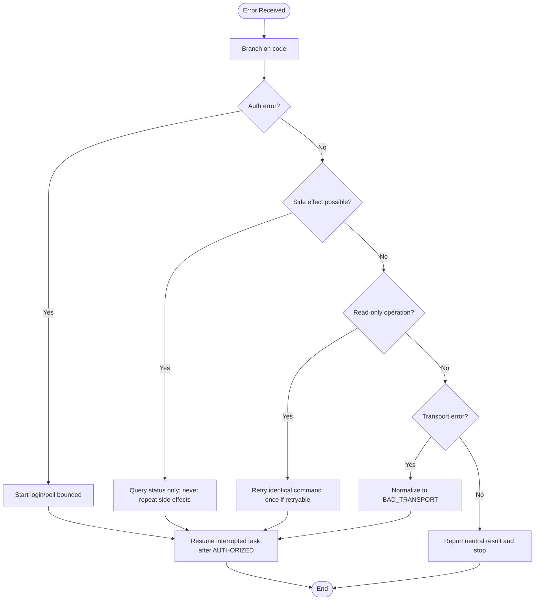
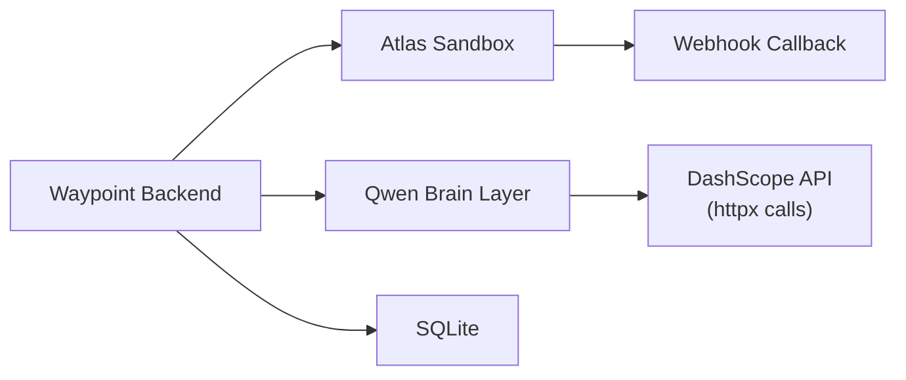

# External Integrations

<cite>
**Referenced Files in This Document**
- [atlas-integration.md](file://docs/external/atlas-integration.md)
- [SKILL.md](file://.agents/skills/atlas-flight-booking/SKILL.md)
- [cli-contract.md](file://.agents/skills/atlas-flight-booking/references/cli-contract.md)
- [booking-workflow.md](file://.agents/skills/atlas-flight-booking/references/booking-workflow.md)
- [error-handling.md](file://.agents/skills/atlas-flight-booking/references/error-handling.md)
- [passenger-input.md](file://.agents/skills/atlas-flight-booking/references/passenger-input.md)
- [02-architecture.md](file://docs/plans/waypoint/02-architecture.md)
- [brain.py](file://backend/app/agent/brain.py)
- [client.py](file://backend/app/atlas/client.py)
- [test_atlas_write_path_unit.py](file://backend/tests/test_atlas_write_path_unit.py)
</cite>

## Update Summary
**Changes Made**
- Enhanced Qwen integration via DashScope's OpenAI-compatible endpoint with plain httpx calls and 15-second timeout
- Added injectable transport mechanism for testing Qwen integration
- Improved Atlas client with normalized transport error handling (BAD_TRANSPORT)
- Updated ticketing cache management with per-cycle reset functionality

## Table of Contents
1. [Introduction](#introduction)
2. [Project Structure](#project-structure)
3. [Core Components](#core-components)
4. [Architecture Overview](#architecture-overview)
5. [Detailed Component Analysis](#detailed-component-analysis)
6. [Dependency Analysis](#dependency-analysis)
7. [Performance Considerations](#performance-considerations)
8. [Troubleshooting Guide](#troubleshooting-guide)
9. [Conclusion](#conclusion)

## Introduction
This document explains how Waypoint integrates with external services to support autonomous flight disruption recovery. It focuses on:
- Atlas Flight Booking API integration (sandbox configuration, OS keyring authentication, supported operations, and webhook handling)
- Qwen AI integration via Alibaba DashScope (API key configuration, usage patterns, and enhanced transport layer)
- Webhook callback mechanism for real-time disruption notifications
- Error handling strategies, retry logic, and fallback mechanisms
- Security considerations and data privacy measures for external interactions

## Project Structure
Waypoint's integration points are defined across planning and skill documentation:
- Architecture and endpoints define the backend surface that receives webhooks and orchestrates recovery
- The forked Atlas Flight Booking Skill defines CLI commands, authorization flow, and safe booking workflow
- Error handling references codify stable codes and retry rules
- Passenger input guidance ensures sensitive data is never echoed or logged

**Diagram sources**
- [02-architecture.md:13-19](file://docs/plans/waypoint/02-architecture.md#L13-L19)
- [02-architecture.md:34-49](file://docs/plans/waypoint/02-architecture.md#L34-L49)
- [02-architecture.md:51-55](file://docs/plans/waypoint/02-architecture.md#L51-L55)
- [brain.py:32-37](file://backend/app/agent/brain.py#L32-L37)

**Section sources**
- [02-architecture.md:13-19](file://docs/plans/waypoint/02-architecture.md#L13-L19)
- [02-architecture.md:34-49](file://docs/plans/waypoint/02-architecture.md#L34-L49)
- [02-architecture.md:51-55](file://docs/plans/waypoint/02-architecture.md#L51-L55)

## Core Components
- Atlas Flight Booking integration:
  - Environment: sandbox-only; auth via ATRIP OAuth stored in the OS keyring; environment switching via CLI
  - Operations: search, offer list, verify, optional services (baggage/seat), order creation, payment, status polling, and order details assertion
  - Webhook & Incident APIs are part of the group used as a candidate disruption trigger
  - **Enhanced**: Normalized transport error handling with BAD_TRANSPORT code for subprocess failures
- Qwen via DashScope:
  - Configuration via DASHSCOPE_API_KEY environment variable
  - **Enhanced**: Direct httpx calls to DashScope's OpenAI-compatible endpoint with 15-second timeout
  - **Enhanced**: Injectable transport mechanism for testing without network access
  - Used by the backend to rank legal rebooking options and provide rationale
- Webhook callback:
  - A public URL registered in ATRIP delivers real disruption events to the backend endpoint
  - Development uses a tunnel to expose the local service

Key operational notes:
- Never auto-approve outside sandbox
- Do not reuse offers with reference pricing
- Re-read trip state before acting and assert final ticketing outcome

**Section sources**
- [atlas-integration.md:5-13](file://docs/external/atlas-integration.md#L5-L13)
- [atlas-integration.md:15-21](file://docs/external/atlas-integration.md#L15-L21)
- [SKILL.md:26-37](file://.agents/skills/atlas-flight-booking/SKILL.md#L26-L37)
- [02-architecture.md:51-55](file://docs/plans/waypoint/02-architecture.md#L51-L55)
- [client.py:227-232](file://backend/app/atlas/client.py#L227-L232)
- [brain.py:32-37](file://backend/app/agent/brain.py#L32-L37)

## Architecture Overview
The recovery flow is triggered either by an injected endpoint or by a real Atlas webhook. The agent then searches alternatives, applies rules, asks Qwen to rank legal options, verifies live pricing, creates and pays orders (sandbox auto-approve), and asserts ticket issuance.

**Diagram sources**
- [02-architecture.md:34-49](file://docs/plans/waypoint/02-architecture.md#L34-L49)
- [02-architecture.md:51-55](file://docs/plans/waypoint/02-architecture.md#L51-L55)
- [brain.py:241-264](file://backend/app/agent/brain.py#L241-L264)

## Detailed Component Analysis

### Atlas Flight Booking Integration
- Authentication and environment:
  - ATRIP OAuth via browser; tokens and credentials are stored in the OS keyring
  - Switch to sandbox using the CLI; after switching, start a fresh search
- Supported operations:
  - Search, offer list, verify, optional baggage/seat selection, order creation, payment, status polling, and order details assertion
  - Price status matters: only current/verified offers proceed to order
- Webhook & Incident APIs:
  - Part of the Atlas groups used as a candidate real disruption trigger
- Ticketing activation:
  - Current sandbox may require activation; modules include Flight Booking, Ticket Fulfillment, Refund, and Webhook Notification
  - Auto-approve behavior is restricted to sandbox only
- **Enhanced Error Handling**:
  - Transport failures (FileNotFoundError, OSError, UnicodeDecodeError) are normalized to BAD_TRANSPORT errors
  - Per-cycle ticketing cache with reset capability for mid-run activation detection

**Diagram sources**
- [cli-contract.md:9-28](file://.agents/skills/atlas-flight-booking/references/cli-contract.md#L9-L28)
- [cli-contract.md:30-43](file://.agents/skills/atlas-flight-booking/references/cli-contract.md#L30-L43)
- [cli-contract.md:57-64](file://.agents/skills/atlas-flight-booking/references/cli-contract.md#L57-L64)
- [atlas-integration.md:15-21](file://docs/external/atlas-integration.md#L15-L21)

**Section sources**
- [atlas-integration.md:5-13](file://docs/external/atlas-integration.md#L5-L13)
- [atlas-integration.md:15-21](file://docs/external/atlas-integration.md#L15-L21)
- [cli-contract.md:9-28](file://.agents/skills/atlas-flight-booking/references/cli-contract.md#L9-L28)
- [cli-contract.md:30-43](file://.agents/skills/atlas-flight-booking/references/cli-contract.md#L30-L43)
- [cli-contract.md:57-64](file://.agents/skills/atlas-flight-booking/references/cli-contract.md#L57-L64)
- [client.py:227-232](file://backend/app/atlas/client.py#L227-L232)
- [client.py:321-337](file://backend/app/atlas/client.py#L321-L337)

### Qwen AI Integration via Alibaba DashScope
- Configuration:
  - API key provided through DASHSCOPE_API_KEY environment variable; values must never be committed to the repository
- **Enhanced Usage Pattern**:
  - Direct httpx calls to DashScope's OpenAI-compatible endpoint (`https://dashscope.aliyuncs.com/compatible-mode/v1/chat/completions`)
  - 15-second timeout enforced via `asyncio.wait_for()` wrapper
  - Injectable transport mechanism allows testing without network access
  - Default model: qwen-plus with temperature 0.2
  - Fallback to deterministic prior-band rule on any failure (no key, transport error, timeout, non-JSON response)
- Integration Points:
  - The brain layer owns ONLY judgment/ranking decisions
  - Deterministic code handles execution and re-checks every pick after brain returns
  - Never touches AtlasClient or DeskStore directly

**Diagram sources**
- [brain.py:241-264](file://backend/app/agent/brain.py#L241-L264)
- [brain.py:104-119](file://backend/app/agent/brain.py#L104-L119)

**Section sources**
- [brain.py:32-37](file://backend/app/agent/brain.py#L32-L37)
- [brain.py:104-119](file://backend/app/agent/brain.py#L104-L119)
- [brain.py:241-264](file://backend/app/agent/brain.py#L241-L264)
- [02-architecture.md:51-55](file://docs/plans/waypoint/02-architecture.md#L51-L55)

### Webhook Callback Mechanism for Real-Time Disruption Notifications
- Endpoint:
  - The backend exposes `POST /api/webhooks/atlas` to receive real Atlas Incident/webhook events
- Registration:
  - A public URL (registered in ATRIP) is required; development uses a tunnel to expose the local service
- Flow:
  - On receipt, mark the relevant segment as cancelled and invoke the same recovery loop used by the injected trigger

**Diagram sources**
- [02-architecture.md:15-16](file://docs/plans/waypoint/02-architecture.md#L15-L16)
- [02-architecture.md:34-49](file://docs/plans/waypoint/02-architecture.md#L34-L49)
- [02-architecture.md:51-55](file://docs/plans/waypoint/02-architecture.md#L51-L55)

**Section sources**
- [02-architecture.md:15-16](file://docs/plans/waypoint/02-architecture.md#L15-L16)
- [02-architecture.md:34-49](file://docs/plans/waypoint/02-architecture.md#L34-L49)
- [02-architecture.md:51-55](file://docs/plans/waypoint/02-architecture.md#L51-L55)

### Error Handling, Retry Logic, and Fallbacks
- Atlas error routing:
  - Branch on stable `code`; do not parse free-form messages
  - Authorization flows handle missing/expired sessions and pending states with bounded polling
  - Search/verification errors guide replay or new searches; expired offers require fresh inputs
  - Order/payment side effects are never retried automatically; use status queries when uncertain
  - Read-only failures may retry at most once when marked retryable
  - **Enhanced**: Transport failures (FileNotFoundError, OSError, UnicodeDecodeError) normalize to BAD_TRANSPORT
- Safety checkpoints:
  - Mandatory stops for authorization, price increases, seat fallback choices, and payment approval
- Fallbacks:
  - If ticketing is not yet activated, present the activation URL and wait for completion
  - If no legal option exists, give up gracefully and explain why
  - Injected disruption endpoint serves as a fallback trigger during development
  - **Enhanced**: Qwen failures degrade to deterministic prior-band rule with identical DeskAction shape

**Diagram sources**
- [error-handling.md:3-17](file://.agents/skills/atlas-flight-booking/references/error-handling.md#L3-L17)
- [error-handling.md:19-31](file://.agents/skills/atlas-flight-booking/references/error-handling.md#L19-L31)
- [error-handling.md:44-63](file://.agents/skills/atlas-flight-booking/references/error-handling.md#L44-L63)
- [error-handling.md:65-74](file://.agents/skills/atlas-flight-booking/references/error-handling.md#L65-L74)
- [booking-workflow.md:57-63](file://.agents/skills/atlas-flight-booking/references/booking-workflow.md#L57-L63)
- [client.py:227-232](file://backend/app/atlas/client.py#L227-L232)

**Section sources**
- [error-handling.md:3-17](file://.agents/skills/atlas-flight-booking/references/error-handling.md#L3-L17)
- [error-handling.md:19-31](file://.agents/skills/atlas-flight-booking/references/error-handling.md#L19-L31)
- [error-handling.md:44-63](file://.agents/skills/atlas-flight-booking/references/error-handling.md#L44-L63)
- [error-handling.md:65-74](file://.agents/skills/atlas-flight-booking/references/error-handling.md#L65-L74)
- [booking-workflow.md:57-63](file://.agents/skills/atlas-flight-booking/references/booking-workflow.md#L57-L63)
- [client.py:227-232](file://backend/app/atlas/client.py#L227-L232)
- [brain.py:104-119](file://backend/app/agent/brain.py#L104-L119)

### Security Considerations and Data Privacy
- Secrets management:
  - Atlas credentials and tokens live in the OS keyring; never store secrets in environment variables, code, or documentation
  - Qwen API key (DASHSCOPE_API_KEY) is provided via an environment variable and must not be committed to the repository
- Sensitive data handling:
  - Passenger information is passed via stdin or file to the CLI without echoing, logging, or saving payloads
  - Contact fields are optional unless explicitly required; mobile numbers follow a strict format
- Operational safety:
  - Do not inspect configuration, credentials, or internal routing
  - Do not call services directly; use the defined CLI contract
  - Use sandbox-only auto-approval; production requires explicit user approvals
- **Enhanced Transport Security**:
  - Qwen API key read from environment only in _complete method, never appears in logs or prompts
  - Injectable transport prevents accidental network access during testing

**Section sources**
- [atlas-integration.md:10-13](file://docs/external/atlas-integration.md#L10-L13)
- [SKILL.md:64-66](file://.agents/skills/atlas-flight-booking/SKILL.md#L64-L66)
- [passenger-input.md:9-15](file://.agents/skills/atlas-flight-booking/references/passenger-input.md#L9-L15)
- [passenger-input.md:17-47](file://.agents/skills/atlas-flight-booking/references/passenger-input.md#L17-L47)
- [02-architecture.md:51-55](file://docs/plans/waypoint/02-architecture.md#L51-L55)
- [brain.py:246-249](file://backend/app/agent/brain.py#L246-L249)

## Dependency Analysis
- Backend depends on:
  - Atlas sandbox via the forked skill (auth/keyring reuse, typed models)
  - DashScope for Qwen reasoning via direct HTTP calls
  - SQLite for persistence of trips, offers, rule verdicts, decisions, and orders
- External dependencies:
  - Atlas Webhook callback requires a publicly reachable URL configured in ATRIP
  - Qwen requires a valid DASHSCOPE_API_KEY set in the environment
  - **Enhanced**: httpx library for direct HTTP communication with DashScope

**Diagram sources**
- [02-architecture.md:21-32](file://docs/plans/waypoint/02-architecture.md#L21-L32)
- [02-architecture.md:51-55](file://docs/plans/waypoint/02-architecture.md#L51-L55)
- [brain.py:28-35](file://backend/app/agent/brain.py#L28-L35)

**Section sources**
- [02-architecture.md:21-32](file://docs/plans/waypoint/02-architecture.md#L21-L32)
- [02-architecture.md:51-55](file://docs/plans/waypoint/02-architecture.md#L51-L55)
- [brain.py:28-35](file://backend/app/agent/brain.py#L28-L35)

## Performance Considerations
- Keep read-only retries minimal (at most one when retryable)
- Avoid repeated side-effecting calls (order creation and payment are single-attempt)
- Re-read trip state before each action to prevent stale decisions
- Use sandbox auto-approval only in non-production environments to streamline demo flows
- Limit LLM calls to ranking and rationale generation; keep deterministic paths fast and auditable
- **Enhanced**: 15-second timeout on Qwen calls prevents hanging requests
- **Enhanced**: Per-cycle ticketing cache reduces unnecessary subprocess calls
- **Enhanced**: Batched Qwen calls process all positions in a single prompt

## Troubleshooting Guide
- Authorization issues:
  - Follow the login flow and poll once; resume only after authorized
- Pricing changes:
  - If verified price increases, obtain explicit confirmation before continuing
- Payment uncertainty:
  - When balance check is required or status is unknown, query order status instead of retrying payment
- Offer expiration:
  - Replay retained search once; otherwise collect new inputs
- Webhook delivery:
  - Ensure the public URL is correctly registered in ATRIP; use a tunnel in development to test inbound events
- **Enhanced Qwen Issues**:
  - Check DASHSCOPE_API_KEY environment variable is set
  - Verify network connectivity to dashscope.aliyuncs.com
  - Monitor 15-second timeout for slow responses
  - Use injected transport for testing without network access
- **Enhanced Atlas Issues**:
  - BAD_TRANSPORT errors indicate subprocess or encoding issues
  - Reset ticketing cache if ticketing becomes available mid-run
  - Check atlas-flight CLI installation and PATH configuration

**Section sources**
- [error-handling.md:3-17](file://.agents/skills/atlas-flight-booking/references/error-handling.md#L3-L17)
- [error-handling.md:19-31](file://.agents/skills/atlas-flight-booking/references/error-handling.md#L19-L31)
- [error-handling.md:44-63](file://.agents/skills/atlas-flight-booking/references/error-handling.md#L44-L63)
- [error-handling.md:65-74](file://.agents/skills/atlas-flight-booking/references/error-handling.md#L65-L74)
- [02-architecture.md:15-16](file://docs/plans/waypoint/02-architecture.md#L15-L16)
- [brain.py:104-119](file://backend/app/agent/brain.py#L104-L119)
- [client.py:227-232](file://backend/app/atlas/client.py#L227-L232)
- [client.py:321-337](file://backend/app/atlas/client.py#L321-L337)

## Conclusion
Waypoint's external integrations combine a robust Atlas Flight Booking workflow with enhanced Qwen-powered reasoning and a webhook-driven disruption trigger. The recent improvements include direct httpx-based communication with DashScope's OpenAI-compatible endpoint, configurable timeouts, and injectable transport for testing. Security is enforced through OS keyring storage for credentials, strict passenger data handling, and sandbox-only automation. Error handling is standardized around stable codes, bounded retries, fail-closed policies, and normalized transport errors to ensure safe, auditable recovery outcomes.