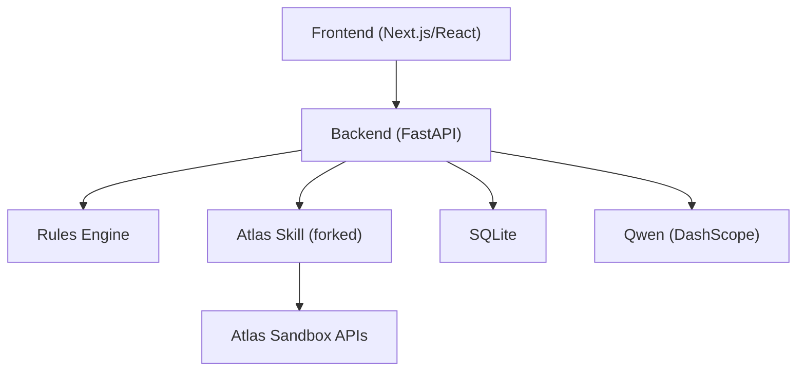
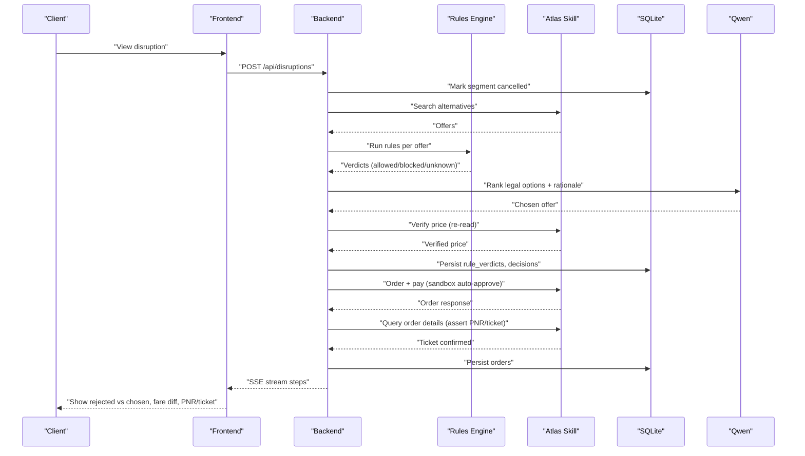
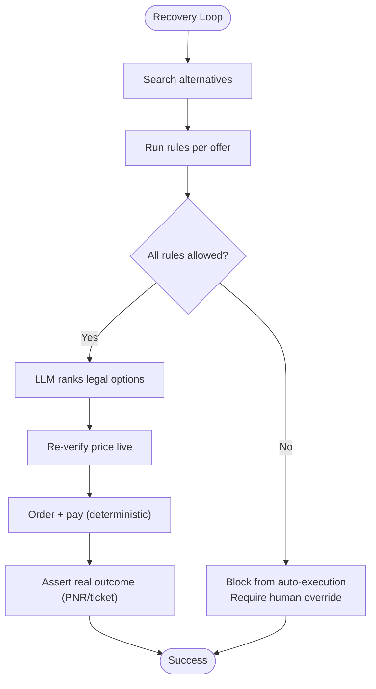
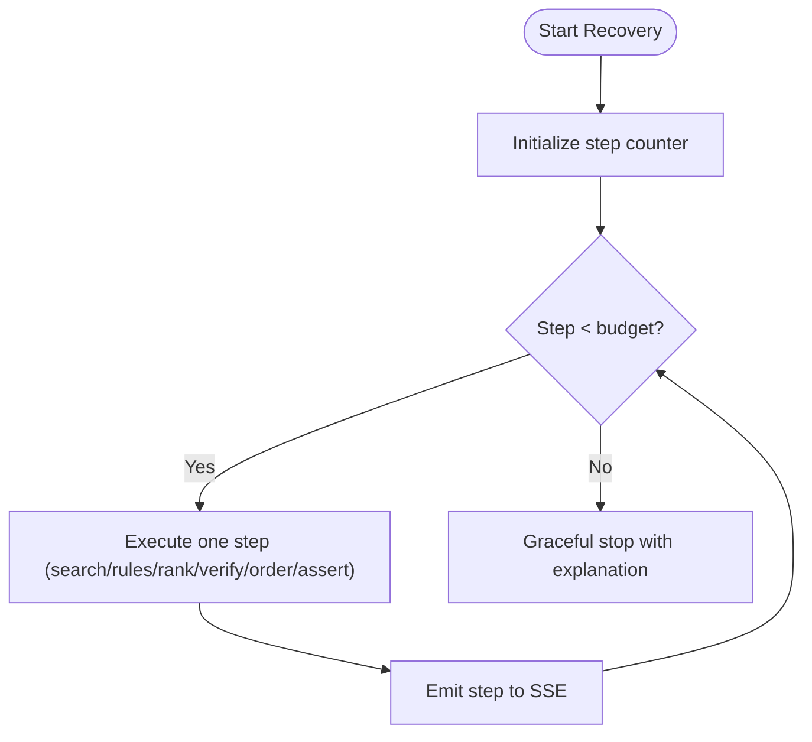
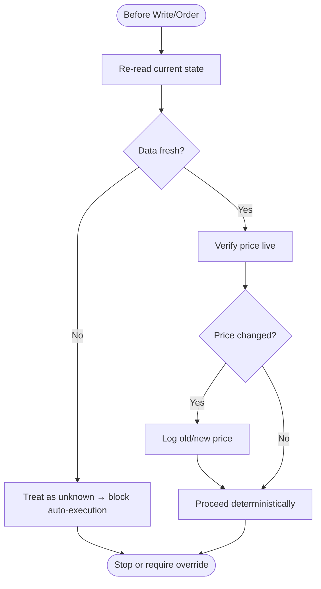
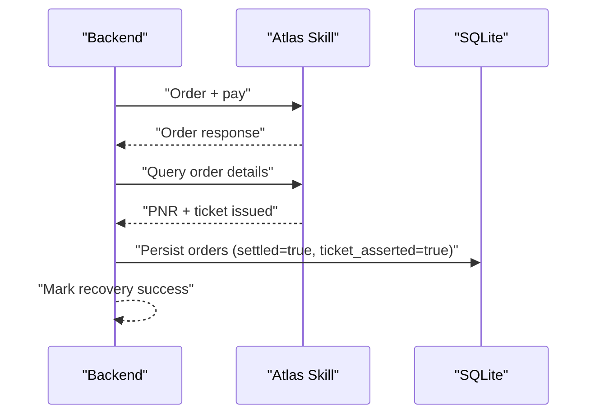

# Security & Safety

<cite>
**Referenced Files in This Document**
- [0003-advise-execute-two-gate-split.md](file://docs/adr/0003-advise-execute-two-gate-split.md)
- [02-architecture.md](file://docs/plans/waypoint/02-architecture.md)
- [01-product.md](file://docs/plans/waypoint/01-product.md)
- [SKILL.md](file://.agents/skills/atlas-flight-booking/SKILL.md)
- [error-handling.md](file://.agents/skills/atlas-flight-booking/references/error-handling.md)
- [passenger-input.md](file://.agents/skills/atlas-flight-booking/references/passenger-input.md)
- [0001-fork-atlas-skill-sandbox-auto-approve.md](file://docs/adr/0001-fork-atlas-skill-sandbox-auto-approve.md)
- [0002-visa-rules-curated-approximation.md](file://docs/adr/0002-visa-rules-curated-approximation.md)
</cite>

## Table of Contents
1. [Introduction](#introduction)
2. [Project Structure](#project-structure)
3. [Core Components](#core-components)
4. [Architecture Overview](#architecture-overview)
5. [Detailed Component Analysis](#detailed-component-analysis)
6. [Dependency Analysis](#dependency-analysis)
7. [Performance Considerations](#performance-considerations)
8. [Troubleshooting Guide](#troubleshooting-guide)
9. [Conclusion](#conclusion)

## Introduction
This document provides comprehensive security and safety guidance for the Waypoint system. It explains the fail-closed architecture, three critical guards (step budget limits, re-read-verify pattern, outcome assertion), and the two-gate design that separates AI reasoning from deterministic execution to minimize risk. It also documents data security measures for sensitive information handling, API key management, and passenger data protection; compliance considerations for financial transactions and travel regulations; monitoring, audit logging, and disaster recovery procedures; and safety testing strategies for autonomous decision-making.

## Project Structure
Waypoint is a small application with a clear separation between frontend and backend:
- Frontend: Next.js/React UI that streams live agent reasoning via Server-Sent Events (SSE).
- Backend: Python FastAPI hosting the recovery agent loop, rules engine, Atlas integration, Qwen calls, and SQLite persistence.
- Atlas integration: A forked skill used as an in-process library or CLI fallback, providing search, verify, order, pay, and ticketing operations in sandbox mode.
- Rules engine: Pluggable rule interface with v1 rules for transit visa eligibility and passport validity. Data-backed by curated tables and public indices.



**Diagram sources**
- [02-architecture.md:6-11](file://docs/plans/waypoint/02-architecture.md#L6-L11)
- [02-architecture.md:21-31](file://docs/plans/waypoint/02-architecture.md#L21-L31)
- [02-architecture.md:51-55](file://docs/plans/waypoint/02-architecture.md#L51-L55)

**Section sources**
- [02-architecture.md:1-56](file://docs/plans/waypoint/02-architecture.md#L1-L56)

## Core Components
- Two-gate split: The advise gate is open (AI reasons over all options, including blocked/unknown), while the execute gate is walled and fail-closed (only allowed options can be auto-executed; blocked/unknown require explicit human override).
- Three critical guards:
  - Step budget limits bound the agent loop to prevent runaway behavior.
  - Re-read-verify pattern ensures the system never acts on stale state and verifies prices before booking.
  - Outcome assertion requires real confirmation (PNR/ticket) before marking success.
- Deterministic execution: Code owns rules checks, fare-difference math, and order/pay execution; AI only ranks legal options and provides rationale.
- Auditability: Every rule check and decision is persisted for compliance and operational review.

**Section sources**
- [0003-advise-execute-two-gate-split.md:9-18](file://docs/adr/0003-advise-execute-two-gate-split.md#L9-L18)
- [02-architecture.md:11-12](file://docs/plans/waypoint/02-architecture.md#L11-L12)
- [02-architecture.md:34-49](file://docs/plans/waypoint/02-architecture.md#L34-L49)
- [02-architecture.md:21-31](file://docs/plans/waypoint/02-architecture.md#L21-L31)

## Architecture Overview
The system enforces strict boundaries between reasoning and execution:
- Advise gate: Open reasoning surface where the AI evaluates all alternatives and narrates trade-offs.
- Execute gate: Fail-closed enforcement layer that only executes when every rule verdict is allowed; otherwise requires human override.
- Data integrity: All rule verifications and decisions are recorded in structured tables to support audits and compliance.



**Diagram sources**
- [02-architecture.md:34-49](file://docs/plans/waypoint/02-architecture.md#L34-L49)
- [02-architecture.md:21-31](file://docs/plans/waypoint/02-architecture.md#L21-L31)
- [02-architecture.md:51-55](file://docs/plans/waypoint/02-architecture.md#L51-L55)

## Detailed Component Analysis

### Two-Gate Architecture (Advise vs Execute)
- Advise gate:
  - Exposes all options with labels allowed/blocked/unknown and reasons/provenance.
  - Enables genuine judgment under uncertainty and transparent narration.
- Execute gate:
  - Fail-closed: Only offers with all rules allowed are eligible for auto-execution.
  - LLM cannot select blocked/unknown for execution; code re-checks executable status post-selection.
  - Human override required for non-allowed options.



**Diagram sources**
- [0003-advise-execute-two-gate-split.md:9-18](file://docs/adr/0003-advise-execute-two-gate-split.md#L9-L18)
- [02-architecture.md:34-49](file://docs/plans/waypoint/02-architecture.md#L34-L49)

**Section sources**
- [0003-advise-execute-two-gate-split.md:9-18](file://docs/adr/0003-advise-execute-two-gate-split.md#L9-L18)

### Step Budget Limits
- The agent loop is bounded by a step budget to prevent runaway loops and ensure predictable resource usage.
- Each step is emitted to the SSE stream for visibility and auditing.



**Diagram sources**
- [02-architecture.md:34-49](file://docs/plans/waypoint/02-architecture.md#L34-L49)

**Section sources**
- [02-architecture.md:34-49](file://docs/plans/waypoint/02-architecture.md#L34-L49)

### Re-Read-Verify Pattern
- Never act on cached world state; always re-read trip state before proceeding.
- Before ordering, re-verify current price; if changed, log old/new values and proceed deterministically (sandbox auto-approve).
- Freshness windows apply to curated data (e.g., transit visa rules) to treat stale entries as unknown and block auto-execution.



**Diagram sources**
- [02-architecture.md:34-49](file://docs/plans/waypoint/02-architecture.md#L34-L49)
- [0002-visa-rules-curated-approximation.md:14-18](file://docs/adr/0002-visa-rules-curated-approximation.md#L14-L18)

**Section sources**
- [02-architecture.md:34-49](file://docs/plans/waypoint/02-architecture.md#L34-L49)
- [0002-visa-rules-curated-approximation.md:14-18](file://docs/adr/0002-visa-rules-curated-approximation.md#L14-L18)

### Outcome Assertion Requirements
- After order and payment, assert real outcomes by querying order details to confirm PNR and ticket issuance.
- Only mark success after successful assertion; this prevents phantom bookings and supports compliance.



**Diagram sources**
- [02-architecture.md:34-49](file://docs/plans/waypoint/02-architecture.md#L34-L49)
- [02-architecture.md:21-31](file://docs/plans/waypoint/02-architecture.md#L21-L31)

**Section sources**
- [02-architecture.md:34-49](file://docs/plans/waypoint/02-architecture.md#L34-L49)
- [02-architecture.md:21-31](file://docs/plans/waypoint/02-architecture.md#L21-L31)

### Data Security Measures
- Sensitive information handling:
  - Passenger input delivered via stdin to the CLI process; payloads are not echoed back, saved, logged, or placed in shell history.
  - If a file path is provided, pass it directly without reading, printing, copying, or modifying the file.
  - Avoid inspecting configuration, credentials, or internal routing; do not call services directly outside defined interfaces.
- API key management:
  - External service keys (e.g., DashScope API key) are stored in environment variables and never committed to the repository.
  - Public URL for webhooks is configured via environment variables; tunneling is supported in development.
- Passenger data protection:
  - Use normalized fields and avoid exposing personal data in logs or user-facing outputs.
  - On errors requiring correction, ask only for missing fields and rebuild the payload once; never repeat rejected personal data.

**Section sources**
- [passenger-input.md:9-15](file://.agents/skills/atlas-flight-booking/references/passenger-input.md#L9-L15)
- [passenger-input.md:49-52](file://.agents/skills/atlas-flight-booking/references/passenger-input.md#L49-L52)
- [SKILL.md:64-67](file://.agents/skills/atlas-flight-booking/SKILL.md#L64-L67)
- [02-architecture.md:51-55](file://docs/plans/waypoint/02-architecture.md#L51-L55)

### Compliance Considerations
- Financial transactions:
  - Autonomous settlement is enabled only in sandbox; production retains human checkpoints for payment and price increases.
  - Payment flows follow strict error handling codes and normalization; never repeat side-effecting commands.
- Travel regulations:
  - Transit visa rules are a curated approximation with freshness windows; unknown or stale data blocks auto-execution.
  - The system does not claim boarding guarantees; it flags legality and risk, leaving final authority to passengers and airlines.
  - Rule verifications and decisions are persisted for auditability and compliance reporting.

**Section sources**
- [0001-fork-atlas-skill-sandbox-auto-approve.md:11-20](file://docs/adr/0001-fork-atlas-skill-sandbox-auto-approve.md#L11-L20)
- [error-handling.md:44-63](file://.agents/skills/atlas-flight-booking/references/error-handling.md#L44-L63)
- [0002-visa-rules-curated-approximation.md:14-18](file://docs/adr/0002-visa-rules-curated-approximation.md#L14-L18)
- [02-architecture.md:21-31](file://docs/plans/waypoint/02-architecture.md#L21-L31)

### Monitoring, Audit Logging, and Disaster Recovery
- Monitoring:
  - Live agent reasoning steps streamed via SSE to the frontend for real-time visibility.
  - Key endpoints expose trip status, recovery results, and streaming events.
- Audit logging:
  - Persist rule verifications and decisions to support compliance and operational review.
  - Orders include settlement and ticket assertion status for traceability.
- Disaster recovery:
  - Graceful failure paths when no legal option exists; surface reasons clearly.
  - Error handling normalizes upstream failures and avoids repeated side effects; uses query-only retries where safe.

**Section sources**
- [02-architecture.md:13-19](file://docs/plans/waypoint/02-architecture.md#L13-L19)
- [02-architecture.md:21-31](file://docs/plans/waypoint/02-architecture.md#L21-L31)
- [error-handling.md:65-73](file://.agents/skills/atlas-flight-booking/references/error-handling.md#L65-L73)

### Safety Testing Strategies and Validation Approaches
- Strategy:
  - Validate that the agent never books a blocked/unknown option autonomously.
  - Confirm that re-read-verify catches price changes and logs differences.
  - Ensure outcome assertion succeeds only when PNR/ticket is confirmed.
- Validation:
  - Use seeded disruption sets across routes and passports to measure boardability and zero gate-denial traps.
  - Compare against naive cheapest-first baseline to quantify safety gains and honest price gaps.
  - Exercise error paths (authorization, payment, unavailable flights) to verify robust handling and idempotency.

**Section sources**
- [01-product.md:20-23](file://docs/plans/waypoint/01-product.md#L20-L23)
- [02-architecture.md:34-49](file://docs/plans/waypoint/02-architecture.md#L34-L49)
- [error-handling.md:7-18](file://.agents/skills/atlas-flight-booking/references/error-handling.md#L7-L18)

## Dependency Analysis
Key dependencies and their roles:
- Atlas Skill (forked): Provides search, verify, order, pay, and ticketing operations; sandbox auto-approve is gated by environment.
- Qwen (DashScope): Used for ranking legal options and generating rationale; API key managed via environment variables.
- SQLite: Stores trips, segments, offers, rule verifications, decisions, and orders for persistence and audit.
- Rules Engine: Pluggable interface with v1 rules; data-backed by curated tables and indices.

```mermaid
graph LR
QWEN["Qwen (DashScope)"] --> BE["Backend"]
ATLAS["Atlas Skill (forked)"] --> BE
RE["Rules Engine"] --> BE
DB["SQLite"] <- --> BE
```

**Diagram sources**
- [02-architecture.md:6-11](file://docs/plans/waypoint/02-architecture.md#L6-L11)
- [02-architecture.md:21-31](file://docs/plans/waypoint/02-architecture.md#L21-L31)
- [02-architecture.md:51-55](file://docs/plans/waypoint/02-architecture.md#L51-L55)

**Section sources**
- [02-architecture.md:6-11](file://docs/plans/waypoint/02-architecture.md#L6-L11)
- [02-architecture.md:21-31](file://docs/plans/waypoint/02-architecture.md#L21-L31)
- [02-architecture.md:51-55](file://docs/plans/waypoint/02-architecture.md#L51-L55)

## Performance Considerations
- Keep AI out of deterministic steps (rules checks, fare math, order/pay) to avoid latency and reduce risk.
- Bound agent loops with step budgets to control resource consumption.
- Minimize external calls by caching non-sensitive, stable data and using freshness windows for dynamic data.
- Stream reasoning via SSE to keep UI responsive while backend performs heavy work.

[No sources needed since this section provides general guidance]

## Troubleshooting Guide
Common issues and resolutions:
- Authorization required/expired: Follow normalized flow to present authorization link; poll once after user confirmation; resume only when authorized.
- Payment balance insufficient: Explain situation, show order link when available, do not retry payment automatically.
- Offer expired/unavailable: Replay retained search once; if still unavailable, collect new inputs and restart flow.
- Service temporarily unavailable: Retry identical read-only command at most once when marked retryable; never repeat side effects.

**Section sources**
- [error-handling.md:7-18](file://.agents/skills/atlas-flight-booking/references/error-handling.md#L7-L18)
- [error-handling.md:44-63](file://.agents/skills/atlas-flight-booking/references/error-handling.md#L44-L63)
- [error-handling.md:65-73](file://.agents/skills/atlas-flight-booking/references/error-handling.md#L65-L73)

## Conclusion
Waypoint’s security and safety model centers on fail-closed execution, strict guardrails, and clear separation between AI reasoning and deterministic actions. The two-gate architecture ensures transparency and control, while the three critical guards (step budget, re-read-verify, outcome assertion) enforce correctness and reliability. Data security practices protect sensitive information and keys, and compliance considerations address financial and travel regulatory constraints. Robust monitoring, audit logging, and disaster recovery procedures support operational resilience. Safety testing validates autonomous decision-making against realistic scenarios to maintain trust and performance.

[No sources needed since this section summarizes without analyzing specific files]