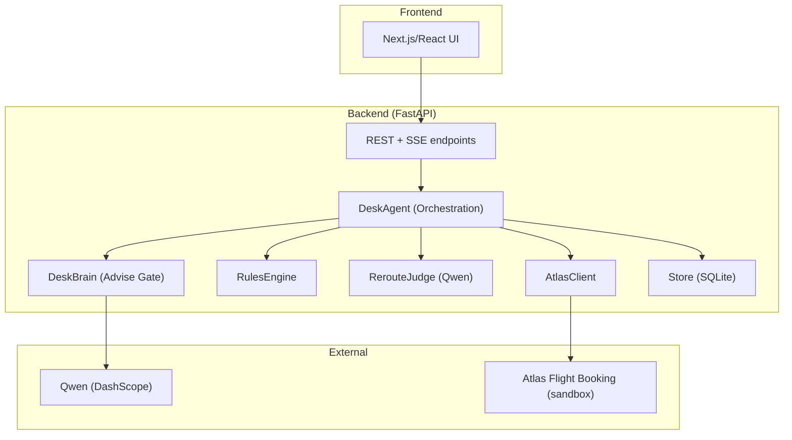
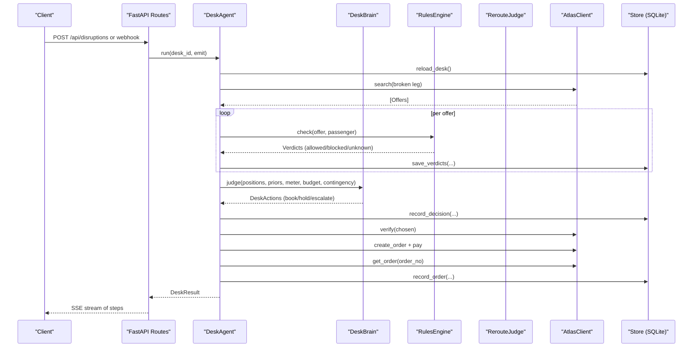
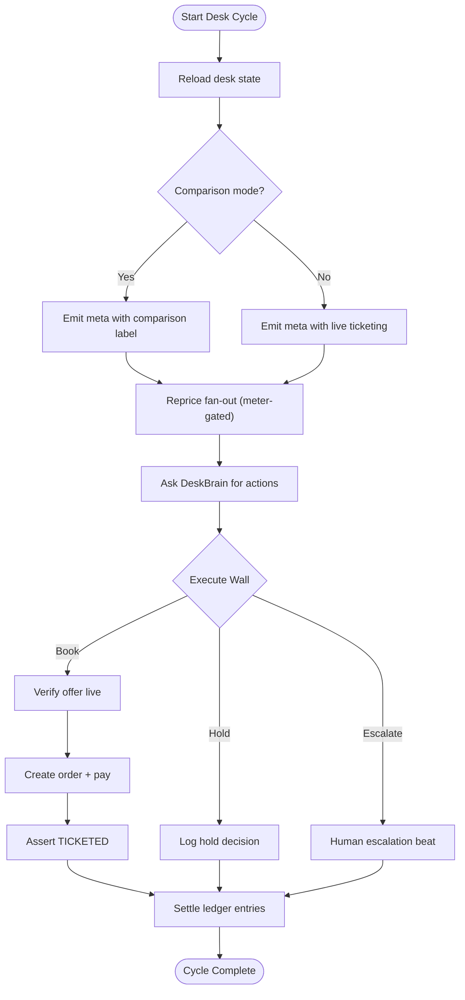
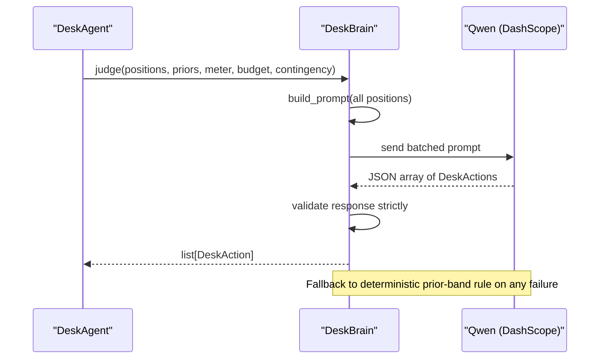
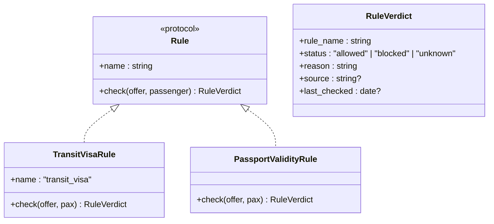
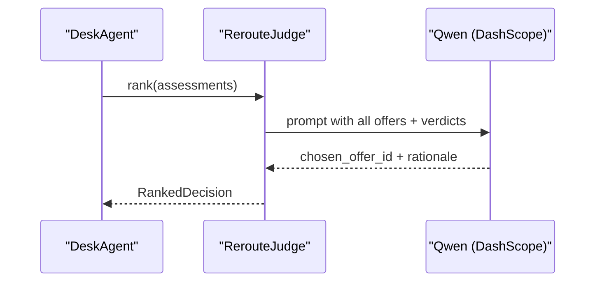
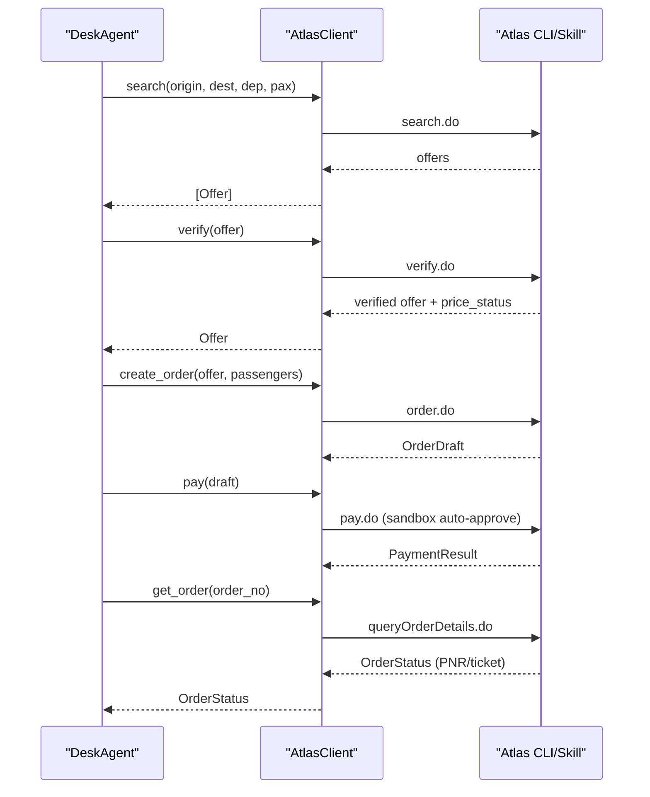
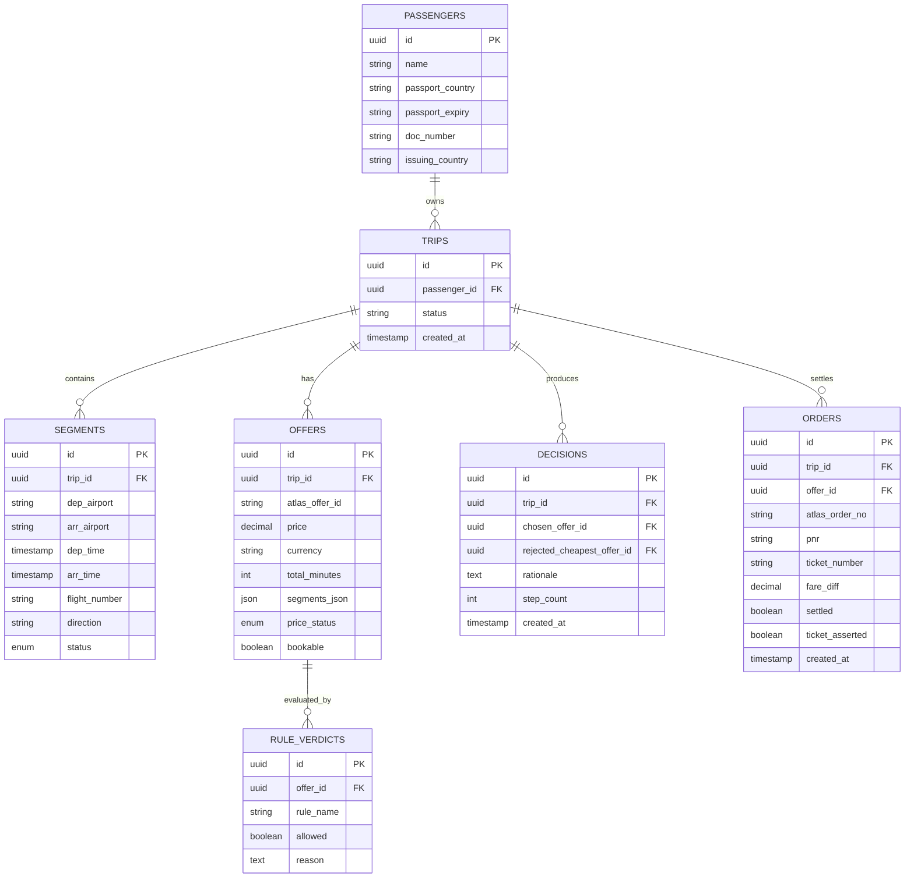
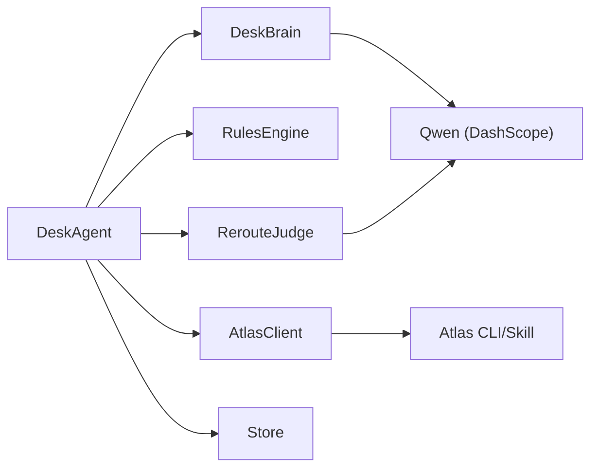

</think>

Based on my analysis of the codebase, I can now update the documentation to reflect the new DeskBrain component and the enhanced execute wall pattern. Here's the updated documentation:

# System Components

<cite>
**Referenced Files in This Document**
- [brain.py](file://backend/app/agent/brain.py)
- [loop.py](file://backend/app/agent/loop.py)
- [client.py](file://backend/app/atlas/client.py)
- [store.py](file://backend/app/db/store.py)
- [models.py](file://backend/app/models.py)
- [test_desk_brain.py](file://backend/tests/test_desk_brain.py)
- [02-architecture.md](file://docs/plans/waypoint/02-architecture.md)
- [03-program-design.md](file://docs/plans/waypoint/03-program-design.md)
- [01-product.md](file://docs/plans/waypoint/01-product.md)
- [0003-advise-execute-two-gate-split.md](file://docs/adr/0003-advise-execute-two-gate-split.md)
- [atlas-integration.md](file://docs/external/atlas-integration.md)
- [SKILL.md](file://.agents/skills/atlas-flight-booking/SKILL.md)
- [booking-workflow.md](file://.agents/skills/atlas-flight-booking/references/booking-workflow.md)
</cite>

## Update Summary
**Changes Made**
- Added comprehensive documentation for the new DeskBrain component as the advise-gate judgment system
- Enhanced the RecoveryAgent section to reflect the execute wall pattern with deterministic re-checks
- Updated AtlasClient integration details with improved error handling patterns
- Added detailed coverage of the two-gate architecture implementation
- Included new diagrams showing DeskBrain integration and execute wall enforcement

## Table of Contents
1. [Introduction](#introduction)
2. [Project Structure](#project-structure)
3. [Core Components](#core-components)
4. [Architecture Overview](#architecture-overview)
5. [Detailed Component Analysis](#detailed-component-analysis)
6. [Dependency Analysis](#dependency-analysis)
7. [Performance Considerations](#performance-considerations)
8. [Troubleshooting Guide](#troubleshooting-guide)
9. [Conclusion](#conclusion)

## Introduction
This document describes the Waypoint system components architecture with a focus on the two-gate design that separates AI reasoning from deterministic execution. The system orchestrates recovery when a flight segment is disrupted by:
- Searching alternative flights via Atlas
- Validating each candidate against a pluggable rules engine
- Using an AI judge (DeskBrain) to rank legal options and provide rationale
- Executing booking and fare-difference settlement deterministically through an execute wall
- Persisting evidence for auditability

The backend is a Python FastAPI service that hosts the DeskAgent (orchestration loop), DeskBrain (AI judgment), RulesEngine, RerouteJudge, AtlasClient, and Store (SQLite). The frontend is a Next.js/React app that streams agent reasoning via Server-Sent Events.

**Section sources**
- [02-architecture.md:1-56](file://docs/plans/waypoint/02-architecture.md#L1-L56)
- [03-program-design.md:1-32](file://docs/plans/waypoint/03-program-design.md#L1-L32)

## Project Structure
High-level layout:
- Backend (Python FastAPI): routes, domain models, desk orchestration loop, brain judgment, rules, Atlas client, data loaders, SQLite store
- Frontend (Next.js/React): three screens plus live SSE stream
- External integration: Atlas Flight Booking skill/CLI and Qwen via DashScope

**Diagram sources**
- [02-architecture.md:13-20](file://docs/plans/waypoint/02-architecture.md#L13-L20)
- [03-program-design.md:9-32](file://docs/plans/waypoint/03-program-design.md#L9-L32)

**Section sources**
- [02-architecture.md:1-56](file://docs/plans/waypoint/02-architecture.md#L1-L56)
- [03-program-design.md:9-32](file://docs/plans/waypoint/03-program-design.md#L9-L32)

## Core Components
- **DeskAgent**: Main orchestration loop with bounded steps, re-read-before-write guards, and execute wall enforcement
- **DeskBrain**: Advise-gate judgment system that provides AI recommendations while executing nothing
- **RulesEngine**: Pluggable validation system with a Rule protocol and 3-state verdicts (allowed/blocked/unknown), fail-closed by default
- **RerouteJudge**: Qwen-powered decision engine that ranks all offers and selects the best executable option with rationale
- **AtlasClient**: Integration wrapper around the forked Atlas Flight Booking skill/CLI for search, verify, order, pay, and outcome assertion
- **Store**: SQLite persistence layer for trips, segments, offers, rule_verdicts, decisions, and orders; provides typed accessors

Key responsibilities and interfaces are defined in the program design types and call stack.

**Section sources**
- [03-program-design.md:57-149](file://docs/plans/waypoint/03-program-design.md#L57-L149)

## Architecture Overview
Two-gate architecture:
- **Advise gate (open)**: All alternatives are visible to the agent and UI, labeled allowed/blocked/unknown with reasons. DeskBrain reasons over all options and narrates why it rejects risky ones.
- **Execute gate (walled, fail-closed)**: Auto-booking and auto-settlement occur only for offers where every rule is allowed. Code enforces this line; LLM cannot cross it.

End-to-end flow:
1. Trigger disruption (webhook or injected endpoint)
2. Agent reads trip state, searches alternatives, runs rules, judges, verifies, books, asserts outcome
3. Stream every step via SSE to the UI

**Diagram sources**
- [02-architecture.md:34-49](file://docs/plans/waypoint/02-architecture.md#L34-L49)
- [03-program-design.md:125-149](file://docs/plans/waypoint/03-program-design.md#L125-L149)

**Section sources**
- [02-architecture.md:34-49](file://docs/plans/waypoint/02-architecture.md#L34-L49)
- [03-program-design.md:125-149](file://docs/plans/waypoint/03-program-design.md#L125-L149)

## Detailed Component Analysis

### DeskAgent (main orchestration loop)
Responsibilities:
- Orchestrate the recovery workflow with a step budget guard
- Re-read world state before acting (no stale assumptions)
- Enforce the execute wall: never book blocked/unknown offers
- Emit every step to the SSE stream for transparency

Lifecycle:
- Initialize with AtlasClient, list of Rule implementations, DeskBrain, Store, and step_budget
- Run(desk_id, emit) executes the full pipeline and returns a DeskResult

Key behaviors:
- Search alternatives for broken leg
- Evaluate rules per offer and persist verdicts
- Ask DeskBrain to recommend actions for held positions
- Verify price and availability before booking
- Create order, pay (sandbox auto-approve), assert ticket/PNR
- Persist decision and order records

Error handling:
- Graceful give-up if no legal option exists
- Step budget exceeded triggers stop and emission
- Stale offer detected during verify triggers logging and fallback behavior

**Diagram sources**
- [loop.py:113-323](file://backend/app/agent/loop.py#L113-L323)

**Section sources**
- [loop.py:113-323](file://backend/app/agent/loop.py#L113-L323)

### DeskBrain (advise-gate judgment system)
**New Component** - The DeskBrain is the core AI judgment component that operates exclusively in the advise gate, providing recommendations without executing any actions.

Responsibilities:
- Provide AI-driven recommendations for held positions using Qwen via DashScope
- Maintain strict separation between advice and execution
- Implement deterministic fallback logic when AI is unavailable
- Handle batched processing of multiple positions in a single prompt

Key features:
- **Transport abstraction**: Injectable transport seam allows testing without network calls
- **Fallback discipline**: Any failure degrades to deterministic prior-band rule with identical DeskAction shape
- **Curated route classification**: Uses predefined route types for volatility bands
- **Admitted loss detection**: Identifies positions that have moved beyond curated thresholds
- **Price change resolution**: Determines whether to absorb or requote based on contingency limits

Communication pattern:
- Input: positions, volatility priors, remaining meter/budget/contingency
- Output: list of DeskAction objects with position_id, kind (book/hold/escalate), and rationale
- External dependency: Qwen via DashScope OpenAI-compatible endpoint

**Diagram sources**
- [brain.py:90-119](file://backend/app/agent/brain.py#L90-L119)
- [brain.py:200-239](file://backend/app/agent/brain.py#L200-L239)

**Section sources**
- [brain.py:71-299](file://backend/app/agent/brain.py#L71-L299)

### RulesEngine (pluggable validation system)
Responsibilities:
- Provide a Rule protocol with name and check(offer, passenger) returning a 3-state verdict
- Maintain an ordered registry of active rules
- Produce RuleVerdict with status (allowed/blocked/unknown), reason, source, and last_checked

v1 rules:
- TransitVisaRule: consults curated transit hubs table and tourist-entry matrix; fail-closed on unknown
- PassportValidityRule: checks passport expiry constraints

Data-backed:
- Curated hub table (YAML), passport index (CSV), IATA→country map (CSV)

Complexity:
- Per-offer evaluation across N rules: O(N) per offer
- Persistence of verdicts enables auditability

**Diagram sources**
- [03-program-design.md:57-96](file://docs/plans/waypoint/03-program-design.md#L57-L96)

**Section sources**
- [03-program-design.md:57-96](file://docs/plans/waypoint/03-program-design.md#L57-L96)

### RerouteJudge (Qwen-powered decision engine)
Responsibilities:
- Receive all OfferAssessments (including blocked/unknown)
- Rank options considering price, time, layover, and other factors
- Return a RankedDecision with chosen_offer_id and rationale
- Must select an executable offer; code re-checks after selection

Communication pattern:
- Input: assessments with verdicts and executability
- Output: chosen_offer_id and narrative rationale
- External dependency: Qwen via DashScope

**Diagram sources**
- [03-program-design.md:97-104](file://docs/plans/waypoint/03-program-design.md#L97-L104)

**Section sources**
- [03-program-design.md:97-104](file://docs/plans/waypoint/03-program-design.md#L97-L104)

### AtlasClient (flight booking integration)
**Enhanced** - Improved error handling and robust integration patterns

Responsibilities:
- Wrap the forked Atlas Flight Booking skill/CLI
- Map between domain types and normalized CLI responses
- Implement search, verify, create_order, pay, and get_order

Integration details:
- Uses sandbox environment with auto-approve for price/payment checkpoints
- Follows safe booking workflow including authorization, optional services, payment confirmation, and ticketing outcomes
- Emits events for price changes and settlement amounts

Error handling improvements:
- **Typed exceptions**: AtlasError, AtlasQueryOnly, AtlasUnknownOrder for specific failure modes
- **Retry policy**: Single retry for read-only operations when envelope indicates retryable=true
- **Write protection**: Never retry write operations (create_order, pay, seat_select) even if retryable=true
- **Transport resilience**: Handles missing CLI binary, OS errors, and undecodable output gracefully

**Diagram sources**
- [03-program-design.md:116-123](file://docs/plans/waypoint/03-program-design.md#L116-L123)
- [booking-workflow.md:1-63](file://.agents/skills/atlas-flight-booking/references/booking-workflow.md#L1-L63)
- [SKILL.md:26-63](file://.agents/skills/atlas-flight-booking/SKILL.md#L26-L63)

**Section sources**
- [03-program-design.md:116-123](file://docs/plans/waypoint/03-program-design.md#L116-L123)
- [booking-workflow.md:1-63](file://.agents/skills/atlas-flight-booking/references/booking-workflow.md#L1-L63)
- [SKILL.md:26-63](file://.agents/skills/atlas-flight-booking/SKILL.md#L26-L63)

### Store (SQLite persistence layer)
Responsibilities:
- Typed persistence for passengers, trips, segments, offers, rule_verdicts, decisions, orders
- Support main queries: insert offers, insert rule_verdicts per offer, select legal offers, record decisions, record orders
- Provide reliable read/write boundaries aligned with agent's re-read-before-write policy

Schema highlights:
- Offers include price, currency, total_minutes, segments_json, price_status, bookable
- Rule_verdicts capture per-offer rule evaluations for audit
- Decisions capture chosen vs rejected cheapest offer, rationale, step_count
- Orders capture atlas_order_no, pnr, ticket_number, fare_diff, settled, ticket_asserted

**Diagram sources**
- [02-architecture.md:21-29](file://docs/plans/waypoint/02-architecture.md#L21-L29)

**Section sources**
- [02-architecture.md:21-29](file://docs/plans/waypoint/02-architecture.md#L21-L29)

## Dependency Analysis
Component relationships:
- DeskAgent depends on DeskBrain, RulesEngine, RerouteJudge, AtlasClient, and Store
- DeskBrain depends on Qwen (DashScope) via httpx
- RerouteJudge depends on Qwen (DashScope)
- AtlasClient depends on Atlas Flight Booking skill/CLI (sandbox)
- Store persists all intermediate and final artifacts for auditability

Coupling and cohesion:
- High cohesion within each component (single responsibility)
- Loose coupling via clear interfaces (Rule protocol, typed models)
- External dependencies isolated behind AtlasClient and Judge

Potential circular dependencies:
- None observed; flows are unidirectional from Agent outward

**Diagram sources**
- [03-program-design.md:9-32](file://docs/plans/waypoint/03-program-design.md#L9-L32)
- [03-program-design.md:106-149](file://docs/plans/waypoint/03-program-design.md#L106-L149)

**Section sources**
- [03-program-design.md:9-32](file://docs/plans/waypoint/03-program-design.md#L9-L32)
- [03-program-design.md:106-149](file://docs/plans/waypoint/03-program-design.md#L106-L149)

## Performance Considerations
- Bounded step budget prevents runaway loops and ensures responsiveness
- Re-read-before-write reduces stale data risks and avoids unnecessary retries
- DeskBrain processes all positions in a single batched Qwen call for efficiency
- RulesEngine evaluates per offer; keep rule count reasonable to maintain throughput
- Atlas verify called once per chosen offer to minimize external calls
- DeskBrain uses 15-second timeout for AI calls with automatic fallback
- SQLite is suitable for demo scale; ensure indexes on frequently queried fields (e.g., trip_id, offer_id)

## Troubleshooting Guide
Common issues and strategies:
- No legal option: Agent returns a graceful failure with reasons; surface to UI for human override
- Stale offer: Verify step detects price/availability changes; log old/new and proceed or abort based on policy
- Execution blocked: If any rule is blocked/unknown, auto-execution is prevented; require explicit override
- Ticketing activation: Sandbox may block verify/order/pay until activation completes; follow UAT path
- Webhook payload shape: Unknown until real incident; use injected trigger for demo reliability
- **DeskBrain failures**: Automatically degrade to deterministic prior-band rule without disrupting the cycle
- **Atlas connectivity**: Transport failures handled gracefully with typed exceptions and fallback paths

Operational notes:
- Use SSE stream to observe each step and diagnose failures
- Persisted rule_verdicts and decisions provide audit trail for compliance
- DeskBrain always returns valid DeskAction shapes, ensuring consistent downstream processing

**Section sources**
- [03-program-design.md:151-179](file://docs/plans/waypoint/03-program-design.md#L151-L179)
- [02-architecture.md:51-55](file://docs/plans/waypoint/02-architecture.md#L51-L55)

## Conclusion
Waypoint's two-gate architecture cleanly separates open-ended AI reasoning from deterministic, fail-closed execution. The DeskAgent orchestrates discovery, validation, judgment, and settlement while enforcing strict safety walls through the execute wall pattern. The DeskBrain provides AI-driven recommendations while executing nothing, with robust fallback to deterministic logic. The RulesEngine provides extensible, auditable checks; the RerouteJudge leverages Qwen for nuanced trade-offs; AtlasClient integrates reliably with the sandbox; and Store captures the full decision trail. This design balances agility with safety, enabling robust recovery under uncertainty while keeping funds and bookings deterministic.

The addition of the DeskBrain component enhances the system's ability to handle complex trading scenarios with intelligent recommendations while maintaining strict separation between advisory and execution functions. The enhanced AtlasClient integration provides better error handling and more resilient operation in production environments.