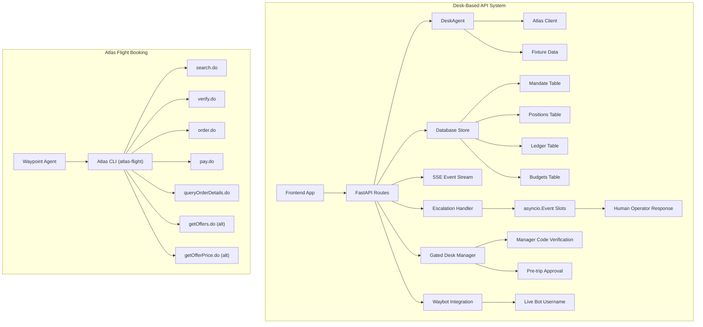
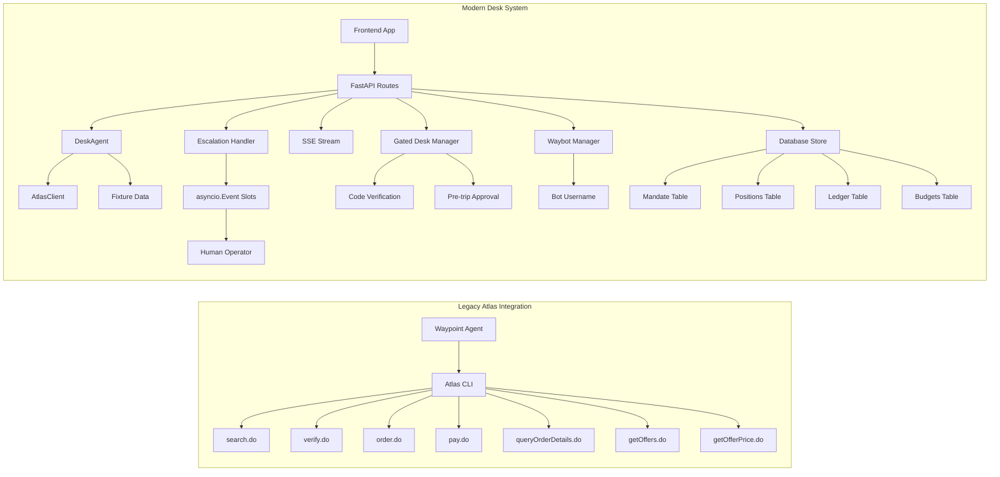
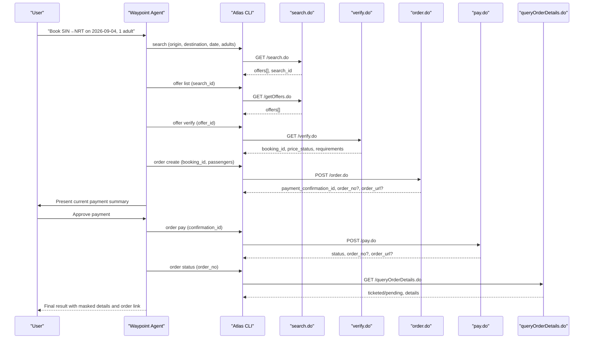
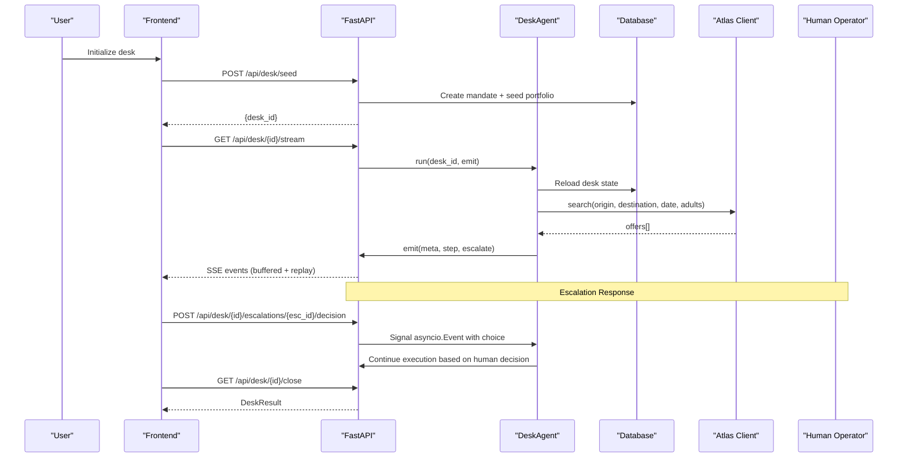

# API Endpoints & Usage

<cite>
**Referenced Files in This Document**
- [routes.py](file://backend/app/api/routes.py)
- [main.py](file://backend/app/main.py)
- [loop.py](file://backend/app/agent/loop.py)
- [client.py](file://backend/app/atlas/client.py)
- [models.py](file://backend/app/models.py)
- [schema.py](file://backend/app/db/schema.py)
- [store.py](file://backend/app/db/store.py)
- [fixture.py](file://backend/app/fixture.py)
- [api.ts](file://frontend/lib/api.ts)
- [types.ts](file://frontend/lib/types.ts)
- [booking-workflow.md](file://.agents/skills/atlas-flight-booking/references/booking-workflow.md)
- [cli-contract.md](file://.agents/skills/atlas-flight-booking/references/cli-contract.md)
- [error-handling.md](file://.agents/skills/atlas-flight-booking/references/error-handling.md)
- [passenger-input.md](file://.agents/skills/atlas-flight-booking/references/passenger-input.md)
- [SKILL.md](file://.agents/skills/atlas-flight-booking/SKILL.md)
</cite>

## Update Summary
**Changes Made**
- Added documentation for three new API endpoints: POST /api/desk/{id}/confirm, POST /api/desk/{id}/approve, and GET /api/waybot
- Updated desk state endpoint to include lifecycle information (awaiting_travelers, pending_approval, released)
- Enhanced gated desk workflow documentation with manager code verification and approval flows
- Added Waybot integration details for share link generation with live bot username retrieval
- Updated error handling sections to cover new endpoint-specific status codes (410 Gone, 429 Too Many Requests)

## Table of Contents
1. [Introduction](#introduction)
2. [Project Structure](#project-structure)
3. [Core Components](#core-components)
4. [Architecture Overview](#architecture-overview)
5. [Detailed Component Analysis](#detailed-component-analysis)
6. [Dependency Analysis](#dependency-analysis)
7. [Performance Considerations](#performance-considerations)
8. [Troubleshooting Guide](#troubleshooting-guide)
9. [Conclusion](#conclusion)
10. [Appendices](#appendices)

## Introduction
This document specifies the complete desk-based API architecture implemented for Waypoint, which replaces the previous trip/disruption recovery system with a sophisticated travel position management system featuring human-in-the-loop decision making. The desk-based approach provides mandate management, portfolio tracking, automated decision-making through Server-Sent Events (SSE) streaming, comprehensive audit trails, **escalation decision endpoints** allowing human operators to respond to escalations triggered by execute wall with asyncio.Event slots providing bounded wait times (DEFAULT_ESCALATION_WAIT = 300 seconds). It covers both the new desk workflow (POST /api/desk/seed → GET /api/desk/{desk_id}/stream → GET /api/desk/{desk_id}/close) and the complete Atlas Flight Booking flow (search.do → verify.do → order.do → pay.do → queryOrderDetails.do), including alternative endpoints like getOffers.do and getOfferPrice.do. The system implements strict budget controls, authority limits, real-time progress tracking, transparent decision processes while maintaining backward compatibility with existing booking processes. **Updated** to include new gated desk functionality with manager code verification, pre-trip approval workflows, and Waybot integration for share link generation.

## Project Structure
Waypoint integrates with Atlas via a CLI wrapper for flight bookings and provides a modern REST API with SSE streaming for desk-based operations featuring human intervention capabilities. The system supports two distinct workflows: traditional Atlas flight booking through CLI and modern desk-based operations through FastAPI with database persistence and escalation handling. **Updated** to reflect new gated desk workflows and Waybot integration.



**Diagram sources**
- [routes.py:1-819](file://backend/app/api/routes.py#L1-L819)
- [main.py:192-201](file://backend/app/main.py#L192-L201)
- [loop.py:1-745](file://backend/app/agent/loop.py#L1-L745)
- [schema.py:33-103](file://backend/app/db/schema.py#L33-L103)
- [client.py:1-526](file://backend/app/atlas/client.py#L1-L526)

**Section sources**
- [routes.py:1-819](file://backend/app/api/routes.py#L1-L819)
- [main.py:192-201](file://backend/app/main.py#L192-L201)
- [loop.py:1-745](file://backend/app/agent/loop.py#L1-L745)

## Core Components
### Desk-Based System Components
- **Mandate Management**: Budget controls with authority caps and contingency settings
- **Portfolio Tracking**: Position states (held/booked) with price monitoring and stale mark detection
- **Database Persistence**: Audit trails through ledger entries and compliance requirements
- **SSE Streaming**: Real-time progress updates with event buffering and replay capabilities
- **DeskAgent Orchestration**: Bounded step budget execution with escalation handling and human intervention
- **Escalation Decision System**: Human operator response capability with asyncio.Event slots and bounded wait times
- **Write Path Integration**: Complete Atlas booking flow with verification and payment processing
- **Comparison Mode**: Read-only mode when ticketing is not available for demo purposes
- **Gated Desk Management**: Manager code verification and pre-trip approval workflows
- **Waybot Integration**: Live bot username retrieval for share link generation

### Atlas Flight Booking Components
- **Authorization Management**: Environment switching and authentication status polling
- **Search and Verification**: Offer discovery with price_status validation and availability checks
- **Optional Services**: Baggage and seat selection with fallback handling
- **Order Creation**: Single-use confirmation IDs with passenger input validation
- **Payment Processing**: Non-retryable payment with status polling until ticketed
- **Error Handling**: Comprehensive envelope-based error codes and retry policies

**Section sources**
- [loop.py:74-105](file://backend/app/agent/loop.py#L74-L105)
- [client.py:186-526](file://backend/app/atlas/client.py#L186-L526)
- [models.py:83-147](file://backend/app/models.py#L83-L147)

## Architecture Overview
The Waypoint system implements a sophisticated desk-based architecture that manages travel positions through mandate controls, automated decision-making, comprehensive audit trails, and **human-in-the-loop escalation handling**. The system operates in two modes: live ticketing mode when Atlas is fully configured, and comparison mode for demonstration purposes. The escalation system allows human operators to intervene when decisions exceed authority limits or budget constraints. **Updated** to include gated desk workflows where desks can be held in awaiting_travelers state until manager code verification, and pre-trip approval workflows for itinerary sign-off.

```mermaid
sequenceDiagram
participant U as "User"
participant FE as "Frontend"
participant API as "FastAPI"
participant DA as "DeskAgent"
participant DB as "Database"
participant AT as "Atlas Client"
participant HO as "Human Operator"
Note over U,HO : Desk-Based Workflow with Escalations
U->>FE : Initialize desk
FE->>API : POST /api/desk/seed
API->>DB : Create mandate + seed portfolio
API-->>FE : {desk_id}
FE->>API : GET /api/desk/{id}/stream
API->>DA : run(desk_id, emit)
DA->>DB : Reload desk state
DA->>AT : search(origin, destination, date, adults)
AT-->>DA : offers[]
DA->>API : emit(meta, step, options, escalate)
API-->>FE : SSE events (buffered + replay)
Note over HO,API : Escalation Response
FE->>API : POST /api/desk/{id}/escalations/{esc_id}/decision
API->>DA : Signal asyncio.Event with choice
DA->>API : Continue execution based on human decision
FE->>API : GET /api/desk/{id}/close
API-->>FE : DeskResult (P&L, losses, step_count)
Note over U,AT : Atlas Booking Flow
U->>FE : Book flight
FE->>CLI : search (origin, destination, date, adults)
CLI->>AT : GET /search.do
AT-->>CLI : {offers[], search_id}
CLI-->>FE : offer list
FE->>CLI : offer verify (offer_id)
CLI->>AT : GET /verify.do
AT-->>CLI : {booking_id, price_status, requirements}
CLI-->>FE : booking details
FE->>CLI : order create (booking_id, passengers)
CLI->>AT : POST /order.do
AT-->>CLI : {payment_confirmation_id, order_no?}
CLI-->>FE : payment required
FE->>CLI : order pay (confirmation_id)
CLI->>AT : POST /pay.do
AT-->>CLI : {status, order_no?, order_url?}
CLI-->>FE : payment confirmed
FE->>CLI : order status (order_no)
CLI->>AT : GET /queryOrderDetails.do
AT-->>CLI : {ticketed|pending, details}
CLI-->>FE : final result
```



**Diagram sources**
- [routes.py:123-819](file://backend/app/api/routes.py#L123-L819)
- [loop.py:106-471](file://backend/app/agent/loop.py#L106-L471)
- [client.py:238-484](file://backend/app/atlas/client.py#L238-L484)

## Detailed Component Analysis

### New Gated Desk Endpoints

#### Endpoint: POST /api/desk/{desk_id}/confirm
- **Purpose**: Release a gated desk by verifying the manager's confirmation code
- **HTTP method**: POST
- **Path parameters**:
  - desk_id: desk identifier from seed endpoint
- **Request body**:
  - code: plaintext confirmation code (verified against stored hash)
- **Response highlights**:
  - desk_id: unique identifier for the desk session
  - lifecycle: "released" indicating successful release
- **Behavior**:
  - Validates request volume with sliding-window rate limiting (default: 10 requests per 60 seconds)
  - Checks desk lifecycle is "awaiting_travelers" (one-shot semantics)
  - Verifies confirmation code TTL (default: 24 hours from seed time)
  - Performs constant-time hash verification using PBKDF2 with 260k iterations
  - Enforces attempt cap (default: 5 wrong attempts before 429)
  - Atomic release via compare-and-set to prevent double-start races
  - Starts desk cycle via shared resume primitive after successful release
- **Status codes**:
  - 200: Successful desk release and cycle start
  - 403: Wrong confirmation code
  - 404: Unknown desk_id
  - 410: Desk already released or code expired
  - 429: Rate limited or too many wrong attempts

Example request
- POST /api/desk/desk-abc123def/confirm
- Body: {"code": "A1B2C3D4"}

Example response (summary)
- {
  "desk_id": "desk-abc123def",
  "lifecycle": "released"
}

**Section sources**
- [routes.py:521-607](file://backend/app/api/routes.py#L521-L607)
- [store.py:414-430](file://backend/app/db/store.py#L414-L430)

#### Endpoint: POST /api/desk/{desk_id}/approve
- **Purpose**: Manager approval or hold of pinned itineraries during pre-trip approval workflow
- **HTTP method**: POST
- **Path parameters**:
  - desk_id: desk identifier from seed endpoint
- **Request body**:
  - choice: "approve" or "hold"
  - code: manager credential (either desk's release code or per-round approval token)
- **Response highlights**:
  - desk_id: unique identifier for the desk session
  - choice: the approved action ("approve" or "hold")
  - lifecycle: "released" indicating successful approval processing
  - resumed: boolean indicating if desk cycle was resumed (true for approve, false for hold)
- **Behavior**:
  - Validates desk lifecycle is "pending_approval" (one-shot semantics)
  - Verifies manager credential against either desk's release code hash or per-round approval token hash
  - For approval token path: performs cross-round TOCTOU check to ensure token still valid
  - Applies decision via apply_decision function with atomic compare-and-set
  - For approve: writes ledger note, sets lifecycle to "released", resumes desk cycle with pinned offer
  - For hold: writes ledger note, clears pin and approval state, does NOT resume cycle
  - No attempt cap or rate limiter (narrow window security model)
- **Status codes**:
  - 200: Successful approval or hold
  - 403: Not authorized (wrong credential)
  - 404: Unknown desk_id
  - 410: No approval pending or approval already decided

Example request
- POST /api/desk/desk-abc123def/approve
- Body: {"choice": "approve", "code": "manager-secret-code"}

Example response (summary)
- {
  "desk_id": "desk-abc123def",
  "choice": "approve",
  "lifecycle": "released",
  "resumed": true
}

**Section sources**
- [routes.py:609-696](file://backend/app/api/routes.py#L609-L696)
- [store.py:782-839](file://backend/app/db/store.py#L782-L839)

#### Endpoint: GET /api/waybot
- **Purpose**: Retrieve the live Waybot's Telegram username for share link generation
- **HTTP method**: GET
- **Response highlights**:
  - username: string containing the bot's Telegram username, or null if bot-less
- **Behavior**:
  - Returns the bot username captured during supervised startup via getMe
  - Returns null when no WAYPOINT_BOT_TOKEN is configured
  - Returns null when bot build fails during startup
  - Frontend uses this to construct proper t.me share links rather than hardcoding bot identity
- **Status codes**:
  - 200: Always returns successfully with username field (string or null)

Example request
- GET /api/waybot

Example response (summary)
- {
  "username": "waypointdemobot"
}

Or when bot-less:
- {
  "username": null
}

**Section sources**
- [main.py:192-201](file://backend/app/main.py#L192-L201)

### Updated Desk State Endpoint

#### Endpoint: GET /api/desk/{desk_id}
- **Purpose**: Retrieve current desk state including positions, ledger, budgets, and lifecycle information
- **HTTP method**: GET
- **Path parameters**:
  - desk_id: desk identifier from seed endpoint
- **Response highlights**:
  - mandate: current desk mandate configuration
  - positions: all travel positions with status and pricing
  - budgets: period budget lines with allocated and spent amounts
  - ledger: audit trail of all desk actions (last 50 entries)
  - meter: remaining search budget for the cycle (used/max)
  - **lifecycle**: current desk lifecycle state (awaiting_travelers, pending_approval, released)
  - **verified_count**: number of verified travelers for gated desks
  - **approval**: approval snapshot when desk is in pending_approval state
- **Behavior**:
  - Reads current state from database via DeskStore.reload_desk
  - Includes lifecycle information from ApprovalState for frontend gating UI
  - Provides comprehensive desk overview for frontend display
  - Falls back to persisted-only snapshot for gated desks without live DeskState

Example request
- GET /api/desk/desk-abc123def

Example response (summary)
- {
  "desk_id": "desk-abc123def",
  "mandate": {...},
  "positions": [...],
  "budgets": [...],
  "ledger": [...],
  "meter": {"used": 0, "max": 20},
  "done": false,
  "lifecycle": "awaiting_travelers",
  "verified_count": 2,
  "approval": null
}

**Section sources**
- [routes.py:727-748](file://backend/app/api/routes.py#L727-L748)
- [store.py:886-914](file://backend/app/db/store.py#L886-L914)

### Existing Desk-Based API Endpoints

#### Endpoint: POST /api/desk/seed
- **Purpose**: Create a new desk with mandate and seeded portfolio of positions
- **HTTP method**: POST
- **Request body**: None (creates demo desk with predefined parameters)
- **Response highlights**:
  - desk_id: unique identifier for the desk session (= mandate.id)
  - Mandate configuration with budget_total, authority_cap, and contingency settings
  - Initial portfolio of 6 travel positions representing different scenarios
  - **For gated desks**: invite_token and confirmation_code for team member sharing
- **Behavior**:
  - Creates a new mandate in the database with budget controls
  - Seeds 6 initial positions with curated cost bases and volatility priors
  - Initializes budgets and ledger entries for audit trail
  - **Gated path**: holds desk in 'awaiting_travelers' lifecycle with invite token + hashed release code
  - **Ungated path**: starts background agent task immediately for desk cycle execution
  - Returns immediately with desk_id for client to track progress

Example request
- POST /api/desk/seed

Example response (gated desk)
- {
  "desk_id": "desk-abc123def",
  "invite_token": "abc123xyz",
  "confirmation_code": "A1B2C3D4"
}

**Section sources**
- [routes.py:371-431](file://backend/app/api/routes.py#L371-L431)
- [fixture.py:60-146](file://backend/app/fixture.py#L60-L146)
- [store.py:154-200](file://backend/app/db/store.py#L154-L200)

#### Endpoint: GET /api/desk/{desk_id}/stream
- **Purpose**: Server-Sent Events stream providing real-time desk cycle progress
- **HTTP method**: GET
- **Path parameters**:
  - desk_id: desk identifier from seed endpoint
- **Response**: Streaming text/event-stream with structured events
- **Event types**:
  - meta: Initial metadata including desk_id, mandate, search meter, and mode
  - step: Progress steps with index and narration text
  - trade: Decision recommendations with rationale
  - mark: Price updates with old/new values and meter usage
  - **escalate**: Human intervention requests with options A/B and escalation ID
  - reconcile: Price change resolution decisions
  - alloc: Seat service allocation attempts
  - loss: Admitted losses with amounts and notes
  - result: Final desk cycle outcome
  - error: Error messages during processing
- **Features**:
  - Event buffering with replay capabilities for late connections
  - Proper async task lifecycle management
  - Condition-based synchronization for thread safety
  - Backpressure handling through async iteration

Example request
- GET /api/desk/desk-abc123def/stream

Example SSE events
- data: {"type": "meta", "desk_id": "desk-abc123def", "step_budget": 12, "search_meter": {"used": 0, "max": 20}, "mode": "comparison mode — ticketing not activated"}
- data: {"type": "step", "n": 1, "text": "Re-read the world — 6 positions, 3 budget lines and the ledger loaded fresh from the DB"}
- data: {"type": "mark", "position_id": "desk-abc123def-pos-1", "old": "445.00", "new": "462.00", "meter_used": 1}
- data: {"type": "escalate", "esc_id": "esc-desk-abc123def-pos-2", "reason": "amount above single-trade authority cap; amount above remaining budget", "options": [{"key": "A", "label": "book now at 1800.00 (manual approval)", "price": "1800.00"}, {"key": "B", "label": "hold — re-check next cycle, no execution", "price": "462.00"}]}
- data: {"type": "result", "result": {"desk_id": "desk-abc123def", "status": "closed", "pnl": "1234.56", "losses_admitted": 2, "step_count": 15}}

**Section sources**
- [routes.py:698-725](file://backend/app/api/routes.py#L698-L725)
- [loop.py:106-301](file://backend/app/agent/loop.py#L106-L301)

#### Endpoint: GET /api/desk/{desk_id}/close
- **Purpose**: Retrieve the final desk cycle result after completion
- **HTTP method**: GET
- **Path parameters**:
  - desk_id: desk identifier from seed endpoint
- **Response**: DeskResult object with complete outcome including P&L and losses admitted
- **Timeout behavior**:
  - Waits up to 60 seconds for desk cycle completion
  - Returns 504 status if timeout exceeded
  - Returns 500 status if desk cycle failed without result
- **Status codes**:
  - 200: Successful desk cycle result
  - 404: Unknown desk_id
  - 504: Desk cycle timeout
  - 500: Desk cycle failure

Example request
- GET /api/desk/desk-abc123def/close

Example response (summary)
- {
  "desk_id": "desk-abc123def",
  "status": "closed",
  "pnl": 1234.56,
  "losses_admitted": 2,
  "step_count": 15,
  "comparison_mode": true
}

**Section sources**
- [routes.py:750-798](file://backend/app/api/routes.py#L750-L798)

#### Endpoint: POST /api/desk/{desk_id}/escalations/{esc_id}/decision
- **Purpose**: Human intervention for escalated decisions requiring manual approval
- **HTTP method**: POST
- **Path parameters**:
  - desk_id: desk identifier from seed endpoint
  - esc_id: escalation identifier from escalate event
- **Request body**:
  - choice: "A" or "B" (approve option A or choose hold option B)
- **Response**: Confirmation of decision with desk_id, esc_id, and choice
- **Behavior**:
  - Registers escalation slot for the specific desk and escalation
  - Signals asyncio.Event to unblock the waiting desk agent
  - Enforces fail-closed security (unknown escalations return 410 Gone)
  - Implements slot hygiene to prevent late responses from being processed
- **Timeout handling**:
  - Escalation slots are automatically cleaned up after timeout (DEFAULT_ESCALATION_WAIT = 300 seconds)
  - Late responses to expired escalations receive 410 Gone status
  - Desk agent gives up gracefully when escalation timeout occurs

Example request
- POST /api/desk/desk-abc123def/escalations/esc-desk-abc123def-pos-2/decision
- Body: {"choice": "A"}

Example response (summary)
- {
  "desk_id": "desk-abc123def",
  "esc_id": "esc-desk-abc123def-pos-2",
  "choice": "A"
}

**Error Responses**:
- 410 Gone: Escalation slot no longer exists (expired or already consumed)
- 404 Not Found: Unknown desk_id

**Section sources**
- [routes.py:800-819](file://backend/app/api/routes.py#L800-L819)
- [loop.py:413-471](file://backend/app/agent/loop.py#L413-L471)

### Existing Atlas Flight Booking Endpoints

#### Endpoint: search.do
- **Purpose**: Find flights for given origin, destination, departure date, and passenger counts
- **HTTP method**: GET
- **Request parameters**:
  - origin: IATA code
  - destination: IATA code
  - depart: YYYY-MM-DD
  - adults: integer
  - Optional: return-date, children, infants, airline (repeatable), currency, multiple-fare-families
- **Response highlights**:
  - search_id: unique session identifier
  - offers[]: each offer includes price_status, bookable flag, total_price, currency, and segments
  - Segment structure with depAirport, arrAirport, depTime, arrTime, flightNumber, stopCities
- **Notes**:
  - No direct-only filter in request; connections come mixed and must be filtered client-side
  - price_status values: reference (comparison only), current/verified (bookable)

Example request
- GET /search.do?origin=PEK&destination=NRT&depart=2026-09-04&adults=1

Example response (summary)
- {
  "search_id": "...",
  "offers": [
    {
      "offer_id": "...",
      "price_status": "current",
      "bookable": true,
      "total_price": 236.00,
      "currency": "USD",
      "segments": [
        {"depAirport":"PEK","arrAirport":"NRT","depTime":"...","arrTime":"...","flightNumber":"...","stopCities":null}
      ]
    }
  ]
}

**Section sources**
- [client.py:238-292](file://backend/app/atlas/client.py#L238-L292)
- [cli-contract.md:30-43](file://.agents/skills/atlas-flight-booking/references/cli-contract.md#L30-L43)

#### Endpoint: verify.do
- **Purpose**: Re-verify an offer's price and availability immediately before booking
- **HTTP method**: GET
- **Request parameters**:
  - offer_id: opaque identifier from search or offer list
- **Response highlights**:
  - booking_id: used for subsequent order creation
  - price_change: unchanged/decreased/increased
  - previous_price/current_price/currency: totals for comparison
  - seat_supported/baggage_supported: booleans indicating availability
  - travelers: CLI-provided traveler IDs and passenger types
- **Behavior**:
  - If price increased, require explicit user confirmation before proceeding
  - If offer expired or flight unavailable, restart search

Example request
- GET /verify.do?offer_id=...

Example response (summary)
- {
  "booking_id": "...",
  "price_change": "unchanged",
  "previous_price": 236.00,
  "current_price": 236.00,
  "currency": "USD",
  "seat_supported": true,
  "baggage_supported": false,
  "travelers": [{"traveler_id":"...","passenger_type":"adult"}]
}

**Section sources**
- [client.py:331-363](file://backend/app/atlas/client.py#L331-L363)
- [booking-workflow.md:3-15](file://.agents/skills/atlas-flight-booking/references/booking-workflow.md#L3-L15)

#### Endpoint: order.do
- **Purpose**: Create a booking order with selected offer and passenger details
- **HTTP method**: POST
- **Request body**:
  - booking_id: from verify
  - passengers: array of passenger objects (via stdin)
  - contact: name (required), email/mobile (optional)
  - seat-policy: one of continue-without-seat, cancel-order, accept-similar-seat
- **Response highlights**:
  - payment_confirmation_id: single-use token for payment
  - order_no: returned when available
  - order_url: returned when available
- **Behavior**:
  - Create once; do not retry automatically
  - On PAYMENT_CONFIRMATION_REQUIRED, present current summary and wait for explicit approval

Example request
- POST /order.do
- Body:
  - {
    "booking_id": "...",
    "passengers": [{"traveler_id":"...","name":"FAMILY/GIVEN","passenger_type":"adult","gender":"M","birthday":"YYYY-MM-DD","nationality":"CN","document":{"type":"PP","number":"...","issuing_country":"CN","expires":"YYYY-MM-DD"}}],
    "contact": {"name":"FAMILY/GIVEN"},
    "seat-policy": "accept-similar-seat"
  }

Example response (summary)
- {
  "payment_confirmation_id": "...",
  "order_no": "...",
  "order_url": "https://...",
  "status": "PAYMENT_CONFIRMATION_REQUIRED"
}

**Section sources**
- [client.py:376-411](file://backend/app/atlas/client.py#L376-L411)
- [passenger-input.md:1-52](file://.agents/skills/atlas-flight-booking/references/passenger-input.md#L1-L52)

#### Endpoint: pay.do
- **Purpose**: Confirm payment using the single-use confirmation ID from order creation
- **HTTP method**: POST
- **Request parameters/body**:
  - confirmation_id: exact value from order response
- **Response highlights**:
  - status: TICKETED, TICKETING_PENDING, PAYMENT_BALANCE_CHECK_REQUIRED, or other terminal states
  - order_no/order_url when present
- **Behavior**:
  - Pay once; never reuse confirmation IDs
  - Do not retry payment automatically on unknown or processing states; poll order status instead

Example request
- POST /pay.do
- Body:
  - { "confirmation_id": "..." }

Example response (summary)
- {
  "status": "TICKETING_PENDING",
  "order_no": "...",
  "order_url": "https://..."
}

**Section sources**
- [client.py:413-443](file://backend/app/atlas/client.py#L413-L443)
- [booking-workflow.md:42-58](file://.agents/skills/atlas-flight-booking/references/booking-workflow.md#L42-L58)

#### Endpoint: queryOrderDetails.do
- **Purpose**: Retrieve final ticketing outcome and details for an order
- **HTTP method**: GET
- **Request parameters**:
  - order_no: from order/pay responses
- **Response highlights**:
  - ticketed or pending state
  - masked ticket details when available
  - order_url when available
- **Behavior**:
  - Use this to assert issued tickets/PNR before declaring success

Example request
- GET /queryOrderDetails.do?order_no=...

Example response (summary)
- {
  "status": "TICKETED",
  "order_url": "https://...",
  "tickets": ["masked details"]
}

**Section sources**
- [client.py:445-484](file://backend/app/atlas/client.py#L445-L484)

#### Alternative Endpoints: getOffers.do and getOfferPrice.do
- **getOffers.do**:
  - Purpose: List offers for a retained search_id
  - Method: GET
  - Parameters: search_id
  - Response: offers[] with offer_id, price_status, bookable, segments, pricing
- **getOfferPrice.do**:
  - Purpose: Retrieve current price for a specific offer without full verification
  - Method: GET
  - Parameters: offer_id
  - Response: price_status, current_price, currency, and related metadata

These alternatives support browsing and price checks while preserving the main flow constraints around price_status and bookability.

**Section sources**
- [cli-contract.md:30-43](file://.agents/skills/atlas-flight-booking/references/cli-contract.md#L30-L43)

### Price Status Semantics
- **reference**: Comparison-only results; cannot proceed to verify/order/ticketing
- **current/verified**: Bookable; can proceed to order creation
- **Impact**:
  - Offers with reference must not be reused after ticketing becomes available; re-search or re-verify to obtain current/verified
  - When price increases during verification, require explicit user confirmation before continuing

**Section sources**
- [client.py:168-183](file://backend/app/atlas/client.py#L168-L183)
- [booking-workflow.md:3-15](file://.agents/skills/atlas-flight-booking/references/booking-workflow.md#L3-L15)

### Segment Data Structure
- **fromSegments[] and retSegments[]** describe outbound and return legs
- Each segment includes:
  - depAirport: 3-letter IATA
  - arrAirport: 3-letter IATA
  - depTime: datetime string (format to be confirmed on first live order)
  - arrTime: datetime string (format to be confirmed on first live order)
  - flightNumber: string
  - stopCities: null or blank means nonstop; otherwise lists connecting cities
- Note: Direct-only filtering is not supported at request time; clients must filter connections client-side

**Section sources**
- [client.py:141-183](file://backend/app/atlas/client.py#L141-L183)

### Error Responses and Status Codes
- **Envelope fields**: schema_version, status, code, message, retryable, request_id, data, details
- **Common codes and behaviors**:
  - AUTHORIZATION_REQUIRED/AUTH_EXPIRED/AUTH_SESSION_MISSING: start or restart authorization flow
  - SEARCH_NO_RESULTS: treat as empty search; suggest alternatives
  - OFFER_EXPIRED/BOOKING_EXPIRED: replay search once; collect new inputs if still unavailable
  - PRICE_VERIFICATION_UNAVAILABLE: retry once when retryable=true
  - BAGGAGE_UNAVAILABLE/SEAT_UNAVAILABLE: skip service and continue
  - PASSENGER_INFO_REQUIRED/INVALID, CONTACT_INFO_INVALID: correct only identified fields and resubmit once
  - PAYMENT_CONFIRMATION_REQUIRED: present current summary and wait for explicit approval
  - ORDER_CREATION_UNKNOWN/DUPLICATE_BOOKING_SUSPECTED: do not recreate; show order link if present
  - PAYMENT_STATUS_UNKNOWN/PAYMENT_PROCESSING: do not repay; query order status
  - TICKETED/TICKETING_PENDING: report outcomes; do not call pending failure
  - SERVICE_TEMPORARILY_UNAVAILABLE: retry read-only commands once when retryable=true
- **Desk-specific errors**:
  - 404: Unknown desk_id
  - 410: Escalation gone (slot expired or already consumed)
  - 429: Rate limited (confirm endpoint) or too many wrong attempts
  - 504: Desk cycle timeout (60 seconds)
  - 500: Desk cycle failure without result

**Section sources**
- [client.py:73-105](file://backend/app/atlas/client.py#L73-L105)
- [routes.py:112-116](file://backend/app/api/routes.py#L112-L116)
- [routes.py:543-607](file://backend/app/api/routes.py#L543-L607)
- [routes.py:640-696](file://backend/app/api/routes.py#L640-L696)
- [routes.py:750-819](file://backend/app/api/routes.py#L750-L819)

## Dependency Analysis
The Waypoint system has two distinct dependency chains: the legacy Atlas CLI integration for flight bookings and the modern FastAPI-based desk system with database persistence and escalation handling. **Updated** to include new gated desk dependencies and Waybot integration.



**Diagram sources**
- [routes.py:1-819](file://backend/app/api/routes.py#L1-L819)
- [main.py:192-201](file://backend/app/main.py#L192-L201)
- [loop.py:1-745](file://backend/app/agent/loop.py#L1-L745)
- [schema.py:33-103](file://backend/app/db/schema.py#L33-L103)
- [client.py:1-526](file://backend/app/atlas/client.py#L1-L526)

**Section sources**
- [routes.py:1-819](file://backend/app/api/routes.py#L1-L819)
- [main.py:192-201](file://backend/app/main.py#L192-L201)
- [loop.py:1-745](file://backend/app/agent/loop.py#L1-L745)

## Performance Considerations
### Atlas Booking Performance
- Minimize redundant calls: preserve search_id, offer_id, booking_id, traveler_id, segment_id, order_no, and payment_confirmation_id exactly as returned
- Avoid retries on side-effect endpoints: never retry order creation or payment automatically; use idempotent reads (order status) when uncertain
- Batch comparisons: for flexible dates, run separate searches per requested date and merge normalized results after all attempts
- Client-side filtering: since direct-only filtering is not supported, compute layovers and durations locally

### Desk System Performance
- Database optimization: mandate and position lookups optimized with proper indexing; ledger queries ordered by timestamp for efficient audit trail retrieval
- SSE optimization: event buffering with replay capabilities ensures reliable delivery; condition-based synchronization prevents race conditions between producers and consumers
- Task management: background tasks retain strong references to prevent garbage collection mid-flight; bounded step budget prevents infinite loops in desk agent
- Memory management: in-memory trip store replaced with persistent database storage; proper cleanup strategies for completed desks
- **Escalation performance**: asyncio.Event slots provide efficient blocking with bounded wait times (DEFAULT_ESCALATION_WAIT = 300 seconds); automatic slot cleanup prevents memory leaks
- **Gated desk performance**: Sliding-window rate limiting for confirm endpoint prevents brute force attacks; bounded KDF executor prevents CPU starvation during code verification
- **Waybot performance**: Lightweight username retrieval with null fallback for bot-less deployments

### Escalation System Performance
- **Bounded waiting**: DEFAULT_ESCALATION_WAIT = 300 seconds prevents indefinite blocking of desk cycles
- **Slot hygiene**: Automatic cleanup of escalation slots after timeout or consumption prevents resource leaks
- **Fail-closed design**: Unknown or expired escalations return 410 Gone, preventing accidental execution
- **Thread safety**: asyncio.Event provides efficient inter-process communication without CPU-intensive polling

[No sources needed since this section provides general guidance]

## Troubleshooting Guide
### Atlas Booking Issues
- Authorization issues: follow login and bounded poll flows; resume only after AUTHORIZED
- Stale or expired offers: replay search once; collect fresh inputs if necessary; do not reuse old IDs
- Price changes: present old vs new totals; require explicit confirmation when increased
- Payment uncertainty: on unknown or processing statuses, query order status; do not repay
- Missing ticketing activation or insufficient balance: explain blockers and provide activation URL when returned

### Desk System Issues
- SSE connection problems: verify desk_id validity before connecting to stream; handle connection drops gracefully with automatic reconnection
- Desk cycle timeouts: implement client-side timeout handling for close endpoint; provide user feedback when desk cycle takes longer than expected
- Database connectivity: monitor SQLite database health and file permissions; implement backup strategies for mandate and position data
- Budget and mandate enforcement: validate authority caps and budget limits before executing trades; monitor search meter usage to prevent excessive API calls

### Gated Desk Issues
- **Confirm endpoint failures**: Check if desk lifecycle is "awaiting_travelers"; verify confirmation code hasn't expired (default 24h TTL); ensure correct code format
- **Rate limiting**: If receiving 429 status codes, wait for the sliding window to clear (default 60 seconds); implement exponential backoff in client
- **Approval workflow issues**: Verify desk lifecycle is "pending_approval" before attempting approval; ensure manager credentials are correct
- **Double-start prevention**: If getting 410 Gone on confirm, desk may have already been released; check lifecycle state

### Escalation System Issues
- **Escalation timeout**: If human operator doesn't respond within 300 seconds, desk cycle gives up gracefully with status "escalated"
- **Late escalation responses**: Responses to expired escalations receive 410 Gone status; ensure timely operator response
- **Missing escalation slots**: Verify that escalation events contain valid esc_id before attempting to respond
- **Slot cleanup failures**: Monitor for memory leaks if escalation slots aren't properly cleaned up after timeout or consumption

**Section sources**
- [booking-workflow.md:17-63](file://.agents/skills/atlas-flight-booking/references/booking-workflow.md#L17-L63)
- [routes.py:543-607](file://backend/app/api/routes.py#L543-L607)
- [routes.py:640-696](file://backend/app/api/routes.py#L640-L696)
- [routes.py:750-819](file://backend/app/api/routes.py#L750-L819)
- [loop.py:413-471](file://backend/app/agent/loop.py#L413-L471)

## Conclusion
Waypoint now provides a comprehensive desk-based API architecture that replaces the previous trip/disruption recovery system with a sophisticated travel position management platform featuring **human-in-the-loop escalation capabilities**. The desk system implements mandate management, portfolio tracking, automated decision-making through SSE streaming, comprehensive audit trails with database persistence, and **escalation decision endpoints** allowing human operators to respond to escalations triggered by execute wall with asyncio.Event slots providing bounded wait times (DEFAULT_ESCALATION_WAIT = 300 seconds). **Updated** to include new gated desk functionality with manager code verification, pre-trip approval workflows, and Waybot integration for share link generation. Key improvements include strict budget controls, authority limits, real-time progress tracking, transparent decision processes, full compliance capabilities, robust human intervention mechanisms, and enhanced security through code verification and rate limiting. The system maintains backward compatibility with existing Atlas booking processes while enabling scalable management of multiple travel positions with complete audit and compliance features.

[No sources needed since this section summarizes without analyzing specific files]

## Appendices

### Appendix A: Complete Booking Flow Sequence


**Diagram sources**
- [client.py:238-484](file://backend/app/atlas/client.py#L238-L484)
- [cli-contract.md:30-79](file://.agents/skills/atlas-flight-booking/references/cli-contract.md#L30-L79)
- [booking-workflow.md:31-63](file://.agents/skills/atlas-flight-booking/references/booking-workflow.md#L31-L63)

### Appendix B: Desk Cycle Flow Sequence with Escalations


**Diagram sources**
- [routes.py:123-819](file://backend/app/api/routes.py#L123-L819)
- [loop.py:106-471](file://backend/app/agent/loop.py#L106-L471)
- [schema.py:33-103](file://backend/app/db/schema.py#L33-L103)

### Appendix C: SSE Event Contract
The Server-Sent Events stream follows a structured contract with multiple event types:

| Event Type | Payload | Meaning |
|------------|---------|---------|
| `meta` | `{desk_id, mandate, meter, mode, disclosures}` | Session initialization with desk configuration and mode |
| `step` | `{n, text}` | Ordered reasoning step with index and narration |
| `trade` | `{position_id, kind, rationale}` | Decision recommendation with explanation |
| `mark` | `{position_id, old, new, search_ref, meter_used}` | Price update with meter usage tracking |
| **`escalate`** | **`{esc_id, position_id, reason, options, recommendation}`** | **Human intervention request with choices and escalation ID** |
| `reconcile` | `{position_id, delta, resolution}` | Price change resolution decision |
| `alloc` | `{position_id, amount, seat_ref, disclosure}` | Seat service allocation attempt |
| `loss` | `{position_id, amount, note, disclosure}` | Admitted loss with explanation |
| `result` | `{result}` | Final desk cycle outcome |
| `error` | `{code, position_id, message}` | Error information during processing |

**Section sources**
- [loop.py:135-146](file://backend/app/agent/loop.py#L135-L146)
- [loop.py:187-193](file://backend/app/agent/loop.py#L187-L193)
- [loop.py:419-431](file://backend/app/agent/loop.py#L419-L431)

### Appendix D: Database Schema Reference
The desk system uses four core tables for persistent storage:

| Table | Purpose | Key Fields |
|-------|---------|------------|
| `mandate` | Desk configuration and budget controls | id (desk_id), budget_total, authority_cap, contingency_pct, currency, holder, created_at, lifecycle, invite_token, confirmation_code_hash |
| `positions` | Travel positions being managed | id, desk_id, trip_label, origin, dest, depart_date, pax, status, cost_basis, mark_price, mark_at, mark_stale, atlas_offer_id, atlas_order_no, ticket_asserted |
| `ledger` | Audit trail of all desk actions | id, desk_id, ts, kind (trade|alloc|reconcile|loss|adjust), amount, position_id, ref, note |
| `budgets` | Period budget tracking | id, desk_id, period, allocated, spent, contingency, created_at |

**Section sources**
- [schema.py:33-47](file://backend/app/db/schema.py#L33-L47)
- [schema.py:49-70](file://backend/app/db/schema.py#L49-L70)
- [schema.py:72-89](file://backend/app/db/schema.py#L72-L89)
- [schema.py:91-103](file://backend/app/db/schema.py#L91-L103)

### Appendix E: Desk Agent Lifecycle with Escalations
The DeskAgent orchestrates the complete desk cycle with bounded execution, comprehensive error handling, and **human-in-the-loop escalation capabilities**:

1. **Initialization**: Re-read desk state from database (GUARD #2)
2. **Meta Event**: Emit mandate card, search meter, and mode label
3. **Reprice Fan-out**: Search for current prices with meter gating (20 searches max)
4. **Loss Admission**: Identify positions where losses should be realized
5. **Judgment Phase**: Get AI recommendations for held positions
6. **Execute Wall**: Validate and execute decisions with strict budget/authority checks
7. **Escalation Handling**: Pause for human intervention when needed with asyncio.Event slots
8. **Settlement**: Write ledger entries and compute P&L
9. **Completion**: Return final result with status and metrics

**Escalation Workflow**:
- When decisions exceed authority caps or budget limits, emit escalate event with esc_id
- Register asyncio.Event slot with bounded wait time (DEFAULT_ESCALATION_WAIT = 300 seconds)
- Wait for human operator response via POST /api/desk/{desk_id}/escalations/{esc_id}/decision
- Process human decision and continue execution or give up gracefully on timeout

**Section sources**
- [loop.py:106-301](file://backend/app/agent/loop.py#L106-L301)
- [loop.py:309-384](file://backend/app/agent/loop.py#L309-L384)
- [loop.py:391-446](file://backend/app/agent/loop.py#L391-L446)
- [loop.py:454-599](file://backend/app/agent/loop.py#L454-L599)
- [loop.py:413-471](file://backend/app/agent/loop.py#L413-L471)

### Appendix F: Escalation Decision API Details
The escalation decision system provides a secure interface for human operators to respond to automated decisions that require manual approval:

**Endpoint**: POST /api/desk/{desk_id}/escalations/{esc_id}/decision

**Request Schema**:
```json
{
  "choice": "A" | "B"
}
```

**Response Schema**:
```json
{
  "desk_id": "string",
  "esc_id": "string", 
  "choice": "A" | "B"
}
```

**Error Responses**:
- 410 Gone: Escalation slot no longer exists (expired or already consumed)
- 404 Not Found: Unknown desk_id

**Security Features**:
- Fail-closed design: Unknown escalations are rejected
- Slot hygiene: Automatic cleanup prevents late responses
- Bounded waiting: 300-second timeout prevents indefinite blocking
- Thread-safe: asyncio.Event provides efficient synchronization

**Section sources**
- [routes.py:800-819](file://backend/app/api/routes.py#L800-L819)
- [loop.py:413-471](file://backend/app/agent/loop.py#L413-L471)

### Appendix G: Gated Desk Workflow
The gated desk workflow provides enhanced security through manager code verification and pre-trip approval:

**Lifecycle States**:
- `awaiting_travelers`: Desk is seeded but waiting for manager code verification
- `pending_approval`: Desk has run and stopped for manager approval of priced itinerary
- `released`: Desk is actively running or has completed its cycle

**Workflow Steps**:
1. Seed desk with `gated: true` to create awaiting_travelers state
2. Share invite token and confirmation code with team members
3. Manager verifies code via POST /api/desk/{id}/confirm to release desk
4. Desk runs and may stop for pre-trip approval (pending_approval)
5. Manager approves or holds via POST /api/desk/{id}/approve
6. Approved desks resume with pinned offer; held desks drop pin and judge normally

**Security Features**:
- Constant-time hash verification using PBKDF2 with 260k iterations
- Sliding-window rate limiting (default: 10 requests per 60 seconds)
- Attempt cap protection (default: 5 wrong attempts before lockout)
- Code expiration (default: 24 hours from seed time)
- Atomic compare-and-set operations prevent double-start races

**Section sources**
- [routes.py:371-696](file://backend/app/api/routes.py#L371-L696)
- [store.py:414-839](file://backend/app/db/store.py#L414-L839)

### Appendix H: Waybot Integration
The Waybot integration enables share link generation with live bot username retrieval:

**Endpoint**: GET /api/waybot

**Response Schema**:
```json
{
  "username": "string|null"
}
```

**Integration Points**:
- Frontend fetches username on mount to construct proper t.me share links
- Returns null when no WAYPOINT_BOT_TOKEN is configured
- Returns null when bot build fails during startup
- Enables dynamic share link construction: `https://t.me/${username}?start=${invite_token}`

**Security Considerations**:
- Username is derived from actual bot configuration, not hardcoded
- Null responses prevent broken share links in bot-less deployments
- Frontend hides invite link field when username is null

**Section sources**
- [main.py:192-201](file://backend/app/main.py#L192-L201)
- [api.ts:113-128](file://frontend/lib/api.ts#L113-L128)