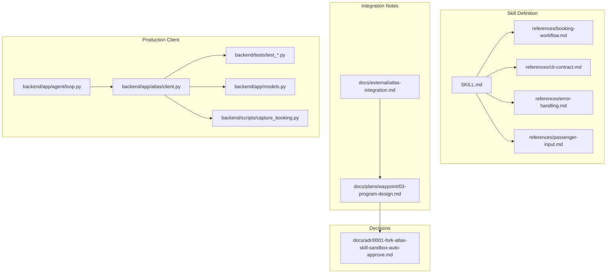
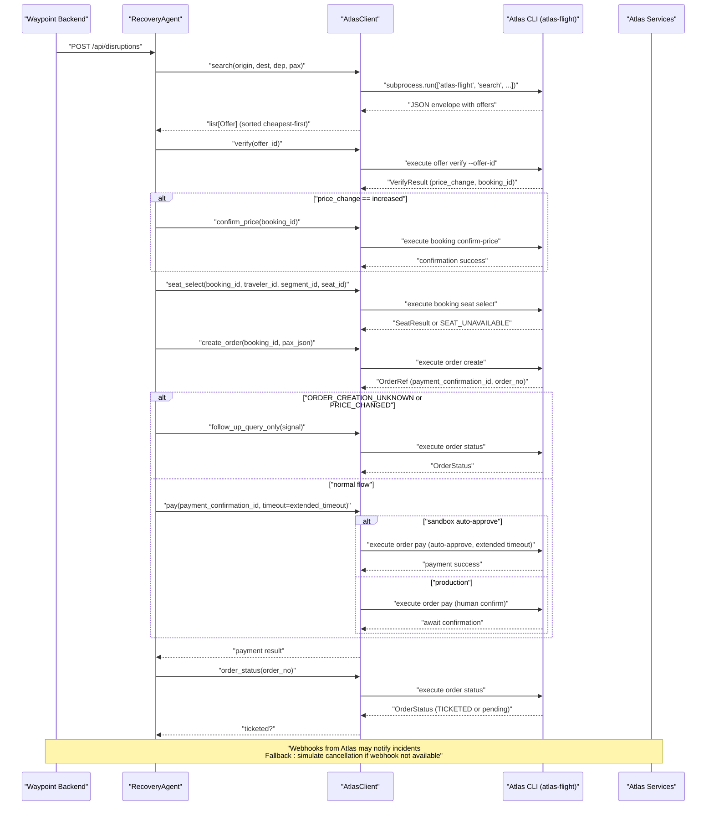
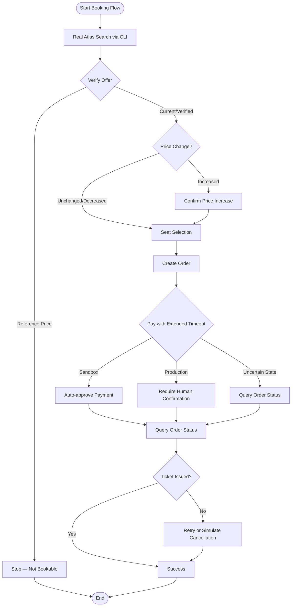
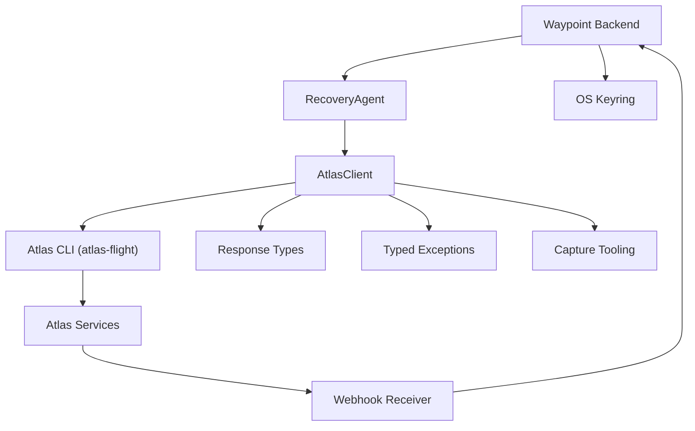

# Atlas Integration

<cite>
**Referenced Files in This Document**
- [SKILL.md](file://.agents/skills/atlas-flight-booking/SKILL.md)
- [booking-workflow.md](file://.agents/skills/atlas-flight-booking/references/booking-workflow.md)
- [cli-contract.md](file://.agents/skills/atlas-flight-booking/references/cli-contract.md)
- [error-handling.md](file://.agents/skills/atlas-flight-booking/references/error-handling.md)
- [passenger-input.md](file://.agents/skills/atlas-flight-booking/references/passenger-input.md)
- [atlas-integration.md](file://docs/external/atlas-integration.md)
- [0001-fork-atlas-skill-sandbox-auto-approve.md](file://docs/adr/0001-fork-atlas-skill-sandbox-auto-approve.md)
- [client.py](file://backend/app/atlas/client.py)
- [__init__.py](file://backend/app/atlas/__init__.py)
- [loop.py](file://backend/app/agent/loop.py)
- [routes.py](file://backend/app/api/routes.py)
- [models.py](file://backend/app/models.py)
- [capture_booking.py](file://backend/scripts/capture_booking.py)
- [test_atlas_sandbox_live.py](file://backend/tests/test_atlas_sandbox_live.py)
- [test_atlas_mapping.py](file://backend/tests/test_atlas_mapping.py)
- [test_atlas_write_path.py](file://backend/tests/test_atlas_write_path.py)
- [test_atlas_write_path_unit.py](file://backend/tests/test_atlas_write_path_unit.py)
- [03-program-design.md](file://docs/plans/waypoint/03-program-design.md)
</cite>

## Update Summary
**Changes Made**
- Enhanced Atlas client pay() method now accepts optional timeout parameter for individual calls, allowing extended timeouts specifically for payment operations while maintaining standard timeouts elsewhere
- Updated documentation to reflect improved booking capture tooling with better handling of slow sandbox responses
- Added comprehensive timeout configuration guidance for different operational scenarios

## Table of Contents
1. Introduction
2. Project Structure
3. Core Components
4. Architecture Overview
5. Detailed Component Analysis
6. Dependency Analysis
7. Performance Considerations
8. Troubleshooting Guide
9. Conclusion

## Introduction
This document explains the Waypoint integration with the Atlas Flight Booking system via a production-ready client implementation that uses subprocess calls to the atlas-flight CLI with robust error handling, sophisticated datetime parsing, and OS keyring authentication. The integration now includes a complete S2 write path implementation covering the full booking workflow from search through ticketed confirmation, with comprehensive error handling strategies, typed exceptions, and idempotency guarantees. It covers sandbox configuration, authentication using the OS keyring, environment variables, auto-approval behavior for verify and payment in sandbox only, webhook handling for incident notifications, fallback to simulated cancellations, complete API endpoints used by Waypoint including the full write-path booking workflow, error handling strategies, differences between sandbox and production environments, migration considerations, security implications, safeguards for production, and debugging and monitoring techniques.

## Project Structure
The repository includes:
- A skill definition and references under .agents/skills/atlas-flight-booking that describe workflows, CLI contracts, error handling, and passenger input patterns.
- External integration notes describing environment setup, API surface, ticketing activation status, and planned usage within Waypoint.
- An Architectural Decision Record (ADR) documenting the decision to fork the Atlas skill to enable sandbox-only auto-approval for price-increase and payment checkpoints.
- **Enhanced**: Production-ready Atlas client implementation in `backend/app/atlas/client.py` with complete S2 write path methods (verify, confirm_price, create_order, pay, order_status, seat_select), comprehensive error handling with typed exceptions, and robust retry logic for read-only operations while preventing retries on write operations.

**Diagram sources**
- [SKILL.md:1-200](file://.agents/skills/atlas-flight-booking/SKILL.md#L1-L200)
- [booking-workflow.md:1-200](file://.agents/skills/atlas-flight-booking/references/booking-workflow.md#L1-L200)
- [cli-contract.md:1-200](file://.agents/skills/atlas-flight-booking/references/cli-contract.md#L1-L200)
- [error-handling.md:1-200](file://.agents/skills/atlas-flight-booking/references/error-handling.md#L1-L200)
- [passenger-input.md:1-200](file://.agents/skills/atlas-flight-booking/references/passenger-input.md#L1-L200)
- [atlas-integration.md:1-37](file://docs/external/atlas-integration.md#L1-L37)
- [03-program-design.md:36-162](file://docs/plans/waypoint/03-program-design.md#L36-L162)
- [0001-fork-atlas-skill-sandbox-auto-approve.md:1-29](file://docs/adr/0001-fork-atlas-skill-sandbox-auto-approve.md#L1-L29)
- [client.py:1-565](file://backend/app/atlas/client.py#L1-L565)
- [capture_booking.py:1-437](file://backend/scripts/capture_booking.py#L1-L437)
- [loop.py:1-696](file://backend/app/agent/loop.py#L1-L696)

**Section sources**
- [SKILL.md:1-200](file://.agents/skills/atlas-flight-booking/SKILL.md#L1-L200)
- [atlas-integration.md:1-37](file://docs/external/atlas-integration.md#L1-L37)
- [03-program-design.md:36-162](file://docs/plans/waypoint/03-program-design.md#L36-L162)
- [0001-fork-atlas-skill-sandbox-auto-approve.md:1-29](file://docs/adr/0001-fork-atlas-skill-sandbox-auto-approve.md#L1-L29)
- [client.py:1-565](file://backend/app/atlas/client.py#L1-L565)
- [capture_booking.py:1-437](file://backend/scripts/capture_booking.py#L1-L437)
- [loop.py:1-696](file://backend/app/agent/loop.py#L1-L696)

## Core Components
- **Enhanced**: Production-Ready AtlasClient: A Gate 3 facade implementing the complete S2 booking workflow with both read path (`search`) and comprehensive write path methods (`verify`, `confirm_price`, `create_order`, `pay`, `order_status`, `seat_select`) using subprocess calls to the atlas-flight CLI. The client handles OS keyring authentication automatically, provides robust error handling with custom typed exceptions, and includes sophisticated datetime parsing for multiple formats including the confirmed compact YYYYMMDDHHMM format.
- Forked Atlas Skill: Provides search, verify, order, pay, and query operations with typed models exposed as a thin library API for in-process calls from Waypoint's backend. Auto-approval is enabled only in sandbox to allow autonomous fare-difference settlement without human confirmation.
- Authentication and Environment: Uses ATRIP OAuth via browser; tokens and credentials are stored in the OS keyring (Windows Credential Manager). Sandbox access keys are managed per profile; environment switching is done via CLI commands before starting new searches.
- **Enhanced**: Complete API Surface: The confirmed flow includes search, verify, order, pay, and queryOrderDetails, with additional getOffers and getOfferPrice endpoints. Webhook and Incident APIs are part of the broader groupings. Seat selection and passenger input handling are integrated into the booking workflow.
- Ticketing Activation Status: Ticketing features may require activation through UAT testing; until activated, only search may succeed while verify/order/pay/ticket operations are blocked.

Key behaviors:
- Price increase and payment checkpoints auto-approve in sandbox only; production always requires explicit human confirmation.
- Search responses include segments with airport codes and times; client-side filtering is required for direct-only routes.
- Offer pricing states determine bookability; only offers with current or verified price status can proceed to order.
- **Enhanced**: Complete booking workflow with formalized error handling codes, structured response types, comprehensive guard rails, and idempotency enforcement throughout the process.
- **Enhanced**: Configurable timeout support for payment operations to handle slow sandbox responses.

**Section sources**
- [atlas-integration.md:5-21](file://docs/external/atlas-integration.md#L5-L21)
- [atlas-integration.md:23-37](file://docs/external/atlas-integration.md#L23-L37)
- [03-program-design.md:71-80](file://docs/plans/waypoint/03-program-design.md#L71-L80)
- [0001-fork-atlas-skill-sandbox-auto-approve.md:6-29](file://docs/adr/0001-fork-atlas-skill-sandbox-auto-approve.md#L6-L29)
- [client.py:186-565](file://backend/app/atlas/client.py#L186-L565)

## Architecture Overview
Waypoint integrates with Atlas via a production-ready client that wraps the Atlas CLI through subprocess calls. The architecture uses the installed atlas-flight tool which handles all authentication via OS keyring, eliminating the need for secret management in the application layer. The flow starts with search, proceeds to verify and order, then pays in sandbox with auto-approval, and finally queries order details to assert ticket issuance. Webhooks from Atlas can trigger incident handling, with a fallback to simulated cancellation when webhooks are unavailable.

**Enhanced**: The complete booking workflow now includes comprehensive error handling with typed exceptions, robust retry logic for read-only operations, strict idempotency enforcement for write operations, conditional branches for price increases, seat selection, and payment confirmation, and configurable timeout support for handling slow sandbox responses.

**Diagram sources**
- [atlas-integration.md:15-21](file://docs/external/atlas-integration.md#L15-L21)
- [atlas-integration.md:33-37](file://docs/external/atlas-integration.md#L33-L37)
- [03-program-design.md:82-111](file://docs/plans/waypoint/03-program-design.md#L82-L111)
- [0001-fork-atlas-skill-sandbox-auto-approve.md:11-29](file://docs/adr/0001-fork-atlas-skill-sandbox-auto-approve.md#L11-L29)
- [client.py:331-565](file://backend/app/atlas/client.py#L331-L565)
- [capture_booking.py:367-395](file://backend/scripts/capture_booking.py#L367-L395)
- [loop.py:454-599](file://backend/app/agent/loop.py#L454-L599)

## Detailed Component Analysis

### Enhanced AtlasClient Implementation
**Enhanced**: The AtlasClient provides a production-ready implementation for Atlas integration using subprocess calls to the atlas-flight CLI with comprehensive S2 write-path methods for complete booking workflow. Key features include:

- **Subprocess-Based Communication**: Uses `subprocess.run()` to execute atlas-flight commands with JSON output parsing, avoiding Python version compatibility issues with direct library imports.
- **OS Keyring Authentication**: Leverages the installed atlas-flight tool's built-in authentication mechanism, keeping secrets out of the application layer entirely.
- **Comprehensive Error Handling**: Custom typed exceptions (`AtlasError`, `AtlasNoResults`, `AtlasQueryOnly`, `AtlasUnknownOrder`) provide clear error categorization and handling throughout the call stack.
- **Sophisticated Datetime Parsing**: Supports multiple datetime formats including the confirmed compact `YYYYMMDDHHMM` format, epoch timestamps, and standard ISO formats.
- **Complete Write-Path Methods**: Implements `verify`, `confirm_price`, `create_order`, `pay`, `order_status`, and `seat_select` methods for full booking lifecycle management.
- **Robust Retry Logic**: Read-only operations support at most one identical retry when envelope indicates `retryable=true`; write operations are never retried even if `retryable=true` appears.
- **Idempotency Enforcement**: Critical write operations (order create, order pay, seat select) are never retried to prevent duplicate bookings or payments.
- **Graceful Degradation**: Malformed offers are skipped rather than crashing the entire search operation, ensuring partial results are still returned.
- **Enhanced**: Configurable Timeout Support: The `pay()` method now accepts an optional timeout parameter that allows extending timeouts specifically for payment operations while maintaining standard timeouts elsewhere. This supports improved booking capture tooling with better handling of slow sandbox responses.

Operational guidance:
- The client is injectable for testing purposes, allowing deterministic test scenarios without live Atlas calls.
- All errors are categorized with specific codes for better monitoring and alerting.
- The search operation runs asynchronously via `asyncio.to_thread()` to prevent blocking the event loop.
- **Enhanced**: Write-path methods follow strict idempotency rules - never retry order creation or payment operations.
- **Enhanced**: Query-only signals (PRICE_CHANGED, ORDER_CREATION_UNKNOWN, PAYMENT_STATUS_UNKNOWN) require following up with order status queries instead of re-executing writes.
- **Enhanced**: Payment operations can use extended timeouts (default 90 seconds, configurable up to 240 seconds for capture tooling) to handle slow sandbox responses.

**Section sources**
- [client.py:1-565](file://backend/app/atlas/client.py#L1-L565)
- [capture_booking.py:101-107](file://backend/scripts/capture_booking.py#L101-L107)
- [test_atlas_mapping.py:1-209](file://backend/tests/test_atlas_mapping.py#L1-L209)
- [test_atlas_write_path_unit.py:1-543](file://backend/tests/test_atlas_write_path_unit.py#L1-L543)
- [03-program-design.md:71-80](file://docs/plans/waypoint/03-program-design.md#L71-L80)

### Sandbox Configuration and Authentication
- **Enhanced**: Authentication is handled entirely by the atlas-flight CLI through OS keyring storage. The AtlasClient subprocess inherits the configured environment and authentication state.
- Authentication: ATRIP OAuth via browser; token and credentials live in the OS keyring (Windows Credential Manager). Do not store secrets in environment variables or code.
- Sandbox Access Key: Managed in the ATRIP profile; secret key remains in keyring.
- Environment Switching: Use CLI commands to switch between sandbox and production; start a fresh search after switching to avoid reusing stale offers.

Operational guidance:
- Always run a new search after environment change to ensure correct pricing and availability.
- Keep secrets out of logs and configuration files; rely on OS keyring storage.
- The subprocess approach ensures no authentication logic needs to be maintained in the application layer.
- **Enhanced**: Comparison mode detection via `auth_status()` prevents write operations when ticketing is not activated.

**Section sources**
- [atlas-integration.md:10-14](file://docs/external/atlas-integration.md#L10-L14)
- [client.py:6-13](file://backend/app/atlas/client.py#L6-L13)
- [client.py:300-323](file://backend/app/atlas/client.py#L300-L323)

### Auto-Approval Policy (Sandbox Only)
- Forked skill enables auto-approval for price-increase and payment checkpoints exclusively in sandbox.
- Production retains mandatory human confirmation at both checkpoints.
- Auto-approval is deterministic execution, not an LLM decision, ensuring safety and compliance.

Security implications:
- Auto-approval must be strictly gated on sandbox environment detection.
- Production deployments must enforce explicit user consent flows and cannot bypass human confirmation.

Migration considerations:
- Maintain feature flags or environment checks to prevent accidental auto-approval in production.
- Add tests to assert that production paths require human confirmation.

**Section sources**
- [0001-fork-atlas-skill-sandbox-auto-approve.md:6-29](file://docs/adr/0001-fork-atlas-skill-sandbox-auto-approve.md#L6-L29)

### Webhook Handling and Fallback Mechanism
- Webhook and Incident APIs are part of the Atlas grouping and can serve as real disruption triggers.
- Waypoint should register a callback URL to receive incident notifications.
- If webhooks are unavailable or fail, implement a fallback to simulate cancellations to maintain recovery workflows during demonstrations or degraded conditions.

Operational guidance:
- Validate webhook payloads and signatures where applicable.
- Log webhook events and failures for observability.
- Ensure fallback simulation does not affect production data integrity.

**Section sources**
- [atlas-integration.md:15-21](file://docs/external/atlas-integration.md#L15-L21)
- [atlas-integration.md:26-32](file://docs/external/atlas-integration.md#L26-L32)

### Enhanced API Endpoints and Booking Workflow
**Enhanced**: Current implementation supports the complete S2 booking workflow with both read and write operations:

- **Read Path (Slice 2)**: 
  - Search: `search.do` returns offers with segments and pricing; filter client-side for direct-only routes.
- **Write Path (Slices 3-5)**:
  - Verify: `offer verify --offer-id` returns price change information and booking ID
  - Confirm Price: `booking confirm-price --booking-id` for price increase approval
  - Create Order: `order create --booking-id` with passenger JSON input
  - Pay: `order pay` with payment confirmation ID from create response, now supporting optional timeout parameter
  - Order Status: `order status` polling until TICKETED
  - Seat Select: `booking seat select` pre-order seat selection

Data notes:
- Segments include depAirport, arrAirport, depTime, arrTime, flightNumber, stopCities; connections come mixed and require client-side filtering.
- price_status determines bookability; reference means comparison only.
- **Enhanced**: Offers are sorted cheapest-first and include comprehensive segment information with layover calculations.
- **Enhanced**: Structured response types (VerifyResult, OrderRef, OrderStatus, SeatSelection) provide type-safe interactions.
- **Enhanced**: Comprehensive error handling with typed exceptions and query-only signal handling.
- **Enhanced**: Payment operations now support configurable timeouts to handle slow sandbox responses.

**Section sources**
- [atlas-integration.md:15-21](file://docs/external/atlas-integration.md#L15-L21)
- [atlas-integration.md:33-37](file://docs/external/atlas-integration.md#L33-L37)
- [client.py:331-565](file://backend/app/atlas/client.py#L331-L565)
- [capture_booking.py:367-395](file://backend/scripts/capture_booking.py#L367-L395)
- [03-program-design.md:71-80](file://docs/plans/waypoint/03-program-design.md#L71-L80)

### Formalized Error Handling Codes and Typed Exceptions
**Enhanced**: Comprehensive error handling with formalized error codes and structured response types:

- **Custom Typed Exceptions**: 
  - `AtlasError`: Base exception for terminal Atlas failures with error codes
  - `AtlasNoResults`: Specific exception for search failures with reasons (route_not_supported, no_flight, sold_out)
  - `AtlasQueryOnly`: Typed side-effect-uncertainty signal (PRICE_CHANGED, PAYMENT_STATUS_UNKNOWN, PAYMENT_PROCESSING) whose ONLY legal follow-up is `order status`
  - `AtlasUnknownOrder`: Specialized query-only signal for ORDER_CREATION_UNKNOWN / DUPLICATE_BOOKING_SUSPECTED
- **Structured Response Types**: 
  - `VerifyResult`: Contains offer_id, booking_id, price_change, previous_price, current_price, currency, seat_supported, baggage_supported, travelers
  - `OrderRef`: Contains payment_confirmation_id and order_no
  - `OrderStatus`: Polling result until TICKETED
  - `SeatSelection`: Seat selection outcome with fallback handling
  - `PaymentResult`: Payment outcome with query_only flag for status-only follow-ups
- Network Failures: Implement retries with exponential backoff for transient errors; surface actionable messages to users.
- Rate Limiting: Respect rate limits from Atlas; queue requests and back off appropriately; log throttling events.
- Service Unavailability: Detect service downtime and degrade gracefully; fall back to simulated cancellation for incident handling in non-production contexts.
- Ticketing Activation: If ticketing is not activated, expect verify/order/pay/ticket to fail; guide users through UAT activation steps.

Best practices:
- Centralized error mapping to consistent error types with descriptive codes.
- Structured logging including endpoint, request IDs, and error codes.
- User-facing guidance for known failure modes (e.g., ticketing activation required).
- **Enhanced**: Subprocess timeout handling with configurable timeouts (default 60 seconds for reads, 90 seconds for writes, extendable to 240 seconds for capture tooling).
- **Enhanced**: Strict idempotency enforcement - never retry order creation or payment operations.
- **Enhanced**: Query-only signal handling - never re-create orders or re-pay when uncertainty signals are received.

**Section sources**
- [error-handling.md:1-200](file://.agents/skills/atlas-flight-booking/references/error-handling.md#L1-L200)
- [atlas-integration.md:26-32](file://docs/external/atlas-integration.md#L26-L32)
- [client.py:73-106](file://backend/app/atlas/client.py#L73-L106)
- [client.py:331-565](file://backend/app/atlas/client.py#L331-L565)
- [capture_booking.py:101-107](file://backend/scripts/capture_booking.py#L101-L107)
- [models.py:154-218](file://backend/app/models.py#L154-L218)
- [03-program-design.md:52-58](file://docs/plans/waypoint/03-program-design.md#L52-L58)

### Sophisticated Datetime Parsing
**Enhanced**: The AtlasClient includes robust datetime parsing capabilities to handle multiple upstream formats:

- **Supported Formats**: Compact `YYYYMMDDHHMM` (confirmed live format), ISO formats, epoch milliseconds, and various date/time combinations.
- **Format Detection**: Automatic detection of epoch timestamps (numeric values or long numeric strings) vs. string formats.
- **Error Handling**: Strict validation that raises `ValueError` for unparseable formats, preventing silent misparsing.
- **Cross-Midnight Support**: Proper handling of flights crossing midnight boundaries using full datetime arithmetic.

Operational guidance:
- The parser prioritizes accuracy over flexibility, failing fast on unknown formats.
- All parsed datetimes maintain timezone-naive semantics consistent with Atlas's internal representation.
- Total minutes calculations use full datetime arithmetic to handle overnight flights correctly.

**Section sources**
- [client.py:107-125](file://backend/app/atlas/client.py#L107-L125)
- [test_atlas_mapping.py:155-172](file://backend/tests/test_atlas_mapping.py#L155-L172)

### Complete Booking Workflow and Passenger Input
**Enhanced**: The booking workflow now includes comprehensive passenger input handling and seat selection with robust error handling:

- Follow the documented booking workflow to sequence search, verify, order, pay, and query steps correctly.
- Use passenger input patterns to construct valid requests and handle optional fields.
- **Enhanced**: Ensure segment mapping and time parsing align with expected formats; validate layover calculations based on arrival/departure times using full datetime arithmetic.
- **Enhanced**: Seat selection workflow with fallback handling for unavailable seats.
- **Enhanced**: Payment confirmation workflow with explicit user approval requirements and configurable timeout support.
- **Enhanced**: Query-only signal handling for uncertain states requiring order status follow-up.

Operational guidance:
- Validate passenger data before submission.
- Normalize airport codes and times consistently across components.
- Reuse validated inputs to reduce redundant processing.
- **Enhanced**: Handle multi-segment itineraries with proper layover calculations and same-ticket detection.
- **Enhanced**: Implement seat selection with continue-without-seat fallback policy.
- **Enhanced**: Enforce explicit payment confirmation before executing payment operations.
- **Enhanced**: Handle uncertain states (PRICE_CHANGED, ORDER_CREATION_UNKNOWN) with appropriate query-only follow-up procedures.
- **Enhanced**: Configure appropriate timeouts for payment operations based on expected response times.

**Section sources**
- [booking-workflow.md:1-46](file://.agents/skills/atlas-flight-booking/references/booking-workflow.md#L1-L46)
- [passenger-input.md:1-200](file://.agents/skills/atlas-flight-booking/references/passenger-input.md#L1-L200)
- [client.py:331-565](file://backend/app/atlas/client.py#L331-L565)
- [capture_booking.py:367-395](file://backend/scripts/capture_booking.py#L367-L395)
- [03-program-design.md:97-107](file://docs/plans/waypoint/03-program-design.md#L97-L107)

### Enhanced Integration with Recovery Agent
**Enhanced**: The AtlasClient integrates seamlessly with Waypoint's RecoveryAgent for automated trip recovery with comprehensive error handling:

- **Asynchronous Execution**: Search operations run in background threads via `asyncio.to_thread()` to prevent blocking the event loop.
- **Enhanced Error Propagation**: Atlas-specific exceptions are caught and converted to appropriate recovery states (failed, no_legal_option) with detailed error codes.
- **Candidate Filtering**: Automatic filtering of bookable offers with current or verified price status.
- **Graceful Degradation**: Handles ticketing activation requirements by surfacing comparison-mode offers when full booking isn't available.
- **Enhanced**: Query-only signal handling with automatic order status follow-up for uncertain states.
- **Enhanced**: Idempotency enforcement prevents duplicate operations during error recovery scenarios.

Operational guidance:
- The agent maintains step budgets and provides bounded execution to prevent infinite loops.
- Recovery states clearly indicate progress and any blockers encountered during the process.
- **Enhanced**: Real-time search results are integrated into the recovery workflow with proper status updates.
- **Enhanced**: Complete booking workflow integration with guard rails and fallback mechanisms for the write path.
- **Enhanced**: Comprehensive error handling ensures robust recovery from various failure scenarios.

**Section sources**
- [loop.py:35-696](file://backend/app/agent/loop.py#L35-L696)
- [test_slice1_pipe.py:104-118](file://backend/tests/test_slice1_pipe.py#L104-L118)

### Enhanced Desk Cycle Execution Pattern
**Enhanced**: The complete desk cycle follows a structured execution pattern with comprehensive guard rails and error handling:

- **Meter-Gated Fan-Out**: Search operations are limited to prevent overwhelming the system (20/cycle default).
- **Advise Gate**: LLM-based judgment layer recommends actions but never executes them directly.
- **Execute Wall**: Code-level guards prevent unauthorized or budget-exceeding operations.
- **Enhanced**: Conditional Branches: Price increase handling, seat selection, and payment confirmation follow specific conditional logic with query-only signal handling.
- **Enhanced**: Idempotency Enforcement: Critical operations like order creation and payment are never retried automatically.
- **Enhanced**: Comparison Mode Detection: Automatic detection of ticketing availability to prevent write operations when not authorized.

Operational guidance:
- Monitor meter usage and adjust thresholds based on system capacity.
- Ensure human oversight for escalation scenarios exceeding authority caps.
- Track P&L and losses admitted for financial accountability.
- **Enhanced**: Implement comprehensive audit trails for all write operations with detailed error logging.
- **Enhanced**: Handle query-only signals with appropriate order status follow-up procedures.

**Section sources**
- [03-program-design.md:82-111](file://docs/plans/waypoint/03-program-design.md#L82-L111)
- [03-program-design.md:113-131](file://docs/plans/waypoint/03-program-design.md#L113-L131)
- [loop.py:454-696](file://backend/app/agent/loop.py#L454-L696)

### Conceptual Overview

[No sources needed since this diagram shows conceptual workflow, not actual code structure]

## Dependency Analysis
Waypoint depends on:
- **Enhanced**: Production-Ready AtlasClient: Provides subprocess-based communication with the atlas-flight CLI, handling all authentication and error management internally with complete S2 write-path support, typed exceptions, robust retry logic, and configurable timeout support.
- Atlas CLI (atlas-flight): Executed via subprocess calls, leveraging installed tool's authentication and configuration.
- OS Keyring: Stores OAuth tokens and credentials securely, accessed by the atlas-flight CLI.
- Webhook Infrastructure: Receives incident notifications from Atlas.
- **Enhanced**: Structured Response Types: VerifyResult, OrderRef, OrderStatus, SeatSelection, PaymentResult provide type-safe interactions throughout the booking workflow.

**Diagram sources**
- [atlas-integration.md:5-21](file://docs/external/atlas-integration.md#L5-L21)
- [03-program-design.md:52-58](file://docs/plans/waypoint/03-program-design.md#L52-L58)
- [0001-fork-atlas-skill-sandbox-auto-approve.md:11-29](file://docs/adr/0001-fork-atlas-skill-sandbox-auto-approve.md#L11-L29)
- [client.py:186-565](file://backend/app/atlas/client.py#L186-L565)
- [capture_booking.py:1-437](file://backend/scripts/capture_booking.py#L1-L437)
- [loop.py:35-696](file://backend/app/agent/loop.py#L35-L696)
- [models.py:154-218](file://backend/app/models.py#L154-L218)

**Section sources**
- [atlas-integration.md:5-21](file://docs/external/atlas-integration.md#L5-L21)
- [03-program-design.md:52-58](file://docs/plans/waypoint/03-program-design.md#L52-L58)
- [0001-fork-atlas-skill-sandbox-auto-approve.md:11-29](file://docs/adr/0001-fork-atlas-skill-sandbox-auto-approve.md#L11-L29)
- [client.py:1-565](file://backend/app/atlas/client.py#L1-L565)
- [capture_booking.py:1-437](file://backend/scripts/capture_booking.py#L1-L437)
- [models.py:154-218](file://backend/app/models.py#L154-L218)

## Performance Considerations
- Avoid reusing stale offers after environment switches; always start a fresh search post-switch.
- Filter segments client-side for direct-only routes to minimize unnecessary verification attempts.
- Cache validated passenger inputs and normalized airport/time formats to reduce repeated processing.
- Monitor rate limits and implement queuing/backoff to prevent throttling-induced latency spikes.
- Optimize webhook processing to handle bursts of incident notifications without blocking core booking flows.
- **Enhanced**: Subprocess calls are executed asynchronously to prevent blocking the main event loop.
- **Enhanced**: Configurable timeouts (60 seconds for reads, 90 seconds for writes, extendable to 240 seconds for capture tooling) prevent hanging subprocesses while accommodating slow sandbox responses.
- **Enhanced**: Graceful handling of malformed offers ensures partial results are still processed.
- **Enhanced**: Meter-gated search operations prevent system overload during high-volume scenarios.
- **Enhanced**: Idempotency enforcement reduces redundant network calls for critical operations.
- **Enhanced**: Robust retry logic for read-only operations improves resilience without risking write consistency.
- **Enhanced**: Payment timeout configuration allows balancing between responsiveness and reliability for slow sandbox responses.

[No sources needed since this section provides general guidance]

## Troubleshooting Guide
Common issues and resolutions:
- **Enhanced**: CLI Not Found: Ensure atlas-flight is installed and accessible on PATH; the client uses `shutil.which()` to locate it.
- Ticketing Activation Required: If verify/order/pay/ticket fail, complete UAT activation steps for selected modules; pass Flight Booking cases first to unlock dependent modules.
- Stale Offers After Environment Switch: Restart search after switching environments to ensure accurate pricing and availability.
- Webhook Failures: Inspect registration and payload validation; log failures and route to fallback simulation if necessary.
- Rate Limiting: Observe retry policies and backoff strategies; adjust concurrency to stay within limits.
- Network Errors: Implement retries with exponential backoff; surface diagnostic information including endpoint and error codes.
- **Enhanced**: Subprocess Timeouts: Configure appropriate timeouts based on expected Atlas response times; monitor for slow network conditions. Payment operations can use extended timeouts (up to 240 seconds) for capture tooling to handle slow sandbox responses.
- **Enhanced**: Write-Path Errors: Check structured error codes from VerifyResult, OrderRef, and other response types for specific failure reasons.
- **Enhanced**: Payment Confirmation Issues: Ensure payment confirmation IDs are used exactly once and never reused across different orders. Configure appropriate timeouts for payment operations based on expected response times.
- **Enhanced**: Query-Only Signal Handling: When receiving PRICE_CHANGED, ORDER_CREATION_UNKNOWN, or PAYMENT_STATUS_UNKNOWN, follow up with order status queries instead of re-executing writes.

Debugging techniques:
- Enable structured logging for all Atlas interactions, including request/response summaries and error traces.
- Use environment-specific logs to distinguish sandbox vs production behavior.
- Validate webhook delivery and signature verification; test with mock payloads.
- **Enhanced**: Monitor subprocess execution times and error outputs for performance tuning. Configure appropriate timeouts based on observed response patterns.
- **Enhanced**: Test datetime parsing with various upstream formats to ensure compatibility.
- **Enhanced**: Trace complete booking workflow execution with detailed logging at each stage.
- **Enhanced**: Monitor meter usage and step counts to identify performance bottlenecks.
- **Enhanced**: Track typed exception propagation and error code distribution for better operational visibility.
- **Enhanced**: Monitor payment timeout configurations and adjust based on sandbox response patterns.

Monitoring approaches:
- Track metrics for search, verify, order, pay, and query endpoints (latency, success rates, error categories).
- Alert on ticketing activation status changes and webhook delivery failures.
- Correlate incidents with webhook events and fallback activations.
- **Enhanced**: Monitor subprocess health and resource usage to prevent memory leaks or zombie processes. Track timeout configurations and their effectiveness.
- **Enhanced**: Track error code distribution for better operational visibility.
- **Enhanced**: Monitor complete booking workflow completion rates and failure points.
- **Enhanced**: Track P&L and losses admitted for financial accountability.
- **Enhanced**: Monitor query-only signal frequency and resolution rates for operational insights.
- **Enhanced**: Monitor payment timeout configurations and adjust based on observed response patterns.

**Section sources**
- [atlas-integration.md:26-32](file://docs/external/atlas-integration.md#L26-L32)
- [error-handling.md:1-200](file://.agents/skills/atlas-flight-booking/references/error-handling.md#L1-L200)
- [client.py:186-565](file://backend/app/atlas/client.py#L186-L565)
- [capture_booking.py:101-107](file://backend/scripts/capture_booking.py#L101-L107)
- [test_atlas_sandbox_live.py:1-35](file://backend/tests/test_atlas_sandbox_live.py#L1-L35)
- [test_atlas_write_path_unit.py:1-543](file://backend/tests/test_atlas_write_path_unit.py#L1-L543)
- [03-program-design.md:113-131](file://docs/plans/waypoint/03-program-design.md#L113-L131)

## Conclusion
The Waypoint integration leverages a production-ready AtlasClient implementation that provides robust, subprocess-based communication with the Atlas Flight Booking system. The client handles authentication via OS keyring, provides comprehensive error handling with custom typed exceptions, and includes sophisticated datetime parsing for multiple formats. Combined with the forked Atlas Skill library's sandbox-only auto-approval capabilities and careful environment management, the integration delivers reliable flight search functionality while maintaining strict security boundaries. The enhanced S2 write path implementation now supports the complete booking workflow from search through ticketed confirmation with formalized error handling codes, structured response types, comprehensive guard rails, robust retry logic for read-only operations, strict idempotency enforcement for write operations, and configurable timeout support for handling slow sandbox responses. The modular architecture supports future expansion and the desk cycle execution pattern ensures safe deployment and effective troubleshooting across environments. Adhering to the documented workflows, monitoring practices, and security safeguards ensures reliable operation of the complete booking lifecycle with comprehensive error handling and operational resilience.

[No sources needed since this section summarizes without analyzing specific files]