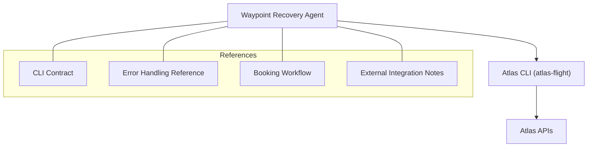
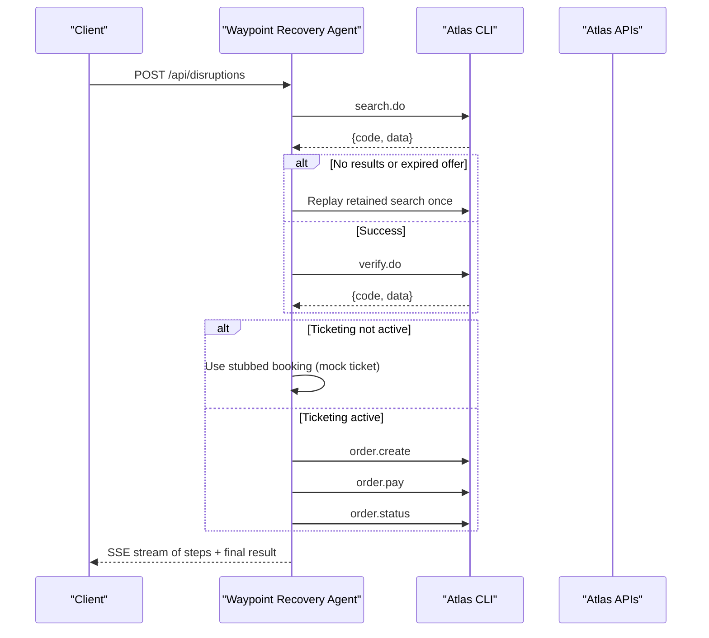
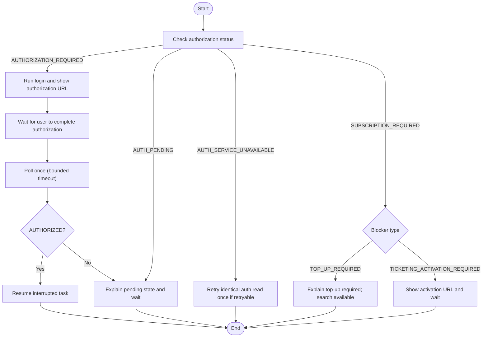
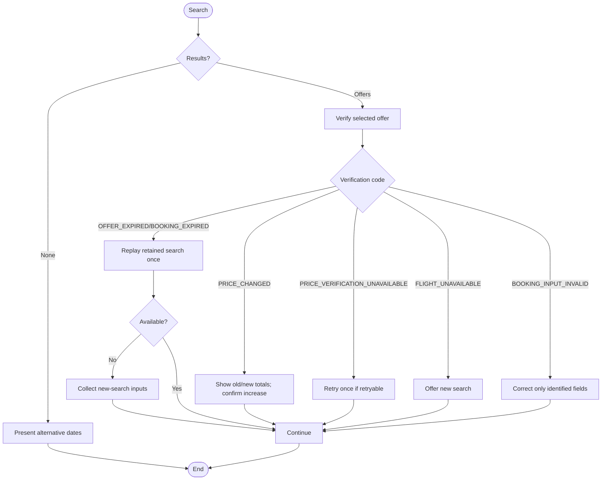
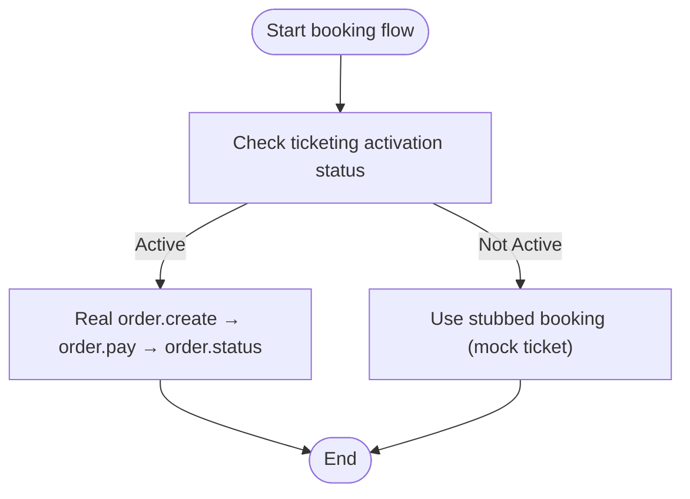
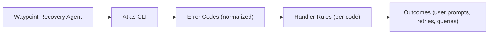

# Error Handling & Fallbacks

<cite>
**Referenced Files in This Document**
- [error-handling.md](file://.agents/skills/atlas-flight-booking/references/error-handling.md)
- [cli-contract.md](file://.agents/skills/atlas-flight-booking/references/cli-contract.md)
- [booking-workflow.md](file://.agents/skills/atlas-flight-booking/references/booking-workflow.md)
- [SKILL.md](file://.agents/skills/atlas-flight-booking/SKILL.md)
- [atlas-integration.md](file://docs/external/atlas-integration.md)
- [03-program-design.md](file://docs/plans/waypoint/03-program-design.md)
- [QODER-HANDOFF.md](file://docs/plans/waypoint/QODER-HANDOFF.md)
- [04-slices.md](file://docs/plans/waypoint/04-slices.md)
</cite>

## Table of Contents
1. Introduction
2. Project Structure
3. Core Components
4. Architecture Overview
5. Detailed Component Analysis
6. Dependency Analysis
7. Performance Considerations
8. Troubleshooting Guide
9. Conclusion

## Introduction
This document specifies how Waypoint handles errors and fallbacks when integrating with the Atlas Flight Booking system via the atlas-flight CLI. It covers network failures, rate limits, service unavailability, authentication flows, ticketing activation gating, retry policies, timeouts, circuit-breaking behavior, logging and monitoring strategies, and troubleshooting for common issues such as authentication failures, invalid offers, and booking rejections.

## Project Structure
The error handling strategy is defined by a set of reference documents that govern how Waypoint interprets Atlas responses and orchestrates retries, user prompts, and fallbacks:
- The CLI contract defines commands, response envelope fields, and safe usage rules.
- The error-handling reference maps normalized codes to agent behaviors across authorization, search, verification, optional services, order/payment/ticketing, and general failures.
- The booking workflow enforces safe end-to-end steps and side-effect guarantees.
- External integration notes describe environment, API surface, and current ticketing activation status.
- Program design outlines the recovery call stack where Atlas calls are made and guarded.



**Diagram sources**
- [03-program-design.md:125-149](file://docs/plans/waypoint/03-program-design.md#L125-L149)
- [cli-contract.md:1-79](file://.agents/skills/atlas-flight-booking/references/cli-contract.md#L1-L79)
- [error-handling.md:1-74](file://.agents/skills/atlas-flight-booking/references/error-handling.md#L1-L74)
- [booking-workflow.md:1-63](file://.agents/skills/atlas-flight-booking/references/booking-workflow.md#L1-L63)
- [atlas-integration.md:1-37](file://docs/external/atlas-integration.md#L1-L37)

**Section sources**
- [cli-contract.md:1-79](file://.agents/skills/atlas-flight-booking/references/cli-contract.md#L1-L79)
- [error-handling.md:1-74](file://.agents/skills/atlas-flight-booking/references/error-handling.md#L1-L74)
- [booking-workflow.md:1-63](file://.agents/skills/atlas-flight-booking/references/booking-workflow.md#L1-L63)
- [atlas-integration.md:1-37](file://docs/external/atlas-integration.md#L1-L37)
- [03-program-design.md:125-149](file://docs/plans/waypoint/03-program-design.md#L125-L149)

## Core Components
- Response envelope routing: Branch on code; never parse message. Use only normalized CLI fields and stable codes.
- Authorization flow: Handle missing/expired sessions, pending auth, and service unavailability with bounded polling and user-driven resumption.
- Search and verification: Treat empty results as success; replay retained searches on expiration; handle price changes and verification availability.
- Optional services: Gracefully skip unavailable baggage or seats without blocking booking.
- Order, payment, and ticketing: Strictly avoid duplicate side effects; use query-only when uncertain; honor explicit user approvals before payment.
- General failures: Limit retries for read-only operations; stop on invalid requests or responses; follow query-only rule when side effects may have occurred.

Key implementation anchors:
- Envelope fields include schema_version, status, code, message, retryable, request_id, data, details.
- Ticketing activation gating blocks verify/order/pay until activation steps are complete; search remains available.
- Recovery call stack includes search, verify, create_order, pay, and get_order with guardrails and emit points.

**Section sources**
- [cli-contract.md:76-79](file://.agents/skills/atlas-flight-booking/references/cli-contract.md#L76-L79)
- [error-handling.md:1-74](file://.agents/skills/atlas-flight-booking/references/error-handling.md#L1-L74)
- [booking-workflow.md:1-63](file://.agents/skills/atlas-flight-booking/references/booking-workflow.md#L1-L63)
- [atlas-integration.md:26-37](file://docs/external/atlas-integration.md#L26-L37)
- [03-program-design.md:125-149](file://docs/plans/waypoint/03-program-design.md#L125-L149)

## Architecture Overview
The Waypoint recovery agent orchestrates Atlas calls through the CLI, applying strict error routing and safety gates at each step. When live ticketing is not active, the pipeline uses a stubbed booking path to keep the end-to-end flow working while development continues.



**Diagram sources**
- [03-program-design.md:125-149](file://docs/plans/waypoint/03-program-design.md#L125-L149)
- [atlas-integration.md:26-37](file://docs/external/atlas-integration.md#L26-L37)
- [04-slices.md:35-37](file://docs/plans/waypoint/04-slices.md#L35-L37)

## Detailed Component Analysis

### Authentication and Access Errors
- Missing/expired authorization triggers login with an authorization URL; user completes flow and returns; one bounded poll resumes after AUTHORIZED.
- Pending authorization waits for user confirmation; no automatic loops.
- Service unavailability during auth retains session and allows one retry when retryable is true.
- Subscription blockers:
  - TOP_UP_REQUIRED: search works; verification/order/ticketing blocked until top-up effective; do not label as real-time.
  - TICKETING_ACTIVATION_REQUIRED: account not yet enabled for ticketing; present activation URL and wait for completion.



**Diagram sources**
- [error-handling.md:7-17](file://.agents/skills/atlas-flight-booking/references/error-handling.md#L7-L17)
- [cli-contract.md:19-28](file://.agents/skills/atlas-flight-booking/references/cli-contract.md#L19-L28)
- [SKILL.md:37-41](file://.agents/skills/atlas-flight-booking/SKILL.md#L37-L41)

**Section sources**
- [error-handling.md:7-17](file://.agents/skills/atlas-flight-booking/references/error-handling.md#L7-L17)
- [cli-contract.md:19-28](file://.agents/skills/atlas-flight-booking/references/cli-contract.md#L19-L28)
- [SKILL.md:37-41](file://.agents/skills/atlas-flight-booking/SKILL.md#L37-L41)

### Search and Verification Errors
- Empty search treated as success; present alternative dates.
- Offer/booking expired: replay retained search once; otherwise collect new inputs; never reuse old IDs.
- Price changes: present old/new totals; require explicit confirmation for increases; continue on decreases.
- Verification unavailable: one retry when retryable is true.
- Flight unavailable: report and offer new search.
- Invalid booking input: correct only identified fields; otherwise stop.



**Diagram sources**
- [error-handling.md:19-31](file://.agents/skills/atlas-flight-booking/references/error-handling.md#L19-L31)
- [booking-workflow.md:1-15](file://.agents/skills/atlas-flight-booking/references/booking-workflow.md#L1-L15)

**Section sources**
- [error-handling.md:19-31](file://.agents/skills/atlas-flight-booking/references/error-handling.md#L19-L31)
- [booking-workflow.md:1-15](file://.agents/skills/atlas-flight-booking/references/booking-workflow.md#L1-L15)

### Optional Services and Passenger Input
- Baggage or seat unavailability: skip and continue.
- Invalid ancillary selection: relist and choose current option or continue without it.
- Passenger/contact info: ask only for safe fields from details.fields; rebuild one-time payload; never repeat rejected values.
- Unsupported passenger combination: report and stop.

**Section sources**
- [error-handling.md:32-43](file://.agents/skills/atlas-flight-booking/references/error-handling.md#L32-L43)

### Order, Payment, and Ticketing
- Payment confirmation required: present summary and order link when returned; wait for explicit approval.
- Invalid confirmation: do not pay; require fresh order response and confirmation.
- Price changed: do not create another order; search and verify again before asking for decision.
- Order creation unavailable: report and stop.
- Payment method unavailable: report; show order link when returned.
- Payment deadline expired: report expiry; do not pay.
- Balance check required: explain possible insufficient balance; show order link only when returned; never pay again.
- Unknown/duplicate suspected: never create again; show order link if returned; otherwise report uncertainty.
- Status unknown/processing: never pay again; query order status using order_no.
- Ticketed/ticketing pending: report issued or continuing; do not call pending failure.
- Order cancelled/not found: report accordingly.
- Status unavailable: retry identical status query once when retryable; never repay.
- Unsupported flow/state invalid: report and stop.

```mermaid
sequenceDiagram
participant Agent as "Waypoint Agent"
participant CLI as "Atlas CLI"
participant Atlas as "Atlas APIs"
Agent->>CLI : order.create
CLI-->>Agent : {code, data}
alt ORDER_CREATION_UNKNOWN/DUPLICATE_SUSPECTED
Agent->>Agent : Do not create again; show order link if present
else OK
Agent->>CLI : order.pay (one-time confirmation ID)
CLI-->>Agent : {code, data}
alt PAYMENT_STATUS_UNKNOWN/PAYMENT_PROCESSING
Agent->>CLI : order.status (query only)
else TICKETED/TICKETING_PENDING
Agent->>Agent : Report outcome; show order link if present
else Other terminal code
Agent->>Agent : Report neutral meaning; stop
end
end
```

**Diagram sources**
- [error-handling.md:44-63](file://.agents/skills/atlas-flight-booking/references/error-handling.md#L44-L63)
- [booking-workflow.md:31-59](file://.agents/skills/atlas-flight-booking/references/booking-workflow.md#L31-L59)

**Section sources**
- [error-handling.md:44-63](file://.agents/skills/atlas-flight-booking/references/error-handling.md#L44-L63)
- [booking-workflow.md:31-59](file://.agents/skills/atlas-flight-booking/references/booking-workflow.md#L31-L59)

### Fallback Mechanism for Simulated Cancellations When Live Ticketing Is Not Available
- Current sandbox status indicates TICKETING_ACTIVATION_REQUIRED, which blocks verify/order/pay/ticketing while search remains available.
- Until activation clears, Slice 5 uses a stubbed booking that returns a mock ticket so the pipeline stays end-to-end; swap in real book+settle once ticketing is active.



**Diagram sources**
- [atlas-integration.md:26-37](file://docs/external/atlas-integration.md#L26-L37)
- [04-slices.md:35-37](file://docs/plans/waypoint/04-slices.md#L35-L37)

**Section sources**
- [atlas-integration.md:26-37](file://docs/external/atlas-integration.md#L26-L37)
- [04-slices.md:35-37](file://docs/plans/waypoint/04-slices.md#L35-L37)

### Retry Policies and Exponential Backoff Guidance
- Read-only operations: repeat the identical command at most once when retryable is true (e.g., auth status, verification, order status).
- Side-effecting operations: never retry order creation or payment automatically; if uncertain, query status using order_no.
- Exponential backoff guidance: apply bounded retries with increasing delays for transient failures on read-only calls; cap total attempts and respect retryable flag. Avoid any retry that could cause duplicate orders or payments.

**Section sources**
- [error-handling.md:65-74](file://.agents/skills/atlas-flight-booking/references/error-handling.md#L65-L74)
- [booking-workflow.md:50-63](file://.agents/skills/atlas-flight-booking/references/booking-workflow.md#L50-L63)

### Timeout Configurations
- Authorization polling: use a bounded timeout (e.g., 120 seconds) when polling once after user completes authorization; resume only after AUTHORIZED.
- General timeouts: ensure all CLI calls enforce reasonable timeouts to prevent indefinite hangs; treat timeouts as SERVICE_TEMPORARILY_UNAVAILABLE and follow retry-once policy for read-only operations.

**Section sources**
- [cli-contract.md:19-28](file://.agents/skills/atlas-flight-booking/references/cli-contract.md#L19-L28)
- [error-handling.md:65-74](file://.agents/skills/atlas-flight-booking/references/error-handling.md#L65-L74)

### Circuit Breaker Patterns for Atlas API Calls
- Pattern: short-circuit repeated failing calls to reduce load and improve responsiveness.
- Implementation guidance:
  - Track recent failures per operation category (auth, search, verify, order, payment, status).
  - After a threshold of consecutive failures within a time window, open the circuit and return a user-friendly “service temporarily unavailable” message.
  - Allow a single probe attempt; if successful, close the circuit; otherwise, keep it open for a cooldown period.
  - Ensure circuit breaker does not authorize different commands or bypass user checkpoints.

[No sources needed since this section provides general guidance]

### Logging and Monitoring Strategies
- Log structured envelopes including schema_version, status, code, request_id, and high-level data summaries; avoid logging sensitive fields like passenger data or credentials.
- Emit step-by-step events in the recovery stream to aid debugging and observability.
- Monitor key metrics:
  - Rate of AUTHORIZATION_REQUIRED, SUBSCRIPTION_REQUIRED, OFFER_EXPIRED, PRICE_CHANGED, ORDER_CREATION_UNKNOWN, PAYMENT_STATUS_UNKNOWN.
  - Timeouts and retry counts per operation.
  - Ticketing activation status transitions.

**Section sources**
- [cli-contract.md:76-79](file://.agents/skills/atlas-flight-booking/references/cli-contract.md#L76-L79)
- [03-program-design.md:125-149](file://docs/plans/waypoint/03-program-design.md#L125-L149)

## Dependency Analysis
The Waypoint recovery agent depends on the Atlas CLI and its normalized response codes. The references define the contract and behavior mapping, ensuring consistent interpretation across the pipeline.



**Diagram sources**
- [cli-contract.md:1-79](file://.agents/skills/atlas-flight-booking/references/cli-contract.md#L1-L79)
- [error-handling.md:1-74](file://.agents/skills/atlas-flight-booking/references/error-handling.md#L1-L74)

**Section sources**
- [cli-contract.md:1-79](file://.agents/skills/atlas-flight-booking/references/cli-contract.md#L1-L79)
- [error-handling.md:1-74](file://.agents/skills/atlas-flight-booking/references/error-handling.md#L1-L74)

## Performance Considerations
- Prefer read-only retries with bounded attempts to minimize load on Atlas.
- Avoid unnecessary replays; only replay retained searches when explicitly indicated by codes.
- Cache offer and search IDs locally to enable efficient replays without reconstructing payloads.
- Stream progress via SSE to keep clients responsive and allow early cancellation.

[No sources needed since this section provides general guidance]

## Troubleshooting Guide

### Authentication Failures
- Symptoms: AUTHORIZATION_REQUIRED, AUTH_PENDING, AUTH_EXPIRED/AUTH_SESSION_MISSING, AUTH_SERVICE_UNAVAILABLE.
- Actions:
  - Present authorization URL; instruct user to sign in or create account; stop turn; poll once after user confirms completion.
  - On AUTH_PENDING, wait for user; do not auto-loop.
  - On AUTH_SERVICE_UNAVAILABLE, retain session and retry once if retryable.

**Section sources**
- [error-handling.md:7-17](file://.agents/skills/atlas-flight-booking/references/error-handling.md#L7-L17)
- [cli-contract.md:19-28](file://.agents/skills/atlas-flight-booking/references/cli-contract.md#L19-L28)

### Invalid Offers and Expired Bookings
- Symptoms: OFFER_EXPIRED, BOOKING_EXPIRED, FLIGHT_UNAVAILABLE, SEARCH_NO_RESULTS.
- Actions:
  - Replay retained search once; if unavailable, collect new inputs; never reuse old IDs.
  - For no results, present alternative dates.
  - For flight unavailable, offer new search.

**Section sources**
- [error-handling.md:19-31](file://.agents/skills/atlas-flight-booking/references/error-handling.md#L19-L31)

### Booking Rejections and Payment Issues
- Symptoms: PAYMENT_CONFIRMATION_REQUIRED, PAYMENT_CONFIRMATION_INVALID, PRICE_CHANGED, ORDER_CREATION_UNAVAILABLE, PAYMENT_METHOD_UNAVAILABLE, PAYMENT_DEADLINE_EXPIRED, PAYMENT_BALANCE_CHECK_REQUIRED, ORDER_CREATION_UNKNOWN, DUPLICATE_BOOKING_SUSPECTED, PAYMENT_STATUS_UNKNOWN, PAYMENT_PROCESSING.
- Actions:
  - Always present current summary and order link when returned; wait for explicit approval before paying.
  - Do not create another order on price change; search and verify again.
  - On balance check required, explain possible insufficient balance; never pay again.
  - On unknown/duplicate suspected, never create again; show order link if present; otherwise report uncertainty.
  - On status unknown/processing, query order status using order_no; never pay again.

**Section sources**
- [error-handling.md:44-63](file://.agents/skills/atlas-flight-booking/references/error-handling.md#L44-L63)
- [booking-workflow.md:31-59](file://.agents/skills/atlas-flight-booking/references/booking-workflow.md#L31-L59)

### Ticketing Activation Required
- Symptoms: SUBSCRIPTION_REQUIRED with TICKETING_ACTIVATION_REQUIRED; verify/order/pay blocked; search available.
- Actions:
  - Present activation URL; wait for user to complete steps; then re-check authorization and proceed with verification using current-price offers.

**Section sources**
- [error-handling.md:7-17](file://.agents/skills/atlas-flight-booking/references/error-handling.md#L7-L17)
- [atlas-integration.md:26-37](file://docs/external/atlas-integration.md#L26-L37)

### General Network and Service Failures
- Symptoms: SERVICE_TEMPORARILY_UNAVAILABLE, SERVICE_REQUEST_FAILED, SERVICE_RESPONSE_INVALID.
- Actions:
  - For read-only commands, retry identical call once when retryable; never repeat order creation or payment.
  - For request/response failures, report and stop; if side effect might have occurred, follow query-only rule.

**Section sources**
- [error-handling.md:65-74](file://.agents/skills/atlas-flight-booking/references/error-handling.md#L65-L74)

## Conclusion
Waypoint’s Atlas integration relies on a strict, code-based error routing strategy that prioritizes safety, user control, and idempotency. Authentication and ticketing activation gates are handled with clear user prompts and bounded polling. Retries are limited to read-only operations and enforced by the retryable flag. When live ticketing is inactive, a stubbed booking keeps the pipeline functional until activation completes. Logging and monitoring should focus on normalized codes and request IDs to diagnose issues without exposing sensitive data.