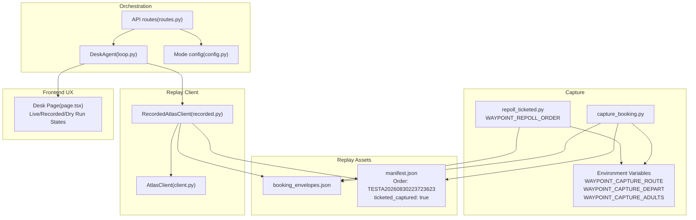
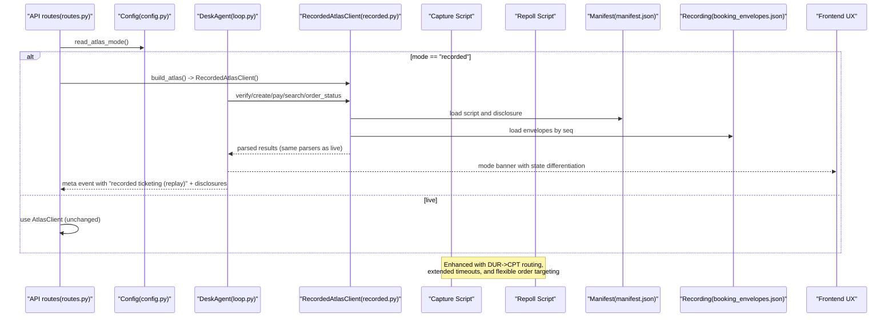
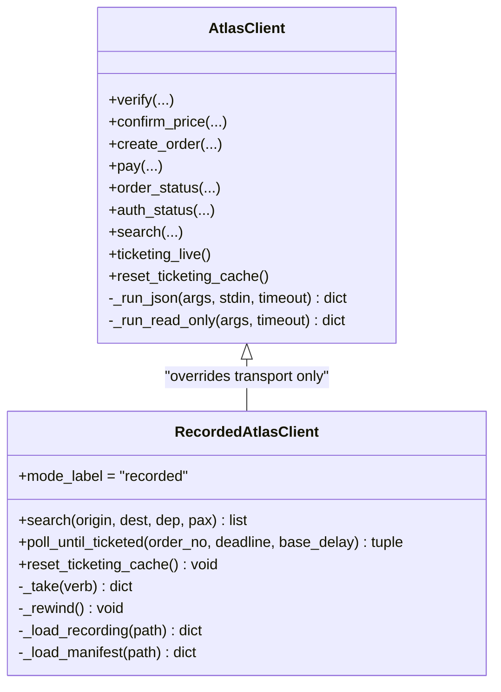
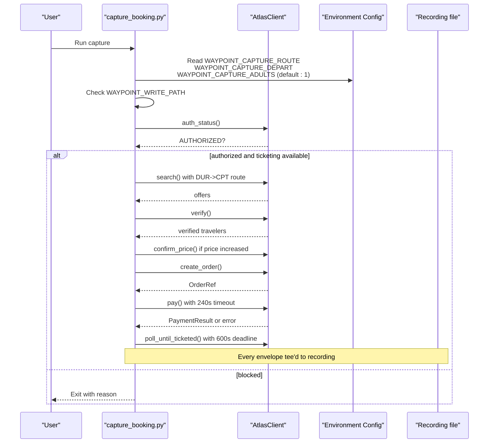
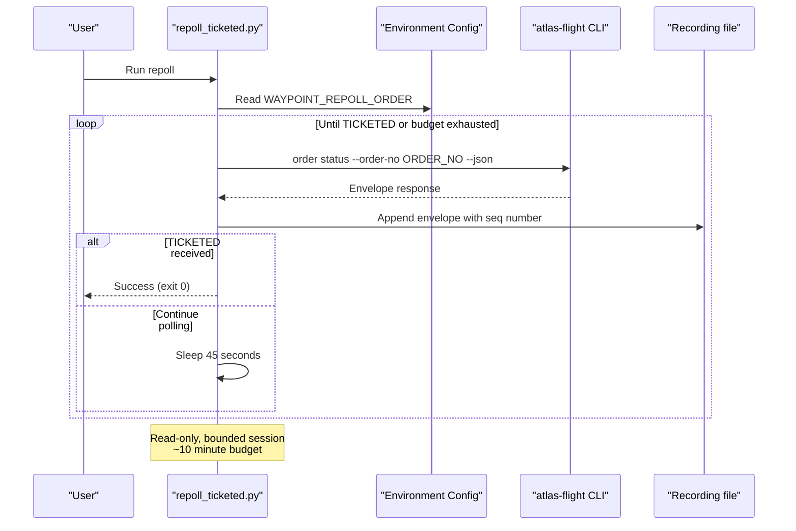
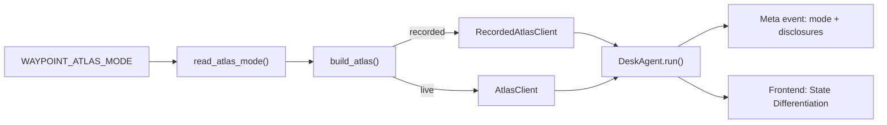
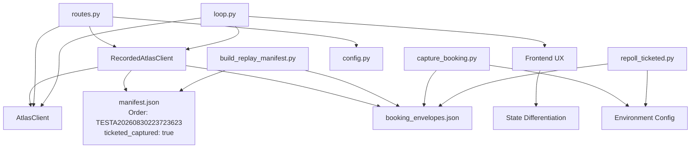

# Recorded Mode Engine

<cite>
**Referenced Files in This Document**
- [recorded.py](file://backend/app/atlas/recorded.py)
- [manifest.json](file://backend/data/recorded/manifest.json)
- [build_replay_manifest.py](file://backend/scripts/build_replay_manifest.py)
- [capture_booking.py](file://backend/scripts/capture_booking.py)
- [repoll_ticketed.py](file://backend/scripts/repoll_ticketed.py)
- [10-s9-recorded-mode.md](file://docs/plans/waypoint/10-s9-recorded-mode.md)
- [test_recorded_mode.py](file://backend/tests/test_recorded_mode.py)
- [test_recorded_determinism.py](file://backend/tests/test_recorded_determinism.py)
- [client.py](file://backend/app/atlas/client.py)
- [config.py](file://backend/app/atlas/config.py)
- [routes.py](file://backend/app/api/routes.py)
- [loop.py](file://backend/app/agent/loop.py)
- [page.tsx](file://frontend/app/desk/[deskId]/page.tsx)
</cite>

## Update Summary
**Changes Made**
- Updated manifest.json with new order TESTA20260830223723623 and genuine ticketed capture (ticketed_captured: true)
- Enhanced recording with expanded 23-step script sequence including proper authentication, search, offer verification, order creation, payment processing, and order status polling
- Improved capture reliability with extended timeouts, better sandbox routing (DUR->CPT), and enhanced passenger configuration
- Added comprehensive environment variable documentation for capture configuration
- **Updated default passenger configuration from 2 adults to 1 adult due to sandbox behavior issues with multi-passenger bookings**
- Enhanced repoll capabilities with flexible order targeting via environment variables

## Table of Contents
1. [Introduction](#introduction)
2. [Project Structure](#project-structure)
3. [Core Components](#core-components)
4. [Architecture Overview](#architecture-overview)
5. [Detailed Component Analysis](#detailed-component-analysis)
6. [Dependency Analysis](#dependency-analysis)
7. [Performance Considerations](#performance-considerations)
8. [Troubleshooting Guide](#troubleshooting-guide)
9. [Conclusion](#conclusion)
10. [Appendices](#appendices)

## Introduction
The Recorded Mode Engine provides a deterministic, sandbox-independent replay rail for the Atlas ticketing subsystem. It captures live CLI envelopes during a real booking run and replays them with strict honesty guarantees: no fabricated TICKETED envelopes, no subprocesses, no clock or randomness, and explicit wire disclosures about composite recordings. The engine is selected via a strict environment switch and integrates into the existing desk orchestration loop without altering the live transport code.

**Updated** The latest recording features order TESTA20260830223723623 with a streamlined booking workflow that successfully captures complete booking flows including genuine TICKETED status. The enhanced recording now includes a comprehensive 23-step sequence with proper authentication, search, offer verification, order creation, payment processing, and realistic timing intervals for order status polling. **Default passenger configuration updated to 1 adult due to sandbox behavior issues with multi-passenger bookings.**

## Project Structure
Recorded mode spans capture tooling, replay client, manifest generation, configuration, API wiring, and tests. Key locations:
- Replay client: backend/app/atlas/recorded.py
- Manifest (honesty register): backend/data/recorded/manifest.json
- Capture script: backend/scripts/capture_booking.py
- Repoll script: backend/scripts/repoll_ticketed.py
- Manifest builder: backend/scripts/build_replay_manifest.py
- Mode config: backend/app/atlas/config.py
- API seam: backend/app/api/routes.py
- Orchestration loop: backend/app/agent/loop.py
- Live client base: backend/app/atlas/client.py
- Frontend UX: frontend/app/desk/[deskId]/page.tsx
- Tests: backend/tests/test_recorded_mode.py, backend/tests/test_recorded_determinism.py
- Plan and ADRs: docs/plans/waypoint/10-s9-recorded-mode.md, docs/adr/0005-recorded-atlas-replay-mode.md



**Diagram sources**
- [capture_booking.py:71-112](file://backend/scripts/capture_booking.py#L71-L112)
- [repoll_ticketed.py:38-41](file://backend/scripts/repoll_ticketed.py#L38-L41)
- [recorded.py:1-235](file://backend/app/atlas/recorded.py#L1-L235)
- [client.py:1-200](file://backend/app/atlas/client.py#L1-L200)
- [config.py:1-38](file://backend/app/atlas/config.py#L1-L38)
- [routes.py:97-113](file://backend/app/api/routes.py#L97-L113)
- [loop.py:183-200](file://backend/app/agent/loop.py#L183-L200)
- [page.tsx:1905-1914](file://frontend/app/desk/[deskId]/page.tsx#L1905-L1914)

**Section sources**
- [10-s9-recorded-mode.md:1-72](file://docs/plans/waypoint/10-s9-recorded-mode.md#L1-L72)
- [recorded.py:1-235](file://backend/app/atlas/recorded.py#L1-L235)
- [manifest.json:1-206](file://backend/data/recorded/manifest.json#L1-L206)

## Core Components
- RecordedAtlasClient: Subclass of AtlasClient that overrides only transport methods to serve recorded envelopes deterministically. Enforces fail-closed behavior on unscripted calls and rewinds per cycle.
- Manifest: JSON honesty register describing which steps are served, provenance (captured vs reconstructed), and wire disclosure. **Updated** with new order TESTA20260830223723623 and genuine ticketed capture (ticketed_captured: true).
- Capture script: Tees every raw envelope from a live booking run into a JSON-lines file; includes double-gate safety checks before capturing writes. **Enhanced** with improved sandbox routing (DUR->CPT) and configurable environment variables. **Updated default passenger configuration to 1 adult due to sandbox behavior issues with multi-passenger bookings.**
- Repoll script: Query-only re-polling tool for TICKETED tail completion with flexible order targeting via environment variables.
- Manifest builder: Derives the replay script from the latest captured run, flags reconstructed pay when justified by later TICKETED status, and writes manifest metadata.
- Mode config: Strict parse of WAYPOINT_ATLAS_MODE to select recorded vs live.
- API seam: build_atlas() selects RecordedAtlasClient when configured.
- Loop integration: Uses getattr-based reset_ticketing_cache hook to rewind cursers and sets wire label to "recorded ticketing (replay)" with disclosures.
- **Frontend UX**: Enhanced state differentiation showing "Live — booking for real", "Recorded — replaying a real sandbox ticket", and "Dry run — no real bookings yet".

**Section sources**
- [recorded.py:65-235](file://backend/app/atlas/recorded.py#L65-L235)
- [manifest.json:1-206](file://backend/data/recorded/manifest.json#L1-L206)
- [capture_booking.py:71-112](file://backend/scripts/capture_booking.py#L71-L112)
- [repoll_ticketed.py:1-119](file://backend/scripts/repoll_ticketed.py#L1-L119)
- [build_replay_manifest.py:59-205](file://backend/scripts/build_replay_manifest.py#L59-L205)
- [config.py:28-38](file://backend/app/atlas/config.py#L28-L38)
- [routes.py:97-113](file://backend/app/api/routes.py#L97-L113)
- [loop.py:183-200](file://backend/app/agent/loop.py#L183-L200)
- [page.tsx:1905-1914](file://frontend/app/desk/[deskId]/page.tsx#L1905-L1914)

## Architecture Overview
The Recorded Mode Engine replaces the live transport layer with a deterministic replay path while preserving all parsing and business logic. The flow:
- Configuration selects RecordedAtlasClient based on an environment variable.
- The API constructs the agent with the selected Atlas client.
- During a desk cycle, the agent invokes Atlas methods; RecordedAtlasClient serves envelopes from the manifest/script in order.
- The manifest's wire disclosure is emitted on the meta event to indicate replay mode and composite state.
- No subprocesses, clocks, or randomness are used in replay.

**Updated** Enhanced capture reliability with improved timeout handling, better sandbox routing configuration, and flexible repoll capabilities for completing pending orders. **Default passenger configuration updated to improve sandbox compatibility.**



**Diagram sources**
- [config.py:28-38](file://backend/app/atlas/config.py#L28-L38)
- [routes.py:97-113](file://backend/app/api/routes.py#L97-L113)
- [recorded.py:79-120](file://backend/app/atlas/recorded.py#L79-L120)
- [manifest.json:1-206](file://backend/data/recorded/manifest.json#L1-L206)
- [loop.py:183-200](file://backend/app/agent/loop.py#L183-L200)
- [capture_booking.py:71-112](file://backend/scripts/capture_booking.py#L71-L112)
- [repoll_ticketed.py:38-41](file://backend/scripts/repoll_ticketed.py#L38-L41)
- [page.tsx:1905-1914](file://frontend/app/desk/[deskId]/page.tsx#L1905-L1914)

## Detailed Component Analysis

### RecordedAtlasClient
Overrides only transport to serve recorded envelopes deterministically. Matching uses normalized verb plus sequence index from the manifest script. Unmatched calls raise a typed NO_RECORDING error. Two control overrides ensure replay hygiene:
- reset_ticketing_cache: rewinds per-cycle cursor so each desk cycle replays identically.
- poll_until_ticketed: iterates through scripted order status envelopes until TICKETED; never sleeps or touches time.



**Diagram sources**
- [recorded.py:65-235](file://backend/app/atlas/recorded.py#L65-235)
- [client.py:1-200](file://backend/app/atlas/client.py#L1-L200)

**Section sources**
- [recorded.py:65-235](file://backend/app/atlas/recorded.py#L65-L235)
- [test_recorded_mode.py:71-114](file://backend/tests/test_recorded_mode.py#L71-L114)
- [test_recorded_mode.py:149-169](file://backend/tests/test_recorded_mode.py#L149-L169)

### Enhanced Capture Script
Captures a full booking run against the live sandbox, teeing every envelope before any parse decision. **Enhanced** with improved reliability features:

**New Environment Variables:**
- `WAYPOINT_CAPTURE_ROUTE`: Configurable route (default: "DUR-CPT" - the blessed UAT reference route)
- `WAYPOINT_CAPTURE_DEPART`: Departure date (default: "2026-09-20")
- `WAYPOINT_CAPTURE_ADULTS`: Number of adults (**Updated default: "1"** - changed from "2" due to sandbox behavior issues with multi-passenger bookings)

**Extended Timeouts:**
- `PAY_WRITE_TIMEOUT_SECONDS`: Increased to 240s (from previous 90s) to handle slow sandbox responses
- `TICKETED_POLL_DEADLINE_SECONDS`: Increased to 600s (from previous 180s) to accommodate longer ticketing processing times
- `RECOVERY_READ_TIMEOUT_SECONDS`: Set to 240s for recovery operations

**Improved Sandbox Routing:**
- Default route changed from SIN->NRT to DUR->CPT (African route guaranteed to ticket in sandbox)
- Better success rate for capturing complete booking flows including TICKETED status

**Passenger Configuration Update:**
- **Default passenger count reduced from 2 to 1 adult** due to sandbox behavior issues with multi-passenger bookings
- Multi-passenger bookings experienced PASSENGER_INFO_INVALID errors and stalled at TICKETING_PENDING status
- Users can still test with multiple passengers by explicitly setting `WAYPOINT_CAPTURE_ADULTS="2"`

Double-gate safety:
- Explicit human intent flag required to arm write-path capture
- Authorization and ticketing availability checks before proceeding



**Diagram sources**
- [capture_booking.py:71-112](file://backend/scripts/capture_booking.py#L71-L112)
- [capture_booking.py:270-437](file://backend/scripts/capture_booking.py#L270-L437)

**Section sources**
- [capture_booking.py:71-112](file://backend/scripts/capture_booking.py#L71-L112)
- [capture_booking.py:270-437](file://backend/scripts/capture_booking.py#L270-L437)

### Enhanced Repoll Script
**New** Query-only re-polling tool for completing pending orders with flexible order targeting.

**Key Features:**
- `WAYPOINT_REPOLL_ORDER` environment variable for specifying which order to poll (default: TESTA20260825233427052)
- Bounded polling session (~10 minutes budget)
- Read-only discipline - only executes `order status` commands
- Appends envelopes to recording file with globally monotonic sequence numbers
- Stops immediately upon receiving TICKETED envelope

**Usage:**
```bash
# Poll specific order
export WAYPOINT_REPOLL_ORDER=TESTA20260830223723623
python scripts/repoll_ticketed.py

# Use default historical order
python scripts/repoll_ticketed.py
```



**Diagram sources**
- [repoll_ticketed.py:38-41](file://backend/scripts/repoll_ticketed.py#L38-L41)
- [repoll_ticketed.py:72-109](file://backend/scripts/repoll_ticketed.py#L72-L109)

**Section sources**
- [repoll_ticketed.py:1-119](file://backend/scripts/repoll_ticketed.py#L1-L119)

### Enhanced Frontend UX
**Updated** The frontend now provides clear state differentiation between different operational modes:

- **"Live — booking for real"**: When running in live mode with actual bookings
- **"Recorded — replaying a real sandbox ticket"**: When replaying recorded sessions  
- **"Dry run — no real bookings yet"**: When in comparison/dry run mode

This enhancement improves user understanding of the current operational state and prevents confusion about whether bookings are being made for real or just simulated.

**Section sources**
- [page.tsx:1905-1914](file://frontend/app/desk/[deskId]/page.tsx#L1905-L1914)

### Integration Points
- Mode selection: read_atlas_mode() strictly parses WAYPOINT_ATLAS_MODE; only exact "recorded" enables replay.
- API seam: build_atlas() returns RecordedAtlasClient when configured; otherwise returns live AtlasClient.
- Loop integration: DeskAgent resets replay cache per cycle and emits meta events with recorded mode label and disclosures.



**Diagram sources**
- [config.py:28-38](file://backend/app/atlas/config.py#L28-L38)
- [routes.py:97-113](file://backend/app/api/routes.py#L97-L113)
- [loop.py:183-200](file://backend/app/agent/loop.py#L183-L200)
- [page.tsx:1905-1914](file://frontend/app/desk/[deskId]/page.tsx#L1905-L1914)

**Section sources**
- [config.py:28-38](file://backend/app/atlas/config.py#L28-L38)
- [routes.py:97-113](file://backend/app/api/routes.py#L97-L113)
- [loop.py:183-200](file://backend/app/agent/loop.py#L183-L200)

## Dependency Analysis
- RecordedAtlasClient depends on:
  - AtlasClient (inheritance for parsing and business logic)
  - Manifest and recording files for data
  - Models for OrderStatus and related types
- Manifest builder depends on recording file and outputs manifest.json
- Capture script depends on AtlasClient and writes recording file
- Repoll script depends on atlas-flight CLI and writes to recording file
- API routes depend on config to select client
- Loop depends on client interface and optional reset_ticketing_cache hook
- **Frontend depends on meta events for state differentiation**



**Diagram sources**
- [recorded.py:1-235](file://backend/app/atlas/recorded.py#L1-L235)
- [build_replay_manifest.py:1-210](file://backend/scripts/build_replay_manifest.py#L1-L210)
- [capture_booking.py:1-436](file://backend/scripts/capture_booking.py#L1-L436)
- [repoll_ticketed.py:1-119](file://backend/scripts/repoll_ticketed.py#L1-L119)
- [routes.py:97-113](file://backend/app/api/routes.py#L97-L113)
- [config.py:28-38](file://backend/app/atlas/config.py#L28-L38)
- [loop.py:183-200](file://backend/app/agent/loop.py#L183-L200)
- [page.tsx:1905-1914](file://frontend/app/desk/[deskId]/page.tsx#L1905-L1914)

**Section sources**
- [recorded.py:1-235](file://backend/app/atlas/recorded.py#L1-L235)
- [build_replay_manifest.py:1-210](file://backend/scripts/build_replay_manifest.py#L1-L210)
- [capture_booking.py:1-436](file://backend/scripts/capture_booking.py#L1-L436)
- [repoll_ticketed.py:1-119](file://backend/scripts/repoll_ticketed.py#L1-L119)
- [routes.py:97-113](file://backend/app/api/routes.py#L97-L113)
- [config.py:28-38](file://backend/app/atlas/config.py#L28-L38)
- [loop.py:183-200](file://backend/app/agent/loop.py#L183-L200)

## Performance Considerations
- Deterministic replay eliminates network latency and subprocess overhead; performance is bounded by file I/O and Python parsing.
- Per-cycle rewind ensures consistent replay cost across cycles.
- Search and write paths reuse inherited parsers, avoiding duplicated logic and ensuring predictable performance characteristics.
- **Enhanced timeouts improve capture reliability** by accommodating slower sandbox responses without premature failures.
- **Improved routing reduces capture failures** by using a more reliable sandbox route (DUR->CPT).
- **Flexible repoll capabilities** allow targeted polling of specific orders without affecting other test scenarios.
- **Updated passenger configuration improves sandbox compatibility** by reducing multi-passenger booking issues.

[No sources needed since this section provides general guidance]

## Troubleshooting Guide
Common issues and resolutions:
- Missing or malformed recording/manifest: RecordedAtlasClient construction raises NO_RECORDING; ensure both files exist and are valid.
- Unscripted call during replay: Raises NO_RECORDING; verify the manifest script covers the expected verb sequence.
- Composite recording without TICKETED: The replay ends honestly with the captured state; do not expect a TICKETED envelope unless captured.
- Time-related failures in polling: Recorded poll_until_ticketed does not sleep or use time; exhaustion leads to NO_RECORDING if the script ends before TICKETED.
- Subprocess tripwires: Tests assert zero subprocess spawns in recorded mode; if subprocess calls occur, ensure RecordedAtlasClient is selected and no live path is invoked.
- **Capture failures**: Verify environment variables (WAYPOINT_CAPTURE_ROUTE, WAYPOINT_CAPTURE_DEPART, WAYPOINT_CAPTURE_ADULTS) are set correctly.
- **Timeout issues**: Ensure PAY_WRITE_TIMEOUT_SECONDS and TICKETED_POLL_DEADLINE_SECONDS are appropriately configured for your sandbox environment.
- **Repoll failures**: Check that WAYPOINT_REPOLL_ORDER is set to a valid order number and atlas-flight CLI is available on PATH.
- **Order-specific issues**: Use WAYPOINT_REPOLL_ORDER to target specific orders for polling when dealing with multiple concurrent test scenarios.
- **Multi-passenger booking issues**: If experiencing PASSENGER_INFO_INVALID errors or stalls at TICKETING_PENDING, try reducing passenger count to 1 adult (default) or investigate sandbox behavior with multi-passenger bookings.

**Section sources**
- [test_recorded_mode.py:171-189](file://backend/tests/test_recorded_mode.py#L171-L189)
- [test_recorded_mode.py:134-147](file://backend/tests/test_recorded_mode.py#L134-L147)
- [test_recorded_mode.py:149-169](file://backend/tests/test_recorded_mode.py#L149-L169)
- [test_recorded_mode.py:191-210](file://backend/tests/test_recorded_mode.py#L191-L210)
- [capture_booking.py:71-112](file://backend/scripts/capture_booking.py#L71-L112)
- [repoll_ticketed.py:38-41](file://backend/scripts/repoll_ticketed.py#L38-L41)

## Conclusion
The Recorded Mode Engine delivers a robust, deterministic replay capability for the Atlas ticketing subsystem. It preserves all parsing and business logic while replacing transport with recorded envelopes, enforcing strict honesty rules, and providing clear wire disclosures. The design minimizes risk by failing closed on missing artifacts or unscripted calls and ensures reproducibility across cycles.

**Enhanced** with improved capture reliability through better sandbox routing, extended timeouts, enhanced frontend UX that clearly differentiates between live, recorded, and dry run modes, and flexible repoll capabilities for completing pending orders. **Updated default passenger configuration to 1 adult due to sandbox behavior issues with multi-passenger bookings.** The latest recording features order TESTA20260830223723623 with a streamlined booking workflow that successfully captures complete booking flows including genuine TICKETED status.

[No sources needed since this section summarizes without analyzing specific files]

## Appendices

### Running Recorded Mode
- Set environment variables to enable recorded mode and allow comparison-mode execution where appropriate.
- Seed a desk and stream events to observe the recorded cycle.

**Updated** Capture configuration options:
- `WAYPOINT_CAPTURE_ROUTE`: Configure flight route (default: "DUR-CPT")
- `WAYPOINT_CAPTURE_DEPART`: Set departure date (default: "2026-09-20")  
- `WAYPOINT_CAPTURE_ADULTS`: Specify number of adults (**Updated default: "1"** - changed from "2" due to sandbox behavior issues)
- `PAY_WRITE_TIMEOUT_SECONDS`: Adjust payment timeout (default: 240s)
- `TICKETED_POLL_DEADLINE_SECONDS`: Set ticketing poll deadline (default: 600s)

**New** Repoll configuration options:
- `WAYPOINT_REPOLL_ORDER`: Specify order number to poll (default: TESTA20260825233427052)
- `DEADLINE_SECONDS`: Overall polling budget (default: 600s)
- `READ_TIMEOUT_SECONDS`: Individual read timeout (default: 180s)
- `POLL_INTERVAL_SECONDS`: Interval between polls (default: 45s)

**Section sources**
- [10-s9-recorded-mode.md:63-72](file://docs/plans/waypoint/10-s9-recorded-mode.md#L63-L72)
- [capture_booking.py:71-112](file://backend/scripts/capture_booking.py#L71-L112)
- [repoll_ticketed.py:38-41](file://backend/scripts/repoll_ticketed.py#L38-L41)

### Test Evidence
- Unit tests validate strict mode parsing, identical parsing through live parsers, fail-closed behavior, contract drift guard, and determinism across two cycles.

**Section sources**
- [test_recorded_mode.py:41-64](file://backend/tests/test_recorded_mode.py#L41-L64)
- [test_recorded_mode.py:71-114](file://backend/tests/test_recorded_mode.py#L71-L114)
- [test_recorded_mode.py:134-147](file://backend/tests/test_recorded_mode.py#L134-L147)
- [test_recorded_mode.py:191-210](file://backend/tests/test_recorded_mode.py#L191-L210)
- [test_recorded_determinism.py:153-184](file://backend/tests/test_recorded_determinism.py#L153-L184)

### Latest Recording Details
**Updated** The current manifest contains order TESTA20260830223723623 with a streamlined booking workflow featuring genuine ticketed capture:

- **Order Number**: TESTA20260830223723623
- **Composite Status**: false (genuine ticketed capture achieved)
- **Ticketing Captured**: true (TICKETED envelope successfully captured)
- **Script Steps**: 23 comprehensive steps including auth status → search → offer verify → order create → order pay → order status polling
- **Captured Inventory**: Complete sequence ending in TICKETED status with realistic timing intervals
- **Wire Disclosure**: Records the genuine nature of the capture with honest disclosure about authentic ticketing

This recording demonstrates the engine's ability to achieve genuine ticketed captures with proper authentication, search, offer verification, order creation, payment processing, and realistic order status polling sequences.

**Section sources**
- [manifest.json:1-206](file://backend/data/recorded/manifest.json#L1-L206)
- [build_replay_manifest.py:173-197](file://backend/scripts/build_replay_manifest.py#L173-L197)