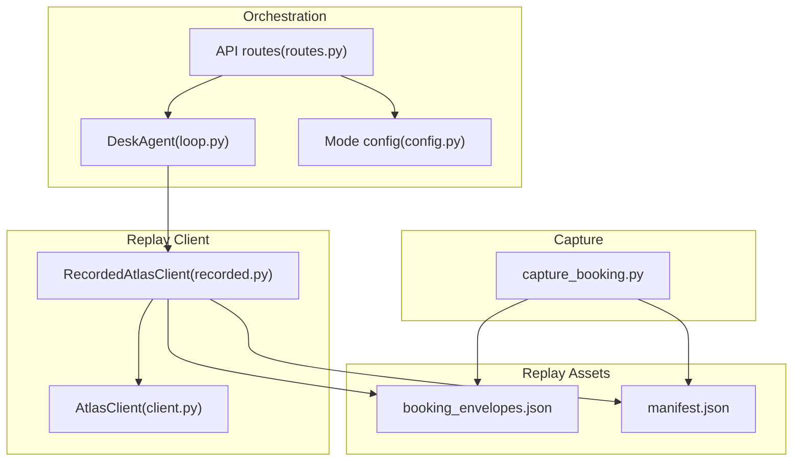
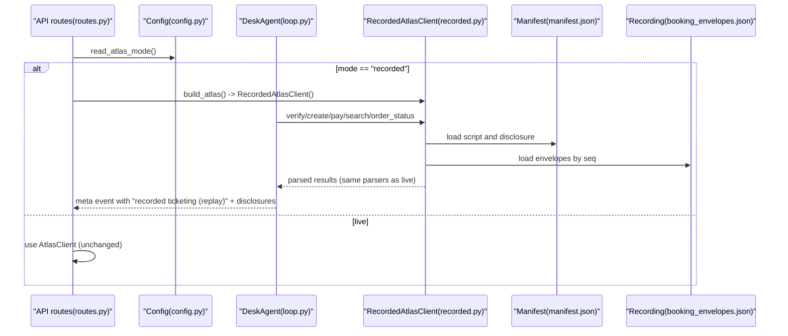
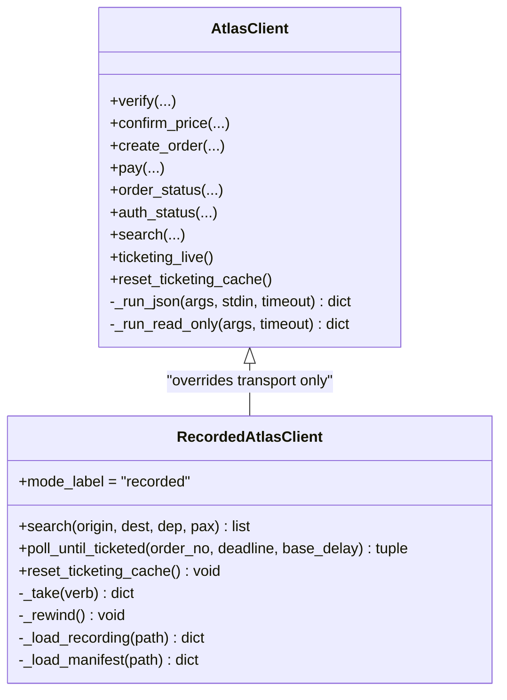
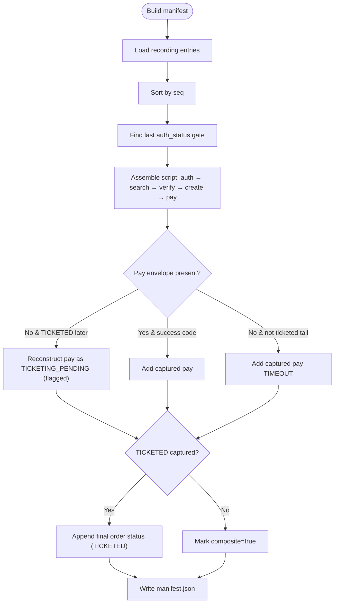
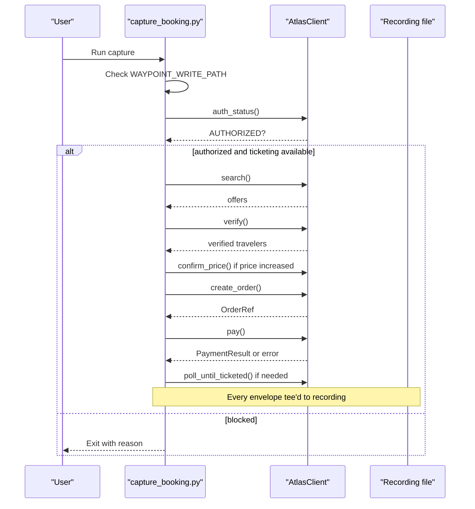
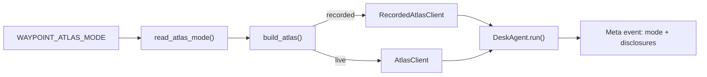
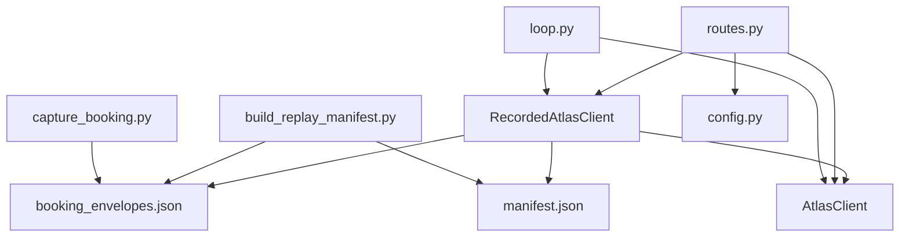

# Recorded Mode Engine

<cite>
**Referenced Files in This Document**
- [recorded.py](file://backend/app/atlas/recorded.py)
- [manifest.json](file://backend/data/recorded/manifest.json)
- [build_replay_manifest.py](file://backend/scripts/build_replay_manifest.py)
- [capture_booking.py](file://backend/scripts/capture_booking.py)
- [10-s9-recorded-mode.md](file://docs/plans/waypoint/10-s9-recorded-mode.md)
- [test_recorded_mode.py](file://backend/tests/test_recorded_mode.py)
- [test_recorded_determinism.py](file://backend/tests/test_recorded_determinism.py)
- [client.py](file://backend/app/atlas/client.py)
- [config.py](file://backend/app/atlas/config.py)
- [routes.py](file://backend/app/api/routes.py)
- [loop.py](file://backend/app/agent/loop.py)
</cite>

## Table of Contents
1. [Introduction](#introduction)
2. [Project Structure](#project-structure)
3. [Core Components](#core-components)
4. [Architecture Overview](#architecture-overview)
5. [Detailed Component Analysis](#detailed-component-analysis)
6. [Dependency Analysis](#dependency-analysis)
7. [Performance Considerations](#performance-considerations)
8. [Troubleshooting Guide](#troubleshooting-guide)
9. [Conclusion](#conclusion)
10. [Appendices](#appendices)

## Introduction
The Recorded Mode Engine provides a deterministic, sandbox-independent replay rail for the Atlas ticketing subsystem. It captures live CLI envelopes during a real booking run and replays them with strict honesty guarantees: no fabricated TICKETED envelopes, no subprocesses, no clock or randomness, and explicit wire disclosures about composite recordings. The engine is selected via a strict environment switch and integrates into the existing desk orchestration loop without altering the live transport code.

## Project Structure
Recorded mode spans capture tooling, replay client, manifest generation, configuration, API wiring, and tests. Key locations:
- Replay client: backend/app/atlas/recorded.py
- Manifest (honesty register): backend/data/recorded/manifest.json
- Capture script: backend/scripts/capture_booking.py
- Manifest builder: backend/scripts/build_replay_manifest.py
- Mode config: backend/app/atlas/config.py
- API seam: backend/app/api/routes.py
- Orchestration loop: backend/app/agent/loop.py
- Live client base: backend/app/atlas/client.py
- Tests: backend/tests/test_recorded_mode.py, backend/tests/test_recorded_determinism.py
- Plan and ADRs: docs/plans/waypoint/10-s9-recorded-mode.md, docs/adr/0005-recorded-atlas-replay-mode.md

**Diagram sources**
- [capture_booking.py:1-384](file://backend/scripts/capture_booking.py#L1-L384)
- [recorded.py:1-235](file://backend/app/atlas/recorded.py#L1-L235)
- [client.py:1-200](file://backend/app/atlas/client.py#L1-L200)
- [config.py:1-38](file://backend/app/atlas/config.py#L1-L38)
- [routes.py:97-113](file://backend/app/api/routes.py#L97-L113)
- [loop.py:153-200](file://backend/app/agent/loop.py#L153-L200)

**Section sources**
- [10-s9-recorded-mode.md:1-72](file://docs/plans/waypoint/10-s9-recorded-mode.md#L1-L72)
- [recorded.py:1-235](file://backend/app/atlas/recorded.py#L1-L235)
- [manifest.json:1-264](file://backend/data/recorded/manifest.json#L1-L264)

## Core Components
- RecordedAtlasClient: Subclass of AtlasClient that overrides only transport methods to serve recorded envelopes deterministically. Enforces fail-closed behavior on unscripted calls and rewinds per cycle.
- Manifest: JSON honesty register describing which steps are served, provenance (captured vs reconstructed), and wire disclosure.
- Capture script: Tees every raw envelope from a live booking run into a JSON-lines file; includes double-gate safety checks before capturing writes.
- Manifest builder: Derives the replay script from the latest captured run, flags reconstructed pay when justified by later TICKETED status, and writes manifest metadata.
- Mode config: Strict parse of WAYPOINT_ATLAS_MODE to select recorded vs live.
- API seam: build_atlas() selects RecordedAtlasClient when configured.
- Loop integration: Uses getattr-based reset_ticketing_cache hook to rewind cursers and sets wire label to “recorded ticketing (replay)” with disclosures.

**Section sources**
- [recorded.py:65-235](file://backend/app/atlas/recorded.py#L65-L235)
- [manifest.json:1-264](file://backend/data/recorded/manifest.json#L1-L264)
- [capture_booking.py:77-189](file://backend/scripts/capture_booking.py#L77-L189)
- [build_replay_manifest.py:59-205](file://backend/scripts/build_replay_manifest.py#L59-L205)
- [config.py:28-38](file://backend/app/atlas/config.py#L28-L38)
- [routes.py:97-113](file://backend/app/api/routes.py#L97-L113)
- [loop.py:183-200](file://backend/app/agent/loop.py#L183-L200)

## Architecture Overview
The Recorded Mode Engine replaces the live transport layer with a deterministic replay path while preserving all parsing and business logic. The flow:
- Configuration selects RecordedAtlasClient based on an environment variable.
- The API constructs the agent with the selected Atlas client.
- During a desk cycle, the agent invokes Atlas methods; RecordedAtlasClient serves envelopes from the manifest/script in order.
- The manifest’s wire disclosure is emitted on the meta event to indicate replay mode and composite state.
- No subprocesses, clocks, or randomness are used in replay.

**Diagram sources**
- [config.py:28-38](file://backend/app/atlas/config.py#L28-L38)
- [routes.py:97-113](file://backend/app/api/routes.py#L97-L113)
- [recorded.py:79-120](file://backend/app/atlas/recorded.py#L79-L120)
- [manifest.json:1-264](file://backend/data/recorded/manifest.json#L1-L264)
- [loop.py:183-200](file://backend/app/agent/loop.py#L183-L200)

## Detailed Component Analysis

### RecordedAtlasClient
Overrides only transport to serve recorded envelopes deterministically. Matching uses normalized verb plus sequence index from the manifest script. Unmatched calls raise a typed NO_RECORDING error. Two control overrides ensure replay hygiene:
- reset_ticketing_cache: rewinds per-cycle cursor so each desk cycle replays identically.
- poll_until_ticketed: iterates through scripted order status envelopes until TICKETED; never sleeps or touches time.

**Diagram sources**
- [recorded.py:65-235](file://backend/app/atlas/recorded.py#L65-L235)
- [client.py:1-200](file://backend/app/atlas/client.py#L1-L200)

**Section sources**
- [recorded.py:65-235](file://backend/app/atlas/recorded.py#L65-L235)
- [test_recorded_mode.py:71-114](file://backend/tests/test_recorded_mode.py#L71-L114)
- [test_recorded_mode.py:149-169](file://backend/tests/test_recorded_mode.py#L149-L169)

### Manifest and Recording
- Recording: JSON-lines file of raw envelopes captured live, each with seq, step, cmd, envelope, captured_at.
- Manifest: Honesty register listing the replay script, provenance, reconstructed steps, and wire disclosure. Builder ensures no fabricated TICKETED envelopes; reconstruction only occurs when justified by later captured state.

**Diagram sources**
- [build_replay_manifest.py:59-205](file://backend/scripts/build_replay_manifest.py#L59-L205)
- [manifest.json:1-264](file://backend/data/recorded/manifest.json#L1-L264)

**Section sources**
- [build_replay_manifest.py:59-205](file://backend/scripts/build_replay_manifest.py#L59-L205)
- [manifest.json:1-264](file://backend/data/recorded/manifest.json#L1-L264)

### Capture Script
Captures a full booking run against the live sandbox, teeing every envelope before any parse decision. Includes double-gate safety:
- Explicit human intent flag required to arm write-path capture.
- Authorization and ticketing availability checks before proceeding.

**Diagram sources**
- [capture_booking.py:77-189](file://backend/scripts/capture_booking.py#L77-L189)
- [capture_booking.py:232-384](file://backend/scripts/capture_booking.py#L232-L384)

**Section sources**
- [capture_booking.py:77-189](file://backend/scripts/capture_booking.py#L77-L189)
- [capture_booking.py:232-384](file://backend/scripts/capture_booking.py#L232-L384)

### Integration Points
- Mode selection: read_atlas_mode() strictly parses WAYPOINT_ATLAS_MODE; only exact "recorded" enables replay.
- API seam: build_atlas() returns RecordedAtlasClient when configured; otherwise returns live AtlasClient.
- Loop integration: DeskAgent resets replay cache per cycle and emits meta events with recorded mode label and disclosures.

**Diagram sources**
- [config.py:28-38](file://backend/app/atlas/config.py#L28-L38)
- [routes.py:97-113](file://backend/app/api/routes.py#L97-L113)
- [loop.py:183-200](file://backend/app/agent/loop.py#L183-L200)

**Section sources**
- [config.py:28-38](file://backend/app/atlas/config.py#L28-L38)
- [routes.py:97-113](file://backend/app/api/routes.py#L97-L113)
- [loop.py:183-200](file://backend/app/agent/loop.py#L183-L200)

## Dependency Analysis
- RecordedAtlasClient depends on:
  - AtlasClient (inheritance for parsing and business logic)
  - Manifest and recording files for data
  - Models for OrderStatus and related types
- Manifest builder depends on recording file and outputs manifest.json
- Capture script depends on AtlasClient and writes recording file
- API routes depend on config to select client
- Loop depends on client interface and optional reset_ticketing_cache hook

**Diagram sources**
- [recorded.py:1-235](file://backend/app/atlas/recorded.py#L1-L235)
- [build_replay_manifest.py:1-210](file://backend/scripts/build_replay_manifest.py#L1-L210)
- [capture_booking.py:1-384](file://backend/scripts/capture_booking.py#L1-L384)
- [routes.py:97-113](file://backend/app/api/routes.py#L97-L113)
- [config.py:28-38](file://backend/app/atlas/config.py#L28-L38)
- [loop.py:183-200](file://backend/app/agent/loop.py#L183-L200)

**Section sources**
- [recorded.py:1-235](file://backend/app/atlas/recorded.py#L1-L235)
- [build_replay_manifest.py:1-210](file://backend/scripts/build_replay_manifest.py#L1-L210)
- [capture_booking.py:1-384](file://backend/scripts/capture_booking.py#L1-L384)
- [routes.py:97-113](file://backend/app/api/routes.py#L97-L113)
- [config.py:28-38](file://backend/app/atlas/config.py#L28-L38)
- [loop.py:183-200](file://backend/app/agent/loop.py#L183-L200)

## Performance Considerations
- Deterministic replay eliminates network latency and subprocess overhead; performance is bounded by file I/O and Python parsing.
- Per-cycle rewind ensures consistent replay cost across cycles.
- Search and write paths reuse inherited parsers, avoiding duplicated logic and ensuring predictable performance characteristics.

[No sources needed since this section provides general guidance]

## Troubleshooting Guide
Common issues and resolutions:
- Missing or malformed recording/manifest: RecordedAtlasClient construction raises NO_RECORDING; ensure both files exist and are valid.
- Unscripted call during replay: Raises NO_RECORDING; verify the manifest script covers the expected verb sequence.
- Composite recording without TICKETED: The replay ends honestly with the captured state; do not expect a TICKETED envelope unless captured.
- Time-related failures in polling: Recorded poll_until_ticketed does not sleep or use time; exhaustion leads to NO_RECORDING if the script ends before TICKETED.
- Subprocess tripwires: Tests assert zero subprocess spawns in recorded mode; if subprocess calls occur, ensure RecordedAtlasClient is selected and no live path is invoked.

**Section sources**
- [test_recorded_mode.py:171-189](file://backend/tests/test_recorded_mode.py#L171-L189)
- [test_recorded_mode.py:134-147](file://backend/tests/test_recorded_mode.py#L134-L147)
- [test_recorded_mode.py:149-169](file://backend/tests/test_recorded_mode.py#L149-L169)
- [test_recorded_mode.py:191-210](file://backend/tests/test_recorded_mode.py#L191-L210)

## Conclusion
The Recorded Mode Engine delivers a robust, deterministic replay capability for the Atlas ticketing subsystem. It preserves all parsing and business logic while replacing transport with recorded envelopes, enforcing strict honesty rules, and providing clear wire disclosures. The design minimizes risk by failing closed on missing artifacts or unscripted calls and ensures reproducibility across cycles.

[No sources needed since this section summarizes without analyzing specific files]

## Appendices

### Running Recorded Mode
- Set environment variables to enable recorded mode and allow comparison-mode execution where appropriate.
- Seed a desk and stream events to observe the recorded cycle.

**Section sources**
- [10-s9-recorded-mode.md:63-72](file://docs/plans/waypoint/10-s9-recorded-mode.md#L63-L72)

### Test Evidence
- Unit tests validate strict mode parsing, identical parsing through live parsers, fail-closed behavior, contract drift guard, and determinism across two cycles.

**Section sources**
- [test_recorded_mode.py:41-64](file://backend/tests/test_recorded_mode.py#L41-L64)
- [test_recorded_mode.py:71-114](file://backend/tests/test_recorded_mode.py#L71-L114)
- [test_recorded_mode.py:134-147](file://backend/tests/test_recorded_mode.py#L134-L147)
- [test_recorded_mode.py:191-210](file://backend/tests/test_recorded_mode.py#L191-L210)
- [test_recorded_determinism.py:153-184](file://backend/tests/test_recorded_determinism.py#L153-L184)