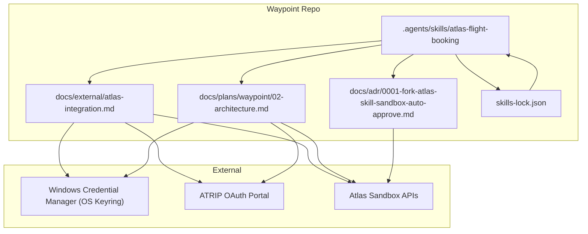
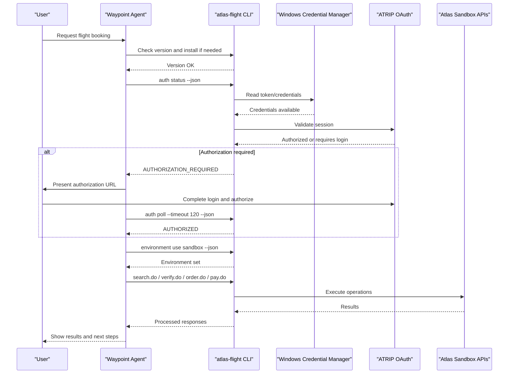
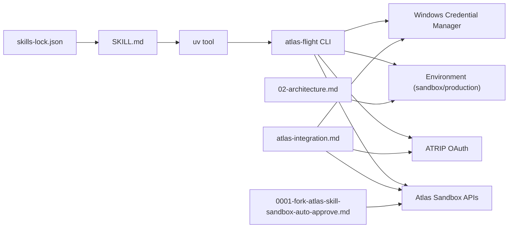

# Sandbox Configuration

<cite>
**Referenced Files in This Document**
- [SKILL.md](file://.agents/skills/atlas-flight-booking/SKILL.md)
- [cli-contract.md](file://.agents/skills/atlas-flight-booking/references/cli-contract.md)
- [error-handling.md](file://.agents/skills/atlas-flight-booking/references/error-handling.md)
- [atlas-integration.md](file://docs/external/atlas-integration.md)
- [02-architecture.md](file://docs/plans/waypoint/02-architecture.md)
- [0001-fork-atlas-skill-sandbox-auto-approve.md](file://docs/adr/0001-fork-atlas-skill-sandbox-auto-approve.md)
- [skills-lock.json](file://skills-lock.json)
</cite>

## Table of Contents
1. [Introduction](#introduction)
2. [Project Structure](#project-structure)
3. [Core Components](#core-components)
4. [Architecture Overview](#architecture-overview)
5. [Detailed Component Analysis](#detailed-component-analysis)
6. [Dependency Analysis](#dependency-analysis)
7. [Performance Considerations](#performance-considerations)
8. [Troubleshooting Guide](#troubleshooting-guide)
9. [Conclusion](#conclusion)

## Introduction
This document provides step-by-step sandbox configuration for Atlas Flight Booking integration within the Waypoint project. It covers OS keyring authentication on Windows Credential Manager, environment variable usage, skill installation via uv, and the forked Atlas Skill behavior that auto-approves price increases and payments only in sandbox mode. It also explains how to switch between sandbox and production using atlas-flight commands, configure ATRIP OAuth, set up access keys in the ATRIP profile, and verify connectivity. Finally, it addresses common configuration issues and troubleshooting steps for authentication failures.

## Project Structure
The repository centralizes Atlas Flight Booking configuration and operational guidance under:
- .agents/skills/atlas-flight-booking: SKILL.md and references defining CLI contract, error handling, and workflow rules
- docs/external/atlas-integration.md: External integration notes including auth model, environment switching, and API surface
- docs/plans/waypoint/02-architecture.md: Architecture overview noting external services and environment variables
- docs/adr/0001-fork-atlas-skill-sandbox-auto-approve.md: Decision to fork the skill for sandbox-only auto-approval
- skills-lock.json: Locks the Qoder skill source and version used by this repo

**Diagram sources**
- [SKILL.md:26-36](file://.agents/skills/atlas-flight-booking/SKILL.md#L26-L36)
- [cli-contract.md:9-17](file://.agents/skills/atlas-flight-booking/references/cli-contract.md#L9-L17)
- [atlas-integration.md:5-13](file://docs/external/atlas-integration.md#L5-L13)
- [02-architecture.md:51-55](file://docs/plans/waypoint/02-architecture.md#L51-L55)
- [0001-fork-atlas-skill-sandbox-auto-approve.md:11-19](file://docs/adr/0001-fork-atlas-skill-sandbox-auto-approve.md#L11-L19)
- [skills-lock.json:1-11](file://skills-lock.json#L1-L11)

**Section sources**
- [SKILL.md:26-36](file://.agents/skills/atlas-flight-booking/SKILL.md#L26-L36)
- [cli-contract.md:9-17](file://.agents/skills/atlas-flight-booking/references/cli-contract.md#L9-L17)
- [atlas-integration.md:5-13](file://docs/external/atlas-integration.md#L5-L13)
- [02-architecture.md:51-55](file://docs/plans/waypoint/02-architecture.md#L51-L55)
- [0001-fork-atlas-skill-sandbox-auto-approve.md:11-19](file://docs/adr/0001-fork-atlas-skill-sandbox-auto-approve.md#L11-L19)
- [skills-lock.json:1-11](file://skills-lock.json#L1-L11)

## Core Components
- Atlas Flight Booking CLI (atlas-flight): Installed as a uv tool; minimum supported version is pinned in the SKILL. The SKILL enforces bootstrapping uv if missing and installing the exact tool version.
- OS Keyring (Windows Credential Manager): Stores ATRIP OAuth tokens and credentials securely; no secrets are stored in environment variables or code.
- Environment Switching: Use atlas-flight environment commands to toggle between sandbox and production; always start a fresh search after switching.
- Forked Skill Behavior: Auto-approve price increase and payment only when environment equals sandbox; production retains human checkpoints.
- Error Handling: Branch on stable response codes from the CLI; handle authorization states and ticketing blockers per reference contracts.

**Section sources**
- [SKILL.md:26-36](file://.agents/skills/atlas-flight-booking/SKILL.md#L26-L36)
- [atlas-integration.md:10-13](file://docs/external/atlas-integration.md#L10-L13)
- [0001-fork-atlas-skill-sandbox-auto-approve.md:11-19](file://docs/adr/0001-fork-atlas-skill-sandbox-auto-approve.md#L11-L19)
- [error-handling.md:7-17](file://.agents/skills/atlas-flight-booking/references/error-handling.md#L7-L17)

## Architecture Overview
The sandbox flow integrates the Waypoint agent with the Atlas Flight Booking CLI through secure OS keyring-backed authentication and environment-aware execution.

**Diagram sources**
- [SKILL.md:26-36](file://.agents/skills/atlas-flight-booking/SKILL.md#L26-L36)
- [cli-contract.md:9-17](file://.agents/skills/atlas-flight-booking/references/cli-contract.md#L9-L17)
- [atlas-integration.md:10-13](file://docs/external/atlas-integration.md#L10-L13)

## Detailed Component Analysis

### OS Keyring Authentication Setup (Windows Credential Manager)
- Purpose: Store ATRIP OAuth tokens and credentials securely in the OS keyring so they are not exposed in environment variables or code.
- Steps:
  - Ensure you have an ATRIP account and can sign in via browser-based OAuth.
  - Run atlas-flight auth login to initiate browser-based authorization; the CLI will store tokens in Windows Credential Manager.
  - Verify authorization status using atlas-flight auth status.
  - If authorization is required, follow the provided authorization URL and complete sign-in/authorization. After completion, poll once to confirm AUTHORIZED before proceeding.
- Notes:
  - Do not paste secret values into environment variables or documentation.
  - On authorization errors, re-run login and ensure the correct ATRIP profile is active.

**Section sources**
- [cli-contract.md:9-17](file://.agents/skills/atlas-flight-booking/references/cli-contract.md#L9-L17)
- [error-handling.md:7-17](file://.agents/skills/atlas-flight-booking/references/error-handling.md#L7-L17)
- [atlas-integration.md:10-13](file://docs/external/atlas-integration.md#L10-L13)

### Environment Variable Configuration
- Atlas-related secrets are not stored in environment variables; they live in the OS keyring.
- Other services may require environment variables:
  - DashScope API key name: DASHSCOPE_API_KEY
  - Public callback URL for webhooks: WAYPOINT_PUBLIC_URL
- These variables are referenced in architecture notes and should be configured outside the repository.

**Section sources**
- [02-architecture.md:51-55](file://docs/plans/waypoint/02-architecture.md#L51-L55)
- [atlas-integration.md:10-13](file://docs/external/atlas-integration.md#L10-L13)

### Skill Installation via uv Tool
- Minimum supported CLI version is enforced; the SKILL instructs automatic detection and installation of uv if missing, then installs atlas-flight-booking at the pinned version.
- Steps:
  - Detect uv availability; if missing, run the official installer for your OS.
  - Install the tool with the pinned version using uv tool install.
  - Confirm the installed version meets the minimum requirement.
  - If installation fails, consult the official uv installation documentation.

**Section sources**
- [SKILL.md:26-36](file://.agents/skills/atlas-flight-booking/SKILL.md#L26-L36)

### Forked Atlas Skill: Sandbox Auto-Approval
- Decision: Fork the open-source skill to allow auto-approval of price increases and payments only when the environment is sandbox. Production remains unchanged with human checkpoints.
- Implications:
  - Enables autonomous fare-difference settlement in sandbox without real charges.
  - Safety boundary: auto-approval is strictly gated on sandbox environment.
  - The fork exposes a thin library API for backend calls while preserving typed models.

**Section sources**
- [0001-fork-atlas-skill-sandbox-auto-approve.md:11-19](file://docs/adr/0001-fork-atlas-skill-sandbox-auto-approve.md#L11-L19)

### Environment Switching Between Sandbox and Production
- Use atlas-flight environment commands to switch environments.
- Always start a fresh search after switching; do not reuse offers from the previous environment.
- Commands:
  - Set sandbox: atlas-flight environment use sandbox --json
  - Set production: atlas-flight environment use production --json

**Section sources**
- [atlas-integration.md:10-13](file://docs/external/atlas-integration.md#L10-L13)

### ATRIP OAuth Authentication and Access Keys
- Auth Flow:
  - Initiate browser-based OAuth via atlas-flight auth login.
  - Complete sign-in and authorization in the browser.
  - Poll once to confirm AUTHORIZED before continuing.
- Access Keys:
  - Sandbox access key id is managed in the ATRIP profile (AK/SK tab).
  - Secret key remains in the OS keyring; never paste it anywhere.
- Verification:
  - Use atlas-flight auth status to check authorization state.
  - Use atlas-flight doctor to diagnose readiness.

**Section sources**
- [cli-contract.md:9-17](file://.agents/skills/atlas-flight-booking/references/cli-contract.md#L9-L17)
- [atlas-integration.md:10-13](file://docs/external/atlas-integration.md#L10-L13)

### Verifying the Connection
- Pre-flight checks:
  - Confirm uv and atlas-flight are installed and meet version requirements.
  - Ensure authorization is complete (AUTHORIZED).
  - Confirm environment is set to sandbox for testing.
- Operational checks:
  - Run a search and verify current-price offers.
  - Proceed to verify and order flows only when authorized and environment is correct.
  - For webhook callbacks, ensure public URL is registered and reachable.

**Section sources**
- [cli-contract.md:9-17](file://.agents/skills/atlas-flight-booking/references/cli-contract.md#L9-L17)
- [atlas-integration.md:15-21](file://docs/external/atlas-integration.md#L15-L21)
- [02-architecture.md:51-55](file://docs/plans/waypoint/02-architecture.md#L51-L55)

## Dependency Analysis
The following diagram shows how components depend on each other during setup and runtime.

**Diagram sources**
- [SKILL.md:26-36](file://.agents/skills/atlas-flight-booking/SKILL.md#L26-L36)
- [cli-contract.md:9-17](file://.agents/skills/atlas-flight-booking/references/cli-contract.md#L9-L17)
- [atlas-integration.md:10-13](file://docs/external/atlas-integration.md#L10-L13)
- [02-architecture.md:51-55](file://docs/plans/waypoint/02-architecture.md#L51-L55)
- [0001-fork-atlas-skill-sandbox-auto-approve.md:11-19](file://docs/adr/0001-fork-atlas-skill-sandbox-auto-approve.md#L11-L19)
- [skills-lock.json:1-11](file://skills-lock.json#L1-L11)

**Section sources**
- [SKILL.md:26-36](file://.agents/skills/atlas-flight-booking/SKILL.md#L26-L36)
- [cli-contract.md:9-17](file://.agents/skills/atlas-flight-booking/references/cli-contract.md#L9-L17)
- [atlas-integration.md:10-13](file://docs/external/atlas-integration.md#L10-L13)
- [02-architecture.md:51-55](file://docs/plans/waypoint/02-architecture.md#L51-L55)
- [0001-fork-atlas-skill-sandbox-auto-approve.md:11-19](file://docs/adr/0001-fork-atlas-skill-sandbox-auto-approve.md#L11-L19)
- [skills-lock.json:1-11](file://skills-lock.json#L1-L11)

## Performance Considerations
- Avoid reusing offers across environment switches; always start a fresh search after changing environments.
- Limit polling to bounded intervals; do not implement automatic polling loops for authorization.
- Prefer read-only retries where allowed; avoid retrying side-effecting operations like order creation or payment.

[No sources needed since this section provides general guidance]

## Troubleshooting Guide
Common issues and resolutions:

- Authorization Required:
  - Symptom: CLI returns AUTHORIZATION_REQUIRED.
  - Resolution: Run atlas-flight auth login, present the authorization URL to the user, and poll once after confirmation to resume.

- Authorization Pending:
  - Symptom: CLI returns AUTH_PENDING.
  - Resolution: Wait for user confirmation that authorization is complete; poll again only after explicit confirmation.

- Subscription or Ticketing Blockers:
  - Symptom: SUBSCRIPTION_REQUIRED with details.ticketing_blocker indicating TOP_UP_REQUIRED or TICKETING_ACTIVATION_REQUIRED.
  - Resolution: Explain availability constraints; direct the user to the ATRIP portal link returned in the response; wait for completion before retrying.

- Secure Store Unavailable:
  - Symptom: SECURE_STORE_UNAVAILABLE.
  - Resolution: Report that secure local storage is unavailable and stop; ensure OS keyring is accessible.

- Credential Rejected:
  - Symptom: CREDENTIAL_REJECTED.
  - Resolution: Report the neutral CLI result and stop; recovery is exhausted.

- Payment Issues:
  - Symptom: PAYMENT_BALANCE_CHECK_REQUIRED or related payment codes.
  - Resolution: Explain insufficient balance or payment method issues; show order link when returned; do not retry payment.

- Environment Mismatch:
  - Symptom: Unexpected behavior after switching environments.
  - Resolution: Re-run environment command to set sandbox or production; start a fresh search; do not reuse prior offers.

**Section sources**
- [error-handling.md:7-17](file://.agents/skills/atlas-flight-booking/references/error-handling.md#L7-L17)
- [error-handling.md:44-63](file://.agents/skills/atlas-flight-booking/references/error-handling.md#L44-L63)
- [cli-contract.md:9-17](file://.agents/skills/atlas-flight-booking/references/cli-contract.md#L9-L17)
- [atlas-integration.md:10-13](file://docs/external/atlas-integration.md#L10-L13)

## Conclusion
This guide outlines the complete sandbox configuration for Atlas Flight Booking integration in Waypoint. By leveraging OS keyring-backed authentication, enforcing environment-specific behavior, and following the forked skill’s sandbox-only auto-approval policy, you can reliably test end-to-end booking flows without real charges. Use the provided commands and references to install tooling, authenticate, switch environments, and troubleshoot common issues. Always validate authorization and environment settings before proceeding with searches, verifications, orders, and payments.

[No sources needed since this section summarizes without analyzing specific files]