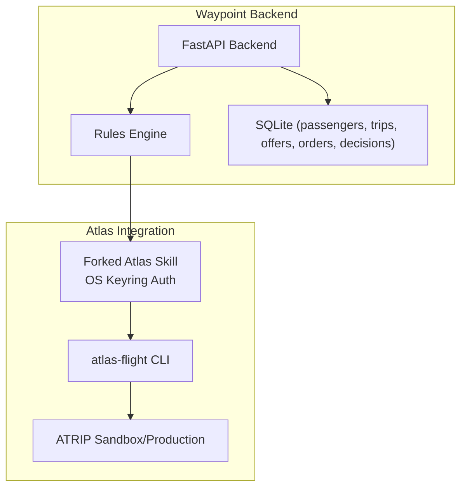
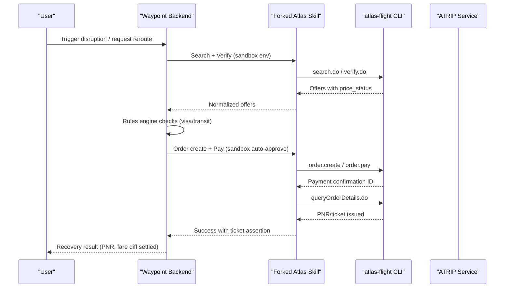
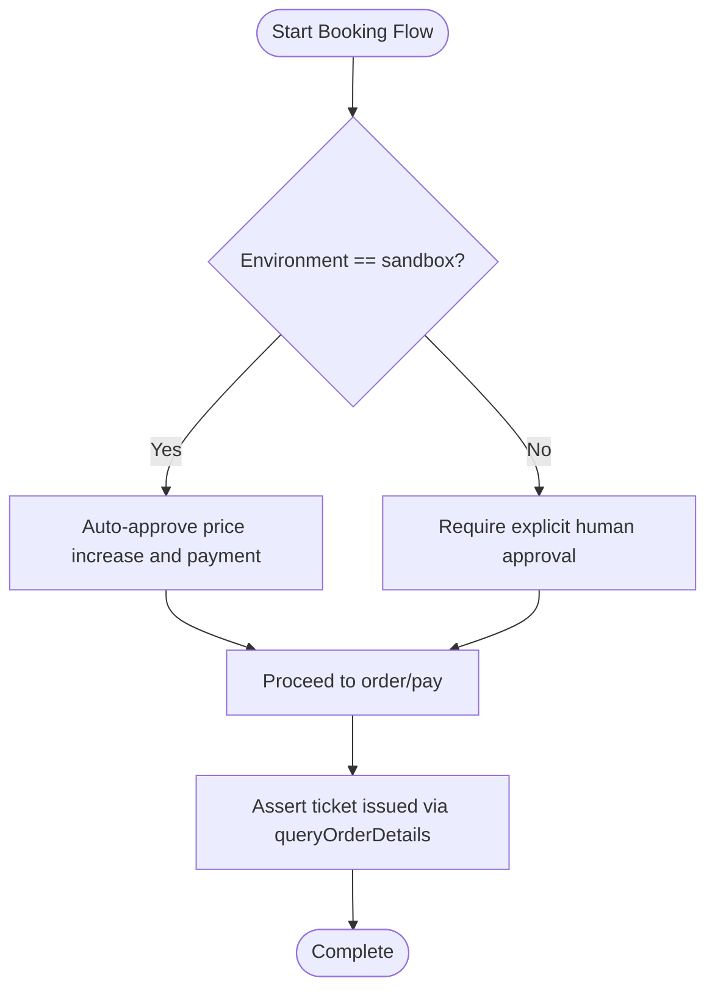
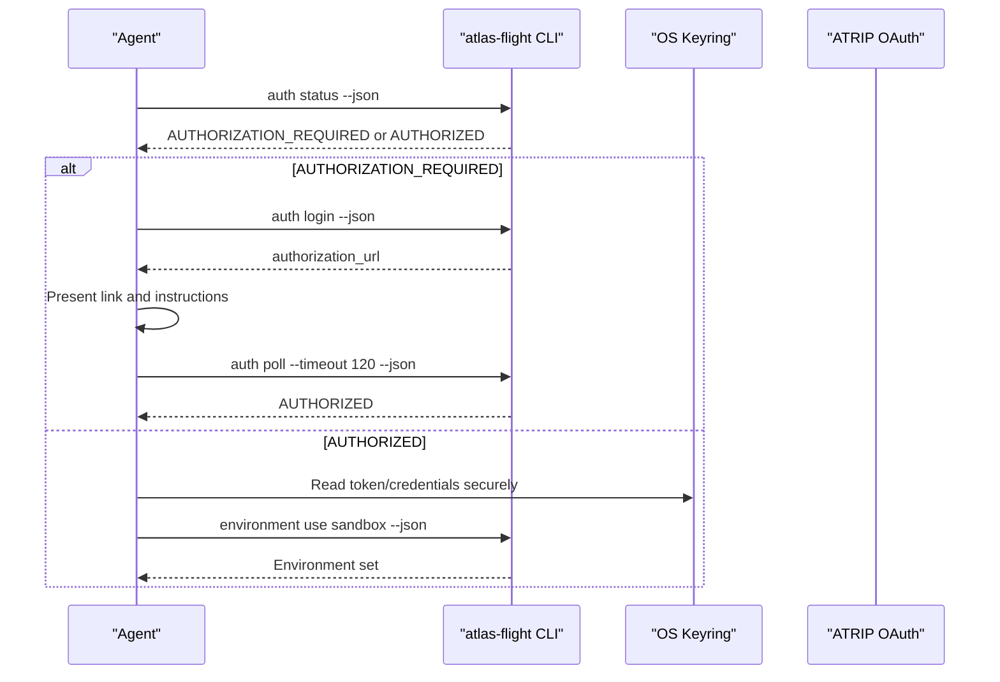
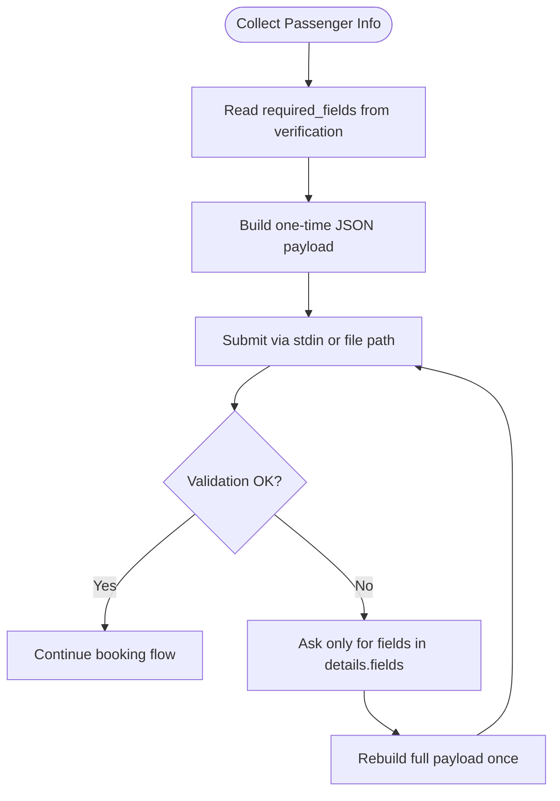
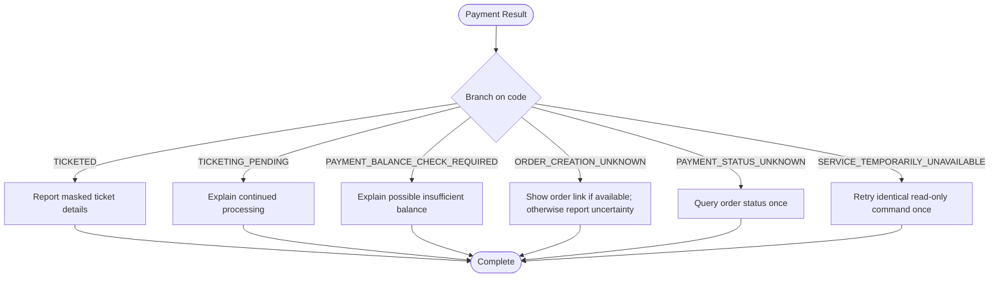
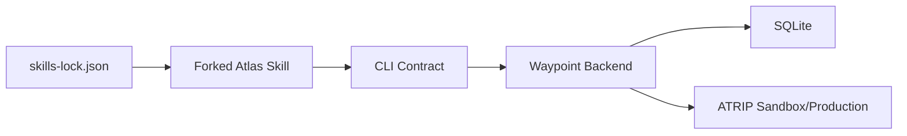

# Security & Production Deployment

<cite>
**Referenced Files in This Document**
- [0001-fork-atlas-skill-sandbox-auto-approve.md](file://docs/adr/0001-fork-atlas-skill-sandbox-auto-approve.md)
- [atlas-integration.md](file://docs/external/atlas-integration.md)
- [SKILL.md](file://.agents/skills/atlas-flight-booking/SKILL.md)
- [cli-contract.md](file://.agents/skills/atlas-flight-booking/references/cli-contract.md)
- [error-handling.md](file://.agents/skills/atlas-flight-booking/references/error-handling.md)
- [passenger-input.md](file://.agents/skills/atlas-flight-booking/references/passenger-input.md)
- [02-architecture.md](file://docs/plans/waypoint/02-architecture.md)
- [03-program-design.md](file://docs/plans/waypoint/03-program-design.md)
- [skills-lock.json](file://skills-lock.json)
</cite>

## Table of Contents
1. [Introduction](#introduction)
2. [Project Structure](#project-structure)
3. [Core Components](#core-components)
4. [Architecture Overview](#architecture-overview)
5. [Detailed Component Analysis](#detailed-component-analysis)
6. [Dependency Analysis](#dependency-analysis)
7. [Performance Considerations](#performance-considerations)
8. [Troubleshooting Guide](#troubleshooting-guide)
9. [Conclusion](#conclusion)
10. [Appendices](#appendices)

## Introduction
This document provides security-focused guidance for deploying Atlas integration with Waypoint, emphasizing the critical difference between sandbox and production environments. It explains that auto-approval is enabled only in sandbox mode and must never be used in production. It also covers secure handling of credentials stored in the OS keyring, separation of secrets from configuration, authentication best practices for ATRIP OAuth and access keys, compliance considerations for passenger data and financial transactions, a production deployment security checklist, and monitoring recommendations to detect unauthorized access or anomalous behavior.

## Project Structure
The repository organizes security-relevant information across:
- Architecture and program design documents describing how the backend integrates with the forked Atlas skill and where sensitive operations occur.
- External integration notes detailing environment switching, credential storage, and API surface.
- Skill contracts defining safe workflows, error handling, and strict rules around authorization, payment, and passenger data.
- ADRs documenting the decision to fork the skill and restrict auto-approval to sandbox.

**Diagram sources**
- [02-architecture.md:1-56](file://docs/plans/waypoint/02-architecture.md#L1-L56)
- [atlas-integration.md:1-37](file://docs/external/atlas-integration.md#L1-L37)

**Section sources**
- [02-architecture.md:1-56](file://docs/plans/waypoint/02-architecture.md#L1-L56)
- [atlas-integration.md:1-37](file://docs/external/atlas-integration.md#L1-L37)

## Core Components
- Forked Atlas Skill with sandbox-only auto-approval: The fork enables autonomous settlement of fare differences in sandbox by auto-approving price increases and payments, while production retains mandatory human checkpoints.
- Secure credential storage: Authentication tokens and secrets are stored in the OS keyring; they must never be placed in environment variables, code, or documentation.
- Strict CLI contract: All interactions go through the `atlas-flight` CLI with explicit commands, JSON envelopes, and branching on stable codes. No direct service calls or configuration inspection.
- Passenger data handling: One-time delivery via stdin or file path, no echoing or logging of personal data, and minimal collection based on required fields.
- Error handling: Normalized codes guide safe retries, idempotency, and terminal states without exposing internal causes.

**Section sources**
- [0001-fork-atlas-skill-sandbox-auto-approve.md:1-21](file://docs/adr/0001-fork-atlas-skill-sandbox-auto-approve.md#L1-L21)
- [atlas-integration.md:1-37](file://docs/external/atlas-integration.md#L1-L37)
- [cli-contract.md:1-79](file://.agents/skills/atlas-flight-booking/references/cli-contract.md#L1-L79)
- [passenger-input.md:1-52](file://.agents/skills/atlas-flight-booking/references/passenger-input.md#L1-L52)
- [error-handling.md:1-74](file://.agents/skills/atlas-flight-booking/references/error-handling.md#L1-L74)

## Architecture Overview
The backend orchestrates recovery using deterministic logic and a bounded agent loop. It integrates with the forked Atlas skill for search, verification, order creation, and payment. Authentication uses ATRIP OAuth via browser, with tokens and secrets stored in the OS keyring. Environment selection (sandbox vs production) is enforced at runtime, and auto-approval is restricted to sandbox.

**Diagram sources**
- [02-architecture.md:34-49](file://docs/plans/waypoint/02-architecture.md#L34-L49)
- [atlas-integration.md:15-21](file://docs/external/atlas-integration.md#L15-L21)
- [cli-contract.md:57-79](file://.agents/skills/atlas-flight-booking/references/cli-contract.md#L57-L79)

## Detailed Component Analysis

### Forked Atlas Skill: Sandbox Auto-Approval Safeguards
- Decision rationale: Autonomous settlement requires removing human checkpoints in sandbox only, because sandbox creates no real bookings or charges.
- Enforcement: Auto-approval is gated strictly on environment == sandbox; production always enforces human confirmation for price increases and payment.
- Maintenance: The fork is maintained separately; upstreaming a flag may be considered later.

**Diagram sources**
- [0001-fork-atlas-skill-sandbox-auto-approve.md:6-21](file://docs/adr/0001-fork-atlas-skill-sandbox-auto-approve.md#L6-L21)
- [02-architecture.md:43-45](file://docs/plans/waypoint/02-architecture.md#L43-L45)

**Section sources**
- [0001-fork-atlas-skill-sandbox-auto-approve.md:1-21](file://docs/adr/0001-fork-atlas-skill-sandbox-auto-approve.md#L1-L21)
- [02-architecture.md:1-56](file://docs/plans/waypoint/02-architecture.md#L1-L56)

### Authentication and Secrets Management
- ATRIP OAuth via browser: Tokens and credentials live in the OS keyring (e.g., Windows Credential Manager). They must never be placed in environment variables, code, or documentation.
- Access keys: Sandbox access key id resides in the ATRIP profile; secret key remains in the keyring and must not be pasted anywhere.
- Environment switching: Use the CLI to switch between sandbox and production; after switching, start a fresh search and do not reuse earlier offers.
- Authorization flow: Follow the CLI contract for login, polling, and resuming tasks only after authorized status.

**Diagram sources**
- [cli-contract.md:9-28](file://.agents/skills/atlas-flight-booking/references/cli-contract.md#L9-L28)
- [atlas-integration.md:10-13](file://docs/external/atlas-integration.md#L10-L13)

**Section sources**
- [cli-contract.md:1-79](file://.agents/skills/atlas-flight-booking/references/cli-contract.md#L1-L79)
- [atlas-integration.md:1-37](file://docs/external/atlas-integration.md#L1-L37)

### Passenger Data Handling and Compliance
- Collection rule: Ask only for required fields returned by verification; carry traveler IDs and passenger types from the response; do not invent IDs.
- One-time delivery: Prefer stdin for one-time payload submission; do not echo, save, log, or place personal values into shell history or command arguments.
- Payload shape: Construct a single JSON object with passengers and contact; preserve document numbers exactly; format mobile numbers consistently.
- Safe correction: On validation errors, read only the specific fields indicated, rebuild the full payload once, and submit again without repeating rejected personal data.

**Diagram sources**
- [passenger-input.md:1-52](file://.agents/skills/atlas-flight-booking/references/passenger-input.md#L1-L52)

**Section sources**
- [passenger-input.md:1-52](file://.agents/skills/atlas-flight-booking/references/passenger-input.md#L1-L52)

### Error Handling and Financial Safety
- Branch on stable codes: Never parse messages; treat retryable flags conservatively; avoid repeating side-effecting commands like order creation or payment.
- Terminal states: For unknown or processing states, query order status using the returned order number; do not pay again.
- Balance checks: When balance check is required, explain insufficient balance possibility and show order link when present; do not claim it is the only cause.
- Idempotency: Preserve IDs exactly; treat payment confirmation IDs as single-use; never reuse them.

**Diagram sources**
- [error-handling.md:44-74](file://.agents/skills/atlas-flight-booking/references/error-handling.md#L44-L74)

**Section sources**
- [error-handling.md:1-74](file://.agents/skills/atlas-flight-booking/references/error-handling.md#L1-L74)

## Dependency Analysis
The system depends on:
- The forked Atlas skill registered in skills-lock.json, ensuring version control and integrity.
- The CLI contract that defines exact commands and response envelope parsing.
- The architecture document that outlines backend endpoints, data schema, and external integrations.

**Diagram sources**
- [skills-lock.json:1-12](file://skills-lock.json#L1-L12)
- [cli-contract.md:1-79](file://.agents/skills/atlas-flight-booking/references/cli-contract.md#L1-L79)
- [02-architecture.md:1-56](file://docs/plans/waypoint/02-architecture.md#L1-L56)

**Section sources**
- [skills-lock.json:1-12](file://skills-lock.json#L1-L12)
- [cli-contract.md:1-79](file://.agents/skills/atlas-flight-booking/references/cli-contract.md#L1-L79)
- [02-architecture.md:1-56](file://docs/plans/waypoint/02-architecture.md#L1-L56)

## Performance Considerations
- Bounded agent loop: Limit steps to prevent infinite loops and ensure timely responses.
- Staleness guard: Re-read and verify offers immediately before booking to avoid stale pricing or availability.
- Outcome assertion: Confirm actual ticket issuance via queryOrderDetails before declaring success.
- Deterministic execution: Keep AI out of deterministic steps (fare math, order/pay execution) to reduce risk and penalties.

[No sources needed since this section provides general guidance]

## Troubleshooting Guide
Common issues and safe resolutions:
- Authorization required or pending: Follow the login flow, present the authorization URL, and resume only after authorized status.
- Secure store unavailable: Report that secure local storage is unavailable and stop; do not proceed without secure storage.
- Credential rejected: Report neutral CLI result and stop; recovery is exhausted.
- Payment balance check required: Explain possible insufficient balance and show order link when present; do not pay again.
- Unknown or processing states: Query order status using the returned order number; do not repeat payment or order creation.

**Section sources**
- [cli-contract.md:19-28](file://.agents/skills/atlas-flight-booking/references/cli-contract.md#L19-L28)
- [error-handling.md:7-17](file://.agents/skills/atlas-flight-booking/references/error-handling.md#L7-L17)
- [error-handling.md:44-74](file://.agents/skills/atlas-flight-booking/references/error-handling.md#L44-L74)

## Conclusion
Deploying Atlas integration securely requires strict separation of sandbox and production behaviors, especially regarding auto-approval. Credentials must remain in the OS keyring, and all interactions should follow the CLI contract with robust error handling. Passenger data must be handled minimally and safely. Compliance demands transparency about curated approximations and fail-closed defaults. A production deployment checklist and monitoring strategy are essential to maintain security and detect anomalies.

[No sources needed since this section summarizes without analyzing specific files]

## Appendices

### Production Deployment Security Checklist
- Enforce environment gating: Ensure auto-approval is disabled in production; only sandbox allows auto-approval.
- Validate environment switching: Always switch explicitly to production and start fresh searches; never reuse offers across environments.
- Protect secrets: Store tokens and keys exclusively in the OS keyring; remove any accidental exposure in env vars, logs, or docs.
- Restrict CLI usage: Use only documented commands; do not inspect configuration or call services directly.
- Enforce human checkpoints: Require explicit user approval for price increases and payments in production.
- Handle passenger data safely: Collect only required fields; deliver payloads via stdin or file paths; do not echo, save, or log personal data.
- Implement error handling: Branch on stable codes; avoid repeated side effects; query status for unknown or processing states.
- Assert outcomes: Confirm ticket issuance via queryOrderDetails before marking success.
- Audit and evidence: Persist rule verdicts, decisions, and orders for compliance and traceability.
- Monitor and alert: Track failed authorizations, unexpected environment switches, repeated payment attempts, and unusual offer patterns.

[No sources needed since this section provides general guidance]

### Monitoring Recommendations
- Detect unauthorized access: Alert on repeated AUTHORIZATION_REQUIRED or AUTH_EXPIRED events; monitor for unexpected environment changes.
- Anomalous behavior: Flag rapid repeated searches, multiple order creations, or payment attempts without verified offers.
- Compliance signals: Log rule verdicts and decisions; ensure fail-closed rejections are recorded and reviewed.
- Operational health: Monitor CLI connectivity, keyring access failures, and service unavailability; implement bounded retries.
- Webhook integrity: Validate incoming webhook payloads and source IPs; reject malformed or unexpected triggers.

[No sources needed since this section provides general guidance]