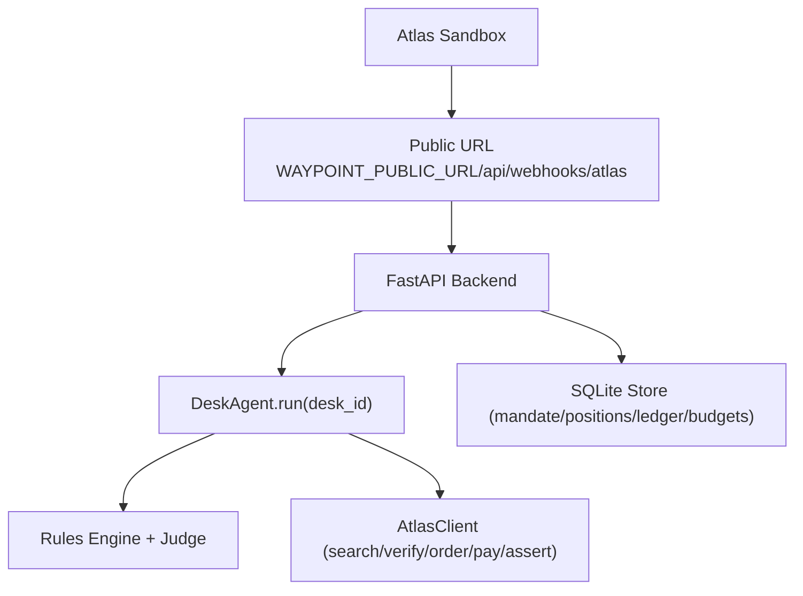
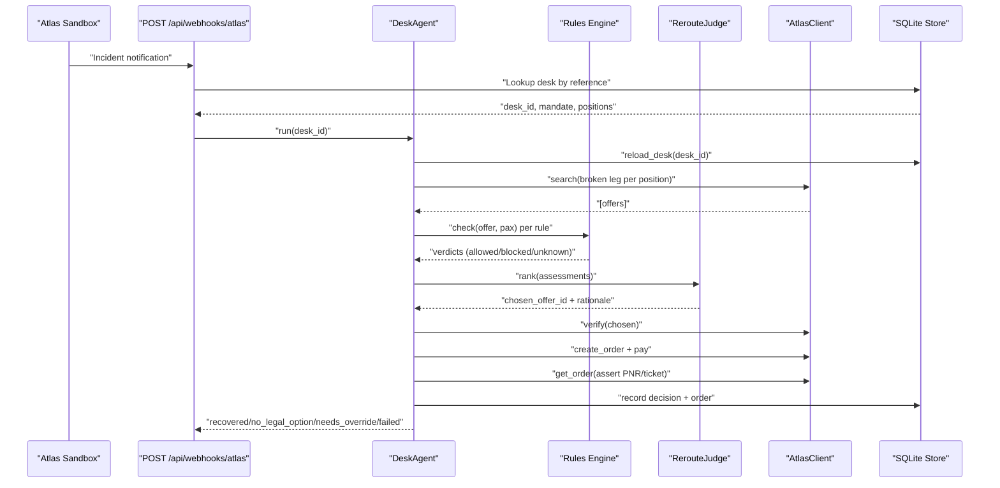
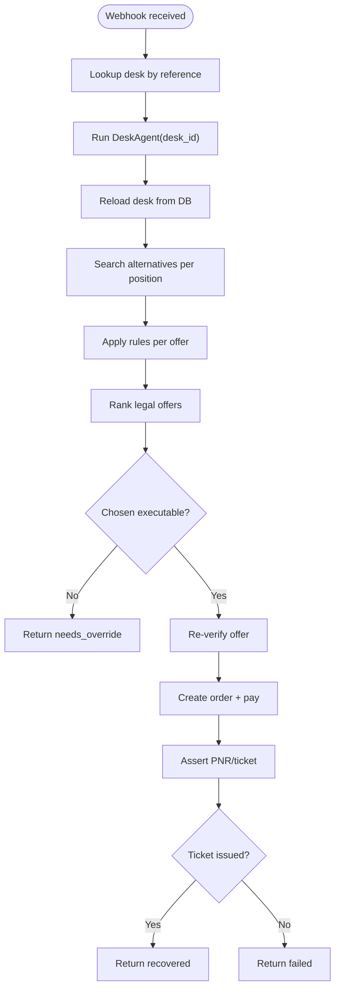
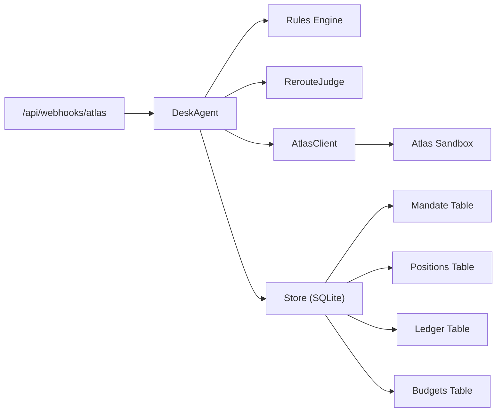

# Webhook & Incident Handling

<cite>
**Referenced Files in This Document**
- [02-architecture.md](file://docs/plans/waypoint/02-architecture.md)
- [03-program-design.md](file://docs/plans/waypoint/03-program-design.md)
- [atlas-integration.md](file://docs/external/atlas-integration.md)
- [routes.py](file://backend/app/api/routes.py)
- [loop.py](file://backend/app/agent/loop.py)
- [schema.py](file://backend/app/db/schema.py)
- [store.py](file://backend/app/db/store.py)
- [models.py](file://backend/app/models.py)
</cite>

## Update Summary
**Changes Made**
- Updated SSE event contract to reflect new desk-based architecture with enhanced event types (mark, trade, loss, alloc, reconcile, escalate, result)
- Revised webhook handling to support the new desk lifecycle and mandate-based processing
- Added documentation for the new database schema supporting desk operations
- Updated endpoint references from trip-based to desk-based architecture
- Enhanced error handling documentation aligned with desk-specific error codes

## Table of Contents
1. Introduction
2. Project Structure
3. Core Components
4. Architecture Overview
5. Detailed Component Analysis
6. Dependency Analysis
7. Performance Considerations
8. Troubleshooting Guide
9. Conclusion
10. Appendices

## Introduction
This document explains how Waypoint receives and processes Atlas incident notifications via webhooks to trigger automatic recovery workflows within the new desk-based architecture. It covers the webhook endpoint, configuration of callback URLs with Atlas, expected payload shape, supported event types including the enhanced SSE events (mark, trade, loss, alloc, reconcile, escalate, result), processing logic, security considerations, retry behavior, and error handling strategies grounded in the repository's design documents.

## Project Structure
Waypoint exposes a backend REST API that accepts both injected disruption events for testing and real Atlas incident webhooks. The preferred production trigger is a real Atlas webhook; an injected fallback endpoint exists for demo scenarios. The system now operates within a desk-based architecture where each desk represents a mandate with multiple positions.

**Diagram sources**
- [02-architecture.md:13-19](file://docs/plans/waypoint/02-architecture.md#L13-L19)
- [02-architecture.md:34-47](file://docs/plans/waypoint/02-architecture.md#L34-L47)
- [03-program-design.md:125-149](file://docs/plans/waypoint/03-program-design.md#L125-L149)

**Section sources**
- [02-architecture.md:13-19](file://docs/plans/waypoint/02-architecture.md#L13-L19)
- [02-architecture.md:34-47](file://docs/plans/waypoint/02-architecture.md#L34-L47)
- [03-program-design.md:125-149](file://docs/plans/waypoint/03-program-design.md#L125-L149)

## Core Components
- **Webhook endpoint**: POST /api/webhooks/atlas — receives real Atlas Incident/webhook and invokes the same recovery entrypoint as the injected disruption endpoint.
- **Desk agent**: DeskAgent.run(desk_id, emit) — orchestrates search, rule checks, judge ranking, verification, order creation, payment, and ticket assertion within the desk lifecycle.
- **Rules engine**: pluggable rules (e.g., transit visa, passport validity) with a fail-closed execute wall.
- **Atlas client**: wraps the forked skill library for search, verify, order, pay, and order status queries.
- **Persistence**: SQLite tables for mandate, positions, ledger, budgets supporting desk operations.

Key responsibilities:
- Accept and normalize incoming webhook payloads into desk identifiers and affected positions.
- Enforce guards: step budget, re-read before write, stale offer verification, outcome assertion.
- Emit live reasoning steps over SSE for UI visibility with enhanced event types.

**Section sources**
- [02-architecture.md:13-19](file://docs/plans/waypoint/02-architecture.md#L13-L19)
- [02-architecture.md:34-47](file://docs/plans/waypoint/02-architecture.md#L34-L47)
- [03-program-design.md:125-149](file://docs/plans/waypoint/03-program-design.md#L125-L149)

## Architecture Overview
The webhook flow integrates Atlas incident delivery with Waypoint's autonomous recovery loop within the desk-based architecture.

**Diagram sources**
- [02-architecture.md:34-47](file://docs/plans/waypoint/02-architecture.md#L34-L47)
- [03-program-design.md:125-149](file://docs/plans/waypoint/03-program-design.md#L125-L149)

## Detailed Component Analysis

### Webhook Endpoint and Configuration
- **Endpoint**: POST /api/webhooks/atlas
- **Purpose**: Receive real Atlas Incident/webhook and start recovery for the referenced desk.
- **Callback registration**: Register a public URL in ATRIP using the environment variable WAYPOINT_PUBLIC_URL. In development, use a tunnel to expose this URL publicly.
- **Preferred trigger**: Real Atlas webhook if sandbox supports it; otherwise, use the injected endpoint POST /api/disruptions for demos.

Configuration checklist:
- Ensure WAYPOINT_PUBLIC_URL points to a reachable host where /api/webhooks/atlas is exposed.
- Confirm ATRIP has "Webhook Notification" module enabled and the callback URL registered.
- Validate firewall/proxy allows inbound HTTPS to the webhook path.

**Section sources**
- [02-architecture.md:13-19](file://docs/plans/waypoint/02-architecture.md#L13-L19)
- [02-architecture.md:51-55](file://docs/plans/waypoint/02-architecture.md#L51-L55)
- [atlas-integration.md:15-21](file://docs/external/atlas-integration.md#L15-L21)
- [atlas-integration.md:26-32](file://docs/external/atlas-integration.md#L26-L32)

### Enhanced SSE Event Contract
The desk-based architecture introduces enhanced SSE event types for comprehensive workflow visibility:

| Event Type | Payload | Meaning |
|------------|---------|---------|
| `meta` | mandate + search meter (n/20) | Cycle start; the mandate card |
| `step` | index + narration | Ordered, idempotent-by-index reasoning step |
| `mark` | position_id, old/new price, search ref | Live reprice result (fan-out visible) |
| `trade` | position_id, book/hold, rationale | The discretionary timing call |
| `loss` | position_id, amount, note | Admitted loss ("held too long, −$62, threshold adjusted") |
| `alloc` | position_id, amount, seat ref or ledger_only | Savings → pre-order booking seat select (booking-stage, booking_id-bound); ledger-only entry on SEAT_UNAVAILABLE |
| `reconcile` | payment vs ledger, resolution | Auto-reconciliation incl. PRICE_CHANGED handling |
| `escalate` | esc_id, two priced options, recommendation | Mandate edge; waits for the human click |
| `result` | cycle P&L, losses, step_count | Terminal state of the cycle |
| `error` | normalized code only | Never raw message / HTTP status |

**Section sources**
- [02-architecture.md:43-55](file://docs/plans/waypoint/02-architecture.md#L43-L55)

### Expected Payload and Event Types
- **Current status**: The exact webhook payload shape from Atlas is not defined in this repository and is marked as unknown until a real incident fires. The injected endpoint serves as the guaranteed demo trigger.
- **Event types**: Not specified in this repository. Treat the webhook as a generic incident notification that identifies a desk and affected position(s).
- **Processing assumption**: Normalize the incoming payload to extract desk_id and affected positions, then invoke DeskAgent.run(desk_id).

Recommendation:
- Implement a schema validation layer at the endpoint boundary to accept only known fields and reject malformed payloads early.
- Log raw payloads for observability while masking sensitive data.

**Section sources**
- [03-program-design.md:173-179](file://docs/plans/waypoint/03-program-design.md#L173-L179)
- [02-architecture.md:13-19](file://docs/plans/waypoint/02-architecture.md#L13-L19)

### Processing Logic and Guards
The recovery loop enforces three critical guards within the desk architecture:
- **Step budget**: Limits agent steps to prevent runaway loops; on exceed, return a graceful give-up state.
- **Re-read before write**: Always reload desk state from the store before acting.
- **Stale offer verification**: Re-verify chosen offer live before booking; log old/new prices.
- **Outcome assertion**: Only mark success after confirming PNR/ticket issuance.

Flow highlights:
- Search alternatives for broken legs across desk positions.
- Apply rules to each offer; keep only all-allowed offers for auto-execution.
- Judge ranks legal options and selects one with rationale.
- Execute gate ensures no blocked/unknown offers are auto-booked.
- Persist decisions and orders; emit every step via SSE with enhanced event types.

**Diagram sources**
- [03-program-design.md:125-149](file://docs/plans/waypoint/03-program-design.md#L125-L149)

**Section sources**
- [03-program-design.md:125-149](file://docs/plans/waypoint/03-program-design.md#L125-L149)
- [02-architecture.md:34-47](file://docs/plans/waypoint/02-architecture.md#L34-L47)

### Security Considerations
- **Authentication**: The repository does not define a shared secret or signature scheme for the webhook. Use your platform's ingress controls (e.g., IP allow-listing, mTLS, or API gateway authentication) to restrict access to /api/webhooks/atlas.
- **Validation**: Validate and sanitize inputs strictly; reject unknown fields; enforce minimum required fields (e.g., desk reference).
- **Secrets management**: Do not embed secrets in code or docs; rely on environment variables and OS keyring as documented for Atlas auth.
- **Auditability**: Log normalized events and outcomes without sensitive details; retain raw payloads securely for debugging.

Note: These measures complement, not replace, any future Atlas-side webhook signing or token-based validation once available.

[No sources needed since this section provides general guidance]

### Retry Mechanisms and Error Handling
- **Webhook delivery retries**: Controlled by Atlas; ensure idempotent handling on Waypoint's side (e.g., deduplicate by incident/desk reference).
- **Internal retries**: Follow Atlas error handling conventions when interacting with Atlas services:
  - Branch on normalized codes; never parse free-form messages.
  - For read-only operations, repeat at most once when retryable=true; never repeat order creation or payment.
  - Handle authorization flows and subscription blocks as defined.
- **Failure modes**:
  - No legal option: Return status indicating no executable alternative was found.
  - Needs override: When chosen offer is blocked/unknown, require human approval.
  - Failed: If ticket assertion fails or budget exceeded, return failure with context.

Operational tips:
- Surface errors to operators via logs and metrics; avoid exposing internal service codes to end users.
- Maintain idempotency keys based on incoming webhook content to prevent duplicate recoveries.

**Section sources**
- [error-handling.md:1-17](file://.agents/skills/atlas-flight-booking/references/error-handling.md#L1-L17)
- [error-handling.md:65-74](file://.agents/skills/atlas-flight-booking/references/error-handling.md#L65-L74)
- [cli-contract.md:76-79](file://.agents/skills/atlas-flight-booking/references/cli-contract.md#L76-L79)

### Examples and Scenarios
- **Flight cancellation**: Webhook arrives → lookup desk → mark position cancelled → run recovery → select legal reroute → verify → book → assert ticket.
- **Delay scenario**: If the webhook indicates a delay affecting connections, apply the same recovery loop; rules may block certain hubs due to layover constraints.
- **Multi-position impact**: Desk with multiple positions may have some positions affected while others remain unaffected.
- **Injected fallback**: Use POST /api/disruptions to simulate a cancellation for demo purposes when a real webhook is unavailable.

Payload example:
- The exact Atlas webhook payload shape is not defined in this repository; treat it as an opaque envelope containing a desk reference and affected position identifiers. Normalize these fields and proceed with recovery.

Processing logic example:
- On receipt, validate presence of desk reference; if missing, return 400 with a normalized error code.
- If desk not found, return 404; do not start recovery.
- If already recovering, queue or ignore duplicate requests based on idempotency key.

[No sources needed since this section provides conceptual examples]

## Dependency Analysis

**Diagram sources**
- [02-architecture.md:13-19](file://docs/plans/waypoint/02-architecture.md#L13-L19)
- [03-program-design.md:125-149](file://docs/plans/waypoint/03-program-design.md#L125-L149)

**Section sources**
- [02-architecture.md:13-19](file://docs/plans/waypoint/02-architecture.md#L13-L19)
- [03-program-design.md:125-149](file://docs/plans/waypoint/03-program-design.md#L125-L149)

## Performance Considerations
- Keep webhook handlers lightweight: validate, persist minimal state, and delegate heavy work to the agent loop.
- Use idempotency keys to avoid duplicate processing under retries.
- Stream progress via SSE to keep clients informed without polling overhead.
- Limit agent steps to bound compute usage and latency.
- Leverage desk-based architecture for better resource isolation and monitoring.

[No sources needed since this section provides general guidance]

## Troubleshooting Guide
Common issues and resolutions:
- **Webhook not delivered**: Verify WAYPOINT_PUBLIC_URL is reachable and ATRIP callback is configured correctly.
- **Duplicate processing**: Ensure idempotency handling prevents multiple recoveries for the same incident.
- **Authorization failures**: Follow Atlas error handling for AUTHORIZATION_REQUIRED/AUTH_EXPIRED flows; prompt user to re-authorize if needed.
- **Subscription blocks**: Handle TICKETING_ACTIVATION_REQUIRED or TOP_UP_REQUIRED per Atlas error handling; guide users to complete activation/top-up.
- **No legal option**: Inspect rules verdicts and curated hub coverage; consider expanding curation or requesting manual override.
- **Ticket assertion failure**: Re-check order status; if still unresolved, escalate to support with request_id and timeline.
- **Desk not found**: Verify desk reference in webhook payload matches existing mandate.
- **Position mapping errors**: Check that affected positions exist within the referenced desk.

**Section sources**
- [error-handling.md:1-17](file://.agents/skills/atlas-flight-booking/references/error-handling.md#L1-L17)
- [error-handling.md:65-74](file://.agents/skills/atlas-flight-booking/references/error-handling.md#L65-L74)
- [cli-contract.md:76-79](file://.agents/skills/atlas-flight-booking/references/cli-contract.md#L76-L79)

## Conclusion
Waypoint's webhook integration centers on a single endpoint that triggers a robust, guard-enforced recovery workflow within the new desk-based architecture. While the exact Atlas webhook payload remains unspecified in this repository, the system normalizes incoming incidents to desk references and proceeds through search, rule checks, judgment, verification, booking, and ticket assertion. The enhanced SSE event contract provides comprehensive visibility into the desk lifecycle, including mark, trade, loss, alloc, reconcile, escalate, and result events. Security should be enforced at the network and application layers until formal webhook signing is available. Operational reliability hinges on idempotency, strict error handling aligned with Atlas norms, and clear operator feedback via SSE and persisted audit trails.

[No sources needed since this section summarizes without analyzing specific files]

## Appendices

### Appendix A: Endpoint Summary
- **POST /api/webhooks/atlas** — receive real Atlas Incident/webhook and start recovery.
- **POST /api/disruptions** — inject a cancellation for demo/testing.
- **GET /api/desk/{desk_id}** — desk state: positions, ledger, search meter.
- **GET /api/desk/{desk_id}/stream** — SSE stream of the desk cycle.
- **GET /api/desk/{desk_id}/close** — weekly close: P&L, admitted losses, risk-officer line.
- **POST /api/desk/{desk_id}/escalations/{esc_id}/decision** — the one human click (approve option A/B).

**Section sources**
- [02-architecture.md:13-19](file://docs/plans/waypoint/02-architecture.md#L13-L19)

### Appendix B: Environment Variables
- **WAYPOINT_PUBLIC_URL** — public URL registered in ATRIP for webhook callbacks.

**Section sources**
- [02-architecture.md:51-55](file://docs/plans/waypoint/02-architecture.md#L51-L55)

### Appendix C: Database Schema
The desk-based architecture uses the following SQLite tables:

- **mandate** (id, budget_total, authority_cap, contingency_pct, currency, holder, created_at)
- **positions** (id, desk_id, trip_label, origin, dest, depart_date, pax, status[held|booked], cost_basis, mark_price, mark_at, atlas_offer_id, atlas_order_no, ticket_asserted)
- **ledger** (id, desk_id, ts, kind[trade|alloc|reconcile|loss|adjust], amount, position_id, ref, note)
- **budgets** (id, desk_id, period, allocated, spent, contingency, created_at)

**Section sources**
- [schema.py:33-103](file://backend/app/db/schema.py#L33-L103)

### Appendix D: SSE Event Types Reference
Enhanced event types for desk-based architecture:

- **meta**: Cycle start with mandate information and search meter
- **step**: Individual reasoning steps with index and narration
- **mark**: Live reprice results showing price changes
- **trade**: Discretionary timing calls (book/hold decisions)
- **loss**: Admitted losses with amounts and notes
- **alloc**: Savings allocation to pre-order seat selection
- **reconcile**: Payment reconciliation with resolution details
- **escalate**: Human intervention requests with options
- **result**: Terminal cycle state with P&L summary
- **error**: Normalized error codes only

**Section sources**
- [02-architecture.md:43-55](file://docs/plans/waypoint/02-architecture.md#L43-L55)