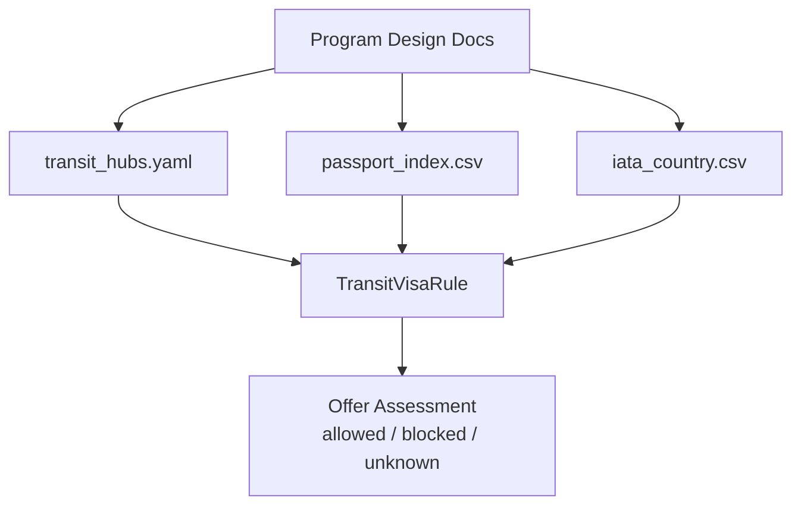
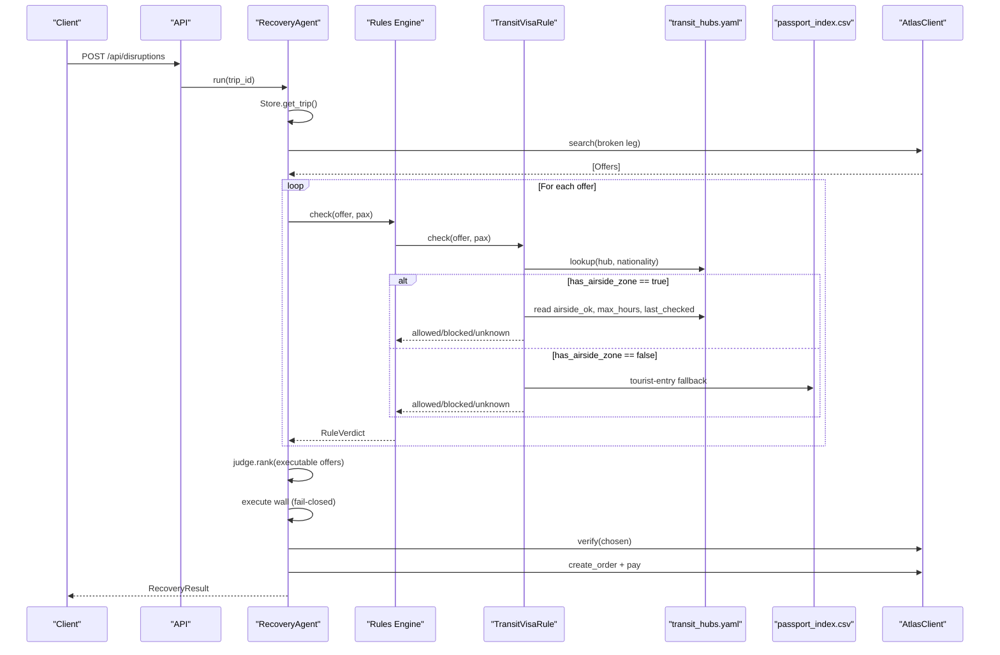
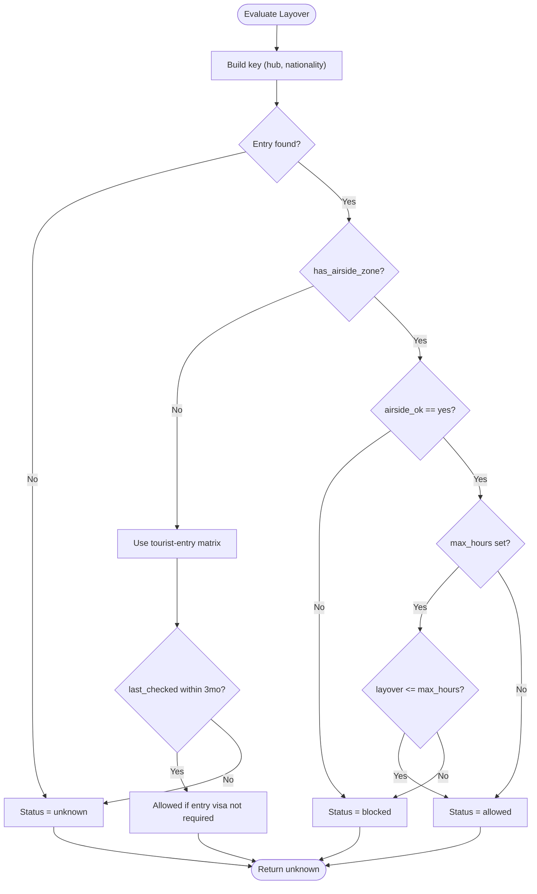
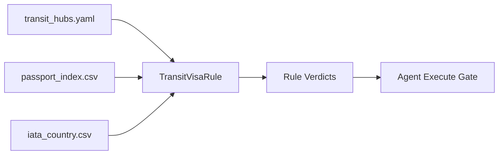

# Curated Data Structure

<cite>
**Referenced Files in This Document**
- [03-program-design.md](file://docs/plans/waypoint/03-program-design.md)
- [0002-visa-rules-curated-approximation.md](file://docs/adr/0002-visa-rules-curated-approximation.md)
- [04-slices.md](file://docs/plans/waypoint/04-slices.md)
</cite>

## Table of Contents
1. [Introduction](#introduction)
2. [Project Structure](#project-structure)
3. [Core Components](#core-components)
4. [Architecture Overview](#architecture-overview)
5. [Detailed Component Analysis](#detailed-component-analysis)
6. [Dependency Analysis](#dependency-analysis)
7. [Performance Considerations](#performance-considerations)
8. [Troubleshooting Guide](#troubleshooting-guide)
9. [Conclusion](#conclusion)

## Introduction
This document explains the curated transit hub data structure used by Waypoint to determine whether a passenger can legally transit through a connecting airport without clearing immigration (airside transit). It focuses on the YAML schema for transit_hubs.yaml, the composite lookup key (hub × passport-nationality), and how missing or stale entries resolve to an unknown status that blocks autonomous execution. It also clarifies the relationship between airside zones and immigration clearance requirements and provides examples of valid configurations for different hub types.

## Project Structure
The curated transit rules live as a YAML file alongside other reference datasets. The program design documents describe where these files are loaded and how they feed into the rules engine that evaluates each flight offer’s layovers.

**Diagram sources**
- [03-program-design.md:9-32](file://docs/plans/waypoint/03-program-design.md#L9-L32)
- [03-program-design.md:34-48](file://docs/plans/waypoint/03-program-design.md#L34-L48)

**Section sources**
- [03-program-design.md:9-32](file://docs/plans/waypoint/03-program-design.md#L9-L32)

## Core Components
- Transit hubs table: keyed by IATA hub code; includes country mapping and a coarse flag indicating whether the hub has an airside zone.
- Nationality-specific cells: per hub and passport nationality, recording whether airside transit is allowed, any time-limited allowance, and provenance metadata.
- Lookup mechanism: uses (hub × passport-nationality) as a composite key; missing entries resolve to unknown.
- Freshness windows: curated airside cells trusted for up to six months since last_checked; entry-fallback path trusted for up to three months. Past the window, the cell is treated as unknown.

Key fields
- hub IATA code: top-level key identifying the airport.
- country: ISO-2 country code for the hub.
- has_airside_zone: boolean indicator; when false, passengers changing terminals must clear immigration, so the rule falls back to the tourist-entry matrix.
- nationalities: nested map keyed by passport nationality (ISO-2).
  - airside_ok: yes | no | unknown.
  - max_hours: integer or null; when present, airside transit is allowed only if the layover duration is within this limit.
  - source: URL or reference documenting the rule.
  - last_checked: date the rule was verified.

Lookup semantics
- Composite key: (hub IATA, passport nationality).
- If either the hub or the nationality cell is missing, the result is unknown.
- Unknown resolves to blocked for autonomous execution (fail-closed).

Airside vs immigration
- When has_airside_zone is true and airside_ok is yes within max_hours (if set), the passenger may remain airside without clearing immigration.
- When has_airside_zone is false, the passenger must clear immigration regardless of airside_ok; the rule then consults the tourist-entry matrix for visa eligibility.

Freshness behavior
- Airside cell: trusted if last_checked is within six months.
- Entry-fallback cell: trusted if last_checked is within three months.
- Beyond these windows, the cell is treated as unknown and thus blocked from auto-execution.

**Section sources**
- [03-program-design.md:34-48](file://docs/plans/waypoint/03-program-design.md#L34-L48)
- [03-program-design.md:50-55](file://docs/plans/waypoint/03-program-design.md#L50-L55)
- [0002-visa-rules-curated-approximation.md:9-18](file://docs/adr/0002-visa-rules-curated-approximation.md#L9-L18)

## Architecture Overview
The transit rule evaluation integrates with the broader recovery flow. Each offer’s layovers are assessed against curated rules, producing a verdict per rule. Offers become executable only if all rules return allowed.

**Diagram sources**
- [03-program-design.md:125-149](file://docs/plans/waypoint/03-program-design.md#L125-L149)
- [03-program-design.md:34-48](file://docs/plans/waypoint/03-program-design.md#L34-L48)
- [0002-visa-rules-curated-approximation.md:9-18](file://docs/adr/0002-visa-rules-curated-approximation.md#L9-L18)

## Detailed Component Analysis

### YAML Schema: transit_hubs.yaml
- Top-level keys are hub IATA codes.
- Each hub contains:
  - country: ISO-2 country code.
  - has_airside_zone: boolean; when false, terminal changes require immigration clearance.
  - nationalities: map of passport nationalities (ISO-2) to:
    - airside_ok: yes | no | unknown.
    - max_hours: integer or null; applies only when airside transit is permitted.
    - source: provenance URL or reference.
    - last_checked: date of verification.
- Missing hub or nationality cell resolves to unknown.

Example configurations
- Hub with airside zone and time-limited waiver:
  - has_airside_zone: true
  - airside_ok: yes
  - max_hours: 72
  - Interpretation: airside transit allowed if layover ≤ 72 hours; otherwise requires immigration.
- Hub with airside zone but restricted for a nationality:
  - has_airside_zone: true
  - airside_ok: no
  - Interpretation: passenger must clear immigration even on same ticket.
- Hub without airside zone:
  - has_airside_zone: false
  - Interpretation: all passengers changing terminals must clear immigration; rule falls back to tourist-entry matrix.

Provenance and freshness
- source and last_checked provide auditability.
- Airside cells trusted for six months; entry-fallback cells trusted for three months. Past these windows, treat as unknown and block auto-execution.

**Section sources**
- [03-program-design.md:34-48](file://docs/plans/waypoint/03-program-design.md#L34-L48)
- [03-program-design.md:50-55](file://docs/plans/waypoint/03-program-design.md#L50-L55)
- [0002-visa-rules-curated-approximation.md:9-18](file://docs/adr/0002-visa-rules-curated-approximation.md#L9-L18)

### Lookup Mechanism: (hub × passport-nationality)
- The rule constructs a composite key from the layover hub IATA and the passenger’s passport nationality.
- If the key exists:
  - If has_airside_zone is true and airside_ok is yes and layover ≤ max_hours (when set), the outcome is allowed.
  - If has_airside_zone is true and airside_ok is no, the outcome is blocked.
  - If has_airside_zone is false, immigration clearance is required; the rule consults the tourist-entry matrix to decide allowed/blocked.
- If the key is missing (hub absent or nationality absent), the outcome is unknown.
- Unknown results in blocked for autonomous execution (fail-closed).

Freshness gating
- Airside cell: allowed only if last_checked is within six months.
- Entry-fallback cell: allowed only if last_checked is within three months.
- Stale cells are treated as unknown and thus blocked from auto-execution.

**Diagram sources**
- [03-program-design.md:34-48](file://docs/plans/waypoint/03-program-design.md#L34-L48)
- [03-program-design.md:50-55](file://docs/plans/waypoint/03-program-design.md#L50-L55)
- [0002-visa-rules-curated-approximation.md:9-18](file://docs/adr/0002-visa-rules-curated-approximation.md#L9-L18)

**Section sources**
- [03-program-design.md:34-48](file://docs/plans/waypoint/03-program-design.md#L34-L48)
- [03-program-design.md:50-55](file://docs/plans/waypoint/03-program-design.md#L50-L55)
- [0002-visa-rules-curated-approximation.md:9-18](file://docs/adr/0002-visa-rules-curated-approximation.md#L9-L18)

### Relationship Between Airside Zones and Immigration Clearance
- has_airside_zone indicates whether a hub provides a secure airside area enabling transit without clearing immigration.
- When false, passengers must clear immigration regardless of ticket structure; the rule then relies on the tourist-entry matrix to determine visa eligibility.
- When true, airside_ok and max_hours govern whether the passenger can remain airside during the layover.

**Section sources**
- [03-program-design.md:34-48](file://docs/plans/waypoint/03-program-design.md#L34-L48)
- [0002-visa-rules-curated-approximation.md:9-18](file://docs/adr/0002-visa-rules-curated-approximation.md#L9-L18)

## Dependency Analysis
- Data inputs:
  - transit_hubs.yaml: authoritative, curated transit rules.
  - passport_index.csv: base tourist-entry matrix used as fallback when a hub lacks an airside zone.
  - iata_country.csv: maps airport IATA codes to countries for layover context.
- Consumers:
  - TransitVisaRule reads these inputs to produce per-offer verdicts.
  - The rules engine aggregates verdicts to determine executability.
  - The agent enforces an execute gate that rejects blocked or unknown outcomes.

**Diagram sources**
- [03-program-design.md:9-32](file://docs/plans/waypoint/03-program-design.md#L9-L32)
- [03-program-design.md:34-48](file://docs/plans/waypoint/03-program-design.md#L34-L48)

**Section sources**
- [03-program-design.md:9-32](file://docs/plans/waypoint/03-program-design.md#L9-L32)
- [03-program-design.md:34-48](file://docs/plans/waypoint/03-program-design.md#L34-L48)

## Performance Considerations
- Lookups are constant-time dictionary-style accesses using the composite key (hub × nationality).
- Freshness checks involve simple date comparisons against last_checked.
- The entry-fallback path adds one additional dataset lookup; keep it minimal and cacheable.
- Avoid repeated re-parsing of YAML/CSV per request; load once at startup or refresh with appropriate caching.

[No sources needed since this section provides general guidance]

## Troubleshooting Guide
Common issues and resolutions
- Unknown due to missing hub or nationality:
  - Ensure the hub IATA and passport nationality exist in transit_hubs.yaml.
  - Missing entries intentionally resolve to unknown and block auto-execution.
- Stale data causing unknown:
  - Verify last_checked dates are within the freshness windows (six months for airside cells, three months for entry-fallback).
  - Update provenance and last_checked when rules change.
- Unexpected blocked outcomes:
  - Confirm has_airside_zone reflects the hub’s actual capabilities.
  - Validate airside_ok and max_hours for the specific nationality.
  - Remember that ticket structure (same-ticket vs self-transfer) does not flip verdicts; it only affects messaging.

Operational notes
- The demo choreography requires curated hubs with contrasting outcomes (e.g., a trap hub with airside_ok:no and a legal hub with airside_ok:yes) to validate fail-closed behavior.
- Always show provenance and last_checked in UI to communicate data reliability.

**Section sources**
- [03-program-design.md:34-48](file://docs/plans/waypoint/03-program-design.md#L34-L48)
- [03-program-design.md:50-55](file://docs/plans/waypoint/03-program-design.md#L50-L55)
- [03-program-design.md:181-185](file://docs/plans/waypoint/03-program-design.md#L181-L185)
- [04-slices.md:15-17](file://docs/plans/waypoint/04-slices.md#L15-L17)

## Conclusion
Waypoint’s curated transit hub data structure provides a precise, auditable way to evaluate whether passengers can transit airside at connecting airports. By combining hub-level indicators (has_airside_zone) with nationality-specific rules (airside_ok, max_hours) and provenance metadata (source, last_checked), the system makes conservative, fail-closed decisions that protect passengers and airlines. The composite lookup (hub × nationality) ensures clarity and simplicity, while freshness windows maintain trustworthiness over time.

[No sources needed since this section summarizes without analyzing specific files]