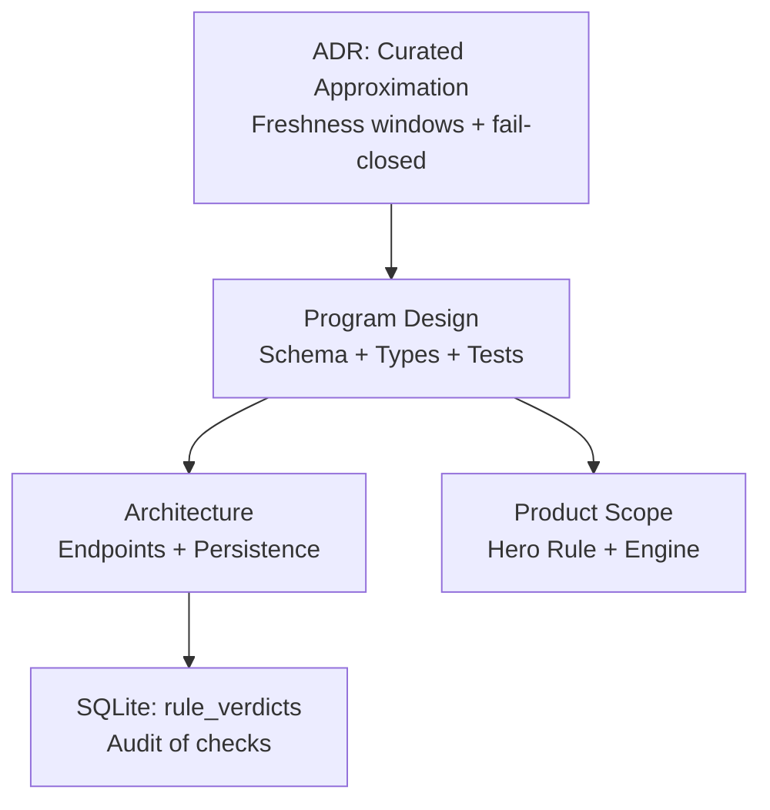
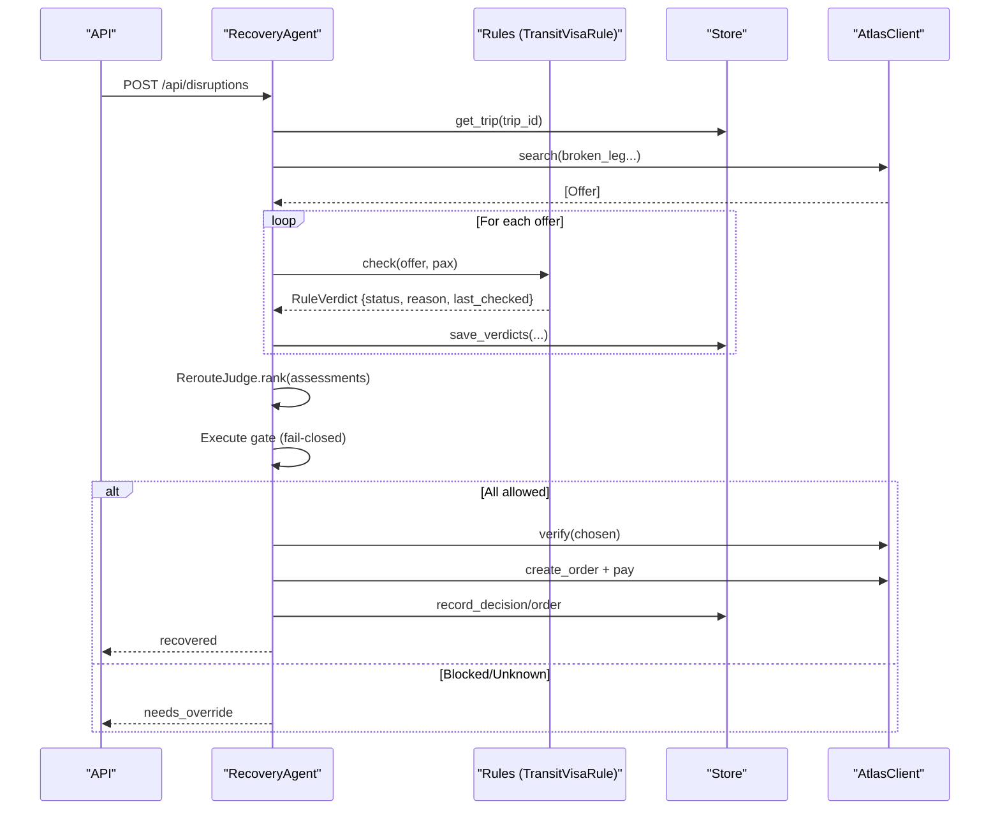
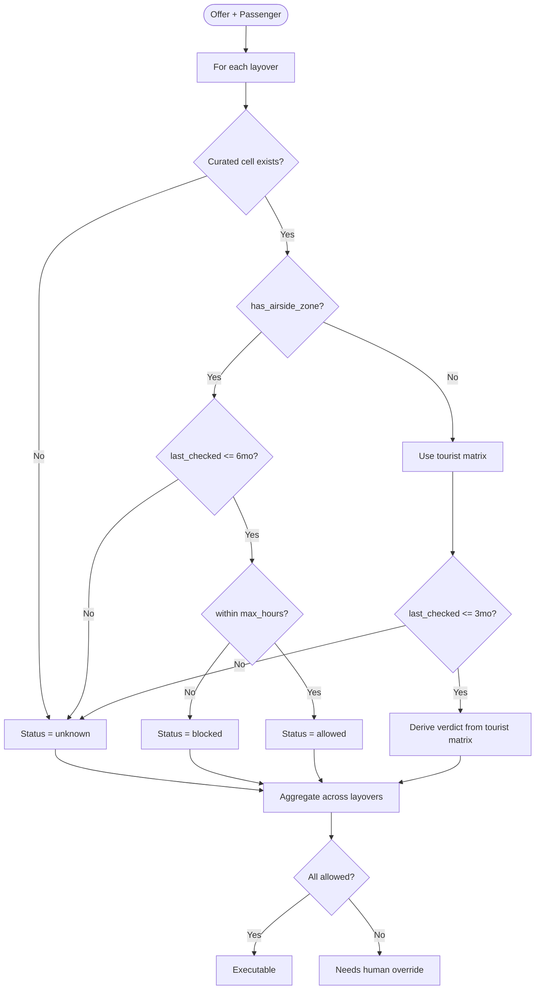
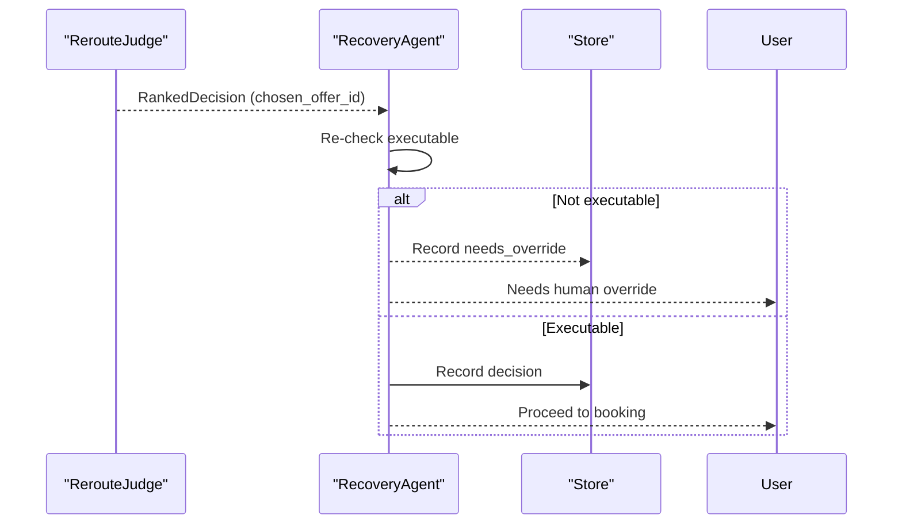
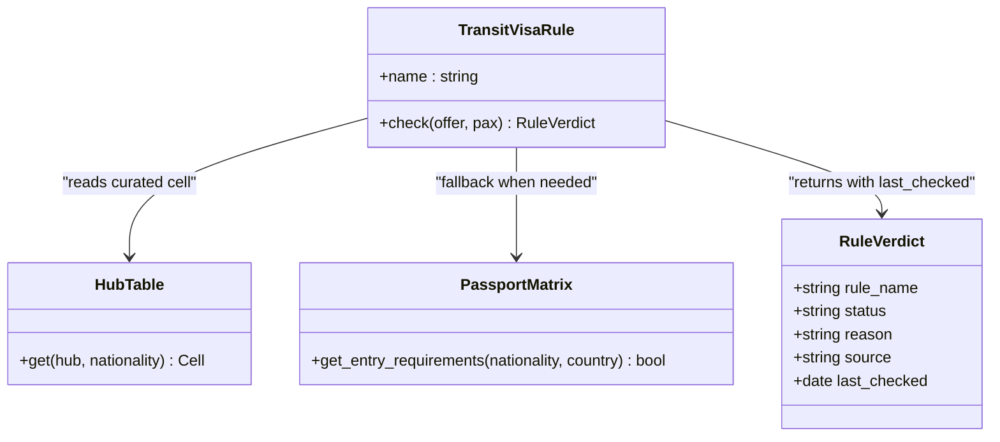
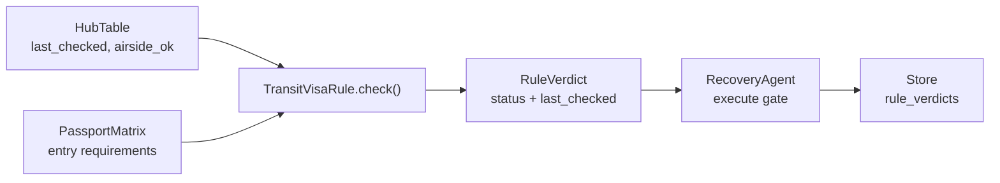

# Data Freshness Policies

<cite>
**Referenced Files in This Document**
- [0002-visa-rules-curated-approximation.md](file://docs/adr/0002-visa-rules-curated-approximation.md)
- [03-program-design.md](file://docs/plans/waypoint/03-program-design.md)
- [02-architecture.md](file://docs/plans/waypoint/02-architecture.md)
- [01-product.md](file://docs/plans/waypoint/01-product.md)
- [00-status.md](file://docs/plans/waypoint/00-status.md)
</cite>

## Table of Contents
1. [Introduction](#introduction)
2. [Project Structure](#project-structure)
3. [Core Components](#core-components)
4. [Architecture Overview](#architecture-overview)
5. [Detailed Component Analysis](#detailed-component-analysis)
6. [Dependency Analysis](#dependency-analysis)
7. [Performance Considerations](#performance-considerations)
8. [Troubleshooting Guide](#troubleshooting-guide)
9. [Conclusion](#conclusion)

## Introduction
This document explains Waypoint’s data freshness policies for transit visa validation. It focuses on the dual freshness windows that govern when curated transit data can be trusted for autonomous execution:
- 6-month trust window for airside transit data
- 3-month window for entry-fallback data derived from the tourist visa matrix

It also documents how stale data is handled via a fail-closed approach: expired entries are treated as unknown and require human override. The last_checked timestamp tracking mechanism and its integration with the rule engine are described, along with examples of enforcement within the TransitVisaRule implementation and the rationale behind different time windows based on data volatility and reliability.

## Project Structure
The project’s design and policy specifications are captured in planning and architecture documentation. Key artifacts include:
- Architecture decisions describing the two-layer data model (curated airside vs. tourist-matrix fallback), fail-closed defaults, and freshness windows
- Program design specifying the curated schema, freshness rules, and type signatures for the rule engine and agents
- Architecture notes detailing endpoints, persistence, and where rule verdicts are recorded
- Product scope clarifying the hero rule (transit-visa eligibility) and the general rules engine

**Diagram sources**
- [0002-visa-rules-curated-approximation.md:1-25](file://docs/adr/0002-visa-rules-curated-approximation.md#L1-L25)
- [03-program-design.md:34-123](file://docs/plans/waypoint/03-program-design.md#L34-L123)
- [02-architecture.md:13-30](file://docs/plans/waypoint/02-architecture.md#L13-L30)

**Section sources**
- [0002-visa-rules-curated-approximation.md:1-25](file://docs/adr/0002-visa-rules-curated-approximation.md#L1-L25)
- [03-program-design.md:34-123](file://docs/plans/waypoint/03-program-design.md#L34-L123)
- [02-architecture.md:13-30](file://docs/plans/waypoint/02-architecture.md#L13-L30)
- [01-product.md:13-23](file://docs/plans/waypoint/01-product.md#L13-L23)

## Core Components
- Curated hub table per (hub × nationality) with fields including airside_ok, max_hours, source, and last_checked
- Tourist visa matrix used only as an entry-fallback when a hub has no airside zone
- Rule engine interface returning a three-state verdict: allowed, blocked, or unknown
- Recovery agent flow that enforces an execute gate: only offers with all allowed verdicts proceed to booking; blocked/unknown require human override
- Persistence layer recording rule_verdicts for auditability

Key behaviors:
- Freshness windows:
  - Airside cells: trusted if last_checked ≤ 6 months
  - Entry-fallback cells: trusted if last_checked ≤ 3 months
- Past any window → treat as unknown → fail-closed (no auto-execution)
- same_ticket flag influences messaging but never flips verdict status

**Section sources**
- [0002-visa-rules-curated-approximation.md:9-18](file://docs/adr/0002-visa-rules-curated-approximation.md#L9-L18)
- [03-program-design.md:34-95](file://docs/plans/waypoint/03-program-design.md#L34-L95)
- [03-program-design.md:125-149](file://docs/plans/waypoint/03-program-design.md#L125-L149)
- [02-architecture.md:21-28](file://docs/plans/waypoint/02-architecture.md#L21-L28)

## Architecture Overview
The recovery workflow integrates rule evaluation and freshness enforcement before any booking occurs.

**Diagram sources**
- [03-program-design.md:125-149](file://docs/plans/waypoint/03-program-design.md#L125-L149)
- [02-architecture.md:13-28](file://docs/plans/waypoint/02-architecture.md#L13-L28)

## Detailed Component Analysis

### TransitVisaRule and Freshness Enforcement
TransitVisaRule evaluates each layover using:
- Curated hub cell for (hub × nationality): airside_ok, max_hours, source, last_checked
- Fallback to tourist matrix only when has_airside_zone is false
- Freshness gating:
  - If airside_ok applies: last_checked must be within 6 months
  - If entry-fallback applies: last_checked must be within 3 months
- Verdict logic:
  - Allowed: airside_ok yes and within max_hours AND freshness satisfied
  - Blocked: airside_ok no
  - Unknown: missing hub/nationality cell OR freshness window exceeded

**Diagram sources**
- [03-program-design.md:34-95](file://docs/plans/waypoint/03-program-design.md#L34-L95)
- [03-program-design.md:151-158](file://docs/plans/waypoint/03-program-design.md#L151-L158)

**Section sources**
- [03-program-design.md:34-95](file://docs/plans/waypoint/03-program-design.md#L34-L95)
- [03-program-design.md:151-158](file://docs/plans/waypoint/03-program-design.md#L151-L158)

### Fail-Closed Execution Gate
The execute gate ensures that only fully allowed offers are booked automatically. Any blocked or unknown verdict blocks autonomous execution and requires explicit human override.

**Diagram sources**
- [03-program-design.md:97-114](file://docs/plans/waypoint/03-program-design.md#L97-L114)
- [03-program-design.md:125-149](file://docs/plans/waypoint/03-program-design.md#L125-L149)

**Section sources**
- [03-program-design.md:97-114](file://docs/plans/waypoint/03-program-design.md#L97-L114)
- [03-program-design.md:125-149](file://docs/plans/waypoint/03-program-design.md#L125-L149)

### Last-Checked Timestamp Tracking and Integration
- Each curated cell includes last_checked to indicate when the data was verified
- Freshness windows:
  - Airside: last_checked within 6 months
  - Entry-fallback: last_checked within 3 months
- When last_checked exceeds the applicable window, the cell is treated as unknown, which triggers fail-closed behavior
- RuleVerdict carries last_checked for auditability and UI display

**Diagram sources**
- [03-program-design.md:57-95](file://docs/plans/waypoint/03-program-design.md#L57-L95)

**Section sources**
- [03-program-design.md:57-95](file://docs/plans/waypoint/03-program-design.md#L57-L95)
- [0002-visa-rules-curated-approximation.md:9-18](file://docs/adr/0002-visa-rules-curated-approximation.md#L9-L18)

### Examples of Freshness Policy Enforcement
- Airside cell older than 6 months → treated as unknown → blocked from auto-execution
- Entry-fallback cell older than 3 months → treated as unknown → blocked from auto-execution
- Missing hub or nationality cell → unknown → blocked from auto-execution
- same_ticket does not flip verdict; it may influence messaging only

These behaviors are validated by tests that assert:
- blocked when airside_ok is no
- allowed when airside_ok is yes and within max_hours and freshness satisfied
- unknown when hub not curated or freshness window exceeded
- execute wall rejects blocked/unknown

**Section sources**
- [03-program-design.md:151-163](file://docs/plans/waypoint/03-program-design.md#L151-L163)

### Rationale Behind Different Time Windows
- Airside transit data is curated and typically more stable; thus, a longer 6-month trust window is applied
- Entry-fallback relies on the tourist visa matrix, which is less reliable for transit scenarios; thus, a shorter 3-month window is used to distrust weaker data faster
- These windows serve as a proxy for “re-read before write” since there is no live transit-visa API; price/availability uses real-time verification, while visa rules use curated data plus freshness

**Section sources**
- [0002-visa-rules-curated-approximation.md:9-18](file://docs/adr/0002-visa-rules-curated-approximation.md#L9-L18)
- [03-program-design.md:50-55](file://docs/plans/waypoint/03-program-design.md#L50-L55)

## Dependency Analysis
The freshness policy depends on several components:
- Curated hub table provides last_checked and airside_ok
- Tourist matrix provides fallback requirements when airside zone is absent
- Rule engine consumes these inputs and returns verdicts with last_checked
- Recovery agent enforces execute gate based on verdicts
- Persistence records rule_verdicts for audit

**Diagram sources**
- [03-program-design.md:57-95](file://docs/plans/waypoint/03-program-design.md#L57-L95)
- [02-architecture.md:21-28](file://docs/plans/waypoint/02-architecture.md#L21-L28)

**Section sources**
- [03-program-design.md:57-95](file://docs/plans/waypoint/03-program-design.md#L57-L95)
- [02-architecture.md:21-28](file://docs/plans/waypoint/02-architecture.md#L21-L28)

## Performance Considerations
- Freshness checks are lightweight date comparisons against last_checked
- Aggregation across layovers is linear in the number of segments
- Persisting rule_verdicts enables efficient auditing without recomputation
- Avoid unnecessary re-evaluation by caching results per offer during a single recovery run

[No sources needed since this section provides general guidance]

## Troubleshooting Guide
Common issues and resolutions:
- Stale data causing unexpected unknown verdicts:
  - Verify last_checked timestamps in curated cells
  - Ensure airside cells are refreshed within 6 months and entry-fallback within 3 months
- Unexpected blocked verdicts:
  - Confirm airside_ok values and max_hours thresholds
  - Check whether has_airside_zone forces entry-fallback path
- Human override required:
  - Review rule_verdicts for reasons and last_checked
  - Update curated data or explicitly override after human review

**Section sources**
- [03-program-design.md:151-163](file://docs/plans/waypoint/03-program-design.md#L151-L163)
- [02-architecture.md:21-28](file://docs/plans/waypoint/02-architecture.md#L21-L28)

## Conclusion
Waypoint’s data freshness policies ensure reliable transit visa validation by combining curated data with strict freshness windows and a fail-closed execution model. The dual windows reflect differing reliability:
- 6 months for curated airside data
- 3 months for entry-fallback data from the tourist matrix

Stale data is treated as unknown and blocks autonomous execution, requiring human oversight. The last_checked timestamp is central to this process, integrated into the rule engine and persisted for auditability. This approach balances safety, transparency, and operational practicality in the absence of a live transit-visa API.

[No sources needed since this section summarizes without analyzing specific files]