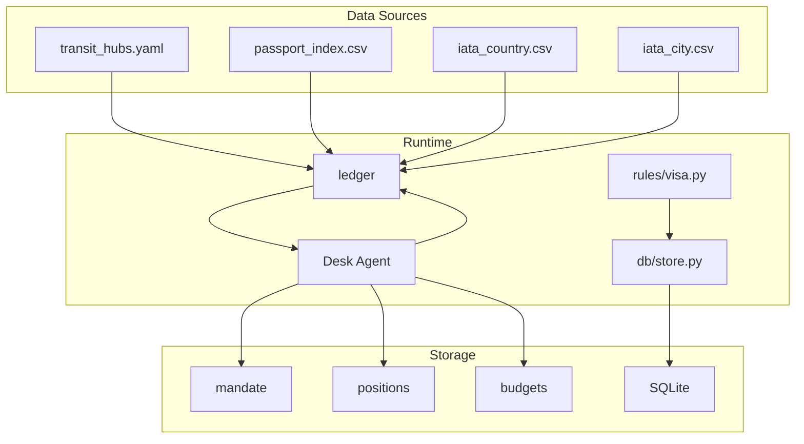
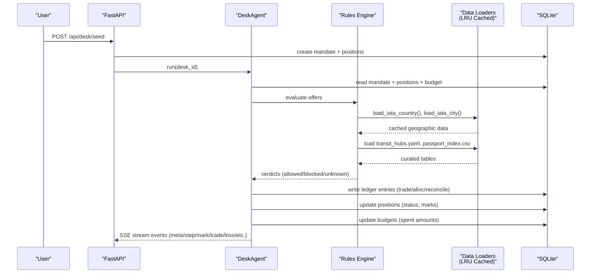
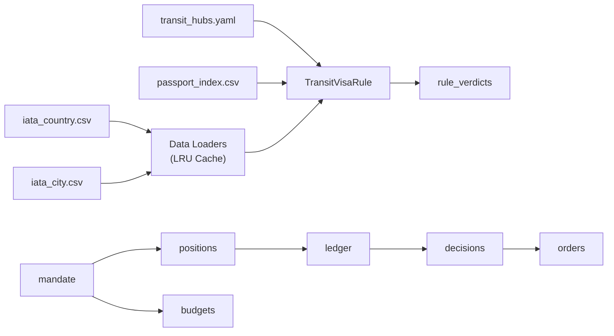

# Data Management

<cite>
**Referenced Files in This Document**
- [loaders.py](file://backend/app/data/loaders.py)
- [iata_country.csv](file://backend/data/iata_country.csv)
- [iata_city.csv](file://backend/data/iata_city.csv)
- [models.py](file://backend/app/models.py)
- [schema.py](file://backend/app/db/schema.py)
- [database.py](file://backend/app/db/database.py)
- [format.ts](file://frontend/lib/format.ts)
- [types.ts](file://frontend/lib/types.ts)
- [02-architecture.md](file://docs/plans/waypoint/02-architecture.md)
- [03-program-design.md](file://docs/plans/waypoint/03-program-design.md)
- [04-slices.md](file://docs/plans/waypoint/04-slices.md)
- [00-status.md](file://docs/plans/waypoint/00-status.md)
- [0002-visa-rules-curated-approximation.md](file://docs/adr/0002-visa-rules-curated-approximation.md)
- [QODER-HANDOFF.md](file://docs/plans/waypoint/QODER-HANDOFF.md)
</cite>

## Update Summary
**Changes Made**
- Updated Database Schema Design section to reflect new mandate/positions/ledger/budgets structure
- Revised SQLite Schema Design to document the desk-based architecture replacing trip/segment/offers model
- Added comprehensive coverage of the new desk lifecycle and audit trail system
- Updated Architecture Overview to show desk-centric data flow with mandate management
- Enhanced Data Migration Strategies section with desk schema migration guidance
- Updated Dependency Analysis to reflect new table relationships and access patterns

## Table of Contents
1. Introduction
2. Project Structure
3. Core Components
4. Architecture Overview
5. Detailed Component Analysis
6. Dependency Analysis
7. Performance Considerations
8. Troubleshooting Guide
9. Conclusion
10. Appendices

## Introduction
This document describes the data management strategy for Waypoint with a focus on curated transit hub data, passport matrix integration, and the desk-based mandate system. It explains the curated table structure keyed by (hub × passport-nationality), freshness policies, validation and verification processes, SQLite schema design for desk operations including mandates, positions, ledger entries, and budgets, migration and versioning approaches, security measures for sensitive travel information, and backup and recovery procedures. The goal is to make the system's data model, governance, and operational practices clear to both technical and non-technical stakeholders.

## Project Structure
Waypoint's planning documents define where data lives and how it flows:
- Curated transit-hub rules are stored as YAML and loaded at runtime.
- A tourist-entry fallback matrix is provided as CSV.
- **Updated**: Desk-based architecture with mandate, positions, ledger, and budgets tables for comprehensive audit trails.
- **Updated**: IATA-to-country and IATA-to-city mappings are now loaded from CSV files via centralized data loaders with LRU caching.
- Desk lifecycle: mandate creation → position tracking → ledger entries → budget management → weekly close.

**Diagram sources**
- [loaders.py:1-42](file://backend/app/data/loaders.py#L1-L42)
- [schema.py:33-103](file://backend/app/db/schema.py#L33-L103)
- [02-architecture.md:25-31](file://docs/plans/waypoint/02-architecture.md#L25-L31)

**Section sources**
- [loaders.py:1-42](file://backend/app/data/loaders.py#L1-L42)
- [schema.py:33-103](file://backend/app/db/schema.py#L33-L103)
- [02-architecture.md:25-31](file://docs/plans/waypoint/02-architecture.md#L25-L31)

## Core Components
- Curated transit hub table (YAML): Keyed by hub IATA and nationality; includes airside eligibility, hour thresholds, and provenance metadata.
- Passport entry-fallback matrix (CSV): Used when a hub has no airside zone and immigration clearance is required.
- **Updated**: Desk mandate system: Central authority defining budget caps, contingency percentages, and operational boundaries.
- **Updated**: Position tracking: Individual travel opportunities with cost basis, mark prices, and booking status.
- **Updated**: Ledger system: Comprehensive audit trail of all financial transactions including trades, allocations, reconciliations, losses, and adjustments.
- **Updated**: Budget management: Period-based allocation tracking with contingency reserves.
- Geographic data loading: IATA-to-country and IATA-to-city mappings with LRU caching.
- Rules engine: Applies curated data to assess offers against transit visa requirements and passport validity.

Key responsibilities:
- Load and validate curated data at startup or on demand using cached loaders.
- Manage desk lifecycle from mandate creation through weekly close.
- Maintain comprehensive audit trails via ledger entries for compliance and safety.
- Enforce fail-closed behavior for unknown or stale entries.

**Section sources**
- [loaders.py:20-41](file://backend/app/data/loaders.py#L20-L41)
- [schema.py:33-103](file://backend/app/db/schema.py#L33-L103)
- [models.py:83-147](file://backend/app/models.py#L83-L147)
- [02-architecture.md:25-31](file://docs/plans/waypoint/02-architecture.md#L25-L31)

## Architecture Overview
The data architecture centers on a desk-based mandate system that manages travel positions with comprehensive audit trails. Freshness windows govern trust in curated data, while the desk cycle provides deterministic execution with human oversight. **Updated**: The system now uses a mandate-driven approach with positions, ledger entries, and budget tracking for full compliance and safety.

**Diagram sources**
- [loaders.py:32-41](file://backend/app/data/loaders.py#L32-L41)
- [schema.py:33-103](file://backend/app/db/schema.py#L33-L103)
- [02-architecture.md:33-41](file://docs/plans/waypoint/02-architecture.md#L33-L41)

## Detailed Component Analysis

### Curated Transit Hub Table (hub × nationality)
Structure and semantics:
- Hub-level fields:
  - country: ISO-2 country code of the hub.
  - has_airside_zone: boolean indicating whether airside transit is possible without clearing immigration.
- Nationality-level fields (per hub):
  - airside_ok: yes | no | unknown.
  - max_hours: optional threshold for airside transit allowance.
  - source: provenance URL or reference.
  - last_checked: date of last curation or verification.

Freshness policy:
- Airside cells trusted within 6 months of last_checked.
- Entry-fallback cells trusted within 3 months of last_checked.
- Past the window → treated as unknown → fail-closed (no autonomous booking).

Lookup behavior:
- Missing hub or missing nationality → unknown → blocked from execute.
- Ticket structure (same-ticket vs self-transfer) influences messaging only; never flips verdict.

Operational implications:
- Curators must update last_checked when reviewing or changing cells.
- UI should display provenance and last_checked to communicate honesty about data age.

**Section sources**
- [03-program-design.md:34-48](file://docs/plans/waypoint/03-program-design.md#L34-L48)
- [0002-visa-rules-curated-approximation.md:9-18](file://docs/adr/0002-visa-rules-curated-approximation.md#L9-L18)
- [00-status.md:27-31](file://docs/plans/waypoint/00-status.md#L27-L31)

### Passport Matrix Integration (Entry Fallback)
Purpose:
- When has_airside_zone is false, passengers must clear immigration; the tourist-entry matrix provides baseline eligibility for such cases.

Integration points:
- Loaded alongside curated hubs and IATA mapping.
- Used by the transit visa rule to determine entry requirements when airside transit is not available.

Constraints:
- Treated as shakier than curated airside data; thus shorter freshness window (3 months).
- Fail-closed if stale or missing.

**Section sources**
- [03-program-design.md:34-48](file://docs/plans/waypoint/03-program-design.md#L34-L48)
- [0002-visa-rules-curated-approximation.md:9-18](file://docs/adr/0002-visa-rules-curated-approximation.md#L9-L18)

### Desk Mandate System (New)
**Updated**: Replaced trip-centric model with desk-based mandate system for comprehensive travel portfolio management.

Implementation details:
- **Central Authority**: Each desk has a single mandate defining budget_total, authority_cap, contingency_pct, currency, and holder
- **Position Tracking**: Individual travel opportunities tracked with cost_basis, mark_price, status (held/booked), and Atlas integration
- **Audit Trail**: Comprehensive ledger system recording all financial transactions with timestamps and references
- **Budget Management**: Period-based allocation tracking with contingency reserves and spending limits

Schema structure:
- `mandate`: Desk authority definition with budget constraints and operational parameters
- `positions`: Individual travel opportunities with pricing, status, and booking state
- `ledger`: Immutable audit trail of all financial events (trade, alloc, reconcile, loss, adjust)
- `budgets`: Period-based budget allocation and spending tracking

Desk lifecycle:
1. Seed mandate with budget and authority parameters
2. Create initial positions with cost bases
3. Execute desk cycle: reprice, judge, execute, settle
4. Weekly close with P&L analysis and risk officer review

**Section sources**
- [schema.py:33-103](file://backend/app/db/schema.py#L33-L103)
- [models.py:83-147](file://backend/app/models.py#L83-L147)
- [02-architecture.md:25-31](file://docs/plans/waypoint/02-architecture.md#L25-L31)

### Geographic Data Loading (Enhanced)
**Updated**: Enhanced geographic data loading with centralized CSV-based loaders featuring LRU caching and improved error handling.

Implementation details:
- **Centralized Loading**: All geographic data is loaded through `backend/app/data/loaders.py` using two main functions:
  - `load_iata_country()`: Returns airport IATA to ISO-2 country mapping
  - `load_iata_city()`: Returns airport IATA to display city name mapping
- **LRU Caching**: Both loader functions use `@lru_cache(maxsize=1)` decorator for single-instance caching
- **Graceful Error Handling**: Malformed rows are skipped during CSV parsing
- **File Location**: CSV files stored in `backend/data/` directory

Data sources:
- `iata_country.csv`: Contains IATA code to ISO-2 country code mappings (85 entries)
- `iata_city.csv`: Contains IATA code to display city name mappings (85 entries)

Frontend integration:
- **Wire-based Data**: Geographic information now travels on the wire via `RecoveryResult.layovers` instead of being hardcoded in frontend
- **Reduced Duplication**: Frontend only contains country name display mappings, not geographic lookups
- **Type Safety**: `Layover` type includes optional `city` field for display purposes

**Section sources**
- [loaders.py:1-42](file://backend/app/data/loaders.py#L1-L42)
- [iata_country.csv:1-85](file://backend/data/iata_country.csv#L1-L85)
- [iata_city.csv:1-85](file://backend/data/iata_city.csv#L1-L85)
- [models.py:47-94](file://backend/app/models.py#L47-L94)
- [types.ts:22-28](file://frontend/lib/types.ts#L22-L28)

### Data Validation and Verification
Manual curation workflow:
- Curators review and update transit_hubs.yaml entries, ensuring accurate airside_ok, max_hours, source, and last_checked values.
- For entry-fallback cases, curators ensure passport_index.csv reflects current tourist-entry requirements.

Automated checks:
- Freshness enforcement: any cell older than its allowed window is treated as unknown and blocks autonomous execution.
- Desk cycle validation: mandate constraints, budget limits, and authority caps enforced before execution.
- Ledger integrity: all financial transactions recorded with proper references and timestamps.

Verification boundaries:
- Price and availability are re-read live via Atlas verify before booking.
- Visa/transit rules rely on curated data plus freshness windows; no live API exists, so staleness is explicit.
- Desk decisions subject to human approval for escalations beyond authority caps.

**Section sources**
- [03-program-design.md:50-55](file://docs/plans/waypoint/03-program-design.md#L50-L55)
- [00-status.md:27-31](file://docs/plans/waypoint/00-status.md#L27-L31)
- [02-architecture.md:33-41](file://docs/plans/waypoint/02-architecture.md#L33-L41)

### SQLite Schema Design (Updated)
**Updated**: Complete replacement of trip/segment/offers model with desk-based mandate system.

New table structure:
- **mandate**: Desk authority definition with budget_total, authority_cap, contingency_pct, currency, holder, created_at
- **positions**: Individual travel opportunities with desk_id, trip_label, origin, dest, depart_date, pax, status, cost_basis, mark_price, mark_at, atlas_offer_id, atlas_order_no, ticket_asserted
- **ledger**: Comprehensive audit trail with desk_id, ts, kind (trade|alloc|reconcile|loss|adjust), amount, position_id, ref, note
- **budgets**: Period-based budget management with desk_id, period, allocated, spent, contingency, created_at

Relationships:
- All tables link back to mandate.id (desk_id)
- Ledger entries can reference specific positions for detailed tracking
- Positions maintain Atlas integration IDs for external system correlation

Primary query patterns:
- Desk state: SELECT positions, ledger, budgets WHERE desk_id = ?
- Audit trail: SELECT * FROM ledger WHERE desk_id = ? ORDER BY ts DESC
- Budget tracking: SUM(amount) FROM ledger WHERE desk_id = ? AND kind IN ('trade', 'alloc')
- Position status: SELECT * FROM positions WHERE desk_id = ? AND status = 'booked'

Compliance features:
- Immutable ledger entries provide complete audit trail
- Indexes optimized for desk-centric queries (desk_id, ts)
- Foreign key constraints ensure referential integrity
- Timestamps enable temporal analysis and reporting

**Section sources**
- [schema.py:33-103](file://backend/app/db/schema.py#L33-L103)
- [02-architecture.md:25-31](file://docs/plans/waypoint/02-architecture.md#L25-L31)

### Data Migration Strategies and Version Management
**Updated**: Migration strategies for evolving from trip-centric to desk-based architecture.

Guidelines derived from the project's design:
- Treat curated data as versioned artifacts:
  - Maintain a changelog for transit_hubs.yaml updates, capturing what changed, why, and who approved it.
  - Tag releases with semantic versions to correlate data changes with code changes.
- Introduce schema migrations for SQLite:
  - Use incremental migrations to add columns or tables without losing existing data.
  - Keep backward-compatible reads during rollout; write new fields conditionally.
  - Migrate legacy trip/segment/offers data to new mandate/positions/ledger/budgets structure.
- Validate migrations:
  - Run tests that assert expected schema state post-migration.
  - Include rollback scripts for safe reversions.
  - Verify data integrity between old and new schemas during transition.
- Data integrity checks:
  - On startup, validate presence and format of critical files (transit_hubs.yaml, passport_index.csv, iata_country.csv, iata_city.csv).
  - Reject operation if required curated entries are missing or malformed.
  - Validate desk mandate constraints and position relationships.

Migration considerations:
- Legacy trip data may need transformation to desk positions
- Historical offer data can be preserved in ledger as historical context
- Rule verdicts and decisions provide continuity for compliance auditing
- Geographic data mappings remain compatible across schema versions

**Section sources**
- [03-program-design.md:9-32](file://docs/plans/waypoint/03-program-design.md#L9-L32)
- [02-architecture.md:25-31](file://docs/plans/waypoint/02-architecture.md#L25-L31)
- [schema.py:1-7](file://backend/app/db/schema.py#L1-L7)

### Data Security Measures
Protecting sensitive passport and travel information:
- Minimize stored PII:
  - Store only necessary fields in passenger records (name, passport_country, passport_expiry, doc_number, issuing_country).
  - Avoid storing unnecessary personal details beyond what rules require.
  - Desk mandate system focuses on financial and operational data rather than personal information.
- Access control:
  - Restrict database access to backend services only.
  - Use environment variables for secrets; do not commit credentials.
  - Desk-based isolation ensures data segregation by desk_id.
- Encryption at rest:
  - Encrypt SQLite files or use encrypted storage volumes for databases containing PII.
  - Secure ledger entries and position data with appropriate encryption.
- Audit logging:
  - Log access to sensitive tables and actions (e.g., reading/passenger updates) without logging secret values.
  - Ledger system provides immutable audit trail for all financial transactions.
- Data retention:
  - Define retention policies for trip and order data; purge or anonymize after defined periods.
  - Implement desk lifecycle management for automatic cleanup of completed desks.
- Secure backups:
  - Backups must be encrypted and stored securely with restricted access.
  - Include both data files and curated configuration in backup strategy.

[No sources needed since this section provides general guidance]

### Backup and Recovery Procedures
Ensuring data integrity and availability:
- Regular backups:
  - Schedule automated backups of SQLite files and curated data files.
  - Store backups offsite with encryption and strict access controls.
  - Include desk state snapshots for rapid recovery.
- Integrity checks:
  - Periodically verify database integrity and file checksums.
  - Validate ledger consistency and position relationships.
  - Check mandate constraints and budget calculations.
- Recovery testing:
  - Test restore procedures regularly to ensure recoverability.
  - Validate desk state reconstruction from ledger entries.
  - Test migration scripts for schema evolution scenarios.
- Disaster recovery plan:
  - Define RTO/RPO targets and escalation paths.
  - Document steps to rebuild service state from backups and curated data.
  - Establish desk recreation procedures from ledger audit trails.

[No sources needed since this section provides general guidance]

## Dependency Analysis
Curated data dependencies and their impact:
- transit_hubs.yaml drives the TransitVisaRule; missing or stale entries cause unknown/block outcomes.
- passport_index.csv acts as entry-fallback when airside transit is unavailable.
- **Updated**: Desk mandate system creates dependency chain: mandate → positions → ledger → budgets.

Runtime coupling:
- **Updated**: data/loaders.py centralizes loading with LRU caching; changes here affect all downstream consumers.
- **Updated**: Desk agent coordinates between curated data, Atlas integration, and SQLite persistence.
- db/store.py persists intermediate and final states; schema changes require coordinated migrations.

**Diagram sources**
- [loaders.py:32-41](file://backend/app/data/loaders.py#L32-L41)
- [schema.py:33-103](file://backend/app/db/schema.py#L33-L103)
- [02-architecture.md:25-31](file://docs/plans/waypoint/02-architecture.md#L25-L31)

**Section sources**
- [loaders.py:1-42](file://backend/app/data/loaders.py#L1-L42)
- [schema.py:33-103](file://backend/app/db/schema.py#L33-L103)
- [02-architecture.md:25-31](file://docs/plans/waypoint/02-architecture.md#L25-L31)

## Performance Considerations
- Loading curated data:
  - Cache loaded tables in memory to avoid repeated disk reads during recovery runs.
  - Reload on configuration change or scheduled refresh.
- **Updated**: Desk-based performance optimizations:
  - Index positions by desk_id and status for fast desk state queries
  - Index ledger by desk_id and timestamp for efficient audit trail retrieval
  - Precompute budget totals and spent amounts to minimize real-time calculations
  - Use SQLAlchemy relationships to optimize desk state queries
- Geographic data loading optimization:
  - LRU caching eliminates redundant CSV file reads across multiple requests
  - Single-instance cache ensures consistent geographic data throughout application lifecycle
  - Graceful handling of malformed CSV rows prevents processing failures
- Query efficiency:
  - Index frequently queried columns in SQLite (e.g., desk_id, position_id, ts).
  - Batch insert ledger entries to reduce transaction overhead.
  - Use prepared statements for recurring desk queries.
- Freshness checks:
  - Precompute freshness flags at load time to minimize per-offer computation.
  - Cache desk state in memory with periodic refresh from database.
- Storage growth:
  - Archive old desk cycles periodically to keep the database lean.
  - Implement ledger partitioning by desk_id and time periods.
  - Compress historical position data after desk closure.

**Section sources**
- [loaders.py:32-41](file://backend/app/data/loaders.py#L32-L41)
- [schema.py:74-77](file://backend/app/db/schema.py#L74-L77)

## Troubleshooting Guide
Common issues and resolutions:
- Unknown verdicts due to missing hub/nationality:
  - Add curated entry for the hub and nationality; set last_checked to current date.
- Stale data causing blocked execution:
  - Update last_checked within the allowed window (6mo for airside, 3mo for entry-fallback).
- No legal option found:
  - Expand coverage by curating additional hubs; ensure entry-fallback matrix is up to date.
- **Updated**: Desk-related issues:
  - Mandate constraint violations: Review budget_total, authority_cap, and contingency_pct settings
  - Position status inconsistencies: Verify position lifecycle transitions (held → booked)
  - Ledger imbalance: Cross-reference position costs with ledger entries and budget spending
  - Desk state corruption: Reconstruct from ledger audit trail using desk_id filtering
- Database schema mismatch:
  - Apply pending migrations; verify schema version matches application expectations.
  - Ensure desk schema compatibility between mandate, positions, ledger, and budgets tables.
- Backup corruption:
  - Restore from verified backup; re-validate integrity; investigate root cause.
- **Updated**: Geographic data issues:
  - Verify CSV files exist in backend/data/ directory with correct formatting
  - Check LRU cache state if geographic data appears inconsistent
  - Ensure malformed rows are properly handled during CSV parsing

**Section sources**
- [03-program-design.md:34-55](file://docs/plans/waypoint/03-program-design.md#L34-L55)
- [02-architecture.md:25-31](file://docs/plans/waypoint/02-architecture.md#L25-L31)
- [loaders.py:20-29](file://backend/app/data/loaders.py#L20-L29)
- [schema.py:33-103](file://backend/app/db/schema.py#L33-L103)

## Conclusion
Waypoint's data management balances accuracy and honesty with comprehensive desk-based operations. Curated transit hub data provides authoritative airside rules, while the passport-index matrix serves as a conservative entry-fallback. **Updated**: The desk mandate system replaces the previous trip-centric model, providing robust audit trails through positions, ledger entries, and budget management. Geographic data loading has been centralized with LRU caching for improved performance and maintainability. Freshness windows enforce trust boundaries, and fail-closed logic protects against unsafe autonomous actions. The new desk architecture ensures full compliance and safety through immutable ledger records, comprehensive audit trails, and structured desk lifecycles. With disciplined curation, robust migrations, secure storage, reliable backups, and optimized desk operations, Waypoint maintains data integrity and operational resilience.

## Appendices

### Curated Table Field Reference
- Hub-level:
  - country: ISO-2 country code.
  - has_airside_zone: boolean flag.
- Nationality-level:
  - airside_ok: yes | no | unknown.
  - max_hours: numeric threshold or null.
  - source: provenance reference.
  - last_checked: date of last curation.

**Section sources**
- [03-program-design.md:34-48](file://docs/plans/waypoint/03-program-design.md#L34-L48)
- [0002-visa-rules-curated-approximation.md:9-18](file://docs/adr/0002-visa-rules-curated-approximation.md#L9-L18)

### Freshness Windows Summary
- Airside cells: trusted within 6 months of last_checked.
- Entry-fallback cells: trusted within 3 months of last_checked.
- Past window → unknown → blocked from autonomous execution.

**Section sources**
- [03-program-design.md:50-55](file://docs/plans/waypoint/03-program-design.md#L50-L55)
- [00-status.md:27-31](file://docs/plans/waypoint/00-status.md#L27-L31)

### Desk Schema Tables Summary (Updated)
**Updated**: Complete desk-based architecture replacing trip/segment/offers model.

- **mandate**: Desk authority definition with budget constraints and operational parameters
  - Fields: id (desk_id), budget_total, authority_cap, contingency_pct, currency, holder, created_at
- **positions**: Individual travel opportunities with pricing and booking state
  - Fields: id, desk_id, trip_label, origin, dest, depart_date, pax, status, cost_basis, mark_price, mark_at, mark_stale, atlas_offer_id, atlas_order_no, ticket_asserted
- **ledger**: Comprehensive audit trail of all financial transactions
  - Fields: id, desk_id, ts, kind (trade|alloc|reconcile|loss|adjust), amount, position_id, ref, note
- **budgets**: Period-based budget allocation and spending tracking
  - Fields: id, desk_id, period, allocated, spent, contingency, created_at

**Section sources**
- [schema.py:33-103](file://backend/app/db/schema.py#L33-L103)
- [02-architecture.md:25-31](file://docs/plans/waypoint/02-architecture.md#L25-L31)

### Geographic Data Sources Summary
**Updated**: Enhanced geographic data system with centralized loading and improved caching.

- iata_country.csv: Airport IATA codes mapped to ISO-2 country codes (85 entries covering major Asian, Pacific, and European airports)
- iata_city.csv: Airport IATA codes mapped to display city names (85 entries matching country mappings)
- Centralized loaders: `load_iata_country()` and `load_iata_city()` functions with LRU caching
- Wire-based transmission: Geographic data included in `RecoveryResult.layovers` for frontend consumption
- Frontend simplification: Reduced to country name display mappings only

**Section sources**
- [loaders.py:32-41](file://backend/app/data/loaders.py#L32-L41)
- [iata_country.csv:1-85](file://backend/data/iata_country.csv#L1-L85)
- [iata_city.csv:1-85](file://backend/data/iata_city.csv#L1-L85)
- [types.ts:22-28](file://frontend/lib/types.ts#L22-L28)

### Desk Lifecycle Events (New)
**Updated**: Comprehensive desk cycle with SSE event streaming for real-time monitoring.

Desk cycle phases:
1. **Seed**: Create mandate + seeded portfolio of 5-6 positions
2. **Re-read**: Reload positions, budget, ledger fresh (never act on cached world)
3. **Reprice**: Bounded fan-out search with meter-gated limit (20 searches/cycle)
4. **Judge**: DeskBrain scores each position (book/hold/escalate) with rationale
5. **Execute wall**: Code re-checks picks against mandate constraints and authority caps
6. **Write path**: Atlas order creation with price verification and settlement
7. **Settle**: Ledger entries for trades, allocations, reconciliations, and losses
8. **Close**: Weekly P&L analysis with admitted losses and risk-officer review

SSE Event types:
- meta: mandate + search meter (cycle start)
- step: ordered reasoning steps
- mark: position reprice results
- trade: discretionary timing calls
- loss: admitted losses
- alloc: savings allocations
- reconcile: payment vs ledger reconciliation
- escalate: mandate edge cases requiring human decision
- result: terminal cycle state with P&L

**Section sources**
- [02-architecture.md:33-55](file://docs/plans/waypoint/02-architecture.md#L33-L55)