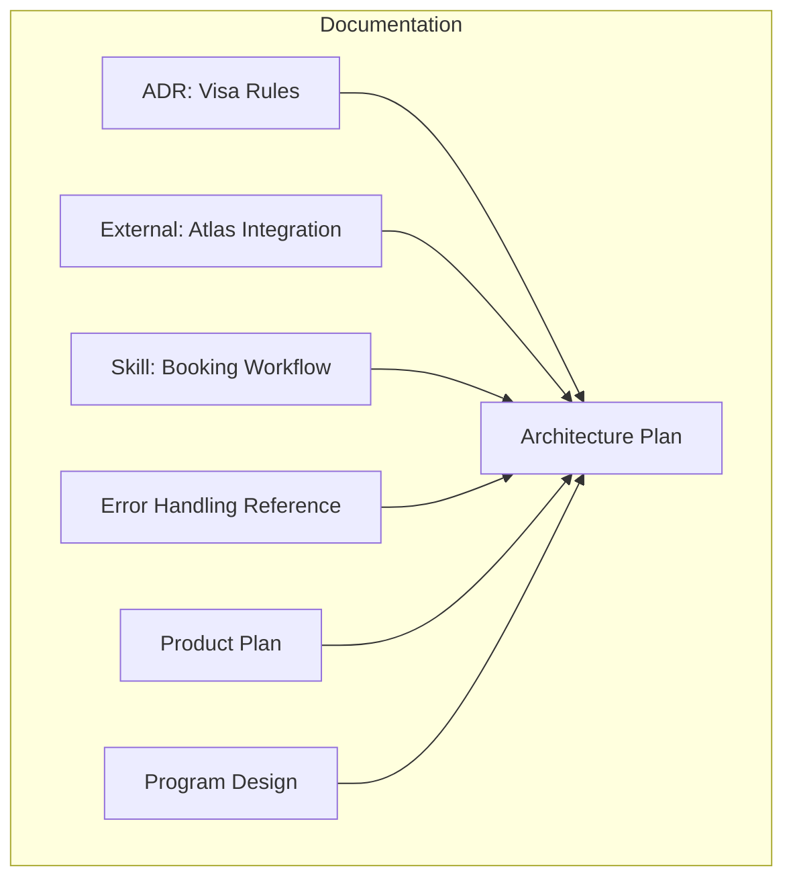
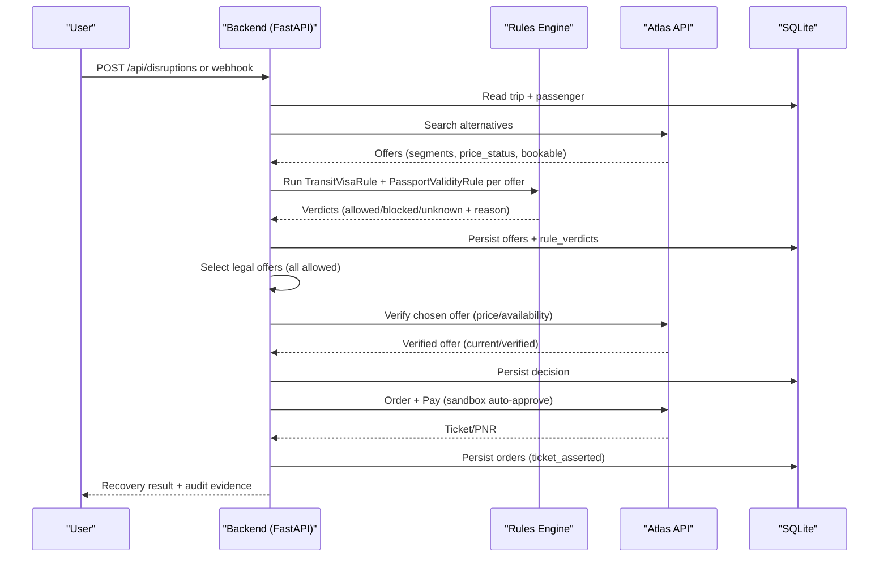
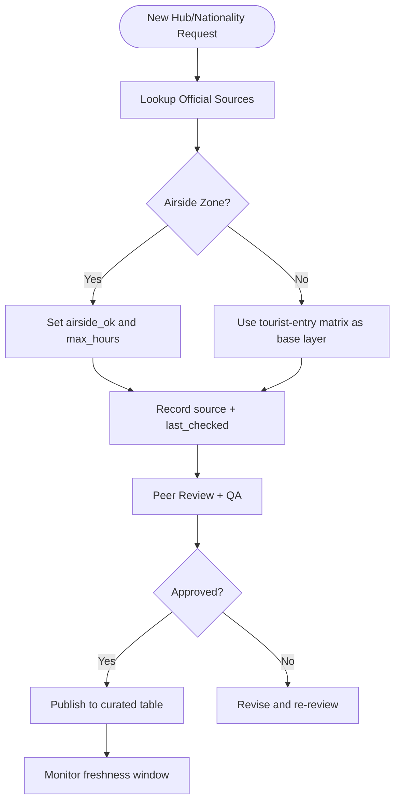
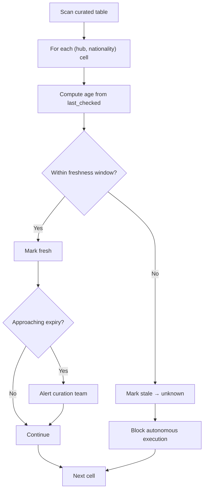
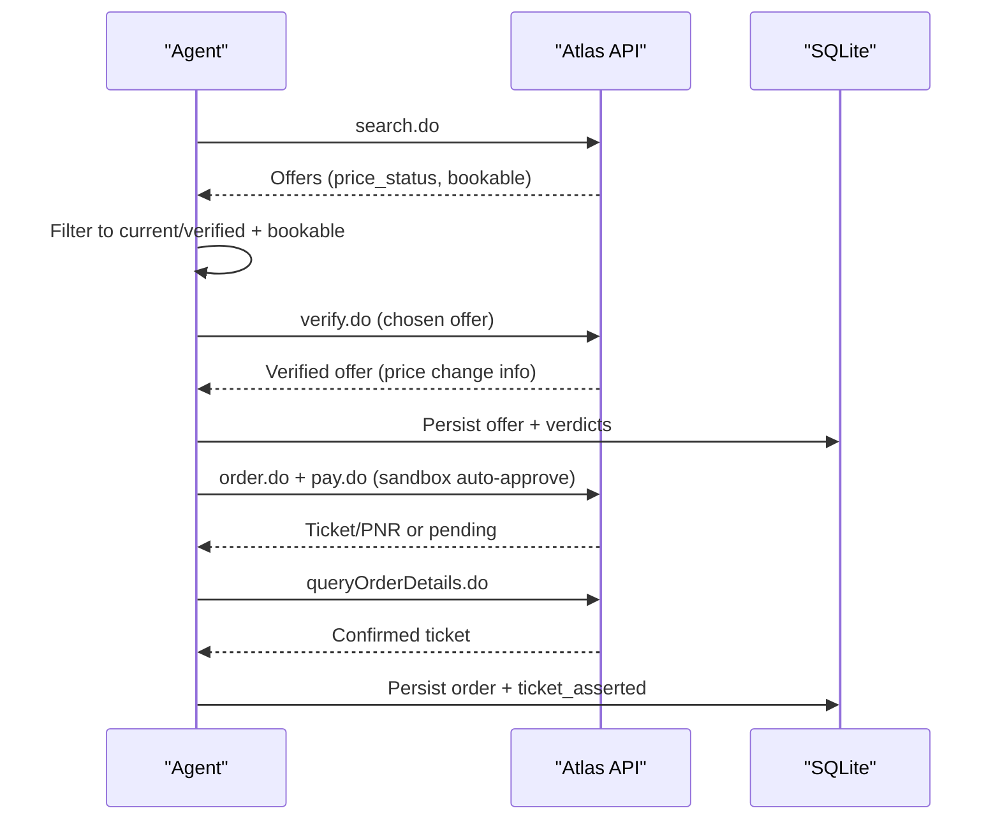
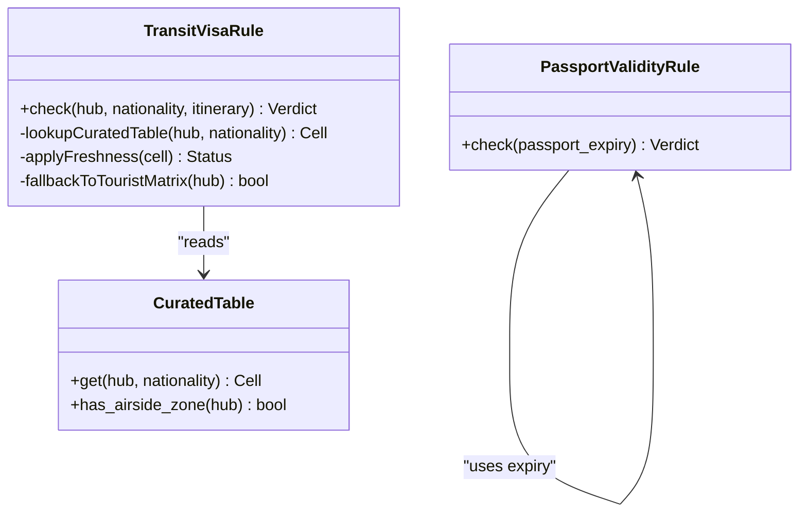
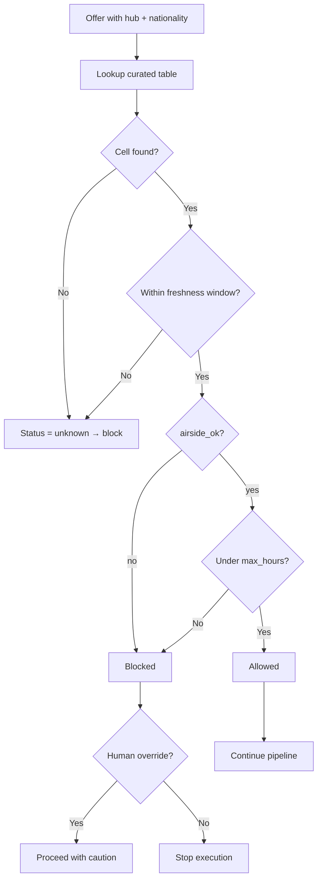
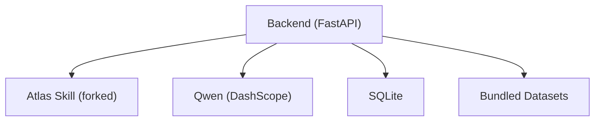

# Data Validation & Verification

<cite>
**Referenced Files in This Document**
- [0002-visa-rules-curated-approximation.md](file://docs/adr/0002-visa-rules-curated-approximation.md)
- [atlas-integration.md](file://docs/external/atlas-integration.md)
- [SKILL.md](file://.agents/skills/atlas-flight-booking/SKILL.md)
- [booking-workflow.md](file://.agents/skills/atlas-flight-booking/references/booking-workflow.md)
- [error-handling.md](file://.agents/skills/atlas-flight-booking/references/error-handling.md)
- [01-product.md](file://docs/plans/waypoint/01-product.md)
- [02-architecture.md](file://docs/plans/waypoint/02-architecture.md)
- [03-program-design.md](file://docs/plans/waypoint/03-program-design.md)
- [QODER-HANDOFF.md](file://docs/plans/waypoint/QODER-HANDOFF.md)
- [skills-lock.json](file://skills-lock.json)
</cite>

## Table of Contents
1. Introduction
2. Project Structure
3. Core Components
4. Architecture Overview
5. Detailed Component Analysis
6. Dependency Analysis
7. Performance Considerations
8. Troubleshooting Guide
9. Conclusion
10. Appendices

## Introduction
This document explains Waypoint’s data validation and verification processes with a focus on:
- Manual curation workflow for transit hub data, including review procedures for new airports and nationality combinations
- Automated freshness checks that monitor data staleness and trigger alerts when entries approach expiration thresholds
- The verification pipeline that validates offer data through the Atlas API before booking to ensure price and seat availability accuracy
- Validation rules for passport validity checking and transit visa compliance
- Handling of data inconsistencies and edge cases, especially for uncurated hubs or nationalities
- Audit trail capabilities that track all data changes and validation decisions for compliance purposes

The system is designed as a rules-aware rebooking engine where deterministic code owns rule checks, fare math, and order execution, while an AI component ranks legal options and narrates decisions.

**Section sources**
- [01-product.md:1-32](file://docs/plans/waypoint/01-product.md#L1-L32)
- [02-architecture.md:1-56](file://docs/plans/waypoint/02-architecture.md#L1-L56)

## Project Structure
Waypoint’s documentation and integration references are organized around:
- ADRs (Architecture Decision Records) defining core policies such as curated transit-visa approximation and fail-closed defaults
- External integration notes describing Atlas API usage, environment setup, and sandbox constraints
- Skill definitions and reference guides for safe booking workflows and error handling
- Program design documents detailing data schemas, test plans, and demo choreography
- Product and architecture overviews outlining endpoints, data models, and end-to-end flows

**Diagram sources**
- [0002-visa-rules-curated-approximation.md:1-25](file://docs/adr/0002-visa-rules-curated-approximation.md#L1-L25)
- [atlas-integration.md:1-37](file://docs/external/atlas-integration.md#L1-L37)
- [SKILL.md:1-71](file://.agents/skills/atlas-flight-booking/SKILL.md#L1-L71)
- [error-handling.md:1-74](file://.agents/skills/atlas-flight-booking/references/error-handling.md#L1-L74)
- [01-product.md:1-32](file://docs/plans/waypoint/01-product.md#L1-L32)
- [02-architecture.md:1-56](file://docs/plans/waypoint/02-architecture.md#L1-L56)
- [03-program-design.md:34-186](file://docs/plans/waypoint/03-program-design.md#L34-L186)

**Section sources**
- [02-architecture.md:13-32](file://docs/plans/waypoint/02-architecture.md#L13-L32)
- [03-program-design.md:34-55](file://docs/plans/waypoint/03-program-design.md#L34-L55)

## Core Components
- Curated Transit Hub Data: A hand-maintained table keyed by (hub × nationality), capturing airside transit eligibility, maximum layover hours, source provenance, and last-checked timestamps. Missing or stale entries resolve to unknown and block autonomous execution.
- Passport Validity Rule: A near-free rule using expiry information already present in the booking payload to reject passports expiring within six months.
- Atlas Offer Verification: A live re-read via Atlas verify immediately before booking to confirm current price and seat availability; only offers with bookable/current status proceed.
- Fail-Closed Execution: Unknown or blocked offers cannot be auto-booked; human override is required.
- Audit Trail: Persisted records of every rule check and decision for compliance and operational review.

**Section sources**
- [0002-visa-rules-curated-approximation.md:9-18](file://docs/adr/0002-visa-rules-curated-approximation.md#L9-L18)
- [03-program-design.md:34-55](file://docs/plans/waypoint/03-program-design.md#L34-L55)
- [02-architecture.md:21-32](file://docs/plans/waypoint/02-architecture.md#L21-L32)
- [SKILL.md:39-53](file://.agents/skills/atlas-flight-booking/SKILL.md#L39-L53)

## Architecture Overview
The validation and verification pipeline integrates curated data, real-time offer verification, and deterministic execution with robust audit logging.

**Diagram sources**
- [02-architecture.md:34-49](file://docs/plans/waypoint/02-architecture.md#L34-L49)
- [atlas-integration.md:15-20](file://docs/external/atlas-integration.md#L15-L20)
- [03-program-design.md:151-169](file://docs/plans/waypoint/03-program-design.md#L151-L169)

**Section sources**
- [02-architecture.md:34-49](file://docs/plans/waypoint/02-architecture.md#L34-L49)

## Detailed Component Analysis

### Manual Curation Workflow for Transit Hub Data
- Data model: Each hub entry includes country, has_airside_zone flag, and a nested map of nationalities. For each nationality, fields include airside_ok (yes/no/unknown), max_hours, source (provenance URL), and last_checked date.
- Review procedure:
  - New airport addition: Validate IATA code, determine has_airside_zone, and populate nationality-specific cells with airside_ok and max_hours based on official sources. Record source and last_checked.
  - New nationality combination: Add or update the cell for the specific (hub, nationality) pair, ensuring airside_ok reflects current policy and max_hours captures hour-gated waivers. Update last_checked.
  - Provenance: Always attach authoritative source links; show per-cell provenance in UI and logs.
- Freshness windows:
  - Airside cells trusted up to 6 months since last_checked
  - Entry-fallback cells trusted up to 3 months since last_checked
  - Past window → treated as unknown → fail-closed (requires human override)
- Coverage strategy: Start with ~6 curated hubs for the demo; scale by curating high-traffic hubs. Long-tail remains honestly unknown.

**Diagram sources**
- [0002-visa-rules-curated-approximation.md:9-18](file://docs/adr/0002-visa-rules-curated-approximation.md#L9-L18)
- [03-program-design.md:34-55](file://docs/plans/waypoint/03-program-design.md#L34-L55)

**Section sources**
- [0002-visa-rules-curated-approximation.md:9-18](file://docs/adr/0002-visa-rules-curated-approximation.md#L9-L18)
- [03-program-design.md:34-55](file://docs/plans/waypoint/03-program-design.md#L34-L55)

### Automated Freshness Checks and Alerts
- Staleness monitoring:
  - Compare last_checked against current date per cell
  - Apply different thresholds: 6 months for airside, 3 months for entry-fallback
  - Flag approaching expiration (e.g., within 30 days) for proactive review
- Alerting:
  - Generate warnings for cells nearing threshold
  - Escalate to curation queue when past threshold
  - Treat expired cells as unknown → fail-closed until refreshed
- Honest boundary:
  - Price/seat availability uses live Atlas verify before booking
  - Visa/transit rules rely on curated table + freshness as proxy; never imply live visa verification

**Diagram sources**
- [0002-visa-rules-curated-approximation.md:16-18](file://docs/adr/0002-visa-rules-curated-approximation.md#L16-L18)
- [03-program-design.md:50-55](file://docs/plans/waypoint/03-program-design.md#L50-L55)

**Section sources**
- [0002-visa-rules-curated-approximation.md:16-18](file://docs/adr/0002-visa-rules-curated-approximation.md#L16-L18)
- [03-program-design.md:50-55](file://docs/plans/waypoint/03-program-design.md#L50-L55)

### Verification Pipeline Through Atlas API Before Booking
- Offer lifecycle:
  - Search returns offers with segments and price_status
  - Only offers with current/verified price_status and bookable=true proceed
  - Re-verify chosen offer immediately before order creation
- Safety checkpoints:
  - Authorization must be complete
  - Price increases require explicit confirmation
  - Optional services (baggage/seat) handled without blocking main flow
  - Payment requires explicit approval; never retry side-effecting operations
- Error handling:
  - Branch on stable codes (e.g., OFFER_EXPIRED, FLIGHT_UNAVAILABLE)
  - Normalize errors and avoid exposing internal causes
  - Query-only recovery for uncertain states

**Diagram sources**
- [atlas-integration.md:15-20](file://docs/external/atlas-integration.md#L15-L20)
- [SKILL.md:39-53](file://.agents/skills/atlas-flight-booking/SKILL.md#L39-L53)
- [booking-workflow.md:1-63](file://.agents/skills/atlas-flight-booking/references/booking-workflow.md#L1-L63)
- [error-handling.md:19-63](file://.agents/skills/atlas-flight-booking/references/error-handling.md#L19-L63)

**Section sources**
- [SKILL.md:39-53](file://.agents/skills/atlas-flight-booking/SKILL.md#L39-L53)
- [booking-workflow.md:1-63](file://.agents/skills/atlas-flight-booking/references/booking-workflow.md#L1-L63)
- [error-handling.md:19-63](file://.agents/skills/atlas-flight-booking/references/error-handling.md#L19-L63)

### Validation Rules: Passport Validity and Transit Visa Compliance
- Passport validity rule:
  - Reject passports expiring within six months
  - Uses expiry already present in booking payload
- Transit visa rule:
  - Two-layer approach: base tourist matrix for entry fallback; authoritative curated table for airside transit
  - Keyed by (hub × nationality); includes airside_ok, max_hours, source, last_checked
  - Fail-closed default: missing/unknown → blocked from autonomous execution
  - Ticket structure (same-ticket vs self-transfer) is secondary messaging only; never flips verdict
- Edge cases:
  - Uncurated hubs or nationalities → unknown → blocked
  - Hour-gated waivers captured via max_hours
  - No live transit-visa API; freshness window acts as honest proxy

**Diagram sources**
- [0002-visa-rules-curated-approximation.md:9-18](file://docs/adr/0002-visa-rules-curated-approximation.md#L9-L18)
- [03-program-design.md:34-55](file://docs/plans/waypoint/03-program-design.md#L34-L55)
- [02-architecture.md:21-32](file://docs/plans/waypoint/02-architecture.md#L21-L32)

**Section sources**
- [0002-visa-rules-curated-approximation.md:9-18](file://docs/adr/0002-visa-rules-curated-approximation.md#L9-L18)
- [03-program-design.md:34-55](file://docs/plans/waypoint/03-program-design.md#L34-L55)
- [02-architecture.md:21-32](file://docs/plans/waypoint/02-architecture.md#L21-L32)

### Handling Data Inconsistencies and Edge Cases
- Uncurated hubs/nationalities:
  - Resolve to unknown → block autonomous execution
  - Require human override to proceed
- Stale data:
  - Past freshness window → treat as unknown → fail-closed
- Ticket structure ambiguity:
  - Same-ticket vs self-transfer influences messaging but not verdict
- Demo constraints:
  - Scripted routes must include both a trap (airside_ok:no) and a legal pick (airside_ok:yes)
  - Fail-closed ensures no uncurated hub is booked

**Diagram sources**
- [0002-visa-rules-curated-approximation.md:14-18](file://docs/adr/0002-visa-rules-curated-approximation.md#L14-L18)
- [03-program-design.md:181-185](file://docs/plans/waypoint/03-program-design.md#L181-L185)

**Section sources**
- [0002-visa-rules-curated-approximation.md:14-18](file://docs/adr/0002-visa-rules-curated-approximation.md#L14-L18)
- [03-program-design.md:181-185](file://docs/plans/waypoint/03-program-design.md#L181-L185)

### Audit Trail Capabilities
- Persistence:
  - rule_verdicts: per-offer rule checks with allowed/blocked/unknown and reasons
  - decisions: chosen offer, rejected cheapest, rationale, step count, timestamp
  - orders: atlas_order_no, pnr, ticket_number, fare_diff, settled, ticket_asserted
- Compliance:
  - Every rule check recorded; decisions auditable
  - Evidence supports operating scale and compliance reviews
- Visibility:
  - SSE stream exposes agent reasoning steps
  - UI shows per-cell provenance and freshness indicators

**Diagram sources**
- [02-architecture.md:21-32](file://docs/plans/waypoint/02-architecture.md#L21-L32)

**Section sources**
- [02-architecture.md:21-32](file://docs/plans/waypoint/02-architecture.md#L21-L32)

## Dependency Analysis
Waypoint depends on:
- Atlas Flight Booking Skill (forked) for search, verify, order, payment, and ticketing
- Qwen via DashScope for reroute judgment
- SQLite for local persistence of trips, offers, verdicts, decisions, and orders
- Bundled datasets: passport-index matrix, curated transit-hub table, IATA→country mapping

**Diagram sources**
- [02-architecture.md:1-12](file://docs/plans/waypoint/02-architecture.md#L1-L12)
- [skills-lock.json:1-12](file://skills-lock.json#L1-L12)

**Section sources**
- [02-architecture.md:1-12](file://docs/plans/waypoint/02-architecture.md#L1-L12)
- [skills-lock.json:1-12](file://skills-lock.json#L1-L12)

## Performance Considerations
- Minimize unnecessary Atlas calls: reuse verified offers within a bounded step budget
- Cache curated table lookups in memory during a recovery session
- Batch rule checks across offers to reduce overhead
- Prefer direct library integration for Atlas skill to avoid subprocess latency
- Use SSE streaming to keep frontend responsive without polling

[No sources needed since this section provides general guidance]

## Troubleshooting Guide
Common issues and resolutions:
- Authorization required: Follow login flow; poll once after user confirms completion
- Ticketing activation required: Direct user to ATRIP workspace to complete activation
- Offer expired or flight unavailable: Replay search once; collect new inputs if necessary
- Price increased: Present old/new totals; obtain explicit confirmation before proceeding
- Payment balance insufficient: Explain and do not retry payment; show order link when available
- Uncertain state: Query order status; never repeat side-effecting operations

**Section sources**
- [error-handling.md:7-17](file://.agents/skills/atlas-flight-booking/references/error-handling.md#L7-L17)
- [error-handling.md:19-63](file://.agents/skills/atlas-flight-booking/references/error-handling.md#L19-L63)
- [booking-workflow.md:1-63](file://.agents/skills/atlas-flight-booking/references/booking-workflow.md#L1-L63)

## Conclusion
Waypoint’s data validation and verification framework combines curated transit hub data, strict freshness controls, and live Atlas offer verification to ensure bookings are both legally compliant and operationally sound. The fail-closed policy protects against uncurated or stale data, while comprehensive audit trails support compliance and operational transparency. By separating deterministic execution from AI-driven ranking, the system maintains correctness and scalability.

[No sources needed since this section summarizes without analyzing specific files]

## Appendices

### Appendix A: Curated Data Schema Reference
- Hub-level fields: country, has_airside_zone
- Nationality-level fields: airside_ok (yes/no/unknown), max_hours, source, last_checked
- Lookup miss → unknown → blocked from execute
- Freshness: airside ≤ 6 months; entry-fallback ≤ 3 months

**Section sources**
- [03-program-design.md:34-55](file://docs/plans/waypoint/03-program-design.md#L34-L55)

### Appendix B: Atlas API Surface Summary
- Flow: search → verify → order → pay → queryOrderDetails
- Offer fields: segments, price_status (reference vs current/verified), bookable
- Environment: sandbox-only auto-approve for price/payment checkpoints

**Section sources**
- [atlas-integration.md:15-20](file://docs/external/atlas-integration.md#L15-L20)
- [SKILL.md:39-53](file://.agents/skills/atlas-flight-booking/SKILL.md#L39-L53)

### Appendix C: Test Plan Highlights
- Visa rule tests: blocked when airside=no; allowed when yes within max_hours; unknown when hub not curated; cell past freshness becomes unknown
- Passport validity tests: blocks expiry within six months; allows valid
- Execute wall: rejects blocked/unknown; picks cheapest executable; reverifies before booking; asserts ticket before success

**Section sources**
- [03-program-design.md:151-169](file://docs/plans/waypoint/03-program-design.md#L151-L169)