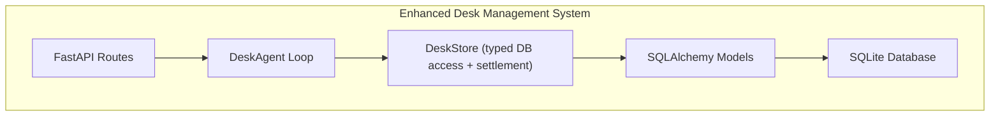
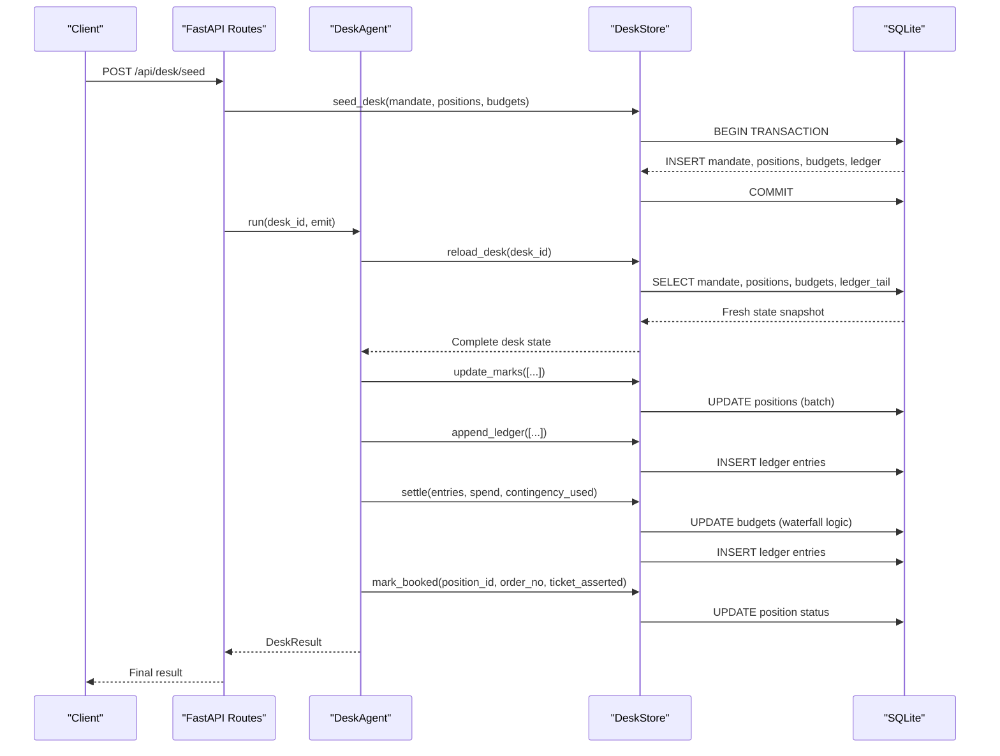
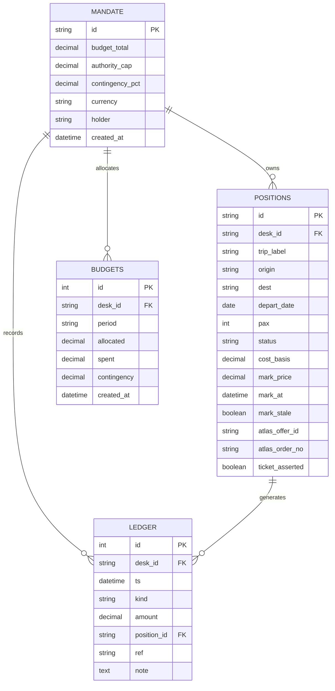
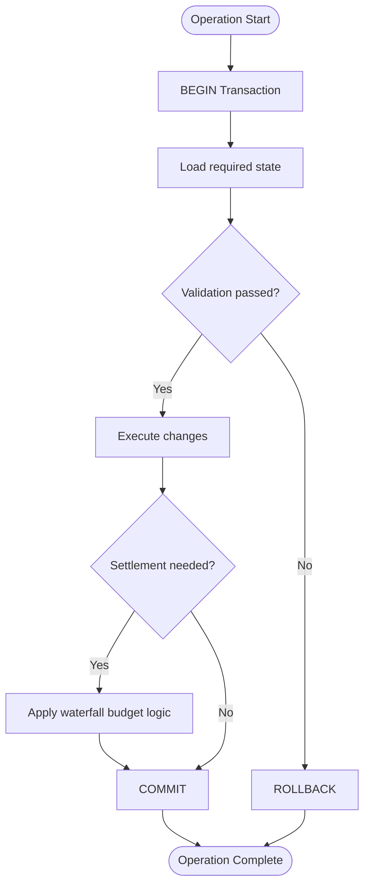
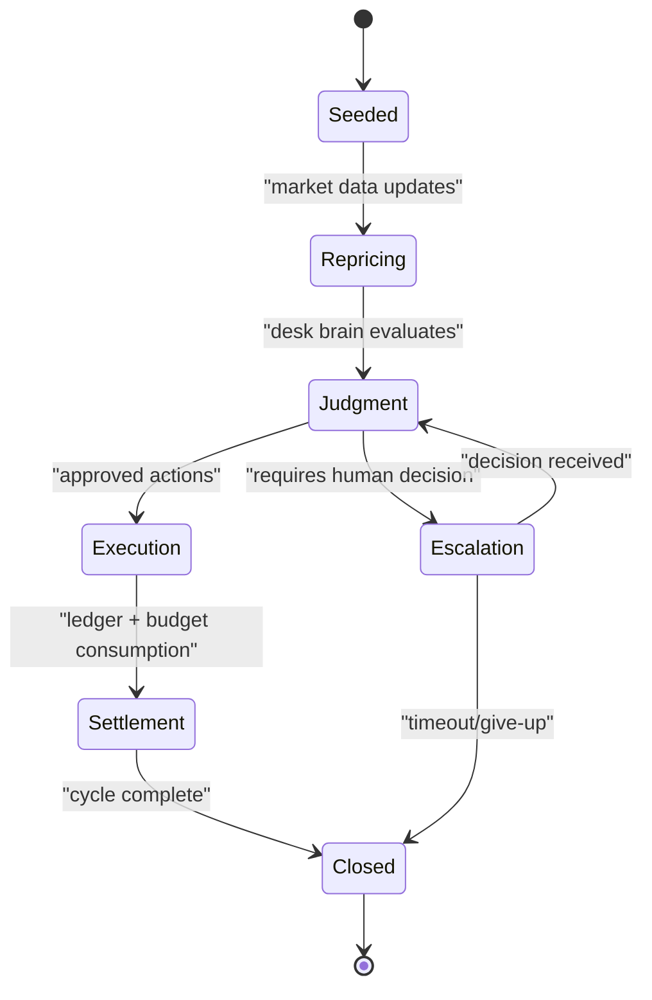
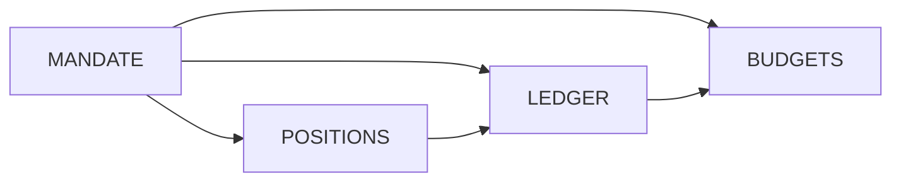

# Database Schema Design

<cite>
**Referenced Files in This Document**
- [schema.py](file://backend/app/db/schema.py)
- [store.py](file://backend/app/db/store.py)
- [database.py](file://backend/app/db/database.py)
- [models.py](file://backend/app/models.py)
- [routes.py](file://backend/app/api/routes.py)
- [fixture.py](file://backend/app/fixture.py)
- [loop.py](file://backend/app/agent/loop.py)
- [02-architecture.md](file://docs/plans/waypoint/02-architecture.md)
</cite>

## Update Summary
**Changes Made**
- Enhanced settlement process with atomic budget consumption and contingency tracking
- Added comprehensive documentation for LedgerInput and MarkUpdate structures
- Updated persistence layer architecture to document new settle method
- Expanded financial transaction tracking with waterfall spending logic
- Added detailed examples of settlement workflow and budget management patterns
- Enhanced indexing strategies for performance optimization across cycles

## Table of Contents
1. [Introduction](#introduction)
2. [Project Structure](#project-structure)
3. [Core Components](#core-components)
4. [Architecture Overview](#architecture-overview)
5. [Detailed Component Analysis](#detailed-component-analysis)
6. [Dependency Analysis](#dependency-analysis)
7. [Performance Considerations](#performance-considerations)
8. [Troubleshooting Guide](#troubleshooting-guide)
9. [Conclusion](#conclusion)
10. [Appendices](#appendices)

## Introduction
This document specifies the database schema design for Waypoint's SQLite storage system using the enhanced DeskStore implementation with advanced settlement capabilities. The schema centers around a desk-based data model that persists mandate information, travel positions, audit trails through a ledger system, and budget allocations with sophisticated settlement processing.

The system provides transactional persistence through the DeskStore class, which ensures atomic operations and maintains data integrity across complex workflows involving reprice updates, booking confirmations, and comprehensive ledger entries with budget consumption tracking.

**Updated** Enhanced settlement process now persists budget consumption and contingency usage across cycles, ensuring financial state consistency even after system restarts.

## Project Structure
The backend implements a complete desk management system with FastAPI routes, an agent loop for orchestration, and SQLite persistence through SQLAlchemy ORM with enhanced settlement capabilities. The schema is defined in dedicated modules with clear separation between database models, business logic, and API endpoints.



**Section sources**
- [routes.py:1-13](file://backend/app/api/routes.py#L1-L13)
- [store.py:1-10](file://backend/app/db/store.py#L1-L10)
- [schema.py:1-7](file://backend/app/db/schema.py#L1-L7)

## Core Components
The desk-based data model consists of four primary entities that work together to manage travel portfolios with enhanced settlement capabilities:

- **Mandate**: Represents a desk's authority and constraints including budget limits, spending caps, contingency percentages, currency, and holder information
- **Position**: Individual travel holdings with origin/destination details, passenger counts, cost basis tracking, current market prices, and booking status
- **Ledger**: Immutable audit trail recording all financial events including trades, allocations, reconciliations, losses, and adjustments with settlement integration
- **Budgets**: Period-based budget allocations with sophisticated spending tracking, contingency reserves, and automated consumption waterfall logic

Each component supports the desk workflow from initial seeding through active trading and final settlement, with comprehensive audit capabilities through the ledger system and persistent budget state management.

**Updated** Enhanced settlement process now atomically persists both ledger entries and budget consumption changes, ensuring financial state consistency across system restarts and multiple cycles.

**Section sources**
- [models.py:83-126](file://backend/app/models.py#L83-L126)
- [schema.py:33-102](file://backend/app/db/schema.py#L33-L102)

## Architecture Overview
The desk system follows a transactional pattern where every operation maintains data consistency through atomic sessions. The DeskStore acts as a pure-sync facade over the database, ensuring thread safety while allowing async operations to run without blocking the event loop.

**Updated** The settlement process now provides atomic budget consumption tracking with waterfall logic that distributes spending across budget periods and manages contingency usage automatically.



**Diagram sources**
- [routes.py:123-139](file://backend/app/api/routes.py#L123-L139)
- [store.py:106-171](file://backend/app/db/store.py#L106-L171)
- [store.py:173-218](file://backend/app/db/store.py#L173-L218)
- [store.py:251-304](file://backend/app/db/store.py#L251-L304)

## Detailed Component Analysis

### Entity Relationship Model
The desk-based schema establishes clear relationships between mandates, positions, ledger entries, and budgets with enhanced settlement integration. Each desk operates independently with its own mandate serving as the root entity.



**Diagram sources**
- [schema.py:33-102](file://backend/app/db/schema.py#L33-L102)
- [models.py:83-126](file://backend/app/models.py#L83-L126)

### Mandate Management
The mandate serves as the desk's identity and constraint definition. It contains budget totals, authority caps for individual transactions, contingency percentages, currency settings, and holder information. The mandate ID doubles as the desk ID, creating a one-to-one relationship between mandates and desks.

Key features include:
- Budget total limiting overall desk exposure
- Authority cap controlling maximum single transaction size
- Contingency percentage for risk buffer calculations
- Currency specification for multi-currency support
- Holder identification for accountability

**Section sources**
- [schema.py:33-46](file://backend/app/db/schema.py#L33-L46)
- [models.py:83-96](file://backend/app/models.py#L83-L96)

### Position Tracking
Positions represent individual travel holdings with comprehensive tracking of acquisition costs, current market values, and booking status. Each position maintains both historical cost basis and real-time mark prices, enabling P&L calculations and risk assessment.

Position lifecycle includes:
- Initial creation with seeded cost basis
- Regular mark price updates from market data via MarkUpdate structures
- Status transitions from "held" to "booked" upon successful ticketing
- External reference tracking via Atlas offer and order IDs
- Ticket assertion verification for compliance

**Updated** Enhanced MarkUpdate structures now support batch operations with optional Atlas offer ID tracking for improved reconciliation capabilities.

**Section sources**
- [schema.py:49-70](file://backend/app/db/schema.py#L49-L70)
- [models.py:98-115](file://backend/app/models.py#L98-L115)

### Ledger Audit Trail
The ledger provides an immutable audit trail of all desk activities, recording every financial event with timestamps, amounts, and contextual information. This blotter system ensures full compliance and auditability of all desk operations.

Ledger entry types include:
- **trade**: Actual booking transactions
- **alloc**: Budget allocation events
- **reconcile**: Reconciliation adjustments
- **loss**: Loss recognition entries
- **adjust**: Manual adjustments or corrections

Each entry captures the desk context, optional position linkage, external references, and detailed notes for traceability.

**Updated** Enhanced settlement process now integrates ledger entries with budget consumption tracking, providing complete financial audit trails across multiple cycles.

**Section sources**
- [schema.py:72-88](file://backend/app/db/schema.py#L72-L88)

### Budget Management
Budgets provide period-based allocation tracking with sophisticated spending monitoring and contingency reserves. Multiple budget periods can exist per desk, enabling granular financial control and reporting.

Budget components include:
- Period identification for time-based tracking
- Allocated amounts representing approved spending limits
- Spent amounts tracking actual usage with automatic settlement integration
- Contingency reserves for unexpected expenses with automated consumption
- Creation timestamps for audit purposes

**Updated** Enhanced settlement process now includes waterfall logic that automatically distributes spending across budget periods and manages contingency usage atomically within transactions.

**Section sources**
- [schema.py:91-102](file://backend/app/db/schema.py#L91-L102)
- [models.py:117-126](file://backend/app/models.py#L117-L126)

### Persistence Layer Architecture (DeskStore)
The DeskStore class provides typed, transactional access to the database with several key architectural patterns and enhanced settlement capabilities:

**Session Management**: Each operation creates a fresh database session, ensuring isolation and preventing connection leaks. Sessions are wrapped in context managers for automatic cleanup.

**Guard Pattern**: The `reload_desk` method implements a "re-read the world" checkpoint that loads mandate, positions, budgets, and recent ledger entries in a single transaction, preventing stale state issues.

**Batch Operations**: Methods like `update_marks` and `append_ledger` support batch operations within single transactions, improving performance and maintaining consistency.

**Settlement Processing**: The new `settle` method provides atomic budget consumption tracking with waterfall logic that distributes spending across budget periods and manages contingency usage automatically.

**Error Handling**: Operations raise appropriate exceptions (KeyError for missing entities) and handle edge cases gracefully without crashing the entire workflow.

**Updated** Enhanced settlement process now provides comprehensive budget consumption tracking with waterfall logic that ensures financial state consistency across system restarts and multiple cycles.



**Diagram sources**
- [store.py:103-285](file://backend/app/db/store.py#L103-L285)
- [store.py:251-304](file://backend/app/db/store.py#L251-L304)

**Section sources**
- [store.py:103-285](file://backend/app/db/store.py#L103-L285)

### Data Flow: Enhanced Settlement Workflow
The desk cycle now includes enhanced settlement processing that ensures proper sequencing of operations and maintains data consistency throughout the process with atomic budget consumption tracking.



**Updated** Enhanced settlement process now atomically persists both ledger entries and budget consumption changes, ensuring financial state consistency across system restarts.

**Diagram sources**
- [routes.py:97-109](file://backend/app/api/routes.py#L97-L109)
- [store.py:173-218](file://backend/app/db/store.py#L173-L218)
- [store.py:251-304](file://backend/app/db/store.py#L251-L304)

**Section sources**
- [routes.py:97-109](file://backend/app/api/routes.py#L97-L109)
- [store.py:173-218](file://backend/app/db/store.py#L173-L218)
- [store.py:251-304](file://backend/app/db/store.py#L251-L304)

## Dependency Analysis
The desk schema establishes clear dependency relationships that ensure data integrity and support efficient querying patterns with enhanced settlement integration:

- **Mandate Dependencies**: All other entities depend on mandate for desk context and constraint enforcement
- **Position Dependencies**: Positions depend on mandate but can exist independently with no bookings
- **Ledger Dependencies**: Ledger entries depend on mandate and optionally link to specific positions
- **Budget Dependencies**: Budgets depend on mandate for period-based allocation tracking with settlement integration

Query patterns leverage these dependencies for common operations like desk state retrieval, position filtering, and financial reporting with enhanced settlement capabilities.

**Updated** Enhanced settlement process now creates additional dependencies between ledger entries and budget consumption, ensuring complete financial audit trails.



**Diagram sources**
- [schema.py:33-102](file://backend/app/db/schema.py#L33-L102)

**Section sources**
- [schema.py:33-102](file://backend/app/db/schema.py#L33-L102)

## Performance Considerations
The desk schema includes strategic indexing and optimization patterns for common query scenarios with enhanced settlement processing:

### Indexes
- **positions.desk_id**: Efficient filtering of positions by desk
- **ledger.desk_id + ts**: Optimized for retrieving recent ledger entries per desk
- **positions.id**: Primary key index for fast position lookups
- **ledger.id**: Auto-incrementing primary key for sequential ledger access

### Constraints
- **Foreign Key Relationships**: Enforce referential integrity between related entities
- **Data Type Validation**: Decimal precision for financial calculations (Numeric(12,2))
- **Boolean Flags**: Explicit status fields for positions and ledger entries
- **Timestamp Defaults**: Automatic UTC timestamp generation for audit trails

### Query Optimization Patterns
- **Desk State Retrieval**: Single transaction loading mandate, positions, budgets, and ledger tail
- **Position Updates**: Batch mark price updates minimize database round trips
- **Ledger Appending**: Sequential writes with auto-incrementing IDs for optimal performance
- **Filtering Queries**: Indexed columns enable efficient desk-specific queries
- **Settlement Processing**: Atomic budget consumption with waterfall logic minimizes database operations

**Updated** Enhanced settlement process now uses optimized waterfall logic that processes budget consumption in a single transaction, reducing database overhead and ensuring consistency.

[No sources needed since this section provides general guidance based on schema analysis]

## Troubleshooting Guide
Common issues and diagnostic approaches for the desk system with enhanced settlement capabilities:

### Missing Desk State
- **Symptom**: KeyError when accessing unknown desk_id
- **Action**: Verify desk seeding completed successfully; check mandate existence
- **Prevention**: Always seed desk before starting cycles

### Stale Position Data
- **Symptom**: Outdated mark prices or incorrect booking status
- **Action**: Use reload_desk to refresh state; verify update_marks operations
- **Prevention**: Implement regular reprice cycles with proper error handling

### Ledger Inconsistencies
- **Symptom**: Mismatched financial totals or missing audit entries
- **Action**: Review ledger entries for completeness; verify transaction boundaries
- **Prevention**: Ensure all financial operations append corresponding ledger entries

### Budget Overruns
- **Symptom**: Transactions exceeding allocated budgets or authority caps
- **Action**: Check budget allocations and authority cap settings; review desk constraints
- **Prevention**: Implement pre-transaction budget validation with enhanced settlement checks

### Settlement Issues
- **Symptom**: Incorrect budget consumption or missing contingency tracking
- **Action**: Review settle method calls; verify waterfall logic execution
- **Prevention**: Ensure settlement is called with correct parameters and handles edge cases

### Connection Issues
- **Symptom**: Database connection errors or session timeouts
- **Action**: Verify SQLite file accessibility; check connection parameters
- **Prevention**: Implement connection pooling and retry logic

**Updated** Enhanced troubleshooting now includes settlement-specific issues with budget consumption and contingency tracking problems.

**Section sources**
- [store.py:173-218](file://backend/app/db/store.py#L173-L218)
- [store.py:220-285](file://backend/app/db/store.py#L220-L285)
- [store.py:251-304](file://backend/app/db/store.py#L251-L304)

## Conclusion
The Waypoint desk-based database schema provides a robust foundation for managing travel portfolios with comprehensive audit capabilities and transactional integrity. The shift from trip-centric to desk-based modeling enables flexible portfolio management while maintaining strict financial controls through mandate constraints and budget allocations.

The enhanced DeskStore implementation ensures data consistency through careful session management, guard patterns, batch operations, and sophisticated settlement processing. The settlement process now atomically persists both ledger entries and budget consumption changes, ensuring financial state consistency across system restarts and multiple cycles.

The ledger system provides complete audit trails for compliance and regulatory requirements, while the position tracking system enables real-time P&L calculation and risk assessment. The enhanced settlement capabilities provide sophisticated budget consumption tracking with waterfall logic that automatically distributes spending across budget periods and manages contingency usage.

This architecture supports scalable desk operations with efficient querying patterns, proper indexing strategies, comprehensive error handling, and enhanced settlement processing. The separation of concerns between API routes, agent logic, and persistence layer enables maintainable and testable code organization.

**Updated** Enhanced settlement capabilities now provide comprehensive financial state management with atomic budget consumption tracking, ensuring data integrity across system restarts and multiple operational cycles.

## Appendices

### A. Example Queries and Access Patterns
Common operations using the desk schema with enhanced settlement capabilities:

**Retrieve Complete Desk State:**
```python
mandate, positions, budgets, ledger_tail = store.reload_desk(desk_id)
```

**Update Position Mark Prices:**
```python
marks = [MarkUpdate(position_id=pos_id, mark_price=new_price, mark_at=now)]
store.update_marks(desk_id, marks)
```

**Record Financial Event:**
```python
entries = [LedgerInput(kind="trade", amount=Decimal("1500.00"), position_id=pos_id, note="Booking confirmed")]
store.append_ledger(desk_id, entries)
```

**Process Settlement with Budget Consumption:**
```python
store.settle(
    desk_id, 
    entries=[LedgerInput(kind="trade", amount=Decimal("1500.00"))],
    spend=Decimal("1500.00"),
    contingency_used=Decimal("75.00")
)
```

**Confirm Booking:**
```python
store.mark_booked(position_id, order_no, ticket_asserted=True)
```

**Get Desk Snapshot:**
```python
snapshot = store.desk_state(desk_id)
```

**Updated** Enhanced examples now include settlement processing with budget consumption and contingency tracking.

**Section sources**
- [store.py:251-304](file://backend/app/db/store.py#L251-L304)

### B. Alignment with Two-Gate Policy
The desk schema supports the two-gate policy through:

- **Advise Gate**: Positions track potential opportunities with mark prices and cost basis for evaluation
- **Execute Gate**: Ledger entries record only confirmed actions after approval
- **Audit Trail**: Complete history of decisions and outcomes through immutable ledger entries
- **Budget Controls**: Mandate constraints enforce spending limits at execution time with enhanced settlement tracking

**Updated** Enhanced settlement process now provides comprehensive budget consumption tracking that enforces spending limits across multiple operational cycles.

**Section sources**
- [02-architecture.md:25-30](file://docs/plans/waypoint/02-architecture.md#L25-L30)

### C. Seeded Portfolio Structure
The demo portfolio includes 6 positions across different routes with varying characteristics:

- Regional sales runs with moderate margins
- Escalation demo positions for testing escalation workflows  
- Transatlantic client visits with standard pricing
- Team offsite legs with group booking considerations
- Conference return flights with timing constraints
- Planning trips with budget optimization focus

Each position includes realistic cost bases, current market prices, and appropriate passenger counts for testing various scenarios.

**Updated** Enhanced settlement capabilities now provide comprehensive budget consumption tracking across multiple budget periods with waterfall logic.

**Section sources**
- [fixture.py:60-145](file://backend/app/fixture.py#L60-L145)

### D. Enhanced Settlement Process Details
The settlement process provides sophisticated financial state management with the following capabilities:

**Waterfall Budget Logic**: Automatically distributes spending across budget periods, respecting allocation limits and maintaining accurate spent amounts.

**Contingency Management**: Tracks contingency usage with automatic deduction from available contingency reserves.

**Atomic Transactions**: Ensures both ledger entries and budget updates occur in a single transaction, preventing partial state updates.

**Cross-Cycle Persistence**: Maintains financial state consistency across system restarts and multiple operational cycles.

**Updated** Enhanced settlement process now provides comprehensive financial state management with atomic budget consumption tracking and cross-cycle persistence capabilities.

**Section sources**
- [store.py:251-304](file://backend/app/db/store.py#L251-L304)