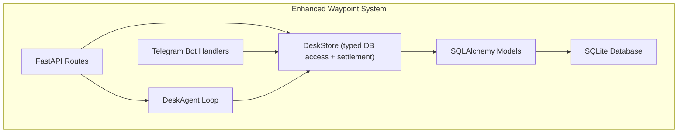
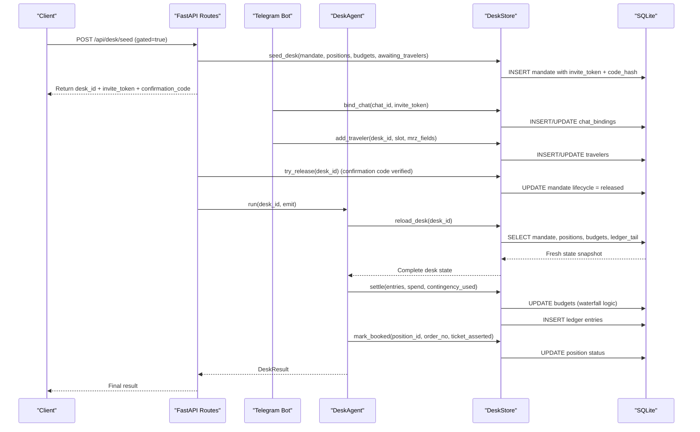
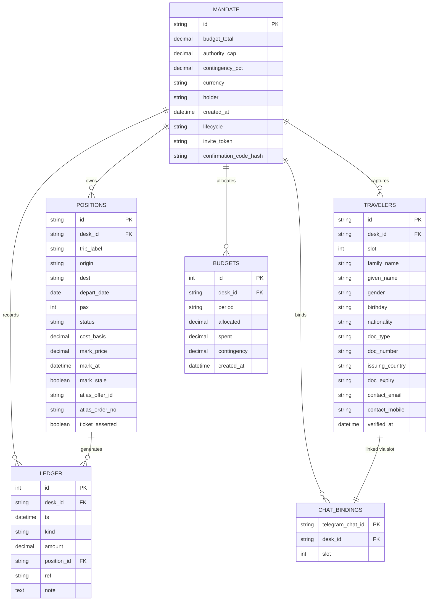
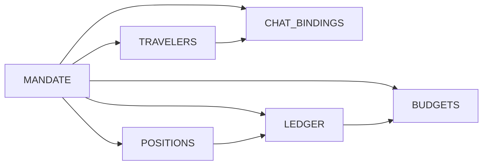
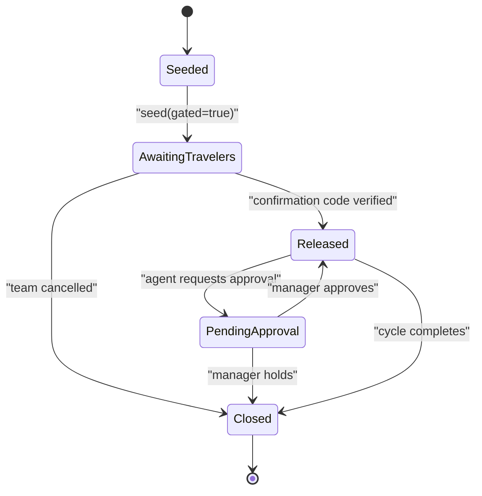

</think>

Based on my analysis of the codebase, I can now update the database schema documentation to reflect the new Waybot workflow support with TravelerRow, ChatBindingRow, and enhanced MandateRow fields. Here's the updated documentation:

# Database Schema Design

<cite>
**Referenced Files in This Document**
- [schema.py](file://backend/app/db/schema.py)
- [store.py](file://backend/app/db/store.py)
- [database.py](file://backend/app/db/database.py)
- [models.py](file://backend/app/models.py)
- [routes.py](file://backend/app/api/routes.py)
- [handlers.py](file://backend/app/bot/handlers.py)
- [02-architecture.md](file://docs/plans/waypoint/02-architecture.md)
</cite>

## Update Summary
**Changes Made**
- Added comprehensive documentation for new Waybot workflow tables: TravelerRow and ChatBindingRow
- Enhanced MandateRow documentation with new lifecycle management and approval workflow fields
- Updated persistence layer architecture to include traveler capture and chat binding workflows
- Added detailed examples of Waybot workflow integration patterns
- Expanded indexing strategies to support invite token lookups and chat binding operations
- Enhanced security considerations for traveler data handling and confirmation code management

## Table of Contents
1. [Introduction](#introduction)
2. [Project Structure](#project-structure)
3. [Core Components](#core-components)
4. [Architecture Overview](#architecture-overview)
5. [Detailed Component Analysis](#detailed-component-analysis)
6. [Waybot Workflow Integration](#waybot-workflow-integration)
7. [Dependency Analysis](#dependency-analysis)
8. [Performance Considerations](#performance-considerations)
9. [Security Considerations](#security-considerations)
10. [Troubleshooting Guide](#troubleshooting-guide)
11. [Conclusion](#conclusion)
12. [Appendices](#appendices)

## Introduction
This document specifies the database schema design for Waypoint's SQLite storage system using the enhanced DeskStore implementation with comprehensive Waybot workflow support. The schema centers around a desk-based data model that persists mandate information, travel positions, audit trails through a ledger system, budget allocations, and now includes sophisticated traveler identity capture and Telegram chat binding capabilities for autonomous booking workflows.

The system provides transactional persistence through the DeskStore class, which ensures atomic operations and maintains data integrity across complex workflows involving reprice updates, booking confirmations, traveler identity verification, and comprehensive ledger entries with budget consumption tracking.

**Updated** Enhanced Waybot workflow now supports complete traveler identity capture through Telegram chat bindings, secure confirmation code management, and lifecycle-gated desk operations that ensure proper sequencing from team member onboarding through final booking approval.

## Project Structure
The backend implements a complete desk management system with FastAPI routes, an agent loop for orchestration, Telegram bot handlers for traveler interaction, and SQLite persistence through SQLAlchemy ORM with comprehensive Waybot workflow support. The schema is defined in dedicated modules with clear separation between database models, business logic, API endpoints, and bot interaction handlers.



**Section sources**
- [routes.py:1-13](file://backend/app/api/routes.py#L1-L13)
- [handlers.py:1-30](file://backend/app/bot/handlers.py#L1-L30)
- [store.py:1-10](file://backend/app/db/store.py#L1-L10)
- [schema.py:1-7](file://backend/app/db/schema.py#L1-L7)

## Core Components
The desk-based data model consists of six primary entities that work together to manage travel portfolios with comprehensive Waybot workflow support:

- **Mandate**: Represents a desk's authority and constraints including budget limits, spending caps, contingency percentages, currency, holder information, and Waybot lifecycle state management
- **Position**: Individual travel holdings with origin/destination details, passenger counts, cost basis tracking, current market prices, and booking status
- **Traveler**: Captured traveler identity information extracted from passport MRZ data, linked to specific desk slots with verification timestamps
- **ChatBinding**: Secure mapping between Telegram chat sessions and traveler slots, enabling individual traveler communication and identity submission
- **Ledger**: Immutable audit trail recording all financial events including trades, allocations, reconciliations, losses, and adjustments with settlement integration
- **Budgets**: Period-based budget allocations with sophisticated spending tracking, contingency reserves, and automated consumption waterfall logic

Each component supports the complete desk workflow from initial seeding through active trading, traveler onboarding, and final settlement, with comprehensive audit capabilities through the ledger system and persistent budget state management.

**Updated** Enhanced Waybot workflow now provides complete traveler identity capture pipeline with secure chat bindings, MRZ validation, and lifecycle-gated desk operations that ensure proper team member onboarding before cycle execution.

**Section sources**
- [models.py:83-126](file://backend/app/models.py#L83-L126)
- [schema.py:33-181](file://backend/app/db/schema.py#L33-L181)

## Architecture Overview
The desk system follows a transactional pattern where every operation maintains data consistency through atomic sessions. The DeskStore acts as a pure-sync facade over the database, ensuring thread safety while allowing async operations to run without blocking the event loop.

**Updated** The Waybot workflow now provides complete lifecycle management with gated desk operations, secure confirmation codes, and integrated traveler identity capture through Telegram chat bindings.



**Diagram sources**
- [routes.py:371-430](file://backend/app/api/routes.py#L371-L430)
- [handlers.py:92-132](file://backend/app/bot/handlers.py#L92-L132)
- [store.py:154-237](file://backend/app/db/store.py#L154-L237)
- [store.py:456-518](file://backend/app/db/store.py#L456-L518)
- [store.py:520-601](file://backend/app/db/store.py#L520-L601)

## Detailed Component Analysis

### Entity Relationship Model
The desk-based schema establishes clear relationships between mandates, positions, travelers, chat bindings, ledger entries, and budgets with comprehensive Waybot workflow integration. Each desk operates independently with its own mandate serving as the root entity.



**Diagram sources**
- [schema.py:33-181](file://backend/app/db/schema.py#L33-L181)
- [models.py:83-126](file://backend/app/models.py#L83-L126)

### Mandate Management with Waybot Lifecycle
The mandate serves as the desk's identity and constraint definition with enhanced Waybot workflow support. It contains budget totals, authority caps for individual transactions, contingency percentages, currency settings, holder information, and sophisticated lifecycle management for gated operations.

Key features include:
- Budget total limiting overall desk exposure
- Authority cap controlling maximum single transaction size
- Contingency percentage for risk buffer calculations
- Currency specification for multi-currency support
- Holder identification for accountability
- **Waybot Lifecycle State**: `awaiting_travelers`, `released`, `pending_approval`, `closed`
- **Secure Invite Tokens**: URL-safe deep-link tokens for traveler onboarding
- **Confirmation Code Management**: Salted hash storage for release authorization
- **Approval Workflow Support**: Pinned offer tracking and per-round approval tokens
- **Policy Filtering**: JSON-structured policy constraints for search filtering
- **Reapproval Management**: Controlled reapproval cycles for edge cases
- **Attempt Tracking**: Security throttling for confirmation code attempts

**Updated** Enhanced MandateRow now provides complete Waybot workflow support with lifecycle state management, secure invitation system, and approval workflow integration that gates desk operations until proper team member onboarding is complete.

**Section sources**
- [schema.py:33-85](file://backend/app/db/schema.py#L33-L85)
- [models.py:83-99](file://backend/app/models.py#L83-L99)

### Position Tracking
Positions represent individual travel holdings with comprehensive tracking of acquisition costs, current market values, and booking status. Each position maintains both historical cost basis and real-time mark prices, enabling P&L calculations and risk assessment.

Position lifecycle includes:
- Initial creation with seeded cost basis
- Regular mark price updates from market data via MarkUpdate structures
- Status transitions from "held" to "booked" upon successful ticketing
- External reference tracking via Atlas offer and order IDs
- Ticket assertion verification for compliance

**Updated** Enhanced MarkUpdate structures now support batch operations with optional Atlas offer ID tracking for improved reconciliation capabilities.

**Section sources**
- [schema.py:87-108](file://backend/app/db/schema.py#L87-L108)
- [models.py:102-119](file://backend/app/models.py#L102-L119)

### Traveler Identity Capture
Travelers represent captured identity information extracted from passport MRZ data, securely linked to specific desk slots with verification timestamps. This enables autonomous booking workflows where team members provide their own identity information through Telegram chat.

Traveler data includes:
- Unique traveler identifier for internal tracking
- Desk association for portfolio context
- Slot assignment matching team member position
- Personal details: family name, given name, gender, birthday
- Nationality and document information: type, number, issuing country, expiry
- Contact information: email and mobile phone (optional)
- Verification timestamp for audit purposes

**Security Features**:
- MRZ-derived fields only - raw passport images are never persisted
- Duplicate document number detection within desks
- Upsert behavior for re-submission scenarios
- Automatic cleanup on desk close

**Updated** TravelerRow provides secure identity capture pipeline that integrates with Waybot workflow, enabling team members to submit passport information directly through Telegram while maintaining strict data privacy and validation controls.

**Section sources**
- [schema.py:129-152](file://backend/app/db/schema.py#L129-L152)

### Chat Binding Management
Chat bindings establish secure mappings between Telegram chat sessions and traveler slots on desks, enabling individual traveler communication and identity submission. This creates a one-to-one relationship between chats and traveler positions.

Binding characteristics include:
- Primary key based on Telegram chat ID for unique identification
- Desk association for portfolio context
- Slot assignment matching team member position
- Unique constraint preventing duplicate slot assignments per desk
- Idempotent re-binding behavior for resubmitted photos

**Workflow Integration**:
- Deep-link token resolution for secure desk access
- Team size enforcement to prevent overbooking
- Automatic slot assignment with reuse for existing bindings
- Role separation for approval workflows (travelers cannot approve their own desks)

**Updated** ChatBindingRow provides secure chat-to-traveler mapping that enables the complete Waybot workflow, from initial deep-link sharing through identity capture and role-based approval workflows.

**Section sources**
- [schema.py:154-167](file://backend/app/db/schema.py#L154-L167)

### Ledger Audit Trail
The ledger provides an immutable audit trail of all desk activities, recording every financial event with timestamps, amounts, and contextual information. This blotter system ensures full compliance and auditability of all desk operations.

Ledger entry types include:
- **trade**: Actual booking transactions
- **alloc**: Budget allocation events
- **reconcile**: Reconciliation adjustments
- **loss**: Loss recognition entries
- **adjust**: Manual adjustments or corrections

Each entry captures the desk context, optional position linkage, external references, and detailed notes for traceability.

**Updated** Enhanced settlement process now integrates ledger entries with budget consumption tracking, providing complete financial audit trails across multiple cycles.

**Section sources**
- [schema.py:110-127](file://backend/app/db/schema.py#L110-L127)

### Budget Management
Budgets provide period-based allocation tracking with sophisticated spending monitoring and contingency reserves. Multiple budget periods can exist per desk, enabling granular financial control and reporting.

Budget components include:
- Period identification for time-based tracking
- Allocated amounts representing approved spending limits
- Spent amounts tracking actual usage with automatic settlement integration
- Contingency reserves for unexpected expenses with automated consumption
- Creation timestamps for audit purposes

**Updated** Enhanced settlement process now includes waterfall logic that automatically distributes spending across budget periods and manages contingency usage atomically within transactions.

**Section sources**
- [schema.py:169-181](file://backend/app/db/schema.py#L169-L181)
- [models.py:121-130](file://backend/app/models.py#L121-L130)

### Persistence Layer Architecture (DeskStore)
The DeskStore class provides typed, transactional access to the database with several key architectural patterns and comprehensive Waybot workflow support:

**Session Management**: Each operation creates a fresh database session, ensuring isolation and preventing connection leaks. Sessions are wrapped in context managers for automatic cleanup.

**Guard Pattern**: The `reload_desk` method implements a "re-read the world" checkpoint that loads mandate, positions, budgets, and recent ledger entries in a single transaction, preventing stale state issues.

**Batch Operations**: Methods like `update_marks` and `append_ledger` support batch operations within single transactions, improving performance and maintaining consistency.

**Settlement Processing**: The `settle` method provides atomic budget consumption tracking with waterfall logic that distributes spending across budget periods and manages contingency usage automatically.

**Waybot Workflow Integration**: New methods support complete traveler identity capture, chat binding management, and lifecycle state transitions with proper security controls.

**Error Handling**: Operations raise appropriate exceptions (KeyError for missing entities) and handle edge cases gracefully without crashing the entire workflow.

**Updated** Enhanced DeskStore now provides comprehensive Waybot workflow support with secure traveler identity capture, chat binding management, and lifecycle-gated desk operations that ensure proper sequencing from team member onboarding through final booking approval.


**Diagram sources**
- [store.py:151-304](file://backend/app/db/store.py#L151-L304)
- [store.py:456-518](file://backend/app/db/store.py#L456-L518)
- [store.py:520-601](file://backend/app/db/store.py#L520-L601)

**Section sources**
- [store.py:151-304](file://backend/app/db/store.py#L151-L304)

## Waybot Workflow Integration

### Gated Desk Lifecycle
The Waybot workflow introduces a sophisticated lifecycle management system that gates desk operations until proper team member onboarding is complete. Desks can exist in four distinct states:

- **awaiting_travelers**: Desk is seeded but waiting for team members to submit identity information
- **released**: All travelers verified, desk is ready for normal operations
- **pending_approval**: Desk has completed judgment phase and requires manager approval
- **closed**: Desk has completed its operational cycle

**Lifecycle Transitions**:
- Seed creates desk in `awaiting_travelers` when `gated=True`
- Traveler bindings increment verification count
- Confirmation code verification triggers transition to `released`
- Approval workflow moves to `pending_approval` then back to `released`
- Normal completion transitions to `closed`

### Secure Invitation System
The invitation system provides secure, single-use deep links for team member onboarding:

- **Invite Token Generation**: URL-safe random tokens (≤64 characters) compatible with Telegram deep-link limits
- **Token Storage**: Only hashed versions stored in database; plaintext returned once during seeding
- **Verification Flow**: Deep link resolves token → validates desk state → binds chat to slot
- **Team Size Enforcement**: Prevents more bindings than configured team size
- **Idempotent Rebinding**: Same chat can resubmit without creating duplicate entries

### Traveler Identity Capture Pipeline
The traveler capture pipeline enables autonomous identity collection through Telegram:

1. **Deep Link Sharing**: Manager shares invite link with team members
2. **Chat Binding**: Member clicks link → binds Telegram chat to desk slot
3. **Photo Submission**: Member sends passport photo → MRZ extraction → validation
4. **Typed Entry Fallback**: If photo fails, manual entry with checksum validation
5. **Verification**: Validated data stored with timestamp and contact info
6. **Completion**: All travelers verified → confirmation code flow

### Confirmation Code Security
The confirmation code system provides secure desk release authorization:

- **Code Generation**: Random 8-character hex codes generated during seeding
- **Hash Storage**: PBKDF2 salted hashes stored; plaintext never persisted
- **Attempt Limiting**: Maximum 5 wrong attempts before temporary lockout
- **TTL Expiration**: Codes expire after configurable time window
- **Atomic Release**: Compare-and-set prevents double-release race conditions
- **Rate Limiting**: Sliding window prevents confirmation code flooding

**Updated** Waybot workflow integration provides complete autonomous booking pipeline from team member onboarding through final booking approval, with comprehensive security controls and audit trails throughout the process.

**Section sources**
- [routes.py:371-430](file://backend/app/api/routes.py#L371-L430)
- [routes.py:521-606](file://backend/app/api/routes.py#L521-L606)
- [handlers.py:92-132](file://backend/app/bot/handlers.py#L92-L132)
- [store.py:456-518](file://backend/app/db/store.py#L456-L518)
- [store.py:520-601](file://backend/app/db/store.py#L520-L601)

## Dependency Analysis
The desk schema establishes clear dependency relationships that ensure data integrity and support efficient querying patterns with comprehensive Waybot workflow integration:

- **Mandate Dependencies**: All other entities depend on mandate for desk context and constraint enforcement
- **Position Dependencies**: Positions depend on mandate but can exist independently with no bookings
- **Traveler Dependencies**: Travelers depend on mandate for desk context and slot assignment
- **ChatBinding Dependencies**: Chat bindings depend on mandate for desk context and slot assignment
- **Ledger Dependencies**: Ledger entries depend on mandate and optionally link to specific positions
- **Budget Dependencies**: Budgets depend on mandate for period-based allocation tracking with settlement integration

Query patterns leverage these dependencies for common operations like desk state retrieval, position filtering, traveler management, and financial reporting with enhanced Waybot workflow capabilities.

**Updated** Enhanced Waybot workflow now creates additional dependencies between travelers, chat bindings, and mandate lifecycle states, ensuring complete audit trails for team member onboarding processes.



**Diagram sources**
- [schema.py:33-181](file://backend/app/db/schema.py#L33-L181)

**Section sources**
- [schema.py:33-181](file://backend/app/db/schema.py#L33-L181)

## Performance Considerations
The desk schema includes strategic indexing and optimization patterns for common query scenarios with comprehensive Waybot workflow processing:

### Indexes
- **positions.desk_id**: Efficient filtering of positions by desk
- **ledger.desk_id + ts**: Optimized for retrieving recent ledger entries per desk
- **travelers.desk_id**: Efficient filtering of travelers by desk
- **chat_bindings.desk_id**: Efficient filtering of chat bindings by desk
- **mandate.invite_token**: Optimized for deep-link token resolution
- **positions.id**: Primary key index for fast position lookups
- **ledger.id**: Auto-incrementing primary key for sequential ledger access

### Constraints
- **Foreign Key Relationships**: Enforce referential integrity between related entities
- **Data Type Validation**: Decimal precision for financial calculations (Numeric(12,2))
- **Boolean Flags**: Explicit status fields for positions and ledger entries
- **Timestamp Defaults**: Automatic UTC timestamp generation for audit trails
- **Unique Constraints**: Prevent duplicate slot assignments and document numbers
- **Check Constraints**: Enforce team size limits and field validation rules

### Query Optimization Patterns
- **Desk State Retrieval**: Single transaction loading mandate, positions, budgets, and ledger tail
- **Position Updates**: Batch mark price updates minimize database round trips
- **Ledger Appending**: Sequential writes with auto-incrementing IDs for optimal performance
- **Filtering Queries**: Indexed columns enable efficient desk-specific queries
- **Settlement Processing**: Atomic budget consumption with waterfall logic minimizes database operations
- **Traveler Lookup**: Efficient slot-based traveler retrieval for chat interactions
- **Token Resolution**: Optimized invite token lookup for deep-link processing

**Updated** Enhanced Waybot workflow now uses optimized indexes for invite token resolution, chat binding lookups, and traveler slot management, reducing database overhead and ensuring consistent performance under load.

[No sources needed since this section provides general guidance based on schema analysis]

## Security Considerations
The Waybot workflow introduces several critical security considerations for handling sensitive traveler identity information and managing secure desk operations:

### Data Privacy
- **MRZ-Only Storage**: Only machine-readable zone data from passports is stored; raw images are never persisted
- **Contact Information**: Optional email and mobile fields with null defaults for privacy
- **Automatic Cleanup**: All traveler data purged when desks are closed
- **Field Validation**: Strict validation of passport fields against ICAO standards

### Access Control
- **Role Separation**: Travelers bound to desks cannot approve those same desks' operations
- **Token-Based Access**: Deep-link tokens provide secure, single-use desk access
- **Confirmation Code Protection**: Salted hash storage prevents code theft even if database is compromised
- **Attempt Limiting**: Brute-force protection against confirmation code guessing

### Input Validation
- **Document Number Uniqueness**: Duplicate passport numbers rejected within desks
- **Slot Assignment**: Team size limits enforced to prevent overbooking
- **Photo Size Limits**: Oversized files rejected before processing to prevent DoS attacks
- **Field Format Validation**: Strict format checking for dates, codes, and identifiers

### Audit Trail
- **Verification Timestamps**: All traveler verifications timestamped for audit purposes
- **Change Logging**: All modifications to traveler data logged in system logs
- **Access Logging**: Chat binding operations logged for security auditing
- **Code Attempt Tracking**: Failed confirmation code attempts tracked and limited

**Updated** Security considerations now include comprehensive traveler data protection, secure confirmation code management, and role-based access controls that ensure safe autonomous booking workflows while maintaining strict privacy and compliance requirements.

**Section sources**
- [schema.py:129-152](file://backend/app/db/schema.py#L129-L152)
- [routes.py:521-606](file://backend/app/api/routes.py#L521-L606)
- [handlers.py:139-200](file://backend/app/bot/handlers.py#L139-L200)

## Troubleshooting Guide
Common issues and diagnostic approaches for the desk system with comprehensive Waybot workflow support:

### Missing Desk State
- **Symptom**: KeyError when accessing unknown desk_id
- **Action**: Verify desk seeding completed successfully; check mandate existence
- **Prevention**: Always seed desk before starting cycles

### Stale Position Data
- **Symptom**: Outdated mark prices or incorrect booking status
- **Action**: Use reload_desk to refresh state; verify update_marks operations
- **Prevention**: Implement regular reprice cycles with proper error handling

### Ledger Inconsistencies
- **Symptom**: Mismatched financial totals or missing audit entries
- **Action**: Review ledger entries for completeness; verify transaction boundaries
- **Prevention**: Ensure all financial operations append corresponding ledger entries

### Budget Overruns
- **Symptom**: Transactions exceeding allocated budgets or authority caps
- **Action**: Check budget allocations and authority cap settings; review desk constraints
- **Prevention**: Implement pre-transaction budget validation with enhanced settlement checks

### Settlement Issues
- **Symptom**: Incorrect budget consumption or missing contingency tracking
- **Action**: Review settle method calls; verify waterfall logic execution
- **Prevention**: Ensure settlement is called with correct parameters and handles edge cases

### Connection Issues
- **Symptom**: Database connection errors or session timeouts
- **Action**: Verify SQLite file accessibility; check connection parameters
- **Prevention**: Implement connection pooling and retry logic

### Waybot Workflow Issues
- **Symptom**: Travelers unable to bind to desks or submit identity information
- **Action**: Check invite token validity, desk lifecycle state, and team size limits
- **Prevention**: Ensure proper desk seeding with `gated=True` and valid team configuration

### Confirmation Code Problems
- **Symptom**: Desk cannot be released despite correct confirmation code
- **Action**: Verify code hasn't expired, check attempt limits, validate desk lifecycle state
- **Prevention**: Monitor code TTL settings and implement proper error messaging

### Chat Binding Conflicts
- **Symptom**: Multiple travelers claiming same slot or duplicate document numbers
- **Action**: Check unique constraints, verify slot assignment logic, review team size limits
- **Prevention**: Implement proper slot management and duplicate detection

### Photo Processing Failures
- **Symptom**: Passport photos fail MRZ extraction or validation
- **Action**: Check photo quality, verify image size limits, review fallback typed-entry flow
- **Prevention**: Provide clear user guidance for photo capture and implement robust error handling

**Updated** Enhanced troubleshooting now includes Waybot-specific issues with traveler identity capture, chat binding conflicts, confirmation code problems, and photo processing failures that may occur during autonomous booking workflows.

**Section sources**
- [store.py:456-518](file://backend/app/db/store.py#L456-L518)
- [store.py:520-601](file://backend/app/db/store.py#L520-L601)
- [routes.py:521-606](file://backend/app/api/routes.py#L521-L606)
- [handlers.py:139-200](file://backend/app/bot/handlers.py#L139-L200)

## Conclusion
The Waypoint desk-based database schema provides a robust foundation for managing travel portfolios with comprehensive audit capabilities and transactional integrity. The shift from trip-centric to desk-based modeling enables flexible portfolio management while maintaining strict financial controls through mandate constraints and budget allocations.

The enhanced DeskStore implementation ensures data consistency through careful session management, guard patterns, batch operations, and sophisticated settlement processing. The Waybot workflow integration adds complete autonomous booking capabilities with secure traveler identity capture, chat-based communication, and lifecycle-gated desk operations.

The ledger system provides complete audit trails for compliance and regulatory requirements, while the position tracking system enables real-time P&L calculation and risk assessment. The enhanced settlement capabilities provide sophisticated budget consumption tracking with waterfall logic that automatically distributes spending across budget periods and manages contingency usage.

The Waybot workflow extends the system with secure team member onboarding, MRZ-based identity verification, and role-separated approval processes that maintain security while enabling autonomous booking operations.

This architecture supports scalable desk operations with efficient querying patterns, proper indexing strategies, comprehensive error handling, enhanced settlement processing, and complete Waybot workflow integration. The separation of concerns between API routes, agent logic, bot handlers, and persistence layer enables maintainable and testable code organization.

**Updated** Enhanced Waybot workflow capabilities now provide complete autonomous booking pipeline from team member onboarding through final booking approval, with comprehensive security controls, audit trails, and error handling that ensure reliable operation in production environments.

## Appendices

### A. Example Queries and Access Patterns
Common operations using the desk schema with comprehensive Waybot workflow support:

**Retrieve Complete Desk State:**
```python
mandate, positions, budgets, ledger_tail = store.reload_desk(desk_id)
```

**Update Position Mark Prices:**
```python
marks = [MarkUpdate(position_id=pos_id, mark_price=new_price, mark_at=now)]
store.update_marks(desk_id, marks)
```

**Record Financial Event:**
```python
entries = [LedgerInput(kind="trade", amount=Decimal("1500.00"), position_id=pos_id, note="Booking confirmed")]
store.append_ledger(desk_id, entries)
```

**Process Settlement with Budget Consumption:**
```python
store.settle(
    desk_id, 
    entries=[LedgerInput(kind="trade", amount=Decimal("1500.00"))],
    spend=Decimal("1500.00"),
    contingency_used=Decimal("75.00")
)
```

**Confirm Booking:**
```python
store.mark_booked(position_id, order_no, ticket_asserted=True)
```

**Bind Telegram Chat to Desk:**
```python
result = store.bind_chat(chat_id, invite_token)
if result:
    desk_id, slot = result
```

**Add Verified Traveler:**
```python
traveler_id = store.add_traveler(
    desk_id=desk_id,
    slot=slot,
    fields=mrz_fields,
    email="traveler@example.com"
)
```

**Get Traveler Count:**
```python
count = store.verified_count(desk_id)
```

**Release Gated Desk:**
```python
released = store.try_release(desk_id)
if released:
    # Start desk cycle
```

**Updated** Enhanced examples now include Waybot workflow operations for traveler identity capture, chat binding management, and lifecycle state transitions.

**Section sources**
- [store.py:456-518](file://backend/app/db/store.py#L456-L518)
- [store.py:520-601](file://backend/app/db/store.py#L520-L601)

### B. Alignment with Two-Gate Policy
The desk schema supports the two-gate policy through:

- **Advise Gate**: Positions track potential opportunities with mark prices and cost basis for evaluation
- **Execute Gate**: Ledger entries record only confirmed actions after approval
- **Audit Trail**: Complete history of decisions and outcomes through immutable ledger entries
- **Budget Controls**: Mandate constraints enforce spending limits at execution time with enhanced settlement tracking
- **Waybot Integration**: Traveler identity verification and approval workflows provide additional governance layers

**Updated** Enhanced Waybot workflow now provides additional governance through traveler identity verification and role-separated approval processes that complement the existing two-gate policy.

**Section sources**
- [02-architecture.md:25-30](file://docs/plans/waypoint/02-architecture.md#L25-L30)

### C. Seeded Portfolio Structure
The demo portfolio includes 6 positions across different routes with varying characteristics:

- Regional sales runs with moderate margins
- Escalation demo positions for testing escalation workflows  
- Transatlantic client visits with standard pricing
- Team offsite legs with group booking considerations
- Conference return flights with timing constraints
- Planning trips with budget optimization focus

Each position includes realistic cost bases, current market prices, and appropriate passenger counts for testing various scenarios.

**Updated** Enhanced Waybot workflow now supports team-based booking scenarios with multiple travelers per desk, enabling realistic testing of group booking workflows.

**Section sources**
- [fixture.py:60-145](file://backend/app/fixture.py#L60-L145)

### D. Enhanced Settlement Process Details
The settlement process provides sophisticated financial state management with the following capabilities:

**Waterfall Budget Logic**: Automatically distributes spending across budget periods, respecting allocation limits and maintaining accurate spent amounts.

**Contingency Management**: Tracks contingency usage with automatic deduction from available contingency reserves.

**Atomic Transactions**: Ensures both ledger entries and budget updates occur in a single transaction, preventing partial state updates.

**Cross-Cycle Persistence**: Maintains financial state consistency across system restarts and multiple operational cycles.

**Updated** Enhanced settlement process now provides comprehensive financial state management with atomic budget consumption tracking and cross-cycle persistence capabilities.

**Section sources**
- [store.py:317-370](file://backend/app/db/store.py#L317-L370)

### E. Waybot Workflow State Machine
The Waybot workflow implements a sophisticated state machine that governs desk operations through multiple phases:



**State Transitions**:
- **Seeded → AwaitingTravelers**: Desk created with gated workflow enabled
- **AwaitingTravelers → Released**: All travelers verified and confirmation code provided
- **Released → PendingApproval**: Agent completes judgment and requests manager approval
- **PendingApproval → Released**: Manager approves the proposed booking
- **PendingApproval → Closed**: Manager decides to hold the opportunity
- **Released → Closed**: Normal cycle completion

**Updated** Waybot workflow state machine provides comprehensive lifecycle management that ensures proper sequencing from team member onboarding through final booking decision, with security controls at each transition point.

**Section sources**
- [routes.py:371-430](file://backend/app/api/routes.py#L371-L430)
- [routes.py:521-606](file://backend/app/api/routes.py#L521-L606)
- [store.py:385-412](file://backend/app/db/store.py#L385-L412)