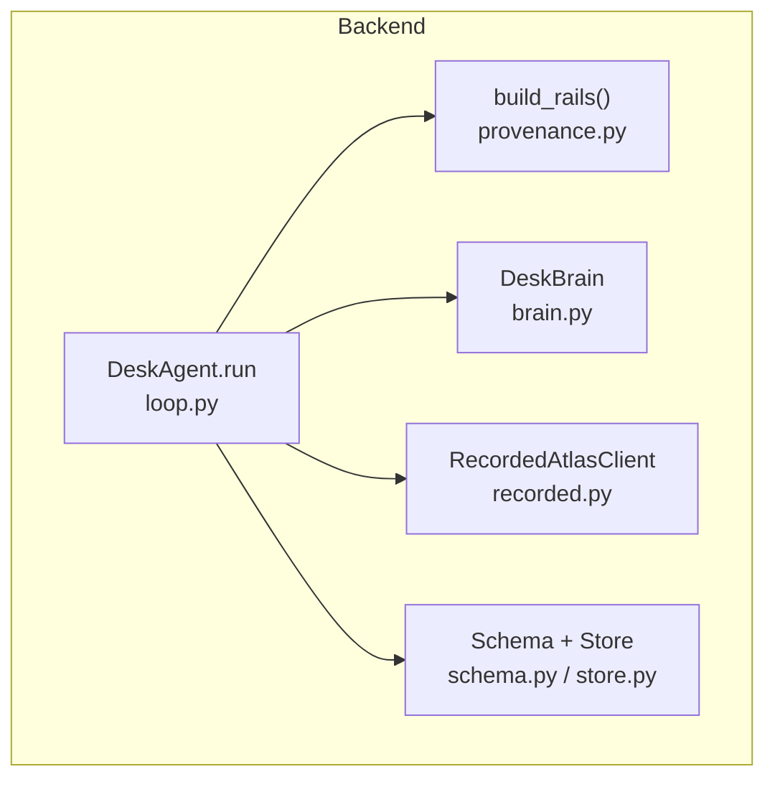
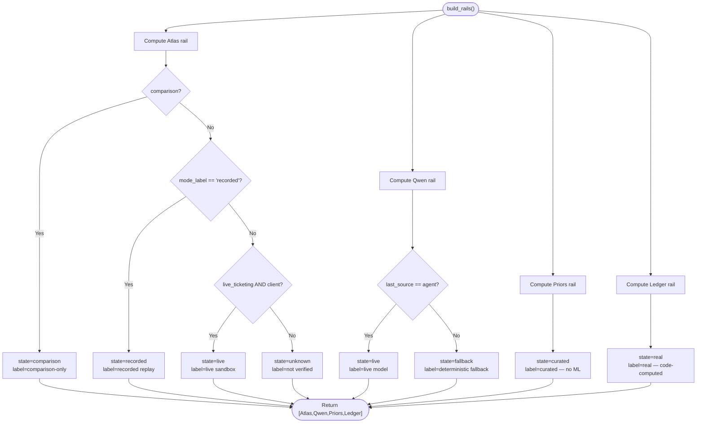
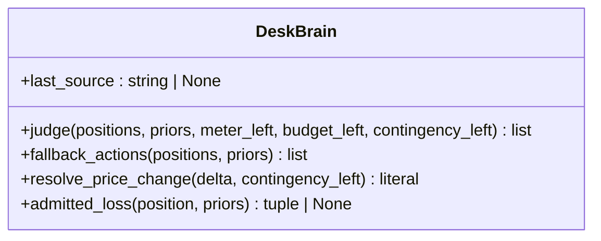
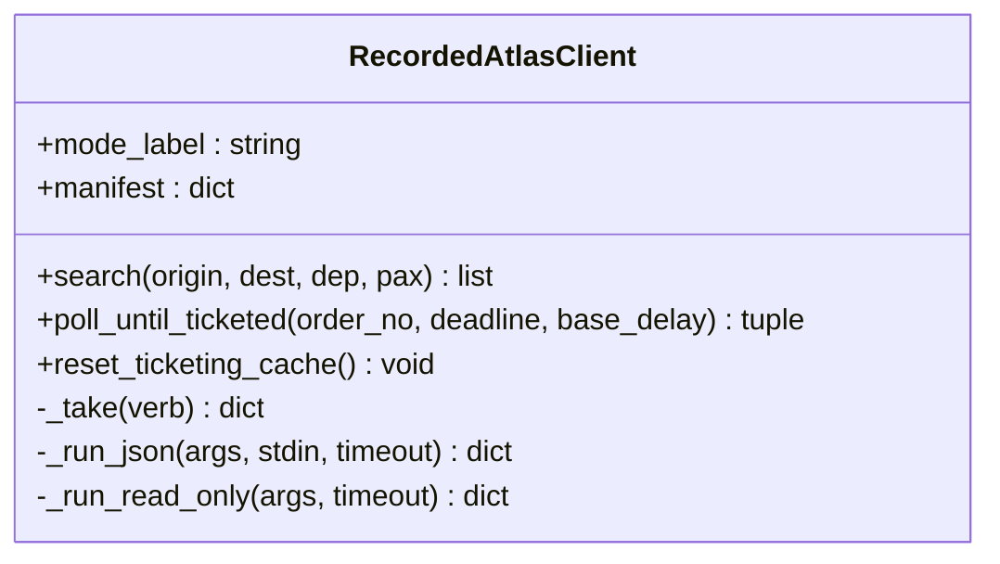
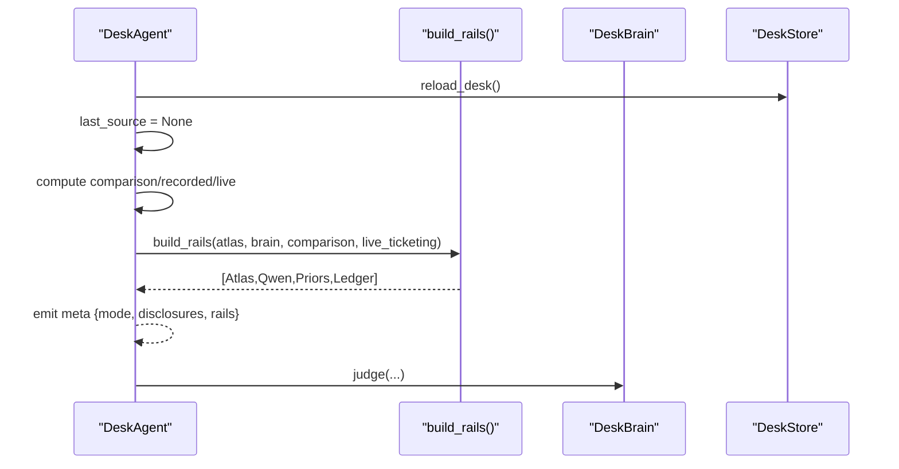
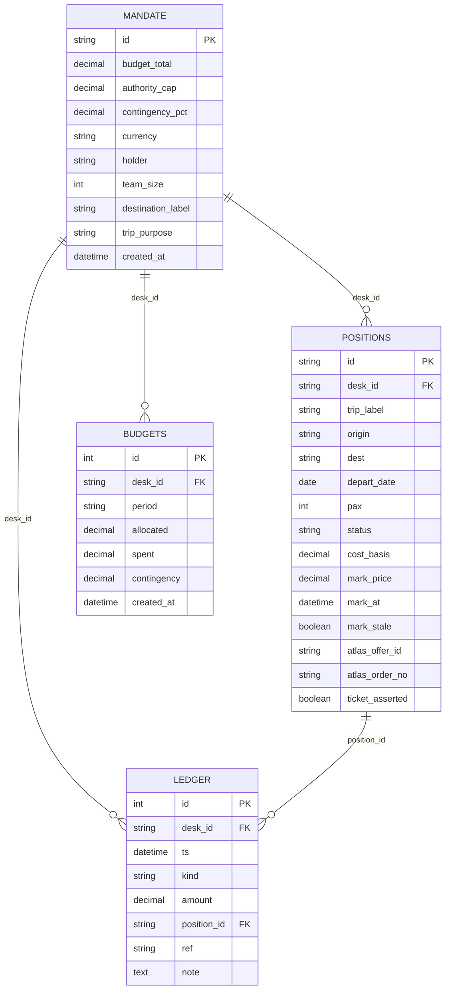
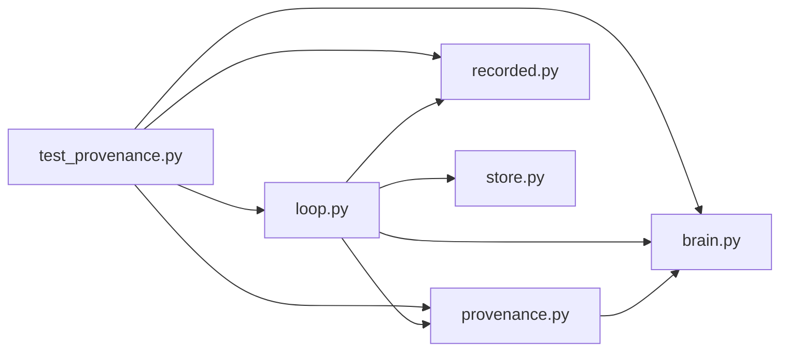

# Per-Rail Provenance Tracking

<cite>
**Referenced Files in This Document**
- [provenance.py](file://backend/app/provenance.py)
- [brain.py](file://backend/app/agent/brain.py)
- [loop.py](file://backend/app/agent/loop.py)
- [recorded.py](file://backend/app/atlas/recorded.py)
- [test_provenance.py](file://backend/tests/test_provenance.py)
- [0006-per-rail-provenance.md](file://docs/adr/0006-per-rail-provenance.md)
- [11-s12-provenance-rails.md](file://docs/plans/waypoint/11-s12-provenance-rails.md)
- [schema.py](file://backend/app/db/schema.py)
- [store.py](file://backend/app/db/store.py)
</cite>

## Table of Contents
1. [Introduction](#introduction)
2. [Project Structure](#project-structure)
3. [Core Components](#core-components)
4. [Architecture Overview](#architecture-overview)
5. [Detailed Component Analysis](#detailed-component-analysis)
6. [Dependency Analysis](#dependency-analysis)
7. [Performance Considerations](#performance-considerations)
8. [Troubleshooting Guide](#troubleshooting-guide)
9. [Conclusion](#conclusion)

## Introduction
This document explains the per-rail provenance tracking implemented for the Waypoint desk system. It covers how each subsystem (Atlas ticketing, Qwen judgment, curated priors, and code-computed ledger) is labeled with its own provenance on every meta event, ensuring that mixed provenance is never collapsed into a single global label. The design emphasizes fail-to-least-live defaults, additive wire changes, and deterministic behavior across recorded replay cycles.

## Project Structure
Per-rail provenance is centered around a pure builder that assembles four rows describing each rail’s state, label, and detail. The loop emits these rows in the meta event before any judgment runs, and tests validate both the pure matrix and full-cycle wiring. Supporting components include the brain (which records which source produced the last judgment), the recorded Atlas client (which exposes recorded mode), and persistence schema/store used by the broader loop.



**Diagram sources**
- [loop.py:153-234](file://backend/app/agent/loop.py#L153-L234)
- [provenance.py:174-190](file://backend/app/provenance.py#L174-L190)
- [brain.py:85-143](file://backend/app/agent/brain.py#L85-L143)
- [recorded.py:65-120](file://backend/app/atlas/recorded.py#L65-L120)
- [schema.py:33-107](file://backend/app/db/schema.py#L33-L107)
- [store.py:106-346](file://backend/app/db/store.py#L106-L346)

**Section sources**
- [loop.py:153-234](file://backend/app/agent/loop.py#L153-L234)
- [provenance.py:1-22](file://backend/app/provenance.py#L1-22)
- [0006-per-rail-provenance.md:9-16](file://docs/adr/0006-per-rail-provenance.md#L9-L16)
- [11-s12-provenance-rails.md:7-17](file://docs/plans/waypoint/11-s12-provenance-rails.md#L7-L17)

## Core Components
- Pure provenance builder: Assembles four rails (Atlas, Qwen, Priors, Ledger) with fixed order and closed-state vocabulary. Defaults are fail-closed to least-live labels.
- Brain provenance: Tracks the last judgment source (live agent vs deterministic fallback) via an attribute set at every judge exit.
- Recorded Atlas client: Exposes recorded mode and manifest details; recorded mode never claims live.
- Loop integration: Emits meta with additive rails field before judgment; resets per-cycle provenance state to avoid stale labels.
- Persistence: Schema and store provide the data foundation used by the loop; they do not influence provenance directly but underpin the cycle’s determinism.

**Section sources**
- [provenance.py:29-190](file://backend/app/provenance.py#L29-L190)
- [brain.py:48-54](file://backend/app/agent/brain.py#L48-L54)
- [brain.py:85-143](file://backend/app/agent/brain.py#L85-L143)
- [recorded.py:65-120](file://backend/app/atlas/recorded.py#L65-L120)
- [loop.py:176-234](file://backend/app/agent/loop.py#L176-L234)
- [schema.py:33-107](file://backend/app/db/schema.py#L33-L107)
- [store.py:106-346](file://backend/app/db/store.py#L106-L346)

## Architecture Overview
The loop orchestrates each cycle: reload desk state, reset per-cycle provenance, determine comparison/recorded/live modes, emit meta with rails, run reprice fan-out, call judgment, execute wall, write path (if live), settle, and finish. Rails are emitted early so the UI can show honest provenance even before the first judgment.

```mermaid
sequenceDiagram
participant Client as "Caller"
participant Loop as "DeskAgent.run"
participant Prov as "build_rails()"
participant Brain as "DeskBrain"
participant Atlas as "Atlas/RecordedAtlasClient"
participant Store as "DeskStore"
Client->>Loop : run(desk_id, emit)
Loop->>Store : reload_desk()
Loop->>Loop : reset per-cycle last_source
Loop->>Loop : compute comparison/recorded/live flags
Loop->>Prov : build_rails(atlas, brain, comparison, live_ticketing)
Prov-->>Loop : [Atlas, Qwen, Priors, Ledger]
Loop->>Client : emit meta {mode, disclosures, rails}
Loop->>Brain : judge(...)
Note over Brain : last_source set at every exit
Loop->>Loop : execute wall + write path (if live)
Loop->>Store : settle
Loop-->>Client : result
```

**Diagram sources**
- [loop.py:153-234](file://backend/app/agent/loop.py#L153-L234)
- [provenance.py:174-190](file://backend/app/provenance.py#L174-L190)
- [brain.py:108-143](file://backend/app/agent/brain.py#L108-L143)
- [store.py:179-224](file://backend/app/db/store.py#L179-L224)

## Detailed Component Analysis

### Provenance Builder (Pure Function)
- Inputs: atlas object, brain object, comparison flag, live_ticketing flag.
- Outputs: ordered list of four rail descriptors with closed states.
- Rules:
  - Atlas: comparison takes priority; recorded if mode_label indicates; live only when live_ticketing is true and a client is present; otherwise unknown/not verified.
  - Qwen: live if last_source indicates agent; otherwise deterministic fallback.
  - Priors: always curated (no ML).
  - Ledger: always real (code-computed).
- Fail-to-least-live: bare call yields comparison-only/fallback/curated/real.



**Diagram sources**
- [provenance.py:41-190](file://backend/app/provenance.py#L41-L190)

**Section sources**
- [provenance.py:29-190](file://backend/app/provenance.py#L29-L190)
- [0006-per-rail-provenance.md:9-16](file://docs/adr/0006-per-rail-provenance.md#L9-L16)

### DeskBrain Provenance Integration
- last_source initialized to None; set at every judge() exit to SOURCE_AGENT or SOURCE_FALLBACK.
- Ensures meta emits fallback until a valid live judgment occurs.
- Tests verify agent/fallback transitions under transport failure, hostile shape, and missing key.



**Diagram sources**
- [brain.py:85-143](file://backend/app/agent/brain.py#L85-L143)
- [brain.py:149-179](file://backend/app/agent/brain.py#L149-L179)
- [brain.py:186-218](file://backend/app/agent/brain.py#L186-L218)

**Section sources**
- [brain.py:48-54](file://backend/app/agent/brain.py#L48-L54)
- [brain.py:85-143](file://backend/app/agent/brain.py#L85-L143)
- [test_provenance.py:260-300](file://backend/tests/test_provenance.py#L260-L300)

### Recorded Atlas Client
- Provides recorded mode via mode_label and manifest-based honesty.
- Envelopes served from recording; unmatched calls fail closed.
- Manifest details surface composite capture and whether a TICKETED envelope was genuinely captured.



**Diagram sources**
- [recorded.py:65-120](file://backend/app/atlas/recorded.py#L65-L120)
- [recorded.py:161-235](file://backend/app/atlas/recorded.py#L161-L235)

**Section sources**
- [recorded.py:1-30](file://backend/app/atlas/recorded.py#L1-L30)
- [recorded.py:65-120](file://backend/app/atlas/recorded.py#L65-L120)
- [recorded.py:161-235](file://backend/app/atlas/recorded.py#L161-L235)

### Loop Integration and Meta Emission
- Resets per-cycle last_source to ensure no stale live claim.
- Determines comparison/recorded/live flags once per cycle.
- Emits meta with additive rails field before any judgment.
- Ensures recorded mode never wears a live label.



**Diagram sources**
- [loop.py:176-234](file://backend/app/agent/loop.py#L176-L234)
- [provenance.py:174-190](file://backend/app/provenance.py#L174-L190)

**Section sources**
- [loop.py:176-234](file://backend/app/agent/loop.py#L176-L234)
- [11-s12-provenance-rails.md:7-17](file://docs/plans/waypoint/11-s12-provenance-rails.md#L7-L17)

### Data Model and Persistence Context
- Schema defines mandate, positions, ledger, budgets tables used by the loop.
- Store provides reload, update marks, append ledger, settle, and booking updates.
- These support determinism and auditability but do not alter provenance logic.



**Diagram sources**
- [schema.py:33-107](file://backend/app/db/schema.py#L33-L107)

**Section sources**
- [schema.py:33-107](file://backend/app/db/schema.py#L33-L107)
- [store.py:106-346](file://backend/app/db/store.py#L106-L346)

## Dependency Analysis
- provenance.py depends on brain constants to interpret last_source.
- loop.py depends on provenance, brain, atlas, and store to orchestrate cycles and emit meta.
- recorded.py extends the atlas client contract while preserving parsers and write paths.
- Tests assert the pure matrix and full-cycle wiring, including recorded mode and comparison mode.



**Diagram sources**
- [provenance.py:25-28](file://backend/app/provenance.py#L25-L28)
- [loop.py:25-31](file://backend/app/agent/loop.py#L25-L31)
- [recorded.py:33-40](file://backend/app/atlas/recorded.py#L33-L40)
- [store.py:17-21](file://backend/app/db/store.py#L17-L21)
- [test_provenance.py:22-29](file://backend/tests/test_provenance.py#L22-L29)

**Section sources**
- [provenance.py:25-28](file://backend/app/provenance.py#L25-L28)
- [loop.py:25-31](file://backend/app/agent/loop.py#L25-L31)
- [test_provenance.py:22-29](file://backend/tests/test_provenance.py#L22-L29)

## Performance Considerations
- Provenance computation is pure and lightweight; it does not touch environment or external services.
- Meta emission happens before judgment, avoiding extra latency in the critical path.
- Recorded replay avoids network calls and sleeps, ensuring deterministic performance.
- Database operations remain transactional and bounded; provenance does not add I/O overhead.

[No sources needed since this section provides general guidance]

## Troubleshooting Guide
- If Atlas rail reads “not verified,” check that a client is present and live_ticketing is explicitly enabled; recorded mode will read “recorded replay.”
- If Qwen rail reads “deterministic fallback,” confirm that a valid judgment has been executed; last_source is set only after judge() exits successfully.
- In recorded mode, ensure manifest and recording files exist; missing artifacts raise typed errors and degrade safely.
- For comparison mode, verify the human switch and ticketing availability; comparison overrides live behavior and logs decisions without executing writes.

**Section sources**
- [provenance.py:41-82](file://backend/app/provenance.py#L41-L82)
- [provenance.py:125-147](file://backend/app/provenance.py#L125-L147)
- [recorded.py:126-155](file://backend/app/atlas/recorded.py#L126-L155)
- [loop.py:176-234](file://backend/app/agent/loop.py#L176-L234)
- [test_provenance.py:143-171](file://backend/tests/test_provenance.py#L143-L171)

## Conclusion
Per-rail provenance ensures that each subsystem’s trust boundary is explicit and honest on every meta event. The pure builder, fail-to-least-live defaults, recorded-mode honesty, and loop-level reset collectively prevent misleading global labels. Tests cover the full matrix and wiring, and persistence remains deterministic and auditable.

[No sources needed since this section summarizes without analyzing specific files]