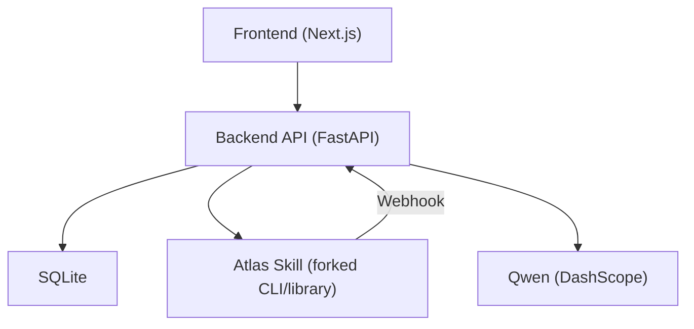
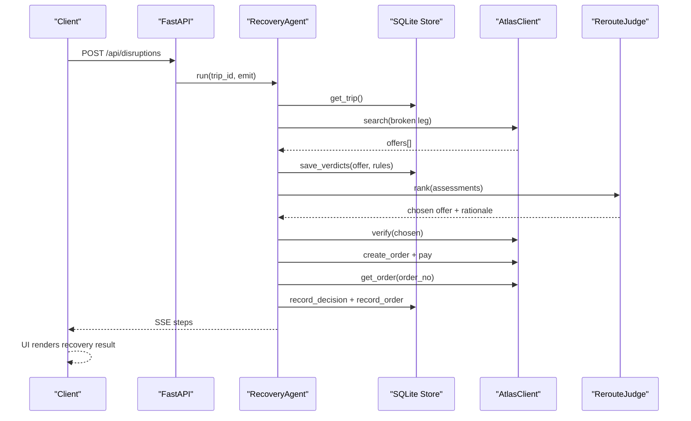
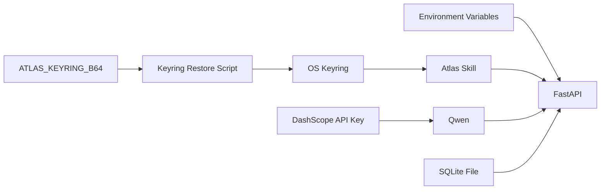

# Deployment & Operations

<cite>
**Referenced Files in This Document**
- [02-architecture.md](file://docs/plans/waypoint/02-architecture.md)
- [03-program-design.md](file://docs/plans/waypoint/03-program-design.md)
- [04-slices.md](file://docs/plans/waypoint/04-slices.md)
- [QODER-HANDOFF.md](file://docs/plans/waypoint/QODER-HANDOFF.md)
- [atlas-integration.md](file://docs/external/atlas-integration.md)
- [0001-fork-atlas-skill-sandbox-auto-approve.md](file://docs/adr/0001-fork-atlas-skill-sandbox-auto-approve.md)
- [0002-visa-rules-curated-approximation.md](file://docs/adr/0002-visa-rules-curated-approximation.md)
- [0003-advise-execute-two-gate-split.md](file://docs/adr/0003-advise-execute-two-gate-split.md)
- [0007-recorded-container-deployment.md](file://docs/adr/0007-recorded-container-deployment.md)
- [DEPLOYMENT.md](file://docs/plans/waypoint/DEPLOYMENT.md)
- [session_transfer.md](file://docs/session_transfer.md)
- [runtime-env-check.md](file://docs/evidence/runtime-env-check.md)
- [SKILL.md](file://.agents/skills/atlas-flight-booking/SKILL.md)
- [openai.yaml](file://.agents/skills/atlas-flight-booking/agents/openai.yaml)
- [skills-lock.json](file://skills-lock.json)
- [Dockerfile](file://backend/Dockerfile)
- [Dockerfile.live](file://backend/Dockerfile.live)
- [frontend Dockerfile](file://frontend/Dockerfile)
- [docker-compose.yml](file://docker-compose.yml)
- [restore_atlas_keyring.sh](file://backend/scripts/restore_atlas_keyring.sh)
</cite>

## Update Summary
**Changes Made**
- Enhanced containerization strategy with separate dev/prod images and Render.com integration
- Added keyring restoration scripts for free-tier persistence
- Updated deployment procedures for both recorded and live Atlas modes
- Expanded monitoring and alerting configurations for production environments
- Added comprehensive maintenance procedures for database backups and dependency updates
- Enhanced scaling considerations for handling peak loads during flight disruptions

## Table of Contents
1. Introduction
2. Project Structure
3. Core Components
4. Architecture Overview
5. Detailed Component Analysis
6. Dependency Analysis
7. Performance Considerations
8. Troubleshooting Guide
9. Conclusion
10. Appendices

## Introduction
This document provides production-focused deployment and operations guidance for the Waypoint system. It covers environment configuration, containerization and orchestration strategies, monitoring and logging, alerting, maintenance procedures, scaling during peak disruptions, rollback strategies, and disaster recovery. The content is derived from the repository's architecture, program design, external integration notes, and architectural decision records (ADRs).

**Updated** Enhanced with Docker support, Render.com integration, keyring restoration scripts, and separate development/production images for improved operational flexibility.

## Project Structure
Waypoint is a two-part application:
- Frontend: Next.js/React with three demo screens and an SSE client to visualize agent reasoning.
- Backend: Python FastAPI hosting the recovery agent loop, rules engine, Atlas integration, Qwen calls, and SQLite persistence.

Key operational surfaces:
- REST endpoints for trip setup, disruption injection, webhook ingestion, recovery retrieval, and live streaming.
- SQLite database storing passengers, trips, segments, offers, rule verdicts, decisions, and orders.
- External integrations: Atlas Flight Booking skill (forked for sandbox auto-approval), Qwen via DashScope, and optional public webhook callback URL.



**Diagram sources**
- [02-architecture.md:13-20](file://docs/plans/waypoint/02-architecture.md#L13-L20)
- [02-architecture.md:21-33](file://docs/plans/waypoint/02-architecture.md#L21-L33)
- [02-architecture.md:51-55](file://docs/plans/waypoint/02-architecture.md#L51-L55)

**Section sources**
- [02-architecture.md:1-56](file://docs/plans/waypoint/02-architecture.md#L1-L56)
- [03-program-design.md:9-32](file://docs/plans/waypoint/03-program-design.md#L9-L32)

## Core Components
- Recovery Agent Loop: Orchestrates search, rules evaluation, judge ranking, verification, order creation, payment, and outcome assertion with guards (step budget, re-read/verify, assert ticket).
- Rules Engine: Pluggable rules (e.g., transit visa, passport validity) returning allowed/blocked/unknown with provenance and freshness windows; fail-closed on unknown.
- Atlas Integration: Forked skill used as library or CLI fallback; supports search, verify, order, pay, and queryOrderDetails; sandbox auto-approve enabled only in sandbox.
- Persistence: SQLite schema for passengers, trips, segments, offers, rule_verdicts, decisions, orders; used for audit trail and state.
- Streaming: Server-Sent Events (SSE) stream of agent steps for UI visualization.

Operational implications:
- Deterministic code owns rules checks, fare math, and booking execution; AI ranks options and narrates rationale.
- Two-gate split: advise gate open (see all options), execute gate fail-closed (only allowed offers auto-book).

**Section sources**
- [03-program-design.md:57-149](file://docs/plans/waypoint/03-program-design.md#L57-L149)
- [02-architecture.md:34-55](file://docs/plans/waypoint/02-architecture.md#L34-L55)
- [0003-advise-execute-two-gate-split.md:1-19](file://docs/adr/0003-advise-execute-two-gate-split.md#L1-L19)

## Architecture Overview
The backend exposes REST endpoints and an SSE stream. A disruption trigger (webhook or injected endpoint) starts the recovery agent loop, which persists intermediate states and emits steps. The frontend consumes these streams to render live reasoning and final outcomes.



**Diagram sources**
- [03-program-design.md:125-149](file://docs/plans/waypoint/03-program-design.md#L125-L149)
- [02-architecture.md:13-20](file://docs/plans/waypoint/02-architecture.md#L13-L20)

## Detailed Component Analysis

### Environment Configuration
- Database: SQLite file-backed store for all domain entities and audit data. Ensure persistent volume mounting in containers and regular backups.
- External Services:
  - Atlas Flight Booking: Auth via OS keyring; environment switch between sandbox and production; fork enables sandbox-only auto-approve for price increase and payment checkpoints.
  - Qwen (DashScope): Requires API key environment variable.
  - Webhook Callback: Public URL registered externally; exposed via environment variable for inbound webhooks.
- Security:
  - Secrets (keys, tokens) must not be stored in repo or env files beyond runtime secrets management.
  - Use OS keyring for Atlas credentials per documented approach.

Configuration checklist:
- Set DASHSCOPE_API_KEY for Qwen.
- Configure WAYPOINT_PUBLIC_URL for webhook callbacks.
- Ensure Atlas environment is set to sandbox for development/demo; production requires human checkpoints.
- Mount SQLite to durable storage; configure backup schedules.

**Updated** Enhanced with Render.com-specific configurations including keyring restoration via ATLAS_KEYRING_B64 environment variable for free-tier deployments without persistent disk.

**Section sources**
- [02-architecture.md:51-55](file://docs/plans/waypoint/02-architecture.md#L51-L55)
- [atlas-integration.md:10-19](file://docs/external/atlas-integration.md#L10-L19)
- [0001-fork-atlas-skill-sandbox-auto-approve.md:1-21](file://docs/adr/0001-fork-atlas-skill-sandbox-auto-approve.md#L1-L21)
- [restore_atlas_keyring.sh:1-31](file://backend/scripts/restore_atlas_keyring.sh#L1-L31)

### Containerization Strategy
- Backend:
  - **Recorded Rail Image**: Zero-credential-by-construction image with Python 3.11-slim base, no atlas-flight CLI, no uv, no keyring packages. Uses RecordedAtlasClient that never spawns subprocesses.
  - **Live Rail Image**: Separate Dockerfile.live that installs atlas-flight CLI via uv with isolated Python 3.12 venv, includes keyrings.alt for both app and CLI environments.
  - Install Atlas CLI tool via uv and pin version as specified by skill documentation.
  - Mount SQLite volume and ensure permissions.
  - Expose HTTP port for API and SSE.
- Frontend:
  - Multi-stage build with Node.js 20 Alpine base.
  - Build static assets and serve via Next.js standalone server.
  - NEXT_PUBLIC_API_URL baked at build time for browser-to-backend communication.
- Orchestration:
  - Deploy behind reverse proxy with TLS termination.
  - Use health checks for readiness/liveness probes on API endpoints.
  - Configure resource limits and autoscaling policies based on request throughput and SSE concurrency.

**Updated** Enhanced with dual-image strategy supporting both recorded (zero-credential) and live (full Atlas integration) deployment modes.

Operational notes:
- Pin Atlas CLI version and uv tool installation path to ensure reproducibility.
- Keep secrets out of images; inject at runtime via secret managers.
- Ensure container logs are aggregated centrally.
- For Render.com free tier: use ATLAS_KEYRING_B64 environment variable with base64-encoded minimal keyring file.

**Section sources**
- [Dockerfile:1-39](file://backend/Dockerfile#L1-L39)
- [Dockerfile.live:1-65](file://backend/Dockerfile.live#L1-L65)
- [frontend Dockerfile:1-34](file://frontend/Dockerfile#L1-L34)
- [SKILL.md:26-36](file://.agents/skills/atlas-flight-booking/SKILL.md#L26-L36)
- [02-architecture.md:13-20](file://docs/plans/waypoint/02-architecture.md#L13-L20)

### Monitoring and Logging
- Metrics to track:
  - Request rates and latency for REST endpoints.
  - SSE stream events emitted per recovery step.
  - Error rates across Atlas calls (search, verify, order, pay, queryOrderDetails).
  - Rule verdict distribution (allowed/blocked/unknown) and freshness staleness flags.
  - Decision outcomes (recovered/no_legal_option/needs_override/failed).
- Logs:
  - Structured JSON logs for each agent step, including inputs, outputs, and guard evaluations.
  - Audit trail persisted in SQLite (rule_verdicts, decisions, orders) and mirrored to log storage for compliance.
- Dashboards:
  - End-to-end recovery success rate.
  - Time-to-recover metrics.
  - Atlas service health and error breakdowns.
  - Rule engine performance and coverage gaps.

**Updated** Enhanced monitoring for Render.com deployments with specific attention to keyring restoration status and Atlas authentication flows.

**Section sources**
- [03-program-design.md:125-149](file://docs/plans/waypoint/03-program-design.md#L125-L149)
- [02-architecture.md:21-33](file://docs/plans/waypoint/02-architecture.md#L21-L33)

### Alerting
- Critical alerts:
  - Booking errors (order/pay failures, ticket assertion failures).
  - Service outages (Atlas unavailability, Qwen/DashScope errors).
  - Data freshness issues (curated rule cells past freshness window leading to unknown → blocked).
  - High error rates or latency spikes on recovery endpoints.
  - Keyring restoration failures in containerized environments.
- Thresholds and channels:
  - PagerDuty/Slack for immediate response.
  - Email digest for daily summaries of recovery outcomes and rule coverage.
- Runbooks:
  - Atlas connectivity troubleshooting.
  - Qwen API key validation and quota checks.
  - SQLite integrity checks and backup restoration procedures.
  - Keyring restoration script debugging for Render.com deployments.

**Updated** Added specific alerting for keyring restoration failures and Render.com-specific deployment issues.

**Section sources**
- [0002-visa-rules-curated-approximation.md:1-25](file://docs/adr/0002-visa-rules-curated-approximation.md#L1-L25)
- [03-program-design.md:151-171](file://docs/plans/waypoint/03-program-design.md#L151-L171)

### Maintenance Procedures
- Database backups:
  - Schedule periodic snapshots of SQLite file; test restore procedures regularly.
  - Retain backups for compliance and incident reconstruction.
  - For Render.com: implement external backup strategy since free tier has no persistent disk.
- Log rotation:
  - Rotate application logs and structured event logs; retain for audit and debugging.
- Dependency updates:
  - Pin and update Atlas CLI version per skill requirements; validate compatibility before rollout.
  - Update Python dependencies and base images; perform security scans.
  - Monitor Atlas CLI version 0.3.12 compatibility with keyrings.alt package.
- Curated data maintenance:
  - Refresh transit_hubs.yaml and passport_index.csv with fresh provenance; enforce freshness windows.
  - Validate new hubs/nationalities against policy before enabling autonomous execution.

**Updated** Enhanced maintenance procedures for containerized deployments including keyring file management and Render.com-specific considerations.

**Section sources**
- [03-program-design.md:25-32](file://docs/plans/waypoint/03-program-design.md#L25-L32)
- [SKILL.md:26-36](file://.agents/skills/atlas-flight-booking/SKILL.md#L26-L36)

### Scaling During Peak Loads
- Concurrency:
  - Increase worker processes for FastAPI to handle concurrent recovery loops and SSE streams.
  - Tune connection pools and timeouts for Atlas and Qwen clients.
  - Single-worker constraint for SQLite databases in containerized environments.
- Autoscaling:
  - Scale horizontally based on CPU/memory and request queue depth.
  - Use sticky sessions if needed for long-lived SSE connections.
  - Consider stateless scaling with external database for high availability.
- Backpressure:
  - Queue incoming disruptions/webhooks when processing capacity is saturated; prioritize recent incidents.
- Resilience:
  - Retry Atlas calls with exponential backoff; circuit breakers for external services.
  - Step budget enforcement prevents runaway loops under load.

**Updated** Enhanced scaling considerations for containerized deployments with single-worker SQLite constraints and horizontal scaling strategies.

**Section sources**
- [03-program-design.md:106-149](file://docs/plans/waypoint/03-program-design.md#L106-L149)
- [02-architecture.md:34-55](file://docs/plans/waypoint/02-architecture.md#L34-L55)

### Rollback Strategies
- Versioning:
  - Tag deployments with version identifiers; maintain previous versions ready for quick rollback.
  - Maintain separate images for recorded and live modes.
- Feature toggles:
  - Toggle off risky features (e.g., auto-approve in non-sandbox) via environment flags.
  - Switch between recorded and live Atlas modes via WAYPOINT_ATLAS_MODE.
- Database migrations:
  - Forward-compatible schema changes; avoid destructive changes without migration scripts.
  - Idempotent migration shims for self-healing on stale databases.
- Rollback triggers:
  - Elevated error rates, failed bookings, or degraded recovery success rates.
  - Keyring restoration failures in containerized environments.

**Updated** Enhanced rollback strategies for dual-image deployment model and containerized environments.

**Section sources**
- [0001-fork-atlas-skill-sandbox-auto-approve.md:1-21](file://docs/adr/0001-fork-atlas-skill-sandbox-auto-approve.md#L1-L21)

### Disaster Recovery
- RTO/RPO:
  - Define recovery time objective and recovery point objective for SQLite and logs.
  - For Render.com free tier: implement external backup and restore procedures.
- Failover:
  - Multi-region deployment with read replicas for SQLite where feasible; otherwise, rapid restore from backups.
  - Stateful failover with external database for high availability scenarios.
- Incident playbooks:
  - Atlas outage: degrade to manual recovery mode; surface status to users.
  - Qwen outage: fall back to deterministic selection (cheapest executable) with clear messaging.
  - Keyring corruption: automated restoration from base64-encoded backup.
- Post-incident:
  - Rebuild state from persisted evidence (verdicts, decisions, orders); reconcile discrepancies.

**Updated** Enhanced disaster recovery procedures for containerized deployments with keyring persistence challenges.

**Section sources**
- [02-architecture.md:21-33](file://docs/plans/waypoint/02-architecture.md#L21-L33)
- [03-program-design.md:125-149](file://docs/plans/waypoint/03-program-design.md#L125-L149)

## Dependency Analysis
External dependencies and their operational impact:
- Atlas Flight Booking skill:
  - Installed via uv; pinned version; auth via OS keyring; environment switching between sandbox and production.
  - Webhook support for real disruption triggers.
  - Separate Python 3.12 venv for CLI isolation from app's Python 3.11 environment.
- Qwen (DashScope):
  - API key required; used for ranking and narration.
- SQLite:
  - Local file-based persistence; needs durable storage and backups.
  - Single-worker constraint due to file locking limitations.



**Diagram sources**
- [02-architecture.md:51-55](file://docs/plans/waypoint/02-architecture.md#L51-L55)
- [atlas-integration.md:10-19](file://docs/external/atlas-integration.md#L10-L19)
- [SKILL.md:26-36](file://.agents/skills/atlas-flight-booking/SKILL.md#L26-L36)
- [restore_atlas_keyring.sh:1-31](file://backend/scripts/restore_atlas_keyring.sh#L1-L31)

**Section sources**
- [atlas-integration.md:1-37](file://docs/external/atlas-integration.md#L1-L37)
- [skills-lock.json:1-12](file://skills-lock.json#L1-L12)

## Performance Considerations
- Minimize LLM calls: Only use Qwen for ranking and narration; keep deterministic logic in code.
- Cache reads: Avoid repeated lookups for curated data; refresh within freshness windows.
- Stream efficiency: Emit concise SSE events; batch where appropriate.
- Database queries: Optimize inserts and selects for high-throughput recovery loops.
- External call throttling: Respect rate limits for Atlas and Qwen; implement retries and backoff.
- Container optimization: Use multi-stage builds to minimize image size and attack surface.

**Updated** Enhanced performance considerations for containerized deployments including image optimization and resource constraints.

## Troubleshooting Guide
Common issues and resolutions:
- Atlas authentication failures:
  - Verify OS keyring entries; ensure correct environment (sandbox vs production).
  - Re-run authorization flow if token expired.
  - Check ATLAS_KEYRING_B64 environment variable in containerized deployments.
- Ticketing activation blocked:
  - Complete UAT modules to unlock verify/order/pay/ticket functions.
- Rule verdicts blocking execution:
  - Check curated table coverage and freshness; update provenance and last_checked dates.
- Qwen/DashScope errors:
  - Validate API key; check quotas and service status.
- SQLite corruption:
  - Restore from latest backup; verify integrity; rebuild indexes if necessary.
- Render.com deployment issues:
  - Verify keyring restoration script execution in container startup.
  - Check CORS configuration for Vercel frontend integration.
  - Validate NEXT_PUBLIC_API_URL build-time configuration.

**Updated** Enhanced troubleshooting guide for containerized deployments and Render.com-specific issues.

**Section sources**
- [atlas-integration.md:23-37](file://docs/external/atlas-integration.md#L23-L37)
- [0002-visa-rules-curated-approximation.md:1-25](file://docs/adr/0002-visa-rules-curated-approximation.md#L1-L25)
- [03-program-design.md:151-171](file://docs/plans/waypoint/03-program-design.md#L151-L171)

## Conclusion
Waypoint's production deployment hinges on robust environment configuration, resilient external integrations, and strict adherence to the two-gate model that separates advice from execution. Operational excellence requires disciplined monitoring, alerting, maintenance, and disaster recovery practices tailored to the system's reliance on Atlas and Qwen, with SQLite serving as the single source of truth for state and audit trails. Scaling strategies must account for bursty disruption workloads while preserving correctness through guards and fail-closed execution.

**Updated** Enhanced conclusion reflecting the new dual-image deployment strategy and containerized operational considerations.

## Appendices

### API Surface Reference
- POST /api/trips — seed a booked trip (passenger profile + segments).
- POST /api/disruptions — inject a cancellation on a trip to start recovery.
- POST /api/webhooks/atlas — receive real Atlas incident/webhook to start recovery.
- GET /api/trips/{id} — trip + current status.
- GET /api/trips/{id}/recovery — recovery result (chosen vs rejected, fare diff, ticket).
- GET /api/trips/{id}/stream — SSE stream of agent reasoning steps.

**Section sources**
- [02-architecture.md:13-20](file://docs/plans/waypoint/02-architecture.md#L13-L20)

### Build Slices Summary
- Slice 1: Tracer bullet with mocked end-to-end flow.
- Slice 2: Real Atlas search (read path).
- Slice 3: Rules engine with curated data and freshness.
- Slice 4: Qwen judge for advising.
- Slice 5: Execute gate with booking and settlement (requires ticketing activation).
- Slice 6: Guards and audit persistence.
- Slice 7: Triggers and polish.

**Section sources**
- [04-slices.md:5-33](file://docs/plans/waypoint/04-slices.md#L5-L33)

### Handoff Notes
- Repository scaffold includes Next.js frontend and FastAPI backend.
- Initial slices focus on proving the pipeline without external dependencies.
- Ticketing activation remains a blocker for full autonomous booking until UAT clearance.

**Section sources**
- [QODER-HANDOFF.md:1-48](file://docs/plans/waypoint/QODER-HANDOFF.md#L1-L48)

### Deployment Configuration Examples

#### Docker Compose Configuration
```yaml
services:
  backend:
    build: ./backend
    image: waypoint-backend
    ports:
      - "8000:8000"
    environment:
      WAYPOINT_ATLAS_MODE: recorded
      WAYPOINT_LIVE_BOOKING: "1"
      WAYPOINT_ESCALATION_WAIT: "5"
      WAYPOINT_DATABASE_URL: sqlite:////app/db/waypoint.db
    volumes:
      - waypoint-db:/app/db
    healthcheck:
      test: ["CMD", "python", "-c", "import urllib.request; urllib.request.urlopen('http://localhost:8000/api/health', timeout=2)"]
      interval: 5s
      timeout: 3s
      retries: 12
      start_period: 10s

  frontend:
    build:
      context: ./frontend
      args:
        NEXT_PUBLIC_API_URL: http://localhost:8000
    ports:
      - "3000:3000"
    depends_on:
      - backend

volumes:
  waypoint-db:
```

#### Render.com Environment Variables
- `WAYPOINT_ATLAS_MODE`: live
- `WAYPOINT_LIVE_BOOKING`: 1
- `WAYPOINT_CORS_ORIGIN`: https://your-frontend-domain.com
- `WAYPOINT_ESCALATION_WAIT`: 5
- `ATLAS_KEYRING_B64`: <base64-encoded-keyring-file>
- `DASHSCOPE_API_KEY`: <your-api-key>

**Section sources**
- [docker-compose.yml:1-91](file://docker-compose.yml#L1-L91)
- [runtime-env-check.md:1-18](file://docs/evidence/runtime-env-check.md#L1-L18)

### Production Deployment Checklist
- [ ] Configure environment variables for target deployment platform
- [ ] Set up SSL/TLS termination at reverse proxy level
- [ ] Configure health checks and monitoring endpoints
- [ ] Set up log aggregation and alerting
- [ ] Configure database backups and disaster recovery procedures
- [ ] Test keyring restoration in containerized environment
- [ ] Validate CORS configuration for frontend integration
- [ ] Perform load testing with realistic traffic patterns
- [ ] Document rollback procedures and test them
- [ ] Set up monitoring dashboards for key metrics

[No sources needed since this section provides general operational guidance]