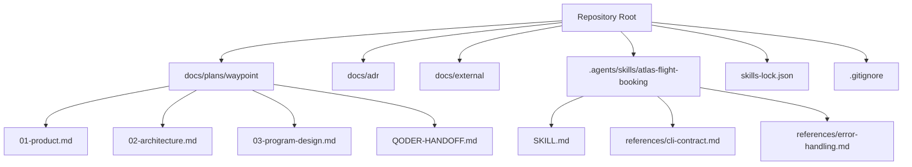
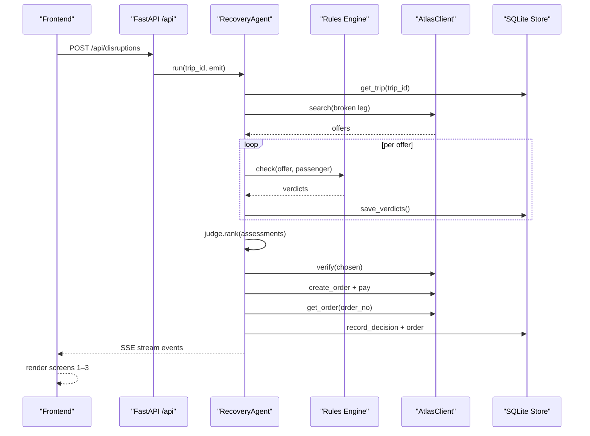
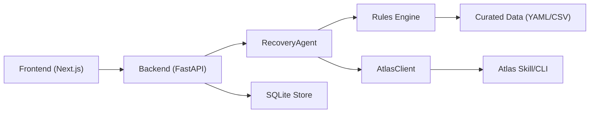

# Developer Guide

<cite>
**Referenced Files in This Document**
- [SKILL.md](file://.agents/skills/atlas-flight-booking/SKILL.md)
- [cli-contract.md](file://.agents/skills/atlas-flight-booking/references/cli-contract.md)
- [error-handling.md](file://.agents/skills/atlas-flight-booking/references/error-handling.md)
- [skills-lock.json](file://skills-lock.json)
- [gitignore](file://.gitignore)
- [requirements.txt](file://backend/requirements.txt)
- [01-product.md](file://docs/plans/waypoint/01-product.md)
- [02-architecture.md](file://docs/plans/waypoint/02-architecture.md)
- [03-program-design.md](file://docs/plans/waypoint/03-program-design.md)
- [QODER-HANDOFF.md](file://docs/plans/waypoint/QODER-HANDOFF.md)
- [0001-fork-atlas-skill-sandbox-auto-approve.md](file://docs/adr/0001-fork-atlas-skill-sandbox-auto-approve.md)
- [atlas-integration.md](file://docs/external/atlas-integration.md)
</cite>

## Update Summary
**Changes Made**
- Updated Development Environment Setup section with comprehensive .gitignore configuration details
- Enhanced Repository Hygiene subsection with specific exclusion patterns
- Added detailed explanation of development environment isolation practices
- Updated practical setup steps to reflect proper environment management

## Table of Contents
1. Introduction
2. Project Structure
3. Core Components
4. Architecture Overview
5. Detailed Component Analysis
6. Dependency Analysis
7. Performance Considerations
8. Troubleshooting Guide
9. Conclusion
10. Appendices

## Introduction
This guide explains how to set up the Waypoint development environment, contribute code, test changes, debug common issues, and extend the system. It focuses on the development workflow for building a rules-aware rebooking agent that integrates with Atlas Flight Booking and uses a pluggable rules engine backed by SQLite. The project is organized as a single repository containing planning documents, external integration notes, and skill references that define the intended implementation.

Key goals for developers:
- Understand the architecture and data flow before writing code.
- Follow the two-gate model (advice open, execution fail-closed).
- Use the provided skill contracts and error handling patterns when integrating Atlas.
- Maintain code quality through tests aligned with the documented test plan.
- Debug reliably using the troubleshooting sections below.

**Section sources**
- [01-product.md:1-32](file://docs/plans/waypoint/01-product.md#L1-L32)
- [02-architecture.md:1-56](file://docs/plans/waypoint/02-architecture.md#L1-L56)
- [03-program-design.md:1-186](file://docs/plans/waypoint/03-program-design.md#L1-L186)

## Project Structure
The repository contains:
- Planning and design docs under docs/plans/waypoint
- Architecture decisions (ADRs) under docs/adr
- External integration context under docs/external
- Skill definitions and CLI contracts under .agents/skills/atlas-flight-booking
- A skills lock file and gitignore at the root

**Diagram sources**
- [02-architecture.md:1-56](file://docs/plans/waypoint/02-architecture.md#L1-L56)
- [SKILL.md:1-71](file://.agents/skills/atlas-flight-booking/SKILL.md#L1-L71)
- [cli-contract.md:1-79](file://.agents/skills/atlas-flight-booking/references/cli-contract.md#L1-L79)
- [error-handling.md:1-74](file://.agents/skills/atlas-flight-booking/references/error-handling.md#L1-L74)

**Section sources**
- [02-architecture.md:1-56](file://docs/plans/waypoint/02-architecture.md#L1-L56)
- [QODER-HANDOFF.md:1-48](file://docs/plans/waypoint/QODER-HANDOFF.md#L1-L48)

## Core Components
Waypoint's core components are defined in the program design and architecture documents:
- Backend (Python FastAPI): hosts the recovery agent loop, rules engine, Atlas integration, and SQLite persistence.
- Frontend (Next.js/React): three demo screens plus an SSE client to visualize live reasoning.
- Rules Engine: pluggable Rule interface; v1 includes transit-visa and passport validity checks.
- Atlas Integration: forked skill used as a library or via CLI fallback; sandbox auto-approve enabled for autonomous settlement.
- Data Layer: SQLite tables for passengers, trips, segments, offers, rule verdicts, decisions, and orders.

Development setup highlights:
- Python environment and dependencies managed per backend conventions; Node/Next.js for frontend.
- SQLite used for local dev; schema and store modules defined in backend/db.
- Environment variables include Qwen API key and public URL for webhooks; secrets stored in OS keyring for Atlas auth.

**Section sources**
- [02-architecture.md:1-56](file://docs/plans/waypoint/02-architecture.md#L1-L56)
- [03-program-design.md:1-186](file://docs/plans/waypoint/03-program-design.md#L1-L186)

## Architecture Overview
The end-to-end flow begins with a trip disruption trigger, proceeds through search and rule evaluation, then executes deterministic booking steps guarded by verification and outcome assertion.

**Diagram sources**
- [02-architecture.md:13-55](file://docs/plans/waypoint/02-architecture.md#L13-L55)
- [03-program-design.md:125-149](file://docs/plans/waypoint/03-program-design.md#L125-L149)

## Detailed Component Analysis

### Development Environment Setup
**Updated** Enhanced with comprehensive .gitignore configuration for development environment isolation

- Tools and versions:
  - Python FastAPI backend with SQLite.
  - Next.js/React frontend.
  - Atlas CLI tool installed via uv; minimum supported version enforced by skill contract.
- Configuration:
  - Atlas authentication via OS keyring; do not store secrets in env or code.
  - Qwen API key via environment variable name specified in architecture doc.
  - Public URL for Atlas webhook callback configured via environment variable.
- Repository hygiene:
  - Comprehensive .gitignore configuration ensures clean repository state by excluding:
    - Python virtual environments (.venv/, venv/) and compiled bytecode (__pycache__/, *.pyc)
    - Environment files (.env, .env.*) to prevent accidental secret commits
    - Node.js artifacts (node_modules/, .next/, out/, npm-debug.log*)
    - Local database files (*.db, *.sqlite3) for SQLite development
    - Editor and OS-specific files (.DS_Store, Thumbs.db, .qoder/)
  - Skills lock file pins the Atlas skill source and hash.

Practical steps:
- Install uv and required tools as described in the skill start instructions.
- Ensure Atlas CLI version meets minimum requirement.
- Configure environment for sandbox vs production and switch as needed.
- Create isolated Python virtual environments (.venv/) which will be automatically ignored.
- Seed a trip and inject disruptions to validate endpoints.

**Section sources**
- [SKILL.md:26-38](file://.agents/skills/atlas-flight-booking/SKILL.md#L26-L38)
- [cli-contract.md:9-28](file://.agents/skills/atlas-flight-booking/references/cli-contract.md#L9-L28)
- [atlas-integration.md:10-14](file://docs/external/atlas-integration.md#L10-L14)
- [gitignore:1-23](file://.gitignore#L1-L23)
- [skills-lock.json:1-12](file://skills-lock.json#L1-L12)
- [requirements.txt:1-6](file://backend/requirements.txt#L1-L6)

### Code Contribution Process
- Two-gate model:
  - Advise gate: AI can see all options and narrate rationale.
  - Execute gate: only fully allowed offers auto-book; blocked/unknown require human override.
- Coding standards:
  - Deterministic code owns rules checks, fare math, and payment execution.
  - LLM involvement limited to ranking and narration over legal options.
- Review procedures:
  - Propose plans and obtain approval before large changes.
  - Separate reviewer cross-checks output against specs.
- Testing requirements:
  - Align tests with the documented test plan covering rules, agent behavior, persistence, and guards.
  - All tests must fail against pre-change code to ensure they assert new behavior.

**Section sources**
- [03-program-design.md:3-7](file://docs/plans/waypoint/03-program-design.md#L3-L7)
- [03-program-design.md:151-171](file://docs/plans/waypoint/03-program-design.md#L151-L171)
- [QODER-HANDOFF.md:33-38](file://docs/plans/waypoint/QODER-HANDOFF.md#L33-L38)

### Debugging Techniques
Common issues and debugging approaches:

- Atlas integration problems:
  - Authorization state: use the CLI diagnostics and authorization commands to confirm status and resolve missing/expired sessions.
  - Ticketing activation: if ticketing is not active, search works but verify/order/pay are blocked; follow UAT activation path.
  - Error codes: branch on stable codes from the error handling reference; avoid parsing messages.

- AI service errors:
  - Validate API key presence and correctness for Qwen calls.
  - Ensure LLM usage is limited to ranking/narration; deterministic steps should not call AI.

- Database connectivity issues:
  - Confirm SQLite file paths and permissions; ensure schema migrations are applied before queries.
  - Verify inserts/reads for offers, verdicts, decisions, and orders during recovery runs.

Operational tips:
- Use the SSE stream to observe step-by-step progress and pinpoint failures.
- Re-read trip state before each action to avoid stale assumptions.
- Assert real outcomes (PNR/ticket) before marking success.

**Section sources**
- [cli-contract.md:9-28](file://.agents/skills/atlas-flight-booking/references/cli-contract.md#L9-L28)
- [error-handling.md:1-74](file://.agents/skills/atlas-flight-booking/references/error-handling.md#L1-L74)
- [atlas-integration.md:26-31](file://docs/external/atlas-integration.md#L26-L31)
- [02-architecture.md:34-49](file://docs/plans/waypoint/02-architecture.md#L34-L49)

### Navigating Between Design Specs and Implementation
- Start with the program design for file layout, types, signatures, and call stack.
- Cross-reference architecture for endpoints, data models, and external integrations.
- Use ADRs to understand non-negotiable decisions (e.g., sandbox auto-approve).
- Refer to mockups for UI targets and ensure endpoint contracts match.

Guidance:
- When adding features, first update or align with the program design's type signatures and call stacks.
- Keep the two-gate model visible in both code and UI flows.
- Persist evidence (verdicts, decisions) to support compliance and debugging.

**Section sources**
- [03-program-design.md:9-32](file://docs/plans/waypoint/03-program-design.md#L9-L32)
- [02-architecture.md:13-31](file://docs/plans/waypoint/02-architecture.md#L13-L31)
- [0001-fork-atlas-skill-sandbox-auto-approve.md:1-21](file://docs/adr/0001-fork-atlas-skill-sandbox-auto-approve.md#L1-L21)

### Extending the System
- Adding new rules:
  - Implement the Rule protocol with a name and check method returning a three-state verdict.
  - Register the rule in the ordered registry so it participates in assessments.
  - Ensure tests cover allowed/blocked/unknown scenarios and freshness windows.

- Integrating additional data sources:
  - For visa/transit data, maintain curated tables with provenance and freshness metadata.
  - Treat uncurated or stale entries as unknown and fail-closed from execution.

- Customizing the user interface:
  - Extend the three-screen surface to display new rule reasons, verdicts, and rationale.
  - Stream additional steps via SSE to keep users informed during recovery.

Best practices:
- Keep deterministic logic separate from LLM-driven ranking.
- Preserve auditability by persisting every rule verdict and decision.
- Guard execution with re-verification and outcome assertion.

**Section sources**
- [03-program-design.md:57-123](file://docs/plans/waypoint/03-program-design.md#L57-L123)
- [03-program-design.md:34-55](file://docs/plans/waypoint/03-program-design.md#L34-L55)
- [02-architecture.md:34-49](file://docs/plans/waypoint/02-architecture.md#L34-L49)

## Dependency Analysis
High-level dependencies between components:

**Diagram sources**
- [02-architecture.md:1-56](file://docs/plans/waypoint/02-architecture.md#L1-L56)
- [03-program-design.md:9-32](file://docs/plans/waypoint/03-program-design.md#L9-L32)
- [SKILL.md:1-71](file://.agents/skills/atlas-flight-booking/SKILL.md#L1-L71)

Coupling and cohesion:
- The agent orchestrates search, rule evaluation, judgment, and execution while delegating domain-specific work to rules and Atlas.
- Persistence is centralized in the store module to maintain consistency across verdicts, decisions, and orders.
- External dependencies are encapsulated behind clients to simplify testing and mocking.

Potential circular dependencies:
- Avoid importing store into rules or atlas clients directly; pass data via function arguments or interfaces.

External integrations:
- Atlas skill provides search, verify, order, pay, and status operations; error handling follows the reference contract.
- Qwen is used solely for ranking and narration over legal options.

**Section sources**
- [02-architecture.md:1-56](file://docs/plans/waypoint/02-architecture.md#L1-L56)
- [cli-contract.md:1-79](file://.agents/skills/atlas-flight-booking/references/cli-contract.md#L1-L79)
- [error-handling.md:1-74](file://.agents/skills/atlas-flight-booking/references/error-handling.md#L1-L74)

## Performance Considerations
- Limit AI usage to ranking/narration to avoid penalties and improve determinism.
- Cache curated data in memory for fast rule lookups; reload on configuration changes.
- Minimize network calls by batching searches and verifying only chosen offers.
- Use step budget to bound agent loops and prevent runaway processing.
- Persist intermediate results to resume or replay recovery steps efficiently.

[No sources needed since this section provides general guidance]

## Troubleshooting Guide
Frequent development challenges and solutions:

- Atlas authorization fails:
  - Run authorization diagnostics and login commands; present the authorization link to complete sign-in.
  - After completion, poll once and resume only when authorized.

- Ticketing not active:
  - Search works but verify/order/pay are blocked until UAT activation passes.
  - Follow the activation path and retest after enabling modules.

- Offer expired or flight unavailable:
  - Replay retained search once; if still unavailable, collect new inputs and search again.

- Payment balance insufficient:
  - Explain the situation, show order link when available, and never retry payment automatically.

- Stale data risks:
  - Re-read trip state before actions; re-verify prices and availability before booking.
  - Treat outdated curated cells as unknown and fail-closed from execution.

- Database issues:
  - Check schema alignment and transaction boundaries; ensure verdicts and decisions are persisted consistently.
  - Verify that local SQLite files (*.db, *.sqlite3) are properly excluded from version control.

- Frontend streaming:
  - Validate SSE event shapes and ensure the UI renders each step correctly.
  - Clear Node.js build artifacts (.next/, node_modules/) if experiencing frontend issues.

- Environment isolation problems:
  - Ensure Python virtual environments (.venv/, venv/) are properly created and activated.
  - Verify that environment files (.env, .env.*) are not accidentally committed to the repository.
  - Clean editor-specific files (.qoder/) if experiencing IDE-related issues.

**Section sources**
- [cli-contract.md:9-28](file://.agents/skills/atlas-flight-booking/references/cli-contract.md#L9-L28)
- [error-handling.md:19-63](file://.agents/skills/atlas-flight-booking/references/error-handling.md#L19-L63)
- [atlas-integration.md:26-31](file://docs/external/atlas-integration.md#L26-L31)
- [02-architecture.md:34-49](file://docs/plans/waypoint/02-architecture.md#L34-L49)
- [gitignore:1-23](file://.gitignore#L1-L23)

## Conclusion
This guide outlines the development workflow, contribution process, debugging strategies, and extension points for Waypoint. By adhering to the two-gate model, maintaining deterministic execution, and following the documented contracts and test plan, contributors can build reliable, compliant features that integrate seamlessly with Atlas and enhance the user experience. Use the planning documents as the authoritative source for design intent and implementation details.

[No sources needed since this section summarizes without analyzing specific files]

## Appendices

### Quick Reference: Endpoints and Data
- Endpoints:
  - POST /api/trips — seed a booked trip
  - POST /api/disruptions — inject cancellation to trigger recovery
  - GET /api/trips/{id} — trip + status
  - GET /api/trips/{id}/recovery — recovery result
  - GET /api/trips/{id}/stream — SSE stream of agent steps
  - POST /api/webhooks/atlas — receive Atlas incident/webhook
- Data tables:
  - passengers, trips, segments, offers, rule_verdicts, decisions, orders

**Section sources**
- [02-architecture.md:13-31](file://docs/plans/waypoint/02-architecture.md#L13-L31)

### Skill and CLI Contract Summary
- Minimum CLI version enforced; install via uv if missing.
- Authorization flow with explicit user prompts and bounded polling.
- Strict branching on response codes; preserve opaque IDs.
- Error handling standardized across search, verification, optional services, and order/payment.

**Section sources**
- [SKILL.md:26-66](file://.agents/skills/atlas-flight-booking/SKILL.md#L26-L66)
- [cli-contract.md:1-79](file://.agents/skills/atlas-flight-booking/references/cli-contract.md#L1-L79)
- [error-handling.md:1-74](file://.agents/skills/atlas-flight-booking/references/error-handling.md#L1-L74)

### Development Environment Isolation
The repository now includes comprehensive .gitignore configuration to ensure clean repository state and proper development environment isolation:

- **Python Environment Management**:
  - Virtual environments (.venv/, venv/) are automatically excluded
  - Compiled Python bytecode (__pycache__/, *.pyc) ignored
  - Environment files (.env, .env.*) protected from accidental commits

- **Node.js Development Artifacts**:
  - Dependencies (node_modules/) excluded to reduce repository size
  - Build outputs (.next/, out/) ignored for Next.js projects
  - Debug logs (npm-debug.log*) cleaned automatically

- **Local Development Data**:
  - SQLite database files (*.db, *.sqlite3) excluded for local development
  - Ensures consistent database state across team members

- **Editor and OS Compatibility**:
  - macOS files (.DS_Store) and Windows thumbnails (Thumbs.db) ignored
  - Editor-specific configurations (.qoder/) excluded for clean collaboration

**Section sources**
- [gitignore:1-23](file://.gitignore#L1-L23)