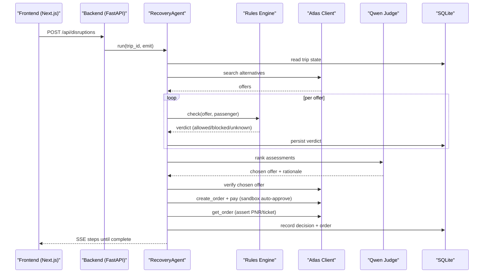

# Getting Started

<cite>
**Referenced Files in This Document**
- [SKILL.md](file://.agents/skills/atlas-flight-booking/SKILL.md)
- [cli-contract.md](file://.agents/skills/atlas-flight-booking/references/cli-contract.md)
- [atlas-integration.md](file://docs/external/atlas-integration.md)
- [02-architecture.md](file://docs/plans/waypoint/02-architecture.md)
- [03-program-design.md](file://docs/plans/waypoint/03-program-design.md)
- [04-slices.md](file://docs/plans/waypoint/04-slices.md)
- [QODER-HANDOFF.md](file://docs/plans/waypoint/QODER-HANDOFF.md)
- [.gitignore](file://.gitignore)
- [skills-lock.json](file://skills-lock.json)
</cite>

## Table of Contents
1. Introduction
2. Project Structure
3. Core Components
4. Architecture Overview
5. Detailed Component Analysis
6. Dependency Analysis
7. Performance Considerations
8. Troubleshooting Guide
9. Conclusion
10. Appendices

## Introduction
This guide helps you set up the Waypoint development environment and run your first demo. Waypoint is a two-part application:
- Frontend: Next.js/React with three screens and a live agent reasoning stream via Server-Sent Events (SSE).
- Backend: Python FastAPI hosting the recovery agent loop, rules engine, Atlas integration, Qwen calls, and SQLite persistence.

The initial demo uses mocked data to prove the full pipeline without external dependencies. Later slices add real Atlas search, rules, Qwen judgment, and autonomous booking in sandbox.

## Project Structure
At this stage, the repository contains design documents, skill definitions for Atlas Flight Booking, and configuration files that describe how the system will be built. The intended layout includes backend and frontend directories as described in the program design.

```mermaid
graph TB
subgraph "Planned Layout"
FE["frontend/ (Next.js + React)"]
BE["backend/app/ (FastAPI)"]
DB["SQLite (local dev)"]
end
FE --> BE
BE --> DB
BE --> |Atlas Skill (forked)| ATLAS["Atlas Flight Booking"]
BE --> |LLM| QWEN["Qwen via DashScope"]
```

**Diagram sources**
- [02-architecture.md:1-56](file://docs/plans/waypoint/02-architecture.md#L1-L56)
- [03-program-design.md:9-32](file://docs/plans/waypoint/03-program-design.md#L9-L32)

**Section sources**
- [02-architecture.md:1-56](file://docs/plans/waypoint/02-architecture.md#L1-L56)
- [03-program-design.md:9-32](file://docs/plans/waypoint/03-program-design.md#L9-L32)

## Core Components
- Recovery Agent: Orchestrates search, rules checks, LLM judgment, order creation, payment, and outcome assertion. It enforces guards like step budget and re-read-before-write.
- Rules Engine: Pluggable rules (e.g., transit visa, passport validity) with a three-state verdict (allowed/blocked/unknown) and fail-closed execution policy.
- Atlas Integration: Uses the forked Atlas Flight Booking skill/library for search, verification, ordering, and payment in sandbox; auth lives in OS keyring.
- Qwen Judge: Ranks legal options and provides rationale over all assessed offers.
- Persistence: SQLite stores trips, segments, offers, rule verdicts, decisions, and orders for auditability.

**Section sources**
- [03-program-design.md:57-149](file://docs/plans/waypoint/03-program-design.md#L57-L149)
- [02-architecture.md:13-55](file://docs/plans/waypoint/02-architecture.md#L13-L55)

## Architecture Overview
Waypoint’s runtime flow starts from a disruption trigger, runs the agent loop with strict guards, streams progress to the UI, and persists evidence of every decision.



**Diagram sources**
- [02-architecture.md:13-55](file://docs/plans/waypoint/02-architecture.md#L13-L55)
- [03-program-design.md:125-149](file://docs/plans/waypoint/03-program-design.md#L125-L149)

## Detailed Component Analysis

### Development Environment Setup
- Prerequisites
  - uv tool v0.3.12 for Atlas Skill CLI installation and management.
  - OS keyring access for Atlas authentication (Windows Credential Manager on Windows).
  - Node.js and npm/yarn/pnpm for Next.js frontend.
  - Python 3.12+ for FastAPI backend.
  - Optional: tunneling tool if you need a public URL for webhooks.

- Install Atlas Skill CLI
  - Ensure uv is available or install it using the official installer for your OS.
  - Use uv to install atlas-flight-booking at version 0.3.12.
  - Verify the installed version matches the minimum supported version.

- Configure Atlas Authentication
  - Run the authorization status command. If not authorized, open the provided authorization URL in a browser, sign in or create an ATRIP account, and authorize.
  - After completing authorization, poll once to confirm AUTHORIZED before proceeding.

- Set Environment Variables
  - DASHSCOPE_API_KEY for Qwen via Alibaba DashScope.
  - WAYPOINT_PUBLIC_URL for webhook callback registration (used when integrating real Atlas webhooks).
  - Keep secrets out of code and docs; use OS keyring where applicable.

- Start Services
  - Backend: launch the FastAPI app and ensure CORS is enabled for local development.
  - Frontend: start the Next.js dev server.
  - Open the browser and navigate to the frontend.

- First Run Demo
  - Trigger a disruption via the UI or endpoint.
  - Watch the SSE stream showing each step of the recovery process.
  - Confirm the final result screen shows the chosen reroute, fare difference, and ticket details.

**Section sources**
- [SKILL.md:26-37](file://.agents/skills/atlas-flight-booking/SKILL.md#L26-L37)
- [cli-contract.md:9-28](file://.agents/skills/atlas-flight-booking/references/cli-contract.md#L9-L28)
- [atlas-integration.md:10-14](file://docs/external/atlas-integration.md#L10-L14)
- [02-architecture.md:51-55](file://docs/plans/waypoint/02-architecture.md#L51-L55)
- [QODER-HANDOFF.md:40-46](file://docs/plans/waypoint/QODER-HANDOFF.md#L40-L46)

### Running the Application for the First Time
- Seed a Trip (Demo)
  - For Slice 1, the backend can seed a hardcoded trip to demonstrate the full flow without external services.

- Inject a Disruption
  - Call the disruptions endpoint or use the UI to mark a segment as cancelled.

- Observe the Stream
  - Connect to the SSE stream for the trip and watch each step: search, rule checks, judge rationale, verification, order creation, payment, and outcome assertion.

- View Results
  - Retrieve the recovery result to see the chosen vs rejected offers, fare difference settled, and ticket information.

**Section sources**
- [02-architecture.md:13-19](file://docs/plans/waypoint/02-architecture.md#L13-L19)
- [04-slices.md:7-13](file://docs/plans/waypoint/04-slices.md#L7-L13)
- [QODER-HANDOFF.md:40-46](file://docs/plans/waypoint/QODER-HANDOFF.md#L40-L46)

### Demo Walkthrough: Triggering Flight Disruptions and Observing Autonomous Recovery
- Objective
  - Demonstrate the agent catching a cheaper but illegal option and selecting a legal alternative, then autonomously settling any fare difference and asserting a ticket.

- Steps
  - Start the app and navigate to the trip screen.
  - Click “Recover my trip” to inject a disruption.
  - Watch the live stream show:
    - Search results listing multiple itineraries.
    - Rule verdicts marking blocked/allowed options.
    - Judge rationale explaining why the cheapest option was rejected.
    - Verification and order creation in sandbox with auto-approval.
    - Outcome assertion confirming PNR and ticket.
  - Review the final screen comparing rejected cheapest vs chosen legal, fare difference, and ticket details.

**Section sources**
- [03-program-design.md:181-186](file://docs/plans/waypoint/03-program-design.md#L181-L186)
- [04-slices.md:7-13](file://docs/plans/waypoint/04-slices.md#L7-L13)
- [QODER-HANDOFF.md:40-46](file://docs/plans/waypoint/QODER-HANDOFF.md#L40-L46)

### Configuration Details
- Atlas Skill and CLI
  - Minimum supported CLI version is enforced; installation and upgrade are automated when needed.
  - Authorization flows through the OS keyring; never store credentials in environment variables or code.

- Environment Switching
  - Use the CLI to switch between sandbox and production environments. Always start a fresh search after switching.

- External Integrations
  - Qwen via DashScope requires setting the API key in the environment.
  - Webhook callback URL must be publicly reachable during development (use a tunnel if necessary).

**Section sources**
- [SKILL.md:26-37](file://.agents/skills/atlas-flight-booking/SKILL.md#L26-L37)
- [cli-contract.md:9-28](file://.agents/skills/atlas-flight-booking/references/cli-contract.md#L9-L28)
- [atlas-integration.md:10-14](file://docs/external/atlas-integration.md#L10-L14)
- [02-architecture.md:51-55](file://docs/plans/waypoint/02-architecture.md#L51-L55)

## Dependency Analysis
- Skills and Locking
  - The skills lock file pins the Atlas Flight Booking skill source and hash, ensuring reproducible skill usage.

- Git Ignore
  - Excludes virtual environments, env files, Node artifacts, and local database files to keep the repo clean.

**Section sources**
- [skills-lock.json:1-12](file://skills-lock.json#L1-L12)
- [.gitignore:1-21](file://.gitignore#L1-L21)

## Performance Considerations
- Step Budget: The agent loop respects a bounded step count to prevent runaway processes. Tune based on observed behavior.
- Re-verify Before Write: Always re-check prices and availability immediately before booking to avoid stale data.
- Deterministic vs AI: Keep deterministic logic (rules, math, order/pay) separate from LLM judgment to minimize latency and variability.
- Streaming UI: SSE enables responsive UI updates without polling overhead.

[No sources needed since this section provides general guidance]

## Troubleshooting Guide
- Atlas CLI Not Found or Wrong Version
  - Ensure uv is installed and accessible.
  - Install atlas-flight-booking at the required version and verify the output.
  - If installation fails, consult the official installation documentation.

- Authorization Required
  - Follow the authorization URL to sign in or create an account and authorize.
  - Poll once to confirm AUTHORIZED before continuing.

- Ticketing Activation Required
  - Complete the required activation steps in the ATRIP portal.
  - After activation, recheck authorization and proceed with a new search.

- Environment Variables Missing
  - Set DASHSCOPE_API_KEY for Qwen.
  - Set WAYPOINT_PUBLIC_URL if using real webhooks.

- Local Artifacts and Secrets
  - Ensure .env files and sensitive data are ignored by git.
  - Remove generated node_modules, .next, and local database files as needed.

**Section sources**
- [SKILL.md:26-37](file://.agents/skills/atlas-flight-booking/SKILL.md#L26-L37)
- [cli-contract.md:9-28](file://.agents/skills/atlas-flight-booking/references/cli-contract.md#L9-L28)
- [atlas-integration.md:10-14](file://docs/external/atlas-integration.md#L10-L14)
- [.gitignore:1-21](file://.gitignore#L1-L21)

## Conclusion
You now have the context to set up Waypoint, configure Atlas and Qwen integrations, and run the first demo. The architecture emphasizes safety and auditability: rules enforce a hard boundary around execution, while the agent streams transparent progress and persists evidence of every decision. As you advance through slices, replace mocks with real Atlas searches, activate rules, integrate Qwen judgment, and enable autonomous booking in sandbox.

[No sources needed since this section summarizes without analyzing specific files]

## Appendices

### Quick Reference: Endpoints and Data Model
- Endpoints
  - POST /api/trips — seed a booked trip
  - POST /api/disruptions — inject a cancellation to start recovery
  - GET /api/trips/{id} — trip and current status
  - GET /api/trips/{id}/recovery — recovery result
  - GET /api/trips/{id}/stream — SSE stream of agent steps
  - POST /api/webhooks/atlas — receive real Atlas incident/webhook

- Data Model Highlights
  - passengers, trips, segments, offers, rule_verdicts, decisions, orders

**Section sources**
- [02-architecture.md:13-32](file://docs/plans/waypoint/02-architecture.md#L13-L32)