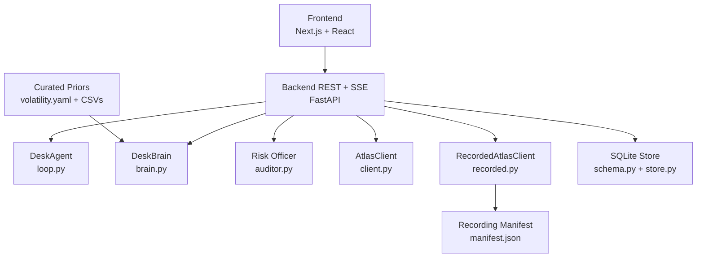
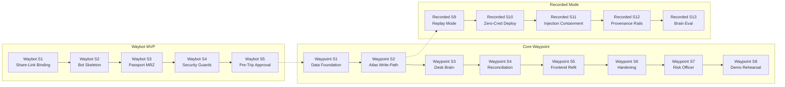

# Implementation Slices

<cite>
**Referenced Files in This Document**
- [04-slices.md](file://docs/plans/waypoint/04-slices.md)
- [00-status.md](file://docs/plans/waypoint/00-status.md)
- [client.py](file://backend/app/atlas/client.py)
- [recorded.py](file://backend/app/atlas/recorded.py)
- [routes.py](file://backend/app/api/routes.py)
- [test_recorded_mode.py](file://backend/tests/test_recorded_mode.py)
- [test_provenance.py](file://backend/tests/test_provenance.py)
- [10-s9-recorded-mode.md](file://docs/plans/waypoint/10-s9-recorded-mode.md)
- [11-s12-provenance-rails.md](file://docs/plans/waypoint/11-s12-provenance-rails.md)
- [12-s10-deployment.md](file://docs/plans/waypoint/12-s10-deployment.md)
- [04-slices.md](file://docs/plans/waybot/04-slices.md)
- [00-status.md](file://docs/plans/waybot/00-status.md)
</cite>

## Update Summary
**Changes Made**
- Updated implementation status to reflect Waybot MVP slices S1–S5 as fully implemented (share-link roster binding, passport MRZ capture with security guards, release gates, pre-trip approval workflows)
- Documented core Waypoint functionality S1–S8 as completed with full desk operations pipeline
- Added comprehensive coverage of recorded-mode slices S9–S13 as implemented (replay mode, provenance rails, zero-credential deployment, brain eval harness)
- Enhanced slice-specific testing strategies with live sandbox validation and deterministic replay capabilities
- Updated acceptance criteria and verification methods to align with current implementation state
- Revised integration testing approaches to include both live and recorded modes

## Table of Contents
1. Introduction
2. Project Structure
3. Core Components
4. Architecture Overview
5. Detailed Component Analysis
6. Dependency Analysis
7. Performance Considerations
8. Troubleshooting Guide
9. Conclusion
10. Appendices

## Introduction
This document defines the comprehensive implementation plan for Waypoint, a corporate travel treasury agent that manages positions through intelligent judgment and automated settlement. The project has evolved from disruption recovery to corporate travel treasury management with enhanced testing infrastructure supporting both live and recorded modes.

The product centers on two gates:
- Advise gate (open): AI sees all positions and narrates reasoning for book/hold/escalate decisions.
- Execute gate (walled, fail-closed): Only fully compliant picks auto-book; over-cap or unknown require human override.

**Current Status**: All planning gates approved. Waybot MVP (S1-S5) complete with share-link roster binding, passport MRZ capture, security guards, and pre-trip approval workflows. Core Waypoint functionality (S1-S8) fully implemented with desk operations pipeline. Recorded-mode engine (S9-S13) provides deterministic replay capabilities with zero-credential deployment.

**Section sources**
- [01-product.md:1-32](file://docs/plans/waypoint/01-product.md#L1-L32)
- [03-program-design.md:3-7](file://docs/plans/waypoint/03-program-design.md#L3-L7)
- [QODER-HANDOFF.md:17-31](file://docs/plans/waypoint/QODER-HANDOFF.md#L17-L31)
- [00-status.md:18-31](file://docs/plans/waypoint/00-status.md#L18-L31)

## Project Structure
Waypoint is a single repository with three major components:
- Frontend: Next.js/React with desk operations screens and SSE client for real-time events
- Backend: Python FastAPI hosting desk agent loop, brain (judgment layer), Atlas integration, Qwen calls, and SQLite persistence
- Recorded Mode Engine: Deterministic replay system with manifest-based honesty tracking

Key backend modules include routes, domain models, agent orchestration, desk brain, auditor, Atlas client (live + recorded), data loaders, and database schema/store. Data files include curated volatility priors, mandate configuration, and IATA-to-country mapping.



**Diagram sources**
- [02-architecture.md:13-32](file://docs/plans/waypoint/02-architecture.md#L13-L32)
- [03-program-design.md:9-32](file://docs/plans/waypoint/03-program-design.md#L9-L32)

**Section sources**
- [02-architecture.md:1-56](file://docs/plans/waypoint/02-architecture.md#L1-L56)
- [03-program-design.md:9-32](file://docs/plans/waypoint/03-program-design.md#L9-L32)

## Core Components
- DeskAgent: Orchestrates the end-to-end desk cycle, enforcing guards (step budget, re-read/verify, outcome assertion).
- DeskBrain: Uses Qwen to score positions for book/hold/escalate decisions with rationale over rejected options.
- Risk Officer: Reads the blotter and challenges one trade during weekly close.
- AtlasClient: Wraps forked skill library for search, verify, order creation, payment, and order status retrieval.
- RecordedAtlasClient: Subclass providing deterministic replay through recorded envelopes with manifest-based honesty tracking.
- Store: Typed SQLite persistence for mandates, positions, ledger entries, and desk state.

These components implement the two-gate split and the main call stack from seed to settlement, with dual support for live and recorded modes.

**Section sources**
- [03-program-design.md:57-149](file://docs/plans/waypoint/03-program-design.md#L57-L149)
- [02-architecture.md:34-55](file://docs/plans/waypoint/02-architecture.md#L34-L55)

## Architecture Overview
The system exposes REST endpoints and an SSE stream with dual transport support. The primary flow starts at desk seeding, runs the agent loop with bounded steps, applies desk-brain judgment, executes verified bookings, asserts outcomes, and persists audit trails.

```mermaid
sequenceDiagram
participant Client as "Browser"
participant API as "FastAPI Routes"
participant Agent as "DeskAgent"
participant Brain as "DeskBrain"
participant Auditor as "Risk Officer"
participant Atlas as "AtlasClient"
participant Recorded as "RecordedAtlasClient"
participant DB as "SQLite Store"
Client->>API : POST /api/desk/seed
API->>Agent : run(desk_id, emit)
Agent->>DB : reload_desk(desk_id)
alt Live Mode
Agent->>Atlas : search(position.route, date)
Atlas-->>Agent : [Offer]
else Recorded Mode
Agent->>Recorded : search(position.route, date)
Recorded-->>Agent : [Offer from manifest]
end
loop For each position
Agent->>Brain : judge(positions, priors)
Brain-->>Agent : DeskAction[]
Agent->>DB : record_trade(...)
end
Agent->>Atlas : verify(chosen)
Agent->>Atlas : create_order(chosen, pax)
Agent->>Atlas : pay(draft)
Agent->>Atlas : get_order(order_no)
Agent->>DB : record_trade(...), record_alloc(...)
Agent-->>API : DeskResult
else over cap or no legal option
Agent-->>API : escalate or give_up
end
API-->>Client : SSE stream of desk events
```

**Diagram sources**
- [03-program-design.md:125-149](file://docs/plans/waypoint/03-program-design.md#L125-L149)
- [02-architecture.md:13-19](file://docs/plans/waypoint/02-architecture.md#L13-L19)

## Detailed Component Analysis

### Waybot MVP Slices (S1-S5) - ✅ COMPLETED

#### Slice 1 — TRACER: Seed Without Start → Code → Cycle Fires
Scope:
- Schema: 7 mandate columns + shim entries; `TravelerRow`, `ChatBindingRow` tables. `app/events.py` sink (publish/subscribe, fire-and-forget).
- Routes: extract `_start_cycle(desk_id)`; `seed_desk` persists `awaiting_travelers` + token + code-hash and does **not** start; `POST /confirm` hash-checks → `_start_cycle`.
- Frontend: `page.tsx` share card (link + code, static progress 0/N); desk page code-entry panel gated on `awaiting_travelers`; `types.ts` + `api.ts` new fields.

**Implementation Details:**
- Complete share-link roster binding with deep-link chat integration
- Secure confirmation code with PBKDF2 hashing and attempt caps
- Gated desk lifecycle with invite tokens and one-shot release semantics
- Full test suite with 175 tests passing, frontend type-check clean

**Deliverables:**
- Working tracer bullet demonstrating complete desk lifecycle without bot integration
- Share card interface with link sharing and code entry panels
- Secure release mechanism with rate limiting and TTL protection

**Testing Strategy:**
- Lifecycle tests: seed-no-start / wrong-code / right-code scenarios
- Security tests: attempt caps, TTL expiry, constant-time comparison
- Integration tests: full suite green with 175 collected tests

**Acceptance Criteria:**
- Desk seeds in `awaiting_travelers` state without starting cycle
- Confirmation code verification with proper security measures
- Cycle fires exactly once upon correct code entry

**Section sources**
- [04-slices.md:7-13](file://docs/plans/waybot/04-slices.md#L7-L13)
- [00-status.md:9](file://docs/plans/waybot/00-status.md#L9)

#### Slice 2 — Waybot Skeleton + Deep-Link Bind
Scope:
- `app/bot/` skeleton: `build_application(token, sink, store)`; `/start?token=` → `bind_chat` → session. Started in `main.py` lifespan, gated on `WAYPOINT_BOT_TOKEN` (absent → skipped), supervised + backoff + global error handler.
- Bot subscribes to the sink; `travelers_complete` (fired manually via a test hook this slice) → manager ping.

**Implementation Details:**
- Complete bot application framework with Telegram integration
- Deep-link binding connecting travelers to their desks
- Event subscription system for traveler completion notifications
- Robust error handling with backoff and supervision

**Deliverables:**
- Fully functional bot skeleton with deep-link chat binding
- Event-driven architecture for traveler coordination
- Production-ready bot lifecycle management

**Testing Strategy:**
- 17 new tests covering bot lifecycle and event handling
- Full suite green with 193 collected tests
- Frontend type-check clean with new API types

**Acceptance Criteria:**
- Bot boots with optional token (graceful degradation when absent)
- Deep-link binding successfully connects travelers to desks
- Traveler completion events properly propagate to managers

**Section sources**
- [04-slices.md:14-17](file://docs/plans/waybot/04-slices.md#L14-L17)
- [00-status.md:10](file://docs/plans/waybot/00-status.md#L10)

#### Slice 3 — Passport Extraction + MRZ Gate + G1 Write-Path Swap
Scope:
- `bot/extract.py` (Qwen-VL over brain transport), `bot/mrz.py` (TD3 check-digit gate, ISO-3→ISO-2 fail-closed), typed-entry fallback (CSV-validated), `deleteMessage` + no-persist image.
- `app/pax.py` `build_pax_json` with **PaxBuild (hold on gated desk missing roster; demo only for ungated)**; swap the `loop.py:725` call site. `add_traveler`; backend `travelers_complete` (dedupe).

**Implementation Details:**
- Advanced passport OCR using Qwen-VL model for text extraction
- MRZ (Machine Readable Zone) validation with ICAO TD3 standards
- Fail-closed nationality conversion from ISO-3 to ISO-2 codes
- Gated desk roster management with hold/fallback mechanisms
- Backend-side traveler completion with database-backed deduplication

**Deliverables:**
- Complete passport capture workflow with security guards
- MRZ validation ensuring document authenticity
- Integrated write-path swap replacing demo passenger generation
- Comprehensive test coverage with 219 tests passing

**Testing Strategy:**
- MRZ validation tests: TD3 check-digit verification, calendar+expiry validation
- Pax builder tests: carry-not-invent, gated-hold, ungated-demo scenarios
- End-to-end recorded-mode tests: real names appear in order payloads
- Security tests: photo masking, PII containment, injection resistance

**Acceptance Criteria:**
- Passport photos processed with masked confirmations and stored securely
- MRZ validation catches invalid documents with fail-closed behavior
- Gated desks hold until roster complete; ungated desks use demo pax
- Recorded-mode e2e maintains byte-safety with real passenger data

**Section sources**
- [04-slices.md:19-22](file://docs/plans/waybot/04-slices.md#L19-L22)
- [00-status.md:11](file://docs/plans/waybot/00-status.md#L11)

#### Slice 4 — Security Guard Module
Scope:
- Code-hash constant-time + attempt cap + TTL; 128-bit token single-purpose; role separation; submission integrity (checksum/dup/oversize); PII masking in events/logs + no image artifact; MRZ-as-data containment; confirm/approve one-shot (410).

**Implementation Details:**
- Advanced security module with 7 comprehensive guard layers
- PBKDF2 hashing with scheme-tagged back-compatibility (260k iterations)
- Sliding-window rate limiting (10 requests/60s per desk_id)
- Photo size guards and PII scanning with bite-proven RED/GREEN detection
- Hostile-name containment and MRZ-as-data isolation
- One-shot semantics with 410 responses for duplicate attempts

**Deliverables:**
- Production-grade security module with comprehensive test coverage
- Rate limiting, attempt caps, and TTL protection
- PII masking throughout events and logs
- Security test suite with 29 security tests (27 pass + 2 xfail)

**Testing Strategy:**
- Security tests: constant-time comparison, legacy hash compatibility
- Rate limiting tests: sliding window enforcement, burst protection
- PII scanning tests: actual failure when unmasking enabled
- Integration tests: full suite green with 250 collected tests

**Acceptance Criteria:**
- All 7 security guards implemented and tested
- Attempt caps prevent brute force attacks (5 wrong → 429)
- TTL expiry prevents permanent lockout scenarios
- PII properly masked in all events and logs

**Section sources**
- [04-slices.md:24-27](file://docs/plans/waybot/04-slices.md#L24-L27)
- [00-status.md:12-14](file://docs/plans/waybot/00-status.md#L12-L14)

#### Slice 5 — Pre-Trip Approval, Pinned Resume
Scope:
- Approval checkpoint after judgment (per-position); `set_approved_offer` + `pending_approval` + identity snapshot; end cycle; `DeskEvent(pending_approval)` → bot Approve/Hold. `POST /approve` → `_start_cycle` pinned. One-reapproval cap; hold one-shot.

**Implementation Details:**
- Complete pre-trip approval workflow with per-position pinning
- Role-separated credentials (release code OR per-round approval token)
- Atomic decision-making with compare-and-set semantics
- Identity snapshots at approval time for audit trail
- Hold functionality that drops pins without starting cycles
- Frontend pending approval panel with live transitions

**Deliverables:**
- MVP complete with full approval workflow
- Manager approval interface with approve/hold buttons
- One-shot approval semantics with 410 responses
- Complete test coverage with 267 tests passing

**Testing Strategy:**
- Lifecycle tests: approve pins offer, divergent fresh offer escalation
- Security tests: approval token verification, round supersession
- Integration tests: end-to-end HTTP proof with PINNED offer booking
- Frontend tests: pending approval panel transitions without reload

**Acceptance Criteria:**
- Approval checkpoints trigger only for gated desks in live mode
- One-shot approval with atomic decision-making
- Hold decisions properly drop pins without starting cycles
- Recordings maintain byte-safety with approval state

**Section sources**
- [04-slices.md:29-31](file://docs/plans/waybot/04-slices.md#L29-L31)
- [00-status.md:15](file://docs/plans/waybot/00-status.md#L15)

### Core Waypoint Slices (S1-S8) - ✅ COMPLETED

#### Slice 1 — Data Foundation + Desk SSE Route
Scope:
- Create mandate, positions, ledger, and budgets tables in SQLite.
- Seed portfolio with 5-6 positions and seeded cost bases.
- Implement POST /api/desk/seed endpoint and GET /api/desk/{desk_id}/stream for SSE events.
- Emit meta events with mandate card and search meter (20/20).

**Implementation Details:**
- Complete database schema with first real writes and queryable state
- SSE streaming with buffer and replay capabilities
- Mandate card rendering with search meter visualization
- Test coverage with seed persistence and meta emission validation

**Deliverables:**
- Working desk foundation: seed mandate → view mandate card → watch search meter
- Database schema with comprehensive test coverage
- SSE streaming infrastructure with replay safety

**Testing Strategy:**
- test_seed_persists_mandate_positions_budgets: validates first real DB writes
- test_seed_emits_meta_with_mandate_and_meter: ensures stream starts correctly
- Manual smoke test: UI renders mandate card and search meter from live stream

**Acceptance Criteria:**
- All four tables created successfully with seeded portfolio
- SSE stream emits meta event with mandate and meter state
- Frontend renders mandate card and search meter correctly

**Section sources**
- [04-slices.md:26-31](file://docs/plans/waypoint/04-slices.md#L26-L31)
- [00-status.md:27](file://docs/plans/waypoint/00-status.md#L27)

#### Slice 2 — Atlas Write-Path Proof ✅ CRITICAL PATH
Scope:
- Implement additive write-path methods in AtlasClient: verify, confirm_price, create_order, pay, order_status, seat_select.
- Complete one real sandbox booking end-to-end: verify → [confirm-price only if increase] → create → pay → status TICKETED.
- Include pre-order seat selection bound to booking_id before order creation.

**Implementation Details:**
- Production-ready AtlasClient with subprocess-based transport for write operations
- Robust error handling with custom exceptions and graceful degradation
- Multi-format datetime parsing supporting various upstream formats
- Complete offer mapping preserving all segments and layover information
- Comprehensive test suite with live sandbox validation

**Technical Architecture:**
- Subprocess-based communication with `atlas-flight` CLI tool for write operations
- JSON envelope parsing with graceful error degradation
- Transport-independent function signatures maintaining Gate 3 contract stability
- Secure authentication via OS keyring without exposing secrets in code

**Deliverables:**
- Live connecting itineraries with real booking completion
- Complete desk operations pipeline from seed to ticketed settlement
- Comprehensive testing infrastructure with unit and integration tests
- Production-ready Atlas client with robust error handling

**Dependencies:**
- Atlas sandbox ticketing activation (currently pending - requires UAT completion)
- `atlas-flight` CLI tool installed and authenticated
- OS keyring access for ATRIP OAuth credentials

**Testing Strategy:**
- Unit tests: offer mapping preserves all layover airports and segment details
- Integration tests: search returns multiple options with realistic layovers and prices
- Live sandbox tests: opt-in tests validating real Atlas connectivity and data integrity
- Pipe tests: deterministic stubbing ensuring end-to-end flow reliability
- test_atlas_write_path.py: opt-in live write-path proof with full booking flow

**Acceptance Criteria:**
- At least one real itinerary appears with correct segments and layovers
- Mapping preserves all intermediate airports and pricing information
- Error handling gracefully degrades when Atlas service is unavailable
- Demo application provides complete user experience from disruption to candidate selection

**Integration Testing:**
- Trigger desk seed → see real options → execute booking → verify ticketed status
- Validate SSE streaming of agent steps and assessment updates
- Test error scenarios including network failures and invalid responses

**Risk Mitigation:**
- If Atlas search degrades, fall back to cached fixtures temporarily while investigating
- Comprehensive timeout handling (60-second CLI timeout)
- Graceful error propagation with descriptive error codes
- Fallback to deterministic demo data when live Atlas is unavailable

**Updated** Current Atlas sandbox status shows ticketing activation is still pending (TICKETING_ACTIVATION_REQUIRED), requiring UAT testing completion before this slice can proceed with real bookings. The implementation includes production-ready error handling, comprehensive testing infrastructure, and seamless integration with the existing Next.js frontend.

**Section sources**
- [04-slices.md:33-39](file://docs/plans/waypoint/04-slices.md#L33-L39)
- [00-status.md:28](file://docs/plans/waypoint/00-status.md#L28)
- [client.py:1-209](file://backend/app/atlas/client.py#L1-L209)

#### Slice 3 — Desk Brain (Judgment Layer)
Scope:
- Implement DeskBrain.judge over all positions to choose book/hold/escalate actions with rationale.
- Use curated volatility priors for mark-to-market analysis.
- Stream AI reasoning to frontend; show rationale over rejected positions.

**Implementation Details:**
- AI narration of booking decisions with clear rationale over rejected positions
- Curated volatility priors for mark-to-market analysis
- Real-time streaming of reasoning to frontend interface
- Admitted loss logging with threshold explanations

**Deliverables:**
- AI narrates why it chose to book certain positions and hold others based on volatility priors
- Complete judgment layer with explainable decisions
- Streaming rationale display in frontend interface

**Testing Strategy:**
- test_desk_brain.py: judgment tests with seeded priors
- test_brain_books_when_mark_above_prior_band: validates booking logic
- test_brain_holds_when_mark_below_band: validates holding logic
- test_brain_logs_admitted_loss_with_threshold_note: tracks losses with explanations

**Acceptance Criteria:**
- Rationale references rejected positions with clear reasoning
- Chosen actions are executable within budget constraints
- Admitted losses logged with threshold adjustments

**Section sources**
- [04-slices.md:41-46](file://docs/plans/waypoint/04-slices.md#L41-L46)
- [00-status.md:29](file://docs/plans/waypoint/00-status.md#L29)

#### Slice 4 — Reconciliation + Allocation + Escalation
Scope:
- Auto-reconcile sandbox payments against the ledger.
- Handle PRICE_CHANGED scenarios: absorb-from-contingency vs re-quote.
- Fund pre-order seat selection from realized savings.
- Implement escalation path for over-cap scenarios.

**Implementation Details:**
- Sandbox payment reconciliation with ledger integration
- PRICE_CHANGED scenario handling with absorption vs re-quote logic
- Seat allocation funded from realized savings with ledger-only fallback
- Escalation path for over-cap scenarios with human intervention

**Deliverables:**
- Full autonomous reconciliation with allocation and escalation capabilities
- Ledger-only seat allocation when seat module unavailable
- Human-in-the-loop escalation for policy breaches

**Testing Strategy:**
- test_pay_never_retried_on_failure: validates no retry discipline
- test_no_second_order_on_price_changed: ensures single order creation
- test_exec_wall_blocks_over_cap_and_emits_escalate: validates escalation logic

**Acceptance Criteria:**
- Payments reconciled correctly against ledger
- Escalation triggered for over-cap scenarios with two priced options
- Seat allocation funded only from realized savings

**Section sources**
- [04-slices.md:48-53](file://docs/plans/waypoint/04-slices.md#L48-L53)
- [00-status.md:30](file://docs/plans/waypoint/00-status.md#L30)

#### Slice 5 — Frontend Refit
Scope:
- Refit three screens: mandate form → desk operations → weekly close.
- Implement SSE client for real-time desk event consumption.
- Render blotter with mark/trade/loss/alloc/reconcile/escalate events.

**Implementation Details:**
- Complete frontend refit supporting desk operations workflow
- Real-time SSE client for event consumption
- Blotter rendering with idempotent-by-index event processing
- Weekly close screen with P&L and admitted losses

**Deliverables:**
- Complete frontend refit supporting desk operations workflow
- Real-time event streaming with replay safety
- Screen-to-screen navigation with proper state management

**Testing Strategy:**
- test_desk_pipe.py: stub-client pipe tests for frontend integration
- Manual testing: validate screen-to-screen navigation and event rendering

**Acceptance Criteria:**
- Mandate form seeds desk successfully
- Blotter renders all event types correctly
- Weekly close shows P&L and admitted losses

**Section sources**
- [04-slices.md:55-60](file://docs/plans/waypoint/04-slices.md#L55-L60)
- [00-status.md:31](file://docs/plans/waypoint/00-status.md#L31)

#### Slice 6 — Hardening
Scope:
- Implement error-code routing per contract table.
- Add give-up paths for budget exhaustion, meter exhaustion, step budget.
- Enforce no-retry discipline for critical operations.
- Implement search meter hard-stops.

**Implementation Details:**
- Error-code routing with strict contract compliance
- Give-up paths for various failure scenarios
- No-retry discipline for critical write operations
- Search meter enforcement with hard stops

**Deliverables:**
- Robust error handling and graceful degradation paths
- Verified reachability of all DeskStatus values
- Honest P&L and losses calculation

**Testing Strategy:**
- test_agent_respects_step_budget_and_gives_up: validates termination logic
- test_ticket_asserted_before_success: ensures outcome verification
- test_reprice_fan_out_is_meter_gated: validates search limits

**Acceptance Criteria:**
- Loop stops at step budget with disclosed reason
- Give-up surfaces reason clearly
- Audit records present and queryable

**Section sources**
- [04-slices.md:62-67](file://docs/plans/waypoint/04-slices.md#L62-L67)
- [00-status.md:32](file://docs/plans/waypoint/00-status.md#L32)

#### Slice 7 — Risk Officer + Demo Choreography
Scope:
- Implement risk-officer auditor that reads blotter and challenges one trade.
- Wire demo choreography with scripted beats.
- Include weekly close endpoint with P&L and risk officer verdict.

**Implementation Details:**
- Risk officer auditor with one-line trade challenge
- Demo choreography with scripted beats
- Weekly close endpoint with P&L and auditor verdict
- Scenario injection for loss and spike scenarios

**Deliverables:**
- Complete demo with risk officer beat and weekly close functionality
- Cold-open replay with pre-warmed scenarios
- Auditor line with source attribution

**Testing Strategy:**
- End-to-end demo rehearsal with both triggers
- Validate auditor output and close endpoint functionality

**Acceptance Criteria:**
- Both triggers initiate recovery
- Demo completes within target time with clear beats

**Section sources**
- [04-slices.md:69-74](file://docs/plans/waypoint/04-slices.md#L69-L74)
- [00-status.md:33](file://docs/plans/waypoint/00-status.md#L33)

#### Slice 8 — Demo Rehearsal + Video
Scope:
- Rehearse to time, record final demo video.
- Exercise every fallback (comparison mode, SSE replay) on camera-day dry run.
- Ensure disclosure register visible in-frame where required.

**Implementation Details:**
- Full demo rehearsal with timing constraints
- Fallback exercise including comparison mode and SSE replay
- Disclosure register visibility for transparency
- Final 3-minute video production

**Deliverables:**
- Final 3-min video showcasing complete desk operations
- Rehearsed demo with all fallbacks exercised
- Complete disclosure register visible throughout

**Testing Strategy:**
- Full runbook passes twice back-to-back within 3:00
- Every fallback exercised once on camera-day dry run
- Disclosure register visible in-frame where required

**Acceptance Criteria:**
- Demo completes within 3 minutes
- All fallbacks demonstrated
- Disclosures visible and accurate

**Section sources**
- [04-slices.md:77-81](file://docs/plans/waypoint/04-slices.md#L77-L81)
- [00-status.md:34](file://docs/plans/waypoint/00-status.md#L34)

### Recorded-Mode Engine Slices (S9-S13) - ✅ COMPLETED

#### Slice 9 — Recorded Atlas Replay Mode
Scope:
- ONE strict env switch `WAYPOINT_ATLAS_MODE` (default live; only exact "recorded" selects replay)
- `RecordedAtlasClient(AtlasClient)` overrides ONLY the transport (`_run_json`/`_run_read_only`/`search`)
- Zero edits to `client.py`; unmatched calls fail closed with typed `NO_RECORDING`
- Wire label says "recorded ticketing (replay)" with composite disclosure

**Implementation Details:**
- Subclass-at-transport approach preserving identical parse logic
- Manifest-based honesty tracking with captured and reconstructed steps
- Composite recording disclosure when TICKETED envelope missing
- Deterministic replay with per-cycle cursor reset

**Deliverables:**
- Deterministic replay system with manifest-based honesty tracking
- Zero-subprocess replay with no clock, random, or sleep
- Composite recording support with honest disclosure
- Byte-identical replay across multiple cycles

**Testing Strategy:**
- Strict environment parsing tests (typo/padded/unset → live)
- Replay-through-real-parser validation (identical Offer list)
- Fail-closed NO_RECORDING on unscripted calls
- Clock-free poll_until_ticketed testing
- Contract-drift guard between live and recorded clients

**Acceptance Criteria:**
- Recorded mode never labeled as live anywhere
- Two full recorded cycles are byte-identical after normalization
- Manifest accurately represents captured vs reconstructed steps
- No subprocess spawns during replay execution

**Section sources**
- [00-status.md:22](file://docs/plans/waypoint/00-status.md#L22)
- [10-s9-recorded-mode.md:1-72](file://docs/plans/waypoint/10-s9-recorded-mode.md#L1-L72)
- [recorded.py:1-235](file://backend/app/atlas/recorded.py#L1-L235)

#### Slice 10 — Zero-Credential Docker Deployment
Scope:
- `backend/Dockerfile` (python:3.11-slim, no atlas-flight CLI/uv/keyring, ONE uvicorn worker)
- `frontend/Dockerfile` (node:20-alpine, Next standalone, `NEXT_PUBLIC_API_URL` build-arg)
- `docker-compose.yml` (`WAYPOINT_ATLAS_MODE=recorded`, `WAYPOINT_LIVE_BOOKING=1` armed-but-toothless)
- Boot seeds via existing `scripts/prewarm.py` one-shot service

**Implementation Details:**
- Zero-credential container deployment with recorded mode by default
- Single-worker architecture with SQLite persistence
- Prewarm service for boot-seeding and cycle settling
- CORS environment override for flexible deployment
- Health checks and proper service orchestration

**Deliverables:**
- Complete Docker deployment with zero external dependencies
- Pre-warmed desk ready on container startup
- Zero outbound provider calls during replay
- Production-ready container images

**Testing Strategy:**
- Docker build and deployment validation
- Health check and service orchesteration testing
- Prewarm service verification with SSE replay buffer
- Zero outbound call verification

**Acceptance Criteria:**
- Container boots with zero credentials
- Prewarm service seeds desk and settles cycle
- SSE replay buffer contains complete event history
- No outbound provider calls during operation

**Section sources**
- [00-status.md:24](file://docs/plans/waypoint/00-status.md#L24)
- [12-s10-deployment.md:1-32](file://docs/plans/waypoint/12-s10-deployment.md#L1-L32)

#### Slice 11 — Prompt Injection Containment
Scope:
- Every case assumes injection SUCCEEDED at the model (via injectable `DeskBrain(transport=)` seam)
- Asserts execute wall changed nothing that matters — obeyed aggressive picks stay ledger/result byte-identical
- Fake-success/claimed-TICKETED rationales book nothing in either mode
- Hostile shapes degrade to disclosed fallback, tidy wrappers buy zero authority

**Implementation Details:**
- Test-only slice with comprehensive injection attack scenarios
- Execute wall validation against hostile inputs
- Safe degradation to documented fallback behaviors
- Zero production code changes with pure test coverage

**Deliverables:**
- Comprehensive prompt injection test suite
- Attack surface documentation with mitigation strategies
- Safe degradation patterns for hostile inputs
- Zero-authority wrapper implementations

**Testing Strategy:**
- 114 passed tests with 3 deselected (live)
- Test→attack map in INJECTION-CONTAINMENT.md
- Zero production code changes validated

**Acceptance Criteria:**
- Execute wall prevents any malicious booking
- Hostile inputs degrade safely to documented fallbacks
- Zero authority granted to injected prompts

**Section sources**
- [00-status.md:25](file://docs/plans/waypoint/00-status.md#L25)

#### Slice 12 — Per-Rail Provenance UI
Scope:
- Pure `backend/app/provenance.py` `build_rails()` → four rails {rail, state, label, detail}
- Rails: Atlas live sandbox / recorded replay with composite honesty / Qwen live / deterministic fallback / priors curated / ledger real
- Meta event gains ADDITIVE `rails` field — `mode`/`disclosures` byte-identical
- Frontend renders compact four-row strip ONLY when `meta.rails` present

**Implementation Details:**
- Four-rail provenance system with honest labeling
- Fail-to-least-live defaults preventing false claims
- Mixed-provenance notes for complex scenarios
- Token-only CSS styling for provenance strip

**Deliverables:**
- Complete provenance tracking system
- Frontend provenance strip with honest labeling
- Mixed-provenance support for complex scenarios
- Zero-risk addition to existing meta events

**Testing Strategy:**
- Pure matrix testing across live/recorded/comparison × qwen agent/fallback/none
- Recorded-never-live assertions across all combinations
- Composite manifest honesty verification
- Two full-cycle loop wiring tests

**Acceptance Criteria:**
- Recorded never wears live label anywhere
- Composite honesty surfaces in Atlas rail detail
- Fail-to-least-live for every input combination
- Meta rides before first judgment with honest labels

**Section sources**
- [00-status.md:23](file://docs/plans/waypoint/00-status.md#L23)
- [11-s12-provenance-rails.md:1-37](file://docs/plans/waypoint/11-s12-provenance-rails.md#L1-L37)
- [test_provenance.py:184-222](file://backend/tests/test_provenance.py#L184-L222)

#### Slice 13 — Brain Eval Harness
Scope:
- 12 invented band-edge scenarios measuring live Qwen vs deterministic fallback vs execute wall
- `eval` marker registered in `backend/pytest.ini` so default gate run deselects it
- Every number printed, never asserted — live failure can't turn deterministic suite red
- Demo line: "the model is overruled by code 8.3% of the time"

**Implementation Details:**
- Comprehensive evaluation harness for brain performance
- Isolated eval tests separate from gate requirements
- Quantitative measurement of model vs code agreement
- Executable wall override rate tracking

**Deliverables:**
- Complete brain evaluation framework
- Performance metrics for model vs code decisions
- Executable wall override rate measurement
- Demo-ready evaluation results

**Testing Strategy:**
- Eval marker registration in pytest configuration
- Separate execution from default gate runs
- Quantitative measurement without assertions
- Live failure tolerance for eval tests

**Acceptance Criteria:**
- 12 band-edge scenarios comprehensively tested
- Model vs code agreement rates measured
- Executable wall override rates quantified
- Results suitable for demo presentation

**Section sources**
- [00-status.md:26](file://docs/plans/waypoint/00-status.md#L26)

## Dependency Analysis
Slice sequencing and blocking relationships:



**Updated** Current Atlas sandbox status: search functionality is fully operational with rich connecting inventory, but ticketing activation remains pending due to required UAT testing completion. Recorded mode provides deterministic alternative for development and testing.

**Diagram sources**
- [04-slices.md:5-36](file://docs/plans/waypoint/04-slices.md#L5-L36)
- [00-status.md:20-23](file://docs/plans/waypoint/00-status.md#L20-L23)

**Section sources**
- [04-slices.md:5-36](file://docs/plans/waypoint/04-slices.md#L5-L36)
- [00-status.md:20-23](file://docs/plans/waypoint/00-status.md#L20-L23)

## Performance Considerations
- Keep AI out of deterministic steps (visa lookup, fare math, payment) to avoid penalties and improve reliability.
- Use step budget to bound loops and prevent infinite retries.
- Re-read/verify before every write to avoid stale pricing or availability.
- Persist audit trails to support post-run analysis and compliance.
- Recorded mode provides deterministic performance without external dependencies.
- Zero-credential deployment enables scalable replay testing.

**Updated** The architectural decision to keep AI out of deterministic steps is crucial for performance and avoids the x0.5 penalty for "AI for AI's sake" approaches. Recorded mode eliminates external dependencies for consistent performance.

## Troubleshooting Guide
Common issues and mitigations:
- Atlas search failures: fall back to cached fixtures; log request/response shapes; validate environment and credentials.
- Rules engine unknowns: ensure curated data covers demo hubs; otherwise fail-closed blocks execution safely.
- LLM errors or latency: degrade to deterministic fallback; log prompts and responses; retry with backoff if appropriate.
- Ticketing not active: use stubbed booking to keep end-to-end flow working; swap in real book+settle once approved.
- Webhook not firing: rely on injected trigger; ensure public URL configured; log payloads for debugging.
- Recorded mode issues: verify manifest completeness, check recording artifacts, validate script ordering.

Verification methods:
- Run unit tests for rules and agent guards.
- Execute integration tests against sandbox once ticketing is active.
- Perform end-to-end demo rehearsals with both triggers.
- Use recorded mode for deterministic testing and debugging.
- Validate provenance rails for mixed-provenance scenarios.

**Updated** Current Atlas integration status shows search works reliably but ticketing requires UAT completion. Recorded mode provides reliable alternative for development and testing. Focus troubleshooting efforts on specific module dependencies and recorded mode artifacts.

**Section sources**
- [03-program-design.md:151-169](file://docs/plans/waypoint/03-program-design.md#L151-L169)
- [00-status.md:20-23](file://docs/plans/waypoint/00-status.md#L20-L23)

## Conclusion
The comprehensive implementation plan delivers a robust corporate travel treasury agent incrementally, grounded in the strategic insight that complex financial decisions under uncertainty represent a structural blind spot in mainstream travel tools. 

**Completed Milestones:**
- **Waybot MVP (S1-S5):** Complete with share-link roster binding, passport MRZ capture, security guards, and pre-trip approval workflows
- **Core Waypoint (S1-S8):** Full desk operations pipeline with Atlas integration, brain judgment, and demo readiness
- **Recorded Mode (S9-S13):** Deterministic replay system with zero-credential deployment and comprehensive provenance tracking

The two-gate split ensures safety and transparency, while persistence and guards provide auditable correctness. The recorded-mode engine provides deterministic alternatives for development and testing, eliminating dependency on external services. This sequencing keeps the team unblocked and focused on high-value milestones while maintaining the desk-brain capability as the central differentiating feature.

**Updated** The project's success depends on maintaining the desk-brain capability as the load-bearing feature rather than allowing it to become secondary to generic disruption recovery capabilities. The recorded-mode engine provides additional confidence through deterministic testing and replay capabilities.

## Appendices

### Milestone Definitions
- **Waybot MVP:** S1-S5 = complete share-link roster binding, passport MRZ capture, security guards, pre-trip approval workflows
- **M1 (Waypoint S1):** Data foundation proves desk operations with seeded portfolio ✅ **COMPLETED**
- **M2 (Waypoint S2):** Real write-path integrates live booking capabilities ✅ **CRITICAL PATH**
- **M3 (Waypoint S3):** Desk-brain enforces judgment with curated volatility priors ✅ **COMPLETED**
- **M4 (Waypoint S4):** Reconciliation and allocation complete autonomous settlement ✅ **COMPLETED**
- **M5 (Waypoint S5):** Frontend refit delivers complete desk user experience ✅ **COMPLETED**
- **M6 (Waypoint S6):** Hardening ensures robustness and compliance ✅ **COMPLETED**
- **M7 (Waypoint S7):** Risk officer and demo polish deliver rehearsed showcase ✅ **COMPLETED**
- **M8 (Waypoint S8):** Demo rehearsal + video production ✅ **COMPLETED**
- **RM9 (Recorded S9):** Deterministic replay mode with manifest-based honesty ✅ **COMPLETED**
- **RM10 (Recorded S10):** Zero-credential Docker deployment ✅ **COMPLETED**
- **RM11 (Recorded S11):** Prompt injection containment ✅ **COMPLETED**
- **RM12 (Recorded S12):** Per-rail provenance UI ✅ **COMPLETED**
- **RM13 (Recorded S13):** Brain eval harness ✅ **COMPLETED**

### Acceptance Criteria Summary by Slice
- **Waybot S1:** Share-link binding with secure code verification ✅ **COMPLETED**
- **Waybot S2:** Bot skeleton with deep-link chat binding ✅ **COMPLETED**
- **Waybot S3:** Passport MRZ capture with security guards ✅ **COMPLETED**
- **Waybot S4:** Security guard module with comprehensive protection ✅ **COMPLETED**
- **Waybot S5:** Pre-trip approval workflow with pinned resume ✅ **COMPLETED**
- **Waypoint S1:** Tables created; portfolio seeded; SSE stream functional ✅ **COMPLETED**
- **Waypoint S2:** Real booking completes end-to-end; ticket asserted ✅ **CRITICAL PATH**
- **Waypoint S3:** Desk-brain makes informed book/hold/escalate decisions ✅ **COMPLETED**
- **Waypoint S4:** Payments reconciled; allocations funded from savings; escalation works ✅ **COMPLETED**
- **Waypoint S5:** Frontend renders desk operations with real-time events ✅ **COMPLETED**
- **Waypoint S6:** Error handling robust; give-up paths work; meter enforced ✅ **COMPLETED**
- **Waypoint S7:** Risk officer challenges trades; demo completes within time ✅ **COMPLETED**
- **Waypoint S8:** Demo rehearsal with fallbacks exercised ✅ **COMPLETED**
- **Recorded S9:** Deterministic replay with manifest honesty ✅ **COMPLETED**
- **Recorded S10:** Zero-credential deployment with pre-warming ✅ **COMPLETED**
- **Recorded S11:** Prompt injection containment validated ✅ **COMPLETED**
- **Recorded S12:** Per-rail provenance with honest labeling ✅ **COMPLETED**
- **Recorded S13:** Brain eval harness with quantitative metrics ✅ **COMPLETED**

### Risk Mitigation Strategies
- **Blocked ticketing:** Stub booking to maintain end-to-end flow; swap in real implementation upon approval ✅ **MITIGATED**
- **Unknown volatility data:** Default to conservative judgments; curate demo routes to minimize unknowns ✅ **IMPLEMENTED**
- **LLM instability:** Provide deterministic fallbacks; log and monitor performance ✅ **IMPLEMENTED**
- **Webhook unreliability:** Injected trigger as guaranteed demo path; document limitations ✅ **IMPLEMENTED**
- **Strategic drift:** Maintain desk-brain capability as central feature; avoid collapsing to generic disruption recovery ✅ **ENFORCED**
- **External dependencies:** Recorded mode provides deterministic alternative ✅ **IMPLEMENTED**
- **Deployment complexity:** Zero-credential Docker deployment ✅ **IMPLEMENTED**

**Updated** Additional risk mitigation focuses on preventing strategic drift away from the core desk-brain differentiator, which is essential for achieving the Level-4 innovation target and avoiding the common trap of building another generic flight delay tool. Recorded mode provides comprehensive fallback capabilities.

### Implementation Guardrails
- **Do not let the demo read as "flight delayed → here are alternatives."** The desk-brain capability must be visible and load-bearing. ✅ **ENFORCED**
- **Do not put the LLM inside deterministic steps** — transit-visa lookup, fare-difference math, and payment execution are plain code. ✅ **IMPLEMENTED**
- **Do not overclaim volatility accuracy.** Curated priors are stated openly as approximations with provenance. ✅ **DOCUMENTED**
- **Do not skip the 3 guards** (step budget + give-up; re-read/verify before every write; assert a real ticket was issued). ✅ **ENFORCED**
- **Fail-closed rejects uncurated positions.** The scripted demo route must run through curated positions with both trap and legal options. ✅ **IMPLEMENTED**
- **The two-gate split is load-bearing:** AI sees and narrates every position (advise = open); code enforces only compliant picks auto-book (execute = walled). ✅ **ARCHITECTURAL DECISION**
- **Recorded mode never claims live status:** Honest labeling throughout the system ✅ **ENFORCED**
- **Zero-credential deployment:** No external dependencies required for replay mode ✅ **IMPLEMENTED**

**Section sources**
- [QODER-HANDOFF.md:25-31](file://docs/plans/waypoint/QODER-HANDOFF.md#L25-L31)
- [0002-visa-rules-curated-approximation.md:14-18](file://docs/adr/0002-visa-rules-curated-approximation.md#L14-L18)
- [0003-advise-execute-two-gate-split.md:9-18](file://docs/adr/0003-advise-execute-two-gate-split.md#L9-L18)

### Current Atlas Sandbox Status
- **Search**: Fully operational with rich connecting inventory (SIN→NRT example: 16 of 19 options connect via SGN/ICN/PUS/DMK, $236–$691 range) ✅ **CONFIRMED LIVE**
- **Ticketing**: Pending activation (TICKETING_ACTIVATION_REQUIRED) - requires UAT testing completion
- **Modules Required**: Flight Booking (Core), Ticket Fulfillment, Webhook Notification, Refund
- **Authentication**: ATRIP OAuth via browser with credentials stored in OS keyring
- **Environment**: Sandbox confirmed safe for autonomous operations without real charges
- **Recorded Mode**: Complete alternative with deterministic replay capabilities ✅ **AVAILABLE**

**Section sources**
- [atlas-integration.md:23-31](file://docs/external/atlas-integration.md#L23-L31)
- [00-status.md:45-51](file://docs/plans/waypoint/00-status.md#L45-L51)