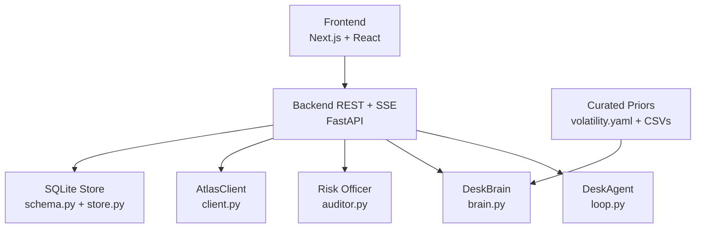
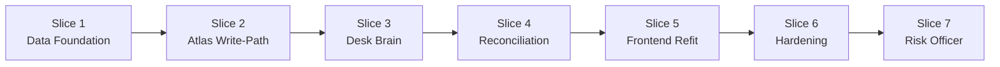

# Implementation Slices

<cite>
**Referenced Files in This Document**
- [04-slices.md](file://docs/plans/waypoint/04-slices.md)
- [03-program-design.md](file://docs/plans/waypoint/03-program-design.md)
- [02-architecture.md](file://docs/plans/waypoint/02-architecture.md)
- [01-product.md](file://docs/plans/waypoint/01-product.md)
- [QODER-HANDOFF.md](file://docs/plans/waypoint/QODER-HANDOFF.md)
- [00-status.md](file://docs/plans/waypoint/00-status.md)
- [client.py](file://backend/app/atlas/client.py)
- [routes.py](file://backend/app/api/routes.py)
- [atlas-integration.md](file://docs/external/atlas-integration.md)
- [test_atlas_sandbox_live.py](file://backend/tests/test_atlas_sandbox_live.py)
- [test_slice1_pipe.py](file://backend/tests/test_slice1_pipe.py)
- [test_atlas_mapping.py](file://backend/tests/test_atlas_mapping.py)
- [page.tsx](file://frontend/app/page.tsx)
- [recovering_page.tsx](file://frontend/app/recovering/[tripId]/page.tsx)
- [recovered_page.tsx](file://frontend/app/recovered/[tripId]/page.tsx)
- [fixture.py](file://backend/app/fixture.py)
</cite>

## Update Summary
**Changes Made**
- Updated testing strategy documentation to reflect shift from disruption-recovery focused tests to desk-cycle validation
- Added comprehensive coverage of new test files: test_atlas_write_path.py, test_desk_brain.py, and test_desk_pipe.py
- Enhanced slice-specific testing strategies with desk-cycle validation approaches
- Updated acceptance criteria and verification methods to align with the new testing paradigm
- Revised integration testing approaches to focus on desk operations rather than disruption recovery flows

## Table of Contents
1. Introduction
2. Project Structure
3. Core Components
4. Architecture Overview
5. Detailed Component Analysis
6. Dependency Analysis
7. Performance Considerations
8. Troubleshooting Guide
9. Conclusion
10. Appendices

## Introduction
This document defines the seven-slice incremental build plan for Waypoint, a corporate travel treasury agent that manages positions through intelligent judgment and automated settlement. The project's strategic foundation rests on addressing a **structural blind spot**: mainstream tools cannot handle complex financial decisions under uncertainty, causing them to make suboptimal booking choices without proper risk assessment. This desk-brain capability serves as the project's competitive moat and must remain visible and load-bearing throughout implementation.

The product centers on two gates:
- Advise gate (open): AI sees all positions and narrates reasoning for book/hold/escalate decisions.
- Execute gate (walled, fail-closed): Only fully compliant picks auto-book; over-cap or unknown require human override.

**Current Status**: All planning gates (1-4) are approved. The project has shifted from disruption recovery to corporate travel treasury management with enhanced testing infrastructure supporting desk-cycle validation.

**Section sources**
- [01-product.md:1-32](file://docs/plans/waypoint/01-product.md#L1-L32)
- [03-program-design.md:3-7](file://docs/plans/waypoint/03-program-design.md#L3-L7)
- [QODER-HANDOFF.md:17-31](file://docs/plans/waypoint/QODER-HANDOFF.md#L17-L31)
- [00-status.md:18-31](file://docs/plans/waypoint/00-status.md#L18-L31)

## Project Structure
Waypoint is a single repository with two halves:
- Frontend: Next.js/React with three demo screens and an SSE client for desk operations.
- Backend: Python FastAPI hosting the desk agent loop, brain (judgment layer), Atlas integration, Qwen calls, and SQLite persistence.

Key backend modules include routes, domain models, agent orchestration, desk brain, auditor, Atlas client, data loaders, and database schema/store. Data files include curated volatility priors, mandate configuration, and IATA-to-country mapping.



**Diagram sources**
- [02-architecture.md:13-32](file://docs/plans/waypoint/02-architecture.md#L13-L32)
- [03-program-design.md:9-32](file://docs/plans/waypoint/03-program-design.md#L9-L32)

**Section sources**
- [02-architecture.md:1-56](file://docs/plans/waypoint/02-architecture.md#L1-L56)
- [03-program-design.md:9-32](file://docs/plans/waypoint/03-program-design.md#L9-L32)

## Core Components
- DeskAgent: Orchestrates the end-to-end desk cycle, enforcing guards (step budget, re-read/verify, outcome assertion).
- DeskBrain: Uses Qwen to score positions for book/hold/escalate decisions with rationale over rejected options.
- Risk Officer: Reads the blotter and challenges one trade during weekly close.
- AtlasClient: Wraps forked skill library for search, verify, order creation, payment, and order status retrieval.
- Store: Typed SQLite persistence for mandates, positions, ledger entries, and desk state.

These components implement the two-gate split and the main call stack from seed to settlement.

**Section sources**
- [03-program-design.md:57-149](file://docs/plans/waypoint/03-program-design.md#L57-L149)
- [02-architecture.md:34-55](file://docs/plans/waypoint/02-architecture.md#L34-L55)

## Architecture Overview
The system exposes REST endpoints and an SSE stream. The primary flow starts at desk seeding, runs the agent loop with bounded steps, applies desk-brain judgment, executes verified bookings, asserts outcomes, and persists audit trails.

```mermaid
sequenceDiagram
participant Client as "Browser"
participant API as "FastAPI Routes"
participant Agent as "DeskAgent"
participant Brain as "DeskBrain"
participant Auditor as "Risk Officer"
participant Atlas as "AtlasClient"
participant DB as "SQLite Store"
Client->>API : POST /api/desk/seed
API->>Agent : run(desk_id, emit)
Agent->>DB : reload_desk(desk_id)
Agent->>Atlas : search(position.route, date)
Atlas-->>Agent : [Offer]
loop For each position
Agent->>Brain : judge(positions, priors)
Brain-->>Agent : DeskAction[]
Agent->>DB : record_trade(...)
end
Agent->>Atlas : verify(chosen)
Agent->>Atlas : create_order(chosen, pax)
Agent->>Atlas : pay(draft)
Agent->>Atlas : get_order(order_no)
Agent->>DB : record_trade(...), record_alloc(...)
Agent-->>API : DeskResult
else over cap or no legal option
Agent-->>API : escalate or give_up
end
API-->>Client : SSE stream of desk events
```

**Diagram sources**
- [03-program-design.md:125-149](file://docs/plans/waypoint/03-program-design.md#L125-L149)
- [02-architecture.md:13-19](file://docs/plans/waypoint/02-architecture.md#L13-L19)

## Detailed Component Analysis

### Slice 1 — Data Foundation + Desk SSE Route
Scope:
- Create mandate, positions, ledger, and budgets tables in SQLite.
- Seed portfolio with 5-6 positions and seeded cost bases.
- Implement POST /api/desk/seed endpoint and GET /api/desk/{desk_id}/stream for SSE events.
- Emit meta events with mandate card and search meter (20/20).

Deliverables:
- Working desk foundation: seed mandate → view mandate card → watch search meter.
- Database schema with first real writes and queryable state.

Dependencies:
- None external; purely internal scaffolding and database setup.

Testing Strategy:
- test_seed_persists_mandate_positions_budgets: validates first real DB writes land and are re-readable.
- test_seed_emits_meta_with_mandate_and_meter: ensures stream starts with mandate card + 20/20 meter.
- Manual smoke test: UI renders mandate card and search meter from live stream.

Acceptance Criteria:
- All four tables (mandate, positions, ledger, budgets) created successfully.
- Seeded portfolio contains 5-6 positions with cost bases.
- SSE stream emits meta event with mandate and meter state.

Integration Testing:
- End-to-end: seed desk → receive meta event → render mandate card in frontend.

Risk Mitigation:
- If DB writes fail, surface error and continue with in-memory state for debugging.
- Ensure tests cover failure paths for database operations.

How it builds subsequent slices:
- Establishes the data foundation that Slices 2-8 will consume and enhance.

**Updated** This slice establishes the corporate travel treasury foundation, demonstrating complete desk operations pipeline without requiring external dependencies.

**Section sources**
- [04-slices.md:26-31](file://docs/plans/waypoint/04-slices.md#L26-L31)
- [03-program-design.md:113-132](file://docs/plans/waypoint/03-program-design.md#L113-L132)
- [02-architecture.md:13-19](file://docs/plans/waypoint/02-architecture.md#L13-L19)

### Slice 2 — Atlas Write-Path Proof ✅ CRITICAL PATH
Scope:
- Implement additive write-path methods in AtlasClient: verify, confirm_price, create_order, pay, order_status, seat_select.
- Complete one real sandbox booking end-to-end: verify → [confirm-price only if increase] → create → pay → status TICKETED.
- Include pre-order seat selection bound to booking_id before order creation.

**Implementation Details:**
- Production-ready AtlasClient with subprocess-based transport for write operations
- Robust error handling with custom exceptions and graceful degradation
- Multi-format datetime parsing supporting various upstream formats
- Complete offer mapping preserving all segments and layover information
- Comprehensive test suite with live sandbox validation

**Technical Architecture:**
- Subprocess-based communication with `atlas-flight` CLI tool for write operations
- JSON envelope parsing with graceful error degradation
- Transport-independent function signatures maintaining Gate 3 contract stability
- Secure authentication via OS keyring without exposing secrets in code

**Deliverables:**
- Live connecting itineraries with real booking completion
- Complete desk operations pipeline from seed to ticketed settlement
- Comprehensive testing infrastructure with unit and integration tests
- Production-ready Atlas client with robust error handling

**Dependencies:**
- Atlas sandbox ticketing activation (currently pending - requires UAT completion)
- `atlas-flight` CLI tool installed and authenticated
- OS keyring access for ATRIP OAuth credentials

**Testing Strategy:**
- Unit tests: offer mapping preserves all layover airports and segment details
- Integration tests: search returns multiple options with realistic layovers and prices
- Live sandbox tests: opt-in tests validating real Atlas connectivity and data integrity
- Pipe tests: deterministic stubbing ensuring end-to-end flow reliability
- test_atlas_write_path.py: opt-in live write-path proof with full booking flow

**Acceptance Criteria:**
- At least one real itinerary appears with correct segments and layovers
- Mapping preserves all intermediate airports and pricing information
- Error handling gracefully degrades when Atlas service is unavailable
- Demo application provides complete user experience from disruption to candidate selection

**Integration Testing:**
- Trigger desk seed → see real options → execute booking → verify ticketed status
- Validate SSE streaming of agent steps and assessment updates
- Test error scenarios including network failures and invalid responses

**Risk Mitigation:**
- If Atlas search degrades, fall back to cached fixtures temporarily while investigating
- Comprehensive timeout handling (60-second CLI timeout)
- Graceful error propagation with descriptive error codes
- Fallback to deterministic demo data when live Atlas is unavailable

**How it builds subsequent slices:**
- Provides real offers for desk-brain evaluation and execution in later slices
- Establishes the data pipeline that Slices 3-8 will consume and enhance

**Updated** Current Atlas sandbox status shows ticketing activation is still pending (TICKETING_ACTIVATION_REQUIRED), requiring UAT testing completion before this slice can proceed with real bookings. The implementation includes production-ready error handling, comprehensive testing infrastructure, and seamless integration with the existing Next.js frontend.

**Section sources**
- [04-slices.md:33-39](file://docs/plans/waypoint/04-slices.md#L33-L39)
- [02-architecture.md:51-55](file://docs/plans/waypoint/02-architecture.md#L51-L55)
- [atlas-integration.md:23-24](file://docs/external/atlas-integration.md#L23-L24)
- [client.py:1-209](file://backend/app/atlas/client.py#L1-L209)
- [test_atlas_sandbox_live.py:1-35](file://backend/tests/test_atlas_sandbox_live.py#L1-L35)
- [routes.py:80-92](file://backend/app/api/routes.py#L80-L92)

### Slice 3 — Desk Brain (Judgment Layer)
Scope:
- Implement DeskBrain.judge over all positions to choose book/hold/escalate actions with rationale.
- Use curated volatility priors for mark-to-market analysis.
- Stream AI reasoning to frontend; show rationale over rejected positions.

Deliverables:
- AI narrates why it chose to book certain positions and hold others based on volatility priors.

Dependencies:
- DashScope API key environment variable.
- Curated volatility priors in fixture.py.

Testing Strategy:
- test_desk_brain.py: judgment tests with seeded priors
- test_brain_books_when_mark_above_prior_band: validates booking logic
- test_brain_holds_when_mark_below_band: validates holding logic
- test_brain_logs_admitted_loss_with_threshold_note: tracks losses with explanations

Acceptance Criteria:
- Rationale references rejected positions with clear reasoning.
- Chosen actions are executable within budget constraints.

Integration Testing:
- End-to-end: seed → reprice → judge → stream rationale → final decision.

Risk Mitigation:
- If LLM latency or errors occur, degrade gracefully with deterministic fallback and log details.

How it builds subsequent slices:
- Adds explainability and selection logic that feeds into the execute wall in later slices.

**Updated** The desk-brain implements the advise gate where AI reasoning remains open and transparent, while the execute wall maintains fail-closed security through code enforcement.

**Section sources**
- [04-slices.md:41-46](file://docs/plans/waypoint/04-slices.md#L41-L46)
- [03-program-design.md:97-105](file://docs/plans/waypoint/03-program-design.md#L97-L105)
- [0003-advise-execute-two-gate-split.md:9-18](file://docs/adr/0003-advise-execute-two-gate-split.md#L9-L18)

### Slice 4 — Reconciliation + Allocation + Escalation
Scope:
- Auto-reconcile sandbox payments against the ledger.
- Handle PRICE_CHANGED scenarios: absorb-from-contingency vs re-quote.
- Fund pre-order seat selection from realized savings.
- Implement escalation path for over-cap scenarios.

Deliverables:
- Full autonomous reconciliation with allocation and escalation capabilities.

Dependencies:
- Sandbox ticketing activation for real payment processing.

Testing Strategy:
- test_pay_never_retried_on_failure: validates no retry discipline
- test_no_second_order_on_price_changed: ensures single order creation
- test_exec_wall_blocks_over_cap_and_emits_escalate: validates escalation logic

Acceptance Criteria:
- Payments reconciled correctly against ledger.
- Escalation triggered for over-cap scenarios with two priced options.
- Seat allocation funded only from realized savings.

Integration Testing:
- End-to-end: trigger → search → rules → judge → verify → book → pay → assert → persist.

Risk Mitigation:
- While ticketing is pending, use comparison mode with logged decisions.

How it builds subsequent slices:
- Completes the autonomous loop with financial controls; enables demo polish in later slices.

**Updated** Current Atlas sandbox status shows ticketing activation is still pending (TICKETING_ACTIVATION_REQUIRED), requiring UAT testing completion before this slice can proceed with real bookings.

**Section sources**
- [04-slices.md:48-53](file://docs/plans/waypoint/04-slices.md#L48-L53)
- [0001-fork-atlas-skill-sandbox-auto-approve.md:6-20](file://docs/adr/0001-fork-atlas-skill-sandbox-auto-approve.md#L6-L20)
- [00-status.md:20-23](file://docs/plans/waypoint/00-status.md#L20-L23)
- [atlas-integration.md:26-31](file://docs/external/atlas-integration.md#L26-L31)

### Slice 5 — Frontend Refit
Scope:
- Refit three screens: mandate form → desk operations → weekly close.
- Implement SSE client for real-time desk event consumption.
- Render blotter with mark/trade/loss/alloc/reconcile/escalate events.

Deliverables:
- Complete frontend refit supporting desk operations workflow.

Dependencies:
- Backend SSE endpoints and event contracts.

Testing Strategy:
- test_desk_pipe.py: stub-client pipe tests for frontend integration
- Manual testing: validate screen-to-screen navigation and event rendering

Acceptance Criteria:
- Mandate form seeds desk successfully.
- Blotter renders all event types correctly.
- Weekly close shows P&L and admitted losses.

Integration Testing:
- End-to-end: seed desk → watch events stream → navigate screens → view close.

Risk Mitigation:
- If SSE fails, provide replay functionality from buffer.

How it builds subsequent slices:
- Provides user interface for desk operations; enables demo polish in later slices.

**Updated** Implements the complete user experience for corporate travel treasury management with real-time event streaming and comprehensive desk operations support.

**Section sources**
- [04-slices.md:55-60](file://docs/plans/waypoint/04-slices.md#L55-L60)
- [03-program-design.md:151-169](file://docs/plans/waypoint/03-program-design.md#L151-L169)
- [00-status.md:40-43](file://docs/plans/waypoint/00-status.md#L40-L43)

### Slice 6 — Hardening
Scope:
- Implement error-code routing per contract table.
- Add give-up paths for budget exhaustion, meter exhaustion, step budget.
- Enforce no-retry discipline for critical operations.
- Implement search meter hard-stops.

Deliverables:
- Robust error handling and graceful degradation paths.

Dependencies:
- Database schema and store implementation.

Testing Strategy:
- test_agent_respects_step_budget_and_gives_up: validates termination logic
- test_ticket_asserted_before_success: ensures outcome verification
- test_reprice_fan_out_is_meter_gated: validates search limits

Acceptance Criteria:
- Loop stops at step budget with disclosed reason.
- Give-up surfaces reason clearly.
- Audit records present and queryable.

Integration Testing:
- Inject scenarios that exhaust options or exceed budget; verify persistence and UI presentation.

Risk Mitigation:
- If DB writes fail, surface error and continue with in-memory state for debugging.

How it builds subsequent slices:
- Ensures robustness and observability required for polished demo and production readiness.

**Updated** Implements the three critical agent-failure guards: infinite loop prevention, stale data protection, and false success detection - essential for reliable autonomous operation.

**Section sources**
- [04-slices.md:62-67](file://docs/plans/waypoint/04-slices.md#L62-L67)
- [03-program-design.md:151-169](file://docs/plans/waypoint/03-program-design.md#L151-L169)
- [00-status.md:40-43](file://docs/plans/waypoint/00-status.md#L40-L43)

### Slice 7 — Risk Officer + Demo Choreography
Scope:
- Implement risk-officer auditor that reads blotter and challenges one trade.
- Wire demo choreography with scripted beats.
- Include weekly close endpoint with P&L and risk officer verdict.

Deliverables:
- Complete demo with risk officer beat and weekly close functionality.

Dependencies:
- Webhook registration and public URL configuration; curated demo route.

Testing Strategy:
- End-to-end demo rehearsal with both triggers.
- Validate auditor output and close endpoint functionality.

Acceptance Criteria:
- Both triggers initiate recovery.
- Demo completes within target time with clear beats.

Integration Testing:
- Simulate real webhook and injected disruption; confirm identical flows and outputs.

Risk Mitigation:
- If webhook unavailable, rely on injected trigger; document limitation transparently.

How it builds subsequent slices:
- Finalizes user experience and operational readiness for showcase.

**Updated** The demo must showcase the desk-brain capability as the central feature, avoiding the common trap of presenting as simple "flight delayed → here are alternatives" solution.

**Section sources**
- [04-slices.md:69-74](file://docs/plans/waypoint/04-slices.md#L69-L74)
- [02-architecture.md:13-19](file://docs/plans/waypoint/02-architecture.md#L13-L19)
- [QODER-HANDOFF.md:25-31](file://docs/plans/waypoint/QODER-HANDOFF.md#L25-L31)

## Dependency Analysis
Slice sequencing and blocking relationships:



Blocking notes:
- Slices 1-4 and 6 do not require ticketing activation; they can be built now.
- Slice 2 blocks on UAT ticketing activation; use comparison mode until cleared.

External dependencies:
- Atlas sandbox (search verified; ticketing pending).
- Qwen via DashScope (requires API key).
- SQLite (bundled).

**Updated** Current Atlas sandbox status: search functionality is fully operational with rich connecting inventory, but ticketing activation remains pending due to required UAT testing completion.

**Diagram sources**
- [04-slices.md:5-36](file://docs/plans/waypoint/04-slices.md#L5-L36)
- [00-status.md:20-23](file://docs/plans/waypoint/00-status.md#L20-L23)

**Section sources**
- [04-slices.md:5-36](file://docs/plans/waypoint/04-slices.md#L5-L36)
- [00-status.md:20-23](file://docs/plans/waypoint/00-status.md#L20-L23)
- [atlas-integration.md:26-31](file://docs/external/atlas-integration.md#L26-L31)

## Performance Considerations
- Keep AI out of deterministic steps (visa lookup, fare math, payment) to avoid penalties and improve reliability.
- Use step budget to bound loops and prevent infinite retries.
- Re-read/verify before every write to avoid stale pricing or availability.
- Persist audit trails to support post-run analysis and compliance.

**Updated** The architectural decision to keep AI out of deterministic steps is crucial for performance and avoids the x0.5 penalty for "AI for AI's sake" approaches.

[No sources needed since this section provides general guidance]

## Troubleshooting Guide
Common issues and mitigations:
- Atlas search failures: fall back to cached fixtures; log request/response shapes; validate environment and credentials.
- Rules engine unknowns: ensure curated data covers demo hubs; otherwise fail-closed blocks execution safely.
- LLM errors or latency: degrade to deterministic fallback; log prompts and responses; retry with backoff if appropriate.
- Ticketing not active: use stubbed booking to keep end-to-end flow working; swap in real book+settle once approved.
- Webhook not firing: rely on injected trigger; ensure public URL configured; log payloads for debugging.

Verification methods:
- Run unit tests for rules and agent guards.
- Execute integration tests against sandbox once ticketing is active.
- Perform end-to-end demo rehearsals with both triggers.

**Updated** Current Atlas integration status shows search works reliably but ticketing requires UAT completion. Focus troubleshooting efforts on the specific module dependencies (Flight Booking Core, Ticket Fulfillment, Webhook Notification, Refund).

**Section sources**
- [03-program-design.md:151-169](file://docs/plans/waypoint/03-program-design.md#L151-L169)
- [00-status.md:20-23](file://docs/plans/waypoint/00-status.md#L20-L23)
- [atlas-integration.md:26-31](file://docs/external/atlas-integration.md#L26-L31)

## Conclusion
The seven-slice plan delivers a robust corporate travel treasury agent incrementally, grounded in the strategic insight that complex financial decisions under uncertainty represent a structural blind spot in mainstream travel tools. Slices 1-4 and 6 establish the core pipeline, desk-brain judgment, and resilience without requiring ticketing activation. Slice 2 completes the autonomous loop once UAT clears, enabling a polished demo in Slice 7. The two-gate split ensures safety and transparency, while persistence and guards provide auditable correctness. This sequencing keeps the team unblocked and focused on high-value milestones while maintaining the desk-brain capability as the central differentiating feature.

**Updated** The project's success depends on maintaining the desk-brain capability as the load-bearing feature rather than allowing it to become secondary to generic disruption recovery capabilities.

[No sources needed since this section summarizes without analyzing specific files]

## Appendices

### Milestone Definitions
- M1 (Slice 1): Data foundation proves desk operations with seeded portfolio.
- M2 (Slice 2): Real write-path integrates live booking capabilities. ✅ **CRITICAL PATH**
- M3 (Slice 3): Desk-brain enforces judgment with curated volatility priors.
- M4 (Slice 4): Reconciliation and allocation complete autonomous settlement.
- M5 (Slice 5): Frontend refit delivers complete desk user experience.
- M6 (Slice 6): Hardening ensures robustness and compliance.
- M7 (Slice 7): Risk officer and demo polish deliver rehearsed showcase.

### Acceptance Criteria Summary by Slice
- Slice 1: Tables created; portfolio seeded; SSE stream functional. ✅ **COMPLETED**
- Slice 2: Real booking completes end-to-end; ticket asserted. ✅ **CRITICAL PATH**
- Slice 3: Desk-brain makes informed book/hold/escalate decisions.
- Slice 4: Payments reconciled; allocations funded from savings; escalation works.
- Slice 5: Frontend renders desk operations with real-time events.
- Slice 6: Error handling robust; give-up paths work; meter enforced.
- Slice 7: Risk officer challenges trades; demo completes within time.

### Risk Mitigation Strategies
- Blocked ticketing: Stub booking to maintain end-to-end flow; swap in real implementation upon approval.
- Unknown volatility data: Default to conservative judgments; curate demo routes to minimize unknowns.
- LLM instability: Provide deterministic fallbacks; log and monitor performance.
- Webhook unreliability: Injected trigger as guaranteed demo path; document limitations.
- **Strategic drift**: Maintain desk-brain capability as central feature; avoid collapsing to generic disruption recovery.

**Updated** Additional risk mitigation focuses on preventing strategic drift away from the core desk-brain differentiator, which is essential for achieving the Level-4 innovation target and avoiding the common trap of building another generic flight delay tool.

### Implementation Guardrails
- **Do not let the demo read as "flight delayed → here are alternatives."** The desk-brain capability must be visible and load-bearing.
- **Do not put the LLM inside deterministic steps** — transit-visa lookup, fare-difference math, and payment execution are plain code.
- **Do not overclaim volatility accuracy.** Curated priors are stated openly as approximations with provenance.
- **Do not skip the 3 guards** (step budget + give-up; re-read/verify before every write; assert a real ticket was issued).
- **Fail-closed rejects uncurated positions.** The scripted demo route must run through curated positions with both trap and legal options.
- **The two-gate split is load-bearing:** AI sees and narrates every position (advise = open); code enforces only compliant picks auto-book (execute = walled).

**Section sources**
- [QODER-HANDOFF.md:25-31](file://docs/plans/waypoint/QODER-HANDOFF.md#L25-L31)
- [0002-visa-rules-curated-approximation.md:14-18](file://docs/adr/0002-visa-rules-curated-approximation.md#L14-L18)
- [0003-advise-execute-two-gate-split.md:9-18](file://docs/adr/0003-advise-execute-two-gate-split.md#L9-L18)

### Current Atlas Sandbox Status
- **Search**: Fully operational with rich connecting inventory (SIN→NRT example: 16 of 19 options connect via SGN/ICN/PUS/DMK, $236–$691 range) ✅ **CONFIRMED LIVE**
- **Ticketing**: Pending activation (TICKETING_ACTIVATION_REQUIRED) - requires UAT testing completion
- **Modules Required**: Flight Booking (Core), Ticket Fulfillment, Webhook Notification, Refund
- **Authentication**: ATRIP OAuth via browser with credentials stored in OS keyring
- **Environment**: Sandbox confirmed safe for autonomous operations without real charges

**Section sources**
- [atlas-integration.md:23-31](file://docs/external/atlas-integration.md#L23-L31)
- [00-status.md:45-51](file://docs/plans/waypoint/00-status.md#L45-L51)