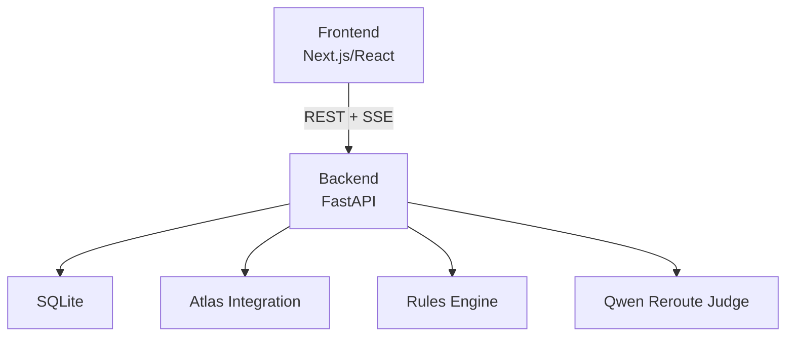
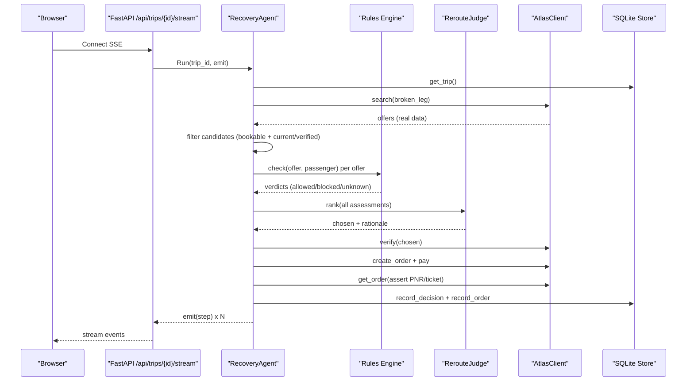
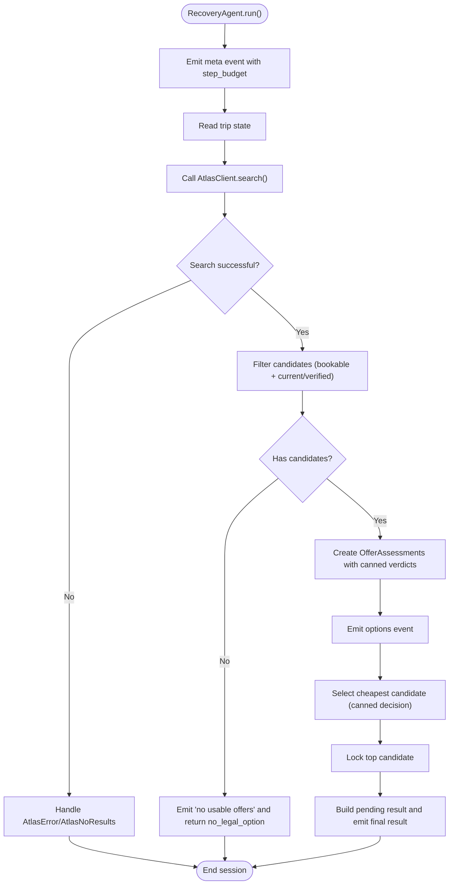
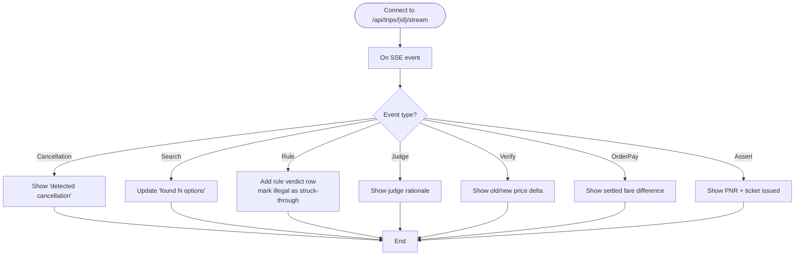
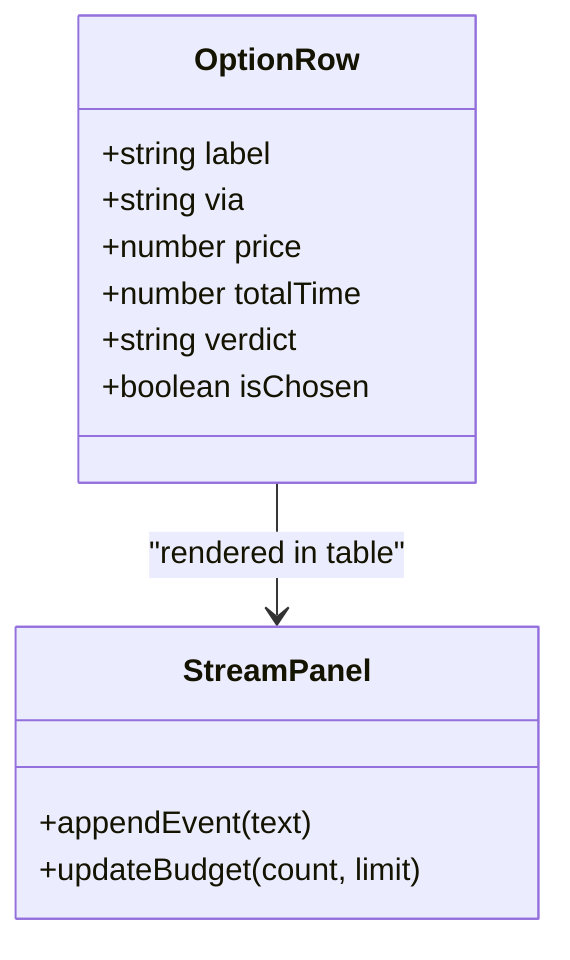
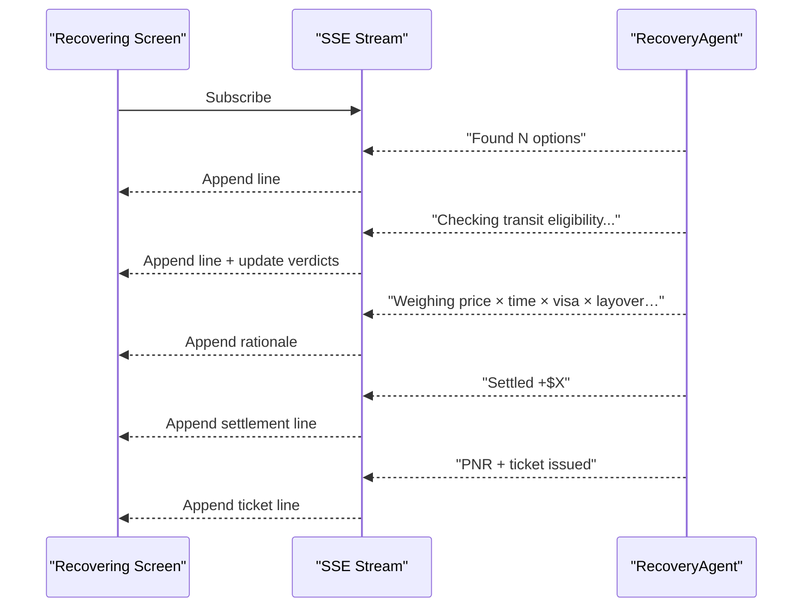
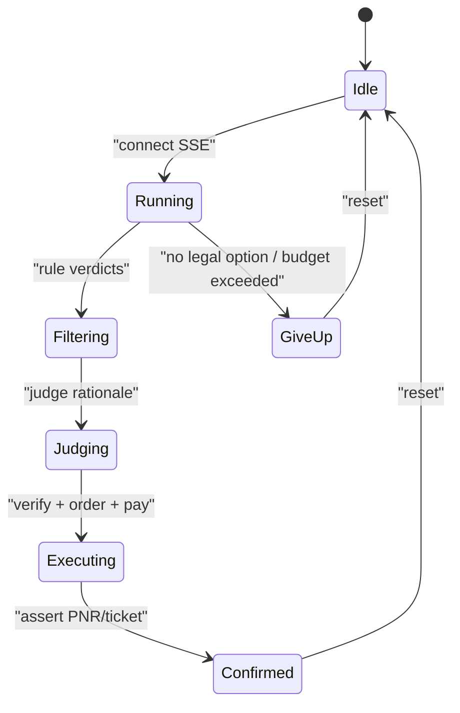
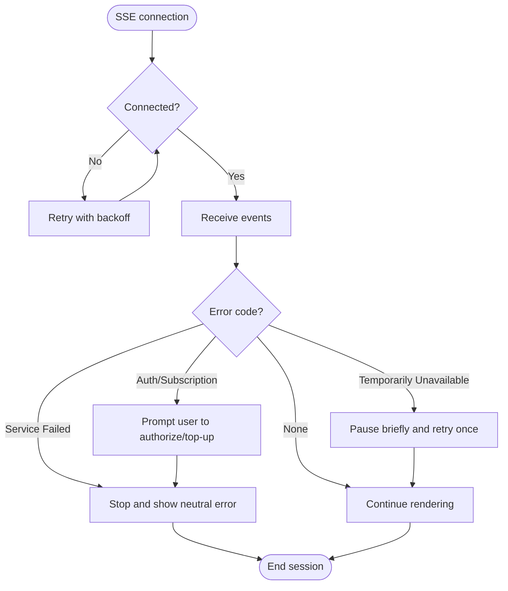
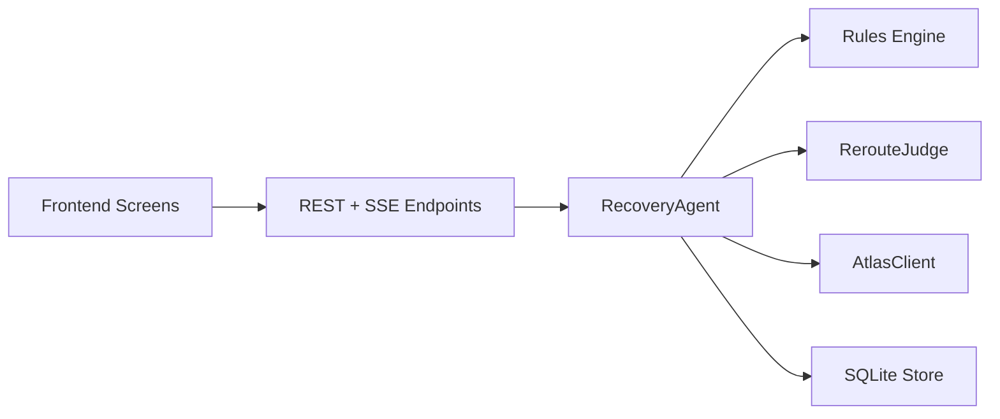

# Agent Recovery Screen

<cite>
**Referenced Files in This Document**
- [loop.py](file://backend/app/agent/loop.py)
- [client.py](file://backend/app/atlas/client.py)
- [models.py](file://backend/app/models.py)
- [fixture.py](file://backend/app/fixture.py)
- [test_slice1_pipe.py](file://backend/tests/test_slice1_pipe.py)
- [error-handling.md](file://.agents/skills/atlas-flight-booking/references/error-handling.md)
- [02-architecture.md](file://docs/plans/waypoint/02-architecture.md)
- [03-program-design.md](file://docs/plans/waypoint/03-program-design.md)
- [04-slices.md](file://docs/plans/waypoint/04-slices.md)
- [01-product.md](file://docs/plans/waypoint/01-product.md)
- [0003-advise-execute-two-gate-split.md](file://docs/adr/0003-advise-execute-two-gate-split.md)
- [02-agent-recovering.html](file://docs/plans/waypoint/mockups/02-agent-recovering.html)
- [01-trip-disrupted.html](file://docs/plans/waypoint/mockups/01-trip-disrupted.html)
- [03-recovery-confirmed.html](file://docs/plans/waypoint/mockups/03-recovery-confirmed.html)
</cite>

## Update Summary
**Changes Made**
- Updated RecoveryAgent implementation to reflect real Atlas search integration
- Added detailed coverage of bounded step loop and candidate filtering logic
- Enhanced error handling documentation for various failure scenarios
- Updated state management to reflect honest intermediate states
- Expanded failure scenario coverage including authentication failures and sold-out routes

## Table of Contents
1. [Introduction](#introduction)
2. [Project Structure](#project-structure)
3. [Core Components](#core-components)
4. [Architecture Overview](#architecture-overview)
5. [Detailed Component Analysis](#detailed-component-analysis)
6. [Dependency Analysis](#dependency-analysis)
7. [Performance Considerations](#performance-considerations)
8. [Troubleshooting Guide](#troubleshooting-guide)
9. [Conclusion](#conclusion)
10. [Appendices](#appendices)

## Introduction
The Agent Recovery Screen provides real-time visibility into an autonomous rebooking process triggered by a flight disruption. It streams the agent's reasoning steps, alternative discovery, rule validation results, and decision-making progress to the user as they happen. The screen visualizes how illegal or risky options are filtered out (shown struck through), while highlighting the chosen legal reroute. It also shows step-by-step actions such as search queries, rule checks, fare comparisons, and booking execution. Behind the scenes, Server-Sent Events (SSE) deliver live updates from the backend to the frontend, keeping the interface synchronized with the agent's workflow.

**Updated** The RecoveryAgent now orchestrates a complete recovery workflow with real Atlas search integration, bounded step loops, and comprehensive error handling for various failure scenarios including no flights found, sold-out routes, and authentication failures.

## Project Structure
This project is organized around a two-part architecture:
- Frontend: Next.js/React screens that consume REST endpoints and an SSE stream for live updates.
- Backend: Python FastAPI hosting the recovery agent loop, rules engine, Atlas integration, Qwen calls, and SQLite persistence.

The recovery flow is designed so that every meaningful step emits an event to the SSE stream, which the frontend renders incrementally. The mockups define the visual targets for the three screens: disrupted trip view, recovering stream, and confirmed recovery summary.

**Diagram sources**
- [02-architecture.md:4-11](file://docs/plans/waypoint/02-architecture.md#L4-L11)
- [03-program-design.md:9-32](file://docs/plans/waypoint/03-program-design.md#L9-L32)

**Section sources**
- [02-architecture.md:4-11](file://docs/plans/waypoint/02-architecture.md#L4-L11)
- [03-program-design.md:9-32](file://docs/plans/waypoint/03-program-design.md#L9-L32)

## Core Components
- Live streaming interface (SSE): Emits agent steps including detection of cancellation, alternative search results, rule checks, judge rationale, verification, order creation, payment settlement, and outcome assertion.
- Filtering visualization: Illegal or blocked alternatives are shown with strikethrough styling; the chosen legal option is highlighted.
- Step-by-step UI components: A terminal-like stream panel showing each action; a table listing options with verdicts; a budget indicator showing step usage; and final confirmation details.
- Real-time state management: The frontend maintains a minimal state machine that appends events, updates tables, and transitions between screens as the agent progresses.

**Updated** The RecoveryAgent now implements a bounded step loop that processes real Atlas search results, filters candidates based on bookability and price status, maintains honest intermediate states, and gracefully handles various failure scenarios.

**Section sources**
- [02-architecture.md:13-19](file://docs/plans/waypoint/02-architecture.md#L13-L19)
- [02-agent-recovering.html:33-60](file://docs/plans/waypoint/mockups/02-agent-recovering.html#L33-L60)
- [03-program-design.md:125-149](file://docs/plans/waypoint/03-program-design.md#L125-L149)

## Architecture Overview
The recovery process begins when a disruption is detected or injected. The backend runs a bounded agent loop that reads current trip state, searches for alternatives using real Atlas data, evaluates them against rules, selects a legal option via the judge, verifies freshness, executes booking and payment, asserts the outcome, and emits each step to the SSE stream. The frontend consumes these events to update the UI in real time.

**Updated** The RecoveryAgent now integrates directly with AtlasClient.search() to retrieve real flight offers, applies candidate filtering based on bookability and price status, and maintains honest intermediate states throughout the workflow.

**Diagram sources**
- [02-architecture.md:13-19](file://docs/plans/waypoint/02-architecture.md#L13-L19)
- [03-program-design.md:125-149](file://docs/plans/waypoint/03-program-design.md#L125-L149)

## Detailed Component Analysis

### RecoveryAgent Orchestration Loop
The RecoveryAgent class now implements a complete orchestration loop with bounded step budget and real Atlas integration.

**Key Features:**
- **Bounded Step Loop**: Enforces step budget limits to prevent infinite loops and ensure graceful degradation
- **Real Atlas Search**: Directly calls AtlasClient.search() to retrieve actual flight offers
- **Candidate Filtering**: Filters offers based on bookability and price status (current/verified)
- **Honest Intermediate States**: Maintains "pending" status until full workflow completes
- **Comprehensive Error Handling**: Handles no flights found, sold-out routes, authentication failures, and service errors

**Diagram sources**
- [loop.py:42-167](file://backend/app/agent/loop.py#L42-L167)

**Section sources**
- [loop.py:35-176](file://backend/app/agent/loop.py#L35-L176)

### Real Atlas Search Integration
The RecoveryAgent now performs real searches against the Atlas sandbox, providing genuine flight inventory for recovery scenarios.

**Implementation Details:**
- Uses `asyncio.to_thread()` to run synchronous Atlas CLI calls without blocking the event loop
- Handles both successful searches and various error conditions
- Processes real offer data including segments, pricing, and availability
- Sorts offers by price (cheapest first) for consistent selection

**Error Scenarios Handled:**
- `AtlasNoResults`: No flights available (route_not_supported, no_flight, sold_out)
- `AtlasError`: Authentication failures, service timeouts, and other Atlas errors
- Graceful fallback to comparison-only mode when ticketing is not activated

**Section sources**
- [loop.py:67-92](file://backend/app/agent/loop.py#L67-L92)
- [client.py:154-177](file://backend/app/atlas/client.py#L154-L177)

### Candidate Filtering Logic
The agent applies sophisticated filtering to identify viable recovery candidates based on bookability and price status.

**Filtering Criteria:**
- **Bookability**: Only offers where `bookable=true` are considered executable
- **Price Status**: Only offers with `price_status` in ("current", "verified") are treated as bookable
- **Fallback Mode**: When no bookable offers exist, all offers are surfaced as comparison fares with appropriate messaging

**Comparison-Only Mode:**
When ticketing is not activated (TICKETING_ACTIVATION_REQUIRED), the system surfaces comparison-mode offers with clear messaging that they cannot proceed to verification or ticketing.

**Section sources**
- [loop.py:94-124](file://backend/app/agent/loop.py#L94-L124)
- [models.py:57-68](file://backend/app/models.py#L57-L68)

### Honest Intermediate State Management
The RecoveryAgent maintains transparent state throughout the recovery workflow, never asserting outcomes that haven't been verified.

**State Progression:**
- **Initial**: Meta event with step budget information
- **Searching**: Real Atlas search in progress
- **Filtered**: Candidates identified and assessed
- **Decided**: Top candidate selected (but not yet booked)
- **Pending**: Final state indicating recovery is in progress but not completed

**Guard #3 - Never Assert Unissued Tickets:**
The system ensures that ticket assertions only occur after successful order creation and verification, maintaining data integrity throughout the workflow.

**Section sources**
- [loop.py:161-167](file://backend/app/agent/loop.py#L161-L167)
- [fixture.py:122-140](file://backend/app/fixture.py#L122-L140)

### Comprehensive Failure Scenario Handling
The RecoveryAgent implements robust error handling for various failure scenarios encountered during the recovery process.

**Failure Categories:**
- **No Flights Found**: Clean give-up with "no_legal_option" status
- **Authentication Failures**: Graceful handling of AUTHORIZATION_REQUIRED, AUTH_EXPIRED, and related auth errors
- **Service Unavailable**: Handling of temporary service issues with retry logic
- **Sold-Out Routes**: Specific handling for route_not_supported and no_flight scenarios
- **Timeout Errors**: Timeout handling for long-running Atlas operations

**Error Response Pattern:**
All failures follow a consistent pattern: emit explanatory step message, set appropriate status, and provide clean termination without exposing internal error codes to users.

**Section sources**
- [loop.py:73-92](file://backend/app/agent/loop.py#L73-L92)
- [error-handling.md:7-17](file://.agents/skills/atlas-flight-booking/references/error-handling.md#L7-L17)

### Live Streaming Interface (SSE)
- Purpose: Deliver incremental updates as the agent progresses through its workflow.
- Event types: Detection of cancellation, search result counts, rule verdicts, judge rationale, verification deltas, order/payment settlement, and outcome assertion.
- Frontend behavior: Append each event to the stream panel, update option rows (marking illegal ones as struck-through), highlight the chosen legal option, and show step budget usage.

**Diagram sources**
- [02-architecture.md:13-19](file://docs/plans/waypoint/02-architecture.md#L13-L19)
- [03-program-design.md:125-149](file://docs/plans/waypoint/03-program-design.md#L125-L149)

**Section sources**
- [02-architecture.md:13-19](file://docs/plans/waypoint/02-architecture.md#L13-L19)
- [03-program-design.md:125-149](file://docs/plans/waypoint/03-program-design.md#L125-L149)

### Filtering Visualization (Illegal Options Struck Through)
- Visual cue: Illegal or blocked alternatives are rendered with strikethrough text and muted color to indicate they cannot be booked.
- Highlighted choice: The chosen legal reroute is visually emphasized (e.g., background highlight and left border).
- Verdict column: Each option includes a verdict cell indicating allowed, blocked, or unknown status with concise reasons.

**Diagram sources**
- [02-agent-recovering.html:42-60](file://docs/plans/waypoint/mockups/02-agent-recovering.html#L42-L60)

**Section sources**
- [02-agent-recovering.html:42-60](file://docs/plans/waypoint/mockups/02-agent-recovering.html#L42-L60)

### Step-by-Step Agent Actions
- Search queries: Emit when alternatives are found; the count updates in the stream panel.
- Rule checks: Emit per rule per offer; illegal options are marked struck-through in the table.
- Fare comparisons: Emitted during verification and settlement phases; shows old vs new prices and fare difference.
- Booking execution: Emitted during order creation, payment settlement, and outcome assertion; confirms PNR and ticket issuance.

**Diagram sources**
- [02-agent-recovering.html:33-60](file://docs/plans/waypoint/mockups/02-agent-recovering.html#L33-L60)
- [03-program-design.md:125-149](file://docs/plans/waypoint/03-program-design.md#L125-L149)

**Section sources**
- [02-agent-recovering.html:33-60](file://docs/plans/waypoint/mockups/02-agent-recovering.html#L33-L60)
- [03-program-design.md:125-149](file://docs/plans/waypoint/03-program-design.md#L125-L149)

### Real-Time State Management
- State model: Minimal state capturing current step count, list of options with verdicts, chosen option, and final result flags.
- Updates: Each SSE event triggers targeted mutations—append to stream, update option rows, adjust budget counter, and transition to confirmation screen upon completion.
- Guards: Step budget limits ensure graceful give-up if no legal option exists; stale checks prevent booking outdated offers.

**Diagram sources**
- [02-agent-recovering.html:40-60](file://docs/plans/waypoint/mockups/02-agent-recovering.html#L40-L60)
- [03-program-design.md:125-149](file://docs/plans/waypoint/03-program-design.md#L125-L149)

**Section sources**
- [02-agent-recovering.html:40-60](file://docs/plans/waypoint/mockups/02-agent-recovering.html#L40-L60)
- [03-program-design.md:125-149](file://docs/plans/waypoint/03-program-design.md#L125-L149)

### Error Handling for Network Interruptions, Timeouts, and Agent Failures
- Network interruptions: SSE clients should handle disconnects and reconnect attempts; on failure, surface a friendly message and allow retry.
- Timeouts: If SSE or upstream services time out, stop polling and present a clear error state with guidance to retry later.
- Agent failures: If the agent cannot find a legal option or exceeds step budget, emit a "give up" event and explain why; do not auto-book blocked or unknown options.
- Atlas-specific errors: Follow normalized error codes and behaviors (authorization, subscription, temporary unavailability) to avoid exposing internal codes and to guide user actions safely.

**Updated** The RecoveryAgent now handles specific Atlas error scenarios including authentication failures, service timeouts, and no-results conditions with appropriate user-facing messages and clean state transitions.

**Diagram sources**
- [error-handling.md:65-74](file://.agents/skills/atlas-flight-booking/references/error-handling.md#L65-L74)

**Section sources**
- [error-handling.md:65-74](file://.agents/skills/atlas-flight-booking/references/error-handling.md#L65-L74)

### Performance Considerations
- Streaming efficiency: Emit coarse-grained events to reduce overhead; batch rule verdicts where appropriate.
- Memory management: Limit retained history in the stream panel; virtualize long lists of options if needed.
- Long-running processes: Enforce step budget and timeouts; periodically flush persisted evidence to disk to avoid large in-memory structures.
- UI responsiveness: Keep event handlers lightweight; defer heavy computations off the main thread if necessary.

**Updated** The RecoveryAgent uses `asyncio.to_thread()` to run synchronous Atlas CLI calls without blocking the event loop, ensuring responsive streaming even during long-running search operations.

[No sources needed since this section provides general guidance]

### Guidelines for Adding New Visualization Types
- Define a new event schema aligned with domain types so both backend and frontend share a stable contract.
- Extend the SSE handler to recognize and render the new event type without disrupting existing flows.
- Ensure the new visualization respects the two-gate split: advise gate can show all options and reasoning; execute gate remains fail-closed and only books allowed options.
- Test end-to-end with mocked data before integrating real logic to keep slices independent and testable.

**Section sources**
- [04-slices.md:7-33](file://docs/plans/waypoint/04-slices.md#L7-L33)
- [0003-advise-execute-two-gate-split.md:9-17](file://docs/adr/0003-advise-execute-two-gate-split.md#L9-L17)

## Dependency Analysis
The Agent Recovery Screen depends on:
- Backend endpoints: Disruption trigger, recovery result retrieval, and SSE stream.
- Rules engine: Provides verdicts that drive filtering visuals.
- Atlas integration: Supplies alternatives, verification, order creation, payment, and outcome assertion.
- Qwen judge: Produces rationale and selection among legal options.
- SQLite store: Persists verdicts, decisions, and orders for auditability.

**Updated** The RecoveryAgent now has direct dependencies on AtlasClient for real search functionality and maintains strict separation between read operations (search) and write operations (booking) across different slices.

**Diagram sources**
- [02-architecture.md:4-11](file://docs/plans/waypoint/02-architecture.md#L4-L11)
- [03-program-design.md:9-32](file://docs/plans/waypoint/03-program-design.md#L9-L32)

**Section sources**
- [02-architecture.md:4-11](file://docs/plans/waypoint/02-architecture.md#L4-L11)
- [03-program-design.md:9-32](file://docs/plans/waypoint/03-program-design.md#L9-L32)

## Performance Considerations
- Stream pacing: Avoid flooding the UI; group related events and throttle updates.
- Data minimization: Only send necessary fields per event; compute derived visuals on the client side when feasible.
- Resource cleanup: Close SSE connections promptly; release any allocated resources on error or user navigation.
- Observability: Log event emission points and durations to identify bottlenecks in long-running recoveries.

**Updated** The RecoveryAgent implements performance optimizations including asynchronous thread execution for Atlas calls, efficient candidate filtering, and controlled step pacing to maintain responsive user experience during long recovery workflows.

[No sources needed since this section provides general guidance]

## Troubleshooting Guide
- No events received: Check network connectivity and SSE endpoint availability; verify CORS and authentication if applicable.
- Stalled stream: Inspect backend logs for agent step budget exhaustion or external service timeouts; confirm Atlas sandbox status.
- Incorrect filtering: Validate rules data freshness and curated tables; ensure verdicts are persisted and emitted correctly.
- Final state mismatch: Confirm that outcome assertion succeeded; if not, present a retry path and preserve partial state for recovery.

**Updated** Common troubleshooting scenarios now include Atlas search failures, authentication issues, and no-results conditions that may cause the recovery process to terminate early with appropriate error messaging.

**Section sources**
- [03-program-design.md:125-149](file://docs/plans/waypoint/03-program-design.md#L125-L149)
- [error-handling.md:65-74](file://.agents/skills/atlas-flight-booking/references/error-handling.md#L65-L74)

## Conclusion
The Agent Recovery Screen delivers transparent, real-time insight into autonomous rebooking by streaming the agent's reasoning and actions to the user. It clearly communicates how illegal options are filtered out and how the chosen legal reroute is selected and executed. The design balances openness in advice with strictness in execution, ensuring safety and compliance while maintaining a smooth, responsive user experience. With robust error handling and performance considerations, the screen scales to long-running recoveries and supports future extensions for additional agent capabilities.

**Updated** The enhanced RecoveryAgent now provides a more realistic and robust recovery experience with real Atlas search integration, comprehensive error handling, and transparent state management that accurately reflects the current capabilities and limitations of the system.

[No sources needed since this section summarizes without analyzing specific files]

## Appendices

### Screen Targets and Context
- Disrupted trip view: Shows the canceled leg and downstream risk context.
- Recovering screen: Streams live steps, filters illegal options, highlights the chosen legal reroute, and displays step budget usage.
- Recovery confirmed screen: Summarizes rejected cheapest vs chosen legal, fare difference settlement, and ticketed outcome.

**Section sources**
- [01-product.md:28-31](file://docs/plans/waypoint/01-product.md#L28-L31)
- [01-trip-disrupted.html:28-47](file://docs/plans/waypoint/mockups/01-trip-disrupted.html#L28-L47)
- [02-agent-recovering.html:33-60](file://docs/plans/waypoint/mockups/02-agent-recovering.html#L33-L60)
- [03-recovery-confirmed.html:31-59](file://docs/plans/waypoint/mockups/03-recovery-confirmed.html#L31-L59)

### RecoveryAgent Implementation Details
The RecoveryAgent class serves as the central orchestrator for the recovery workflow, implementing bounded execution, real search integration, and comprehensive error handling.

**Key Implementation Patterns:**
- **Bounded Execution**: Step budget prevents infinite loops and ensures graceful degradation
- **Real Integration**: Direct AtlasClient integration for authentic flight inventory
- **Fail-Closed Design**: Conservative approach that never assumes success without verification
- **Transparent State**: Honest intermediate states that accurately reflect workflow progress

**Section sources**
- [loop.py:35-176](file://backend/app/agent/loop.py#L35-L176)
- [test_slice1_pipe.py:65-79](file://backend/tests/test_slice1_pipe.py#L65-L79)

### Atlas Integration Error Handling
The AtlasClient provides robust error handling for various failure scenarios encountered during flight search and booking operations.

**Error Categories:**
- **Authentication Errors**: AUTHORIZATION_REQUIRED, AUTH_EXPIRED, AUTH_SERVICE_UNAVAILABLE
- **Search Errors**: SEARCH_NO_RESULTS, SERVICE_REQUEST_FAILED, TIMEOUT
- **Service Availability**: SUBSCRIPTION_REQUIRED, TICKETING_ACTIVATION_REQUIRED, TOP_UP_REQUIRED

**Section sources**
- [client.py:45-60](file://backend/app/atlas/client.py#L45-L60)
- [error-handling.md:7-17](file://.agents/skills/atlas-flight-booking/references/error-handling.md#L7-L17)