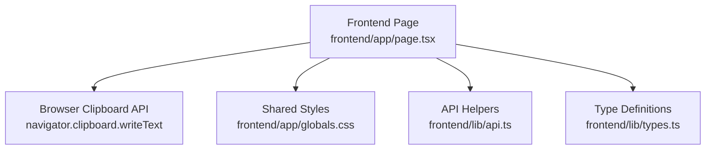
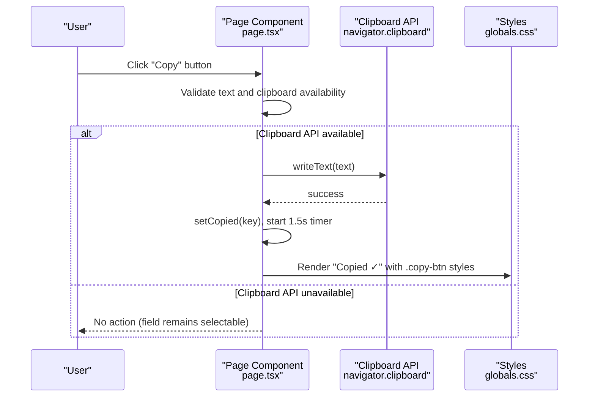
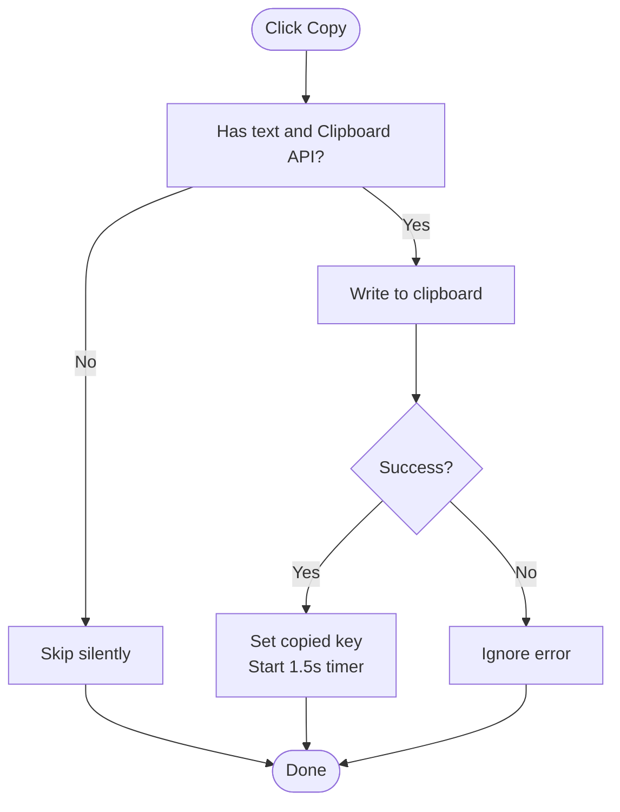
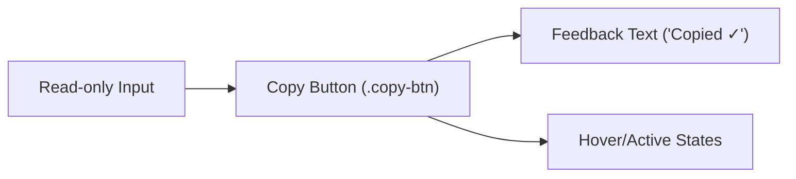
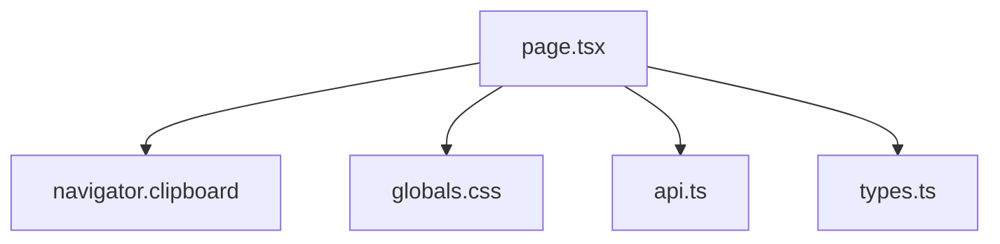

# Copy-to-Clipboard Functionality

<cite>
**Referenced Files in This Document**
- [page.tsx](file://frontend/app/page.tsx)
- [globals.css](file://frontend/app/globals.css)
- [api.ts](file://frontend/lib/api.ts)
- [types.ts](file://frontend/lib/types.ts)
</cite>

## Table of Contents
1. [Introduction](#introduction)
2. [Project Structure](#project-structure)
3. [Core Components](#core-components)
4. [Architecture Overview](#architecture-overview)
5. [Detailed Component Analysis](#detailed-component-analysis)
6. [Dependency Analysis](#dependency-analysis)
7. [Performance Considerations](#performance-considerations)
8. [Troubleshooting Guide](#troubleshooting-guide)
9. [Conclusion](#conclusion)

## Introduction
This document explains the copy-to-clipboard functionality implemented in the Waypoint frontend. It focuses on how shareable values (invite link and confirmation code) are copied to the system clipboard, how user feedback is provided, and how the feature gracefully degrades when the Clipboard API is unavailable. The implementation lives in the main landing page component and is styled via shared CSS classes.

## Project Structure
The copy-to-clipboard feature is primarily implemented in the client-side React component for the landing page. It uses the browser’s Clipboard API to write text and provides a short-lived visual confirmation. Styling for the copy button and input row is defined in the global stylesheet.

**Diagram sources**
- [page.tsx:56-75](file://frontend/app/page.tsx#L56-L75)
- [globals.css:337-348](file://frontend/app/globals.css#L337-L348)
- [api.ts:113-128](file://frontend/lib/api.ts#L113-L128)
- [types.ts:54-61](file://frontend/lib/types.ts#L54-L61)

**Section sources**
- [page.tsx:56-75](file://frontend/app/page.tsx#L56-L75)
- [globals.css:337-348](file://frontend/app/globals.css#L337-L348)
- [api.ts:113-128](file://frontend/lib/api.ts#L113-L128)
- [types.ts:54-61](file://frontend/lib/types.ts#L54-L61)

## Core Components
- Copy logic and state management:
  - A local state tracks which field was last copied to provide immediate feedback.
  - A timer clears the feedback after a fixed duration.
  - The function checks for available clipboard support before attempting to write.
- UI integration:
  - Share fields include an input and a copy button.
  - The button toggles between “Copy” and “Copied ✓” based on the active key.
- Data flow:
  - Invite link is constructed using the bot username and invite token from the seed result.
  - Confirmation code is taken directly from the seed result.

**Section sources**
- [page.tsx:56-75](file://frontend/app/page.tsx#L56-L75)
- [page.tsx:232-281](file://frontend/app/page.tsx#L232-L281)
- [api.ts:113-128](file://frontend/lib/api.ts#L113-L128)
- [types.ts:54-61](file://frontend/lib/types.ts#L54-L61)

## Architecture Overview
The copy-to-clipboard feature follows a simple, robust pattern:
- User clicks the copy button next to a read-only field.
- The handler validates inputs and environment support.
- If supported, it writes the text to the clipboard and shows temporary feedback.
- If not supported, the operation is silently skipped; the field remains selectable/read-only.

**Diagram sources**
- [page.tsx:56-75](file://frontend/app/page.tsx#L56-L75)
- [globals.css:337-348](file://frontend/app/globals.css#L337-L348)

## Detailed Component Analysis

### Copy Logic and State Management
- State:
  - Tracks the key of the last-copied field to switch button text.
  - Timer reference ensures cleanup on unmount and prevents overlapping timers.
- Behavior:
  - Guarded by presence of text and navigator.clipboard.
  - On success, sets the copied key and schedules a reset after 1.5 seconds.
  - On failure, silently ignores errors to avoid disrupting UX.

**Diagram sources**
- [page.tsx:56-75](file://frontend/app/page.tsx#L56-L75)

**Section sources**
- [page.tsx:56-75](file://frontend/app/page.tsx#L56-L75)

### UI Integration and Styling
- Layout:
  - Each share field is a flex row containing a read-only input and a copy button.
  - Inputs auto-select on focus for easy manual copying if needed.
- Styling:
  - The copy button uses a coral accent color with hover/active states.
  - The row layout aligns the input and button consistently across screens.

**Diagram sources**
- [page.tsx:232-281](file://frontend/app/page.tsx#L232-L281)
- [globals.css:337-348](file://frontend/app/globals.css#L337-L348)

**Section sources**
- [page.tsx:232-281](file://frontend/app/page.tsx#L232-L281)
- [globals.css:337-348](file://frontend/app/globals.css#L337-L348)

### Data Sources and Types
- Invite link:
  - Built from the Waybot username (fetched once at mount) and the invite token returned by seeding a desk.
- Confirmation code:
  - Taken directly from the seed result.
- Types:
  - SeedResult defines the shape of the response that includes desk_id, optional invite_token, and optional confirmation_code.

**Section sources**
- [api.ts:113-128](file://frontend/lib/api.ts#L113-L128)
- [types.ts:54-61](file://frontend/lib/types.ts#L54-L61)
- [page.tsx:232-281](file://frontend/app/page.tsx#L232-L281)

## Dependency Analysis
- The copy functionality depends on:
  - Browser Clipboard API for writing text.
  - Local React state and refs for feedback and lifecycle management.
  - Shared CSS classes for consistent styling.
  - API helpers and types for constructing and validating share data.

**Diagram sources**
- [page.tsx:56-75](file://frontend/app/page.tsx#L56-L75)
- [globals.css:337-348](file://frontend/app/globals.css#L337-L348)
- [api.ts:113-128](file://frontend/lib/api.ts#L113-L128)
- [types.ts:54-61](file://frontend/lib/types.ts#L54-L61)

**Section sources**
- [page.tsx:56-75](file://frontend/app/page.tsx#L56-L75)
- [globals.css:337-348](file://frontend/app/globals.css#L337-L348)
- [api.ts:113-128](file://frontend/lib/api.ts#L113-L128)
- [types.ts:54-61](file://frontend/lib/types.ts#L54-L61)

## Performance Considerations
- Minimal overhead:
  - Clipboard write is asynchronous and non-blocking.
  - Feedback resets automatically after a short timeout.
- Memory safety:
  - Timer references are cleared on component unmount to prevent leaks.
- Graceful degradation:
  - When the Clipboard API is unavailable, no errors are thrown; users can still select and copy manually.

[No sources needed since this section provides general guidance]

## Troubleshooting Guide
- Clipboard not working:
  - Ensure the page is served over HTTPS or localhost, as some browsers restrict clipboard access otherwise.
  - Verify that navigator.clipboard is available in the runtime environment.
- No visual feedback:
  - Confirm that the copied key matches the button’s expected identifier.
  - Check that the 1.5-second timer is not being interrupted by rapid re-renders.
- Manual fallback:
  - Users can still click into the read-only input and use keyboard shortcuts to copy.

**Section sources**
- [page.tsx:56-75](file://frontend/app/page.tsx#L56-L75)
- [page.tsx:232-281](file://frontend/app/page.tsx#L232-L281)

## Conclusion
The copy-to-clipboard feature provides a seamless way to share invite links and confirmation codes with minimal friction. It leverages the modern Clipboard API when available, offers clear but transient feedback, and falls back gracefully in unsupported environments. The implementation is compact, well-scoped, and styled consistently with the application’s design system.