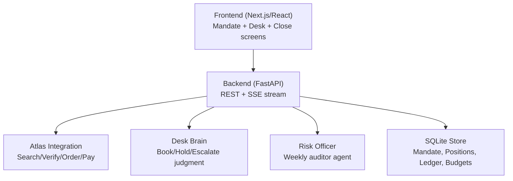
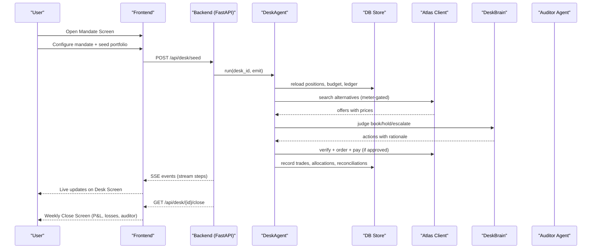
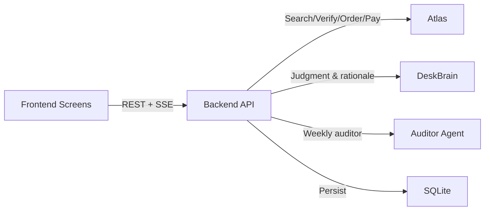

# Product Design

<cite>
**Referenced Files in This Document**
- [01-product.md](file://docs/plans/waypoint/01-product.md)
- [02-architecture.md](file://docs/plans/waypoint/02-architecture.md)
- [03-program-design.md](file://docs/plans/waypoint/03-program-design.md)
- [04-slices.md](file://docs/plans/waypoint/04-slices.md)
- [00-status.md](file://docs/plans/waypoint/00-status.md)
- [page.tsx](file://frontend/app/page.tsx)
- [recovering page.tsx](file://frontend/app/recovering/[tripId]/page.tsx)
- [recovered page.tsx](file://frontend/app/recovered/[tripId]/page.tsx)
- [routes.py](file://backend/app/api/routes.py)
- [loop.py](file://backend/app/agent/loop.py)
- [main.py](file://backend/app/main.py)
</cite>

## Update Summary
**Changes Made**
- Updated product positioning from trip disruption recovery to corporate travel treasury
- Revised three-screen UX to reflect mandate → desk → close workflow
- Updated architecture to show desk-based operations with portfolio management
- Modified component descriptions to focus on financial trading desk metaphor
- Updated API endpoints and data models for treasury operations
- Enhanced real-time streaming interface description for desk cycle events
- Added risk-officer auditor agent and P&L tracking components

## Table of Contents
1. [Introduction](#introduction)
2. [Project Structure](#project-structure)
3. [Core Components](#core-components)
4. [Architecture Overview](#architecture-overview)
5. [Detailed Component Analysis](#detailed-component-analysis)
6. [Dependency Analysis](#dependency-analysis)
7. [Performance Considerations](#performance-considerations)
8. [Troubleshooting Guide](#troubleshooting-guide)
9. [Conclusion](#conclusion)
10. [Appendices](#appendices)

## Introduction
Waypoint is **the corporate travel treasury**: a company's travel budget run like a trading desk. One desk agent holds a **mandate** (a budget plus a per-decision authority cap, set by a CFO-style user) and makes **discretionary book-now-vs-hold timing calls** across a portfolio of **5–6 upcoming trips**. It owns a **visible P&L that includes admitted losses** ("held too long, −$62, threshold adjusted"), **auto-reconciles sandbox payments against the budget ledger**, and **autonomously allocates realized savings** (e.g. auto-funding a seat upgrade via the real Atlas `booking seat select` command). A **risk-officer auditor agent** reads the blotter and challenges one trade at the weekly close (light multi-agent flavor).

The user experience centers on three screens that map 1:1 to **mandate → desk → close**:
- **Mandate Screen**: Sets up the travel budget, authority caps, and contingency parameters for the desk agent.
- **Desk Screen**: Live streaming of the desk agent's reasoning process with real-time portfolio updates, search meter, and trading decisions.
- **Weekly Close Screen**: P&L summary, admitted losses, risk-officer challenge, and portfolio performance metrics.

The design emphasizes transparency, trust, and accountability: every decision is evaluated against the mandate constraints, and only fully authorized actions are executed. The interface communicates progress via Server-Sent Events (SSE) so users can watch trading decisions unfold in real time.

**Section sources**
- [01-product.md:8-27](file://docs/plans/waypoint/01-product.md#L8-L27)
- [02-architecture.md:3-11](file://docs/plans/waypoint/02-architecture.md#L3-L11)

## Project Structure
The repository organizes product planning, architecture, and mockups under docs/plans/waypoint, with additional skill documentation for Atlas integration. The three-screen UX is defined by HTML mockups and supported by architectural and program design documents that specify endpoints, data models, and the desk agent loop.

**Diagram sources**
- [02-architecture.md:6-11](file://docs/plans/waypoint/02-architecture.md#L6-L11)
- [03-program-design.md:11-21](file://docs/plans/waypoint/03-program-design.md#L11-L21)

**Section sources**
- [02-architecture.md:6-11](file://docs/plans/waypoint/02-architecture.md#L6-L11)
- [03-program-design.md:11-21](file://docs/plans/waypoint/03-program-design.md#L11-L21)

## Core Components
- **Mandate Screen**: Displays budget configuration, authority caps, and contingency settings; serves as the entry point for desk operations.
- **Desk Screen**: Streams step-by-step desk actions (search, reprice, judge, execute, allocate) via SSE; highlights trading decisions, search meter usage, and portfolio status.
- **Weekly Close Screen**: Shows P&L summary, admitted losses, risk-officer challenge, and portfolio performance metrics.

Key interaction patterns:
- Set up mandate with budget, authority cap, and contingency parameters.
- Observe live desk operations on the Desk Screen until cycle completion or escalation.
- Review weekly close results with P&L, losses, and auditor feedback.

Visual design principles:
- Clear status indicators (booked/held, search meter, P&L counters).
- High contrast for critical states (good/bad/accent colors).
- Monospace terminal-style stream for transparency.
- Card-based layout for readability on mobile.

Responsive behavior:
- Single-column layouts with max-width containers.
- Touch-friendly buttons and readable typography across devices.

**Section sources**
- [02-architecture.md:18-23](file://docs/plans/waypoint/02-architecture.md#L18-L23)
- [03-program-design.md:133-137](file://docs/plans/waypoint/03-program-design.md#L133-L137)

## Architecture Overview
The system comprises a Next.js/React frontend and a Python FastAPI backend. The backend orchestrates the desk agent loop, runs judgment logic, integrates with Atlas for search/verify/order/pay, and streams progress via SSE to drive the Desk Screen.

**Diagram sources**
- [02-architecture.md:33-41](file://docs/plans/waypoint/02-architecture.md#L33-L41)
- [03-program-design.md:82-111](file://docs/plans/waypoint/03-program-design.md#L82-L111)

## Detailed Component Analysis

### Mandate Screen
Purpose:
- Configure the travel treasury mandate: budget total, authority cap, contingency percentage.
- Seed the portfolio with 5-6 upcoming trips with cost bases.
- Establish the framework for autonomous trading within constraints.

Interaction pattern:
- User sets mandate parameters once (budget, authority cap, contingency).
- Portfolio is seeded with realistic trip scenarios.
- Desk operations begin automatically after mandate setup.

Accessibility considerations:
- Use semantic HTML elements (headings, forms, labels).
- Ensure color is not the sole indicator of status; pair with text labels and icons.
- Provide sufficient contrast for monetary values and status badges.

Responsive behavior:
- Form layout adapts to mobile widths with stacked fields.
- Buttons are full-width for easy tapping.

**Section sources**
- [01-product.md:11-14](file://docs/plans/waypoint/01-product.md#L11-L14)
- [02-architecture.md:18-23](file://docs/plans/waypoint/02-architecture.md#L18-L23)

### Desk Screen
Purpose:
- Stream the desk agent's reasoning process in real time using SSE.
- Show portfolio positions, search meter, trading decisions, and execution status.
- Communicate guardrails like step budget, search limits, and authority caps.

Real-time streaming interface (SSE):
- Backend emits structured events per step (e.g., meta, mark, trade, loss, alloc, reconcile, escalate, result).
- Frontend listens to the SSE stream and renders live updates to the blotter view.
- Visual cues highlight rejected options, approved trades, and portfolio changes.

Error handling and feedback:
- If no viable option exists, surface appropriate state with reasons.
- If step budget or search meter is exceeded, stop and inform the user.
- Staleness guards: re-verify prices and availability before booking; show old/new values.

Accessibility considerations:
- Live region updates for screen readers when new stream lines appear.
- Avoid relying solely on color; include textual indicators (✅/⛔/⚠️).
- Provide keyboard focus management for the stream container.

Responsive behavior:
- Scrollable stream area with fixed header showing mandate and meter.
- Blotter table adapts to narrow screens with horizontal scrolling if needed.

**Section sources**
- [02-architecture.md:43-55](file://docs/plans/waypoint/02-architecture.md#L43-L55)
- [03-program-design.md:133-137](file://docs/plans/waypoint/03-program-design.md#L133-L137)

### Weekly Close Screen
Purpose:
- Display comprehensive P&L summary including admitted losses.
- Show risk-officer auditor challenge and verdict.
- Reinforce trust by explaining trading decisions and outcomes.

Interaction pattern:
- User reviews weekly performance, losses, and auditor feedback.
- Optional: drill down into specific trades for detailed audit trail.

Accessibility considerations:
- Use headings to separate sections (P&L, Losses, Auditor Verdict).
- Ensure all status indicators have accompanying text.
- Maintain high contrast for monetary values and tags.

Responsive behavior:
- Multi-column layout collapses to single column on small screens.
- Cards stack vertically with clear spacing.

**Section sources**
- [02-architecture.md:22-23](file://docs/plans/waypoint/02-architecture.md#L22-L23)
- [03-program-design.md:133-137](file://docs/plans/waypoint/03-program-design.md#L133-L137)

### Two-Gate System and Execute Wall
Design:
- **Advise gate — open**: The desk brain sees every position: marks, priors, meter state, remaining budget, contingency. Qwen reasons over all of it and narrates each book/hold call — including the ones it lost ("held too long, −$62").
- **Execute gate — walled, fail-closed**: Code executes only picks that pass: amount ≤ authority_cap, within remaining budget, offer freshly verified. Over cap → escalate with two priced options + recommendation; nothing settles until the one human click.

Data and freshness:
- Curated volatility priors per route type with disclosed approximation.
- Freshness windows enforced through search meter (20 searches/cycle).
- Real-time market microstructure via bounded fan-out queries.

Integration points:
- Desk brain consumes portfolio state and generates trading actions.
- All decisions persisted for auditability and compliance.

**Section sources**
- [03-program-design.md:3-6](file://docs/plans/waypoint/03-program-design.md#L3-L6)
- [03-program-design.md:31-35](file://docs/plans/waypoint/03-program-design.md#L31-L35)

### Atlas Integration and Write Path
Scope:
- Search alternatives for portfolio positions with bounded fan-out.
- Verify current price and availability before any write operation.
- Create order, pay (sandbox auto-approve), and assert ticket issuance.
- Allocate realized savings to pre-order seat selections.

Safety and checkpoints:
- Follow mandatory checkpoints (authorization, price increase, seat fallback, payment).
- Treat reference-only offers appropriately; do not claim real-time capabilities beyond scope.
- Never retry write operations; handle failures gracefully with query-only follow-ups.

**Section sources**
- [02-architecture.md:57-68](file://docs/plans/waypoint/02-architecture.md#L57-L68)
- [03-program-design.md:71-80](file://docs/plans/waypoint/03-program-design.md#L71-L80)

## Dependency Analysis
The UI depends on backend REST endpoints and an SSE stream. The backend depends on Atlas, desk brain, auditor agent, and SQLite store.

**Diagram sources**
- [02-architecture.md:6-11](file://docs/plans/waypoint/02-architecture.md#L6-L11)
- [03-program-design.md:11-21](file://docs/plans/waypoint/03-program-design.md#L11-L21)

**Section sources**
- [02-architecture.md:6-11](file://docs/plans/waypoint/02-architecture.md#L6-L11)
- [03-program-design.md:11-21](file://docs/plans/waypoint/03-program-design.md#L11-L21)

## Performance Considerations
- SSE streaming should be lightweight; batch or throttle events if necessary to avoid UI jank.
- Minimize reflows in the stream panel by appending nodes efficiently.
- Debounce user interactions during active streaming to prevent redundant requests.
- Cache static assets and use efficient CSS variables for theming to reduce repaint costs.
- On mobile, ensure scroll performance remains smooth with long streams.
- Search meter enforcement prevents excessive API calls and maintains responsiveness.

## Troubleshooting Guide
Common issues and resolutions:
- No viable option: Surface appropriate state with reasons; guide user to manual review or override path.
- Step budget exceeded: Stop processing and explain limits; offer next steps.
- Stale offers: Re-verify before booking; show old/new prices and allow user confirmation if increased.
- Ticket assertion failure: Do not mark success until TICKETED status confirmed; provide error messaging and retry strategy.
- Authorization required: Present clear instructions and links; pause flow until resolved.

Accessibility and cross-browser notes:
- Test SSE support across browsers; provide fallback polling if needed.
- Ensure live regions announce updates to assistive technologies.
- Validate color contrast and keyboard navigation across devices.

**Section sources**
- [02-architecture.md:70-78](file://docs/plans/waypoint/02-architecture.md#L70-L78)
- [03-program-design.md:145-155](file://docs/plans/waypoint/03-program-design.md#L145-L155)

## Conclusion
The three-screen Waypoint interface delivers a transparent, trustworthy corporate travel treasury experience. By combining live streaming of desk agent reasoning, strict mandate enforcement, and clear P&L reporting, it builds confidence and reduces the risk of unauthorized or impractical bookings. Adhering to accessibility guidelines, responsive design principles, and robust error handling ensures a reliable experience across devices and browsers. Future extensions can add more rules and integrations while preserving the advise/execute split and fail-closed execution model.

## Appendices

### API Endpoints and SSE
- POST /api/desk/seed — create mandate + seeded portfolio of 5–6 positions.
- GET /api/desk/{desk_id} — desk state: positions, ledger, search meter.
- GET /api/desk/{desk_id}/stream — SSE stream of desk cycle events.
- GET /api/desk/{desk_id}/close — weekly close: P&L, admitted losses, risk-officer line.
- POST /api/desk/{desk_id}/escalations/{esc_id}/decision — human approval for mandate edge cases.

**Section sources**
- [02-architecture.md:18-23](file://docs/plans/waypoint/02-architecture.md#L18-L23)

### Data Models and Persistence
- Mandate, positions, ledger, budgets stored in SQLite for audit trail and compliance.
- Positions track held/booked status, cost basis, mark prices, and ticket assertion.
- Ledger records trades, allocations, reconciliations, and losses for full transparency.

**Section sources**
- [02-architecture.md:25-31](file://docs/plans/waypoint/02-architecture.md#L25-L31)

### Build Slices and Milestones
- Slice 1: Data foundation with mandate, positions, ledger tables + desk SSE route.
- Slice 2: Critical path - Atlas write-path proof with real sandbox booking.
- Slice 3: Desk brain with judgment layer, volatility priors, and admitted-loss logging.
- Slice 4: Reconciliation + allocation + escalation handling.
- Slice 5: Frontend refit with mandate → desk → close screens.
- Slice 6: Hardening with error-code routing and give-up paths.
- Slice 7: Risk officer + demo choreography.
- Slice 8: Demo rehearsal + video production.

**Section sources**
- [04-slices.md:24-80](file://docs/plans/waypoint/04-slices.md#L24-L80)