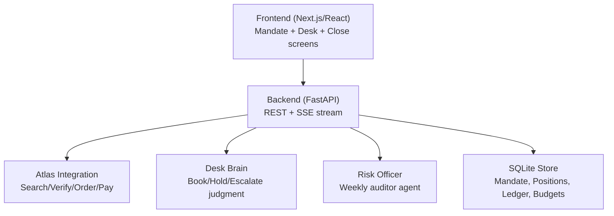
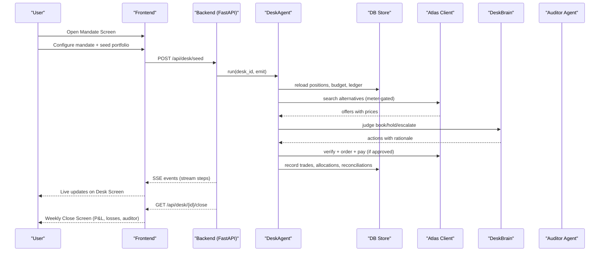
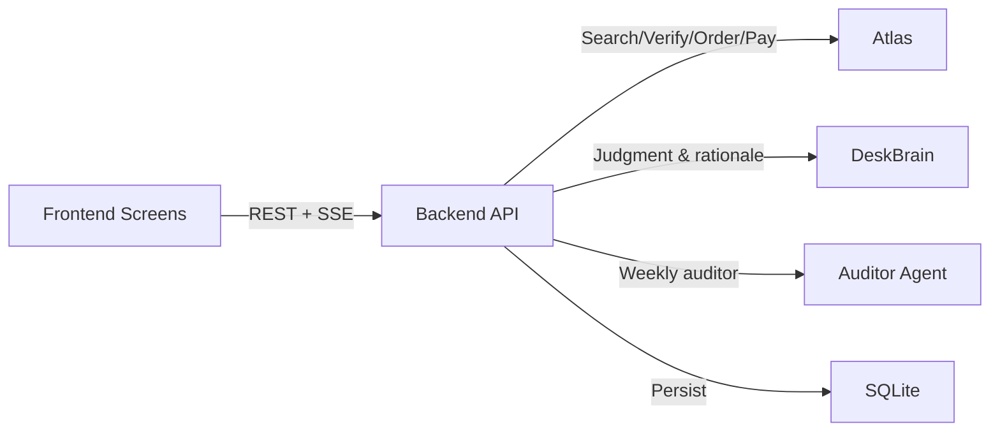

# Product Design

<cite>
**Referenced Files in This Document**
- [page.tsx](file://frontend/app/page.tsx)
- [desk page.tsx](file://frontend/app/desk/[deskId]/page.tsx)
- [close page.tsx](file://frontend/app/close/[deskId]/page.tsx)
- [api.ts](file://frontend/lib/api.ts)
- [types.ts](file://frontend/lib/types.ts)
- [format.ts](file://frontend/lib/format.ts)
- [WaypointField.tsx](file://frontend/app/WaypointField.tsx)
- [routes.py](file://backend/app/api/routes.py)
- [loop.py](file://backend/app/agent/loop.py)
- [models.py](file://backend/app/models.py)
- [main.py](file://backend/app/main.py)
- [globals.css](file://frontend/app/globals.css)
- [presentation.css](file://frontend/app/presentation.css)
</cite>

## Update Summary
**Changes Made**
- Complete treasury desk frontend overhaul replacing visa-recovery interfaces with mandate management, live SSE-driven screens, and weekly close workflows
- Implemented three-screen UX: Mandate Screen → Desk Screen → Weekly Close Screen
- Added real-time streaming interface using Server-Sent Events (SSE) for live agent reasoning process
- Integrated risk-officer auditor agent with P&L tracking components
- Enhanced responsive design with immersive teal background and animated waypoint field
- Updated API endpoints for treasury operations including seed, stream, snapshot, and close endpoints
- Added comprehensive error handling and accessibility compliance throughout all screens
- **Enhanced mandate page form validation with per-field validity checking, inline hints showing minimum values and acceptable ranges, improved error states with visual pip indicators, and numeric fields now display constraints as hints while preventing premature error states during user input**

## Table of Contents
1. [Introduction](#introduction)
2. [Project Structure](#project-structure)
3. [Core Components](#core-components)
4. [Architecture Overview](#architecture-overview)
5. [Detailed Component Analysis](#detailed-component-analysis)
6. [Dependency Analysis](#dependency-analysis)
7. [Performance Considerations](#performance-considerations)
8. [Troubleshooting Guide](#troubleshooting-guide)
9. [Conclusion](#conclusion)
10. [Appendices](#appendices)

## Introduction
Waypoint is **the corporate travel treasury**: a company's travel budget run like a trading desk. One desk agent holds a **mandate** (a budget plus a per-decision authority cap, set by a CFO-style user) and makes **discretionary book-now-vs-hold timing calls** across a portfolio of **5–6 upcoming trips**. It owns a **visible P&L that includes admitted losses** ("held too long, −$62, threshold adjusted"), **auto-reconciles sandbox payments against the budget ledger**, and **autonomously allocates realized savings** (e.g. auto-funding a seat upgrade via the real Atlas `booking seat select` command). A **risk-officer auditor agent** reads the blotter and challenges one trade at the weekly close (light multi-agent flavor).

The user experience centers on three screens that map 1:1 to **mandate → desk → close**:
- **Mandate Screen**: Sets up the travel budget, authority caps, and contingency parameters for the desk agent.
- **Desk Screen**: Live streaming of the desk agent's reasoning process with real-time portfolio updates, search meter, and trading decisions.
- **Weekly Close Screen**: P&L summary, admitted losses, risk-officer challenge, and portfolio performance metrics.

The design emphasizes transparency, trust, and accountability: every decision is evaluated against the mandate constraints, and only fully authorized actions are executed. The interface communicates progress via Server-Sent Events (SSE) so users can watch trading decisions unfold in real time.

**Section sources**
- [page.tsx:23-113](file://frontend/app/page.tsx#L23-L113)
- [routes.py:285-314](file://backend/app/api/routes.py#L285-L314)

## Project Structure
The repository organizes product planning, architecture, and mockups under docs/plans/waypoint, with additional skill documentation for Atlas integration. The three-screen UX is defined by HTML mockups and supported by architectural and program design documents that specify endpoints, data models, and the desk agent loop.

**Diagram sources**
- [routes.py:173-187](file://backend/app/api/routes.py#L173-L187)
- [loop.py:118-146](file://backend/app/agent/loop.py#L118-L146)

**Section sources**
- [routes.py:1-13](file://backend/app/api/routes.py#L1-L13)
- [main.py:36-55](file://backend/app/main.py#L36-L55)

## Core Components
- **Mandate Screen**: Displays budget configuration, authority caps, and contingency settings; serves as the entry point for desk operations.
- **Desk Screen**: Streams step-by-step desk actions (search, reprice, judge, execute, allocate) via SSE; highlights trading decisions, search meter usage, and portfolio status.
- **Weekly Close Screen**: Shows P&L summary, admitted losses, risk-officer challenge, and portfolio performance metrics.

Key interaction patterns:
- Set up mandate with budget, authority cap, and contingency parameters.
- Observe live desk operations on the Desk Screen until cycle completion or escalation.
- Review weekly close results with P&L, losses, and auditor feedback.

Visual design principles:
- Clear status indicators (booked/held, search meter, P&L counters).
- High contrast for critical states (good/bad/accent colors).
- Monospace terminal-style stream for transparency.
- Card-based layout for readability on mobile.

Responsive behavior:
- Single-column layouts with max-width containers.
- Touch-friendly buttons and readable typography across devices.

**Section sources**
- [page.tsx:115-251](file://frontend/app/page.tsx#L115-L251)
- [desk page.tsx:330-677](file://frontend/app/desk/[deskId]/page.tsx#L330-L677)
- [close page.tsx:57-547](file://frontend/app/close/[deskId]/page.tsx#L57-L547)

## Architecture Overview
The system comprises a Next.js/React frontend and a Python FastAPI backend. The backend orchestrates the desk agent loop, runs judgment logic, integrates with Atlas for search/verify/order/pay, and streams progress via SSE to drive the Desk Screen.

**Diagram sources**
- [routes.py:317-403](file://backend/app/api/routes.py#L317-L403)
- [loop.py:153-486](file://backend/app/agent/loop.py#L153-L486)

## Detailed Component Analysis

### Mandate Screen
Purpose:
- Configure the travel treasury mandate: budget total, authority cap, contingency percentage.
- Seed the portfolio with 5-6 upcoming trips with cost bases.
- Establish the framework for autonomous trading within constraints.

Interaction pattern:
- User sets mandate parameters once (budget, authority cap, contingency).
- Portfolio is seeded with realistic trip scenarios.
- Desk operations begin automatically after mandate setup.

Accessibility considerations:
- Use semantic HTML elements (headings, forms, labels).
- Ensure color is not the sole indicator of status; pair with text labels and icons.
- Provide sufficient contrast for monetary values and status badges.

Responsive behavior:
- Form layout adapts to mobile widths with stacked fields.
- Buttons are full-width for easy tapping.

**Updated** Enhanced with immersive teal background and animated waypoint field for visual appeal while maintaining accessibility standards.

**Enhanced Form Validation System:**
The mandate screen now features sophisticated per-field validation with intelligent error handling:
- **Inline Hints**: Each numeric field displays its constraints directly in the label (e.g., "min $1,000", "0–25%") to guide users before they encounter errors
- **Per-Field Validity Checking**: Individual fields are validated independently rather than waiting for form submission
- **Visual Pip Indicators**: Error states use standardized pip shapes (hollow, half, solid, cross) that maintain accessibility across different viewing conditions
- **Preventive Error States**: Fields are never marked as invalid while being actively typed - validation only triggers when a value is actually out of bounds
- **Smart State Management**: NaN values (cleared fields) are treated as "not yet filled in" rather than "wrong", preventing premature error messages

**Section sources**
- [page.tsx:23-113](file://frontend/app/page.tsx#L23-L113)
- [page.tsx:115-251](file://frontend/app/page.tsx#L115-L251)
- [page.tsx:122-141](file://frontend/app/page.tsx#L122-L141)
- [page.tsx:328-396](file://frontend/app/page.tsx#L328-L396)
- [routes.py:285-314](file://backend/app/api/routes.py#L285-L314)
- [presentation.css:1660-1706](file://frontend/app/presentation.css#L1660-L1706)

### Desk Screen
Purpose:
- Stream the desk agent's reasoning process in real time using SSE.
- Show portfolio positions, search meter, trading decisions, and execution status.
- Communicate guardrails like step budget, search limits, and authority caps.

Real-time streaming interface (SSE):
- Backend emits structured events per step (e.g., meta, mark, trade, loss, alloc, reconcile, escalate, result).
- Frontend listens to the SSE stream and renders live updates to the blotter view.
- Visual cues highlight rejected options, approved trades, and portfolio changes.

Error handling and feedback:
- If no viable option exists, surface appropriate state with reasons.
- If step budget or search meter is exceeded, stop and inform the user.
- Staleness guards: re-verify prices and availability before booking; show old/new values.

Accessibility considerations:
- Live region updates for screen readers when new stream lines appear.
- Avoid relying solely on color; include textual indicators (✅/⛔/⚠️).
- Provide keyboard focus management for the stream container.

Responsive behavior:
- Scrollable stream area with fixed header showing mandate and meter.
- Blotter table adapts to narrow screens with horizontal scrolling if needed.

**Updated** Enhanced with real-time position identity from snapshots, budget bar visualization, and improved toast notifications for better user feedback.

**Section sources**
- [desk page.tsx:330-677](file://frontend/app/desk/[deskId]/page.tsx#L330-L677)
- [desk page.tsx:680-800](file://frontend/app/desk/[deskId]/page.tsx#L680-L800)
- [routes.py:317-353](file://backend/app/api/routes.py#L317-L353)

### Weekly Close Screen
Purpose:
- Display comprehensive P&L summary including admitted losses.
- Show risk-officer auditor challenge and verdict.
- Reinforce trust by explaining trading decisions and outcomes.

Interaction pattern:
- User reviews weekly performance, losses, and auditor feedback.
- Optional: drill down into specific trades for detailed audit trail.

Accessibility considerations:
- Use headings to separate sections (P&L, Losses, Auditor Verdict).
- Ensure all status indicators have accompanying text.
- Maintain high contrast for monetary values and tags.

Responsive behavior:
- Multi-column layout collapses to single column on small screens.
- Cards stack vertically with clear spacing.

**Updated** Enhanced with dry-run distinction ("Would have saved" vs "Saved"), improved auditor line presentation, and better error handling for various close outcomes.

**Section sources**
- [close page.tsx:57-547](file://frontend/app/close/[deskId]/page.tsx#L57-L547)
- [routes.py:356-403](file://backend/app/api/routes.py#L356-L403)

### Two-Gate System and Execute Wall
Design:
- **Advise gate — open**: The desk brain sees every position: marks, priors, meter state, remaining budget, contingency. Qwen reasons over all of it and narrates each book/hold call — including the ones it lost ("held too long, −$62").
- **Execute gate — walled, fail-closed**: Code executes only picks that pass: amount ≤ authority_cap, within remaining budget, offer freshly verified. Over cap → escalate with two priced options + recommendation; nothing settles until the one human click.

Data and freshness:
- Curated volatility priors per route type with disclosed approximation.
- Freshness windows enforced through search meter (20 searches/cycle).
- Real-time market microstructure via bounded fan-out queries.

Integration points:
- Desk brain consumes portfolio state and generates trading actions.
- All decisions persisted for auditability and compliance.

**Section sources**
- [loop.py:153-486](file://backend/app/agent/loop.py#L153-L486)
- [loop.py:576-634](file://backend/app/agent/loop.py#L576-L634)

### Atlas Integration and Write Path
Scope:
- Search alternatives for portfolio positions with bounded fan-out.
- Verify current price and availability before any write operation.
- Create order, pay (sandbox auto-approve), and assert ticket issuance.
- Allocate realized savings to pre-order seat selections.

Safety and checkpoints:
- Follow mandatory checkpoints (authorization, price increase, seat fallback, payment).
- Treat reference-only offers appropriately; do not claim real-time capabilities beyond scope.
- Never retry write operations; handle failures gracefully with query-only follow-ups.

**Section sources**
- [loop.py:648-800](file://backend/app/agent/loop.py#L648-L800)
- [models.py:175-244](file://backend/app/models.py#L175-L244)

## Dependency Analysis
The UI depends on backend REST endpoints and an SSE stream. The backend depends on Atlas, desk brain, auditor agent, and SQLite store.

**Diagram sources**
- [routes.py:173-187](file://backend/app/api/routes.py#L173-L187)
- [loop.py:118-146](file://backend/app/agent/loop.py#L118-L146)

**Section sources**
- [api.ts:7-110](file://frontend/lib/api.ts#L7-L110)
- [routes.py:1-13](file://backend/app/api/routes.py#L1-L13)

## Performance Considerations
- SSE streaming should be lightweight; batch or throttle events if necessary to avoid UI jank.
- Minimize reflows in the stream panel by appending nodes efficiently.
- Debounce user interactions during active streaming to prevent redundant requests.
- Cache static assets and use efficient CSS variables for theming to reduce repaint costs.
- On mobile, ensure scroll performance remains smooth with long streams.
- Search meter enforcement prevents excessive API calls and maintains responsiveness.

**Updated** Enhanced with GSAP animations that respect reduced motion preferences, optimized event replay handling, and efficient state management to prevent unnecessary re-renders.

## Troubleshooting Guide
Common issues and resolutions:
- No viable option: Surface appropriate state with reasons; guide user to manual review or override path.
- Step budget exceeded: Stop processing and explain limits; offer next steps.
- Stale offers: Re-verify before booking; show old/new prices and allow user confirmation if increased.
- Ticket assertion failure: Do not mark success until TICKETED status confirmed; provide error messaging and retry strategy.
- Authorization required: Present clear instructions and links; pause flow until resolved.

Accessibility and cross-browser notes:
- Test SSE support across browsers; provide fallback polling if needed.
- Ensure live regions announce updates to assistive technologies.
- Validate color contrast and keyboard navigation across devices.

**Updated** Enhanced error handling with specific error codes, improved connection state management, and better fallback mechanisms for network issues.

**Section sources**
- [desk page.tsx:347-390](file://frontend/app/desk/[deskId]/page.tsx#L347-L390)
- [close page.tsx:302-381](file://frontend/app/close/[deskId]/page.tsx#L302-L381)
- [routes.py:231-249](file://backend/app/api/routes.py#L231-L249)

## Conclusion
The three-screen Waypoint interface delivers a transparent, trustworthy corporate travel treasury experience. By combining live streaming of desk agent reasoning, strict mandate enforcement, and clear P&L reporting, it builds confidence and reduces the risk of unauthorized or impractical bookings. Adhering to accessibility guidelines, responsive design principles, and robust error handling ensures a reliable experience across devices and browsers. Future extensions can add more rules and integrations while preserving the advise/execute split and fail-closed execution model.

**Updated** The complete frontend overhaul provides a professional, enterprise-grade interface with immersive visual design, real-time feedback, and comprehensive error handling that scales from individual users to large corporate deployments.

## Appendices

### API Endpoints and SSE
- POST /api/desk/seed — create mandate + seeded portfolio of 5–6 positions.
- GET /api/desk/{desk_id} — desk state: positions, ledger, search meter.
- GET /api/desk/{desk_id}/stream — SSE stream of desk cycle events.
- GET /api/desk/{desk_id}/close — weekly close: P&L, admitted losses, risk-officer line.
- POST /api/desk/{desk_id}/escalations/{esc_id}/decision — human approval for mandate edge cases.

**Section sources**
- [routes.py:285-425](file://backend/app/api/routes.py#L285-L425)
- [api.ts:7-110](file://frontend/lib/api.ts#L7-L110)

### Data Models and Persistence
- Mandate, positions, ledger, budgets stored in SQLite for audit trail and compliance.
- Positions track held/booked status, cost basis, mark prices, and ticket assertion.
- Ledger records trades, allocations, reconciliations, and losses for full transparency.

**Section sources**
- [models.py:83-173](file://backend/app/models.py#L83-L173)
- [types.ts:5-175](file://frontend/lib/types.ts#L5-L175)

### Build Slices and Milestones
- Slice 1: Data foundation with mandate, positions, ledger tables + desk SSE route.
- Slice 2: Critical path - Atlas write-path proof with real sandbox booking.
- Slice 3: Desk brain with judgment layer, volatility priors, and admitted-loss logging.
- Slice 4: Reconciliation + allocation + escalation handling.
- Slice 5: Frontend refit with mandate → desk → close screens.
- Slice 6: Hardening with error-code routing and give-up paths.
- Slice 7: Risk officer + demo choreography.
- Slice 8: Demo rehearsal + video production.

**Section sources**
- [loop.py:1-15](file://backend/app/agent/loop.py#L1-L15)
- [routes.py:1-13](file://backend/app/api/routes.py#L1-L13)

### Visual Design System
- Color palette: Deep teal brand (#0F766E), warm coral accent (#F2764B), semantic colors for status indicators.
- Typography: Figtree sans-serif for body text, IBM Plex Mono for numerical data and technical information.
- Spacing system: Consistent 8px grid with semantic spacing tokens for cards, buttons, and content areas.
- Animation system: GSAP-powered animations with reduced motion support for accessibility.

**Enhanced Form Validation Styling:**
The form validation system uses a comprehensive styling approach:
- **Constraint Hints**: Inline hints display minimum values and acceptable ranges directly in field labels
- **Invalid State Styling**: Fields turn amber with warning background when values are out of bounds
- **Error Messages**: Standardized error messages with pip indicators provide clear feedback
- **Focus States**: Proper focus rings ensure keyboard navigation accessibility
- **Responsive Design**: Form fields adapt to different screen sizes while maintaining usability

**Section sources**
- [globals.css:10-52](file://frontend/app/globals.css#L10-L52)
- [presentation.css:1-34](file://frontend/app/presentation.css#L1-L34)
- [presentation.css:43-88](file://frontend/app/presentation.css#L43-L88)
- [presentation.css:1660-1706](file://frontend/app/presentation.css#L1660-L1706)
- [WaypointField.tsx:18-106](file://frontend/app/WaypointField.tsx#L18-L106)