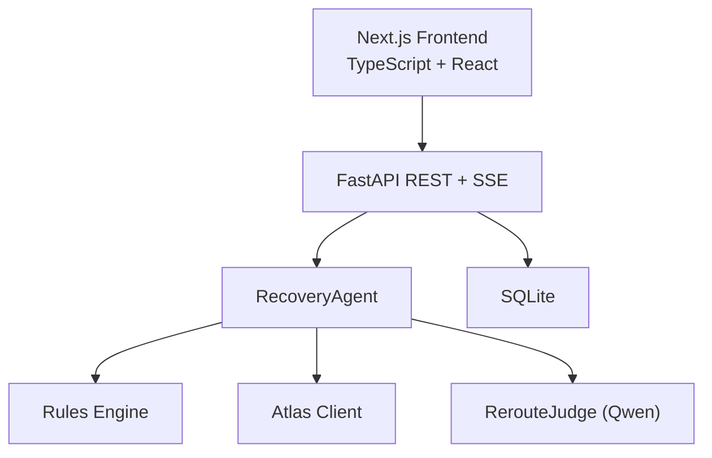
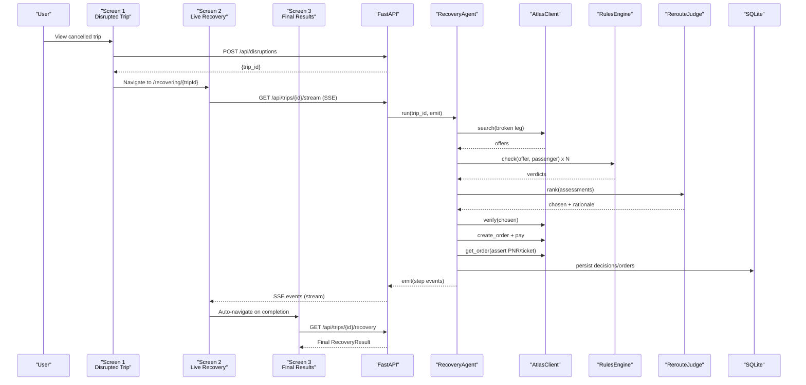
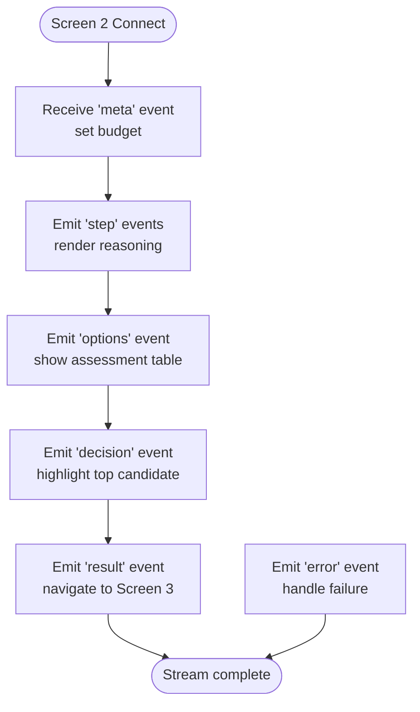
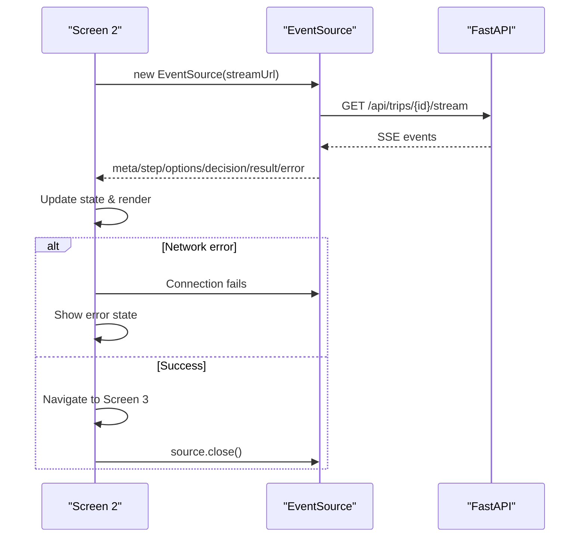
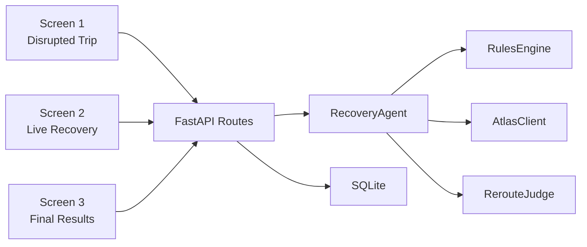
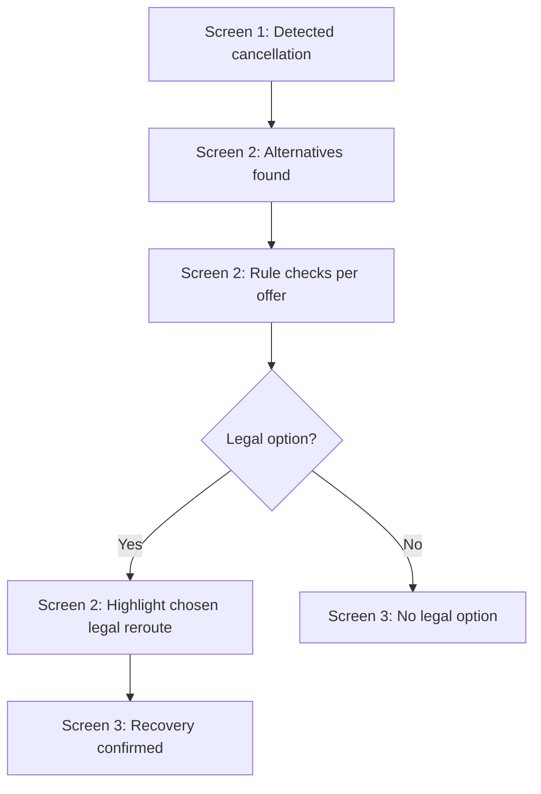

# Real-Time Streaming Interface

<cite>
**Referenced Files in This Document**
- [page.tsx](file://frontend/app/page.tsx)
- [page.tsx](file://frontend/app/recovering/[tripId]/page.tsx)
- [page.tsx](file://frontend/app/recovered/[tripId]/page.tsx)
- [types.ts](file://frontend/lib/types.ts)
- [api.ts](file://frontend/lib/api.ts)
- [format.ts](file://frontend/lib/format.ts)
- [globals.css](file://frontend/app/globals.css)
- [layout.tsx](file://frontend/app/layout.tsx)
- [routes.py](file://backend/app/api/routes.py)
- [loop.py](file://backend/app/agent/loop.py)
- [02-architecture.md](file://docs/plans/waypoint/02-architecture.md)
- [03-program-design.md](file://docs/plans/waypoint/03-program-design.md)
- [04-slices.md](file://docs/plans/waypoint/04-slices.md)
- [QODER-HANDOFF.md](file://docs/plans/waypoint/QODER-HANDOFF.md)
- [01-product.md](file://docs/plans/waypoint/01-product.md)
- [02-agent-recovering.html](file://docs/plans/waypoint/mockups/02-agent-recovering.html)
</cite>

## Update Summary
**Changes Made**
- Updated frontend architecture section to reflect complete Next.js implementation with TypeScript
- Added detailed documentation for three main screens: disrupted trip display, live recovery progress, and final results
- Enhanced SSE event handling documentation with actual TypeScript types and event flow
- Updated error handling strategies based on implemented error states and loading states
- Added responsive design considerations using CSS modules approach
- Documented proper cleanup and resource management patterns

## Table of Contents
1. Introduction
2. Project Structure
3. Core Components
4. Architecture Overview
5. Detailed Component Analysis
6. Dependency Analysis
7. Performance Considerations
8. Troubleshooting Guide
9. Conclusion
10. Appendices

## Introduction
This document specifies the real-time streaming interface that powers the live agent recovery experience using Server-Sent Events (SSE). The system features a complete Next.js frontend with TypeScript support, implementing three main screens: disrupted trip scenario display, live recovery progress via SSE connection, and final recovery results with layover details. The implementation includes proper error handling, loading states, and responsive design using CSS modules. It covers connection establishment, message formats, event types across agent phases (searching, validating, deciding, booking), frontend streaming handling and reconnection logic, performance optimizations for high-frequency updates, error handling strategies, security considerations, extension guidelines, and monitoring approaches.

## Project Structure
The system comprises:
- **Frontend**: Complete Next.js 15 application with TypeScript, featuring three main screens driving the demo surface with an SSE client to render live agent reasoning steps.
- **Backend**: Python FastAPI hosting the recovery agent loop, rules engine, Atlas integration, Qwen calls, and SQLite persistence.
- **Data**: SQLite tables for trips, segments, offers, rule verdicts, decisions, and orders.

Key endpoints include:
- POST /api/disruptions — inject a disruption to start recovery
- GET /api/trips/{id}/stream — SSE stream of agent's live reasoning steps
- GET /api/trips/{id}/recovery — final recovery result

**Diagram sources**
- [routes.py:1-10](file://backend/app/api/routes.py#L1-L10)
- [loop.py:1-9](file://backend/app/agent/loop.py#L1-L9)
- [page.tsx:1-10](file://frontend/app/recovering/[tripId]/page.tsx#L1-L10)

**Section sources**
- [routes.py:1-10](file://backend/app/api/routes.py#L1-L10)
- [loop.py:1-9](file://backend/app/agent/loop.py#L1-L9)
- [page.tsx:1-10](file://frontend/app/recovering/[tripId]/page.tsx#L1-L10)

## Core Components
- **RecoveryAgent**: Orchestrates the end-to-end recovery loop with guards (step budget, re-read/verify, assert outcome) and emits each step to the SSE stream.
- **Rules Engine**: Evaluates offers against rules (e.g., transit visa eligibility, passport validity) producing allowed/blocked/unknown verdicts.
- **RerouteJudge**: Ranks legal options and provides rationale.
- **Atlas Client**: Performs search, verify, order creation, payment, and ticket assertion.
- **Store**: Persists offers, verdicts, decisions, and orders for auditability.

**Three Main Screens Implementation:**
- **Screen 1 (Trip Disrupted)**: Static demo showing cancelled flight SIN → NRT with traveler information and recovery button
- **Screen 2 (Recovering)**: Live SSE stream showing agent reasoning steps, option assessment table, and real-time updates
- **Screen 3 (Recovered)**: Final recovery results with before/after comparison, fare settlement details, and ticket confirmation

Event phases mapped to agent steps:
- Searching: discovery of alternatives via Atlas
- Validating: running rules per offer and recording verdicts
- Deciding: judge ranking and selection rationale
- Booking: verification, order creation, payment, and ticket assertion

**Section sources**
- [loop.py:35-176](file://backend/app/agent/loop.py#L35-L176)
- [page.tsx:13-62](file://frontend/app/page.tsx#L13-L62)
- [page.tsx:17-172](file://frontend/app/recovering/[tripId]/page.tsx#L17-L172)
- [page.tsx:19-193](file://frontend/app/recovered/[tripId]/page.tsx#L19-L193)

## Architecture Overview
The SSE stream exposes the agent's live reasoning to the UI through a complete three-screen user journey. The flow begins when a disruption is injected or received via webhook, triggering the agent loop. Each step is emitted as an SSE event; the frontend consumes these events to update the UI incrementally across all three screens.

**Diagram sources**
- [page.tsx:18-30](file://frontend/app/page.tsx#L18-L30)
- [page.tsx:30-69](file://frontend/app/recovering/[tripId]/page.tsx#L30-L69)
- [page.tsx:26-38](file://frontend/app/recovered/[tripId]/page.tsx#L26-L38)
- [routes.py:80-138](file://backend/app/api/routes.py#L80-L138)
- [loop.py:42-167](file://backend/app/agent/loop.py#L42-L167)

## Detailed Component Analysis

### Three-Screen User Flow
**Screen 1 - Trip Disrupted Display:**
- Shows cancelled flight SIN → NRT with traveler information
- Displays risk status for downstream plans
- Provides recovery button with loading state management
- Handles error states and navigation to recovery screen

**Screen 2 - Live Recovery Progress:**
- Establishes SSE connection to `/api/trips/{tripId}/stream`
- Renders real-time agent reasoning steps in monospace terminal style
- Displays option assessment table with pricing, routing, and visa verdicts
- Shows step budget usage and agent progress
- Auto-navigates to final results upon completion

**Screen 3 - Final Recovery Results:**
- Fetches final recovery result from `/api/trips/{tripId}/recovery`
- Shows before/after comparison between rejected cheapest and booked legal option
- Displays fare settlement details including original fare, new fare, and difference
- Confirms ticket issuance with PNR and payment status
- Provides contextual messaging about why the alternative was chosen

**Section sources**
- [page.tsx:13-62](file://frontend/app/page.tsx#L13-L62)
- [page.tsx:17-172](file://frontend/app/recovering/[tripId]/page.tsx#L17-L172)
- [page.tsx:19-193](file://frontend/app/recovered/[tripId]/page.tsx#L19-L193)

### SSE Stream Contract and Event Types
- **Connection**:
  - Establish SSE by opening a GET request to `/api/trips/{id}/stream` from Screen 2.
  - The server maintains a long-lived HTTP response carrying text/event-stream content.
- **Event lifecycle**:
  - On disruption trigger, the agent runs and emits discrete events for each phase.
  - Screen 2 subscribes to the stream and renders incremental updates until completion or failure.
  - Screen 3 fetches final state independently after stream completion.
- **Event types** (phases):
  - `meta`: Initial metadata including trip_id and step_budget
  - `step`: Individual reasoning steps with sequential numbering
  - `options`: Assessment results for discovered alternatives
  - `decision`: Selected offer with rationale
  - `result`: Final recovery result with complete state
  - `error`: Error messages for failures
- **Message shape guidance**:
  - Each event follows TypeScript interfaces defined in `types.ts`
  - Events carry type-specific payloads with proper validation
  - Step events are indexed for idempotent rendering and replay support

**Diagram sources**
- [page.tsx:30-69](file://frontend/app/recovering/[tripId]/page.tsx#L30-L69)
- [types.ts:92-100](file://frontend/lib/types.ts#L92-L100)
- [loop.py:42-176](file://backend/app/agent/loop.py#L42-L176)

**Section sources**
- [page.tsx:30-69](file://frontend/app/recovering/[tripId]/page.tsx#L30-L69)
- [types.ts:92-100](file://frontend/lib/types.ts#L92-L100)
- [routes.py:95-121](file://backend/app/api/routes.py#L95-L121)

### Frontend Streaming Handling and Reconnection Logic
- **Subscription Management**:
  - Screen 2 uses native `EventSource` API to connect to SSE endpoint
  - Proper cleanup with `source.close()` in useEffect cleanup function
  - Navigation guard prevents duplicate navigation to Screen 3
- **Rendering Strategy**:
  - Incremental updates using React state management
  - Terminal-style monospace display for agent reasoning steps
  - Real-time table updates for option assessments
  - Debounced transitions to prevent layout thrashing during rapid updates
- **Error Handling**:
  - Comprehensive error state management across all screens
  - Loading states for async operations
  - Graceful fallbacks for network failures
  - User-friendly error messages
- **Resource Management**:
  - Automatic cleanup of EventSource instances on component unmount
  - Memory leak prevention through proper state disposal
  - Abort controller pattern for pending requests

**Diagram sources**
- [page.tsx:30-69](file://frontend/app/recovering/[tripId]/page.tsx#L30-L69)
- [api.ts:17-20](file://frontend/lib/api.ts#L17-L20)

**Section sources**
- [page.tsx:30-69](file://frontend/app/recovering/[tripId]/page.tsx#L30-L69)
- [page.tsx:26-38](file://frontend/app/recovered/[tripId]/page.tsx#L26-L38)
- [api.ts:1-30](file://frontend/lib/api.ts#L1-L30)

### Message Schema for Agent Progress Updates
The TypeScript interface defines the complete event contract:

- **Common fields**:
  - `type`: one of meta, step, options, decision, result, error
  - `trip_id`: string identifier
  - `step_count`: integer for progress tracking
  - Payload varies by event type
- **Phase-specific payloads**:
  - `meta`: `{ trip_id, step_budget }`
  - `step`: `{ n: number, text: string }`
  - `options`: `{ assessments: Assessment[] }`
  - `decision`: `{ chosen_offer_id: string, rationale: string }`
  - `result`: `{ result: RecoveryResult }`
  - `error`: `{ message: string }`

These shapes align with the domain models and provide compile-time safety through TypeScript.

**Section sources**
- [types.ts:92-100](file://frontend/lib/types.ts#L92-L100)
- [types.ts:4-90](file://frontend/lib/types.ts#L4-L90)
- [loop.py:42-176](file://backend/app/agent/loop.py#L42-L176)

### Error Handling Strategies
- **Connection drops**:
  - EventSource automatically handles reconnection with exponential backoff
  - Screen 2 shows connecting state while establishing connection
  - Error messages displayed in user-friendly format
- **Server timeouts**:
  - Screen 3 implements timeout handling for recovery endpoint
  - Graceful degradation when backend is unavailable
  - Fallback states for loading and error conditions
- **Malformed messages**:
  - TypeScript compilation ensures type safety
  - Runtime validation through JSON parsing with error catching
  - Safe fallback UI states when data is incomplete
- **Agent-level failures**:
  - Explicit error events handled in Screen 2
  - Navigation prevented on errors to allow retry
  - Clear error messaging to users

**Section sources**
- [page.tsx:18-30](file://frontend/app/page.tsx#L18-L30)
- [page.tsx:30-69](file://frontend/app/recovering/[tripId]/page.tsx#L30-L69)
- [page.tsx:26-38](file://frontend/app/recovered/[tripId]/page.tsx#L26-L38)
- [routes.py:124-138](file://backend/app/api/routes.py#L124-L138)

### Performance Optimization Techniques
- **Debouncing**:
  - Controlled pacing of agent steps with 0.5s delay for readability
  - Batch processing of rapid updates during high-frequency phases
  - Efficient React state updates to minimize re-renders
- **Efficient DOM manipulation**:
  - Keyed lists for optimal React reconciliation
  - Minimal re-renders through selective state updates
  - Virtual scrolling considerations for large option sets
- **Memory cleanup**:
  - Proper EventSource cleanup in useEffect cleanup functions
  - State disposal on component unmount
  - Memory leak prevention through proper resource management
- **Network optimization**:
  - Single SSE connection per trip session
  - Independent polling for final results
  - Efficient data transfer with minimal payload sizes

[No sources needed since this section provides general guidance]

### Security Considerations
- **Authentication**:
  - Environment-based API configuration for secure backend connections
  - CORS considerations for development vs production
  - Input validation through TypeScript interfaces
- **Input validation**:
  - Compile-time type checking prevents invalid data structures
  - Runtime validation of incoming SSE events
  - Sanitization of user-provided strings in streamed content
- **Rate limiting**:
  - Backend step budget limits prevent infinite loops
  - Connection pooling considerations for production deployment
- **Auditability**:
  - Complete event logging through SSE stream
  - Recovery results persisted for compliance review
  - Step-by-step audit trail of agent decisions

**Section sources**
- [api.ts:3-5](file://frontend/lib/api.ts#L3-L5)
- [types.ts:1-100](file://frontend/lib/types.ts#L1-L100)
- [loop.py:35-40](file://backend/app/agent/loop.py#L35-L40)

### Extending the Event System
- **Adding new agent capabilities**:
  - Define new event types in TypeScript interfaces
  - Emit events at appropriate points in the agent loop
  - Update Screen 2 to handle new event types
  - Extend Screen 3 to display new result information
- **Backward compatibility**:
  - Version event schemas if necessary
  - Handle unknown types gracefully on the frontend
  - Progressive enhancement approach for new features
- **Testing**:
  - Unit tests for event emission paths
  - Integration tests for SSE stream handling
  - UI tests for screen transitions and state management

[No sources needed since this section provides general guidance]

### Monitoring Approaches for Stream Health and Performance
- **Metrics**:
  - Track stream duration and event rates across all screens
  - Monitor step_count progression to detect stalls
  - Measure time between screens for user experience metrics
- **Logging**:
  - Console logging for development debugging
  - Error boundary logging for production monitoring
  - Performance metrics collection for optimization
- **Alerts**:
  - Alert on prolonged stream downtime
  - Monitor error rates across all three screens
  - Track successful recovery completion rates

[No sources needed since this section provides general guidance]

## Dependency Analysis
The streaming pipeline depends on the following core relationships:
- **Screens**: Screen 1 triggers recovery, Screen 2 streams live progress, Screen 3 displays final results
- **API Layer**: Routes handle SSE streaming and recovery result retrieval
- **Agent Layer**: RecoveryAgent orchestrates the business logic and emits events
- **External Services**: Atlas for flight search, Rules Engine for compliance checks, Judge for decision making
- **Persistence**: SQLite stores final results for audit and post-stream queries

**Diagram sources**
- [page.tsx:13-62](file://frontend/app/page.tsx#L13-L62)
- [page.tsx:17-172](file://frontend/app/recovering/[tripId]/page.tsx#L17-L172)
- [page.tsx:19-193](file://frontend/app/recovered/[tripId]/page.tsx#L19-L193)
- [routes.py:80-138](file://backend/app/api/routes.py#L80-L138)
- [loop.py:35-176](file://backend/app/agent/loop.py#L35-L176)

**Section sources**
- [page.tsx:13-62](file://frontend/app/page.tsx#L13-L62)
- [page.tsx:17-172](file://frontend/app/recovering/[tripId]/page.tsx#L17-L172)
- [page.tsx:19-193](file://frontend/app/recovered/[tripId]/page.tsx#L19-L193)
- [routes.py:80-138](file://backend/app/api/routes.py#L80-L138)
- [loop.py:35-176](file://backend/app/agent/loop.py#L35-L176)

## Performance Considerations
- **Frontend Optimization**:
  - Use React.memo for expensive components in option assessment tables
  - Implement virtual scrolling for large option lists
  - Optimize SSE event processing with requestAnimationFrame
- **Network Efficiency**:
  - Keep SSE payloads lean with only necessary fields per event
  - Implement connection pooling for production deployments
  - Use compression for large payloads where applicable
- **Memory Management**:
  - Dispose of EventSource instances promptly on navigation
  - Clean up timers and intervals in component cleanup
  - Avoid retaining large payloads in memory after rendering
- **Server-Side Buffering**:
  - Implement bounded buffers to prevent memory growth
  - Set appropriate timeouts for long-running operations
  - Monitor memory usage and implement garbage collection strategies

[No sources needed since this section provides general guidance]

## Troubleshooting Guide
- **No events received**:
  - Verify SSE endpoint availability and authentication
  - Check browser console for EventSource connection errors
  - Validate trip_id parameter in URL
- **Frequent reconnects**:
  - Inspect server logs for timeouts or resource constraints
  - Review client-side retry policies and backoff settings
  - Check network connectivity and firewall rules
- **Stalled stream**:
  - Compare step_count increments to detect stalls
  - Poll `/api/trips/{id}/recovery` for final state if stream hangs
  - Monitor agent step budget consumption
- **Incorrect UI state**:
  - Validate event schema against TypeScript interfaces
  - Ensure malformed events are discarded safely
  - Confirm that final reconciliation uses the recovery endpoint
- **Navigation issues**:
  - Check for duplicate navigation guards
  - Verify cleanup of EventSource instances
  - Test navigation between all three screens

**Section sources**
- [page.tsx:30-69](file://frontend/app/recovering/[tripId]/page.tsx#L30-L69)
- [page.tsx:26-38](file://frontend/app/recovered/[tripId]/page.tsx#L26-L38)
- [routes.py:95-138](file://backend/app/api/routes.py#L95-L138)

## Conclusion
The SSE-based streaming interface provides transparent, real-time visibility into the agent's recovery process through a complete three-screen user journey. The Next.js frontend with TypeScript support delivers a robust, type-safe implementation with proper error handling, loading states, and responsive design. By defining clear event types, robust reconnection logic, and performance-oriented rendering, the system delivers a responsive user experience while maintaining correctness through server-side guards and auditability. The modular architecture supports easy extension and maintenance while ensuring reliability and trustworthiness at scale.

[No sources needed since this section summarizes without analyzing specific files]

## Appendices

### Visual Target for Live Reasoning Screen
The mockup illustrates how the streaming UI presents detected disruptions, search results, rule checks, and the chosen legal reroute across all three screens.

**Diagram sources**
- [page.tsx:13-62](file://frontend/app/page.tsx#L13-L62)
- [page.tsx:17-172](file://frontend/app/recovering/[tripId]/page.tsx#L17-L172)
- [page.tsx:19-193](file://frontend/app/recovered/[tripId]/page.tsx#L19-L193)

**Section sources**
- [page.tsx:13-62](file://frontend/app/page.tsx#L13-L62)
- [page.tsx:17-172](file://frontend/app/recovering/[tripId]/page.tsx#L17-L172)
- [page.tsx:19-193](file://frontend/app/recovered/[tripId]/page.tsx#L19-L193)

### Build Slices and SSE Scope
- **Slice 1**: Establishes the SSE pipe with canned steps to prove the front-to-back streaming path
- **Slice 2**: Implements real Atlas search with live options while keeping other components mocked
- **Slice 3**: Adds rules engine for visa and passport validation
- **Slice 4**: Integrates Qwen judge for decision ranking
- **Slice 5**: Implements sandbox booking with payment and ticket assertion
- **Slice 6**: Adds SQLite persistence for audit and recovery history

**Section sources**
- [04-slices.md:7-25](file://docs/plans/waypoint/04-slices.md#L7-L25)
- [QODER-HANDOFF.md:40-47](file://docs/plans/waypoint/QODER-HANDOFF.md#L40-L47)
- [loop.py:1-9](file://backend/app/agent/loop.py#L1-L9)

### TypeScript Type Safety
The frontend implements comprehensive TypeScript interfaces for all data structures:

- **Passenger**: Traveler information with passport details
- **Segment**: Flight segment with timing and status
- **Offer**: Flight option with pricing and bookability
- **Assessment**: Combined offer with verdicts and execution status
- **RecoveryResult**: Final state with chosen/rejected offers and order details
- **StreamEvent**: Union type for all possible SSE events

This type safety ensures compile-time validation and better developer experience while preventing runtime errors.

**Section sources**
- [types.ts:1-100](file://frontend/lib/types.ts#L1-L100)

### Responsive Design Implementation
The frontend uses CSS custom properties and modern CSS techniques for responsive design:

- **CSS Variables**: Consistent theming with custom properties for colors and spacing
- **Mobile-First**: Base styles designed for mobile with progressive enhancement
- **Flexbox Layout**: Flexible layouts that adapt to different screen sizes
- **Typography**: Scalable font sizes and line heights for readability
- **Touch Targets**: Appropriately sized interactive elements for mobile devices

**Section sources**
- [globals.css:1-114](file://frontend/app/globals.css#L1-L114)