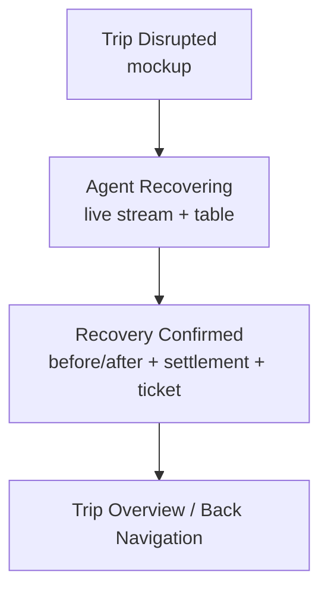
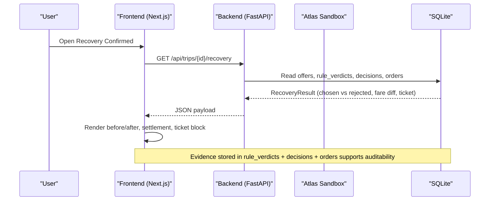
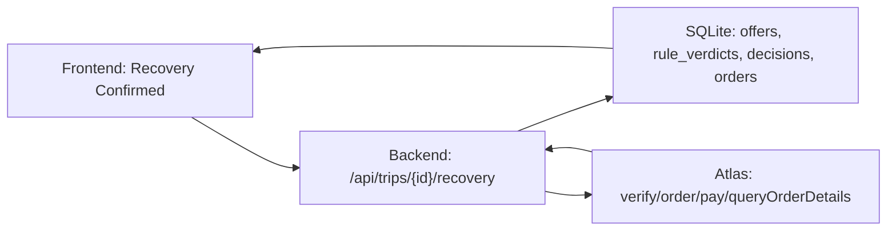
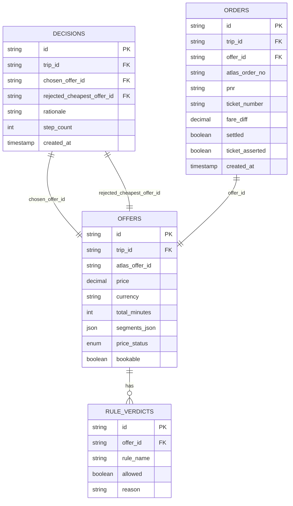

# Recovery Confirmation Screen

<cite>
**Referenced Files in This Document**
- [03-recovery-confirmed.html](file://docs/plans/waypoint/mockups/03-recovery-confirmed.html)
- [02-agent-recovering.html](file://docs/plans/waypoint/mockups/02-agent-recovering.html)
- [01-trip-disrupted.html](file://docs/plans/waypoint/mockups/01-trip-disrupted.html)
- [01-product.md](file://docs/plans/waypoint/01-product.md)
- [02-architecture.md](file://docs/plans/waypoint/02-architecture.md)
- [04-slices.md](file://docs/plans/waypoint/04-slices.md)
- [00-status.md](file://docs/plans/waypoint/00-status.md)
- [atlas-integration.md](file://docs/external/atlas-integration.md)
- [booking-workflow.md](file://.agents/skills/atlas-flight-booking/references/booking-workflow.md)
- [passenger-input.md](file://.agents/skills/atlas-flight-booking/references/passenger-input.md)
</cite>

## Table of Contents
1. [Introduction](#introduction)
2. [Project Structure](#project-structure)
3. [Core Components](#core-components)
4. [Architecture Overview](#architecture-overview)
5. [Detailed Component Analysis](#detailed-component-analysis)
6. [Dependency Analysis](#dependency-analysis)
7. [Performance Considerations](#performance-considerations)
8. [Troubleshooting Guide](#troubleshooting-guide)
9. [Conclusion](#conclusion)
10. [Appendices](#appendices)

## Introduction
This document explains the Recovery Confirmation Screen that presents a clear before/after comparison between the original disrupted itinerary and the confirmed legal reroute. It details how rejected cheap-but-illegal options are shown alongside the selected legal alternative, how fare difference settlement is displayed, and how new PNR/ticket information and confirmation status are presented. It also documents the “also caught” feature that demonstrates additional rule violations prevented (such as passport expiration issues), user interaction patterns for reviewing changes and navigating back to trip overview, responsive design considerations, accessibility compliance, and guidelines for extending the screen to future rule types and validation scenarios.

## Project Structure
The Recovery Confirmation Screen is part of a three-screen demo flow:
- Trip Disrupted: shows the cancelled leg and traveler context.
- Agent Recovering: live reasoning stream with alternatives and rule verdicts.
- Recovery Confirmed: final before/after comparison, fare settlement, and ticket confirmation.

**Section sources**
- [01-trip-disrupted.html:28-48](file://docs/plans/waypoint/mockups/01-trip-disrupted.html#L28-L48)
- [02-agent-recovering.html:30-61](file://docs/plans/waypoint/mockups/02-agent-recovering.html#L30-L61)
- [03-recovery-confirmed.html:31-60](file://docs/plans/waypoint/mockups/03-recovery-confirmed.html#L31-L60)

## Core Components
The Recovery Confirmation Screen is composed of these key UI components:
- Before/After Comparison Panel: displays the rejected cheapest option versus the chosen legal reroute, including route via airport and rule-based rationale.
- Fare Difference Settlement Summary: shows original fare paid, new legal reroute price, and auto-settled fare difference.
- Ticket and Order Confirmation Block: shows order created, payment confirmed (sandbox), and ticket issued with outcome asserted.
- “Also Caught” Feature: optional one-line beat demonstrating another rule violation prevented (e.g., passport expires too soon).
- Contextual Punchline: reinforces value by stating what would have happened without Waypoint.

These components map directly to the mockup’s layout and semantics.

**Section sources**
- [03-recovery-confirmed.html:35-57](file://docs/plans/waypoint/mockups/03-recovery-confirmed.html#L35-L57)
- [01-product.md:28-31](file://docs/plans/waypoint/01-product.md#L28-L31)

## Architecture Overview
The screen consumes data produced by the backend recovery agent loop and persists evidence through SQLite tables. The flow culminates in presenting the final result on the Recovery Confirmation Screen.

**Diagram sources**
- [02-architecture.md:13-29](file://docs/plans/waypoint/02-architecture.md#L13-L29)

**Section sources**
- [02-architecture.md:13-29](file://docs/plans/waypoint/02-architecture.md#L13-L29)
- [02-architecture.md:34-49](file://docs/plans/waypoint/02-architecture.md#L34-L49)

## Detailed Component Analysis

### Before/After Comparison Panel
Purpose:
- Show the naive cheapest option that was rejected due to rule violations.
- Show the Waypoint-booked legal alternative with its transit characteristics and why it is allowed.

Key presentation elements:
- Rejected option card: label indicating rejection, price, via airport, and concise reason (e.g., visa required for self-transfer).
- Selected option card: label indicating booking, price, via airport, and concise reason (e.g., airside transit allowed for the passenger’s passport).

Data mapping:
- Rejected offer: from offers and rule_verdicts where at least one rule blocked execution.
- Chosen offer: from decisions.chosen_offer_id and orders linked to that offer.

Accessibility and responsiveness:
- Use semantic headings and labels for each card.
- Ensure color contrast for tags and text; avoid relying solely on color to convey status.
- On small screens, stack cards vertically; maintain readable font sizes and spacing.

**Section sources**
- [03-recovery-confirmed.html:35-46](file://docs/plans/waypoint/mockups/03-recovery-confirmed.html#L35-L46)
- [02-agent-recovering.html:42-59](file://docs/plans/waypoint/mockups/02-agent-recovering.html#L42-L59)

### Fare Difference Settlement Display
Purpose:
- Communicate transparently how much more the legal reroute costs compared to the original fare and confirm that the system automatically settled the difference.

Key presentation elements:
- Original fare paid.
- New legal reroute price.
- Fare difference line showing the delta and noting automatic settlement in sandbox mode.

Data mapping:
- Original fare: from the original order or trip state.
- New legal reroute price: from the chosen offer’s verified price.
- Fare difference: computed deterministically by the backend; displayed as a positive adjustment when the legal reroute costs more.

Accessibility and responsiveness:
- Present rows with clear labels and aligned values.
- Use numeric formatting consistently (currency symbol, decimal places).
- On narrow screens, ensure rows wrap gracefully without losing alignment.

**Section sources**
- [03-recovery-confirmed.html:48-52](file://docs/plans/waypoint/mockups/03-recovery-confirmed.html#L48-L52)
- [02-architecture.md:44-47](file://docs/plans/waypoint/02-architecture.md#L44-L47)

### Ticket and Order Confirmation Block
Purpose:
- Provide confidence that the booking completed successfully and that outcomes were asserted, not assumed.

Key presentation elements:
- Order created with PNR.
- Payment confirmed (noting sandbox behavior).
- Ticket issued with assertion that the outcome was verified.

Data mapping:
- Order created: from orders table fields linking trip and chosen offer.
- PNR and ticket number: from order details returned by Atlas queryOrderDetails.
- Payment confirmation: from pay step result in sandbox (auto-approve).

Accessibility and responsiveness:
- Use a monospaced-style block to visually distinguish ticket-like content while keeping it accessible with proper roles and labels.
- Ensure checkmarks are conveyed via text or aria-labels for screen readers.

**Section sources**
- [03-recovery-confirmed.html:52-56](file://docs/plans/waypoint/mockups/03-recovery-confirmed.html#L52-L56)
- [02-architecture.md:44-47](file://docs/plans/waypoint/02-architecture.md#L44-L47)
- [atlas-integration.md:33-36](file://docs/external/atlas-integration.md#L33-L36)

### “Also Caught” Feature
Purpose:
- Demonstrate additional rule violations prevented beyond the hero rule (transit visa), such as passport expiration issues, reinforcing the engine’s breadth.

Presentation:
- One-line beat appended near the confirmation block or punchline, e.g., “Also caught: passport expires too soon.”

Data mapping:
- Derived from rule_verdicts for PassportValidityRule or similar rules applied during recovery.

Accessibility and responsiveness:
- Keep the message concise and scannable.
- Ensure it does not obscure primary confirmation content.

**Section sources**
- [01-product.md:13-18](file://docs/plans/waypoint/01-product.md#L13-L18)
- [01-product.md:28-31](file://docs/plans/waypoint/01-product.md#L28-L31)

### User Interaction Patterns
Reviewing changes:
- Users can compare the rejected and selected options side-by-side to understand why the cheaper option was blocked and why the chosen option is legal.
- They can inspect the settlement summary to see the price delta and confirm that the system handled it automatically.

Accessing ticket details:
- The ticket block shows PNR and issuance status; users may tap/click to open detailed order view if implemented.

Navigating back to trip overview:
- From the confirmation screen, provide a clear “Back to trip overview” action to return to the disrupted trip view or main list.

Accessibility:
- Ensure all interactive elements have descriptive labels and keyboard focus management.
- Maintain logical tab order and visible focus indicators.

**Section sources**
- [03-recovery-confirmed.html:31-60](file://docs/plans/waypoint/mockups/03-recovery-confirmed.html#L31-L60)
- [01-trip-disrupted.html:28-48](file://docs/plans/waypoint/mockups/01-trip-disrupted.html#L28-L48)

### Responsive Design Considerations
- Mobile-first layout: single-column stacking for comparison cards and settlement rows.
- Readable typography: minimum body font size, sufficient line height, and high contrast.
- Touch targets: buttons and links sized appropriately for mobile interactions.
- Content hierarchy: headline, comparison, settlement, ticket block, and contextual note should be visually ordered for quick scanning.

**Section sources**
- [03-recovery-confirmed.html:8-27](file://docs/plans/waypoint/mockups/03-recovery-confirmed.html#L8-L27)

### Accessibility Compliance
- Semantic structure: use headings, lists, and landmarks to describe sections.
- Color independence: do not rely solely on color to indicate status; include text labels and icons.
- Screen reader support: add aria-labels for non-obvious controls and decorative elements.
- Focus management: ensure keyboard navigation works across all interactive elements.

[No sources needed since this section provides general guidance]

## Dependency Analysis
The Recovery Confirmation Screen depends on:
- Backend REST endpoint returning recovery results.
- SQLite tables storing offers, rule_verdicts, decisions, and orders.
- Atlas integration for search, verify, order, pay, and outcome assertion.
- Rules engine producing rule verdicts that inform the before/after comparison.

**Diagram sources**
- [02-architecture.md:13-29](file://docs/plans/waypoint/02-architecture.md#L13-L29)
- [02-architecture.md:34-49](file://docs/plans/waypoint/02-architecture.md#L34-L49)

**Section sources**
- [02-architecture.md:13-29](file://docs/plans/waypoint/02-architecture.md#L13-L29)
- [atlas-integration.md:33-36](file://docs/external/atlas-integration.md#L33-L36)

## Performance Considerations
- Minimize re-renders: cache recovery result until user navigates away.
- Defer heavy computations: compute fare differences server-side and send finalized numbers to the frontend.
- Stream intermediate steps earlier: present live reasoning via SSE to keep users informed while the final result loads.
- Optimize images and assets: none expected in this screen, but ensure any icons or logos are lightweight.

[No sources needed since this section provides general guidance]

## Troubleshooting Guide
Common issues and resolutions:
- No legal option found:
  - The agent gives up gracefully and surfaces why; the screen should reflect a no-legal-option state with explanation.
  - Check step budget and rule coverage; consider prompting for override if appropriate.
- Stale data:
  - Ensure the backend re-reads availability and price via Atlas verify before booking; display freshness cues if applicable.
- False success:
  - Confirm that ticket issuance is asserted via queryOrderDetails before marking success; show only verified outcomes.

Operational safeguards visible on screen:
- Step budget usage.
- Re-read/verify before write.
- Outcome assertion before success.

**Section sources**
- [00-status.md:40-43](file://docs/plans/waypoint/00-status.md#L40-L43)
- [02-architecture.md:44-49](file://docs/plans/waypoint/02-architecture.md#L44-L49)

## Conclusion
The Recovery Confirmation Screen delivers a clear, trustworthy narrative of how Waypoint recovered a disrupted trip by enforcing rules beyond price. It contrasts rejected illegal options with the selected legal reroute, transparently shows fare difference settlement, and confirms ticket issuance with asserted outcomes. The “also caught” feature reinforces the engine’s capability to prevent additional violations like passport expiration. With thoughtful UX, responsive design, and accessibility, the screen communicates complex comparison data effectively and builds confidence in autonomous recovery.

[No sources needed since this section summarizes without analyzing specific files]

## Appendices

### Data Model Mapping for the Screen

**Diagram sources**
- [02-architecture.md:21-29](file://docs/plans/waypoint/02-architecture.md#L21-L29)

### Extending the Confirmation Display for Future Rules
Guidelines:
- Add a rule-specific badge or tag in the comparison panel to explain why an option was rejected (e.g., “onward ticket required,” “health entry not met”).
- Extend the settlement summary to itemize adjustments caused by rule-driven rerouting (e.g., fees for alternate routing).
- Include per-rule provenance and freshness notes where applicable (e.g., curated table last checked date).
- Support multiple “also caught” beats if several rules flagged issues.
- Ensure new rule outputs conform to the existing RuleVerdict model so the screen can render them generically.

**Section sources**
- [01-product.md:13-18](file://docs/plans/waypoint/01-product.md#L13-L18)
- [04-slices.md:15-21](file://docs/plans/waypoint/04-slices.md#L15-L21)

### Integration Notes for Booking and Settlement
- Search and verify: present normalized offers and preserve selected offer_id; handle price change states appropriately.
- Order and pay: sandbox auto-approve enables autonomous fare-difference settlement; assert real outcome via order details.
- Passenger input: ensure correct payload shape and safe correction flows when info is missing or invalid.

**Section sources**
- [booking-workflow.md:1-21](file://.agents/skills/atlas-flight-booking/references/booking-workflow.md#L1-L21)
- [atlas-integration.md:33-36](file://docs/external/atlas-integration.md#L33-L36)
- [passenger-input.md:17-52](file://.agents/skills/atlas-flight-booking/references/passenger-input.md#L17-L52)