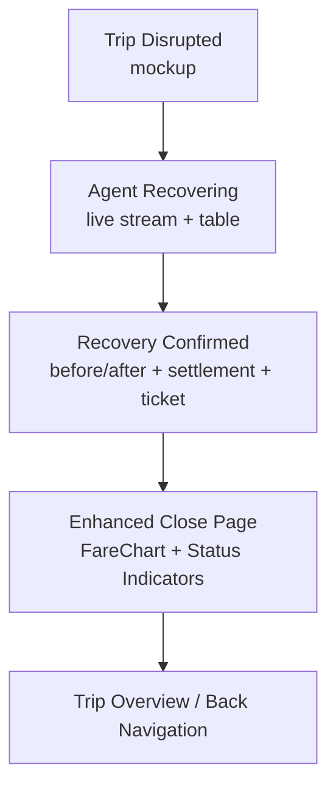
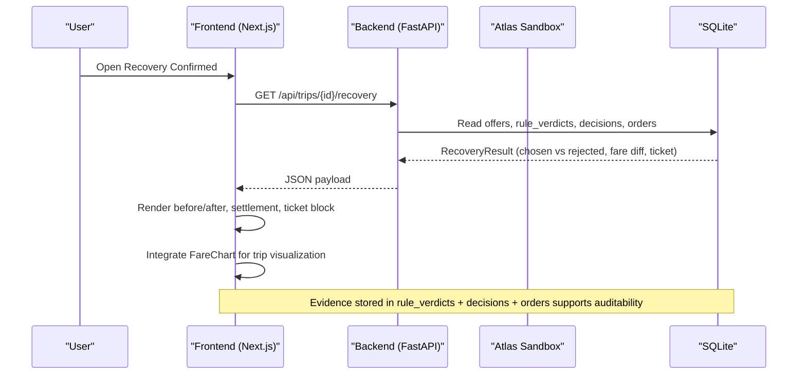
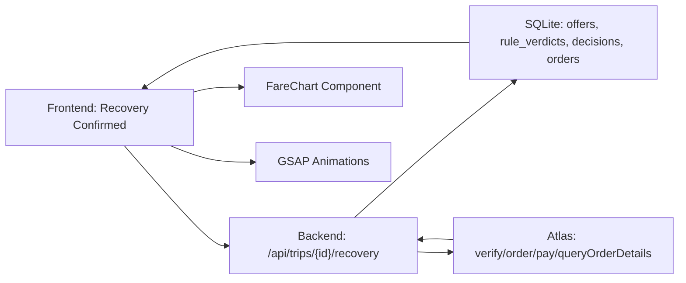
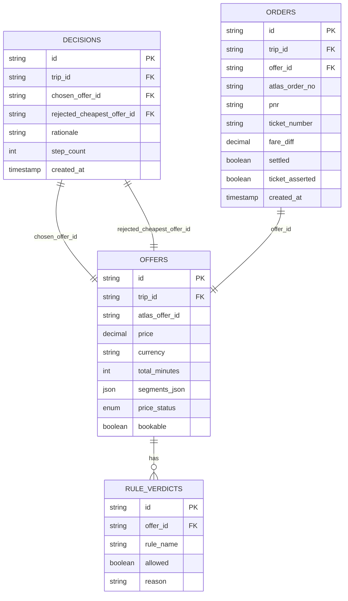

# Recovery Confirmation Screen

<cite>
**Referenced Files in This Document**
- [page.tsx](file://frontend/app/close/[deskId]/page.tsx)
- [FareChart.tsx](file://frontend/app/FareChart.tsx)
- [presentation.css](file://frontend/app/presentation.css)
- [globals.css](file://frontend/app/globals.css)
- [types.ts](file://frontend/lib/types.ts)
- [03-recovery-confirmed.html](file://docs/plans/waypoint/mockups/03-recovery-confirmed.html)
- [02-agent-recovering.html](file://docs/plans/waypoint/mockups/02-agent-recovering.html)
- [01-trip-disrupted.html](file://docs/plans/waypoint/mockups/01-trip-disrupted.html)
- [01-product.md](file://docs/plans/waypoint/01-product.md)
- [02-architecture.md](file://docs/plans/waypoint/02-architecture.md)
- [04-slices.md](file://docs/plans/waypoint/04-slices.md)
- [00-status.md](file://docs/plans/waypoint/00-status.md)
- [atlas-integration.md](file://docs/external/atlas-integration.md)
- [booking-workflow.md](file://.agents/skills/atlas-flight-booking/references/booking-workflow.md)
- [passenger-input.md](file://.agents/skills/atlas-flight-booking/references/passenger-input.md)
</cite>

## Update Summary
**Changes Made**
- Enhanced close page experience with integration of new FareChart component displaying 'Where every trip stands' visualization
- Improved status indicators using pip shapes for accessibility (pip-full, pip-half, pip-cross)
- Enhanced budget tracking with zero-state handling and proper messaging when nothing was booked
- Added comprehensive fare movement visualization showing cost basis vs current prices
- Implemented animated budget bar with real spent-vs-budget ratios
- Enhanced hero figure display with count-up animations and contextual messaging

## Table of Contents
1. [Introduction](#introduction)
2. [Project Structure](#project-structure)
3. [Core Components](#core-components)
4. [Architecture Overview](#architecture-overview)
5. [Detailed Component Analysis](#detailed-component-analysis)
6. [Enhanced Close Page Experience](#enhanced-close-page-experience)
7. [Dependency Analysis](#dependency-analysis)
8. [Performance Considerations](#performance-considerations)
9. [Troubleshooting Guide](#troubleshooting-guide)
10. [Conclusion](#conclusion)
11. [Appendices](#appendices)

## Introduction
This document explains the Recovery Confirmation Screen that presents a clear before/after comparison between the original disrupted itinerary and the confirmed legal reroute. The screen has been significantly enhanced with an integrated FareChart component that displays "Where every trip stands" visualization, improved status indicators using accessible pip shapes, and sophisticated budget tracking with zero-state handling. It details how rejected cheap-but-illegal options are shown alongside the selected legal alternative, how fare difference settlement is displayed, and how new PNR/ticket information and confirmation status are presented. It also documents the "also caught" feature that demonstrates additional rule violations prevented (such as passport expiration issues), user interaction patterns for reviewing changes and navigating back to trip overview, responsive design considerations, accessibility compliance, and guidelines for extending the screen to future rule types and validation scenarios.

## Project Structure
The Recovery Confirmation Screen is part of a three-screen demo flow:
- Trip Disrupted: shows the cancelled leg and traveler context.
- Agent Recovering: live reasoning stream with alternatives and rule verdicts.
- Recovery Confirmed: final before/after comparison, fare settlement, ticket confirmation, and comprehensive trip visualization.



**Section sources**
- [01-trip-disrupted.html:28-48](file://docs/plans/waypoint/mockups/01-trip-disrupted.html#L28-L48)
- [02-agent-recovering.html:30-61](file://docs/plans/waypoint/mockups/02-agent-recovering.html#L30-L61)
- [03-recovery-confirmed.html:31-60](file://docs/plans/waypoint/mockups/03-recovery-confirmed.html#L31-L60)

## Core Components
The Recovery Confirmation Screen is composed of these key UI components:
- Before/After Comparison Panel: displays the rejected cheapest option versus the chosen legal reroute, including route via airport and rule-based rationale.
- Fare Difference Settlement Summary: shows original fare paid, new legal reroute price, and auto-settled fare difference.
- Ticket and Order Confirmation Block: shows order created, payment confirmed (sandbox), and ticket issued with outcome asserted.
- "Also Caught" Feature: optional one-line beat demonstrating another rule violation prevented (e.g., passport expires too soon).
- **Enhanced FareChart Visualization**: displays "Where every trip stands" showing cost basis vs current market prices with authority cap visualization.
- **Improved Status Indicators**: uses accessible pip shapes (full, half, cross) for clear status communication.
- **Enhanced Budget Tracking**: sophisticated budget bar with zero-state handling and contextual messaging.

These components map directly to the mockup's layout and semantics.

**Section sources**
- [03-recovery-confirmed.html:35-57](file://docs/plans/waypoint/mockups/03-recovery-confirmed.html#L35-L57)
- [01-product.md:28-31](file://docs/plans/waypoint/01-product.md#L28-L31)

## Architecture Overview
The screen consumes data produced by the backend recovery agent loop and persists evidence through SQLite tables. The flow culminates in presenting the final result on the Recovery Confirmation Screen with enhanced visualization capabilities.



**Diagram sources**
- [02-architecture.md:13-29](file://docs/plans/waypoint/02-architecture.md#L13-L29)

**Section sources**
- [02-architecture.md:13-29](file://docs/plans/waypoint/02-architecture.md#L13-L29)
- [02-architecture.md:34-49](file://docs/plans/waypoint/02-architecture.md#L34-L49)

## Detailed Component Analysis

### Before/After Comparison Panel
Purpose:
- Show the naive cheapest option that was rejected due to rule violations.
- Show the Waypoint-booked legal alternative with its transit characteristics and why it is allowed.

Key presentation elements:
- Rejected option card: label indicating rejection, price, via airport, and concise reason (e.g., visa required for self-transfer).
- Selected option card: label indicating booking, price, via airport, and concise reason (e.g., airside transit allowed for the passenger's passport).

Data mapping:
- Rejected offer: from offers and rule_verdicts where at least one rule blocked execution.
- Chosen offer: from decisions.chosen_offer_id and orders linked to that offer.

Accessibility and responsiveness:
- Use semantic headings and labels for each card.
- Ensure color contrast for tags and text; avoid relying solely on color to convey status.
- On small screens, stack cards vertically; maintain readable font sizes and spacing.

**Section sources**
- [03-recovery-confirmed.html:35-46](file://docs/plans/waypoint/mockups/03-recovery-confirmed.html#L35-L46)
- [02-agent-recovering.html:42-59](file://docs/plans/waypoint/mockups/02-agent-recovering.html#L42-L59)

### Fare Difference Settlement Display
Purpose:
- Communicate transparently how much more the legal reroute costs compared to the original fare and confirm that the system automatically settled the difference.

Key presentation elements:
- Original fare paid.
- New legal reroute price.
- Fare difference line showing the delta and noting automatic settlement in sandbox mode.

Data mapping:
- Original fare: from the original order or trip state.
- New legal reroute price: from the chosen offer's verified price.
- Fare difference: computed deterministically by the backend; displayed as a positive adjustment when the legal reroute costs more.

Accessibility and responsiveness:
- Present rows with clear labels and aligned values.
- Use numeric formatting consistently (currency symbol, decimal places).
- On narrow screens, ensure rows wrap gracefully without losing alignment.

**Section sources**
- [03-recovery-confirmed.html:48-52](file://docs/plans/waypoint/mockups/03-recovery-confirmed.html#L48-L52)
- [02-architecture.md:44-47](file://docs/plans/waypoint/02-architecture.md#L44-L47)

### Ticket and Order Confirmation Block
Purpose:
- Provide confidence that the booking completed successfully and that outcomes were asserted, not assumed.

Key presentation elements:
- Order created with PNR.
- Payment confirmed (noting sandbox behavior).
- Ticket issued with assertion that the outcome was verified.

Data mapping:
- Order created: from orders table fields linking trip and chosen offer.
- PNR and ticket number: from order details returned by Atlas queryOrderDetails.
- Payment confirmation: from pay step result in sandbox (auto-approve).

Accessibility and responsiveness:
- Use a monospaced-style block to visually distinguish ticket-like content while keeping it accessible with proper roles and labels.
- Ensure checkmarks are conveyed via text or aria-labels for screen readers.

**Section sources**
- [03-recovery-confirmed.html:52-56](file://docs/plans/waypoint/mockups/03-recovery-confirmed.html#L52-L56)
- [02-architecture.md:44-47](file://docs/plans/waypoint/02-architecture.md#L44-L47)
- [atlas-integration.md:33-36](file://docs/external/atlas-integration.md#L33-L36)

### "Also Caught" Feature
Purpose:
- Demonstrate additional rule violations prevented beyond the hero rule (transit visa), such as passport expiration issues, reinforcing the engine's breadth.

Presentation:
- One-line beat appended near the confirmation block or punchline, e.g., "Also caught: passport expires too soon."

Data mapping:
- Derived from rule_verdicts for PassportValidityRule or similar rules applied during recovery.

Accessibility and responsiveness:
- Keep the message concise and scannable.
- Ensure it does not obscure primary confirmation content.

**Section sources**
- [01-product.md:13-18](file://docs/plans/waypoint/01-product.md#L13-L18)
- [01-product.md:28-31](file://docs/plans/waypoint/01-product.md#L28-L31)

### User Interaction Patterns
Reviewing changes:
- Users can compare the rejected and selected options side-by-side to understand why the cheaper option was blocked and why the chosen option is legal.
- They can inspect the settlement summary to see the price delta and confirm that the system handled it automatically.

Accessing ticket details:
- The ticket block shows PNR and issuance status; users may tap/click to open detailed order view if implemented.

Navigating back to trip overview:
- From the confirmation screen, provide a clear "Back to trip overview" action to return to the disrupted trip view or main list.

Accessibility:
- Ensure all interactive elements have descriptive labels and keyboard focus management.
- Maintain logical tab order and visible focus indicators.

**Section sources**
- [03-recovery-confirmed.html:31-60](file://docs/plans/waypoint/mockups/03-recovery-confirmed.html#L31-L60)
- [01-trip-disrupted.html:28-48](file://docs/plans/waypoint/mockups/01-trip-disrupted.html#L28-L48)

### Responsive Design Considerations
- Mobile-first layout: single-column stacking for comparison cards and settlement rows.
- Readable typography: minimum body font size, sufficient line height, and high contrast.
- Touch targets: buttons and links sized appropriately for mobile interactions.
- Content hierarchy: headline, comparison, settlement, ticket block, and contextual note should be visually ordered for quick scanning.

**Section sources**
- [03-recovery-confirmed.html:8-27](file://docs/plans/waypoint/mockups/03-recovery-confirmed.html#L8-L27)

### Accessibility Compliance
- Semantic structure: use headings, lists, and landmarks to describe sections.
- Color independence: do not rely solely on color to indicate status; include text labels and icons.
- Screen reader support: add aria-labels for non-obvious controls and decorative elements.
- Focus management: ensure keyboard navigation works across all interactive elements.

[No sources needed since this section provides general guidance]

## Enhanced Close Page Experience

### FareChart Integration - "Where Every Trip Stands"
The enhanced close page integrates a comprehensive FareChart component that provides visual insight into trip pricing dynamics. This component displays:

**Key Features:**
- **Cost Basis vs Current Prices**: Shows the original booking price alongside current market prices for each trip
- **Authority Cap Visualization**: Displays the auto-approval limit with a dashed line indicator
- **Stale Price Handling**: Uses hollow rings to indicate last-known prices that haven't been refreshed
- **Loss Admission Tracking**: Shows admitted losses with specific amounts when available
- **Zero-State Handling**: Gracefully handles cases where no trips were booked

**Implementation Details:**
- Shared between Screen 2's full record and Screen 3's wrap-up for consistent visualization
- Presentation-only component with no state management or data fetching
- Zero-based axis ensuring accurate price magnitude representation
- Accessible text equivalents for screen readers and print output

**Section sources**
- [FareChart.tsx:1-198](file://frontend/app/FareChart.tsx#L1-L198)

### Improved Status Indicators Using Pip Shapes
The close page implements an accessible status indicator system using pip shapes that work effectively across different viewing conditions:

**Status Types:**
- **Pip Full**: Solid circle indicating successful completion ("All set")
- **Pip Half**: Half-filled circle indicating partial completion ("Almost done")  
- **Pip Cross**: Cross shape indicating failure or issues ("Something went wrong")

**Accessibility Benefits:**
- Shape-based encoding ensures visibility in grayscale environments
- Measured to maintain identical lightness levels across status hues for AA compliance
- Works effectively for color vision deficiency scenarios
- Always accompanied by descriptive text labels

**Section sources**
- [page.tsx:423-439](file://frontend/app/close/[deskId]/page.tsx#L423-L439)
- [presentation.css:56-88](file://frontend/app/presentation.css#L56-L88)

### Enhanced Budget Tracking with Zero-State Handling
The budget tracking system now includes sophisticated zero-state handling and contextual messaging:

**Budget Bar Features:**
- **Real Spent-vs-Budget Ratio**: Uses actual snapshot data to calculate precise budget utilization
- **Animated Fill**: GSAP-powered scaleX animation for smooth budget bar transitions
- **Zero-State Messaging**: When no money was spent, displays "Nothing committed against your budget" instead of misleading percentages
- **Contextual Notes**: Different messaging for dry-run scenarios vs actual bookings

**Hero Figure Enhancement:**
- **Count-Up Animation**: Animated counting from 0 to final PnL amount
- **Contextual Labeling**: Dynamic labels based on whether anything was actually booked
- **Zero-State Detection**: Special handling when real spend across all budgets is zero
- **Currency-Aware Formatting**: Proper money formatting with currency symbols

**Section sources**
- [page.tsx:136-267](file://frontend/app/close/[deskId]/page.tsx#L136-L267)
- [page.tsx:458-503](file://frontend/app/close/[deskId]/page.tsx#L458-L503)

### Proper Messaging When Nothing Was Booked
The system now provides honest and informative messaging when no bookings were made during a run:

**Honesty Principles:**
- **Zero-Spend Detection**: Real-time detection of zero spending across all budgets
- **Contextual Hero Text**: Changes from "Saved X" to "Would have saved X" when no actual bookings occurred
- **Sub-line Adaptation**: Modifies status sub-text to clarify judgment occurred but no bookings were made
- **Budget Bar State**: Uses dashed styling to indicate empty commitment rather than failed fill

**Section sources**
- [page.tsx:176-184](file://frontend/app/close/[deskId]/page.tsx#L176-L184)
- [page.tsx:404-451](file://frontend/app/close/[deskId]/page.tsx#L404-L451)

## Dependency Analysis
The Recovery Confirmation Screen depends on:
- Backend REST endpoint returning recovery results.
- SQLite tables storing offers, rule_verdicts, decisions, and orders.
- Atlas integration for search, verify, order, pay, and outcome assertion.
- Rules engine producing rule verdicts that inform the before/after comparison.
- **New Dependencies**: FareChart component for trip visualization, GSAP for animations, enhanced snapshot data for budget tracking.



**Diagram sources**
- [02-architecture.md:13-29](file://docs/plans/waypoint/02-architecture.md#L13-L29)
- [02-architecture.md:34-49](file://docs/plans/waypoint/02-architecture.md#L34-L49)

**Section sources**
- [02-architecture.md:13-29](file://docs/plans/waypoint/02-architecture.md#L13-L29)
- [atlas-integration.md:33-36](file://docs/external/atlas-integration.md#L33-L36)

## Performance Considerations
- Minimize re-renders: cache recovery result until user navigates away.
- Defer heavy computations: compute fare differences server-side and send finalized numbers to the frontend.
- Stream intermediate steps earlier: present live reasoning via SSE to keep users informed while the final result loads.
- Optimize images and assets: none expected in this screen, but ensure any icons or logos are lightweight.
- **New Considerations**: 
  - GSAP animations respect `prefers-reduced-motion` settings
  - FareChart only renders when valid position data exists
  - Snapshot data caching prevents redundant API calls
  - Zero-state handling avoids unnecessary calculations

[No sources needed since this section provides general guidance]

## Troubleshooting Guide
Common issues and resolutions:
- No legal option found:
  - The agent gives up gracefully and surfaces why; the screen should reflect a no-legal-option state with explanation.
  - Check step budget and rule coverage; consider prompting for override if appropriate.
- Stale data:
  - Ensure the backend re-reads availability and price via Atlas verify before booking; display freshness cues if applicable.
- False success:
  - Confirm that ticket issuance is asserted via queryOrderDetails before marking success; show only verified outcomes.
- **New Issues**:
  - **Missing FareChart**: Verify position data is available from snapshot endpoint
  - **Animation Issues**: Check GSAP plugin registration and reduced motion preferences
  - **Budget Bar Not Filling**: Ensure snapshot data contains valid budget figures
  - **Zero-State Messaging**: Verify real spend calculation across all budgets

Operational safeguards visible on screen:
- Step budget usage.
- Re-read/verify before write.
- Outcome assertion before success.

**Section sources**
- [00-status.md:40-43](file://docs/plans/waypoint/00-status.md#L40-L43)
- [02-architecture.md:44-49](file://docs/plans/waypoint/02-architecture.md#L44-L49)

## Conclusion
The Recovery Confirmation Screen delivers a clear, trustworthy narrative of how Waypoint recovered a disrupted trip by enforcing rules beyond price. With the enhanced close page experience, it now provides comprehensive trip visualization through the FareChart component, accessible status indicators using pip shapes, and sophisticated budget tracking with zero-state handling. The screen contrasts rejected illegal options with the selected legal reroute, transparently shows fare difference settlement, confirms ticket issuance with asserted outcomes, and demonstrates additional rule violations prevented. The "also caught" feature reinforces the engine's capability to prevent violations like passport expiration. With thoughtful UX, responsive design, accessibility compliance, and enhanced visualization capabilities, the screen communicates complex comparison data effectively and builds confidence in autonomous recovery.

[No sources needed since this section summarizes without analyzing specific files]

## Appendices

### Data Model Mapping for the Screen


**Diagram sources**
- [02-architecture.md:21-29](file://docs/plans/waypoint/02-architecture.md#L21-L29)

### Extending the Confirmation Display for Future Rules
Guidelines:
- Add a rule-specific badge or tag in the comparison panel to explain why an option was rejected (e.g., "onward ticket required," "health entry not met").
- Extend the settlement summary to itemize adjustments caused by rule-driven rerouting (e.g., fees for alternate routing).
- Include per-rule provenance and freshness notes where applicable (e.g., curated table last checked date).
- Support multiple "also caught" beats if several rules flagged issues.
- Ensure new rule outputs conform to the existing RuleVerdict model so the screen can render them generically.
- **New Guidelines**:
  - Extend FareChart to accommodate new trip attributes and pricing dimensions
  - Add new pip states for additional status categories while maintaining accessibility
  - Enhance zero-state handling for new booking scenarios
  - Implement new visualization patterns for complex rule interactions

**Section sources**
- [01-product.md:13-18](file://docs/plans/waypoint/01-product.md#L13-L18)
- [04-slices.md:15-21](file://docs/plans/waypoint/04-slices.md#L15-L21)

### Integration Notes for Booking and Settlement
- Search and verify: present normalized offers and preserve selected offer_id; handle price change states appropriately.
- Order and pay: sandbox auto-approve enables autonomous fare-difference settlement; assert real outcome via order details.
- Passenger input: ensure correct payload shape and safe correction flows when info is missing or invalid.
- **New Integration Points**:
  - FareChart requires position data with cost_basis and mark_price fields
  - Budget tracking depends on snapshot endpoint providing mandate and budget information
  - GSAP animations require proper plugin registration and cleanup
  - Zero-state detection relies on accurate spend calculation across all budgets

**Section sources**
- [booking-workflow.md:1-21](file://.agents/skills/atlas-flight-booking/references/booking-workflow.md#L1-L21)
- [atlas-integration.md:33-36](file://docs/external/atlas-integration.md#L33-L36)
- [passenger-input.md:17-52](file://.agents/skills/atlas-flight-booking/references/passenger-input.md#L17-L52)

### Enhanced Close Page Technical Specifications

#### FareChart Component Interface
```typescript
interface FareChartProps {
  positions: Position[];           // Snapshot positions with pricing data
  currency?: string;              // Currency for money formatting
  authorityCap?: string;          // Auto-approval limit visualization
  losses?: Record<string, string>; // Loss amounts per position
  caption?: ReactNode;            // Chart caption and legend
}
```

#### Status Indicator System
- **pip-full**: Solid circle for successful completion
- **pip-half**: Half-filled circle for partial completion  
- **pip-cross**: Cross shape for failures or issues
- All shapes maintain accessibility standards and work in grayscale

#### Budget Tracking Implementation
- Real-time spent-vs-budget ratio calculation from snapshot data
- GSAP-powered animated budget bar with proper easing
- Zero-state detection and contextual messaging
- Currency-aware formatting with proper symbol handling

**Section sources**
- [page.tsx:1-647](file://frontend/app/close/[deskId]/page.tsx#L1-L647)
- [FareChart.tsx:1-198](file://frontend/app/FareChart.tsx#L1-L198)
- [presentation.css:56-88](file://frontend/app/presentation.css#L56-L88)