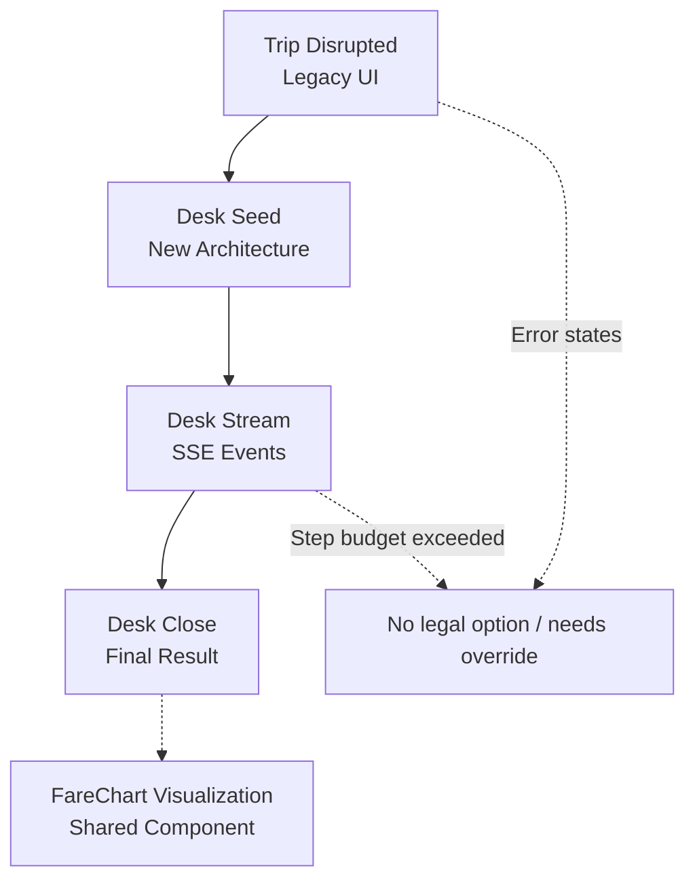
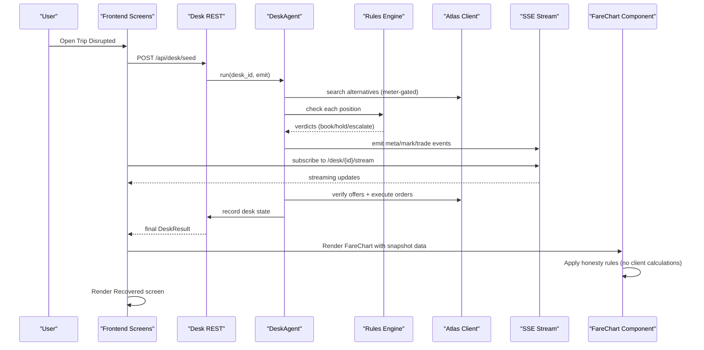
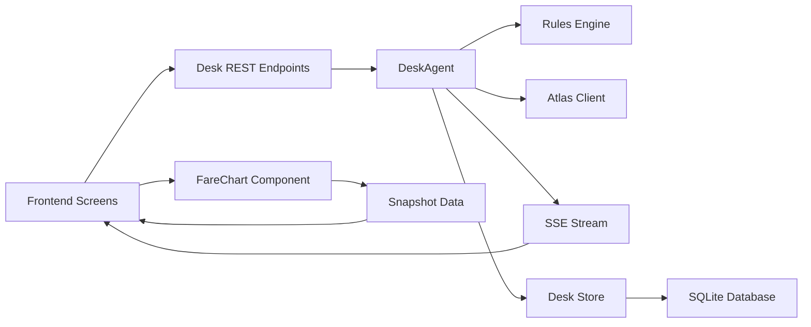

# Trip Disruption Screen

<cite>
**Referenced Files in This Document**
- [01-trip-disrupted.html](file://docs/plans/waypoint/mockups/01-trip-disrupted.html)
- [02-agent-recovering.html](file://docs/plans/waypoint/mockups/02-agent-recovering.html)
- [03-recovery-confirmed.html](file://docs/plans/waypoint/mockups/03-recovery-confirmed.html)
- [FareChart.tsx](file://frontend/app/FareChart.tsx)
- [desk page.tsx](file://frontend/app/desk/[deskId]/page.tsx)
- [close page.tsx](file://frontend/app/close/[deskId]/page.tsx)
- [routes.py](file://backend/app/api/routes.py)
- [page.tsx](file://frontend/app/page.tsx)
- [recovering page.tsx](file://frontend/app/recovering/[tripId]/page.tsx)
- [recovered page.tsx](file://frontend/app/recovered/[tripId]/page.tsx)
- [api.ts](file://frontend/lib/api.ts)
- [types.ts](file://frontend/lib/types.ts)
- [02-architecture.md](file://docs/plans/waypoint/02-architecture.md)
- [03-program-design.md](file://docs/plans/waypoint/03-program-design.md)
</cite>

## Update Summary
**Changes Made**
- Updated to reflect the migration from trip recovery workflow to desk-based architecture
- Added documentation for the new FareChart.tsx component providing shared chart visualization
- Enhanced coverage of 'honesty rules' ensuring all displayed figures derived from actual snapshot data
- Updated documentation for fare movement visualization across Screen 2's full record view and Screen 3's wrap-up screen
- Clarified handling of stale prices, authority limits, and loss events in the chart component

## Table of Contents
1. [Introduction](#introduction)
2. [Project Structure](#project-structure)
3. [Core Components](#core-components)
4. [Architecture Overview](#architecture-overview)
5. [Detailed Component Analysis](#detailed-component-analysis)
6. [Dependency Analysis](#dependency-analysis)
7. [Performance Considerations](#performance-considerations)
8. [Troubleshooting Guide](#troubleshooting-guide)
9. [Conclusion](#conclusion)
10. [Appendices](#appendices)

## Introduction
This document specifies the Trip Disruption Screen as the primary entry point when a flight cancellation is detected. **Updated**: While the visual mockups remain for reference, the underlying workflow has been replaced by the new desk-based architecture. The screen now serves as a legacy interface maintained for backward compatibility, with the actual disruption handling managed through desk cycle management endpoints. The documentation explains how the screen presents the booked itinerary with cancelled legs clearly flagged, shows traveler passport information in context, and provides immediate visibility into disruption impact through the new desk-based system. A new shared FareChart component provides consistent fare movement visualization across the full record view and wrap-up screen, implementing strict 'honesty rules' to ensure all displayed figures are derived from actual snapshot data rather than client-side calculations.

## Project Structure
The Trip Disruption Screen consists of three visual mockup screens that form a coherent flow, now backed by desk-based architecture:
- Trip disrupted: initial view showing the affected itinerary and recovery action (legacy UI)
- Recovering: live agent reasoning stream via SSE (now powered by desk cycle)
- Recovered: confirmation with before/after comparison (now using desk results)

**Diagram sources**
- [01-trip-disrupted.html:1-51](file://docs/plans/waypoint/mockups/01-trip-disrupted.html#L1-L51)
- [routes.py:123-139](file://backend/app/api/routes.py#L123-L139)
- [routes.py:142-168](file://backend/app/api/routes.py#L142-L168)
- [routes.py:181-194](file://backend/app/api/routes.py#L181-L194)
- [FareChart.tsx:1-198](file://frontend/app/FareChart.tsx#L1-L198)

**Section sources**
- [01-trip-disrupted.html:1-51](file://docs/plans/waypoint/mockups/01-trip-disrupted.html#L1-L51)
- [02-agent-recovering.html:1-64](file://docs/plans/waypoint/mockups/02-agent-recovering.html#L1-L64)
- [03-recovery-confirmed.html:1-63](file://docs/plans/waypoint/mockups/03-recovery-confirmed.html#L1-L63)
- [routes.py:123-194](file://backend/app/api/routes.py#L123-L194)

## Core Components
- Itinerary card list: Each leg is a card showing route, flight number, times, and status. Cancelled legs are visually distinct; downstream segments show risk status.
- Passenger context banner: Shows traveler name and passport country flag to reinforce rule checks and personalization.
- Recovery call-to-action: Primary button to initiate desk cycle management.
- Live reasoning stream: Monospace log showing desk cycle steps like mandate setup, reprice fan-out, judgment calls, and execution decisions.
- Desk state display: Lists positions with verdicts (book/hold/escalate) and highlights chosen options.
- Confirmation panel: Before/after comparison, settlement details, and ticket assertion via desk results.
- **New**: FareChart component: Shared visualization displaying fare movements with honesty rules ensuring all figures come from actual snapshot data.

Key responsibilities:
- Communicate disruption impact immediately and unambiguously.
- Provide clear next actions to start desk cycle management.
- Stream transparency during desk cycle to build trust.
- Confirm successful resolution with evidence from desk operations.
- **New**: Display consistent fare movement visualization across screens with strict data integrity rules.

**Section sources**
- [01-trip-disrupted.html:14-47](file://docs/plans/waypoint/mockups/01-trip-disrupted.html#L14-L47)
- [02-agent-recovering.html:33-60](file://docs/plans/waypoint/mockups/02-agent-recovering.html#L33-L60)
- [03-recovery-confirmed.html:35-56](file://docs/plans/waypoint/mockups/03-recovery-confirmed.html#L35-L56)
- [FareChart.tsx:37-47](file://frontend/app/FareChart.tsx#L37-L47)

## Architecture Overview
**Updated**: The Trip Disruption Screen now integrates with desk-based architecture via REST and Server-Sent Events (SSE), with a new shared FareChart component for consistent visualization:
- Frontend displays the Trip Disrupted screen and triggers desk seed.
- Backend receives desk seed requests, runs the desk cycle with DeskAgent, applies rules, and streams progress.
- The frontend updates the Recovering screen in real time via SSE events and then renders the Recovered screen upon completion.
- **New**: FareChart component provides unified fare movement visualization across Screen 2 (full record view) and Screen 3 (wrap-up screen), implementing strict honesty rules.

**Diagram sources**
- [routes.py:123-139](file://backend/app/api/routes.py#L123-L139)
- [routes.py:142-168](file://backend/app/api/routes.py#L142-L168)
- [routes.py:181-194](file://backend/app/api/routes.py#L181-L194)
- [FareChart.tsx:10-22](file://frontend/app/FareChart.tsx#L10-L22)
- [desk page.tsx:1377-1397](file://frontend/app/desk/[deskId]/page.tsx#L1377-L1397)
- [close page.tsx:513-533](file://frontend/app/close/[deskId]/page.tsx#L513-L533)

## Detailed Component Analysis

### Trip Disrupted Screen
Purpose:
- Immediately communicate that a leg is cancelled and what downstream impact exists.
- Show traveler passport context to frame why certain reroutes may be blocked.
- Offer a single, clear action to start desk cycle management.

Visual hierarchy:
- Top-level brand and trip summary establish context.
- Passenger banner prominently shows traveler identity and passport country.
- Itinerary cards:
  - Cancelled leg: high-contrast border and badge indicating cancellation.
  - Downstream segment: "AT RISK" badge to signal dependency on landing time.
- Primary CTA: full-width button to initiate desk cycle.
- Supporting note: reassurance about reading passport before rebooking.

Interactions:
- Clicking the recovery button initiates desk cycle via `/api/desk/seed` and navigates to the Recovering screen.
- Status badges provide quick scanning of leg statuses.

Responsive behavior:
- Single-column layout optimized for mobile with comfortable tap targets.
- Cards stack vertically; badges remain visible without overflow.

Accessibility:
- Use semantic headings for sections (brand/title, itinerary, actions).
- Ensure badges convey meaning beyond color (text labels like "CANCELLED", "AT RISK").
- Provide keyboard focus order: itinerary cards → recovery button → notes.
- Announce dynamic changes via aria-live regions when transitioning to the Recovering screen.

Error states:
- If desk seed fails, display an error message with retry and support options.
- If no legal option exists in desk cycle, surface a clear explanation and prompt for manual assistance.

Design system consistency:
- Follow spacing, typography scale, and color tokens used across mockups.
- Maintain consistent badge semantics and card structure for all disruption scenarios.

Extensibility:
- Add new leg types (e.g., multi-segment connections) using the same card pattern.
- Introduce additional status badges (e.g., delayed, changed gate) while preserving hierarchy.

**Section sources**
- [01-trip-disrupted.html:1-51](file://docs/plans/waypoint/mockups/01-trip-disrupted.html#L1-L51)
- [page.tsx:13-62](file://frontend/app/page.tsx#L13-L62)

### Recovering Screen
**Updated**: Now powered by desk cycle management instead of trip recovery, with integrated FareChart visualization.

Purpose:
- Provide transparent, step-by-step visibility into the desk agent's reasoning and actions.
- Show position assessments with desk-based verdicts and highlight chosen alternatives.
- Display fare movement visualization showing cost basis vs. current market price.

Key elements:
- Live stream: monospace log detailing mandate setup, reprice fan-out, judgment calls, and execution decisions.
- Search meter indicator: informs users when the desk agent will stop if it cannot resolve (20 searches/cycle).
- Position table: lists alternatives with desk verdicts (book/hold/escalate) and highlights the chosen option.
- Highlighted pick: visually emphasizes the chosen legal option from desk judgment.
- **New**: FareChart visualization: Shows fare movements with honesty rules, displaying booked cost vs. current mark price with authority limit indicators.

Interactions:
- Auto-updates via SSE stream from `/api/desk/{desk_id}/stream`; no manual input required.
- Users can observe desk cycle progress and understand why certain positions are held or booked.
- **New**: FareChart automatically updates with snapshot data, never performing client-side calculations.

Responsive behavior:
- Stream scrolls within a fixed-height container on small screens.
- Table wraps content; ensure readability on narrow devices.
- **New**: FareChart adapts to different screen sizes while maintaining data integrity.

Accessibility:
- Stream text should be announced incrementally via aria-live polite regions.
- Table headers and rows must be properly labeled; use scope attributes for th.
- Ensure sufficient contrast for verdict colors and strike-through text.
- **New**: FareChart includes proper ARIA labels and screen reader announcements for fare movements.

Error states:
- If step budget is exceeded or no legal option is found, display a graceful give-up message explaining constraints and next steps.
- **New**: FareChart gracefully handles missing or invalid data by omitting problematic rows.

Design system consistency:
- Reuse color tokens for book/hold/escalate verdicts.
- Keep typography and spacing aligned with other screens.
- **New**: FareChart follows established design patterns for consistent visualization.

Extensibility:
- Add new desk outputs (e.g., seat selection, allocation decisions) to the table and stream without disrupting layout.
- Support multiple positions by grouping verdicts per position where relevant.
- **New**: FareChart can accommodate new fare metrics while maintaining honesty rules.

**Section sources**
- [02-agent-recovering.html:1-64](file://docs/plans/waypoint/mockups/02-agent-recovering.html#L1-L64)
- [desk page.tsx:1377-1397](file://frontend/app/desk/[deskId]/page.tsx#L1377-L1397)
- [routes.py:142-168](file://backend/app/api/routes.py#L142-L168)

### Recovered Screen
**Updated**: Now displays desk cycle results with integrated FareChart visualization instead of trip recovery outcomes.

Purpose:
- Confirm successful desk cycle completion with clear before/after comparison and settlement evidence.
- Reinforce that the chosen option is legal and boardable for the traveler's passport based on desk judgment.
- **New**: Provide comprehensive fare movement visualization showing final position values against authority limits.

Key elements:
- Comparison columns: naive cheapest (rejected) vs. desk-booked (legal).
- Settlement block: original fare, new fare, auto-settled difference from desk operations.
- Ticket assertion: order created, payment confirmed, ticket issued via desk write path.
- **New**: FareChart visualization: Shows where every trip stands with honest representation of costs and limits.

Interactions:
- Read-only confirmation; optional links to view PNR or manage booking.
- **New**: FareChart provides visual confirmation of fare movements and policy compliance.

Responsive behavior:
- Columns stack on mobile; settlement block remains readable.
- **New**: FareChart maintains readability across all device sizes.

Accessibility:
- Use descriptive headings for comparison and settlement sections.
- Ensure strike-through text conveys rejection; pair with explicit labels.
- **New**: FareChart includes comprehensive accessibility features for screen readers.

Error states:
- If desk cycle fails or ticket not issued, show a failure state with guidance to contact support.
- **New**: FareChart handles edge cases gracefully without misleading visualizations.

Design system consistency:
- Maintain badge/tag semantics and color usage for success/failure.
- Align typography and spacing with previous screens.
- **New**: FareChart follows established design system patterns.

Extensibility:
- Add additional post-booking info (e.g., seat assignment, lounge access) without breaking layout.
- Support multi-passenger confirmations with grouped details.
- **New**: FareChart can extend to show additional fare metrics while maintaining data integrity.

**Section sources**
- [03-recovery-confirmed.html:1-63](file://docs/plans/waypoint/mockups/03-recovery-confirmed.html#L1-L63)
- [close page.tsx:513-533](file://frontend/app/close/[deskId]/page.tsx#L513-L533)

### FareChart Component
**New**: Shared visualization component providing consistent fare movement display across Screen 2 and Screen 3.

Purpose:
- Display fare movements with strict honesty rules ensuring all figures come from actual snapshot data.
- Provide consistent visualization language across the full record view and wrap-up screen.
- Handle edge cases like stale prices, authority limits, and loss events appropriately.

Key features:
- Zero-based axis ensuring distance from left edge represents real magnitude.
- Authority cap line drawn on same scale for self-explanatory escalation visualization.
- Stale marks shown as hollow rings (not faded dots) following measured contrast rules.
- Loss figures only appear when real loss events supply amounts.
- No client-side arithmetic presented as system numbers.

Honesty rules implemented:
- Both ends of each dumbbell are real fields (cost_basis, mark_price).
- Bar between them is geometry derived from decimals, never printed as figure.
- Gap (mark - basis) never shown as text to avoid client-side arithmetic.
- Authority cap drawn on same scale making escalations self-explanatory.
- Stale marks use shape encoding (hollow ring) not opacity encodings.

Data handling:
- Filters out positions that cannot be placed on zero-based axis.
- Handles negative or non-finite values gracefully.
- Maintains proper ordering from snapshot data.
- Provides fallback trip labeling when trip_label is unavailable.

**Section sources**
- [FareChart.tsx:1-198](file://frontend/app/FareChart.tsx#L1-L198)

## Dependency Analysis
**Updated**: The Trip Disruption Screen now depends on desk-based architecture with integrated FareChart component:
- Backend desk endpoints for mandate seeding, state retrieval, and cycle management.
- SSE stream for live updates during desk cycle execution.
- Desk store for persistent evidence of positions, ledger, and budgets.
- Atlas client for searching alternatives, verifying offers, and executing orders within desk constraints.
- **New**: FareChart component for consistent visualization across screens.

**Diagram sources**
- [routes.py:123-194](file://backend/app/api/routes.py#L123-L194)
- [FareChart.tsx:24-27](file://frontend/app/FareChart.tsx#L24-L27)
- [desk page.tsx:28-36](file://frontend/app/desk/[deskId]/page.tsx#L28-L36)
- [close page.tsx:23-31](file://frontend/app/close/[deskId]/page.tsx#L23-L31)

**Section sources**
- [routes.py:123-194](file://backend/app/api/routes.py#L123-L194)
- [FareChart.tsx:1-198](file://frontend/app/FareChart.tsx#L1-L198)

## Performance Considerations
- Minimize payload size for desk state and position lists to reduce render time on mobile.
- Debounce SSE messages to avoid excessive reflows; batch updates where appropriate.
- Lazy-load detailed position tables after initial critical path renders.
- Cache static assets (styles, fonts) and reuse components to improve perceived performance.
- Avoid blocking the main thread during large table renders; consider virtualization for long lists.
- Monitor desk search meter usage to prevent excessive API calls during fan-out operations.
- **New**: FareChart component efficiently filters and processes position data to minimize rendering overhead.
- **New**: FareChart uses CSS transforms for smooth animations and avoids layout thrashing.

## Troubleshooting Guide
Common issues and resolutions:
- Desk seed failure:
  - Symptom: Error state on Trip Disrupted screen.
  - Action: Retry desk seed; if persistent, show support link and fallback instructions.
- No legal position:
  - Symptom: Recovering screen indicates inability to find executable positions.
  - Action: Display explanation and prompt for manual assistance; log reason for audit.
- Step budget exceeded:
  - Symptom: Desk agent stops early due to complexity limits.
  - Action: Inform user of constraints and suggest escalation.
- Stale offer or price change:
  - Symptom: Verification fails or price differs from initial search.
  - Action: Re-run search within meter limits and update UI; notify user of changes.
- Ticket assertion failure:
  - Symptom: Order created but ticket not issued via desk write path.
  - Action: Surface failure state with support guidance; preserve audit trail.
- Desk cycle timeout:
  - Symptom: Desk cycle does not complete within expected timeframe.
  - Action: Check backend logs and provide user with timeout error information.
- **New**: FareChart data issues:
  - Symptom: Missing or incomplete fare visualization.
  - Action: Verify snapshot data integrity; check for invalid numeric values; ensure proper currency formatting.
- **New**: Honesty rule violations:
  - Symptom: Inconsistent fare calculations or misleading visualizations.
  - Action: Review data source validation; ensure all figures come from snapshot data; verify authority cap handling.

**Section sources**
- [routes.py:181-194](file://backend/app/api/routes.py#L181-L194)
- [03-program-design.md:145-155](file://docs/plans/waypoint/03-program-design.md#L145-L155)
- [FareChart.tsx:56-75](file://frontend/app/FareChart.tsx#L56-L75)

## Conclusion
The Trip Disruption Screen serves as the critical first touchpoint for travelers experiencing flight cancellations. **Updated**: While the visual interface remains familiar, the underlying system has migrated to desk-based architecture for more robust disruption management, enhanced by the new FareChart component for consistent visualization. By clearly flagging cancelled legs, contextualizing passport constraints, and providing immediate desk cycle initiation, it reduces uncertainty and accelerates resolution. The subsequent Recovering and Recovered screens maintain transparency and trust through live desk cycle monitoring, concrete confirmation, and honest fare movement visualization. The FareChart component ensures all displayed figures derive from actual snapshot data, implementing strict honesty rules that prevent client-side calculations and maintain data integrity. Adhering to responsive design, accessibility standards, and error handling ensures a robust experience across devices and conditions. Extensibility guidelines enable future disruption scenarios while preserving consistency with the design system.

## Appendices

### Visual Hierarchy Reference
- Priority order:
  1. Cancelled leg badge and route.
  2. Passenger context banner (name and passport).
  3. Downstream risk indicators.
  4. Desk cycle initiation CTA.
  5. Supporting notes.
  6. **New**: FareChart visualization (in applicable screens).

### Accessibility Checklist
- Semantic HTML structure with proper headings and landmarks.
- Color-independent status indicators (labels + icons).
- Keyboard navigation with visible focus states.
- Screen reader announcements for dynamic updates (SSE stream).
- Sufficient contrast ratios for all text and badges.
- **New**: FareChart includes comprehensive ARIA labels and screen reader support.

### Design System Consistency
- Use shared color tokens for background, cards, ink, muted, lines, bad, good, accent.
- Maintain consistent spacing, typography scale, and border radii across screens.
- Standardize badge semantics (e.g., CANCELLED, AT RISK, book/hold/escalate).
- Keep component patterns (cards, tables, banners) reusable and predictable.
- **New**: FareChart follows established design patterns for consistent visualization.

### Legacy Compatibility Notes
- Visual mockups remain unchanged for backward compatibility.
- API endpoints have migrated from trip recovery to desk management.
- Frontend maintains existing user experience while leveraging new backend architecture.
- Migration path allows gradual transition from trip recovery to desk-based workflows.
- **New**: FareChart component provides consistent visualization while maintaining backward compatibility.

### FareChart Implementation Details
**New**: Technical specifications for the shared fare visualization component:

- **Data Integrity**: All figures derived from snapshot data, never client-side calculations
- **Visualization Rules**: Zero-based axis, authority cap on same scale, stale marks as hollow rings
- **Error Handling**: Graceful filtering of invalid data, fallback trip labeling
- **Accessibility**: Comprehensive ARIA support, screen reader announcements, keyboard navigation
- **Performance**: Efficient data processing, CSS transforms for smooth animations
- **Responsiveness**: Adapts to different screen sizes while maintaining data clarity

**Section sources**
- [FareChart.tsx:10-22](file://frontend/app/FareChart.tsx#L10-L22)
- [FareChart.tsx:56-75](file://frontend/app/FareChart.tsx#L56-L75)
- [FareChart.tsx:149-159](file://frontend/app/FareChart.tsx#L149-L159)