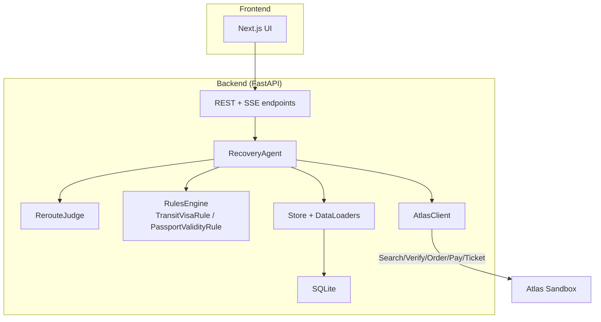
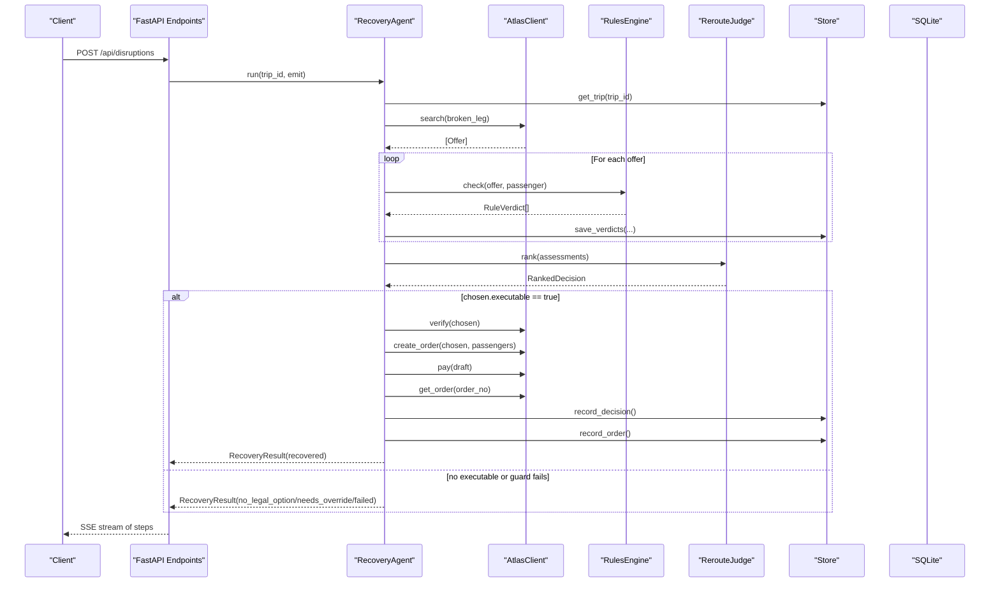
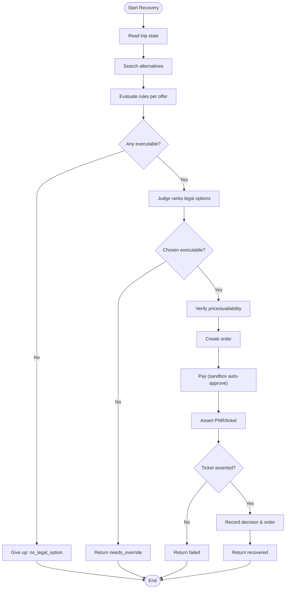
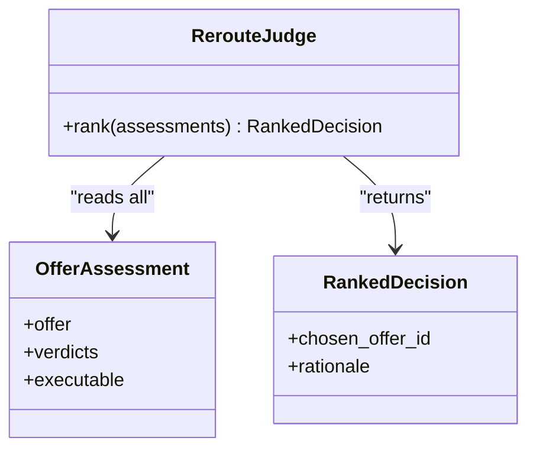
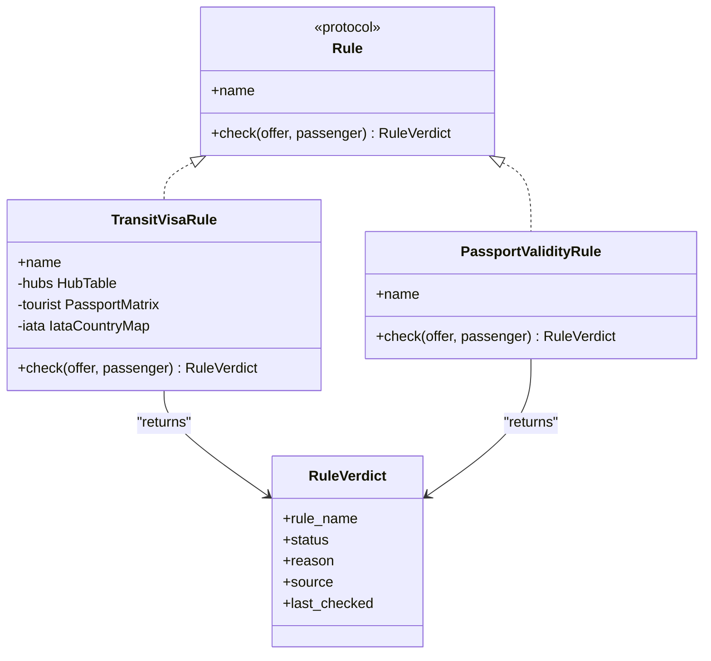
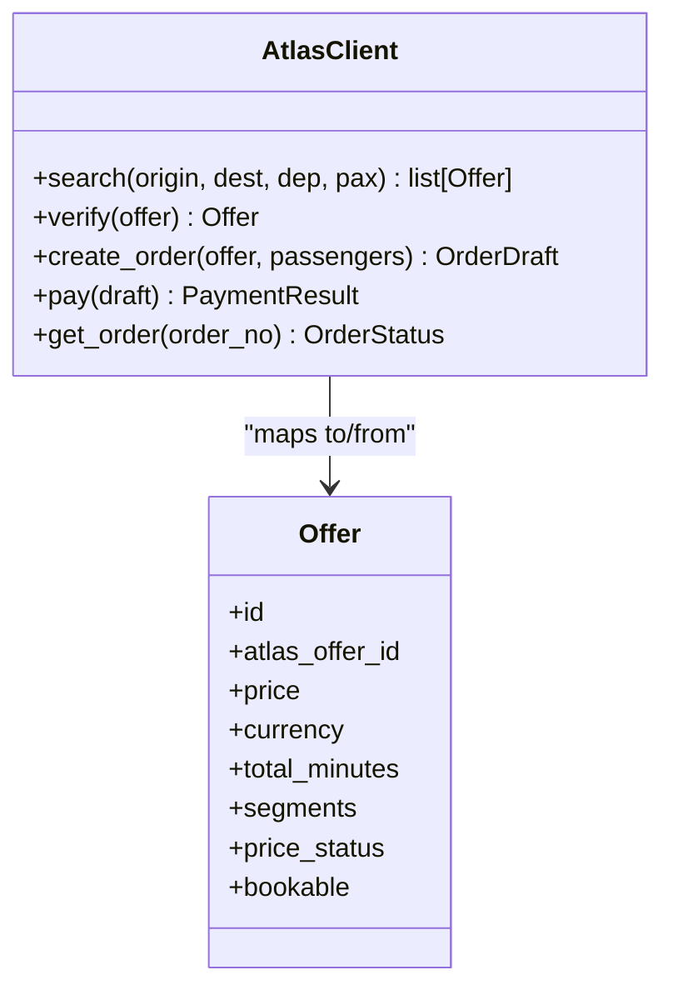
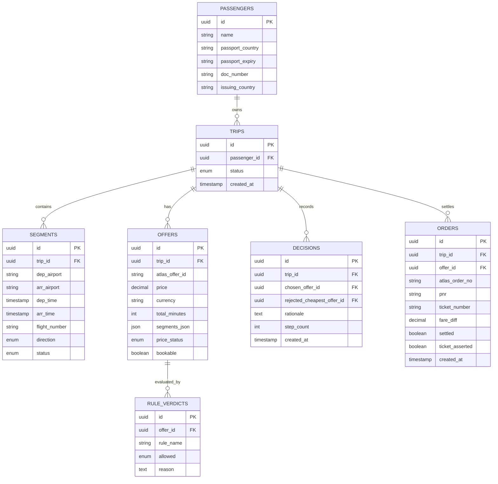
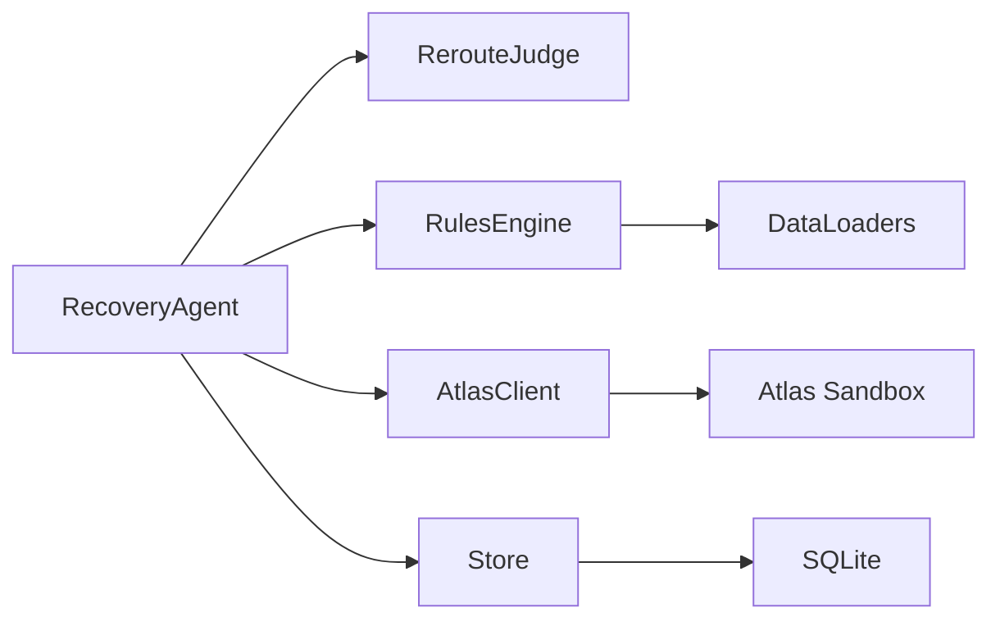

# Component Responsibilities

<cite>
**Referenced Files in This Document**
- [02-architecture.md](file://docs/plans/waypoint/02-architecture.md)
- [03-program-design.md](file://docs/plans/waypoint/03-program-design.md)
- [04-slices.md](file://docs/plans/waypoint/04-slices.md)
- [0003-advise-execute-two-gate-split.md](file://docs/adr/0003-advise-execute-two-gate-split.md)
- [0002-visa-rules-curated-approximation.md](file://docs/adr/0002-visa-rules-curated-approximation.md)
- [atlas-integration.md](file://docs/external/atlas-integration.md)
- [SKILL.md](file://.agents/skills/atlas-flight-booking/SKILL.md)
</cite>

## Table of Contents
1. Introduction
2. Project Structure
3. Core Components
4. Architecture Overview
5. Detailed Component Analysis
6. Dependency Analysis
7. Performance Considerations
8. Troubleshooting Guide
9. Conclusion

## Introduction
This document explains the responsibilities and interactions of the major components in the Waypoint architecture, focusing on:
- RecoveryAgent as the main orchestrator with three guards and execute wall enforcement
- RerouteJudge’s role in seeing all offers and making recommendations while respecting the execute boundary
- RulesEngine components (TransitVisaRule and PassportValidityRule)
- AtlasClient integration patterns and domain-to-API mapping
- Store component for typed persistence and data loaders for transit hub information
- Inter-component dependencies and communication through well-defined interfaces
- Examples of collaboration in typical scenarios

The design enforces a two-gate model: an open advise gate where all options are visible and reasoned over, and a fail-closed execute gate that only auto-books fully allowed offers.

**Section sources**
- [02-architecture.md:3-11](file://docs/plans/waypoint/02-architecture.md#L3-L11)
- [03-program-design.md:3-7](file://docs/plans/waypoint/03-program-design.md#L3-L7)
- [0003-advise-execute-two-gate-split.md:1-19](file://docs/adr/0003-advise-execute-two-gate-split.md#L1-L19)

## Project Structure
Waypoint is organized into a backend (Python FastAPI) and a frontend (Next.js/React). The backend hosts the recovery agent loop, rules engine, Atlas integration, SQLite persistence, and SSE streaming. The forked Atlas skill provides search, verify, order, pay, and ticketing capabilities used by the backend.

**Diagram sources**
- [02-architecture.md:3-11](file://docs/plans/waypoint/02-architecture.md#L3-L11)
- [03-program-design.md:9-32](file://docs/plans/waypoint/03-program-design.md#L9-L32)

**Section sources**
- [02-architecture.md:3-11](file://docs/plans/waypoint/02-architecture.md#L3-L11)
- [03-program-design.md:9-32](file://docs/plans/waypoint/03-program-design.md#L9-L32)

## Core Components
- RecoveryAgent: Orchestrates the recovery loop with three guards (step budget, re-read before write, assert outcome), enforce execute wall, and emit steps via SSE.
- RerouteJudge: Sees all assessments (advise gate) and recommends the best executable offer; code re-checks executability before booking.
- RulesEngine: Pluggable rule interface with 3-state verdicts (allowed/blocked/unknown); includes TransitVisaRule and PassportValidityRule.
- AtlasClient: Wraps the forked Atlas skill to map domain types to external API responses and perform search/verify/order/pay/ticket operations.
- Store: Typed persistence layer backed by SQLite; persists offers, rule verdicts, decisions, orders, and trip state; uses data loaders for curated transit hubs and passport matrices.

Key responsibilities and boundaries:
- Execute wall: Only offers with all rules allowed proceed to auto-book; blocked or unknown require human override.
- Advise gate: All offers are visible and reasoned over; rationale includes rejected options.
- Guards: Step budget limits loop iterations; re-read before write ensures freshness; assert outcome confirms real ticketing.

**Section sources**
- [03-program-design.md:3-7](file://docs/plans/waypoint/03-program-design.md#L3-L7)
- [03-program-design.md:57-123](file://docs/plans/waypoint/03-program-design.md#L57-L123)
- [02-architecture.md:34-49](file://docs/plans/waypoint/02-architecture.md#L34-L49)

## Architecture Overview
The recovery flow starts from a disruption trigger, runs through search, rules evaluation, judge recommendation, and execution with strict guards. Every step is streamed to the frontend via SSE.

**Diagram sources**
- [03-program-design.md:125-149](file://docs/plans/waypoint/03-program-design.md#L125-L149)
- [02-architecture.md:34-49](file://docs/plans/waypoint/02-architecture.md#L34-L49)

**Section sources**
- [03-program-design.md:125-149](file://docs/plans/waypoint/03-program-design.md#L125-L149)
- [02-architecture.md:34-49](file://docs/plans/waypoint/02-architecture.md#L34-L49)

## Detailed Component Analysis

### RecoveryAgent
Responsibilities:
- Orchestrate the recovery loop bounded by a step budget
- Re-read trip state at each iteration (guard against stale world)
- Search alternatives via AtlasClient, evaluate rules, persist verdicts
- Enforce execute wall: only auto-book if all rules allowed
- Re-verify price and availability before booking (stale guard)
- Assert real outcome (PNR/ticket) before marking success
- Emit every step to SSE for live reasoning display

Guards:
- Step budget: stops after N steps and surfaces graceful give-up
- Re-read before write: live re-read via Atlas verify prior to booking
- Assert outcome: confirm ticket issued before success

Execute wall:
- Code re-checks executability after judge picks; blocked/unknown cannot be auto-executed

**Diagram sources**
- [03-program-design.md:106-149](file://docs/plans/waypoint/03-program-design.md#L106-L149)
- [02-architecture.md:34-49](file://docs/plans/waypoint/02-architecture.md#L34-L49)

**Section sources**
- [03-program-design.md:106-149](file://docs/plans/waypoint/03-program-design.md#L106-L149)
- [02-architecture.md:34-49](file://docs/plans/waypoint/02-architecture.md#L34-L49)

### RerouteJudge
Responsibilities:
- See all assessments (advise gate open) including blocked/unknown
- Recommend the best executable offer with rationale
- Respect execute boundary: code re-checks executability before booking

Interaction:
- Receives OfferAssessment list from RecoveryAgent
- Returns RankedDecision with chosen_offer_id and rationale
- UI streams rationale to explain why cheaper illegal/unknown options were rejected

**Diagram sources**
- [03-program-design.md:97-104](file://docs/plans/waypoint/03-program-design.md#L97-L104)

**Section sources**
- [03-program-design.md:97-104](file://docs/plans/waypoint/03-program-design.md#L97-L104)

### RulesEngine: TransitVisaRule and PassportValidityRule
Responsibilities:
- Provide pluggable checks returning 3-state verdicts (allowed/blocked/unknown)
- TransitVisaRule: consults curated transit_hubs.yaml and tourist-entry fallback; applies freshness windows; fail-closed when missing or stale
- PassportValidityRule: validates passport expiry relative to policy thresholds

Data-backed behavior:
- Curated table keyed by (hub × nationality) with airside_ok, max_hours, source, last_checked
- Freshness window: airside cells trusted ≤ 6 months; entry-fallback ≤ 3 months; past window → unknown → blocked from execute
- Same-ticket structure influences messaging but never flips verdict status

**Diagram sources**
- [03-program-design.md:57-95](file://docs/plans/waypoint/03-program-design.md#L57-L95)
- [0002-visa-rules-curated-approximation.md:9-18](file://docs/adr/0002-visa-rules-curated-approximation.md#L9-L18)

**Section sources**
- [03-program-design.md:57-95](file://docs/plans/waypoint/03-program-design.md#L57-L95)
- [0002-visa-rules-curated-approximation.md:9-18](file://docs/adr/0002-visa-rules-curated-approximation.md#L9-L18)

### AtlasClient Integration Patterns
Responsibilities:
- Wrap the forked Atlas skill library to perform search, verify, order, pay, and ticket assertion
- Map external API responses to domain types (NormalizedOffer/Segment to Offer/Segment)
- Support sandbox-only auto-approve for price/payment checkpoints

Integration points:
- Search returns segments with airports and times; client filters connections and maps layovers
- Verify refreshes price/availability; create_order produces OrderDraft; pay settles fare difference; get_order asserts PNR/ticket
- Auth via OS keyring; environment switching between sandbox and production

**Diagram sources**
- [03-program-design.md:116-123](file://docs/plans/waypoint/03-program-design.md#L116-L123)
- [atlas-integration.md:15-21](file://docs/external/atlas-integration.md#L15-L21)

**Section sources**
- [03-program-design.md:116-123](file://docs/plans/waypoint/03-program-design.md#L116-L123)
- [atlas-integration.md:15-21](file://docs/external/atlas-integration.md#L15-L21)

### Store Component and Data Loaders
Responsibilities:
- Typed persistence layer using SQLAlchemy tables for trips, segments, offers, rule_verdicts, decisions, orders
- Persist evidence of reasoning (verdicts and decisions) for audit and compliance
- Data loaders for curated transit hubs (YAML), passport index (CSV), and IATA→country mapping (CSV)

Data schema highlights:
- Offers store atlas_offer_id, price, currency, total_minutes, segments_json, price_status, bookable
- Rule verdicts capture per-offer rule evaluations with status and reason
- Decisions record chosen vs rejected cheapest offer, rationale, step count
- Orders track settlement details and ticket assertion

**Diagram sources**
- [02-architecture.md:21-29](file://docs/plans/waypoint/02-architecture.md#L21-L29)

**Section sources**
- [02-architecture.md:21-29](file://docs/plans/waypoint/02-architecture.md#L21-L29)
- [03-program-design.md:21-29](file://docs/plans/waypoint/03-program-design.md#L21-L29)

## Dependency Analysis
Component relationships and communication:
- RecoveryAgent depends on AtlasClient, RulesEngine, RerouteJudge, and Store
- RulesEngine depends on curated data loaders (transit hubs, passport matrix, IATA mapping)
- AtlasClient depends on external Atlas sandbox APIs and auth via OS keyring
- Store depends on SQLite and data loaders for static datasets

Interfaces:
- Rule protocol defines check(offer, passenger) -> RuleVerdict
- OfferAssessment encapsulates offer, verdicts, and executability
- RankedDecision carries chosen offer and rationale
- AtlasClient abstracts external API calls behind domain types

**Diagram sources**
- [03-program-design.md:9-32](file://docs/plans/waypoint/03-program-design.md#L9-L32)
- [02-architecture.md:3-11](file://docs/plans/waypoint/02-architecture.md#L3-L11)

**Section sources**
- [03-program-design.md:9-32](file://docs/plans/waypoint/03-program-design.md#L9-L32)
- [02-architecture.md:3-11](file://docs/plans/waypoint/02-architecture.md#L3-L11)

## Performance Considerations
- Step budget limits agent loop iterations to prevent runaway processes
- Re-read before write reduces stale data risks; Atlas verify ensures current pricing and availability
- Curated data freshness windows minimize reliance on outdated rules; fail-closed prevents risky auto-execution
- SSE streaming keeps UI responsive without blocking backend processing
- SQLite persistence is lightweight and suitable for demo-scale workloads

[No sources needed since this section provides general guidance]

## Troubleshooting Guide
Common issues and resolutions:
- No legal option: If all offers are blocked or unknown, agent returns no_legal_option; review curated data coverage and freshness
- Needs override: If chosen offer is not executable, require explicit human override; ensure rules allow execution
- Stale price/availability: Atlas verify may detect changes; log old/new prices and handle accordingly
- Ticketing activation: Until UAT activates ticketing modules, verify/order/pay/ticket operations may be blocked; use stubbed booking for pipeline continuity
- Auth and environment: Ensure OS keyring has ATRIP credentials; switch environment to sandbox for testing

**Section sources**
- [03-program-design.md:151-179](file://docs/plans/waypoint/03-program-design.md#L151-L179)
- [atlas-integration.md:26-37](file://docs/external/atlas-integration.md#L26-L37)

## Conclusion
Waypoint’s architecture cleanly separates advice from execution, ensuring AI can reason openly while deterministic rules enforce safety. RecoveryAgent orchestrates the process with strict guards, RerouteJudge provides transparent recommendations, RulesEngine applies curated and fresh visa/passport checks, AtlasClient integrates external flight services, and Store maintains auditable persistence. This design balances agentic flexibility with operational safety, enabling robust trip recovery workflows.

[No sources needed since this section summarizes without analyzing specific files]