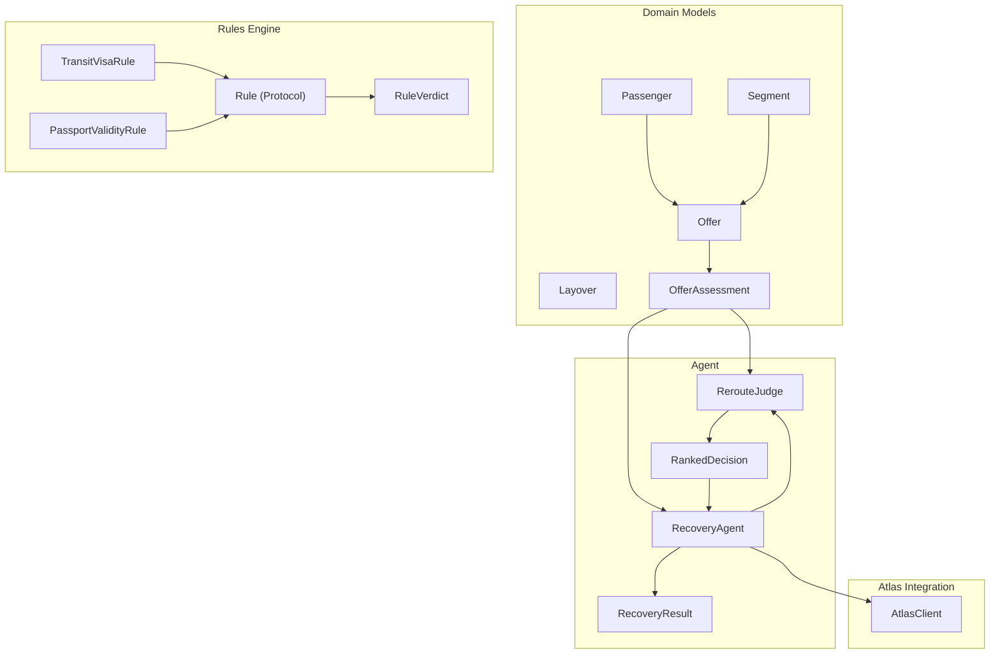
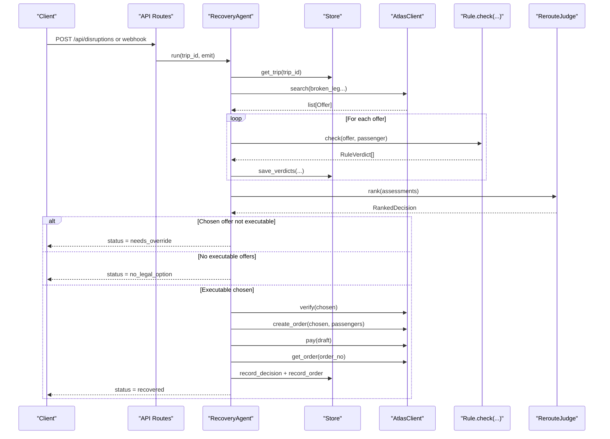
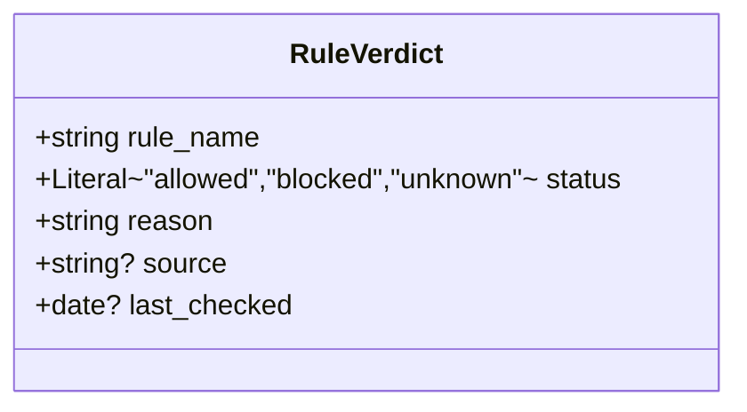
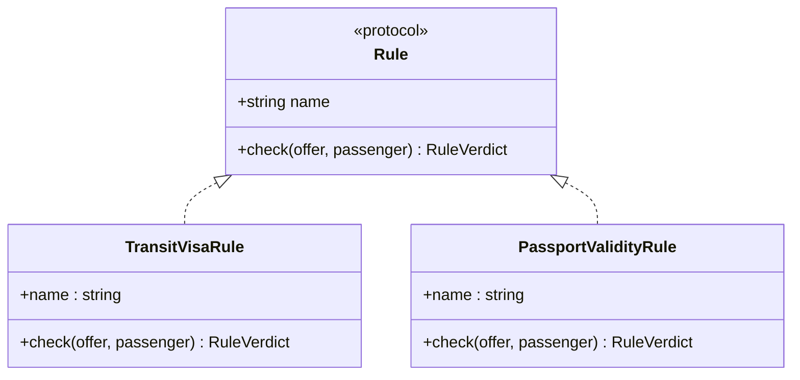
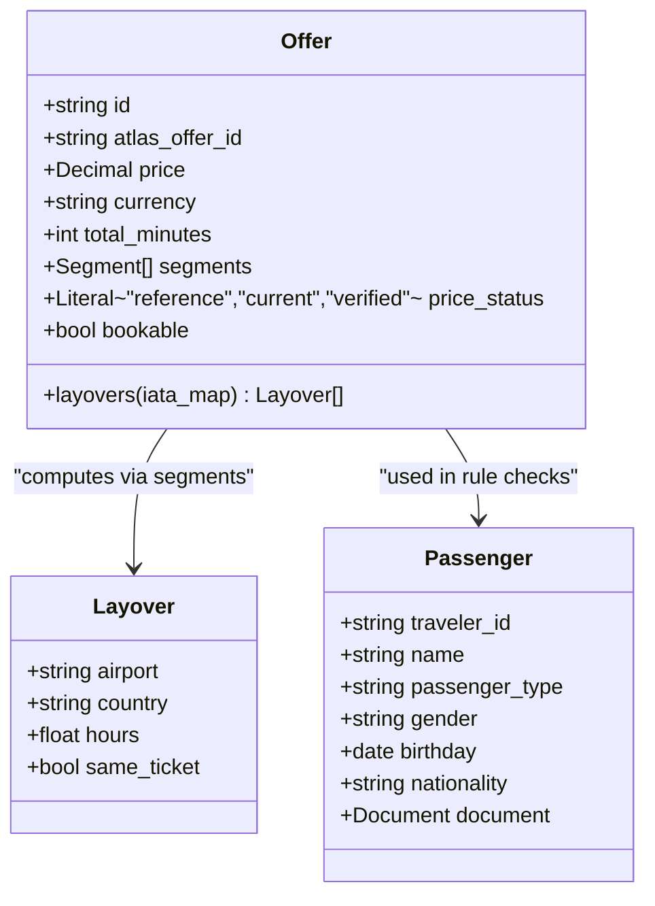
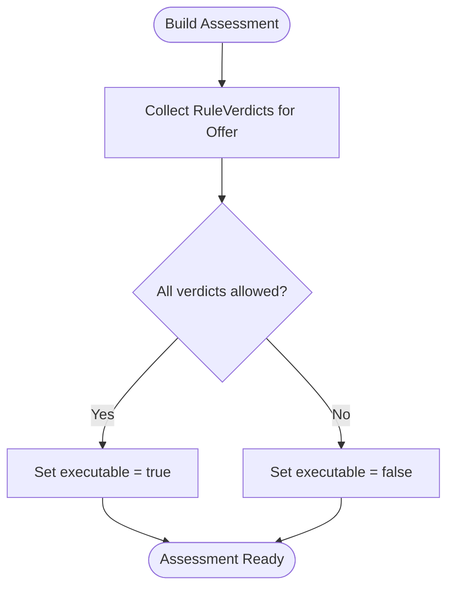
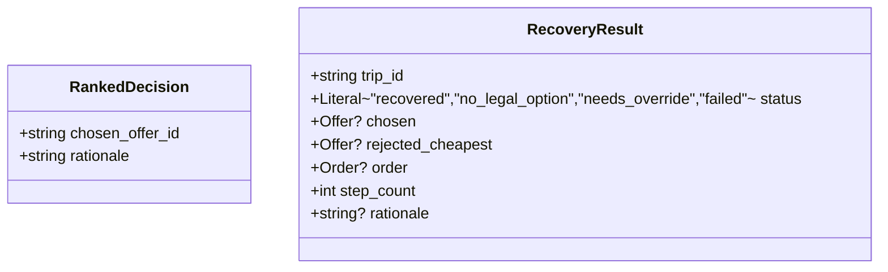
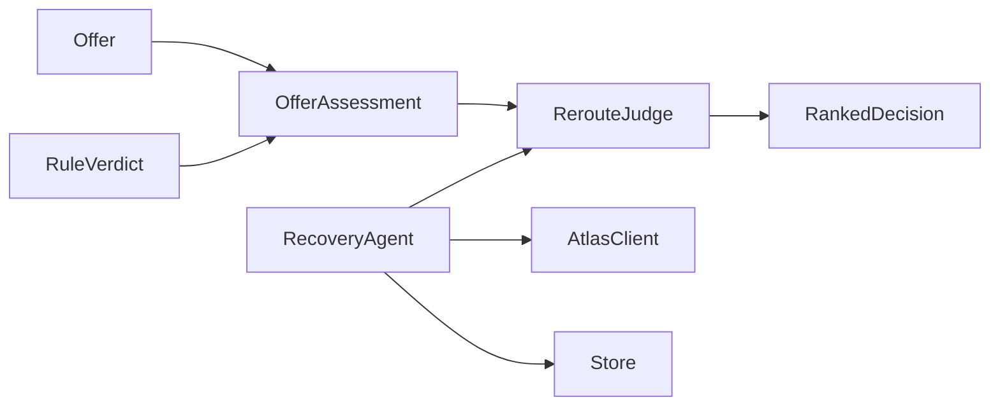

# Core Types & Interfaces

<cite>
**Referenced Files in This Document**
- [03-program-design.md](file://docs/plans/waypoint/03-program-design.md)
- [02-architecture.md](file://docs/plans/waypoint/02-architecture.md)
- [00-status.md](file://docs/plans/waypoint/00-status.md)
- [0002-visa-rules-curated-approximation.md](file://docs/adr/0002-visa-rules-curated-approximation.md)
- [0003-advise-execute-two-gate-split.md](file://docs/adr/0003-advise-execute-two-gate-split.md)
- [passenger-input.md](file://.agents/skills/atlas-flight-booking/references/passenger-input.md)
</cite>

## Table of Contents
1. [Introduction](#introduction)
2. [Project Structure](#project-structure)
3. [Core Components](#core-components)
4. [Architecture Overview](#architecture-overview)
5. [Detailed Component Analysis](#detailed-component-analysis)
6. [Dependency Analysis](#dependency-analysis)
7. [Performance Considerations](#performance-considerations)
8. [Troubleshooting Guide](#troubleshooting-guide)
9. [Conclusion](#conclusion)

## Introduction
This document explains the core types and interfaces that define the Waypoint domain model for autonomous disruption recovery. It focuses on:
- The RuleVerdict class with its three-state status system (allowed, blocked, unknown), including reason, source, and last_checked fields.
- The Rule protocol interface that enables pluggable rule implementations.
- Domain models Offer, Layover, Passenger, and their relationships and constraints.
- OfferAssessment combining offers with rule verdicts and executable status.
- RankedDecision and RecoveryResult used throughout the agent workflow.
- Concrete examples of type usage and how these types enforce business rules and data integrity across the system.

The design centers on a two-gate mental model: an open advise gate where all options are visible and labeled, and a fail-closed execute gate where only fully allowed offers can be auto-booked.

**Section sources**
- [03-program-design.md:3-7](file://docs/plans/waypoint/03-program-design.md#L3-L7)
- [0003-advise-execute-two-gate-split.md:9-12](file://docs/adr/0003-advise-execute-two-gate-split.md#L9-L12)

## Project Structure
Waypoint’s backend is organized around clear layers:
- Domain models (Passenger, Segment, Offer, Layover, OfferAssessment)
- Rules engine (Rule protocol, RuleVerdict, concrete rules like TransitVisaRule and PassportValidityRule)
- Agent orchestration (RecoveryAgent, RerouteJudge, RankedDecision, RecoveryResult)
- Atlas integration (search, verify, order creation, payment, order assertion)
- Data loaders and persistence

**Diagram sources**
- [03-program-design.md:57-123](file://docs/plans/waypoint/03-program-design.md#L57-L123)
- [02-architecture.md:6-9](file://docs/plans/waypoint/02-architecture.md#L6-L9)

**Section sources**
- [03-program-design.md:9-32](file://docs/plans/waypoint/03-program-design.md#L9-L32)
- [02-architecture.md:6-9](file://docs/plans/waypoint/02-architecture.md#L6-L9)

## Core Components
This section documents the key types and interfaces that form the backbone of the domain model and the rules engine.

- RuleVerdict: A three-state verdict per rule check with fields for rule_name, status (allowed, blocked, unknown), reason, source, and last_checked.
- Rule Protocol: An interface defining name and a check method that takes an Offer and a Passenger and returns a RuleVerdict.
- Layover: Represents a stop between segments with airport, country, hours, and same_ticket hint.
- Offer: Represents a candidate rebooking option with id, atlas_offer_id, price, currency, total_minutes, segments, price_status, bookable, and a layovers helper.
- OfferAssessment: Combines an Offer with a list of RuleVerdicts and an executable flag indicating whether every verdict is allowed.
- RankedDecision: The judge’s output containing chosen_offer_id and rationale; must be executable.
- RecoveryResult: The final outcome of the recovery run, including trip_id, status (recovered, no_legal_option, needs_override, failed), chosen offer, rejected_cheapest offer, order, step_count, and rationale.

These types enforce business rules by:
- Using a strict three-state status to avoid binary ambiguity and support fail-closed execution.
- Requiring provenance (source, last_checked) for auditability and freshness checks.
- Separating advice (open reasoning over all offers) from execution (only fully allowed offers).
- Capturing both legal and economic signals (verdicts + price/status) to guide decisions.

**Section sources**
- [03-program-design.md:57-123](file://docs/plans/waypoint/03-program-design.md#L57-L123)
- [00-status.md:18-31](file://docs/plans/waypoint/00-status.md#L18-L31)
- [0002-visa-rules-curated-approximation.md:9-18](file://docs/adr/0002-visa-rules-curated-approximation.md#L9-L18)
- [0003-advise-execute-two-gate-split.md:9-12](file://docs/adr/0003-advise-execute-two-gate-split.md#L9-L12)

## Architecture Overview
The recovery workflow orchestrates search, rule evaluation, AI-assisted ranking, and guarded execution.

**Diagram sources**
- [03-program-design.md:125-149](file://docs/plans/waypoint/03-program-design.md#L125-L149)
- [02-architecture.md:13-19](file://docs/plans/waypoint/02-architecture.md#L13-L19)

**Section sources**
- [03-program-design.md:125-149](file://docs/plans/waypoint/03-program-design.md#L125-L149)
- [02-architecture.md:13-19](file://docs/plans/waypoint/02-architecture.md#L13-L19)

## Detailed Component Analysis

### RuleVerdict
- Purpose: Encapsulates a single rule’s decision about an offer for a passenger.
- Fields:
  - rule_name: identifies which rule produced the verdict.
  - status: one of allowed, blocked, unknown — enforces a non-binary decision space.
  - reason: human-readable explanation of the decision.
  - source: optional provenance URL or reference for auditability.
  - last_checked: optional date indicating when the underlying data was refreshed.
- Business impact:
  - unknown resolves to fail-closed behavior at execution time.
  - Provenance supports transparency and compliance.
  - Freshness windows influence whether a cell remains trusted for auto-execution.

**Diagram sources**
- [03-program-design.md:57-66](file://docs/plans/waypoint/03-program-design.md#L57-L66)
- [0002-visa-rules-curated-approximation.md:9-18](file://docs/adr/0002-visa-rules-curated-approximation.md#L9-L18)

**Section sources**
- [03-program-design.md:57-66](file://docs/plans/waypoint/03-program-design.md#L57-L66)
- [0002-visa-rules-curated-approximation.md:9-18](file://docs/adr/0002-visa-rules-curated-approximation.md#L9-L18)

### Rule Protocol
- Purpose: Defines a uniform interface for pluggable rules so new checks can be added without changing the agent loop.
- Contract:
  - name: a stable identifier for the rule.
  - check(offer, passenger): returns a RuleVerdict describing the outcome for this specific offer and passenger.
- Extensibility:
  - v1 includes TransitVisaRule and PassportValidityRule; future rules (onward-ticket, health, MCT, loyalty, policy, carbon) plug into the same interface.

**Diagram sources**
- [03-program-design.md:67-95](file://docs/plans/waypoint/03-program-design.md#L67-L95)
- [02-architecture.md:6-9](file://docs/plans/waypoint/02-architecture.md#L6-L9)

**Section sources**
- [03-program-design.md:67-95](file://docs/plans/waypoint/03-program-design.md#L67-L95)
- [02-architecture.md:6-9](file://docs/plans/waypoint/02-architecture.md#L6-L9)

### Offer, Layover, and Passenger
- Layover:
  - airport: IATA code of the connecting airport.
  - country: ISO-2 country code for the hub.
  - hours: duration of the layover in hours.
  - same_ticket: boolean hint that influences messaging but never flips a verdict.
- Offer:
  - id: internal identifier.
  - atlas_offer_id: external ID from Atlas.
  - price: numeric fare amount.
  - currency: ISO currency code.
  - total_minutes: total travel time.
  - segments: list of flight segments forming the itinerary.
  - price_status: reference/current/verified; indicates freshness of pricing.
  - bookable: whether the offer can be booked now.
  - layovers(iata_map): helper to derive Layover objects from segments using an IATA-to-country mapping.
- Passenger:
  - Includes traveler identity, nationality, and document details required for rule checks (e.g., passport validity and transit eligibility).
  - Payload shape aligns with Atlas booking requirements, ensuring consistent input for downstream services.

**Diagram sources**
- [03-program-design.md:71-86](file://docs/plans/waypoint/03-program-design.md#L71-L86)
- [passenger-input.md:17-47](file://.agents/skills/atlas-flight-booking/references/passenger-input.md#L17-L47)

**Section sources**
- [03-program-design.md:71-86](file://docs/plans/waypoint/03-program-design.md#L71-L86)
- [passenger-input.md:17-47](file://.agents/skills/atlas-flight-booking/references/passenger-input.md#L17-L47)

### OfferAssessment
- Purpose: Bridges raw offers with rule outcomes to drive decision-making.
- Fields:
  - offer: the candidate Offer.
  - verdicts: list of RuleVerdicts from all active rules.
  - executable: true only if every verdict.status == "allowed".
- Constraints:
  - Enforces fail-closed execution: any blocked or unknown verdict makes the offer non-executable.
  - Enables the judge to see all options while constraining execution to safe choices.

**Diagram sources**
- [03-program-design.md:83-86](file://docs/plans/waypoint/03-program-design.md#L83-L86)
- [0003-advise-execute-two-gate-split.md:9-12](file://docs/adr/0003-advise-execute-two-gate-split.md#L9-L12)

**Section sources**
- [03-program-design.md:83-86](file://docs/plans/waypoint/03-program-design.md#L83-L86)
- [0003-advise-execute-two-gate-split.md:9-12](file://docs/adr/0003-advise-execute-two-gate-split.md#L9-L12)

### RankedDecision and RecoveryResult
- RankedDecision:
  - chosen_offer_id: must correspond to an executable offer; code re-checks before execution.
  - rationale: narrative explaining why this offer was selected and why others were rejected.
- RecoveryResult:
  - trip_id: identifies the disrupted trip.
  - status: one of recovered, no_legal_option, needs_override, failed.
  - chosen: the selected Offer if any.
  - rejected_cheapest: the cheapest offer that was not chosen (often blocked/unknown).
  - order: resulting Order if booking succeeded.
  - step_count: number of steps taken in the loop.
  - rationale: optional summary of the process.

**Diagram sources**
- [03-program-design.md:97-114](file://docs/plans/waypoint/03-program-design.md#L97-L114)

**Section sources**
- [03-program-design.md:97-114](file://docs/plans/waypoint/03-program-design.md#L97-L114)

### Example Usage Patterns
- Visa rule scenario:
  - Input: Offer with a layover at a hub; Passenger with a specific nationality.
  - Process: TransitVisaRule consults curated table and freshness window; returns RuleVerdict with status allowed/blocked/unknown, reason naming the country, and source/last_checked.
  - Outcome: If any verdict is blocked or unknown, OfferAssessment.executable becomes false; the agent will not auto-book it.
- Passport validity scenario:
  - Input: Passenger with a passport expiring soon.
  - Process: PassportValidityRule checks expiry against threshold; returns RuleVerdict accordingly.
  - Outcome: Blocks execution if invalid, preserving compliance.
- Execution guard:
  - Even if the judge selects an offer, the execute gate verifies executable before booking; otherwise returns needs_override.

**Section sources**
- [03-program-design.md:88-104](file://docs/plans/waypoint/03-program-design.md#L88-L104)
- [0002-visa-rules-curated-approximation.md:9-18](file://docs/adr/0002-visa-rules-curated-approximation.md#L9-L18)
- [0003-advise-execute-two-gate-split.md:9-12](file://docs/adr/0003-advise-execute-two-gate-split.md#L9-L12)

## Dependency Analysis
- Coupling:
  - OfferAssessment depends on Offer and RuleVerdict; it aggregates multiple rule outputs to compute executability.
  - RerouteJudge consumes OfferAssessment lists and produces RankedDecision; it does not modify rule logic.
  - RecoveryAgent orchestrates Store, AtlasClient, rules, and judge; it enforces guards and budgets.
- External dependencies:
  - AtlasClient provides search, verify, order creation, payment, and order assertion.
  - Data loaders supply curated tables and mappings used by rules.
- Cohesion:
  - Each module has a focused responsibility: rules evaluate legality; agent manages flow; Atlas handles ticketing.

**Diagram sources**
- [03-program-design.md:57-123](file://docs/plans/waypoint/03-program-design.md#L57-L123)
- [02-architecture.md:6-9](file://docs/plans/waypoint/02-architecture.md#L6-L9)

**Section sources**
- [03-program-design.md:57-123](file://docs/plans/waypoint/03-program-design.md#L57-L123)
- [02-architecture.md:6-9](file://docs/plans/waypoint/02-architecture.md#L6-L9)

## Performance Considerations
- Rule evaluation is per-offer and per-passenger; keep rule lookups efficient (e.g., indexed hub × nationality tables).
- Minimize repeated computations by caching verified offers and rule results within a recovery run.
- Respect step budget to prevent runaway loops during search and verification.
- Use price_status to avoid unnecessary re-verification of stale offers.

[No sources needed since this section provides general guidance]

## Troubleshooting Guide
Common issues and how the types help diagnose them:
- Unknown verdicts:
  - Cause: Missing hub or nationality in curated table, or data past freshness window.
  - Symptom: Offer marked non-executable; agent may return needs_override or no_legal_option.
  - Resolution: Add curated entries or refresh data; ensure last_checked is recent.
- Stale pricing:
  - Cause: price_status not current or verified.
  - Symptom: verify call reveals changed price or seat availability.
  - Resolution: Re-run search or rely on Atlas verify before booking.
- Execute wall triggered:
  - Cause: Any blocked or unknown verdict on chosen offer.
  - Symptom: Status needs_override; no order created.
  - Resolution: Human override or select alternative executable offer.

**Section sources**
- [03-program-design.md:151-169](file://docs/plans/waypoint/03-program-design.md#L151-L169)
- [0002-visa-rules-curated-approximation.md:9-18](file://docs/adr/0002-visa-rules-curated-approximation.md#L9-L18)
- [0003-advise-execute-two-gate-split.md:9-12](file://docs/adr/0003-advise-execute-two-gate-split.md#L9-L12)

## Conclusion
The Waypoint domain model uses precise types to enforce safety and clarity:
- RuleVerdict’s three-state status ensures honest handling of uncertainty and fail-closed execution.
- The Rule protocol enables scalable, pluggable rule implementations without altering core workflows.
- Offer, Layover, and Passenger capture the essential entities for routing and compliance checks.
- OfferAssessment consolidates rule outcomes to determine executability.
- RankedDecision and RecoveryResult structure the agent’s reasoning and outcomes, supporting transparency and auditability.

Together, these types and interfaces provide a robust foundation for autonomous disruption recovery that balances AI-driven judgment with deterministic safeguards.

[No sources needed since this section summarizes without analyzing specific files]