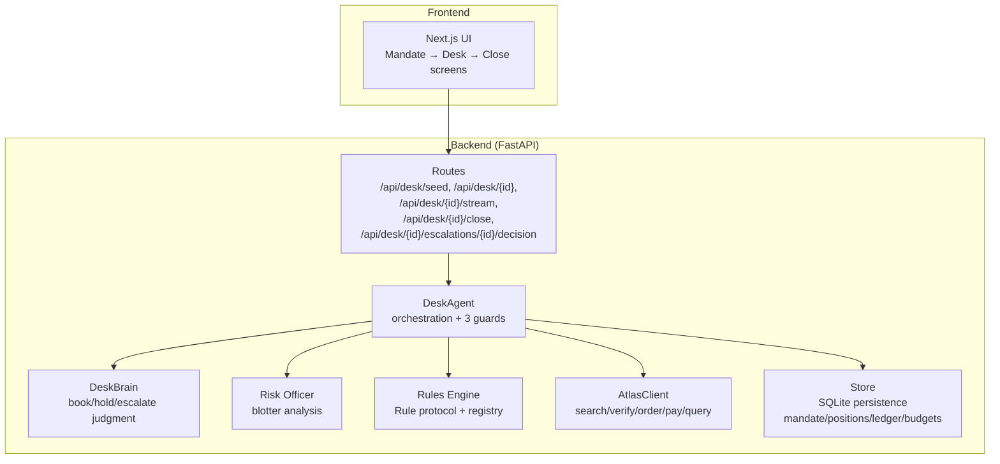
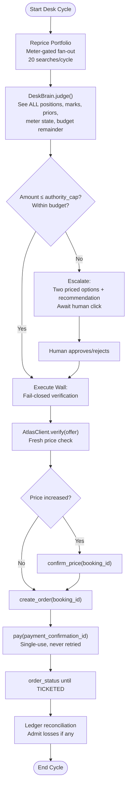
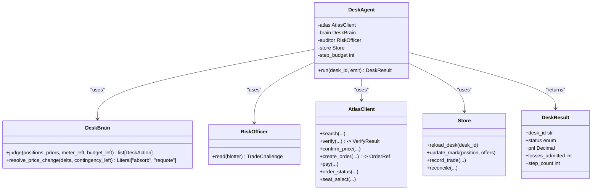
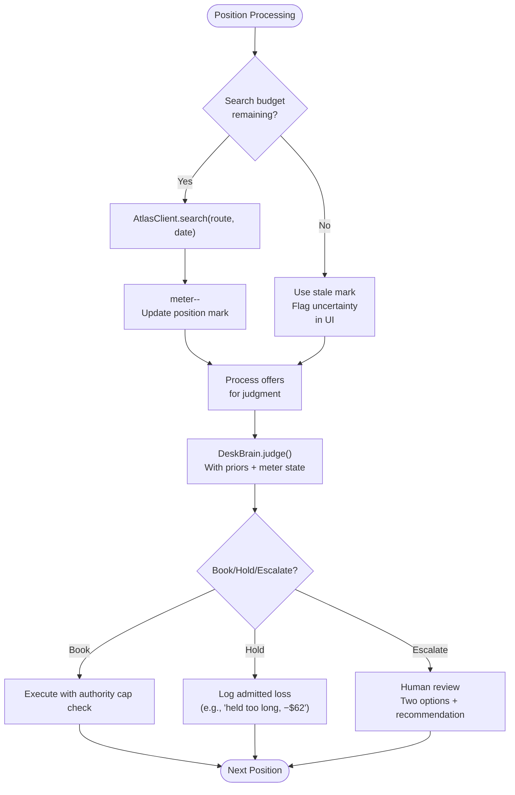
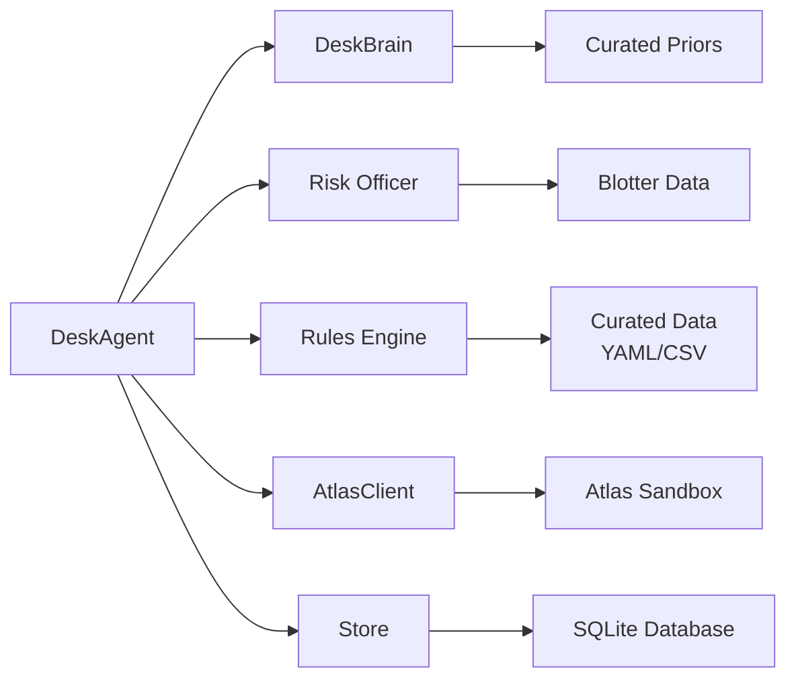

# Program Design

<cite>
**Referenced Files in This Document**
- [03-program-design.md](file://docs/plans/waypoint/03-program-design.md)
- [02-architecture.md](file://docs/plans/waypoint/02-architecture.md)
- [0003-advise-execute-two-gate-split.md](file://docs/adr/0003-advise-execute-two-gate-split.md)
- [0004-two-gates-and-curated-priors-applied-to-money.md](file://docs/adr/0004-two-gates-and-curated-priors-applied-to-money.md)
- [01-product.md](file://docs/plans/waypoint/01-product.md)
- [QODER-HANDOFF.md](file://docs/plans/waypoint/QODER-HANDOFF.md)
- [loop.py](file://backend/app/agent/loop.py)
- [models.py](file://backend/app/models.py)
- [fixture.py](file://backend/app/fixture.py)
- [routes.py](file://backend/app/api/routes.py)
</cite>

## Update Summary
**Changes Made**
- Updated core mental model from visa recovery to corporate travel treasury with money management
- Added curated volatility priors and search budget metering concepts
- Enhanced risk management with authority caps and sophisticated escalation mechanisms
- Expanded two-gates pattern application to financial operations
- Added new components: DeskBrain, Auditor, and enhanced Atlas write path
- Updated architecture to reflect first real database writes and settlement operations

## Table of Contents
1. [Introduction](#introduction)
2. [Project Structure](#project-structure)
3. [Core Components](#core-components)
4. [Architecture Overview](#architecture-overview)
5. [Detailed Component Analysis](#detailed-component-analysis)
6. [Dependency Analysis](#dependency-analysis)
7. [Performance Considerations](#performance-considerations)
8. [Troubleshooting Guide](#troubleshooting-guide)
9. [Conclusion](#conclusion)
10. [Appendices](#appendices)

## Introduction
This document describes the program design for Waypoint's evolution from visa-aware trip recovery to a corporate travel treasury system with sophisticated money management capabilities. The system applies the proven two-gates architecture to financial operations, combining open AI reasoning with fail-closed execution safety.

**Updated** The system now orchestrates portfolio-level discretionary timing calls over trips, managing book-now-vs-hold decisions with curated volatility priors, authority caps, and search budget metering while maintaining strict separation between advice and execution.

The core mental model extends ADR 0003's split to money: the desk brain sees every position (marks, priors, meter state, remaining budget, contingency) while deterministic code owns all mechanical settlement operations with re-checked authority caps after LLM picks.

**Section sources**
- [03-program-design.md:3-5](file://docs/plans/waypoint/03-program-design.md#L3-L5)
- [0004-two-gates-and-curated-priors-applied-to-money.md:6-17](file://docs/adr/0004-two-gates-and-curated-priors-applied-to-money.md#L6-L17)

## Project Structure
Waypoint has evolved into a dual-purpose system supporting both trip recovery and corporate travel treasury operations within one repository:

**Updated** The backend now hosts the desk loop, desk brain (judgment), Atlas write path, and first real database writes for mandate management, positions tracking, ledger accounting, and budget allocation.



**Diagram sources**
- [02-architecture.md:13-16](file://docs/plans/waypoint/02-architecture.md#L13-L16)
- [03-program-design.md:7-29](file://docs/plans/waypoint/03-program-design.md#L7-L29)

**Section sources**
- [02-architecture.md:3-16](file://docs/plans/waypoint/02-architecture.md#L3-L16)
- [02-architecture.md:13-16](file://docs/plans/waypoint/02-architecture.md#L13-L16)
- [03-program-design.md:7-29](file://docs/plans/waypoint/03-program-design.md#L7-L29)

## Core Components
**Updated** The system now includes enhanced components for money management alongside the original recovery agent:

- **DeskAgent**: Orchestrates desk cycles with three guards (step budget, re-read before write, assert outcome). Enforces execute wall for financial operations with authority cap checks.
- **DeskBrain**: Sees all positions, marks, priors, meter state, and budget; makes book/hold/escalate judgments with rationale; never executes directly.
- **Risk Officer (Auditor)**: Reads blotter to challenge trades during weekly close; provides compliance oversight.
- **Enhanced Rules Engine**: Protocol-based Rule interface returning 3-state verdicts with reason and provenance; now includes financial rules.
- **Expanded AtlasClient**: Wraps forked skill for search, verify, order creation, payment, seat selection, and order status retrieval with conditional confirm-price logic.
- **Database Store**: Typed persistence for mandate, positions, ledger entries, budgets, rule_verdicts, decisions, and orders.

Key types now include Mandate, Position, DeskAction, DeskResult, VerifyResult, and OrderRef that enforce the execute wall for financial operations.

**Section sources**
- [03-program-design.md:36-80](file://docs/plans/waypoint/03-program-design.md#L36-L80)
- [02-architecture.md:25-31](file://docs/plans/waypoint/02-architecture.md#L25-L31)

## Architecture Overview
**Updated** The system enforces clear separation between financial advice and execution with enhanced risk controls:

- **Advise gate**: Open to all positions; desk brain reasons over marks, priors, meter state, budget remainder, and contingency; narrates each book/hold call including losses.
- **Execute gate**: Fail-closed; deterministic code owns ledger arithmetic, authority-cap checks (re-checked after LLM picks), reconciliation math, and full Atlas write path. Over-cap picks escalate to human approval.

```mermaid
sequenceDiagram
participant User as "User"
participant API as "FastAPI Routes"
participant Agent as "DeskAgent"
participant Brain as "DeskBrain"
participant Rules as "Rules Engine"
participant Auditor as "Risk Officer"
participant Atlas as "AtlasClient"
participant Store as "Store"
User->>API : POST /api/desk/seed
API->>Agent : run(desk_id, emit)
Agent->>Store : reload_desk(desk_id)
loop For each position (meter-gated)
Agent->>Atlas : search(route, date)
Atlas-->>Agent : offers
Agent->>Store : update_mark(position, offers)
end
Agent->>Brain : judge(positions, priors, meter_left, budget_left)
Brain-->>Agent : actions [book/hold/escalate]
loop For each action
alt amount > authority_cap or over budget
Agent->>API : escalate(two options + recommendation)
API-->>Agent : human decision
else action.kind == "book"
Agent->>Atlas : verify(offer_id)
alt price increased
Agent->>Atlas : confirm_price(booking_id)
end
Agent->>Atlas : create_order(booking_id, pax)
Agent->>Atlas : pay(payment_confirmation_id)
Agent->>Atlas : order_status(order_no)
Agent->>Store : record_trade() ; reconcile
end
Agent-->>API : result (P&L, losses, step_count)
User->>API : GET /api/desk/{id}/close
API->>Auditor : read(blotter)
Auditor-->>API : one-line trade challenge
```

**Diagram sources**
- [03-program-design.md:82-111](file://docs/plans/waypoint/03-program-design.md#L82-L111)
- [02-architecture.md:33-41](file://docs/plans/waypoint/02-architecture.md#L33-L41)

## Detailed Component Analysis

### Two-Gate Split Applied to Money Management
**Updated** The two-gates pattern now governs financial operations with enhanced safeguards:

- **Advise gate**: The desk brain sees every position with marks, priors, meter state, remaining budget, and contingency. Qwen reasons over all of it and narrates each book/hold call — including the ones it lost ("held too long, −$62").
- **Execute gate**: Code executes only picks that pass: amount ≤ `authority_cap`, within remaining budget, offer freshly verified. Over-cap → escalate with two priced options + recommendation; nothing settles until the one human click. Code re-checks after the LLM picks; the AI never free-forms inside settlement.



**Diagram sources**
- [0004-two-gates-and-curated-priors-applied-to-money.md:12-17](file://docs/adr/0004-two-gates-and-curated-priors-applied-to-money.md#L12-L17)
- [03-program-design.md:3-5](file://docs/plans/waypoint/03-program-design.md#L3-L5)

**Section sources**
- [0004-two-gates-and-curated-priors-applied-to-money.md:12-17](file://docs/adr/0004-two-gates-and-curated-priors-applied-to-money.md#L12-L17)
- [03-program-design.md:3-5](file://docs/plans/waypoint/03-program-design.md#L3-L5)

### DeskAgent Orchestration with Enhanced Guards
**Updated** The DeskAgent now manages portfolio-level operations with sophisticated risk controls:

- **Entry point**: run(desk_id, emit) orchestrates the full desk cycle with mandate loading and portfolio processing.
- **Enhanced Guards**:
  - Step budget: bounded loop; exceed → give up and emit with P&L summary.
  - Re-read world: Store.reload_desk before acting to ensure fresh mandate, positions, and ledger data.
  - Assert outcome: Confirm ticket issued via order_status before marking positions booked.
  - Authority cap: Re-check after LLM picks; over-cap triggers escalation workflow.
- **Workflow**:
  - Load mandate and portfolio from database.
  - Meter-gated reprice fan-out: one search per position × candidate date.
  - DeskBrain judgment over all positions with curated priors.
  - Execute wall enforcement with authority cap and budget checks.
  - Conditional booking flow with price change handling.
  - Realized savings allocation to pre-order seat selection.
  - Ledger reconciliation and loss admission.



**Diagram sources**
- [03-program-design.md:60-80](file://docs/plans/waypoint/03-program-design.md#L60-L80)
- [03-program-design.md:82-111](file://docs/plans/waypoint/03-program-design.md#L82-L111)

**Section sources**
- [03-program-design.md:60-111](file://docs/plans/waypoint/03-program-design.md#L60-L111)

### Curated Volatility Priors and Search Budget Metering
**Updated** The system replaces fake ML predictions with honest curation and introduces sophisticated metering:

- **Curated per-route-type volatility priors** in fixture.py — disclosed approximation, the ADR 0002 precedent for honest curation with provenance. No model training, no scores dressed as predictions.
- **Live market microstructure** — bounded re-query fan-out: one `atlas-flight search` per date (no flex-date API exists; fan-out is agent-side), always shown on screen as *"re-read the world before every write"*.
- **Search-budget meter** — 20 searches/cycle, always visible. Exhausted → decisions run on **stale marks with disclosed uncertainty** (`mark` events flagged stale).



**Diagram sources**
- [03-program-design.md:31-34](file://docs/plans/waypoint/03-program-design.md#L31-L34)
- [02-architecture.md:33-37](file://docs/plans/waypoint/02-architecture.md#L33-L37)

**Section sources**
- [03-program-design.md:31-34](file://docs/plans/waypoint/03-program-design.md#L31-L34)
- [02-architecture.md:33-37](file://docs/plans/waypoint/02-architecture.md#L33-L37)

### Enhanced Atlas Integration and Settlement Flow
**Updated** The Atlas integration now supports sophisticated financial operations with conditional flows:

- **Search**: Returns candidate offers for portfolio positions with meter gating.
- **Verify**: Live re-read before booking to guard against stale prices/availability; returns price_change status and booking_id.
- **Conditional Confirm-Price**: Only executed when verify reports price increase; unchanged/decreased prices skip this step.
- **Create Order and Pay**: Deterministic steps with single-use confirmation IDs; sandbox auto-approve for demo.
- **Seat Selection**: Pre-order booking-stage operation funded by realized savings; degrades to ledger-only on SEAT_UNAVAILABLE.
- **Assert Outcome**: Query order details to confirm PNR and ticket issuance via order_status polling.

```mermaid
sequenceDiagram
participant Agent as "DeskAgent"
participant Atlas as "AtlasClient"
participant Store as "Store"
Agent->>Atlas : verify(chosen_offer)
Atlas-->>Agent : VerifyResult{price_change, booking_id}
alt price_change == "increased"
Agent->>Atlas : confirm_price(booking_id)
end
alt realized_savings AND seat_supported
Agent->>Atlas : seat_select(booking_id, traveler, segment, seat)
Note right of Agent : On SEAT_UNAVAILABLE : <br/>degrade to ledger-only alloc
end
Agent->>Atlas : create_order(booking_id, pax_json)
Atlas-->>Agent : OrderRef{payment_confirmation_id, order_no}
Agent->>Atlas : pay(payment_confirmation_id)
Note right of Agent : Single-use ID from create_order response<br/>NEVER retried
end
Agent->>Atlas : order_status(order_no)
Atlas-->>Agent : OrderStatus{TICKETED}
Agent->>Store : record_trade(); reconcile()
Agent-->>Agent : Emit P&L, losses admitted
```

**Diagram sources**
- [03-program-design.md:96-108](file://docs/plans/waypoint/03-program-design.md#L96-L108)
- [02-architecture.md:38-41](file://docs/plans/waypoint/02-architecture.md#L38-L41)

**Section sources**
- [03-program-design.md:96-108](file://docs/plans/waypoint/03-program-design.md#L96-L108)
- [02-architecture.md:38-41](file://docs/plans/waypoint/02-architecture.md#L38-L41)

### Database Schema and Audit Trail
**Updated** First real database writes provide comprehensive audit trail for financial operations:

- **Tables**: mandate, positions, ledger, budgets, plus existing rule_verdicts, decisions, and orders.
- **Purpose**: Persist mandate constraints, position tracking, complete transaction history, and budget allocation to provide comprehensive audit trail of agent reasoning and outcomes.
- **Queries**: Seed mandate and portfolio; update position marks; record trades, allocations, reconciliations, and losses; track budget consumption.

**Section sources**
- [02-architecture.md:25-31](file://docs/plans/waypoint/02-architecture.md#L25-L31)

### Risk Officer and Weekly Close
**Updated** New auditor component provides compliance oversight:

- **Risk Officer (Auditor)**: Reads blotter during weekly close to challenge one trade; generates compliance narrative.
- **Weekly Close**: Aggregates P&L, admitted losses, and risk-officer assessment for compliance reporting.
- **Blotter Analysis**: Automated review of trading patterns and policy adherence.

**Section sources**
- [03-program-design.md:109-111](file://docs/plans/waypoint/03-program-design.md#L109-L111)
- [02-architecture.md:22-23](file://docs/plans/waypoint/02-architecture.md#L22-L23)

## Dependency Analysis
**Updated** Dependencies now include financial management components:

- **Coupling**:
  - DeskAgent depends on AtlasClient, DeskBrain, Risk Officer, Rules Engine, and Store.
  - DeskBrain depends on curated priors and position data for judgment.
  - Risk Officer depends on blotter data for compliance analysis.
  - Rules Engine depends on curated data loaders and data files.
  - AtlasClient wraps external service interactions with enhanced write path.
- **External dependencies**:
  - Atlas sandbox via forked skill (auth/keyring, env config, typed models).
  - Qwen via DashScope (LLM for judgment and narration).
  - SQLite for first real database writes.
- **Contracts**:
  - Rule protocol defines check signature and verdict shape.
  - DeskAction.enforce_authority_cap ensures execute wall.
  - VerifyResult.price_change drives conditional booking flow.



**Diagram sources**
- [03-program-design.md:7-29](file://docs/plans/waypoint/03-program-design.md#L7-L29)
- [02-architecture.md:13-16](file://docs/plans/waypoint/02-architecture.md#L13-L16)

**Section sources**
- [03-program-design.md:7-29](file://docs/plans/waypoint/03-program-design.md#L7-L29)
- [02-architecture.md:13-16](file://docs/plans/waypoint/02-architecture.md#L13-L16)

## Performance Considerations
**Updated** Performance considerations now include financial operations:

- **Bounded loops**: Step budget prevents runaway processing; ensures responsiveness across portfolio operations.
- **Meter-gated fan-out**: 20 searches/cycle limit prevents excessive Atlas API usage; stale marks handled gracefully.
- **Minimal AI usage**: Only judgment uses LLM; deterministic steps (rules, math, booking) avoid unnecessary latency.
- **Conditional operations**: Confirm-price only on price increases; seat selection only when savings available.
- **Data freshness**: Curated data freshness windows reduce uncertainty and prevent costly mistakes from stale entries.
- **Database efficiency**: First real writes optimized for audit trail without impacting performance.

## Troubleshooting Guide
**Updated** Common failure modes now include financial operations:

- **Budget exceeded**: All positions blocked by authority cap → return budget_exhausted; inspect ledger for spending patterns.
- **Authority cap violation**: Pick above cap → require human approval; review escalation options and rationale.
- **Stale data**: Past freshness window → unknown → fail-closed; update curated data or adjust thresholds.
- **Ticket assertion failed**: Order created but no ticket → do not mark booked; investigate Atlas response.
- **Step budget exceeded**: Loop stopped early; increase budget or optimize search/rules.
- **Price change handling**: PRICE_CHANGED → absorb-from-contingency vs re-quote; never create second order.
- **Seat selection failures**: SEAT_UNAVAILABLE → degrade to ledger-only allocation; continue with order creation.

**Section sources**
- [03-program-design.md:113-131](file://docs/plans/waypoint/03-program-design.md#L113-L131)
- [02-architecture.md:70-78](file://docs/plans/waypoint/02-architecture.md#L70-L78)

## Conclusion
**Updated** Waypoint's program design successfully extends the two-gates architecture from visa recovery to corporate travel treasury:

- **Advise gate**: Open reasoning over all positions with transparent labeling, curated priors, and comprehensive narration including admitted losses.
- **Execute gate**: Fail-closed enforcement ensuring only fully allowed offers within authority caps are auto-booked, with sophisticated escalation mechanisms.
- **Enhanced Risk Management**: Authority caps, search budget metering, and curated volatility priors provide robust financial controls.
- **First Real Database Writes**: Comprehensive audit trail through mandate, positions, ledger, and budgets tables.

The DeskAgent orchestrates discovery, validation, judgment, and booking with strong guards, while the desk brain and curated data provide sophisticated financial intelligence. This design balances agentic flexibility with deterministic safety, delivering reliable portfolio management under real-world constraints.

## Appendices

### Configuration Options and Parameters
**Updated** Configuration now includes financial management parameters:

- **Environment**:
  - DASHSCOPE_API_KEY: Qwen access key.
  - WAYPOINT_PUBLIC_URL: Public URL for Atlas webhook callback.
  - Atlas sandbox credentials via OS keyring; env configured for sandbox mode.
- **Financial Parameters**:
  - authority_cap: Maximum single transaction amount
  - budget_total: Total portfolio budget
  - contingency_pct: Contingency fund percentage
  - search_meter_limit: 20 searches per cycle
- **Data files**:
  - Curated volatility priors per route type in fixture.py
  - IATA mappings for geography
  - Seeded portfolio data for demo scenarios
- **Agent parameters**:
  - step_budget: Controls maximum loop iterations
  - mandate configuration for authority limits

**Section sources**
- [02-architecture.md:92-95](file://docs/plans/waypoint/02-architecture.md#L92-L95)
- [03-program-design.md:31-34](file://docs/plans/waypoint/03-program-design.md#L31-L34)

### Key Function Signatures and Return Values
**Updated** Enhanced function signatures for financial operations:

- **DeskAgent.run(desk_id, emit) -> DeskResult**
  - Returns status: closed | escalated | budget_exhausted | failed
  - Includes P&L, losses admitted count, step count
- **DeskBrain.judge(positions, priors, meter_left, budget_left) -> list[DeskAction]**
  - Returns book/hold/escalate actions with rationale
  - Enforces authority cap and budget constraints
- **DeskBrain.resolve_price_change(delta, contingency_left) -> Literal["absorb", "requote"]**
  - Handles PRICE_CHANGED events without creating second orders
- **AtlasClient.verify(offer_id) -> VerifyResult**
  - Returns price_change status, booking_id, and support flags
- **AtlasClient.create_order(booking_id, pax_json) -> OrderRef**
  - Returns payment_confirmation_id and order_no (single-use)
- **RiskOfficer.read(blotter) -> TradeChallenge**
  - Generates compliance narrative for weekly close

**Section sources**
- [03-program-design.md:60-80](file://docs/plans/waypoint/03-program-design.md#L60-L80)

### Call Stack Summary
**Updated** Enhanced call stack for desk cycles:

- **POST /api/desk/seed**
  - DeskAgent.run(desk_id, emit)
    - Store.reload_desk(desk_id)
    - For each position (meter-gated):
      - AtlasClient.search(route, date) -> offers
      - Store.update_mark(position, offers)
    - DeskBrain.judge(positions, priors, meter_left, budget_left) -> actions
    - For each action:
      - Authority cap check -> escalate if over cap
      - If book: verify -> [conditional confirm-price] -> create_order -> pay -> order_status
      - Realized savings allocation -> seat_select (if supported)
      - Store.record_trade(); reconcile()
    - Emit result (P&L, losses, step_count)
- **GET /api/desk/{id}/close**
  - Auditor.read(blotter) -> trade challenge

**Section sources**
- [03-program-design.md:82-111](file://docs/plans/waypoint/03-program-design.md#L82-L111)