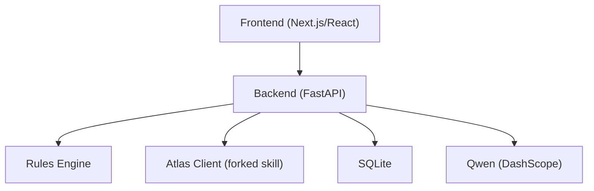
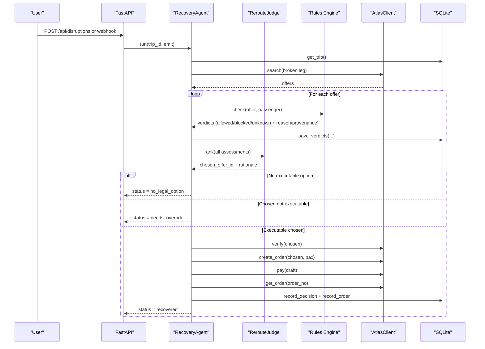
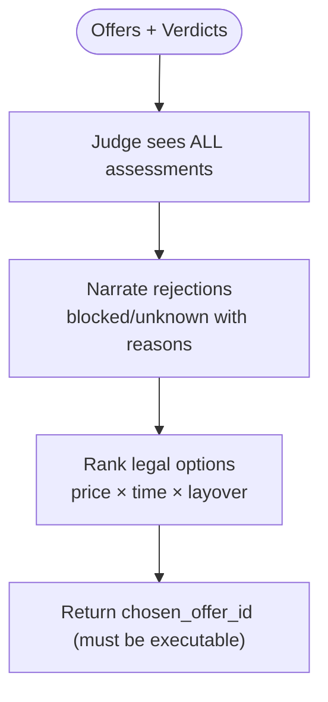
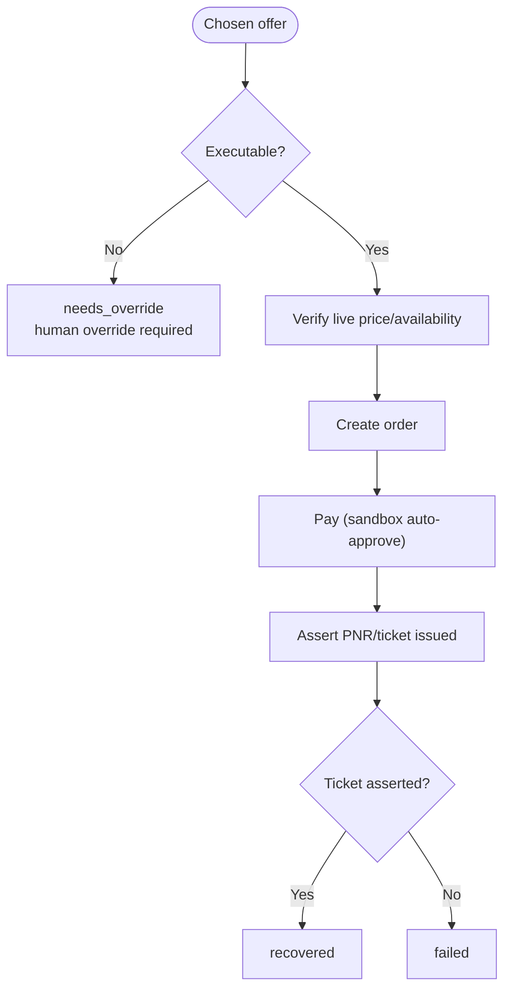
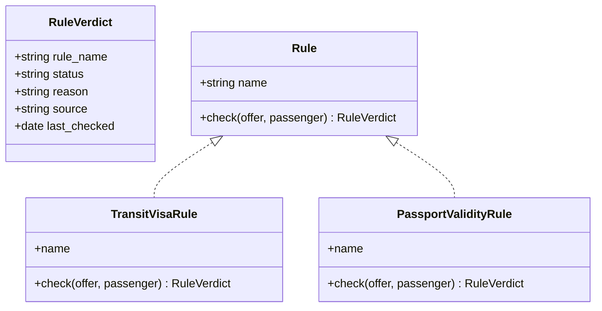
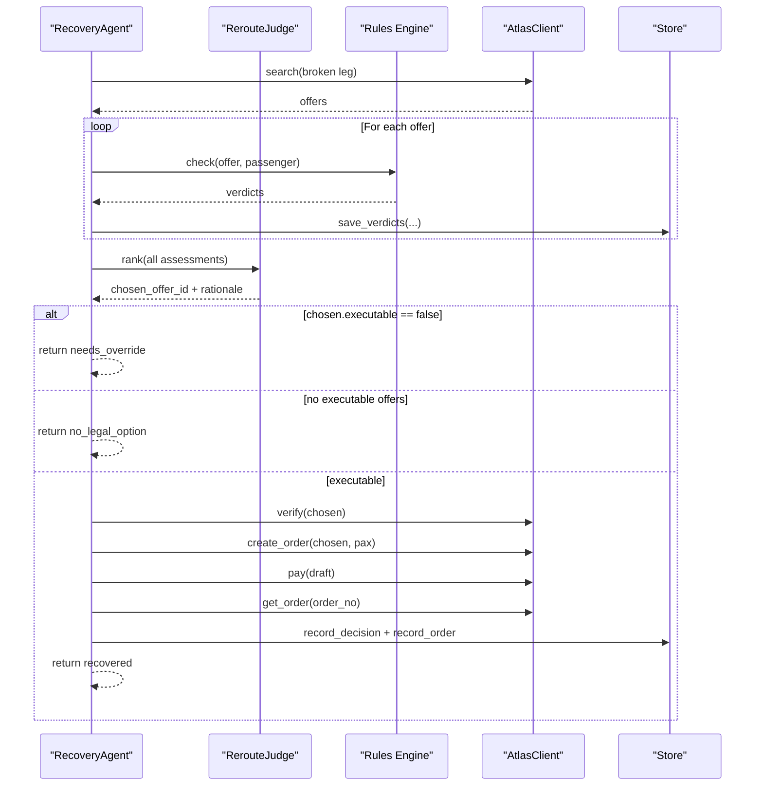
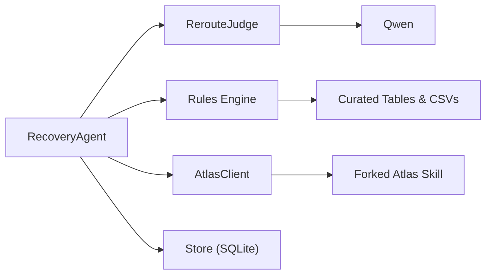

# Two-Gate Architecture

<cite>
**Referenced Files in This Document**
- [0003-advise-execute-two-gate-split.md](file://docs/adr/0003-advise-execute-two-gate-split.md)
- [02-architecture.md](file://docs/plans/waypoint/02-architecture.md)
- [03-program-design.md](file://docs/plans/waypoint/03-program-design.md)
- [0001-fork-atlas-skill-sandbox-auto-approve.md](file://docs/adr/0001-fork-atlas-skill-sandbox-auto-approve.md)
- [0002-visa-rules-curated-approximation.md](file://docs/adr/0002-visa-rules-curated-approximation.md)
- [SKILL.md](file://.agents/skills/atlas-flight-booking/SKILL.md)
</cite>

## Table of Contents
1. [Introduction](#introduction)
2. [Project Structure](#project-structure)
3. [Core Components](#core-components)
4. [Architecture Overview](#architecture-overview)
5. [Detailed Component Analysis](#detailed-component-analysis)
6. [Dependency Analysis](#dependency-analysis)
7. [Performance Considerations](#performance-considerations)
8. [Troubleshooting Guide](#troubleshooting-guide)
9. [Conclusion](#conclusion)

## Introduction
This document explains the two-gate architecture that is the core mental model for Waypoint’s recovery agent. It clarifies how the system separates “advice” from “execution”:

- Advise gate: open and transparent. The AI sees every candidate offer, each labeled allowed, blocked, or unknown by the rules engine with reasons and provenance. The AI narrates why it rejects risky or illegal options.
- Execute gate: walled and fail-closed. Only offers where every rule is allowed are auto-booked and auto-settled. Blocked or unknown requires explicit human override; code enforces this boundary so the LLM cannot cross into execution territory.

This design resolves the tension between “AI advises freely” and “rules are an absolute wall” by splitting responsibilities across gates rather than forcing a single rigid filter.

**Section sources**
- [0003-advise-execute-two-gate-split.md:1-19](file://docs/adr/0003-advise-execute-two-gate-split.md#L1-L19)
- [03-program-design.md:3-8](file://docs/plans/waypoint/03-program-design.md#L3-L8)

## Project Structure
Waypoint is organized as a new app with two halves in one repository:

- Frontend (Next.js/React): three demo screens plus a live agent-reasoning stream via SSE.
- Backend (Python FastAPI): hosts the recovery agent loop, rules engine, Atlas integration, Qwen calls, and SQLite persistence.
- Atlas integration: a forked skill used as an imported library to reuse auth/keyring, env config, and typed models. The fork adds sandbox-only auto-approval at price/payment checkpoints.
- Rules engine: pluggable Rule interface with v1 rules for transit visa and passport validity. Data-backed using curated tables and CSV matrices.

**Diagram sources**
- [02-architecture.md:3-11](file://docs/plans/waypoint/02-architecture.md#L3-L11)

**Section sources**
- [02-architecture.md:3-11](file://docs/plans/waypoint/02-architecture.md#L3-L11)

## Core Components
The two-gate split centers on these components:

- RecoveryAgent: orchestrates the recovery loop, applies guards (step budget, re-read/verify, assert outcome), and enforces the execute wall.
- RerouteJudge: uses the LLM to rank legal options under price/time/layover and narrates rejected options. It sees all assessments but must pick only executable ones.
- Rules Engine: evaluates each offer against active rules and returns a three-state verdict per rule (allowed/blocked/unknown) with reason and provenance.
- AtlasClient: wraps the forked skill to search, verify, order, pay (sandbox auto-approve), and assert outcomes.

Key data structures include Offer, Layover, OfferAssessment (with executable flag), RuleVerdict, RankedDecision, and RecoveryResult.

**Section sources**
- [03-program-design.md:57-123](file://docs/plans/waypoint/03-program-design.md#L57-L123)

## Architecture Overview
The end-to-end flow demonstrates how the two gates operate without contradiction:

**Diagram sources**
- [02-architecture.md:34-49](file://docs/plans/waypoint/02-architecture.md#L34-L49)
- [03-program-design.md:125-149](file://docs/plans/waypoint/03-program-design.md#L125-L149)

**Section sources**
- [02-architecture.md:34-49](file://docs/plans/waypoint/02-architecture.md#L34-L49)
- [03-program-design.md:125-149](file://docs/plans/waypoint/03-program-design.md#L125-L149)

## Detailed Component Analysis

### Advise Gate: Open Reasoning with Full Visibility
- The judge sees every assessment (including blocked and unknown) and produces a ranked decision with a written rationale that explicitly narrates why cheaper or riskier options were rejected.
- Each offer carries rule verdicts with reasons and provenance, enabling transparent UI rendering and auditability.
- The UI renders labels (✅ allowed, ⛔ blocked, ⚠️ unknown) and displays the AI’s narration over rejected options.

**Diagram sources**
- [03-program-design.md:97-104](file://docs/plans/waypoint/03-program-design.md#L97-L104)
- [03-program-design.md:136-138](file://docs/plans/waypoint/03-program-design.md#L136-L138)

**Section sources**
- [03-program-design.md:97-104](file://docs/plans/waypoint/03-program-design.md#L97-L104)
- [03-program-design.md:136-138](file://docs/plans/waypoint/03-program-design.md#L136-L138)

### Execute Gate: Fail-Closed Enforcement
- Auto-booking and auto-settlement occur only when every rule verdict is allowed. Any blocked or unknown blocks autonomous execution and requires explicit human override.
- Code re-checks executability after the LLM picks, ensuring the LLM cannot bypass the wall.
- Guards ensure correctness: step budget limits loops, re-read before write via Atlas verify, and assertion of real ticketing outcome before marking success.

**Diagram sources**
- [03-program-design.md:139-147](file://docs/plans/waypoint/03-program-design.md#L139-L147)

**Section sources**
- [03-program-design.md:139-147](file://docs/plans/waypoint/03-program-design.md#L139-L147)

### Rules Engine: Three-State Verdicts with Provenance
- Each rule returns a three-state verdict (allowed/blocked/unknown) with reason and provenance fields.
- Curated transit-visa rules use a freshness window; past the window, cells become unknown and block autonomous execution.
- Passport validity rules enforce expiry constraints.

**Diagram sources**
- [03-program-design.md:59-95](file://docs/plans/waypoint/03-program-design.md#L59-L95)
- [0002-visa-rules-curated-approximation.md:9-18](file://docs/adr/0002-visa-rules-curated-approximation.md#L9-L18)

**Section sources**
- [03-program-design.md:59-95](file://docs/plans/waypoint/03-program-design.md#L59-L95)
- [0002-visa-rules-curated-approximation.md:9-18](file://docs/adr/0002-visa-rules-curated-approximation.md#L9-L18)

### RecoveryAgent: Enforcing Boundaries and Preventing LLM Execution
- The agent orchestrates the full recovery loop, emitting steps to the SSE stream and enforcing the execute wall.
- It ensures the LLM never selects a non-executable offer for booking; if the chosen offer is not executable, the agent returns needs_override instead of proceeding.
- If no executable option exists, it gracefully gives up with no_legal_option.

**Diagram sources**
- [03-program-design.md:106-123](file://docs/plans/waypoint/03-program-design.md#L106-L123)
- [03-program-design.md:125-149](file://docs/plans/waypoint/03-program-design.md#L125-L149)

**Section sources**
- [03-program-design.md:106-123](file://docs/plans/waypoint/03-program-design.md#L106-L123)
- [03-program-design.md:125-149](file://docs/plans/waypoint/03-program-design.md#L125-L149)

### Concrete Examples: How the Gates Work Together
- Example scenario: The cheapest offer transits through a hub where airside transit is not permitted for the passenger’s nationality. The rules engine marks it blocked with a reason and provenance. The judge narrates the rejection and ranks the next best legal option. The execute gate prevents auto-booking the blocked offer; only the all-allowed option proceeds to verification and booking.
- Freshness window example: A curated cell older than its freshness window becomes unknown, blocking autonomous execution and requiring human override. This makes stale-data risk visible and safe.

These examples align with the test plan assertions that the agent picks the cheapest executable offer, records the rejected cheapest, and refuses to book non-executable options.

**Section sources**
- [03-program-design.md:151-166](file://docs/plans/waypoint/03-program-design.md#L151-L166)
- [0002-visa-rules-curated-approximation.md:9-18](file://docs/adr/0002-visa-rules-curated-approximation.md#L9-L18)

### Security Implications of the Two-Gate Design
- Separation of concerns: Advice is soft and open; execution is hard and conservative. This avoids conflating reasoning with action.
- Fail-closed safety: Autonomous actions require all rules to be allowed. Unknown or blocked options cannot be executed without explicit human override.
- Deterministic execution: Payment and settlement are deterministic and sandbox-bound for auto-approval; the LLM does not decide funds-related actions.
- Auditability: Every rule check is persisted with reasons and provenance, supporting compliance and post-incident review.
- Staleness handling: Curated data freshness windows prevent reliance on outdated information; unknown defaults to blocked for execution.

**Section sources**
- [0003-advise-execute-two-gate-split.md:10-18](file://docs/adr/0003-advise-execute-two-gate-split.md#L10-L18)
- [0001-fork-atlas-skill-sandbox-auto-approve.md:11-20](file://docs/adr/0001-fork-atlas-skill-sandbox-auto-approve.md#L11-L20)
- [0002-visa-rules-curated-approximation.md:9-18](file://docs/adr/0002-visa-rules-curated-approximation.md#L9-L18)

## Dependency Analysis
High-level dependencies among components:

**Diagram sources**
- [03-program-design.md:106-123](file://docs/plans/waypoint/03-program-design.md#L106-L123)
- [02-architecture.md:3-11](file://docs/plans/waypoint/02-architecture.md#L3-L11)

**Section sources**
- [03-program-design.md:106-123](file://docs/plans/waypoint/03-program-design.md#L106-L123)
- [02-architecture.md:3-11](file://docs/plans/waypoint/02-architecture.md#L3-L11)

## Performance Considerations
- Step budget: The agent loop is bounded to avoid runaway behavior and to keep latency predictable.
- Re-read before write: Live verification via Atlas before booking reduces staleness risk and improves reliability.
- Rule evaluation: Running rules per offer scales linearly with number of offers and rules; caching rule definitions and minimizing I/O during checks can help.
- SSE streaming: Emitting steps incrementally keeps the frontend responsive while the backend performs multi-step recovery.

[No sources needed since this section provides general guidance]

## Troubleshooting Guide
Common issues and how the design addresses them:

- No legal option found: The agent returns no_legal_option and surfaces why, preventing silent failures.
- Non-executable chosen offer: The agent returns needs_override; the LLM cannot force execution.
- Stale data: Freshness windows convert old cells to unknown, blocking autonomous execution until refreshed or overridden.
- Payment uncertainty: The agent asserts real outcomes (PNR/ticket) before marking success; otherwise it reports failure or pending states.

Operational tips:
- Ensure curated hubs and nationalities are present and fresh for demo scenarios.
- Confirm sandbox environment for auto-approval; production retains human checkpoints.
- Use the stored rule_verdicts and decisions for post-mortem analysis and compliance.

**Section sources**
- [03-program-design.md:151-166](file://docs/plans/waypoint/03-program-design.md#L151-L166)
- [0001-fork-atlas-skill-sandbox-auto-approve.md:11-20](file://docs/adr/0001-fork-atlas-skill-sandbox-auto-approve.md#L11-L20)
- [0002-visa-rules-curated-approximation.md:9-18](file://docs/adr/0002-visa-rules-curated-approximation.md#L9-L18)

## Conclusion
The two-gate architecture cleanly separates advice from execution, allowing the AI to reason openly about all options while enforcing a strict, fail-closed boundary around autonomous actions. This design:

- Preserves transparency and rich narration in the advise gate.
- Guarantees safety and compliance in the execute gate.
- Provides clear audit trails and robust error handling.
- Enables a compelling demo story where the agent autonomously settles fare differences only for fully legal options.

By keeping AI out of deterministic execution and placing judgment where it adds value, Waypoint achieves both safety and effectiveness.

[No sources needed since this section summarizes without analyzing specific files]