# Waybot Overview

<cite>
**Referenced Files in This Document**
- [README.md](file://README.md)
- [backend/app/main.py](file://backend/app/main.py)
- [backend/app/config.py](file://backend/app/config.py)
- [backend/app/models.py](file://backend/app/models.py)
- [backend/app/api/routes.py](file://backend/app/api/routes.py)
- [backend/app/agent/brain.py](file://backend/app/agent/brain.py)
- [backend/app/agent/loop.py](file://backend/app/agent/loop.py)
- [backend/app/atlas/client.py](file://backend/app/atlas/client.py)
- [backend/app/db/database.py](file://backend/app/db/database.py)
- [backend/app/events.py](file://backend/app/events.py)
- [backend/app/bot/__init__.py](file://backend/app/bot/__init__.py)
- [backend/app/bot/handlers.py](file://backend/app/bot/handlers.py)
- [backend/app/bot/notify.py](file://backend/app/bot/notify.py)
- [backend/app/bot/session.py](file://backend/app/bot/session.py)
- [backend/app/bot/mrz.py](file://backend/app/bot/mrz.py)
- [backend/app/bot/extract.py](file://backend/app/bot/extract.py)
- [frontend/app/page.tsx](file://frontend/app/page.tsx)
- [frontend/lib/api.ts](file://frontend/lib/api.ts)
- [backend/tests/test_waybot.py](file://backend/tests/test_waybot.py)
- [docs/plans/waypoint/02-architecture.md](file://docs/plans/waypoint/02-architecture.md)
</cite>

## Update Summary
**Changes Made**
- Added comprehensive documentation for enhanced Waybot Telegram bot integration with complete group trip workflow
- Documented new `/api/waybot` endpoint for dynamic bot username discovery and share link generation
- Enhanced `/api/desk/{id}/confirm` endpoint with rate limiting, TTL validation, and security guards
- Added detailed `/api/desk/{id}/approve` endpoint for manager approval workflows with role separation
- Documented complete passport MRZ capture flow with photo-based extraction and typed-entry fallback
- Added comprehensive manager approval workflow documentation with inline keyboard buttons
- Updated architecture diagrams to include bot components, session management, and event-driven notifications

## Table of Contents
1. Introduction
2. Project Structure
3. Core Components
4. Architecture Overview
5. Detailed Component Analysis
6. Dependency Analysis
7. Performance Considerations
8. Troubleshooting Guide
9. Conclusion
10. Appendices

## Introduction
Waypoint is an autonomous corporate-travel treasury desk that monitors a portfolio of booked travel positions and acts when disruptions or fare moves occur. It separates judgment (LLM-based advise gate) from execution (deterministic code with strict authority, budget, and ticketing checks). The system integrates with the Atlas flight booking CLI for live sandbox operations, persists all activity to SQLite, streams lifecycle events to a Next.js frontend, and provides comprehensive Telegram bot integration for traveler data collection and manager approvals.

Key safety model highlights:
- Two gates: open advise gate (LLM) vs walled execute gate (deterministic re-checks).
- Two runtime gates on real money: human switch and live ticketing probe; otherwise comparison mode logs decisions without writes.
- Three guards: bounded search meter, fresh offer verify before writes, and ticketed assertion before marking positions as booked.
- Contract discipline: branch on envelope codes, never messages; writes are not retried; read-only calls get at most one retry when allowed.
- **Enhanced Bot Integration**: Complete group trip workflow from invite gates to manager approvals, including dynamic username discovery, secure deep-link handlers, photo-based passport extraction with MRZ validation, typed-entry fallback, and manager approval workflows with comprehensive security guards.

**Section sources**
- [README.md:1-31](file://README.md#L1-L31)
- [docs/plans/waypoint/02-architecture.md:1-12](file://docs/plans/waypoint/02-architecture.md#L1-L12)

## Project Structure
The repository is organized into backend (FastAPI), frontend (Next.js), documentation, and pinned skill references. The enhanced Waybot integration adds a sophisticated Telegram bot layer for complete group trip management, from initial invite distribution through passport verification to manager approvals and booking confirmation.

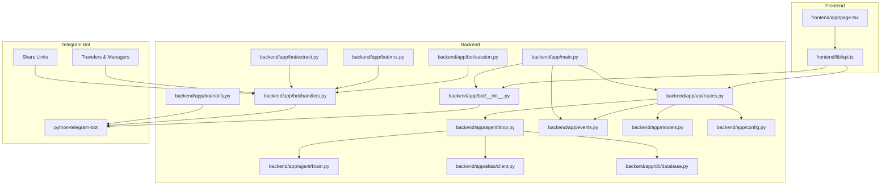

**Diagram sources**
- [backend/app/main.py:122-168](file://backend/app/main.py#L122-L168)
- [backend/app/api/routes.py:14-244](file://backend/app/api/routes.py#L14-L244)
- [backend/app/agent/loop.py:178-751](file://backend/app/agent/loop.py#L178-L751)
- [backend/app/agent/brain.py:85-103](file://backend/app/agent/brain.py#L85-L103)
- [backend/app/atlas/client.py:202-219](file://backend/app/atlas/client.py#L202-L219)
- [backend/app/db/database.py:105-151](file://backend/app/db/database.py#L105-L151)
- [backend/app/events.py:48-111](file://backend/app/events.py#L48-L111)
- [backend/app/models.py:1-244](file://backend/app/models.py#L1-L244)
- [backend/app/config.py:1-31](file://backend/app/config.py#L1-L31)
- [backend/app/bot/__init__.py:1-86](file://backend/app/bot/__init__.py#L1-L86)
- [backend/app/bot/handlers.py:1-602](file://backend/app/bot/handlers.py#L1-L602)
- [backend/app/bot/notify.py:1-165](file://backend/app/bot/notify.py#L1-L165)
- [backend/app/bot/session.py:1-62](file://backend/app/bot/session.py#L1-L62)
- [backend/app/bot/mrz.py:1-491](file://backend/app/bot/mrz.py#L1-L491)
- [backend/app/bot/extract.py:1-100](file://backend/app/bot/extract.py#L1-L100)
- [frontend/app/page.tsx:1-352](file://frontend/app/page.tsx#L1-L352)
- [frontend/lib/api.ts:1-201](file://frontend/lib/api.ts#L1-L201)

**Section sources**
- [README.md:32-41](file://README.md#L32-L41)
- [docs/plans/waypoint/02-architecture.md:13-31](file://docs/plans/waypoint/02-architecture.md#L13-L31)

## Core Components
- FastAPI application and lifespan wiring: initializes DB, optional Telegram bot with supervised restarts and backoff, CORS, and includes API router.
- API routes: seed desk, confirm release, approve pre-trip, stream SSE, snapshot state, weekly close, escalation decision, and **new `/api/waybot` endpoint for dynamic bot discovery**.
- DeskAgent orchestration loop: re-read world, repricing fan-out, brain judgment, execute wall, write path, settle ledger, result.
- DeskBrain (advise gate): batched LLM call with deterministic fallback; pure helpers for price change resolution and admitted loss detection.
- AtlasClient: subprocess wrapper around atlas-flight CLI; read/write paths with strict retry rules and typed errors.
- Database: SQLite schema initialization, backfills, safe drop-and-recreate guard for demo data.
- Events: in-process pub/sub sink for domain events (travelers_complete, pending_approval, ticketed, etc.).
- Models: shared Pydantic types for mandate, positions, budgets, actions, results, and Atlas envelopes.
- Config: tolerant environment variable parsing with minimum guards to prevent misconfiguration DoS.
- **Enhanced Waybot Integration**: Complete group trip workflow including dynamic username management, secure deep-link handlers, photo-based passport extraction with MRZ validation, typed-entry fallback, manager approval workflows with inline keyboards, and comprehensive security guards with role separation.

**Section sources**
- [backend/app/main.py:122-168](file://backend/app/main.py#L122-L168)
- [backend/app/api/routes.py:371-819](file://backend/app/api/routes.py#L371-L819)
- [backend/app/agent/loop.py:178-751](file://backend/app/agent/loop.py#L178-L751)
- [backend/app/agent/brain.py:85-143](file://backend/app/agent/brain.py#L85-L143)
- [backend/app/atlas/client.py:202-556](file://backend/app/atlas/client.py#L202-L556)
- [backend/app/db/database.py:105-151](file://backend/app/db/database.py#L105-L151)
- [backend/app/events.py:48-111](file://backend/app/events.py#L48-L111)
- [backend/app/models.py:1-244](file://backend/app/models.py#L1-L244)
- [backend/app/config.py:17-31](file://backend/app/config.py#L17-L31)
- [backend/app/bot/__init__.py:1-86](file://backend/app/bot/__init__.py#L1-L86)
- [backend/app/bot/handlers.py:1-602](file://backend/app/bot/handlers.py#L1-L602)
- [backend/app/bot/notify.py:1-165](file://backend/app/bot/notify.py#L1-L165)
- [backend/app/bot/session.py:1-62](file://backend/app/bot/session.py#L1-L62)
- [backend/app/bot/mrz.py:1-491](file://backend/app/bot/mrz.py#L1-L491)
- [backend/app/bot/extract.py:1-100](file://backend/app/bot/extract.py#L1-L100)

## Architecture Overview
High-level flow: Frontend seeds a desk and subscribes to SSE; backend orchestrates cycles via DeskAgent, uses DeskBrain for advice, enforces deterministic execution, interacts with Atlas for pricing and bookings, persists evidence to SQLite, emits events through the event sink, and manages comprehensive Telegram bot integration for complete group trip management from invite distribution through manager approvals.

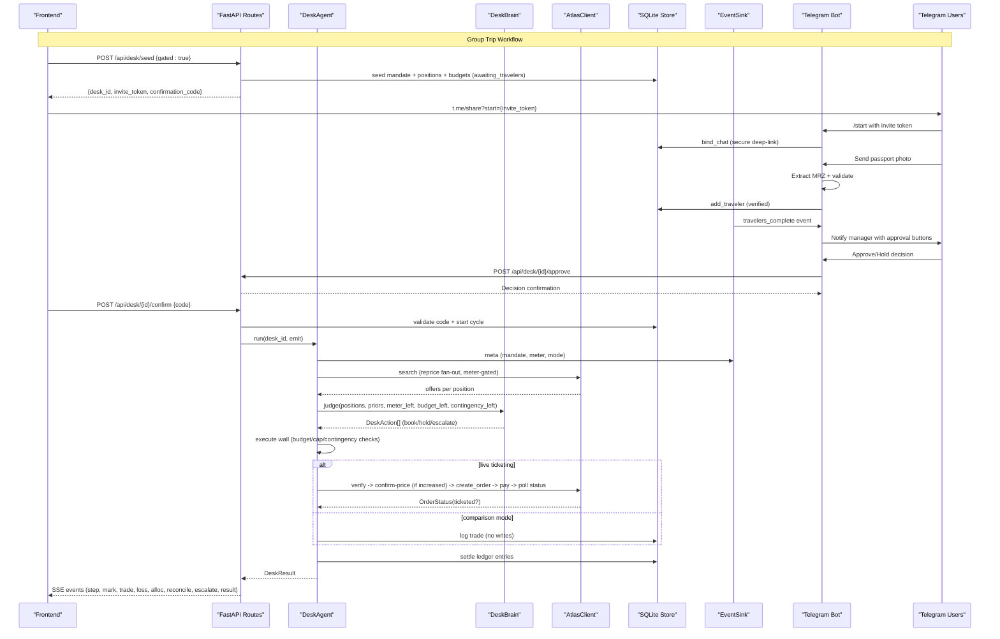

**Diagram sources**
- [backend/app/api/routes.py:371-430](file://backend/app/api/routes.py#L371-L430)
- [backend/app/api/routes.py:521-606](file://backend/app/api/routes.py#L521-L606)
- [backend/app/api/routes.py:609-695](file://backend/app/api/routes.py#L609-L695)
- [backend/app/agent/loop.py:178-751](file://backend/app/agent/loop.py#L178-L751)
- [backend/app/agent/brain.py:108-143](file://backend/app/agent/brain.py#L108-L143)
- [backend/app/atlas/client.py:261-556](file://backend/app/atlas/client.py#L261-L556)
- [backend/app/events.py:67-102](file://backend/app/events.py#L67-L102)
- [backend/app/bot/handlers.py:92-132](file://backend/app/bot/handlers.py#L92-L132)
- [backend/app/bot/handlers.py:139-234](file://backend/app/bot/handlers.py#L139-L234)
- [backend/app/bot/handlers.py:312-402](file://backend/app/bot/handlers.py#L312-L402)
- [backend/app/bot/notify.py:47-78](file://backend/app/bot/notify.py#L47-L78)
- [backend/app/bot/notify.py:108-165](file://backend/app/bot/notify.py#L108-L165)

## Detailed Component Analysis

### FastAPI Application and Lifespan
- Initializes DB tables on startup, optionally wires a Telegram bot with supervised restarts and backoff, configures CORS origins via environment, and includes the API router.
- Provides health endpoint for readiness checks and **new `/api/waybot` endpoint for dynamic bot username discovery**.
- **Enhanced**: Bot integration is import-isolated - if python-telegram-bot is missing or WAYPOINT_BOT_TOKEN is unset, the app runs bot-less without failures. Supervised bot lifecycle with automatic restart on crashes and circuit breaker for unrecoverable errors.

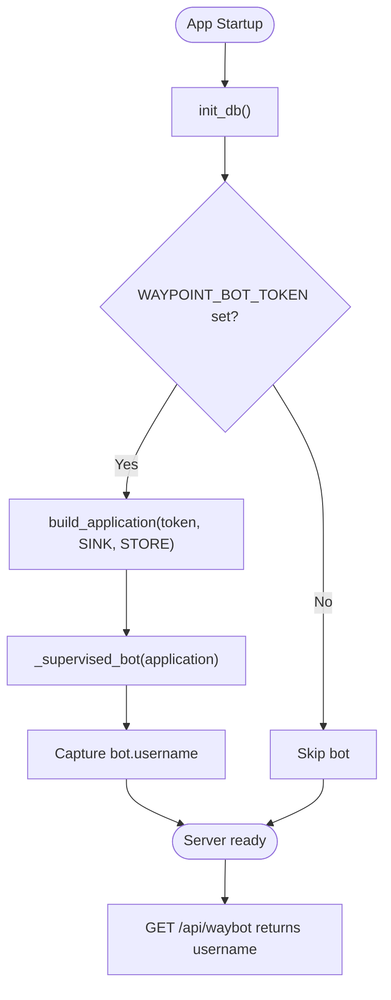

**Diagram sources**
- [backend/app/main.py:122-168](file://backend/app/main.py#L122-L168)
- [backend/app/main.py:63-120](file://backend/app/main.py#L63-L120)
- [backend/app/main.py:192-201](file://backend/app/main.py#L192-L201)

**Section sources**
- [backend/app/main.py:122-168](file://backend/app/main.py#L122-L168)

### Enhanced API Routes and Desk Lifecycle
- Seed desk: creates mandate and seeded portfolio; supports gated mode returning invite token and confirmation code; starts cycle immediately for ungated desks.
- Confirm release: validates rate limits, TTL, code attempts, verifies code hash, atomic release, then starts cycle with comprehensive security guards.
- Approve pre-trip: manager credential verification (desk code or per-round approval token), apply decision, resume cycle if approved with role separation enforcement.
- Stream SSE: buffers and replays events; clients connect and receive ordered steps.
- Snapshot: returns positions, ledger, budgets, lifecycle, and search meter usage.
- Weekly close: awaits completion, computes policy breaches deterministically, runs auditor narration with bounded timeout, returns CloseReport.
- **New `/api/waybot` endpoint**: Returns the live bot's Telegram username derived from WAYPOINT_BOT_TOKEN via getMe at bot startup; null when bot-less.

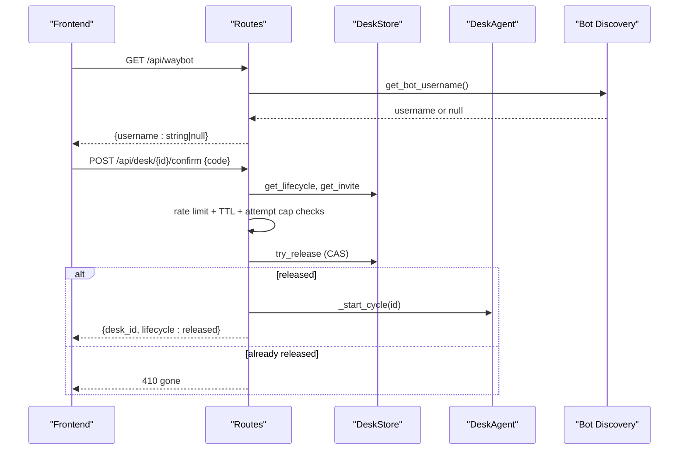

**Diagram sources**
- [backend/app/api/routes.py:521-606](file://backend/app/api/routes.py#L521-L606)
- [backend/app/api/routes.py:609-695](file://backend/app/api/routes.py#L609-L695)
- [backend/app/api/routes.py:698-747](file://backend/app/api/routes.py#L698-L747)
- [backend/app/api/routes.py:750-797](file://backend/app/api/routes.py#L750-L797)
- [backend/app/main.py:192-201](file://backend/app/main.py#L192-L201)

**Section sources**
- [backend/app/api/routes.py:371-819](file://backend/app/api/routes.py#L371-L819)

### Comprehensive Waybot Integration
- **Dynamic Username Management**: Captures bot username during supervised startup via `application.bot.username`, stored in module state for API access.
- **Secure Deep-Link Handlers**: `/start` command parses invite tokens, binds chats securely, and manages session state for traveler interactions with role separation.
- **Photo-Based Passport Extraction**: Downloads photos, extracts MRZ data via Qwen-VL, validates check digits, shows masked confirm cards with inline keyboards.
- **Typed-Entry Fallback**: When OCR fails, guides users through structured text input with the same validation gates and curated nationality lists.
- **Manager Approval Workflows**: Inline keyboard buttons trigger HTTP calls to backend approval endpoints with role separation and comprehensive security guards.
- **Session Management**: In-memory per-chat conversation state tracking with phase transitions (idle → awaiting_photo → awaiting_confirm → done).
- **Security Guards**: Photo size limits (10MB configurable), PII minimization (photo deletion), role separation (travelers can't approve), credential verification, and rate limiting.

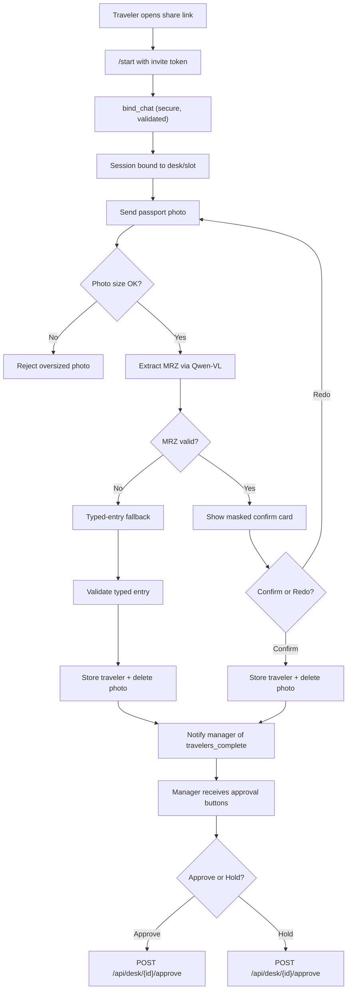

**Diagram sources**
- [backend/app/bot/handlers.py:92-132](file://backend/app/bot/handlers.py#L92-L132)
- [backend/app/bot/handlers.py:139-234](file://backend/app/bot/handlers.py#L139-L234)
- [backend/app/bot/handlers.py:237-278](file://backend/app/bot/handlers.py#L237-L278)
- [backend/app/bot/handlers.py:312-402](file://backend/app/bot/handlers.py#L312-L402)
- [backend/app/bot/handlers.py:405-454](file://backend/app/bot/handlers.py#L405-L454)
- [backend/app/bot/handlers.py:483-573](file://backend/app/bot/handlers.py#L483-L573)
- [backend/app/bot/session.py:27-62](file://backend/app/bot/session.py#L27-L62)
- [backend/app/bot/mrz.py:365-413](file://backend/app/bot/mrz.py#L365-L413)
- [backend/app/bot/extract.py:44-100](file://backend/app/bot/extract.py#L44-L100)

**Section sources**
- [backend/app/bot/__init__.py:1-86](file://backend/app/bot/__init__.py#L1-L86)
- [backend/app/bot/handlers.py:1-602](file://backend/app/bot/handlers.py#L1-L602)
- [backend/app/bot/notify.py:1-165](file://backend/app/bot/notify.py#L1-L165)
- [backend/app/bot/session.py:1-62](file://backend/app/bot/session.py#L1-L62)
- [backend/app/bot/mrz.py:1-491](file://backend/app/bot/mrz.py#L1-L491)
- [backend/app/bot/extract.py:1-100](file://backend/app/bot/extract.py#L1-L100)

### DeskAgent Orchestration Loop
- Re-reads world (GUARD #2), emits meta with mandate, meter, mode, disclosures.
- Bounded repricing fan-out with search meter (20 searches/cycle).
- Invokes DeskBrain for judgment; constructs pinned marks for approved positions.
- Execute wall enforces authority cap, budget, contingency; escalations wait for human click within bounded time.
- Write path only in live ticketing mode; comparison mode logs decisions without writes.
- Settles ledger entries atomically; computes P&L; handles budget exhaustion labeling.

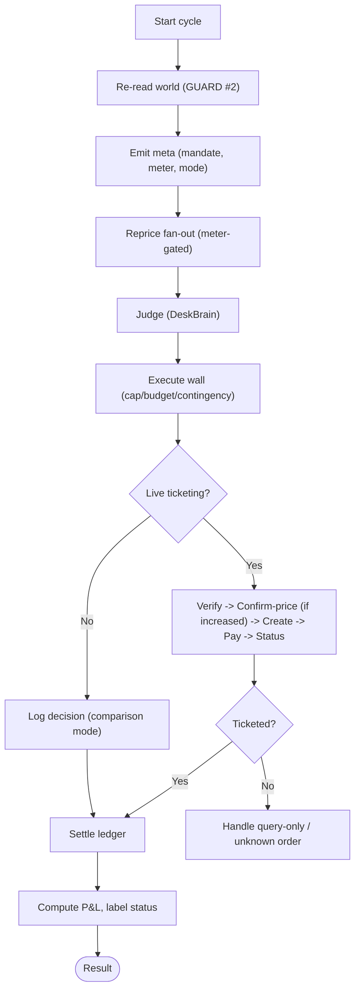

**Diagram sources**
- [backend/app/agent/loop.py:178-751](file://backend/app/agent/loop.py#L178-L751)
- [docs/plans/waypoint/02-architecture.md:33-41](file://docs/plans/waypoint/02-architecture.md#L33-L41)

**Section sources**
- [backend/app/agent/loop.py:178-751](file://backend/app/agent/loop.py#L178-L751)

### DeskBrain (Advise Gate)
- Batched single LLM call per cycle with timeout; transport injectable for tests.
- Deterministic fallback rule based on curated route bands; always emits identical DeskAction shape.
- Pure helpers: resolve_price_change (absorb vs requote), admitted_loss detection using curated bands.

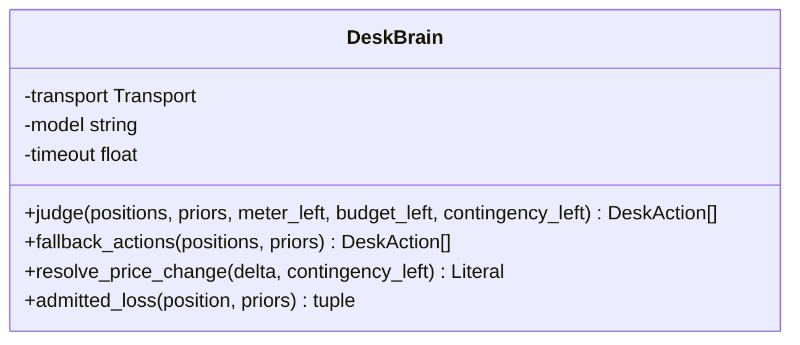

**Diagram sources**
- [backend/app/agent/brain.py:85-143](file://backend/app/agent/brain.py#L85-L143)
- [backend/app/agent/brain.py:149-193](file://backend/app/agent/brain.py#L149-L193)

**Section sources**
- [backend/app/agent/brain.py:85-143](file://backend/app/agent/brain.py#L85-L143)
- [backend/app/agent/brain.py:149-193](file://backend/app/agent/brain.py#L149-L193)

### AtlasClient (Gate 3 Wrapper)
- Subprocess wrapper around atlas-flight CLI; enforces contract discipline (branch on code, never message).
- Read-only calls allow at most one identical retry when retryable=true; writes are never retried.
- Comparison-mode probe caches auth status per cycle; fail-closed defaults to comparison mode on errors.
- Write path methods: verify, confirm_price, create_order, pay, order_status, seat_list/select; typed exceptions for query-only signals and unknown orders.

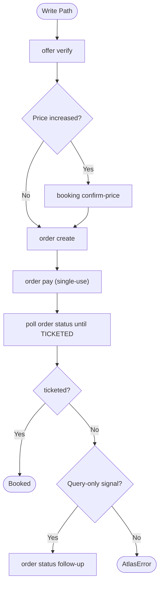

**Diagram sources**
- [backend/app/atlas/client.py:361-556](file://backend/app/atlas/client.py#L361-L556)

**Section sources**
- [backend/app/atlas/client.py:202-556](file://backend/app/atlas/client.py#L202-L556)

### Database Initialization and Schema Backfill
- Creates tables, drops-and-recreates only when all existing tables (new + legacy) are empty (demo data safety).
- Backfills missing mandate columns idempotently; ensures invite_token index exists on upgraded databases.

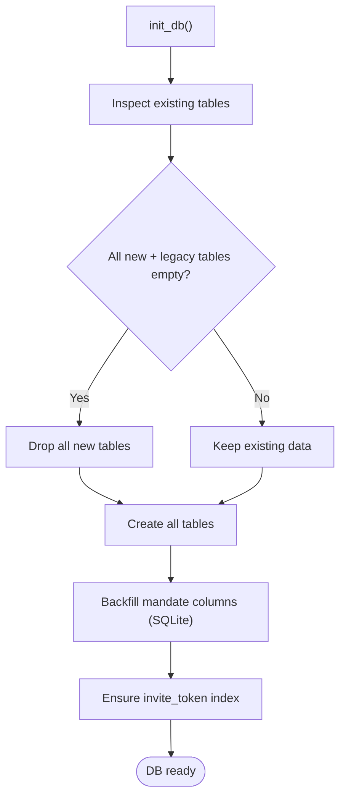

**Diagram sources**
- [backend/app/db/database.py:105-151](file://backend/app/db/database.py#L105-L151)

**Section sources**
- [backend/app/db/database.py:105-151](file://backend/app/db/database.py#L105-L151)

### Event Sink
- In-process pub/sub with fire-and-forget delivery; each subscriber isolated so failures do not break publisher or other subscribers.
- Supports subscribe/unsubscribe; publishes typed DeskEvents with payload.
- **Enhanced**: Bot notify handler subscribes to travelers_complete events to alert managers via Telegram; pending_approval events push priced itineraries with inline approval buttons.

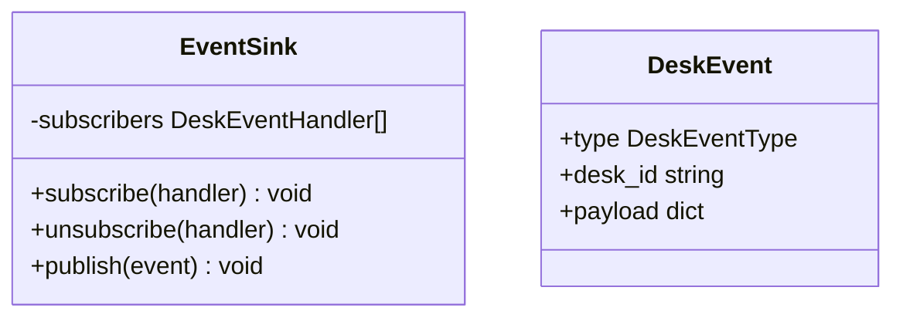

**Diagram sources**
- [backend/app/events.py:48-111](file://backend/app/events.py#L48-L111)

**Section sources**
- [backend/app/events.py:48-111](file://backend/app/events.py#L48-L111)

### Enhanced Frontend Integration
- Mandate page collects budget constraints and optional trip context; supports gated seed flow showing share link and confirmation code.
- API client provides typed functions for seed, confirm, approve, stream URL, snapshot, close, and escalation decision; error outcomes mapped to user-friendly states.
- **Enhanced**: Dynamic bot username discovery via `/api/waybot` endpoint; conditional rendering of Telegram share links based on bot availability; graceful fallback when bot is unavailable; complete group trip workflow support.

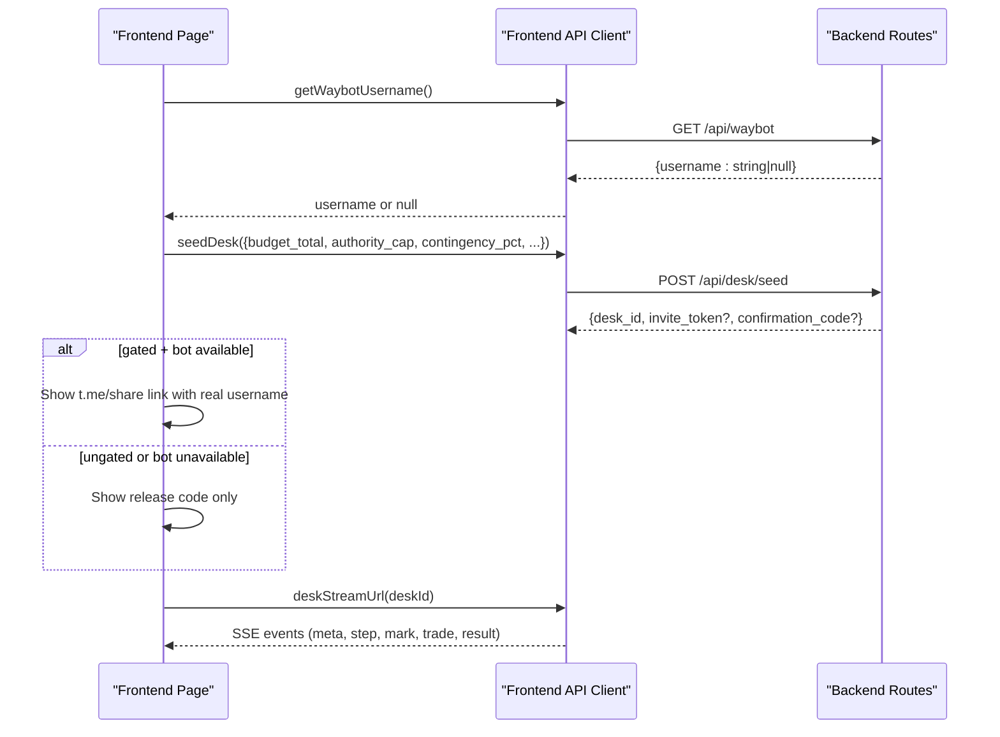

**Diagram sources**
- [frontend/app/page.tsx:40-54](file://frontend/app/page.tsx#L40-L54)
- [frontend/app/page.tsx:211-226](file://frontend/app/page.tsx#L211-L226)
- [frontend/lib/api.ts:113-128](file://frontend/lib/api.ts#L113-L128)
- [backend/app/main.py:192-201](file://backend/app/main.py#L192-L201)

**Section sources**
- [frontend/app/page.tsx:1-352](file://frontend/app/page.tsx#L1-L352)
- [frontend/lib/api.ts:1-201](file://frontend/lib/api.ts#L1-L201)

### Comprehensive Test Coverage
- **Bot Endpoint Tests**: Validate `/api/waybot` returns null when bot-less and captures username when bot is running.
- **Lifecycle Tests**: Test supervised bot startup, username capture, and proper cleanup on shutdown.
- **Handler Tests**: Cover `/start` deep-link parsing, invalid token handling, and welcome message scenarios.
- **Security Tests**: Verify role separation (travelers can't approve), photo size limits, and credential validation.
- **Integration Tests**: Test notify handler subscription, travelers_complete event processing, and manager notification flows.
- **Isolation Tests**: Ensure tests run without network side effects by unsetting WAYPOINT_BOT_TOKEN automatically.
- **MRZ Validation Tests**: Comprehensive testing of passport MRZ parsing, check digit validation, and typed-entry fallback scenarios.

**Section sources**
- [backend/tests/test_waybot.py:1-688](file://backend/tests/test_waybot.py#L1-L688)

## Dependency Analysis
- Backend modules depend on models for shared contracts; routes compose agent, store, auditor, and events; agent depends on brain and atlas; atlas depends on models for envelope types; database module initializes schema used by store; events provide decoupled messaging between loop and external integrations.
- Frontend depends on API client which calls backend endpoints; CORS configured to allow dev origins.
- **Enhanced Dependencies**: Bot package is import-isolated with optional telegram.ext dependency; handlers depend on store, events, and session management; main.py coordinates bot lifecycle with application startup; notify handler subscribes to events for manager notifications.

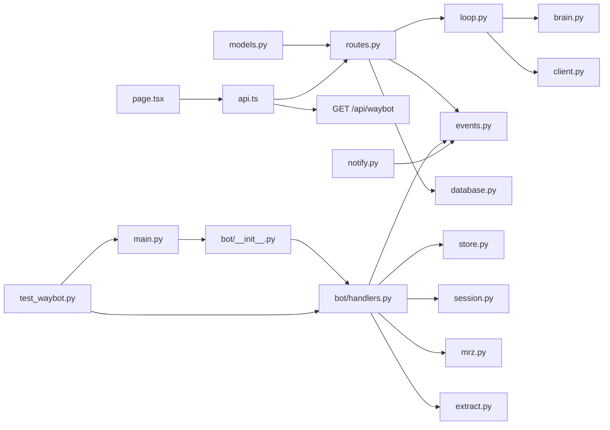

**Diagram sources**
- [backend/app/models.py:1-244](file://backend/app/models.py#L1-L244)
- [backend/app/api/routes.py:14-244](file://backend/app/api/routes.py#L14-L244)
- [backend/app/agent/loop.py:178-751](file://backend/app/agent/loop.py#L178-L751)
- [backend/app/agent/brain.py:85-103](file://backend/app/agent/brain.py#L85-L103)
- [backend/app/atlas/client.py:202-219](file://backend/app/atlas/client.py#L202-L219)
- [backend/app/events.py:48-111](file://backend/app/events.py#L48-L111)
- [backend/app/db/database.py:105-151](file://backend/app/db/database.py#L105-L151)
- [backend/app/bot/__init__.py:1-86](file://backend/app/bot/__init__.py#L1-L86)
- [backend/app/bot/handlers.py:1-602](file://backend/app/bot/handlers.py#L1-L602)
- [backend/app/bot/notify.py:1-165](file://backend/app/bot/notify.py#L1-L165)
- [backend/app/bot/session.py:1-62](file://backend/app/bot/session.py#L1-L62)
- [backend/app/bot/mrz.py:1-491](file://backend/app/bot/mrz.py#L1-L491)
- [backend/app/bot/extract.py:1-100](file://backend/app/bot/extract.py#L1-L100)
- [frontend/app/page.tsx:1-352](file://frontend/app/page.tsx#L1-L352)
- [frontend/lib/api.ts:1-201](file://frontend/lib/api.ts#L1-L201)
- [backend/tests/test_waybot.py:1-688](file://backend/tests/test_waybot.py#L1-L688)

**Section sources**
- [backend/app/api/routes.py:14-244](file://backend/app/api/routes.py#L14-L244)
- [backend/app/agent/loop.py:178-751](file://backend/app/agent/loop.py#L178-L751)
- [backend/app/agent/brain.py:85-103](file://backend/app/agent/brain.py#L85-L103)
- [backend/app/atlas/client.py:202-219](file://backend/app/atlas/client.py#L202-L219)
- [backend/app/events.py:48-111](file://backend/app/events.py#L48-L111)
- [backend/app/db/database.py:105-151](file://backend/app/db/database.py#L105-L151)
- [backend/app/bot/__init__.py:1-86](file://backend/app/bot/__init__.py#L1-L86)
- [backend/app/bot/handlers.py:1-602](file://backend/app/bot/handlers.py#L1-L602)
- [backend/app/bot/notify.py:1-165](file://backend/app/bot/notify.py#L1-L165)
- [backend/app/bot/session.py:1-62](file://backend/app/bot/session.py#L1-L62)
- [backend/app/bot/mrz.py:1-491](file://backend/app/bot/mrz.py#L1-L491)
- [backend/app/bot/extract.py:1-100](file://backend/app/bot/extract.py#L1-L100)
- [frontend/app/page.tsx:1-352](file://frontend/app/page.tsx#L1-L352)
- [frontend/lib/api.ts:1-201](file://frontend/lib/api.ts#L1-L201)
- [backend/tests/test_waybot.py:1-688](file://backend/tests/test_waybot.py#L1-L688)

## Performance Considerations
- Search meter caps fan-out to 20 searches per cycle to prevent runaway queries; stale marks carry uncertainty disclosures.
- Bounded concurrency for repricing fan-out; paced step emissions keep SSE readable.
- KDF verification offloaded to a bounded thread pool to avoid blocking the event loop during confirm/approve flows.
- Confirmation rate limiting uses a sliding window to mitigate floods without permanent lockouts.
- Auditor and close waits are bounded to prevent long hangs; failures degrade gracefully.
- **Enhanced**: Photo size limits (configurable, default 10MB) prevent memory exhaustion from large uploads; async operations for bot handlers prevent blocking event loop; bounded timeouts for HTTP calls to backend approval endpoints; MRZ validation with efficient candidate form generation; session management with in-memory caching for fast lookups.

## Troubleshooting Guide
- Unknown desk: 404 responses indicate invalid or expired desk IDs; ensure seed completed successfully.
- Already released: 410 indicates one-shot semantics; confirm or approve can be called only once per slot.
- Wrong code: 403 on confirm/approve; check credentials and TTL settings.
- Rate limited: 429 on confirm due to attempt cap or sliding window; slow down retries.
- Still running: 504 on close indicates cycle did not finish within bounds; wait and retry.
- Crashed: 500 on close indicates cycle failed; inspect server logs and SSE error events.
- Comparison mode: decisions logged but no writes; ensure both human switch and ticketing availability are enabled for live bookings.
- **Enhanced**: Bot issues - `/api/waybot` returns null when bot is unavailable; check WAYPOINT_BOT_TOKEN configuration; verify python-telegram-bot installation; inspect bot startup logs for initialization errors; monitor supervised bot restarts and circuit breaker activations.

**Section sources**
- [backend/app/api/routes.py:521-606](file://backend/app/api/routes.py#L521-L606)
- [backend/app/api/routes.py:609-695](file://backend/app/api/routes.py#L609-L695)
- [backend/app/api/routes.py:750-797](file://backend/app/api/routes.py#L750-L797)
- [backend/app/atlas/client.py:89-121](file://backend/app/atlas/client.py#L89-L121)
- [backend/app/main.py:192-201](file://backend/app/main.py#L192-L201)

## Conclusion
Waypoint implements a robust, safety-first autonomous travel desk with clear separation between judgment and execution. Its architecture emphasizes deterministic safeguards, transparent disclosures, and durable audit trails. The system integrates seamlessly with Atlas for sandbox operations, provides a responsive frontend with live streaming and weekly close reporting, and features comprehensive Telegram bot integration for complete group trip management from invite distribution through manager approvals. The enhanced Waybot integration includes dynamic username discovery, secure deep-link handling, photo-based passport extraction with MRZ validation, typed-entry fallback, manager approval workflows with inline keyboards, and comprehensive test coverage ensuring reliability across all lifecycle scenarios.

## Appendices
- Setup instructions and demo flow are documented in the repository README.
- Architecture details and flow steps are specified in the plans document.
- **Enhanced**: Bot setup requires WAYPOINT_BOT_TOKEN environment variable; optional python-telegram-bot dependency; configurable photo size limits via WAYBOT_MAX_PHOTO_BYTES; API base URL configuration via WAYPOINT_API_BASE for containerized deployments; comprehensive security configuration for role separation and credential validation.

**Section sources**
- [README.md:43-76](file://README.md#L43-L76)
- [docs/plans/waypoint/02-architecture.md:33-41](file://docs/plans/waypoint/02-architecture.md#L33-L41)
- [backend/app/bot/handlers.py:64-82](file://backend/app/bot/handlers.py#L64-L82)
- [backend/app/bot/handlers.py:42](file://backend/app/bot/handlers.py#L42)
- [backend/app/bot/notify.py:26-31](file://backend/app/bot/notify.py#L26-L31)
- [backend/app/main.py:45-48](file://backend/app/main.py#L45-L48)