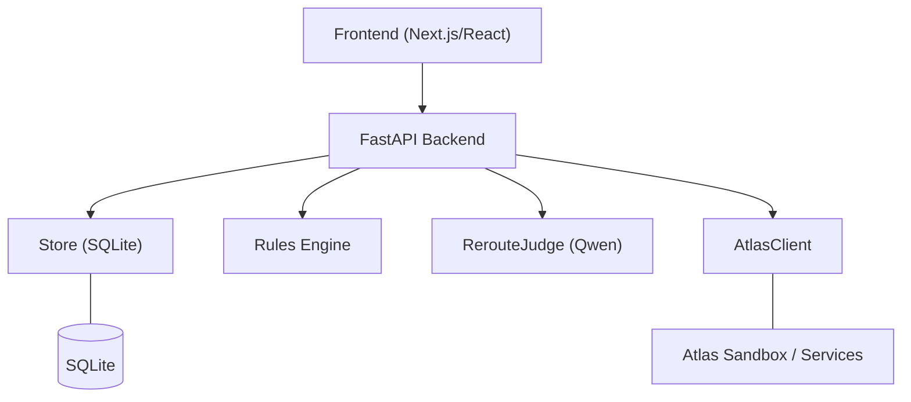
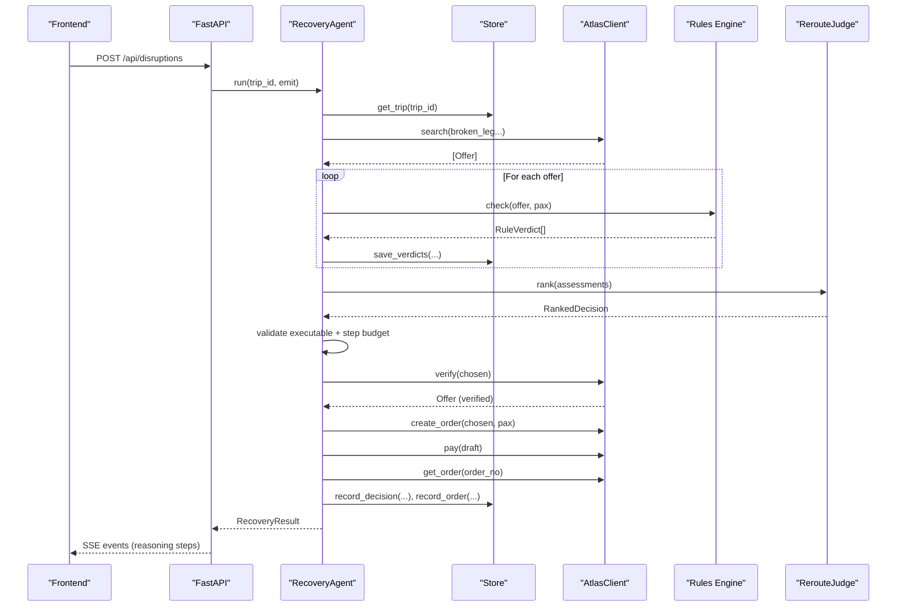
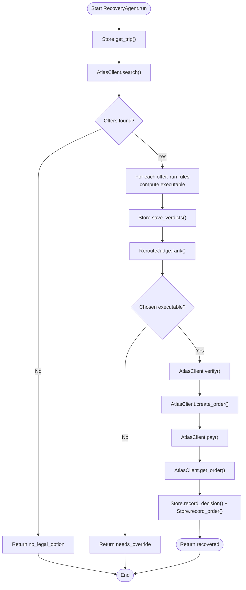
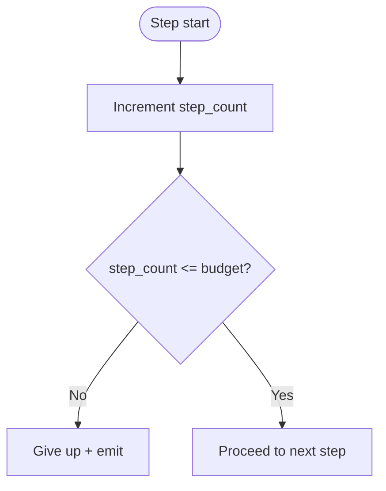
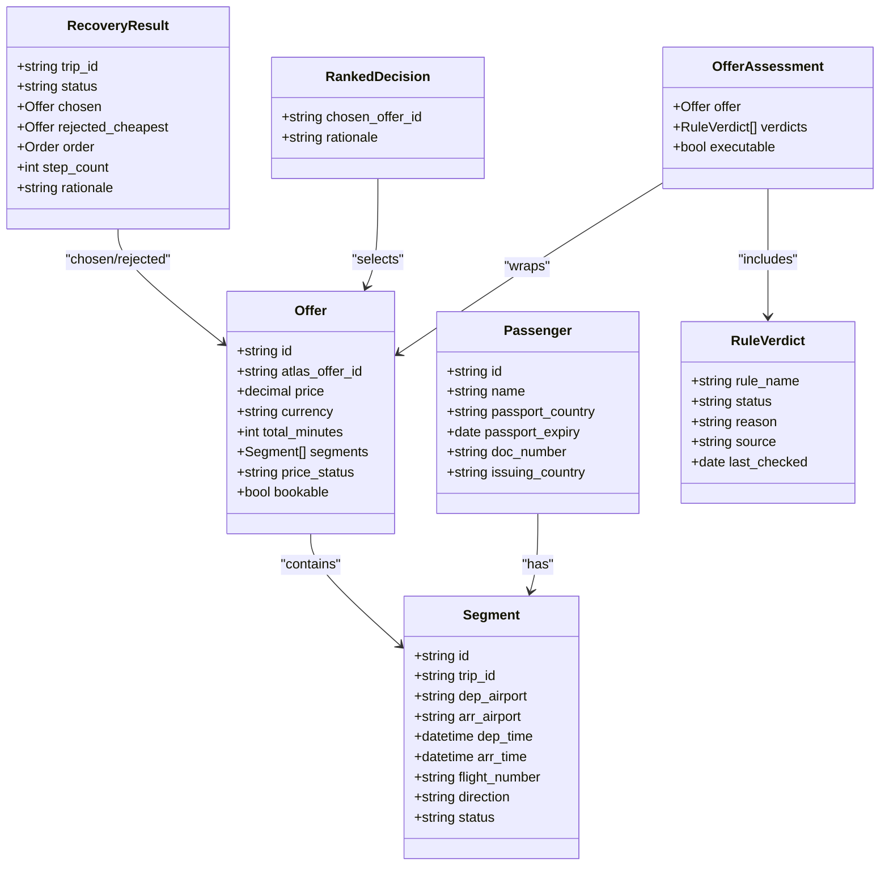
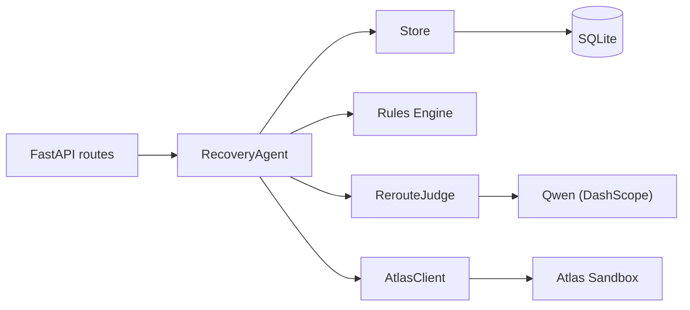

# Workflow Patterns

<cite>
**Referenced Files in This Document**
- [02-architecture.md](file://docs/plans/waypoint/02-architecture.md)
- [03-program-design.md](file://docs/plans/waypoint/03-program-design.md)
- [0003-advise-execute-two-gate-split.md](file://docs/adr/0003-advise-execute-two-gate-split.md)
- [error-handling.md](file://.agents/skills/atlas-flight-booking/references/error-handling.md)
</cite>

## Table of Contents
1. Introduction
2. Project Structure
3. Core Components
4. Architecture Overview
5. Detailed Component Analysis
6. Dependency Analysis
7. Performance Considerations
8. Troubleshooting Guide
9. Conclusion

## Introduction
This document explains the main recovery workflow and call stack patterns in Waypoint, from the disruption trigger through RecoveryAgent.run() to autonomous booking. It covers trip retrieval, alternative search, rule evaluation, AI judgment via RerouteJudge.rank(), and the execute phase with verification and booking. It also documents guard mechanisms (step budget, executable offer validation, stale data re-reads), error handling patterns, and how SSE streaming provides real-time visibility into each step.

## Project Structure
Waypoint’s design is split across a FastAPI backend, a rules engine, an Atlas integration layer, and a Qwen-powered judge for reroute decisions. The recovery flow is triggered by REST endpoints or webhooks and streamed live to the frontend via Server-Sent Events (SSE).

**Diagram sources**
- [02-architecture.md:13-30](file://docs/plans/waypoint/02-architecture.md#L13-L30)
- [03-program-design.md:11-31](file://docs/plans/waypoint/03-program-design.md#L11-L31)

**Section sources**
- [02-architecture.md:1-56](file://docs/plans/waypoint/02-architecture.md#L1-L56)
- [03-program-design.md:1-31](file://docs/plans/waypoint/03-program-design.md#L1-L31)

## Core Components
- RecoveryAgent.run(trip_id, emit): Orchestrates the end-to-end recovery loop with guards and emits events for SSE.
- Store.get_trip(): Re-reads current trip state before acting (stale-data guard).
- AtlasClient.search(): Finds alternatives for the broken leg; returns offers.
- Rule evaluation loop: Runs all active rules per offer; records verdicts and computes executability.
- RerouteJudge.rank(): Sees all assessments (advise gate) and recommends the best executable option with rationale.
- Execute phase: Verifies chosen offer, creates order, pays, asserts outcome, persists decision/order, and emits results.

Key types and responsibilities are defined in the program design specification.

**Section sources**
- [03-program-design.md:57-123](file://docs/plans/waypoint/03-program-design.md#L57-L123)
- [03-program-design.md:125-149](file://docs/plans/waypoint/03-program-design.md#L125-L149)

## Architecture Overview
The recovery workflow enforces two gates:
- Advise gate (open): All options and their rule labels are visible; Qwen reasons over them and narrates choices.
- Execute gate (fail-closed): Auto-execution only on fully allowed offers; blocked/unknown require human override.

Endpoints expose triggers and results, while SSE streams agent reasoning steps in real time.

**Diagram sources**
- [02-architecture.md:13-30](file://docs/plans/waypoint/02-architecture.md#L13-L30)
- [03-program-design.md:125-149](file://docs/plans/waypoint/03-program-design.md#L125-L149)

**Section sources**
- [02-architecture.md:13-56](file://docs/plans/waypoint/02-architecture.md#L13-L56)
- [03-program-design.md:125-149](file://docs/plans/waypoint/03-program-design.md#L125-L149)

## Detailed Component Analysis

### RecoveryAgent.run() Call Stack
- Entry: POST /api/disruptions (or webhook) invokes RecoveryAgent.run().
- Trip retrieval: Store.get_trip() re-reads world state to avoid acting on stale data.
- Alternative search: AtlasClient.search() returns candidate offers for the broken leg.
- Rule evaluation: For each offer, run all rules; compute OfferAssessment.executable when all verdicts are allowed. Persist rule_verdicts and emit labels.
- AI judgment: RerouteJudge.rank() sees all assessments and returns a RankedDecision with rationale.
- Execute gate: If chosen is not executable, return needs_override; if no executable offers, return no_legal_option.
- Verification and booking: Verify chosen offer (stale guard), create order, pay (sandbox auto-approve), assert PNR/ticket, persist decision/order, return recovered.
- Step budget: Each step increments a counter; exceeding the budget stops execution and emits a give-up event.

**Diagram sources**
- [03-program-design.md:125-149](file://docs/plans/waypoint/03-program-design.md#L125-L149)

**Section sources**
- [03-program-design.md:125-149](file://docs/plans/waypoint/03-program-design.md#L125-L149)

### Guard Mechanisms
- Step budget enforcement: Every step counts toward a fixed budget; exceeding it causes graceful termination and emission of a failure/give-up event.
- Executable offer validation: After AI selection, code re-checks that every rule verdict is allowed before executing; otherwise requires human override.
- Stale data re-reads: 
  - Trip state re-read before action via Store.get_trip().
  - Live price/availability re-read via AtlasClient.verify() immediately before booking.
  - Curated visa/transit rule freshness windows treat outdated cells as unknown, enforcing fail-closed behavior.

**Diagram sources**
- [03-program-design.md:125-149](file://docs/plans/waypoint/03-program-design.md#L125-L149)

**Section sources**
- [03-program-design.md:50-55](file://docs/plans/waypoint/03-program-design.md#L50-L55)
- [03-program-design.md:125-149](file://docs/plans/waypoint/03-program-design.md#L125-L149)

### Data Models and Relationships

**Diagram sources**
- [03-program-design.md:57-123](file://docs/plans/waypoint/03-program-design.md#L57-L123)

**Section sources**
- [03-program-design.md:57-123](file://docs/plans/waypoint/03-program-design.md#L57-L123)

### Error Handling Patterns
- Atlas error routing: Branch on normalized codes; never parse messages; keep internal causes out of user-facing output.
- Search and verification: Treat empty results as success; handle expired offers/bookings by replaying retained search once; retry price verification only when retryable; report unavailable flights and invalid inputs.
- Order/payment/ticketing: Avoid duplicate payments or order creation; query status when uncertain; mask sensitive fields; do not claim certainty without evidence.
- General failures: Retry read-only commands at most once when retryable; stop on invalid arguments or service failures; follow query-only rule if side effects might have occurred.

These patterns guide how the backend surfaces errors during recovery and what actions are safe to retry or escalate.

**Section sources**
- [error-handling.md:1-74](file://.agents/skills/atlas-flight-booking/references/error-handling.md#L1-L74)

### Edge Cases and Override Requirements
- No legal options: When all offers are blocked or unknown, the agent returns no_legal_option and emits the rationale.
- Override required: If the chosen offer is not executable (blocked/unknown), the agent returns needs_override; human intervention is required to proceed.
- Stale curated data: Past freshness windows for transit hubs become unknown, enforcing fail-closed behavior and potentially requiring override.

**Section sources**
- [03-program-design.md:125-149](file://docs/plans/waypoint/03-program-design.md#L125-L149)
- [03-program-design.md:50-55](file://docs/plans/waypoint/03-program-design.md#L50-L55)

### SSE Streaming for Real-Time Visibility
- The backend exposes GET /api/trips/{id}/stream for SSE events.
- During RecoveryAgent.run(), each step (trip re-read, search results, rule verdicts, judge rationale, verification, order/pay, assertion) emits an event so the frontend can render live reasoning and outcomes.
- This stream powers the “agent recovering” screen and provides compliance-visible audit trails.

**Section sources**
- [02-architecture.md:13-20](file://docs/plans/waypoint/02-architecture.md#L13-L20)
- [02-architecture.md:34-49](file://docs/plans/waypoint/02-architecture.md#L34-L49)

## Dependency Analysis

**Diagram sources**
- [02-architecture.md:13-30](file://docs/plans/waypoint/02-architecture.md#L13-L30)
- [03-program-design.md:11-31](file://docs/plans/waypoint/03-program-design.md#L11-L31)

**Section sources**
- [02-architecture.md:13-56](file://docs/plans/waypoint/02-architecture.md#L13-L56)
- [03-program-design.md:11-31](file://docs/plans/waypoint/03-program-design.md#L11-L31)

## Performance Considerations
- Minimize external calls: Batch rule evaluations per offer; avoid redundant searches.
- Cache reads where safe: Trip state is re-read only at critical boundaries; other reads can be cached within a single run.
- Prefer deterministic paths: Keep AI usage limited to ranking; deterministic code handles rules, fare math, and booking.
- Respect budgets: Tight step budgets reduce latency and cost; tune based on observed loop length.

[No sources needed since this section provides general guidance]

## Troubleshooting Guide
- No legal option: Indicates all candidates were blocked or unknown due to rules or freshness; review curated hub data and passenger eligibility.
- Needs override: Chosen offer failed executable checks; inspect rule verdicts and reasons; consider manual approval if justified.
- Stale data warnings: Freshness windows may mark data as unknown; refresh curated tables or adjust thresholds.
- Atlas errors: Follow normalized error codes; avoid retries on write operations; use query-only flows when uncertain.

**Section sources**
- [error-handling.md:19-74](file://.agents/skills/atlas-flight-booking/references/error-handling.md#L19-L74)
- [03-program-design.md:125-149](file://docs/plans/waypoint/03-program-design.md#L125-L149)

## Conclusion
Waypoint’s recovery workflow separates advice from execution to balance transparency and safety. The RecoveryAgent orchestrates a bounded, auditable loop: re-read trip state, search alternatives, evaluate rules, let AI rank legal options, then enforce a fail-closed execute gate with live verification and outcome assertion. SSE streaming provides real-time insight into each step, while robust error handling ensures resilience and compliance.

[No sources needed since this section summarizes without analyzing specific files]