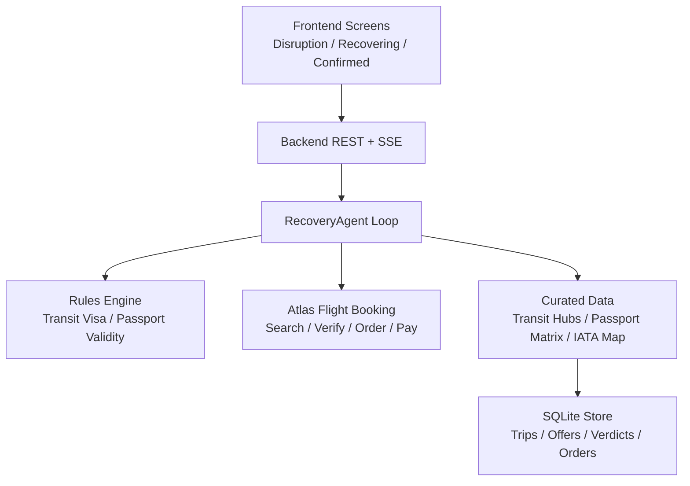
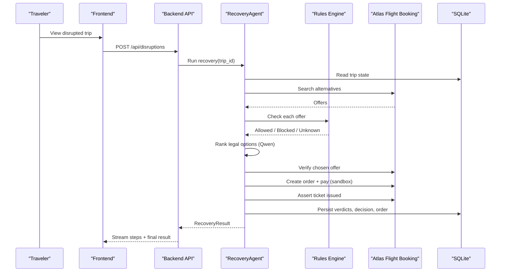
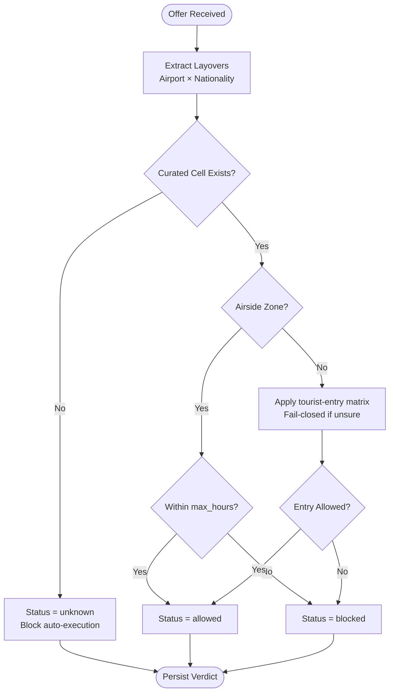
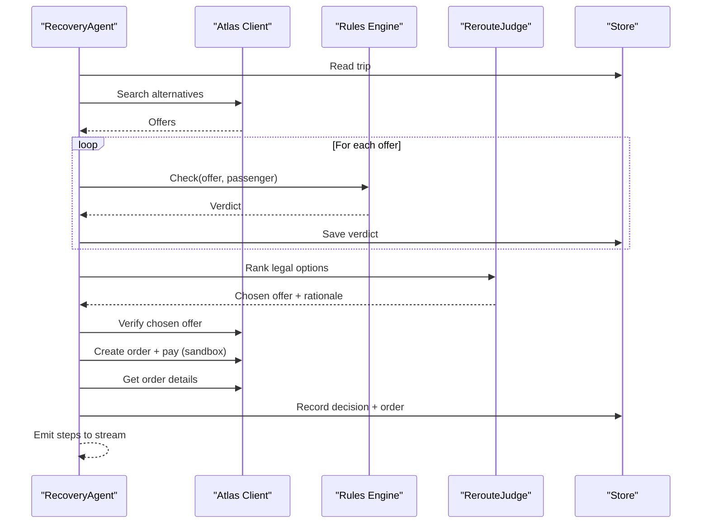
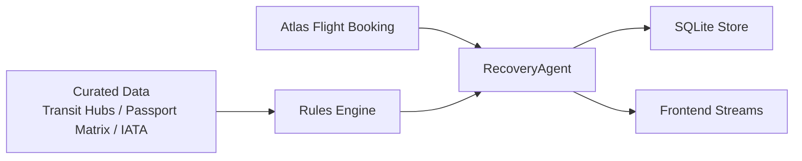

# Introduction & Problem Statement

<cite>
**Referenced Files in This Document**
- [01-product.md](file://docs/plans/waypoint/01-product.md)
- [02-architecture.md](file://docs/plans/waypoint/02-architecture.md)
- [03-program-design.md](file://docs/plans/waypoint/03-program-design.md)
- [00-status.md](file://docs/plans/waypoint/00-status.md)
- [0002-visa-rules-curated-approximation.md](file://docs/adr/0002-visa-rules-curated-approximation.md)
- [SKILL.md](file://.agents/skills/atlas-flight-booking/SKILL.md)
- [01-trip-disrupted.html](file://docs/plans/waypoint/mockups/01-trip-disrupted.html)
- [02-agent-recovering.html](file://docs/plans/waypoint/mockups/02-agent-recovering.html)
- [03-recovery-confirmed.html](file://docs/plans/waypoint/mockups/03-recovery-confirmed.html)
</cite>

## Table of Contents
1. [Introduction](#introduction)
2. [Project Structure](#project-structure)
3. [Core Components](#core-components)
4. [Architecture Overview](#architecture-overview)
5. [Detailed Component Analysis](#detailed-component-analysis)
6. [Dependency Analysis](#dependency-analysis)
7. [Performance Considerations](#performance-considerations)
8. [Troubleshooting Guide](#troubleshooting-guide)
9. [Conclusion](#conclusion)
10. [Appendices](#appendices)

## Introduction
This section documents the critical problem that Waypoint solves: passport-aware flight rebooking when a trip is disrupted. The core issue is that travelers with limited transit rights—especially holders of Indian, Chinese, African, and Southeast Asian passports—are routinely booked onto connections through countries they cannot legally transit. Traditional rebooking systems ignore passport context and optimize only for price or availability. As a result, passengers often discover at the gate that their cheapest alternative is not boardable, leading to gate-denial traps, being stranded, forced repurchases, and missing important travel reasons.

Waypoint’s product vision centers on a rules-aware rebooking agent that checks the rules of your trip—not just the price. It evaluates every alternative against transit visa eligibility and other entry constraints before booking anything. In practice, this means avoiding the cheapest but illegal reroute and selecting a confirmed, rule-legal option that you can actually take.

The emotional impact is real: passengers are left stranded after cancellations, forced to buy new tickets they may not afford, and miss events or obligations tied to their original journey. Waypoint aims to eliminate these gate surprises by embedding passport-aware rebooking into the recovery process from the moment a leg breaks.

**Section sources**
- [01-product.md:3-11](file://docs/plans/waypoint/01-product.md#L3-L11)
- [01-product.md:25-31](file://docs/plans/waypoint/01-product.md#L25-L31)
- [01-trip-disrupted.html:28-48](file://docs/plans/waypoint/mockups/01-trip-disrupted.html#L28-L48)

## Project Structure
At a high level, Waypoint is organized around three layers:
- Frontend screens that show disruption detection, live agent reasoning, and recovery confirmation.
- A backend rules engine and recovery agent that search alternatives, evaluate them against rules, and execute bookings safely.
- External integrations (Atlas Flight Booking) and curated data (transit hubs, passport matrices) that power decisions.

**Diagram sources**
- [02-architecture.md:13-30](file://docs/plans/waypoint/02-architecture.md#L13-L30)
- [03-program-design.md:9-31](file://docs/plans/waypoint/03-program-design.md#L9-L31)

**Section sources**
- [02-architecture.md:1-11](file://docs/plans/waypoint/02-architecture.md#L1-L11)
- [03-program-design.md:9-31](file://docs/plans/waypoint/03-program-design.md#L9-L31)

## Core Components
- Passport-aware rebooking: The system treats transit visa eligibility as the hero rule and adds passport validity checks. These rules read the passenger profile and each offer’s layovers to determine whether an option is allowed, blocked, or unknown.
- Gate-denial traps: Cheapest alternatives often route through airports where self-transfer requires a visa or where airside transit is not permitted for certain nationalities. Waypoint flags these options before booking.
- Transit visa eligibility: A curated approximation distinguishes airside transit from landside/self-transfer scenarios and applies nationality-specific rules per hub. Unknown or stale cells fail closed to prevent unsafe auto-execution.
- Recovery workflow: When a segment is cancelled, the agent searches alternatives, runs all rules, ranks legal options, verifies live pricing, books and settles fare differences in sandbox, and asserts ticket issuance before marking success.

Concrete examples from the demo:
- A canceled SIN→NRT flight triggers recovery. The cheapest option via SGN is rejected because it requires a Vietnam visa for an Indian passport; the agent selects a pricier but legal ICN connection with airside transit allowed.
- The recovered screen shows the rejected cheap-but-illegal option versus the confirmed legal reroute, including fare difference settlement and ticket assertion.

**Section sources**
- [01-product.md:3-18](file://docs/plans/waypoint/01-product.md#L3-L18)
- [00-status.md:18-31](file://docs/plans/waypoint/00-status.md#L18-L31)
- [0002-visa-rules-curated-approximation.md:6-18](file://docs/adr/0002-visa-rules-curated-approximation.md#L6-L18)
- [02-agent-recovering.html:33-60](file://docs/plans/waypoint/mockups/02-agent-recovering.html#L33-L60)
- [03-recovery-confirmed.html:35-59](file://docs/plans/waypoint/mockups/03-recovery-confirmed.html#L35-L59)

## Architecture Overview
The architecture separates advice from execution to ensure safety:
- Advise gate: The agent sees all offers and labels them allowed/blocked/unknown with reasons. Qwen ranks legal options based on price, time, and layover while narrating why cheaper illegal options are rejected.
- Execute gate: Auto-booking and fare-difference settlement occur only for offers where every rule is allowed. Any blocked or unknown option requires human override.

Key endpoints and flows:
- POST /api/trips seeds a trip; POST /api/disruptions injects a cancellation; GET /api/trips/{id}/recovery returns results; GET /api/trips/{id}/stream emits live reasoning steps via SSE.
- The agent loop reads current state, searches alternatives, runs rules, ranks legal options, verifies live prices, orders and pays in sandbox, asserts outcomes, and persists evidence.

**Diagram sources**
- [02-architecture.md:13-49](file://docs/plans/waypoint/02-architecture.md#L13-L49)
- [03-program-design.md:125-149](file://docs/plans/waypoint/03-program-design.md#L125-L149)

**Section sources**
- [02-architecture.md:1-11](file://docs/plans/waypoint/02-architecture.md#L1-L11)
- [02-architecture.md:13-49](file://docs/plans/waypoint/02-architecture.md#L13-L49)
- [03-program-design.md:3-7](file://docs/plans/waypoint/03-program-design.md#L3-L7)

## Detailed Component Analysis

### Passport-Aware Rebooking and Transit Visa Eligibility
Passport-aware rebooking ensures that every alternative is evaluated against the traveler’s passport and itinerary. The transit visa rule distinguishes airside transit from landside/self-transfer and applies nationality-specific rules per hub. If a hub lacks an airside zone, entry requirements apply; otherwise, airside transit may be allowed within hour thresholds. Missing or stale data resolves to unknown and blocks autonomous execution.

**Diagram sources**
- [03-program-design.md:34-48](file://docs/plans/waypoint/03-program-design.md#L34-L48)
- [0002-visa-rules-curated-approximation.md:6-18](file://docs/adr/0002-visa-rules-curated-approximation.md#L6-L18)

**Section sources**
- [0002-visa-rules-curated-approximation.md:6-18](file://docs/adr/0002-visa-rules-curated-approximation.md#L6-L18)
- [03-program-design.md:34-48](file://docs/plans/waypoint/03-program-design.md#L34-L48)

### Recovery Agent and Execution Safeguards
The recovery agent orchestrates the end-to-end process with strict safeguards:
- Step budget prevents infinite loops.
- Re-read/verify ensures live pricing and seat availability before booking.
- Outcome assertion confirms PNR and ticket issuance rather than assuming success.

**Diagram sources**
- [03-program-design.md:125-149](file://docs/plans/waypoint/03-program-design.md#L125-L149)
- [02-architecture.md:34-49](file://docs/plans/waypoint/02-architecture.md#L34-L49)

**Section sources**
- [03-program-design.md:125-149](file://docs/plans/waypoint/03-program-design.md#L125-L149)
- [00-status.md:40-43](file://docs/plans/waypoint/00-status.md#L40-L43)

### Real-World Scenarios and Emotional Impact
The documented scenario captures the pain point: a canceled flight leads to a cheapest reroute that connects through a country the passenger cannot legally transit. The passenger discovers this only at the gate, resulting in denial boarding, stranding, and the need to repurchase tickets. Mainstream tools like Google Flights and airline apps do not incorporate passport context, so the cheapest alternative is often legally impossible.

Screens illustrate the flow:
- Disrupted trip view highlights the canceled leg and traveler passport context.
- Recovering view shows live agent reasoning, rule checks, and selection of a legal reroute over a cheaper illegal one.
- Confirmed view contrasts the rejected cheap trap with the booked legal option, including fare difference settlement and ticket assertion.

**Section sources**
- [01-product.md:3-11](file://docs/plans/waypoint/01-product.md#L3-L11)
- [01-trip-disrupted.html:28-48](file://docs/plans/waypoint/mockups/01-trip-disrupted.html#L28-L48)
- [02-agent-recovering.html:33-60](file://docs/plans/waypoint/mockups/02-agent-recovering.html#L33-L60)
- [03-recovery-confirmed.html:35-59](file://docs/plans/waypoint/mockups/03-recovery-confirmed.html#L35-L59)

## Dependency Analysis
Waypoint depends on:
- Atlas Flight Booking for search, verification, ordering, payment, and outcome assertion.
- Curated transit hub data and passport matrices for rule evaluation.
- SQLite for persistence of trips, offers, rule verdicts, decisions, and orders.
- Qwen for ranking legal options and generating rationales.

**Diagram sources**
- [02-architecture.md:1-11](file://docs/plans/waypoint/02-architecture.md#L1-L11)
- [02-architecture.md:21-30](file://docs/plans/waypoint/02-architecture.md#L21-L30)
- [03-program-design.md:9-31](file://docs/plans/waypoint/03-program-design.md#L9-L31)

**Section sources**
- [02-architecture.md:1-11](file://docs/plans/waypoint/02-architecture.md#L1-L11)
- [02-architecture.md:21-30](file://docs/plans/waypoint/02-architecture.md#L21-L30)
- [SKILL.md:39-53](file://.agents/skills/atlas-flight-booking/SKILL.md#L39-L53)

## Performance Considerations
- Deterministic code owns rules checks, fare-difference math, and order/pay execution to avoid AI overhead in critical paths.
- Qwen is used only for reroute judgment, improving performance and reliability for decision-making.
- Freshness windows for curated data reduce risk and keep auto-execution safe without live visa APIs.
- Live verification before booking prevents stale offers and minimizes rework.

[No sources needed since this section provides general guidance]

## Troubleshooting Guide
Common failure modes and how Waypoint handles them:
- Infinite loops: Guarded by step budget; the agent stops and surfaces inability to resolve.
- Stale data: Re-read/verify before every write; price and availability are checked live via Atlas verify.
- False success: Outcome assertion ensures PNR and ticket are actually issued before marking recovery complete.
- Unknown transit rules: Fail-closed behavior blocks autonomous execution when data is missing or stale; requires human override.

Operational tips:
- Ensure curated hubs cover demo routes to avoid unknown states during scripted demos.
- Use injected disruptions when webhooks are unavailable; disclose injection in the demo.
- Keep sandbox-only auto-approve active to avoid real charges during testing.

**Section sources**
- [00-status.md:40-43](file://docs/plans/waypoint/00-status.md#L40-L43)
- [03-program-design.md:50-55](file://docs/plans/waypoint/03-program-design.md#L50-L55)
- [0002-visa-rules-curated-approximation.md:10-18](file://docs/adr/0002-visa-rules-curated-approximation.md#L10-L18)

## Conclusion
Waypoint addresses a critical gap in flight disruption recovery by embedding passport-aware rebooking into the agent’s decision-making. By checking transit visa eligibility and other entry constraints before booking, Waypoint avoids gate-denial traps and protects travelers from being stranded due to illegal reroutes. The system balances speed and safety through deterministic execution, live verification, and fail-closed rules, ensuring that passengers land where they meant to—without surprises at the gate.

[No sources needed since this section summarizes without analyzing specific files]

## Appendices

### Concrete Examples of Problematic Scenarios Waypoint Solves
- A canceled SIN→NRT flight leads to a cheapest option via SGN that requires a Vietnam visa for an Indian passport; Waypoint rejects it and books a legal ICN connection with airside transit allowed.
- A traveler with limited transit rights is routed through a hub without an airside zone, forcing immigration clearance and requiring a visa; Waypoint flags this as blocked and selects an alternative that avoids entry.
- A passenger’s passport expires too soon for entry; the rules engine detects this and blocks the option, preventing a denied boarding situation.

**Section sources**
- [02-agent-recovering.html:42-60](file://docs/plans/waypoint/mockups/02-agent-recovering.html#L42-L60)
- [03-recovery-confirmed.html:35-59](file://docs/plans/waypoint/mockups/03-recovery-confirmed.html#L35-L59)
- [01-product.md:13-18](file://docs/plans/waypoint/01-product.md#L13-L18)