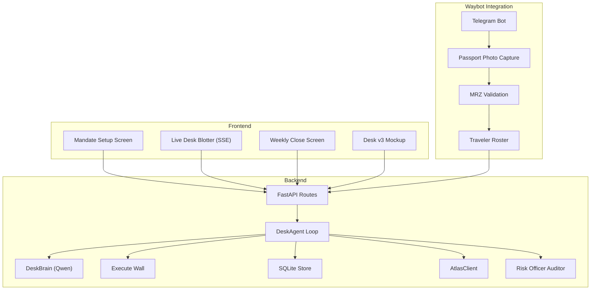
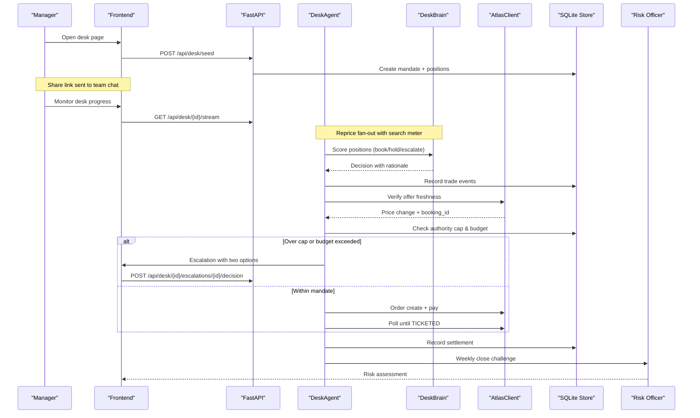
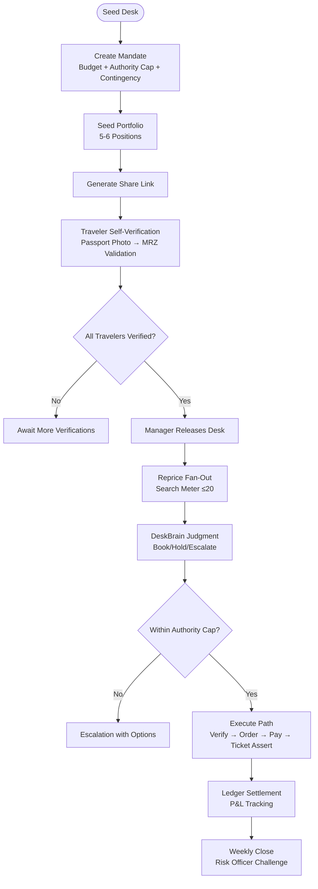
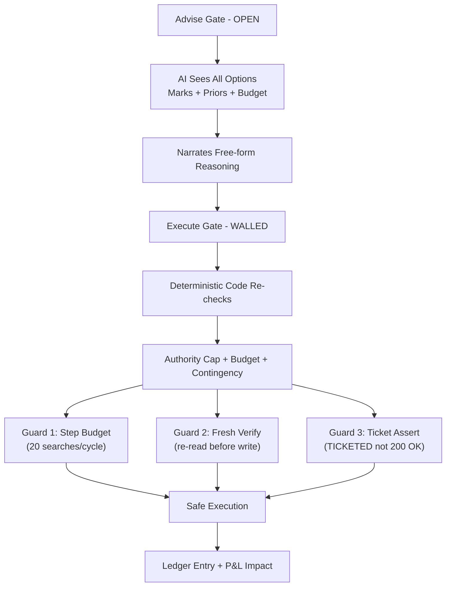
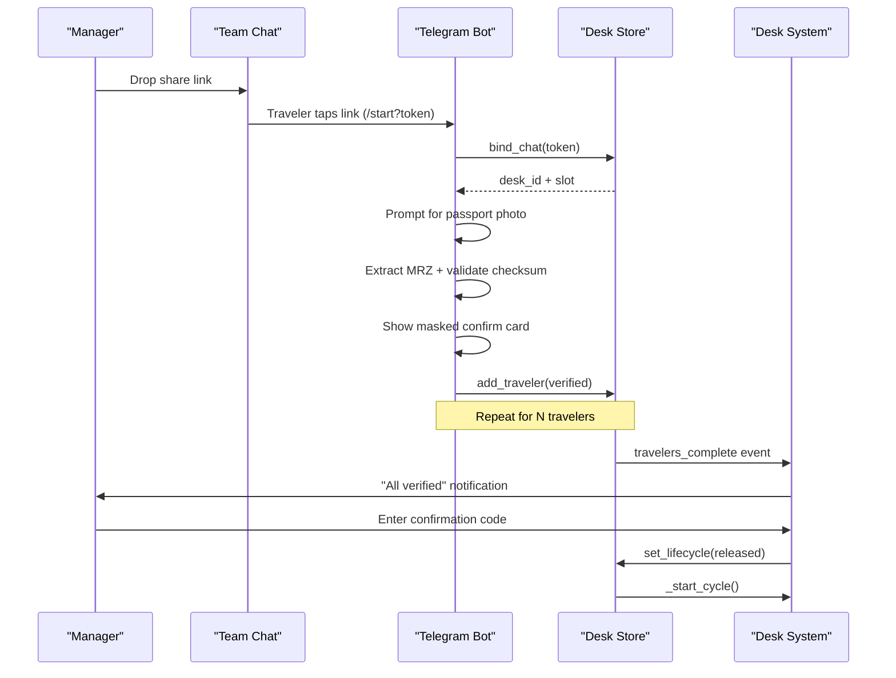
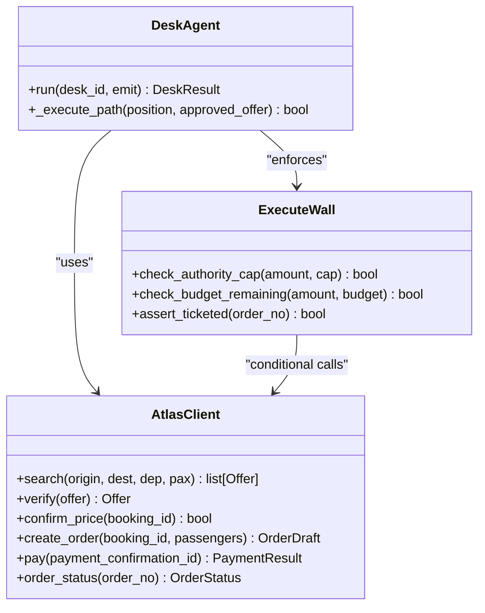
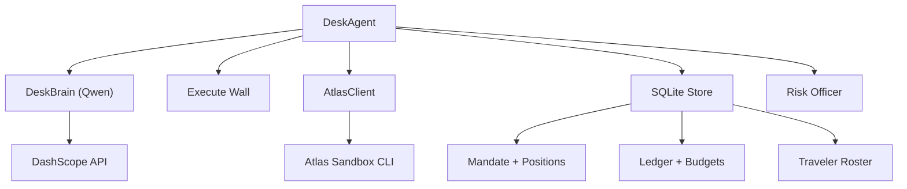

# Project Overview

<cite>
**Referenced Files in This Document**
- [README.md](file://README.md)
- [01-product.md](file://docs/plans/waypoint/01-product.md)
- [02-architecture.md](file://docs/plans/waypoint/02-architecture.md)
- [03-program-design.md](file://docs/plans/waypoint/03-program-design.md)
- [04-slices.md](file://docs/plans/waypoint/04-slices.md)
- [QODER-HANDOFF.md](file://docs/plans/waypoint/QODER-HANDOFF.md)
- [0002-visa-rules-curated-approximation.md](file://docs/adr/0002-visa-rules-curated-approximation.md)
- [0003-advise-execute-two-gate-split.md](file://docs/adr/0003-advise-execute-two-gate-split.md)
- [0004-two-gates-and-curated-priors-applied-to-money.md](file://docs/adr/0004-two-gates-and-curated-priors-applied-to-money.md)
- [atlas-integration.md](file://docs/external/atlas-integration.md)
- [SKILL.md](file://skills/atlas-flight-booking/SKILL.md)
- [desk-v3.html](file://docs/plans/waypoint/mockups/desk-v3.html)
</cite>

## Update Summary
**Changes Made**
- Updated product thesis to reflect autonomous corporate-travel treasury desk system
- Enhanced safety model descriptions with detailed two-gate and three-guard mechanisms
- Added comprehensive coverage of manager workflow and traveler self-verification process
- Expanded architecture overview to include Waybot integration and desk lifecycle
- Updated success metrics to align with treasury desk operations and P&L management

## Table of Contents
1. [Introduction](#introduction)
2. [Project Structure](#project-structure)
3. [Core Components](#core-components)
4. [Architecture Overview](#architecture-overview)
5. [Detailed Component Analysis](#detailed-component-analysis)
6. [Dependency Analysis](#dependency-analysis)
7. [Performance Considerations](#performance-considerations)
8. [Troubleshooting Guide](#troubleshooting-guide)
9. [Conclusion](#conclusion)
10. [Appendices](#appendices)

## Introduction
Waypoint is an autonomous corporate-travel treasury desk for disrupted trips that transforms how companies manage travel budgets as portfolios with market timing risk. A manager opens a desk, drops a share link into the team chat, and each traveler self-verifies by passport photo; once the roster is complete, Waypoint reprices every booked position against the live Atlas sandbox, a Qwen-powered desk brain judges **book / hold / escalate** with written rationale, and a deterministic execute wall re-checks authority and budget before a single dollar moves. Nothing books until the manager approves the priced itinerary, and every cycle lands in a ledger whose books tie out — a weekly close adds a risk-officer auditor line.

The enhanced product thesis addresses a critical gap: traditional rebooking systems pick the cheapest reroute without considering budget impact, policy compliance, or legal eligibility based on passport transit requirements. Waypoint separates *judgment* (LLM, open advise gate) from *execution* (plain code, walled execute gate, fail-closed), so it can act autonomously without ever booking something it can't prove is in-mandate, in-budget, and actually ticketed.

Key benefits:
- **Autonomous treasury management**: Deterministic fare-difference math, budget enforcement, and payment execution without LLM involvement in settlement.
- **Real-time visibility**: SSE stream shows search, rule checks, ranking rationale, and booking steps as they happen across the entire portfolio.
- **Rules-based validation**: Fail-closed safety ensures unknown or blocked options never auto-book; only fully allowed offers proceed through the execute wall.
- **Manager oversight**: One-click approval checkpoint before any money moves, with full audit trail and weekly P&L reconciliation.

Conceptual overview for beginners:
- When your company's travel budget needs optimization, Waypoint acts like a trading desk for flights. Managers set budget rules, team members verify their identities via passport photos, and the system automatically finds the best timing to book while staying within policy limits. If fares spike beyond authority caps, it escalates to you for approval before spending.

Technical overview for experienced developers:
- Backend (Python FastAPI) hosts the DeskAgent loop, DeskBrain judgment layer, deterministic execute wall, SQLite persistence, and Atlas integration. Waybot provides Telegram-based traveler identity capture with MRZ validation. Qwen ranks positions under budget constraints and narrates decisions. Deterministic code owns rules, fare math, and execution; AI owns judgment and narration. Two-gate split ensures open advice but fail-closed execution.

Success metrics and evaluation criteria:
- Primary: Weekly P&L beats always-book-now baseline with zero authority-cap breaches, every sandbox payment reconciled against ledger, every booked position asserted TICKETED. Target across seeded disruption set: 100% boardable recovery and no illegal bookings.
- Secondary: Time-to-recovery, honest price gap compared to baseline, search-budget adherence (≤20 searches/cycle), and escalation quality with two priced options plus recommendation.
- Judging rubric alignment: Two-gate split (advise open, execute walled/fail-closed), three guards (step budget, re-read/verify before write, assert real outcome), curated visa approximation with provenance and freshness windows, and clear demo choreography showing trap vs legal reroute.

**Section sources**
- [README.md:3-13](file://README.md#L3-L13)
- [01-product.md:3-19](file://docs/plans/waypoint/01-product.md#L3-L19)
- [02-architecture.md:3-11](file://docs/plans/waypoint/02-architecture.md#L3-L11)
- [0003-advise-execute-two-gate-split.md:6-18](file://docs/adr/0003-advise-execute-two-gate-split.md#L6-L18)
- [0004-two-gates-and-curated-priors-applied-to-money.md:6-21](file://docs/adr/0004-two-gates-and-curated-priors-applied-to-money.md#L6-L21)

## Project Structure
The repository organizes planning, architecture, and design into focused documents and mockups, plus a skills lock for the Atlas integration. The plan defines a comprehensive desk system: a Next.js/React frontend for mandate setup, live desk monitoring, and weekly close screens, and a Python FastAPI backend hosting the desk agent, brain judgment, rules engine, data loaders, Atlas integration, and Waybot for traveler identity capture.

**Diagram sources**
- [README.md:14-31](file://README.md#L14-L31)
- [02-architecture.md:13-16](file://docs/plans/waypoint/02-architecture.md#L13-L16)
- [desk-v3.html:92-168](file://docs/plans/waypoint/mockups/desk-v3.html#L92-L168)

**Section sources**
- [README.md:14-44](file://README.md#L14-L44)
- [02-architecture.md:13-31](file://docs/plans/waypoint/02-architecture.md#L13-L31)
- [03-program-design.md:9-32](file://docs/plans/waypoint/03-program-design.md#L9-L32)
- [04-slices.md:5-33](file://docs/plans/waypoint/04-slices.md#L5-L33)

## Core Components
- **DeskAgent**: Orchestrates the bounded loop (step budget), re-reads state, searches alternatives, runs rules, invokes desk brain, verifies, orders, pays, asserts outcomes, and emits steps via SSE. Manages desk lifecycle from seed through release to close.
- **DeskBrain**: Uses Qwen to score positions for book/hold/escalate decisions with written rationale, seeing all positions, marks, priors, meter state, and remaining budget.
- **Execute Wall**: Deterministic code that re-checks every recommendation against mandate (authority cap, budget, contingency) and fails closed on any doubt. Never retried writes ensure contract discipline.
- **Atlas Integration**: Subprocess wrapper around installed atlas-flight CLI for sandbox-only operations including search, verify, order, pay, and order status polling.
- **Waybot Integration**: Telegram bot providing share-link roster binding, passport MRZ capture with security guards, and manager approval workflows.
- **Data Layer**: SQLite tables persist mandates, positions, ledger entries, budgets, and traveler information; curated volatility priors provide decision context.

Operational principles:
- **Two gates**: Advise gate open (AI sees all positions, marks, and priors and narrates freely); Execute gate walled (deterministic code re-checks every recommendation against mandate and fails closed on any doubt).
- **Three guards**: Step budget prevents runaway loops; fresh offer verify before writes avoids stale pricing; ticket assertion confirms real outcome before marking success.
- **Contract discipline**: Branch on envelope code, never message; writes are never retried; read-only calls get at most one identical retry when retryable=true; no LLM touches fare math or execution.

**Section sources**
- [README.md:7-13](file://README.md#L7-L13)
- [02-architecture.md:33-41](file://docs/plans/waypoint/02-architecture.md#L33-L41)
- [03-program-design.md:3-7](file://docs/plans/waypoint/03-program-design.md#L3-L7)
- [0003-advise-execute-two-gate-split.md:9-18](file://docs/adr/0003-advise-execute-two-gate-split.md#L9-L18)
- [0004-two-gates-and-curated-priors-applied-to-money.md:12-21](file://docs/adr/0004-two-gates-and-curated-priors-applied-to-money.md#L12-L21)

## Architecture Overview
Waypoint's architecture separates deterministic logic from AI judgment to ensure correctness and compliance while managing travel budgets as portfolios. The backend exposes REST endpoints and an SSE stream for live reasoning. The desk agent loop coordinates search, rule checks, ranking, verification, ordering, payment, and outcome assertion. Data is persisted to SQLite for auditability and weekly P&L reconciliation.

**Diagram sources**
- [README.md:14-31](file://README.md#L14-L31)
- [02-architecture.md:33-41](file://docs/plans/waypoint/02-architecture.md#L33-L41)
- [desk-v3.html:115-126](file://docs/plans/waypoint/mockups/desk-v3.html#L115-L126)

**Section sources**
- [README.md:14-31](file://README.md#L14-L31)
- [02-architecture.md:33-95](file://docs/plans/waypoint/02-architecture.md#L33-L95)
- [03-program-design.md:125-149](file://docs/plans/waypoint/03-program-design.md#L125-L149)

## Detailed Component Analysis

### Treasury Desk Operations and Mandate Management
The treasury desk operates as a portfolio manager with a mandate defining budget, authority cap, and contingency percentage. The desk lifecycle progresses from seed creation through traveler verification, repricing cycles, and weekly close with P&L reconciliation. Managers set the mandate once and intervene only when escalations exceed authority caps.

**Diagram sources**
- [01-product.md:11-19](file://docs/plans/waypoint/01-product.md#L11-L19)
- [README.md:73-89](file://README.md#L73-L89)
- [desk-v3.html:97-113](file://docs/plans/waypoint/mockups/desk-v3.html#L97-L113)

**Section sources**
- [01-product.md:11-19](file://docs/plans/waypoint/01-product.md#L11-L19)
- [README.md:73-89](file://README.md#L73-L89)
- [02-architecture.md:25-41](file://docs/plans/waypoint/02-architecture.md#L25-L41)

### Enhanced Safety Model and Two-Gate Architecture
The enhanced safety model applies the two-gate split pattern to both visa legality and money management. The advise gate remains open for AI reasoning over all options, while the execute gate maintains fail-closed determinism for actual financial transactions. Three runtime gates protect against runaway loops, stale data, and unverified outcomes.

**Diagram sources**
- [README.md:7-13](file://README.md#L7-L13)
- [0003-advise-execute-two-gate-split.md:9-18](file://docs/adr/0003-advise-execute-two-gate-split.md#L9-L18)
- [0004-two-gates-and-curated-priors-applied-to-money.md:12-21](file://docs/adr/0004-two-gates-and-curated-priors-applied-to-money.md#L12-L21)

**Section sources**
- [README.md:7-13](file://README.md#L7-L13)
- [0003-advise-execute-two-gate-split.md:6-18](file://docs/adr/0003-advise-execute-two-gate-split.md#L6-L18)
- [0004-two-gates-and-curated-priors-applied-to-money.md:6-21](file://docs/adr/0004-two-gates-and-curated-priors-applied-to-money.md#L6-L21)

### Waybot Integration and Traveler Identity Capture
Waybot provides the missing human side of the equation by enabling real travelers to supply their own identities through a familiar chat interface. The flow includes deep-link sharing, passport photo capture with MRZ validation, masked confirmation cards, and manager review before desk release.

**Diagram sources**
- [docs/plans/waybot/02-architecture.md:54-67](file://docs/plans/waybot/02-architecture.md#L54-L67)
- [docs/plans/waybot/03-program-design.md:210-220](file://docs/plans/waybot/03-program-design.md#L210-L220)
- [backend/app/bot/handlers.py:92-161](file://backend/app/bot/handlers.py#L92-L161)

**Section sources**
- [docs/plans/waybot/01-product.md:3-27](file://docs/plans/waybot/01-product.md#L3-L27)
- [docs/plans/waybot/02-architecture.md:54-67](file://docs/plans/waybot/02-architecture.md#L54-L67)
- [docs/plans/waybot/03-program-design.md:210-220](file://docs/plans/waybot/03-program-design.md#L210-L220)

### Atlas Integration and Write Path Security
Waypoint integrates with the Atlas Flight Booking Skill via subprocess calls to the installed CLI, ensuring sandbox-only operations with OS keyring authentication. The write path follows strict contract discipline with conditional confirm-price logic and ticket assertion before marking success.

**Diagram sources**
- [README.md:23-31](file://README.md#L23-L31)
- [02-architecture.md:57-78](file://docs/plans/waypoint/02-architecture.md#L57-L78)

**Section sources**
- [README.md:23-31](file://README.md#L23-L31)
- [02-architecture.md:57-78](file://docs/plans/waypoint/02-architecture.md#L57-L78)

## Dependency Analysis
Waypoint's dependencies include:
- Atlas sandbox via `atlas-flight` CLI subprocess for flight search and booking operations with OS keyring authentication.
- Qwen via Alibaba DashScope for desk brain judgment and narration capabilities.
- Curated data files for volatility priors, IATA mapping, and reference data.
- SQLite for persistence of mandates, positions, ledger entries, budgets, and traveler information.
- Telegram Bot API for Waybot traveler identity capture and communication.

**Diagram sources**
- [README.md:14-31](file://README.md#L14-L31)
- [02-architecture.md:51-55](file://docs/plans/waypoint/02-architecture.md#L51-L55)

**Section sources**
- [README.md:14-31](file://README.md#L14-L31)
- [02-architecture.md:51-55](file://docs/plans/waypoint/02-architecture.md#L51-L55)

## Performance Considerations
- **Deterministic core**: Rules, fare math, and execution are plain code to avoid LLM latency and penalties while ensuring contract discipline.
- **Bounded loops**: Step budget (20 searches/cycle) prevents excessive processing and ensures graceful give-up with uncertainty disclosure.
- **Live verification**: Re-check offers before booking to avoid stale pricing and availability with conditional confirm-price logic.
- **Curated data efficiency**: Volatility priors provide decision context without live forecasting; search fan-out limited to maintain performance.
- **SSE streaming**: Real-time updates minimize polling overhead and improve user experience across desk monitoring and weekly close views.
- **Subprocess isolation**: Atlas CLI runs as separate processes with OS keyring auth, preventing credential leakage and improving security posture.

## Troubleshooting Guide
Common issues and resolutions:
- **No legal option**: All offers blocked or unknown due to missing/curated data or freshness window. Review curated volatility priors and consider override path through escalation.
- **Stale offers**: Verify step must succeed; if prices change, follow PRICE_CHANGED reconciliation logic (absorb from contingency vs re-quote).
- **Ticketing not active**: Until UAT activates ticketing, use comparison mode where decisions are logged and marked as simulation; monitor module activation progress.
- **Webhook payload shape**: Unknown until real incident fires; rely on injected trigger for demo reliability with honest disclosure.
- **Step budget exceeded**: Agent gives up gracefully with uncertainty disclosure; review rule coverage and data freshness.
- **Authority cap breaches**: Escalation workflow requires manager intervention; ensure proper approval workflow is configured.
- **Waybot connectivity**: Verify Telegram bot token configuration and share link validity; check traveler binding and MRZ validation logs.

**Section sources**
- [README.md:103-111](file://README.md#L103-L111)
- [02-architecture.md:70-78](file://docs/plans/waypoint/02-architecture.md#L70-L78)

## Conclusion
Waypoint addresses a critical gap in corporate travel management by transforming travel budgets into actively managed portfolios with autonomous treasury operations. Its two-gate design ensures AI advises freely while deterministic code enforces fail-closed safety for all financial transactions. The desk's three guards protect against stale data and runaway loops, and its curated volatility approximations are transparent about limitations. With real-time visibility, automated settlement, and weekly P&L reconciliation, Waypoint delivers reliable, compliant travel management that prevents budget overruns and stranded travelers while maintaining full audit trails for compliance.

## Appendices

### Practical Examples
- **Flight cancellation scenario**: A SIN→NRT flight is cancelled. The cheapest alternative routes through SGN (Vietnam) but requires a visa for self-transfer. Waypoint flags it as blocked and selects ICN (South Korea) where airside transit is allowed for the traveler's passport. Fare difference is auto-settled within budget, and a ticket is issued after manager approval.
- **Authority cap escalation**: A fare spike exceeds the per-decision authority cap. Waypoint escalates with two priced options and a recommendation, requiring manager approval before proceeding. The escalation appears on the desk blotter with full context.
- **Budget constraint handling**: When remaining budget cannot accommodate the best available option, Waypoint holds the position and discloses uncertainty, waiting for either fare improvement or manager intervention.

**Section sources**
- [01-product.md:3-19](file://docs/plans/waypoint/01-product.md#L3-L19)
- [README.md:73-89](file://README.md#L73-L89)
- [desk-v3.html:115-126](file://docs/plans/waypoint/mockups/desk-v3.html#L115-L126)

### Success Metrics and Evaluation Criteria
- **Primary metric**: Weekly P&L beats always-book-now baseline with zero authority-cap breaches, every sandbox payment reconciled against ledger, every booked position asserted TICKETED (not 200 OK).
- **Secondary metrics**: Time-to-release for N-traveler trips (target under 5 minutes for 4-person team), passport-field error rate = 0, search-budget adherence (≤20 searches/cycle), and escalation quality with two priced options plus recommendation.
- **Rubric alignment**: Two-gate split (advise open, execute walled/fail-closed), three guards (step budget, re-read/verify before write, assert real outcome), curated volatility approximation with provenance, and demo choreography demonstrating treasury desk operations.

**Section sources**
- [01-product.md:44-46](file://docs/plans/waypoint/01-product.md#L44-L46)
- [README.md:103-111](file://README.md#L103-L111)
- [docs/plans/waybot/01-product.md:12-16](file://docs/plans/waybot/01-product.md#L12-L16)