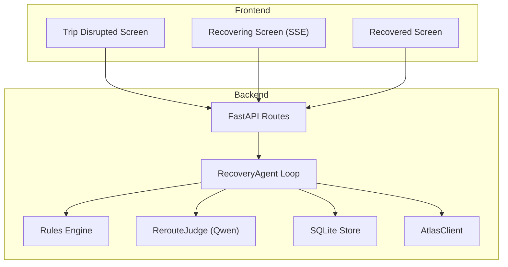
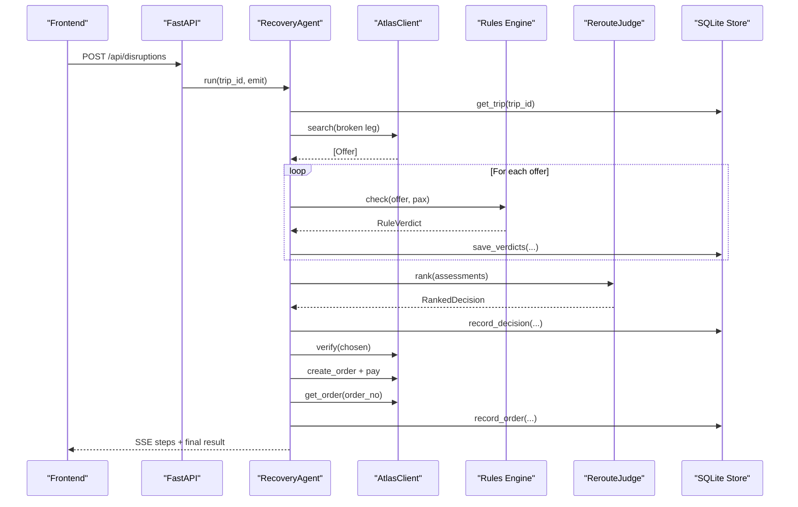
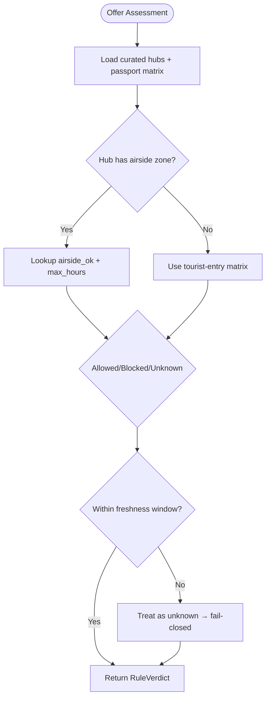
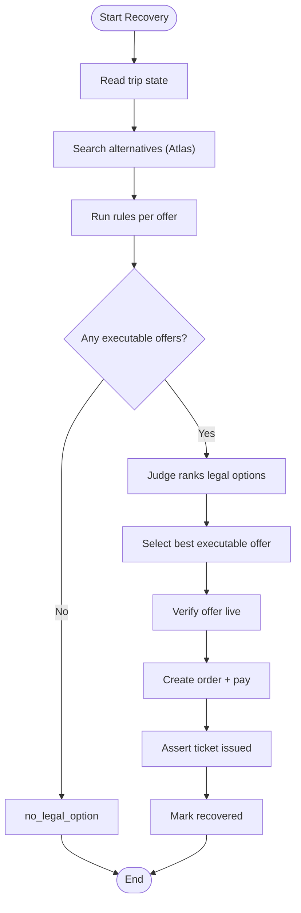
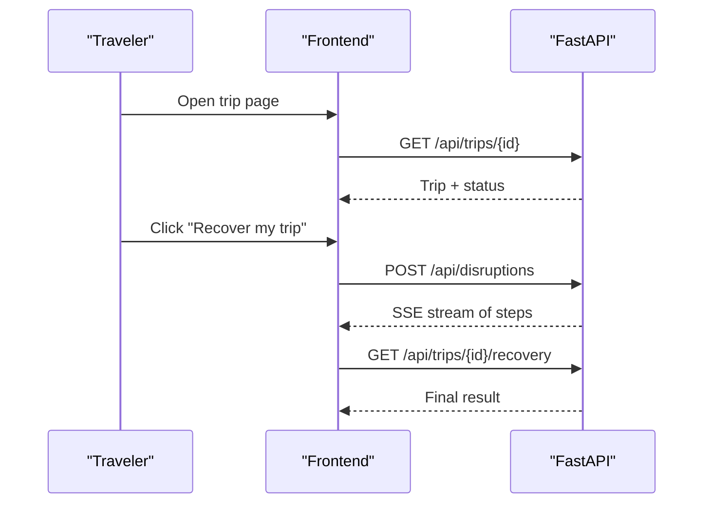
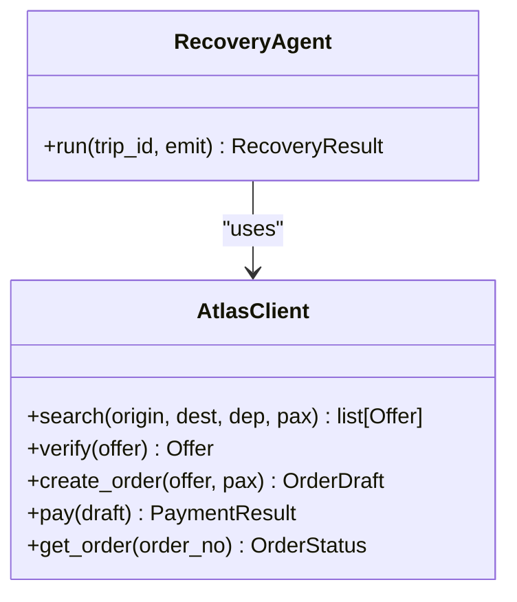
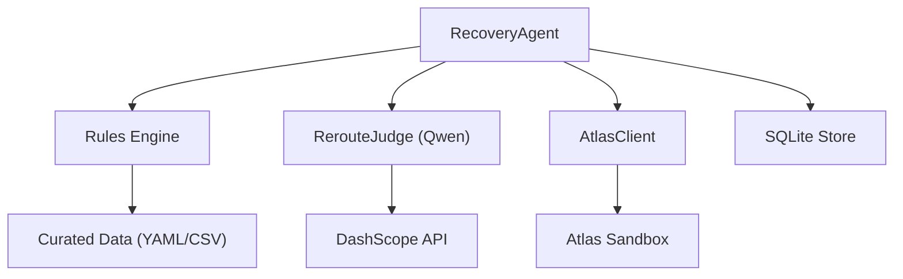

# Project Overview

<cite>
**Referenced Files in This Document**
- [01-product.md](file://docs/plans/waypoint/01-product.md)
- [02-architecture.md](file://docs/plans/waypoint/02-architecture.md)
- [03-program-design.md](file://docs/plans/waypoint/03-program-design.md)
- [04-slices.md](file://docs/plans/waypoint/04-slices.md)
- [QODER-HANDOFF.md](file://docs/plans/waypoint/QODER-HANDOFF.md)
- [0002-visa-rules-curated-approximation.md](file://docs/adr/0002-visa-rules-curated-approximation.md)
- [atlas-integration.md](file://docs/external/atlas-integration.md)
- [SKILL.md](file://skills/atlas-flight-booking/SKILL.md)
- [01-trip-disrupted.html](file://docs/plans/waypoint/mockups/01-trip-disrupted.html)
- [02-agent-recovering.html](file://docs/plans/waypoint/mockups/02-agent-recovering.html)
- [03-recovery-confirmed.html](file://docs/plans/waypoint/mockups/03-recovery-confirmed.html)
</cite>

## Table of Contents
1. [Introduction](#introduction)
2. [Project Structure](#project-structure)
3. [Core Components](#core-components)
4. [Architecture Overview](#architecture-overview)
5. [Detailed Component Analysis](#detailed-component-analysis)
6. [Dependency Analysis](#dependency-analysis)
7. [Performance Considerations](#performance-considerations)
8. [Troubleshooting Guide](#troubleshooting-guide)
9. [Conclusion](#conclusion)
10. [Appendices](#appendices)

## Introduction
Waypoint is a rules-aware rebooking engine that autonomously recovers disrupted travel for passengers whose passports limit transit rights. It solves a critical blind spot: traditional rebooking systems pick the cheapest alternative without checking whether a passenger can legally board each connection. Waypoint’s autonomous recovery agent searches alternatives, validates them against passport and trip rules, and only books options that are legal and boardable. It settles fare differences automatically (in sandbox), streams live reasoning to users, and persists an audit trail of every decision.

Key benefits:
- Autonomous settlement: deterministic fare-difference math and payment execution without LLM involvement.
- Real-time visibility: SSE stream shows search, rule checks, ranking rationale, and booking steps as they happen.
- Rules-based validation: fail-closed safety ensures unknown or blocked options never auto-book; only fully allowed offers proceed.

Conceptual overview for beginners:
- When your flight is cancelled, airlines often rebook you on the cheapest route. If that route connects through a country where your passport cannot transit, you may be denied boarding at the gate. Waypoint reads your passport and trip details, finds legal alternatives, and books one automatically—so you land safely with no surprises.

Technical overview for experienced developers:
- Backend (Python FastAPI) hosts the RecoveryAgent loop, a pluggable Rule interface, SQLite persistence, and Atlas integration. A forked atlas-flight-booking skill provides search/verify/order/pay/webhooks. Qwen ranks legal options under price/time/layover constraints and narrates decisions. Deterministic code owns rules, fare math, and execution; AI owns judgment and narration.

Success metrics and evaluation criteria:
- Primary: share of disrupted trips recovered to confirmed, rule-legal, boardable options with zero gate-denial traps booked versus a naive cheapest-first baseline. Target across seeded disruption set: 100% boardable recovery and no illegal bookings.
- Secondary: time-to-recovery and honest price gap compared to baseline.
- Judging rubric alignment: two-gate split (advise open, execute walled/fail-closed), three guards (step budget, re-read/verify before write, assert real outcome), curated visa approximation with provenance and freshness windows, and clear demo choreography showing trap vs legal reroute.

**Section sources**
- [01-product.md:3-23](file://docs/plans/waypoint/01-product.md#L3-L23)
- [02-architecture.md:1-19](file://docs/plans/waypoint/02-architecture.md#L1-L19)
- [03-program-design.md:3-7](file://docs/plans/waypoint/03-program-design.md#L3-L7)
- [03-program-design.md:151-169](file://docs/plans/waypoint/03-program-design.md#L151-L169)
- [QODER-HANDOFF.md:25-31](file://docs/plans/waypoint/QODER-HANDOFF.md#L25-L31)

## Project Structure
The repository organizes planning, architecture, and design into focused documents and mockups, plus a skills lock for the Atlas integration. The plan defines a two-half system: a Next.js/React frontend for demo screens and an SSE client, and a Python FastAPI backend hosting the recovery agent, rules engine, data loaders, and Atlas integration.

**Diagram sources**
- [02-architecture.md:13-29](file://docs/plans/waypoint/02-architecture.md#L13-L29)
- [03-program-design.md:9-32](file://docs/plans/waypoint/03-program-design.md#L9-L32)

**Section sources**
- [02-architecture.md:1-19](file://docs/plans/waypoint/02-architecture.md#L1-L19)
- [03-program-design.md:9-32](file://docs/plans/waypoint/03-program-design.md#L9-L32)
- [04-slices.md:5-33](file://docs/plans/waypoint/04-slices.md#L5-L33)

## Core Components
- RecoveryAgent: Orchestrates the bounded loop (step budget), re-reads state, searches alternatives, runs rules, invokes judge, verifies, orders, pays, asserts outcomes, and emits steps via SSE.
- Rules Engine: Pluggable Rule interface returning a 3-state verdict (allowed/blocked/unknown) with reason and provenance. v1 includes TransitVisaRule and PassportValidityRule.
- RerouteJudge: Uses Qwen to rank all assessed offers and select the best executable option while narrating rejected ones.
- Atlas Integration: Forked skill used as a library for search, verify, order, pay, and queryOrderDetails; webhook support for real disruptions.
- Data Layer: SQLite tables persist trips, segments, offers, rule_verdicts, decisions, and orders; curated transit hubs and passport matrices provide rule inputs.

Operational principles:
- Two gates: Advise gate open (AI sees all options and narrates); Execute gate walled (only fully allowed offers auto-book). Fail-closed safety blocks unknown or blocked options from autonomous execution.
- Three guards: Step budget prevents runaway loops; re-read/verify before writes avoids stale offers; assert real ticket issued before success.

**Section sources**
- [03-program-design.md:3-7](file://docs/plans/waypoint/03-program-design.md#L3-L7)
- [03-program-design.md:57-123](file://docs/plans/waypoint/03-program-design.md#L57-L123)
- [02-architecture.md:34-50](file://docs/plans/waypoint/02-architecture.md#L34-L50)
- [0002-visa-rules-curated-approximation.md:9-18](file://docs/adr/0002-visa-rules-curated-approximation.md#L9-L18)

## Architecture Overview
Waypoint’s architecture separates deterministic logic from AI judgment to ensure correctness and compliance. The backend exposes REST endpoints and an SSE stream for live reasoning. The agent loop coordinates search, rule checks, ranking, verification, ordering, payment, and outcome assertion. Data is persisted to SQLite for auditability.

**Diagram sources**
- [02-architecture.md:13-29](file://docs/plans/waypoint/02-architecture.md#L13-L29)
- [03-program-design.md:125-149](file://docs/plans/waypoint/03-program-design.md#L125-L149)

**Section sources**
- [02-architecture.md:13-50](file://docs/plans/waypoint/02-architecture.md#L13-L50)
- [03-program-design.md:125-149](file://docs/plans/waypoint/03-program-design.md#L125-L149)

## Detailed Component Analysis

### Rules Engine and Visa Approximation
The rules engine implements a pluggable protocol where each rule returns a 3-state verdict (allowed/blocked/unknown) with reason and provenance. The hero rule, TransitVisaRule, consults a curated table keyed by hub and nationality, distinguishing airside transit zones and hour thresholds. Missing or stale cells resolve to unknown and block autonomous execution (fail-closed). PassportValidityRule enforces entry requirements based on passport expiry.

**Diagram sources**
- [03-program-design.md:34-48](file://docs/plans/waypoint/03-program-design.md#L34-L48)
- [0002-visa-rules-curated-approximation.md:9-18](file://docs/adr/0002-visa-rules-curated-approximation.md#L9-L18)

**Section sources**
- [03-program-design.md:57-96](file://docs/plans/waypoint/03-program-design.md#L57-L96)
- [0002-visa-rules-curated-approximation.md:9-18](file://docs/adr/0002-visa-rules-curated-approximation.md#L9-L18)

### Recovery Agent Loop and Guards
The RecoveryAgent orchestrates the end-to-end recovery flow with strict guards:
- Step budget: bounded iterations to prevent runaway loops.
- Re-read world: always fetch current trip state before acting.
- Verify before write: re-check offer availability and price via Atlas verify.
- Assert outcome: confirm PNR and ticket issuance before marking success.

**Diagram sources**
- [03-program-design.md:125-149](file://docs/plans/waypoint/03-program-design.md#L125-L149)
- [02-architecture.md:34-50](file://docs/plans/waypoint/02-architecture.md#L34-L50)

**Section sources**
- [03-program-design.md:125-149](file://docs/plans/waypoint/03-program-design.md#L125-L149)
- [02-architecture.md:34-50](file://docs/plans/waypoint/02-architecture.md#L34-L50)

### Frontend Screens and User Flow
The frontend presents three demo screens driven by SSE events:
- Trip Disrupted: Shows the booked itinerary with a cancelled leg and traveler passport context.
- Recovering: Streams agent steps, lists alternatives with rule verdicts, highlights chosen legal reroute.
- Recovered: Compares rejected cheapest vs chosen legal, shows auto-settled fare difference and ticket confirmation.

**Diagram sources**
- [02-architecture.md:13-29](file://docs/plans/waypoint/02-architecture.md#L13-L29)
- [01-trip-disrupted.html:28-48](file://docs/plans/waypoint/mockups/01-trip-disrupted.html#L28-L48)
- [02-agent-recovering.html:30-60](file://docs/plans/waypoint/mockups/02-agent-recovering.html#L30-L60)
- [03-recovery-confirmed.html:31-57](file://docs/plans/waypoint/mockups/03-recovery-confirmed.html#L31-L57)

**Section sources**
- [01-trip-disrupted.html:28-48](file://docs/plans/waypoint/mockups/01-trip-disrupted.html#L28-L48)
- [02-agent-recovering.html:30-60](file://docs/plans/waypoint/mockups/02-agent-recovering.html#L30-L60)
- [03-recovery-confirmed.html:31-57](file://docs/plans/waypoint/mockups/03-recovery-confirmed.html#L31-L57)

### Atlas Integration and Autonomy
Waypoint integrates with the Atlas Flight Booking Skill via a forked library to enable sandbox-only auto-approval for price/payment checkpoints. The integration supports search, verify, order, pay, and queryOrderDetails, plus webhook/incident triggers. Ticketing activation is pending in UAT; until then, slice 5 uses stubbed booking to keep the pipeline end-to-end.

**Diagram sources**
- [03-program-design.md:116-123](file://docs/plans/waypoint/03-program-design.md#L116-L123)
- [atlas-integration.md:5-21](file://docs/external/atlas-integration.md#L5-L21)

**Section sources**
- [atlas-integration.md:5-37](file://docs/external/atlas-integration.md#L5-L37)
- [03-program-design.md:116-123](file://docs/plans/waypoint/03-program-design.md#L116-L123)

## Dependency Analysis
Waypoint’s dependencies include:
- Atlas sandbox via forked skill for flight search and booking operations.
- Qwen via Alibaba DashScope for reroute ranking and narration.
- Curated data files for transit hubs, passport index, and IATA mapping.
- SQLite for persistence of trips, offers, rule verdicts, decisions, and orders.

**Diagram sources**
- [02-architecture.md:51-55](file://docs/plans/waypoint/02-architecture.md#L51-L55)
- [03-program-design.md:21-29](file://docs/plans/waypoint/03-program-design.md#L21-L29)

**Section sources**
- [02-architecture.md:51-55](file://docs/plans/waypoint/02-architecture.md#L51-L55)
- [03-program-design.md:21-29](file://docs/plans/waypoint/03-program-design.md#L21-L29)

## Performance Considerations
- Deterministic core: Rules, fare math, and execution are plain code to avoid LLM latency and penalties.
- Bounded loops: Step budget prevents excessive processing and ensures graceful give-up.
- Live verification: Re-check offers before booking to avoid stale pricing and availability.
- Curated data efficiency: Hub/nationality lookup is O(1) per layover; freshness windows reduce risk without live lookups.
- SSE streaming: Real-time updates minimize polling overhead and improve user experience.

[No sources needed since this section provides general guidance]

## Troubleshooting Guide
Common issues and resolutions:
- No legal option: All offers blocked or unknown due to missing/curated data or freshness window. Review curated hubs and passport matrix entries; consider override path.
- Stale offers: Verify step must succeed; if prices change, log old/new and retry or abort.
- Ticketing not active: Until UAT activates ticketing, use stubbed booking to keep pipeline functional; monitor module activation progress.
- Webhook payload shape: Unknown until real incident fires; rely on injected trigger for demo reliability.
- Step budget exceeded: Agent gives up gracefully; review rule coverage and data freshness.

**Section sources**
- [03-program-design.md:173-179](file://docs/plans/waypoint/03-program-design.md#L173-L179)
- [atlas-integration.md:26-37](file://docs/external/atlas-integration.md#L26-L37)

## Conclusion
Waypoint addresses a critical gap in airline rebooking by embedding passport-aware rules into autonomous recovery. Its two-gate design ensures AI advises freely while code enforces fail-closed safety. The agent’s three guards protect against stale data and runaway loops, and its curated visa approximation is transparent about limitations. With real-time visibility and automated settlement, Waypoint delivers reliable, legal recoveries that prevent gate denials and stranded travelers.

[No sources needed since this section summarizes without analyzing specific files]

## Appendices

### Practical Examples
- Flight cancellation scenario: A SIN→NRT flight is cancelled. The cheapest alternative routes through SGN (Vietnam) but requires a visa for self-transfer. Waypoint flags it as blocked and selects ICN (South Korea) where airside transit is allowed for the traveler’s passport. Fare difference is auto-settled, and a ticket is issued.
- Passport validity catch: If a passport expires within six months, the PassportValidityRule blocks entry, preventing risky bookings even if transit rules pass.

**Section sources**
- [01-product.md:3-11](file://docs/plans/waypoint/01-product.md#L3-L11)
- [03-program-design.md:151-169](file://docs/plans/waypoint/03-program-design.md#L151-L169)
- [02-agent-recovering.html:42-59](file://docs/plans/waypoint/mockups/02-agent-recovering.html#L42-L59)
- [03-recovery-confirmed.html:35-57](file://docs/plans/waypoint/mockups/03-recovery-confirmed.html#L35-L57)

### Success Metrics and Evaluation Criteria
- Primary metric: Share of disrupted trips recovered to confirmed, rule-legal, boardable options with zero gate-denial traps booked versus naive cheapest-first baseline.
- Secondary metrics: Time-to-recovery and honest price gap compared to baseline.
- Rubric alignment: Two-gate split, three guards, curated visa approximation with provenance, and demo choreography demonstrating trap vs legal reroute.

**Section sources**
- [01-product.md:20-23](file://docs/plans/waypoint/01-product.md#L20-L23)
- [QODER-HANDOFF.md:25-31](file://docs/plans/waypoint/QODER-HANDOFF.md#L25-L31)