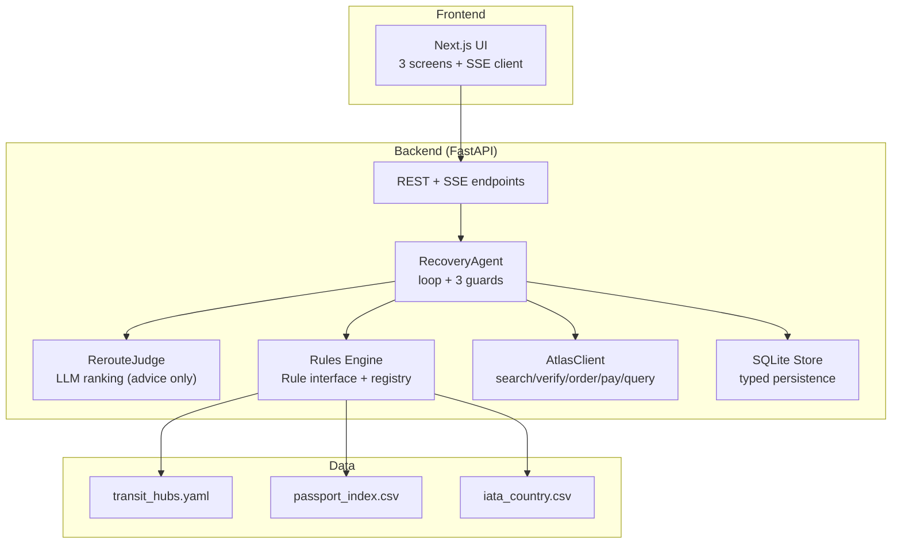
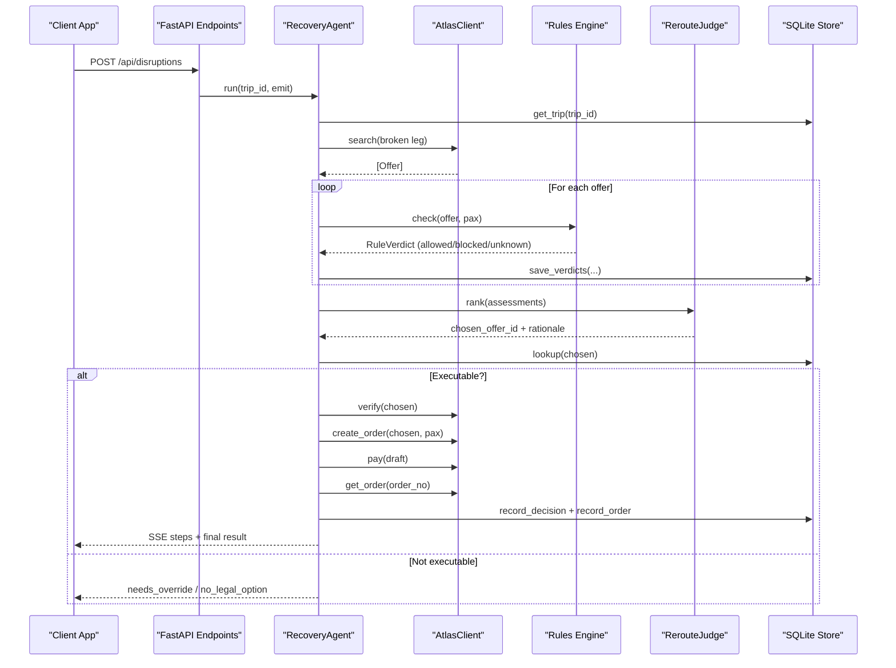
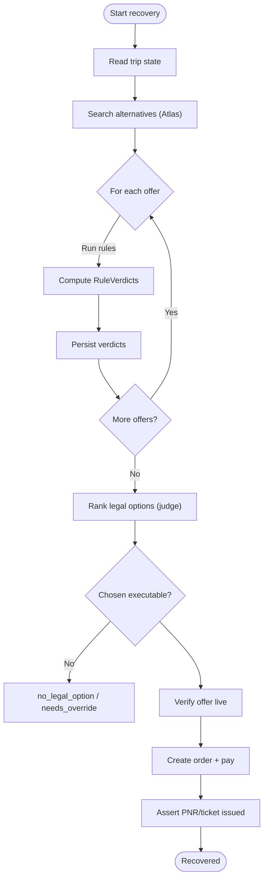
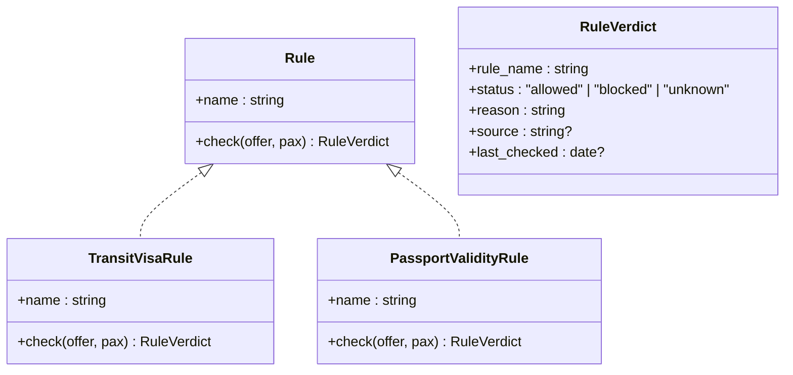
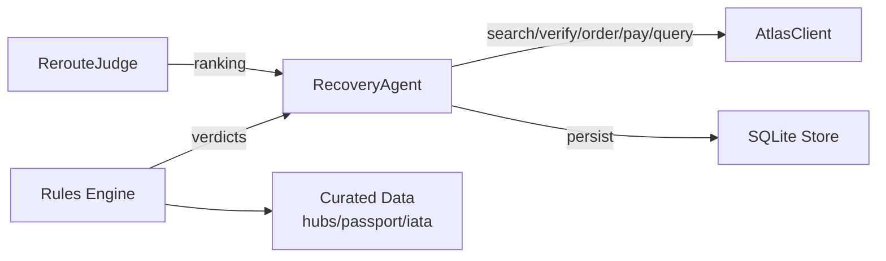

# Solution Overview & Key Features

<cite>
**Referenced Files in This Document**
- [01-product.md](file://docs/plans/waypoint/01-product.md)
- [02-architecture.md](file://docs/plans/waypoint/02-architecture.md)
- [03-program-design.md](file://docs/plans/waypoint/03-program-design.md)
- [0002-visa-rules-curated-approximation.md](file://docs/adr/0002-visa-rules-curated-approximation.md)
- [QODER-HANDOFF.md](file://docs/plans/waypoint/QODER-HANDOFF.md)
- [01-trip-disrupted.html](file://docs/plans/waypoint/mockups/01-trip-disrupted.html)
- [02-agent-recovering.html](file://docs/plans/waypoint/mockups/02-agent-recovering.html)
- [03-recovery-confirmed.html](file://docs/plans/waypoint/mockups/03-recovery-confirmed.html)
</cite>

## Table of Contents
1. [Introduction](#introduction)
2. [Project Structure](#project-structure)
3. [Core Components](#core-components)
4. [Architecture Overview](#architecture-overview)
5. [Detailed Component Analysis](#detailed-component-analysis)
6. [Dependency Analysis](#dependency-analysis)
7. [Performance Considerations](#performance-considerations)
8. [Troubleshooting Guide](#troubleshooting-guide)
9. [Conclusion](#conclusion)
10. [Appendices](#appendices)

## Introduction
Waypoint is a rules-aware rebooking engine that fundamentally differs from existing solutions by checking trip rules before booking, not just price. When a flight breaks, Waypoint re-plans across real alternatives and validates each option against legal requirements derived from the passenger’s passport and itinerary. The result is autonomous recovery that avoids gate-denial traps and completes bookings without human intervention when safe to do so.

Key differentiators:
- Rules-first evaluation: every alternative is checked for compliance with transit and entry rules before it can be booked.
- Passport-aware: the engine reads the traveler’s passport details (nationality, expiry) and applies them to each candidate route.
- Two live rules in v1: transit-visa eligibility (airside vs landside transit) and passport 6-month validity requirement.
- Extensible rule framework: designed to add future rules such as onward-ticket requirements, health/vaccination entry, minimum connection times, loyalty protection, corporate policies, and carbon budgets.
- Autonomous settlement: fare differences are computed and settled deterministically; bookings complete automatically when all rules allow.
- Real-time visibility: an SSE stream exposes the agent’s reasoning process to users during recovery.

This section focuses on how the rules-aware rebooking engine works, its fail-closed safety model, and the two live rules in v1.

**Section sources**
- [01-product.md:8-18](file://docs/plans/waypoint/01-product.md#L8-L18)
- [02-architecture.md:6-11](file://docs/plans/waypoint/02-architecture.md#L6-L11)

## Project Structure
The project is organized into a small, focused backend (Python FastAPI), a Next.js frontend, and SQLite-backed persistence. The core logic lives in the backend under agent orchestration, a pluggable rules engine, and Atlas integration. Data files include curated transit-hub tables and passport matrices used by the rules engine.

**Diagram sources**
- [02-architecture.md:6-11](file://docs/plans/waypoint/02-architecture.md#L6-L11)
- [03-program-design.md:10-32](file://docs/plans/waypoint/03-program-design.md#L10-L32)

**Section sources**
- [02-architecture.md:6-11](file://docs/plans/waypoint/02-architecture.md#L6-L11)
- [03-program-design.md:10-32](file://docs/plans/waypoint/03-program-design.md#L10-L32)

## Core Components
- Rules-aware rebooking engine: A deterministic loop that searches alternatives, runs rules, ranks legal options, verifies availability, orders and pays, then asserts outcomes. It enforces a fail-closed safety wall at execution time.
- Rule framework: A pluggable Rule protocol returning a three-state verdict (allowed, blocked, unknown) with reason and provenance. v1 includes TransitVisaRule and PassportValidityRule.
- Recovery agent: Orchestrates steps with a step budget, re-reads state before writes, and ensures no illegal or unknown options are auto-booked.
- Atlas integration: Wraps search, verify, order, pay, and outcome assertion via a forked skill library configured for sandbox use.
- Persistence: SQLite tables capture offers, rule verdicts, decisions, and orders for auditability and compliance.

Key behaviors:
- Advise gate open: the judge sees all options and narrates why cheap-but-illegal ones are rejected.
- Execute gate walled: only offers where every rule is allowed proceed to autonomous booking and settlement.
- Staleness guard: live re-verification before booking; curated data freshness windows govern visa rule trust.

**Section sources**
- [03-program-design.md:3-7](file://docs/plans/waypoint/03-program-design.md#L3-L7)
- [03-program-design.md:57-123](file://docs/plans/waypoint/03-program-design.md#L57-L123)
- [02-architecture.md:21-30](file://docs/plans/waypoint/02-architecture.md#L21-L30)

## Architecture Overview
The system exposes REST endpoints to seed trips, inject disruptions, retrieve recovery results, and stream agent reasoning via Server-Sent Events. The main flow triggers on disruption, runs the agent loop with bounded steps, and persists evidence of correct reasoning.

**Diagram sources**
- [02-architecture.md:13-19](file://docs/plans/waypoint/02-architecture.md#L13-L19)
- [02-architecture.md:34-49](file://docs/plans/waypoint/02-architecture.md#L34-L49)
- [03-program-design.md:125-149](file://docs/plans/waypoint/03-program-design.md#L125-L149)

**Section sources**
- [02-architecture.md:13-19](file://docs/plans/waypoint/02-architecture.md#L13-L19)
- [02-architecture.md:34-49](file://docs/plans/waypoint/02-architecture.md#L34-L49)
- [03-program-design.md:125-149](file://docs/plans/waypoint/03-program-design.md#L125-L149)

## Detailed Component Analysis

### Rules-Aware Rebooking Engine
The engine is a small, deterministic loop with three built-in guards:
- Step budget: limits iterations to prevent runaway loops.
- Re-read/verify: always refreshes world state and verifies offers before writing.
- Assert outcome: confirms ticket issuance rather than assuming success.

It integrates:
- Search for alternatives via Atlas.
- Run all active rules per offer to produce a three-state verdict.
- Rank legal options using the judge (LLM) for narrative and selection among allowed offers.
- Execute only when all rules allow (fail-closed).

**Diagram sources**
- [03-program-design.md:125-149](file://docs/plans/waypoint/03-program-design.md#L125-L149)
- [02-architecture.md:34-49](file://docs/plans/waypoint/02-architecture.md#L34-L49)

**Section sources**
- [03-program-design.md:125-149](file://docs/plans/waypoint/03-program-design.md#L125-L149)
- [02-architecture.md:34-49](file://docs/plans/waypoint/02-architecture.md#L34-L49)

### Live Rules in v1
- Transit-visa eligibility: distinguishes airside vs landside transit per hub and nationality, using a curated table with freshness windows and fallback to tourist-entry matrix when necessary. Missing or stale data resolves to unknown and blocks autonomous execution.
- Passport 6-month validity: checks passport expiry against entry requirements; rejects options if the passport expires too soon.

These rules implement the Rule protocol and return a three-state verdict with reason and provenance.

**Diagram sources**
- [03-program-design.md:57-96](file://docs/plans/waypoint/03-program-design.md#L57-L96)
- [0002-visa-rules-curated-approximation.md:10-18](file://docs/adr/0002-visa-rules-curated-approximation.md#L10-L18)

**Section sources**
- [01-product.md:13-18](file://docs/plans/waypoint/01-product.md#L13-L18)
- [03-program-design.md:57-96](file://docs/plans/waypoint/03-program-design.md#L57-L96)
- [0002-visa-rules-curated-approximation.md:10-18](file://docs/adr/0002-visa-rules-curated-approximation.md#L10-L18)

### Extensible Rule Framework
The Rule interface and registry enable adding new rules without changing core logic. Future rules may include:
- Onward-ticket or proof-of-return requirements
- Health/vaccination entry requirements
- Minimum connection times enforced by airline policy
- Loyalty/alliance protection constraints
- Corporate policy and budget caps
- Carbon budget constraints

Each rule returns a three-state verdict, enabling consistent handling of uncertainty and fail-closed behavior.

**Section sources**
- [01-product.md:11-18](file://docs/plans/waypoint/01-product.md#L11-L18)
- [03-program-design.md:57-69](file://docs/plans/waypoint/03-program-design.md#L57-L69)

### Autonomous Settlement
Fare differences are computed deterministically and settled automatically in sandbox mode. The agent:
- Verifies the chosen offer live before ordering
- Creates an order and pays (auto-approve in sandbox)
- Asserts the real outcome (PNR and ticket issued)
- Persists decision and order records for audit

This ensures bookings complete without human intervention while maintaining safety through fail-closed execution.

**Section sources**
- [02-architecture.md:43-47](file://docs/plans/waypoint/02-architecture.md#L43-L47)
- [03-program-design.md:138-147](file://docs/plans/waypoint/03-program-design.md#L138-L147)

### Real-Time Visibility
An SSE stream emits every step of the agent’s reasoning to the frontend, including:
- Detection of cancellation
- Alternatives found and counts
- Live verification status
- Rule checks per offer
- Rationale for selections and rejections
- Settlement and ticket assertion

This provides transparency and builds trust during recovery.

**Section sources**
- [02-architecture.md:13-19](file://docs/plans/waypoint/02-architecture.md#L13-L19)
- [02-architecture.md:34-49](file://docs/plans/waypoint/02-architecture.md#L34-L49)

## Dependency Analysis
The system has clear separation between deterministic code and AI-assisted judgment:
- Deterministic code owns rules checks, fare-difference math, order/pay execution, and outcome assertion.
- LLM (Qwen) owns reroute judgment among legal options and provides narrative rationale.
- Atlas integration is wrapped by a client that maps domain types and uses sandbox configuration.
- Curated data (transit hubs, passport index, IATA mapping) feeds the rules engine.

**Diagram sources**
- [02-architecture.md:6-11](file://docs/plans/waypoint/02-architecture.md#L6-L11)
- [03-program-design.md:10-32](file://docs/plans/waypoint/03-program-design.md#L10-L32)

**Section sources**
- [02-architecture.md:6-11](file://docs/plans/waypoint/02-architecture.md#L6-L11)
- [03-program-design.md:10-32](file://docs/plans/waypoint/03-program-design.md#L10-L32)

## Performance Considerations
- Bounded agent loop: step budget prevents excessive processing and ensures timely recovery.
- Minimal LLM usage: only for ranking and narration, avoiding performance penalties in deterministic paths.
- Efficient rule evaluation: preloaded curated data reduces latency during checks.
- Live verification: performed once per chosen offer to avoid repeated expensive calls.

[No sources needed since this section provides general guidance]

## Troubleshooting Guide
Common issues and safeguards:
- No legal option: if all offers are blocked or unknown, the agent reports no_legal_option and surfaces reasons.
- Needs override: if the chosen offer is not executable, the agent stops and requires explicit human override.
- Stale data: curated cells past freshness windows resolve to unknown, blocking autonomous execution.
- Ticket assertion failure: if outcome cannot be confirmed, the agent does not mark recovery as successful.

Operational tips:
- Ensure demo routes use curated hubs to guarantee completion.
- Validate that step budget is sufficient for complex scenarios.
- Monitor SSE stream for detailed reasoning and error context.

**Section sources**
- [03-program-design.md:151-167](file://docs/plans/waypoint/03-program-design.md#L151-L167)
- [0002-visa-rules-curated-approximation.md:14-18](file://docs/adr/0002-visa-rules-curated-approximation.md#L14-L18)

## Conclusion
Waypoint’s rules-aware rebooking engine delivers autonomous recovery that prioritizes legality over price. With two live rules in v1 and an extensible framework for future rules, it prevents gate-denial traps and completes bookings safely through fail-closed execution. Real-time visibility into the agent’s reasoning enhances trust and transparency, while deterministic safeguards ensure correctness and compliance.

[No sources needed since this section summarizes without analyzing specific files]

## Appendices

### User Flow Screens
- Trip disrupted screen shows the canceled leg and traveler passport context.
- Recovering screen streams agent steps and displays option verdicts.
- Recovery confirmed screen compares naive cheapest vs legal reroute, shows fare difference settlement, and confirms ticket issuance.

**Section sources**
- [01-trip-disrupted.html:28-48](file://docs/plans/waypoint/mockups/01-trip-disrupted.html#L28-L48)
- [02-agent-recovering.html:30-61](file://docs/plans/waypoint/mockups/02-agent-recovering.html#L30-L61)
- [03-recovery-confirmed.html:31-57](file://docs/plans/waypoint/mockups/03-recovery-confirmed.html#L31-L57)